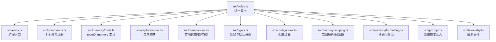
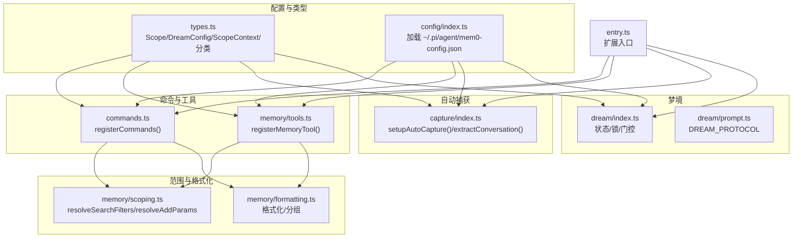
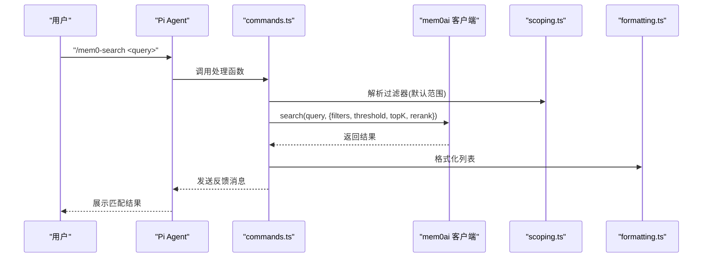
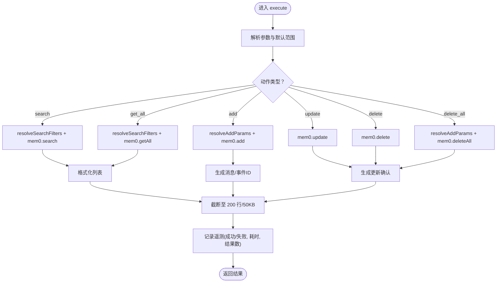
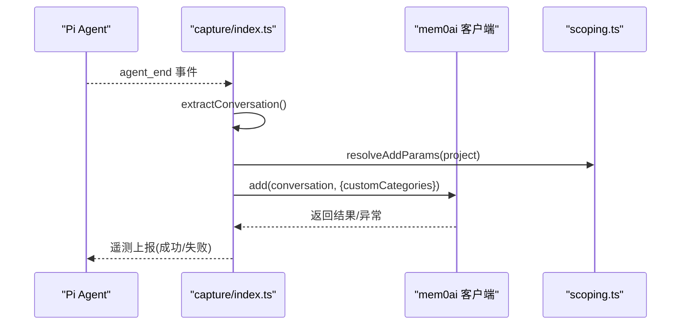
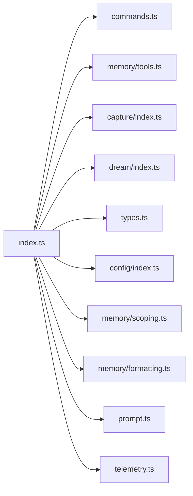

# Pi Agent 插件

<cite>
**本文引用的文件**
- [README.md](file://integrations/pi-agent-plugin/README.md)
- [package.json](file://integrations/pi-agent-plugin/package.json)
- [src/index.ts](file://integrations/pi-agent-plugin/src/index.ts)
- [src/types.ts](file://integrations/pi-agent-plugin/src/types.ts)
- [src/commands.ts](file://integrations/pi-agent-plugin/src/commands.ts)
- [src/memory/tools.ts](file://integrations/pi-agent-plugin/src/memory/tools.ts)
- [src/capture/index.ts](file://integrations/pi-agent-plugin/src/capture/index.ts)
- [src/dream/index.ts](file://integrations/pi-agent-plugin/src/dream/index.ts)
</cite>

## 目录
1. [简介](#简介)
2. [项目结构](#项目结构)
3. [核心组件](#核心组件)
4. [架构总览](#架构总览)
5. [详细组件分析](#详细组件分析)
6. [依赖关系分析](#依赖关系分析)
7. [性能考量](#性能考量)
8. [故障排查指南](#故障排查指南)
9. [结论](#结论)
10. [附录](#附录)

## 简介
本文件面向在 Pi Agent 智能体框架中集成 Mem0 的开发者与使用者，系统性说明 Pi Agent 插件的架构设计、命令体系与记忆管理能力。该插件为 Pi Agent 提供跨会话、跨项目、跨设备的持久化语义记忆，支持自动捕获对话内容、按范围检索与管理记忆，并通过“做白日梦”（Dream）流程进行去重、消解矛盾与清理陈旧条目。同时，插件提供 8 个命令与一个可被智能体调用的工具接口，便于用户与代理共同完成记忆的搜索、新增、更新、删除与状态查询。

## 项目结构
Pi Agent 插件采用模块化组织方式，核心入口导出统一的扩展对象，内部按职责划分为命令注册、工具注册、自动捕获、范围解析与格式化、梦境（Consolidation）控制等模块。

图表来源
- [src/index.ts:1-35](file://integrations/pi-agent-plugin/src/index.ts#L1-L35)

章节来源
- [README.md:116-134](file://integrations/pi-agent-plugin/README.md#L116-L134)
- [package.json:41-48](file://integrations/pi-agent-plugin/package.json#L41-L48)

## 核心组件
- 统一导出与入口
  - 通过入口文件集中导出类型、配置加载、工具注册、范围解析、格式化、自动捕获、梦境控制、系统提示与命令注册等能力，便于外部以单一导入点接入。
- 配置与类型
  - 定义记忆范围（project/session/global）、Dream 配置、Scope 上下文、自定义分类等核心类型；提供默认自定义分类集合。
- 命令系统
  - 注册 8 个 Slash 命令：记忆新增、删除、搜索、浏览、做白日梦、固定、切换范围、状态查询；每个命令均具备交互式确认、阈值控制与格式化输出。
- 记忆工具
  - 注册名为 mem0_memory 的工具，支持 search/add/get_all/update/delete/delete_all 动作，参数严格校验，输出截断保护，带遥测统计。
- 自动捕获
  - 在会话结束时自动提取对话文本，按项目范围写入记忆，支持错误安全与遥测上报。
- 梦境控制
  - 实现时间门控、会话数门控、记忆数量门控与进程级锁，确保 Dream 流程不会并发执行且满足最小触发条件。

章节来源
- [src/index.ts:10-35](file://integrations/pi-agent-plugin/src/index.ts#L10-L35)
- [src/types.ts:1-54](file://integrations/pi-agent-plugin/src/types.ts#L1-54)
- [src/commands.ts:14-340](file://integrations/pi-agent-plugin/src/commands.ts#L14-L340)
- [src/memory/tools.ts:130-196](file://integrations/pi-agent-plugin/src/memory/tools.ts#L130-L196)
- [src/capture/index.ts:39-71](file://integrations/pi-agent-plugin/src/capture/index.ts#L39-L71)
- [src/dream/index.ts:52-116](file://integrations/pi-agent-plugin/src/dream/index.ts#L52-L116)

## 架构总览
Pi Agent 插件围绕“配置—范围—工具/命令—自动捕获—梦境”的闭环工作流构建。配置决定默认范围、阈值、是否自动捕获与 Dream 行为；范围解析将用户意图映射到具体过滤器；工具与命令提供统一的记忆操作入口；自动捕获在会话尾声把对话转化为记忆；梦境在满足门控条件下进行去重与清理。

图表来源
- [src/index.ts:18-28](file://integrations/pi-agent-plugin/src/index.ts#L18-L28)
- [src/commands.ts:28-37](file://integrations/pi-agent-plugin/src/commands.ts#L28-L37)
- [src/memory/tools.ts:47-128](file://integrations/pi-agent-plugin/src/memory/tools.ts#L47-L128)
- [src/capture/index.ts:39-71](file://integrations/pi-agent-plugin/src/capture/index.ts#L39-L71)
- [src/dream/index.ts:52-116](file://integrations/pi-agent-plugin/src/dream/index.ts#L52-L116)

## 详细组件分析

### 命令系统（8 个 Slash 命令）
- 命令注册与交互
  - 使用 Pi Agent 的命令注册机制，为每个命令提供描述与处理器；对空参数进行提示，对多匹配项提供选择或确认流程，保证操作安全。
- 搜索与阈值
  - 搜索使用语义相似度与重排序，阈值由配置决定；结果列表经格式化输出，支持紧凑视图与完整列表。
- 删除与固定
  - 删除前进行确认对话框；固定通过在记忆文本前缀标记实现，避免被 Dream 清理。
- 范围切换与状态
  - 支持在会话内切换默认范围；状态命令汇总连接性、身份、项目、会话、默认范围、阈值、项目记忆数、自动捕获与 Dream 开关等信息。

图表来源
- [src/commands.ts:120-146](file://integrations/pi-agent-plugin/src/commands.ts#L120-L146)
- [src/memory/scoping.ts](file://integrations/pi-agent-plugin/src/memory/scoping.ts)
- [src/memory/formatting.ts](file://integrations/pi-agent-plugin/src/memory/formatting.ts)

章节来源
- [src/commands.ts:39-340](file://integrations/pi-agent-plugin/src/commands.ts#L39-L340)

### 记忆工具（mem0_memory）
- 工具定义与参数
  - 工具名称为 mem0_memory，支持动作：search、add、get_all、update、delete、delete_all；参数含 action、query/content/memory_id/scope；默认使用项目范围。
- 执行逻辑
  - 根据动作路由到对应分支，统一进行超时/取消检查；返回内容按最大行数与字节限制截断；成功/失败均记录遥测指标。
- 输出与细节
  - 返回内容数组与详情对象，详情包含匹配数、总数、事件 ID、状态、内存 ID 等，便于上层展示与追踪。

图表来源
- [src/memory/tools.ts:47-196](file://integrations/pi-agent-plugin/src/memory/tools.ts#L47-L196)

章节来源
- [src/memory/tools.ts:130-196](file://integrations/pi-agent-plugin/src/memory/tools.ts#L130-L196)

### 自动捕获（会话结束时）
- 触发时机
  - 监听 agent_end 事件，在会话结束时提取对话内容。
- 内容提取
  - 从消息中抽取文本片段，仅保留角色为 user/assistant 且内容可解析为字符串的消息。
- 写入记忆
  - 使用项目范围参数写入记忆，附带默认自定义分类；异常被捕获并记录遥测。

图表来源
- [src/capture/index.ts:39-71](file://integrations/pi-agent-plugin/src/capture/index.ts#L39-L71)

章节来源
- [src/capture/index.ts:24-71](file://integrations/pi-agent-plugin/src/capture/index.ts#L24-L71)

### 梦境（Consolidation）控制
- 门控策略
  - 时间门控：自上次合并以来的小时数需达到阈值；
  - 会话门控：自上次合并以来的会话数需达到阈值；
  - 记忆门控：当前记忆总数需达到阈值。
- 锁机制
  - 进程级锁文件，超过一定时间未释放则视为过期；同一时刻仅允许一次合并任务。
- 状态记录
  - 记录最近合并时间、会话计数清零、最后会话 ID 清空，用于下次门控判断。

```mermaid
flowchart TD
Enter(["开始 Dream"]) --> Lock["尝试获取锁(60分钟过期)"]
Lock --> |失败| Abort["已有进行中的合并，退出"]
Lock --> |成功| Read["读取状态(时间/会话计数)"]
Read --> Gates["检查门控(时间/会话/记忆)"]
Gates --> |不满足| Abort
Gates --> |满足| Merge["执行合并(去重/消解/清理)"]
Merge --> Record["记录合并完成(重置计数)"]
Record --> Release["释放锁"]
Abort --> Release
```

图表来源
- [src/dream/index.ts:52-116](file://integrations/pi-agent-plugin/src/dream/index.ts#L52-L116)

章节来源
- [src/dream/index.ts:1-116](file://integrations/pi-agent-plugin/src/dream/index.ts#L1-L116)

### 类型与默认分类
- Scope 与 DreamConfig
  - Scope 包含 project/session/global；DreamConfig 控制是否启用、是否自动、最小小时数、最小会话数、最小记忆数。
- ScopeContext
  - 用户 ID、应用 ID（通常来自 Git 根目录）、运行 ID（会话标识）。
- 默认自定义分类
  - 提供 10 个通用分类键值对，用于记忆的自动分类与检索。

章节来源
- [src/types.ts:1-54](file://integrations/pi-agent-plugin/src/types.ts#L1-L54)

## 依赖关系分析
- 外部依赖
  - Pi Agent SDK：命令注册、工具注册、事件监听、UI 交互（通知、确认、选择）。
  - mem0ai：语义搜索、新增、更新、删除、全量查询、导出等记忆操作。
  - TypeBox：工具参数的类型校验。
- 内部模块耦合
  - commands.ts 与 memory/tools.ts 共同依赖 scoping.ts 与 formatting.ts，形成“范围—过滤器—格式化”的数据通路。
  - capture/index.ts 与 dream/index.ts 分别独立运行，分别负责“输入”和“整理”，互不干扰。
- 导出与入口
  - src/index.ts 作为统一出口，集中导出各模块能力，降低外部依赖复杂度。

图表来源
- [src/index.ts:10-35](file://integrations/pi-agent-plugin/src/index.ts#L10-L35)

章节来源
- [package.json:55-79](file://integrations/pi-agent-plugin/package.json#L55-L79)
- [src/index.ts:10-35](file://integrations/pi-agent-plugin/src/index.ts#L10-L35)

## 性能考量
- 搜索与重排
  - 搜索默认开启重排以提升排序精度，但可能增加延迟；可根据场景调整阈值与 topK。
- 输出截断
  - 工具输出限制为 200 行与 50KB，避免大体量响应影响交互体验。
- 自动捕获
  - 仅在会话结束时批量写入，减少频繁 IO；异常不影响主流程。
- 梦境门控
  - 通过时间、会话与记忆数量三道门控避免频繁合并，降低资源占用。

## 故障排查指南
- 命令无响应或报错
  - 检查配置文件与环境变量是否正确设置；确认 API Key 是否有效；查看状态命令输出的连接状态。
- 删除/固定确认未弹窗
  - 确认 UI 层支持 confirm/select；若为非交互环境，建议改用工具接口或命令的单选模式。
- 搜索结果为空
  - 适当降低搜索阈值；确认默认范围是否正确；尝试全局范围搜索。
- 自动捕获失败
  - 查看遥测事件中的错误类型；检查网络连通性与权限；确认会话消息中存在可提取文本。
- 梦境未触发
  - 检查门控条件（时间、会话数、记忆数）；确认锁文件是否残留；必要时手动释放锁后重试。

章节来源
- [src/commands.ts:75-118](file://integrations/pi-agent-plugin/src/commands.ts#L75-L118)
- [src/memory/tools.ts:55-127](file://integrations/pi-agent-plugin/src/memory/tools.ts#L55-L127)
- [src/capture/index.ts:56-69](file://integrations/pi-agent-plugin/src/capture/index.ts#L56-L69)
- [src/dream/index.ts:83-107](file://integrations/pi-agent-plugin/src/dream/index.ts#L83-L107)

## 结论
Pi Agent 插件通过清晰的模块划分与严格的门控机制，实现了稳定可靠的持久化语义记忆能力。命令与工具双通道覆盖了日常记忆管理需求，自动捕获与梦境整理保障了知识库的质量与一致性。结合默认分类与范围控制，用户可在不同场景下灵活使用记忆能力，提升智能体的上下文连续性与个性化水平。

## 附录

### 安装与配置
- 获取 API Key 并安装插件
  - 在平台注册并复制 API Key；
  - 使用 Pi 的包管理器安装插件包。
- 设置配置文件
  - 可在用户主目录的特定路径创建配置文件，设置 API Key、用户 ID、自动捕获开关、默认范围、搜索阈值以及 Dream 参数。
- 环境变量优先
  - 环境变量会覆盖配置文件中的对应字段。

章节来源
- [README.md:18-60](file://integrations/pi-agent-plugin/README.md#L18-L60)
- [package.json:41-48](file://integrations/pi-agent-plugin/package.json#L41-L48)

### 命令速览与用途
- /mem0-remember：按默认范围新增一条记忆，适合保存事实类信息。
- /mem0-forget：按默认范围搜索并删除匹配的记忆，支持单选与确认。
- /mem0-search：按默认范围进行语义搜索，返回匹配列表。
- /mem0-tour：按指定范围浏览全部记忆并按分类分组展示。
- /mem0-dream：触发合并流程，去重、消解矛盾、清理陈旧条目。
- /mem0-pin：将某条记忆固定，防止被合并清理。
- /mem0-scope：切换本次会话的默认范围。
- /mem0-status：显示连接状态、身份、项目、会话、默认范围、阈值、项目记忆数、自动捕获与 Dream 开关。

章节来源
- [README.md:61-88](file://integrations/pi-agent-plugin/README.md#L61-L88)
- [src/commands.ts:39-340](file://integrations/pi-agent-plugin/src/commands.ts#L39-L340)

### 记忆范围与分类
- 范围
  - project：基于 Git 根目录识别应用 ID，子目录共享同一记忆池；
  - session：附加运行 ID，仅会话内有效；
  - global：仅按用户维度聚合。
- 分类
  - 提供 10 个通用分类键值对，便于自动分类与检索。

章节来源
- [README.md:89-115](file://integrations/pi-agent-plugin/README.md#L89-L115)
- [src/types.ts:42-53](file://integrations/pi-agent-plugin/src/types.ts#L42-L53)

### 最佳实践
- 合理设置搜索阈值：在严格与召回之间平衡，避免误删或噪声过多。
- 使用工具而非命令进行自动化：当需要在代理内部调用时，优先使用 mem0_memory 工具，便于参数化与可观测性。
- 利用固定功能保护关键记忆：对历史决策、约定与规则类记忆进行固定。
- 定期触发合并：满足门控条件后让 Dream 自动整理，保持知识库整洁。
- 选择合适范围：一般使用项目范围；需要跨项目检索时再使用全局范围。