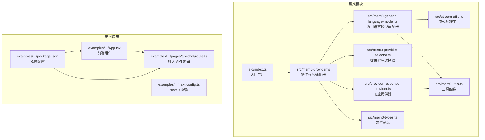
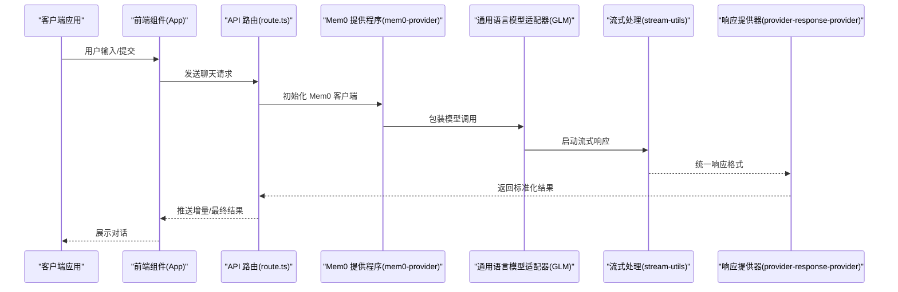
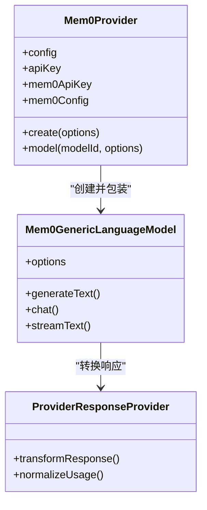
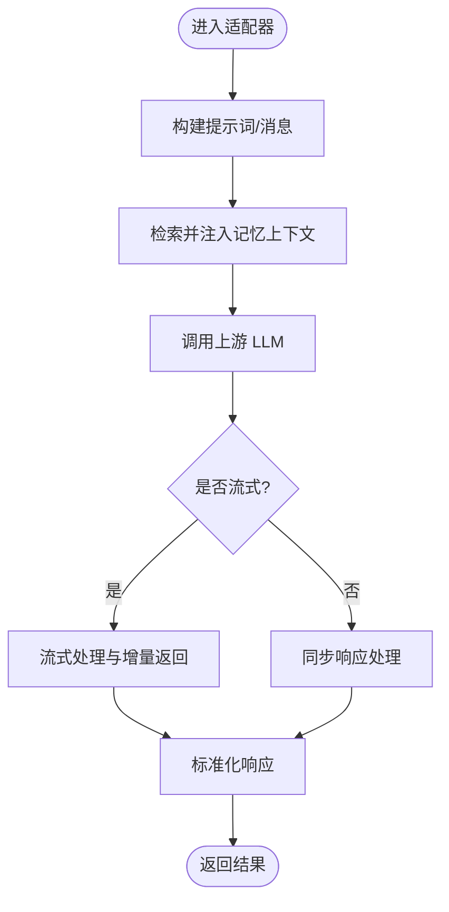
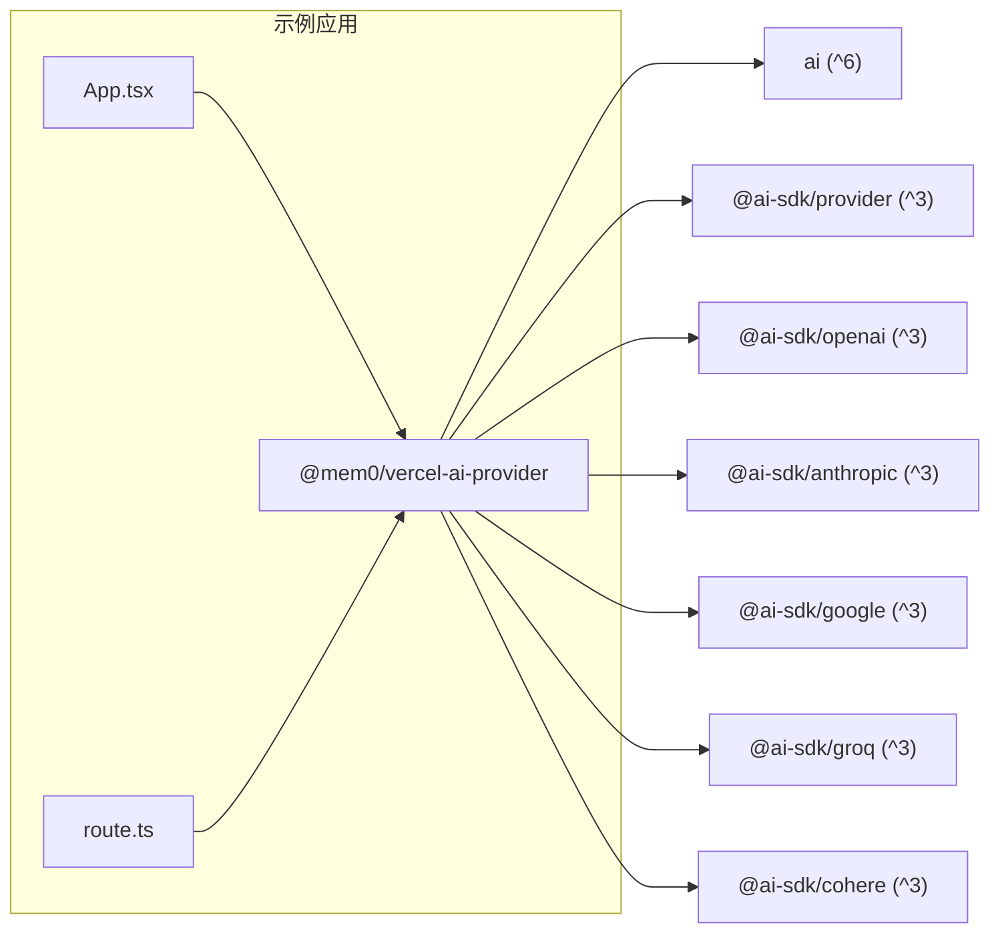

# Vercel AI SDK 集成

<cite>
**本文档引用的文件**
- [integrations/vercel-ai-sdk/README.md](file://integrations/vercel-ai-sdk/README.md)
- [docs/integrations/vercel-ai-sdk.mdx](file://docs/integrations/vercel-ai-sdk.mdx)
- [integrations/vercel-ai-sdk/src/index.ts](file://integrations/vercel-ai-sdk/src/index.ts)
- [integrations/vercel-ai-sdk/src/mem0-provider.ts](file://integrations/vercel-ai-sdk/src/mem0-provider.ts)
- [integrations/vercel-ai-sdk/src/mem0-generic-language-model.ts](file://integrations/vercel-ai-sdk/src/mem0-generic-language-model.ts)
- [integrations/vercel-ai-sdk/src/mem0-provider-selector.ts](file://integrations/vercel-ai-sdk/src/mem0-provider-selector.ts)
- [integrations/vercel-ai-sdk/src/mem0-types.ts](file://integrations/vercel-ai-sdk/src/mem0-types.ts)
- [integrations/vercel-ai-sdk/src/mem0-utils.ts](file://integrations/vercel-ai-sdk/src/mem0-utils.ts)
- [integrations/vercel-ai-sdk/src/stream-utils.ts](file://integrations/vercel-ai-sdk/src/stream-utils.ts)
- [integrations/vercel-ai-sdk/src/provider-response-provider.ts](file://integrations/vercel-ai-sdk/src/provider-response-provider.ts)
- [examples/vercel-ai-sdk-chat-app/src/App.tsx](file://examples/vercel-ai-sdk-chat-app/src/App.tsx)
- [examples/vercel-ai-sdk-chat-app/src/pages/api/chat/route.ts](file://examples/vercel-ai-sdk-chat-app/src/pages/api/chat/route.ts)
- [examples/vercel-ai-sdk-chat-app/package.json](file://examples/vercel-ai-sdk-chat-app/package.json)
- [examples/vercel-ai-sdk-chat-app/next.config.ts](file://examples/vercel-ai-sdk-chat-app/next.config.ts)
</cite>

## 目录
1. [简介](#简介)
2. [项目结构](#项目结构)
3. [核心组件](#核心组件)
4. [架构总览](#架构总览)
5. [详细组件分析](#详细组件分析)
6. [依赖关系分析](#依赖关系分析)
7. [性能考虑](#性能考虑)
8. [故障排除指南](#故障排除指南)
9. [结论](#结论)
10. [附录](#附录)

## 简介
本指南面向希望在 Vercel AI 应用中集成 Mem0 的开发者，系统讲解如何通过 Mem0 AI SDK Provider 将持久化记忆能力无缝接入 Vercel AI SDK。内容涵盖：
- Mem0 提供程序的实现与适配器设计
- 语言模型适配器与流式处理支持
- 内存工具的使用方法（添加、检索、获取）
- 结构化输出与错误处理策略
- Next.js 应用集成示例、API 路由配置与部署要点
- 性能优化建议与调试技巧

## 项目结构
该仓库采用多模块组织方式，与 Vercel AI SDK 集成相关的核心位于 `integrations/vercel-ai-sdk` 目录，同时提供了完整的示例应用 `examples/vercel-ai-sdk-chat-app`。

**图表来源**
- [integrations/vercel-ai-sdk/src/index.ts](file://integrations/vercel-ai-sdk/src/index.ts)
- [integrations/vercel-ai-sdk/src/mem0-provider.ts](file://integrations/vercel-ai-sdk/src/mem0-provider.ts)
- [integrations/vercel-ai-sdk/src/mem0-generic-language-model.ts](file://integrations/vercel-ai-sdk/src/mem0-generic-language-model.ts)
- [integrations/vercel-ai-sdk/src/mem0-provider-selector.ts](file://integrations/vercel-ai-sdk/src/mem0-provider-selector.ts)
- [integrations/vercel-ai-sdk/src/mem0-types.ts](file://integrations/vercel-ai-sdk/src/mem0-types.ts)
- [integrations/vercel-ai-sdk/src/mem0-utils.ts](file://integrations/vercel-ai-sdk/src/mem0-utils.ts)
- [integrations/vercel-ai-sdk/src/stream-utils.ts](file://integrations/vercel-ai-sdk/src/stream-utils.ts)
- [integrations/vercel-ai-sdk/src/provider-response-provider.ts](file://integrations/vercel-ai-sdk/src/provider-response-provider.ts)
- [examples/vercel-ai-sdk-chat-app/src/App.tsx](file://examples/vercel-ai-sdk-chat-app/src/App.tsx)
- [examples/vercel-ai-sdk-chat-app/src/pages/api/chat/route.ts](file://examples/vercel-ai-sdk-chat-app/src/pages/api/chat/route.ts)
- [examples/vercel-ai-sdk-chat-app/package.json](file://examples/vercel-ai-sdk-chat-app/package.json)
- [examples/vercel-ai-sdk-chat-app/next.config.ts](file://examples/vercel-ai-sdk-chat-app/next.config.ts)

**章节来源**
- [integrations/vercel-ai-sdk/README.md:1-151](file://integrations/vercel-ai-sdk/README.md#L1-L151)
- [docs/integrations/vercel-ai-sdk.mdx:21-68](file://docs/integrations/vercel-ai-sdk.mdx#L21-L68)

## 核心组件
- 提供程序适配器：负责将 Mem0 客户端与 Vercel AI SDK 的模型接口对接，支持多种上游 LLM 提供商。
- 通用语言模型适配器：封装生成文本、消息对话等调用流程，统一处理请求参数与响应格式。
- 流式处理工具：支持增量返回与流式渲染，提升用户体验。
- 工具函数与类型定义：提供内存操作工具、类型约束与配置项。
- 响应提供器：桥接上游模型响应与 Vercel AI SDK 的数据结构。
- 示例应用：展示在 Next.js 中集成聊天界面与 API 路由的最佳实践。

**章节来源**
- [integrations/vercel-ai-sdk/src/mem0-provider.ts](file://integrations/vercel-ai-sdk/src/mem0-provider.ts)
- [integrations/vercel-ai-sdk/src/mem0-generic-language-model.ts](file://integrations/vercel-ai-sdk/src/mem0-generic-language-model.ts)
- [integrations/vercel-ai-sdk/src/stream-utils.ts](file://integrations/vercel-ai-sdk/src/stream-utils.ts)
- [integrations/vercel-ai-sdk/src/mem0-utils.ts](file://integrations/vercel-ai-sdk/src/mem0-utils.ts)
- [integrations/vercel-ai-sdk/src/provider-response-provider.ts](file://integrations/vercel-ai-sdk/src/provider-response-provider.ts)

## 架构总览
下图展示了从前端到后端 API、再到 Mem0 与上游 LLM 的整体交互链路。

**图表来源**
- [integrations/vercel-ai-sdk/src/mem0-provider.ts](file://integrations/vercel-ai-sdk/src/mem0-provider.ts)
- [integrations/vercel-ai-sdk/src/mem0-generic-language-model.ts](file://integrations/vercel-ai-sdk/src/mem0-generic-language-model.ts)
- [integrations/vercel-ai-sdk/src/stream-utils.ts](file://integrations/vercel-ai-sdk/src/stream-utils.ts)
- [integrations/vercel-ai-sdk/src/provider-response-provider.ts](file://integrations/vercel-ai-sdk/src/provider-response-provider.ts)
- [examples/vercel-ai-sdk-chat-app/src/pages/api/chat/route.ts](file://examples/vercel-ai-sdk-chat-app/src/pages/api/chat/route.ts)

## 详细组件分析

### 提供程序适配器（Mem0Provider）
职责与特性：
- 将 Mem0 客户端与 Vercel AI SDK 模型接口对接
- 支持多提供商选择与配置传递
- 处理用户上下文注入与记忆检索
- 统一响应格式以兼容 Vercel AI SDK

**图表来源**
- [integrations/vercel-ai-sdk/src/mem0-provider.ts](file://integrations/vercel-ai-sdk/src/mem0-provider.ts)
- [integrations/vercel-ai-sdk/src/mem0-generic-language-model.ts](file://integrations/vercel-ai-sdk/src/mem0-generic-language-model.ts)
- [integrations/vercel-ai-sdk/src/provider-response-provider.ts](file://integrations/vercel-ai-sdk/src/provider-response-provider.ts)

**章节来源**
- [integrations/vercel-ai-sdk/src/mem0-provider.ts](file://integrations/vercel-ai-sdk/src/mem0-provider.ts)
- [integrations/vercel-ai-sdk/src/mem0-generic-language-model.ts](file://integrations/vercel-ai-sdk/src/mem0-generic-language-model.ts)
- [integrations/vercel-ai-sdk/src/provider-response-provider.ts](file://integrations/vercel-ai-sdk/src/provider-response-provider.ts)

### 通用语言模型适配器（GLM）
职责与特性：
- 实现 generateText、chat、streamText 等核心方法
- 统一处理消息格式与结构化输出
- 与流式工具协作实现增量返回
- 与工具函数配合完成记忆增强

**图表来源**
- [integrations/vercel-ai-sdk/src/mem0-generic-language-model.ts](file://integrations/vercel-ai-sdk/src/mem0-generic-language-model.ts)
- [integrations/vercel-ai-sdk/src/mem0-utils.ts](file://integrations/vercel-ai-sdk/src/mem0-utils.ts)
- [integrations/vercel-ai-sdk/src/stream-utils.ts](file://integrations/vercel-ai-sdk/src/stream-utils.ts)

**章节来源**
- [integrations/vercel-ai-sdk/src/mem0-generic-language-model.ts](file://integrations/vercel-ai-sdk/src/mem0-generic-language-model.ts)
- [integrations/vercel-ai-sdk/src/mem0-utils.ts](file://integrations/vercel-ai-sdk/src/mem0-utils.ts)
- [integrations/vercel-ai-sdk/src/stream-utils.ts](file://integrations/vercel-ai-sdk/src/stream-utils.ts)

### 流式处理支持
- 使用流式工具对上游响应进行增量解析
- 将流式片段转换为 Vercel AI SDK 可消费的格式
- 支持实时渲染与更好的交互体验

**章节来源**
- [integrations/vercel-ai-sdk/src/stream-utils.ts](file://integrations/vercel-ai-sdk/src/stream-utils.ts)

### 内存工具与结构化输出
- addMemories：向指定用户写入记忆，支持多模态内容
- retrieveMemories：根据当前提示检索相关记忆并注入系统提示
- getMemories：返回记忆数组以便进一步处理或展示
- 结构化输出：确保返回的数据结构符合 Vercel AI SDK 的期望

**章节来源**
- [integrations/vercel-ai-sdk/README.md:54-92](file://integrations/vercel-ai-sdk/README.md#L54-L92)
- [docs/integrations/vercel-ai-sdk.mdx:65-151](file://docs/integrations/vercel-ai-sdk.mdx#L65-L151)

### 错误处理策略
- 参数校验：对必填字段（如 API Key、user_id）进行验证
- 异常捕获：在调用上游 LLM 或访问 Mem0 服务时捕获异常并转换为可读错误
- 降级策略：在网络不稳定或上游不可用时提供有限功能或清晰提示
- 日志记录：在开发环境记录关键调用信息便于调试

**章节来源**
- [integrations/vercel-ai-sdk/src/mem0-provider.ts](file://integrations/vercel-ai-sdk/src/mem0-provider.ts)
- [integrations/vercel-ai-sdk/src/mem0-generic-language-model.ts](file://integrations/vercel-ai-sdk/src/mem0-generic-language-model.ts)

## 依赖关系分析
- 与 Vercel AI SDK 的关系：通过提供程序适配器与通用语言模型适配器对接，遵循 ai 与 @ai-sdk/provider 的接口规范
- 上游 LLM 提供商：支持 OpenAI、Anthropic、Google、Groq、Cohere 等，具体取决于 @ai-sdk 对应包版本
- 示例应用依赖：Next.js + Vercel AI SDK + @mem0/vercel-ai-provider

**图表来源**
- [docs/integrations/vercel-ai-sdk.mdx:29-35](file://docs/integrations/vercel-ai-sdk.mdx#L29-L35)
- [examples/vercel-ai-sdk-chat-app/package.json](file://examples/vercel-ai-sdk-chat-app/package.json)

**章节来源**
- [docs/integrations/vercel-ai-sdk.mdx:29-35](file://docs/integrations/vercel-ai-sdk.mdx#L29-L35)
- [examples/vercel-ai-sdk-chat-app/package.json](file://examples/vercel-ai-sdk-chat-app/package.json)

## 性能考虑
- 流式响应：优先使用流式接口以减少首字节延迟并提升交互流畅度
- 记忆检索缓存：在应用层对近期检索结果进行缓存，避免重复查询
- 批量写入：合并多次 addMemories 调用，减少网络往返
- 连接复用：在 API 层复用 Mem0 客户端实例，降低初始化开销
- 超时与重试：为上游调用设置合理超时与指数退避重试策略
- 资源清理：在组件卸载或会话结束时及时释放资源与取消未完成请求

## 故障排除指南
常见问题与解决思路：
- API Key 无效或缺失：确认 MEM0_API_KEY 与对应提供商 API Key 设置正确
- user_id 缺失：确保在调用时传入 user_id 或在全局配置中设置
- 依赖版本不匹配：检查 ai 与 @ai-sdk/* 版本要求，避免冲突
- 流式渲染异常：检查流式工具与响应提供器的组合使用是否正确
- CORS 或代理问题：在本地开发时配置正确的代理与跨域头

**章节来源**
- [integrations/vercel-ai-sdk/README.md:25-52](file://integrations/vercel-ai-sdk/README.md#L25-L52)
- [docs/integrations/vercel-ai-sdk.mdx:29-35](file://docs/integrations/vercel-ai-sdk.mdx#L29-L35)

## 结论
通过 Mem0 AI SDK Provider，开发者可以轻松地在 Vercel AI 应用中引入持久化记忆能力，实现更智能、更个性化的对话体验。结合流式处理与完善的工具函数，能够在保证性能的同时提供优秀的用户体验。建议在生产环境中关注依赖版本、API Key 管理与错误处理策略，并利用示例应用作为起点快速落地。

## 附录

### 快速开始步骤
- 安装依赖：安装 @mem0/vercel-ai-provider 与 ai@^6
- 获取 API Key：从 Mem0 仪表板获取 Mem0 API Key 与提供商 API Key
- 初始化客户端：使用 createMem0 创建实例，配置 provider 与密钥
- 添加记忆：使用 addMemories 为用户写入上下文
- 调用模型：通过 mem0("model-id") 或 retrieveMemories 注入上下文后调用 generateText/chat

**章节来源**
- [integrations/vercel-ai-sdk/README.md:19-92](file://integrations/vercel-ai-sdk/README.md#L19-L92)
- [docs/integrations/vercel-ai-sdk.mdx:21-68](file://docs/integrations/vercel-ai-sdk.mdx#L21-L68)

### Next.js 集成示例
- 前端组件：在 App.tsx 中实现聊天界面与状态管理
- API 路由：在 route.ts 中接收请求、调用 Mem0 提供程序并返回结果
- 依赖配置：在 package.json 中声明必要依赖
- Next.js 配置：在 next.config.ts 中按需配置实验性功能

**章节来源**
- [examples/vercel-ai-sdk-chat-app/src/App.tsx](file://examples/vercel-ai-sdk-chat-app/src/App.tsx)
- [examples/vercel-ai-sdk-chat-app/src/pages/api/chat/route.ts](file://examples/vercel-ai-sdk-chat-app/src/pages/api/chat/route.ts)
- [examples/vercel-ai-sdk-chat-app/package.json](file://examples/vercel-ai-sdk-chat-app/package.json)
- [examples/vercel-ai-sdk-chat-app/next.config.ts](file://examples/vercel-ai-sdk-chat-app/next.config.ts)