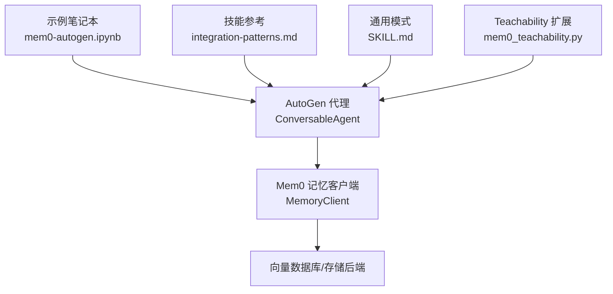
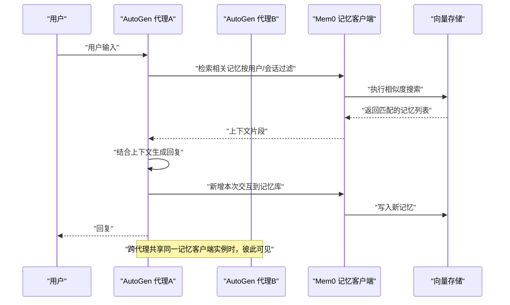
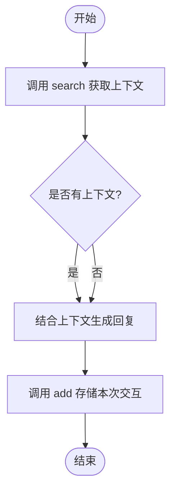
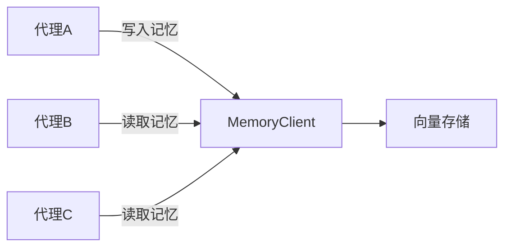
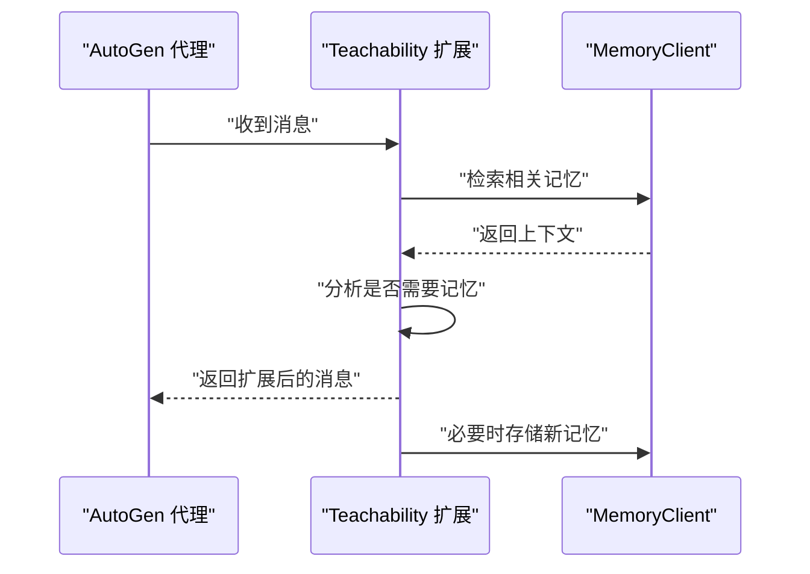
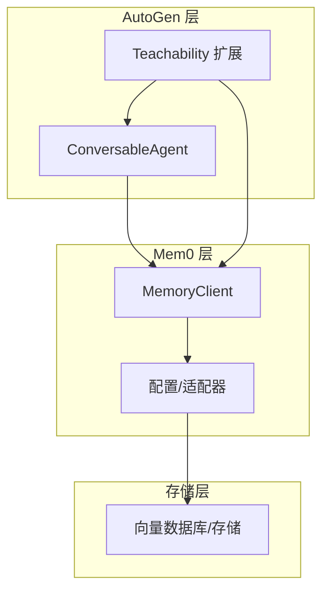

# AutoGen 集成

<cite>
**本文引用的文件**
- [autogen.mdx](file://docs/integrations/autogen.mdx)
- [integration-patterns.md](file://skills/mem0/references/integration-patterns.md)
- [mem0-autogen.ipynb](file://examples/notebooks/mem0-autogen.ipynb)
- [mem0_teachability.py](file://examples/notebooks/helper/mem0_teachability.py)
- [SKILL.md](file://skills/mem0/SKILL.md)
- [LLM.md](file://LLM.md)
</cite>

## 目录
1. [简介](#简介)
2. [项目结构](#项目结构)
3. [核心组件](#核心组件)
4. [架构总览](#架构总览)
5. [详细组件分析](#详细组件分析)
6. [依赖关系分析](#依赖关系分析)
7. [性能考量](#性能考量)
8. [故障排查指南](#故障排查指南)
9. [结论](#结论)
10. [附录](#附录)

## 简介
本指南面向希望在 AutoGen 多代理系统中引入 Mem0 记忆能力的开发者，目标是帮助你在 AutoGen 的团队协作场景下实现跨代理的记忆共享与状态同步。文档基于仓库中的官方集成文档、技能参考与示例笔记本，系统讲解以下内容：
- 如何在 AutoGen 中为单个或多个代理注入 Mem0 记忆能力
- 如何在多代理场景下进行记忆同步与上下文共享
- AutoGen 特有的集成模式（如通过钩子扩展消息处理）
- 消息传递机制与团队协作的最佳实践
- 常见问题与性能优化建议

## 项目结构
围绕 AutoGen 与 Mem0 的集成，相关资料主要分布在如下位置：
- 官方集成指南：docs/integrations/autogen.mdx
- 技能参考与通用模式：skills/mem0/references/integration-patterns.md、skills/mem0/SKILL.md
- 示例与可运行笔记本：examples/notebooks/mem0-autogen.ipynb 及辅助工具 mem0_teachability.py
- 多代理协作与共享记忆的背景知识：LLM.md 中的多代理章节

图表来源
- [autogen.mdx](file://docs/integrations/autogen.mdx)
- [integration-patterns.md](file://skills/mem0/references/integration-patterns.md)
- [SKILL.md](file://skills/mem0/SKILL.md)
- [mem0-autogen.ipynb](file://examples/notebooks/mem0-autogen.ipynb)
- [mem0_teachability.py](file://examples/notebooks/helper/mem0_teachability.py)

章节来源
- [autogen.mdx](file://docs/integrations/autogen.mdx)
- [integration-patterns.md](file://skills/mem0/references/integration-patterns.md)
- [SKILL.md](file://skills/mem0/SKILL.md)
- [mem0-autogen.ipynb](file://examples/notebooks/mem0-autogen.ipynb)
- [mem0_teachability.py](file://examples/notebooks/helper/mem0_teachability.py)

## 核心组件
- AutoGen 代理（ConversableAgent）：负责对话生成、消息处理与团队协作编排。
- Mem0 记忆客户端（MemoryClient）：提供检索、新增、更新、删除等记忆操作，支持按用户/会话/代理维度过滤。
- Teachability 扩展（mem0_teachability.py）：通过注册钩子，在消息接收后自动考虑记忆检索与存储，增强代理的“可教学性”。

章节来源
- [autogen.mdx](file://docs/integrations/autogen.mdx)
- [mem0_teachability.py](file://examples/notebooks/helper/mem0_teachability.py)

## 架构总览
下图展示了 AutoGen 代理与 Mem0 的交互路径，以及在多代理场景下如何通过共享记忆实现上下文复用。

图表来源
- [autogen.mdx](file://docs/integrations/autogen.mdx)
- [integration-patterns.md](file://skills/mem0/references/integration-patterns.md)

## 详细组件分析

### 组件一：AutoGen 与 Mem0 的基础集成
- 在 AutoGen 中创建 ConversableAgent，并注入 Mem0 的 MemoryClient
- 在每次对话前调用 search 获取上下文，再调用 add 存储新的交互
- 使用用户 ID 或会话 ID 过滤，确保不同用户/会话的记忆隔离

图表来源
- [autogen.mdx](file://docs/integrations/autogen.mdx)

章节来源
- [autogen.mdx](file://docs/integrations/autogen.mdx)

### 组件二：多代理场景下的记忆共享
- 共享同一 MemoryClient 实例：所有代理对同一存储后端进行读写，天然实现跨代理共享
- 通过 filters（如 user_id、run_id、agent_id）实现细粒度隔离与聚合
- 在协作流程中，上一步骤的输出作为下一步骤的输入，形成“记忆驱动”的流水线

图表来源
- [integration-patterns.md](file://skills/mem0/references/integration-patterns.md)
- [LLM.md](file://LLM.md)

章节来源
- [integration-patterns.md](file://skills/mem0/references/integration-patterns.md)
- [LLM.md](file://LLM.md)

### 组件三：通过 Teachability 扩展实现“可教学”代理
- 注册钩子：在消息接收后自动触发记忆检索与存储逻辑
- 分析是否需要记忆：根据消息内容判断是否包含任务/问题
- 自动扩展消息文本：将检索到的记忆拼接到当前消息中，提升上下文质量

图表来源
- [mem0_teachability.py](file://examples/notebooks/helper/mem0_teachability.py)

章节来源
- [mem0_teachability.py](file://examples/notebooks/helper/mem0_teachability.py)

### 组件四：通用集成模式与最佳实践
- 通用模式：先检索、再生成、最后存储，贯穿所有代理
- 边界情况：空上下文时直接生成；批量添加时注意异步处理延迟
- 最佳实践：
  - 明确区分 user_id、session_id、agent_id 的作用域
  - 对长对话分段存储，避免单条记忆过大
  - 在团队协作中，由协调者统一写入关键决策与总结

章节来源
- [SKILL.md](file://skills/mem0/SKILL.md)

## 依赖关系分析
- AutoGen 代理依赖 MemoryClient 提供的记忆服务
- MemoryClient 依赖底层向量存储（如 Chroma、FAISS、Pinecone 等，具体取决于配置）
- Teachability 扩展依赖 AutoGen 的钩子机制与 MemoryClient

图表来源
- [autogen.mdx](file://docs/integrations/autogen.mdx)
- [integration-patterns.md](file://skills/mem0/references/integration-patterns.md)
- [mem0_teachability.py](file://examples/notebooks/helper/mem0_teachability.py)

章节来源
- [autogen.mdx](file://docs/integrations/autogen.mdx)
- [integration-patterns.md](file://skills/mem0/references/integration-patterns.md)
- [mem0_teachability.py](file://examples/notebooks/helper/mem0_teachability.py)

## 性能考量
- 异步处理：新增记忆后通常需要等待异步索引完成，建议在测试环境中采用轮询策略确认可用性
- 向量检索：合理设置 top_k 与过滤条件，避免返回过多无关结果导致上下文膨胀
- 批量写入：合并多次交互后再写入，减少频繁写入带来的延迟
- 缓存策略：对热点用户的近期记忆进行缓存，降低重复检索成本

章节来源
- [SKILL.md](file://skills/mem0/SKILL.md)

## 故障排查指南
- 初始化失败：检查环境变量与配置项是否正确
- 检索缓慢：检查网络状况与向量存储参数，适当缓存查询结果
- 记忆未找到：确认 user_id/session_id 是否一致，是否存在软删除或异步延迟
- 连接超时：增加重试与退避策略，检查后端健康状态
- 内存溢出：减小并发或拆分批次处理

章节来源
- [SKILL.md](file://skills/mem0/SKILL.md)

## 结论
通过在 AutoGen 中集成 Mem0，可以为多代理系统提供强大的上下文记忆能力。无论是单代理的个性化对话，还是多代理的协作流程，都可以借助 Mem0 实现跨代理的记忆共享与状态同步。配合 Teachability 扩展，还能进一步提升代理的“可教学性”，使其在持续交互中不断优化回复质量。

## 附录
- 示例笔记本：examples/notebooks/mem0-autogen.ipynb
- Teachability 扩展：examples/notebooks/helper/mem0_teachability.py
- 技能参考与通用模式：skills/mem0/references/integration-patterns.md、skills/mem0/SKILL.md
- 多代理协作背景：LLM.md 中的多代理章节