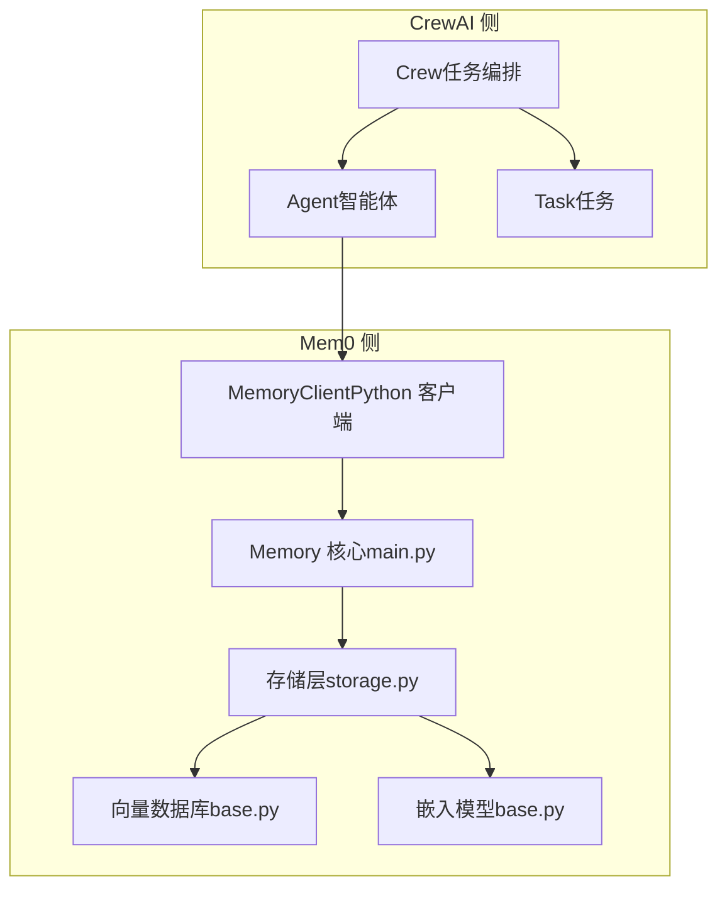
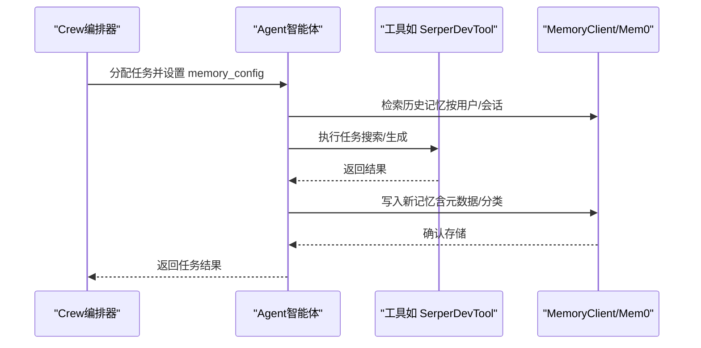
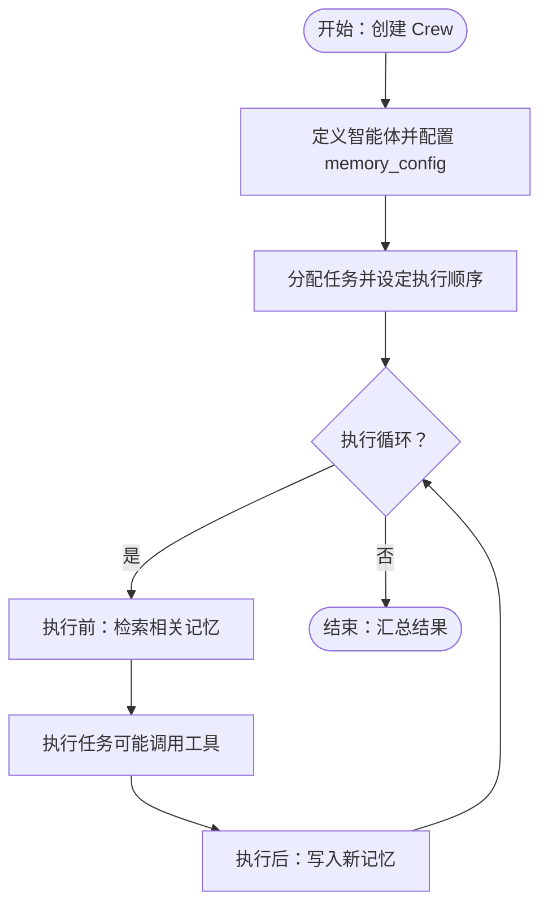
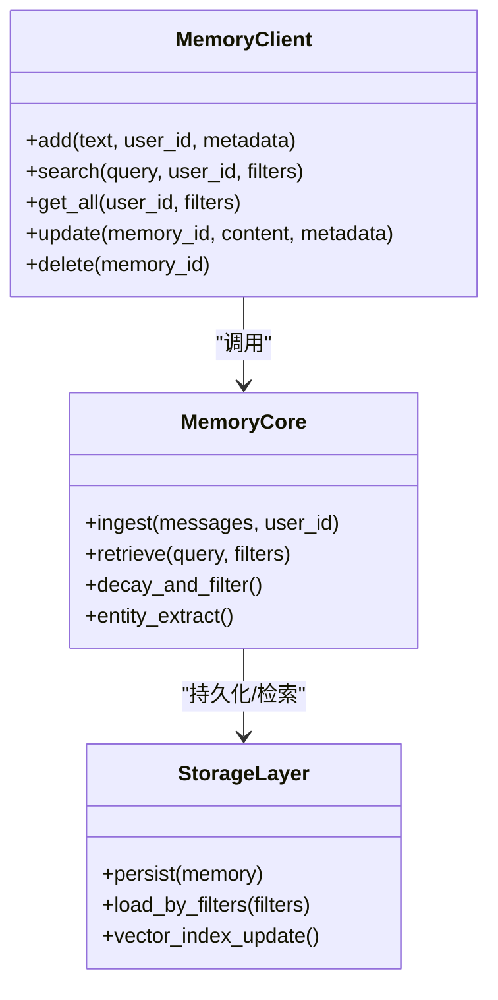
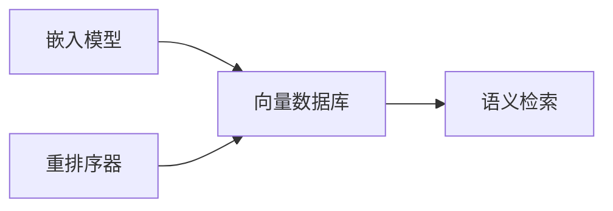
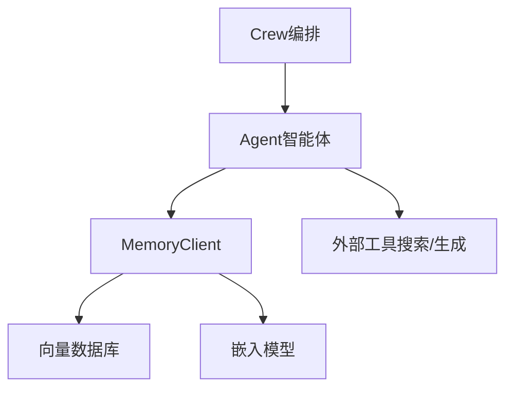

# CrewAI 集成

<cite>
**本文引用的文件**
- [crewai.mdx](file://docs/integrations/crewai.mdx)
- [integration-patterns.md](file://skills/mem0/references/integration-patterns.md)
- [main.py](file://mem0/client/main.py)
- [types.py](file://mem0/client/types.py)
- [memory/main.py](file://mem0/memory/main.py)
- [memory/storage.py](file://mem0/memory/storage.py)
- [vector_stores/base.py](file://mem0/vector_stores/base.py)
- [embeddings/base.py](file://mem0/embeddings/base.py)
- [reranker/base.py](file://mem0/reranker/base.py)
- [utils/entity_extraction.py](file://mem0/utils/entity_extraction.py)
- [examples/misc/voice_assistant_elevenlabs.py](file://examples/misc/voice_assistant_elevenlabs.py)
- [tests/test_memory_integration.py](file://tests/test_memory_integration.py)
</cite>

## 目录
1. [简介](#简介)
2. [项目结构](#项目结构)
3. [核心组件](#核心组件)
4. [架构总览](#架构总览)
5. [详细组件分析](#详细组件分析)
6. [依赖关系分析](#依赖关系分析)
7. [性能考虑](#性能考虑)
8. [故障排除指南](#故障排除指南)
9. [结论](#结论)
10. [附录](#附录)

## 简介
本指南面向希望在 CrewAI 智能体团队中引入 Mem0 知识管理与任务记忆能力的开发者。通过将 CrewAI 的任务编排能力与 Mem0 的持久化记忆系统结合，可以实现：
- 跨智能体的任务记忆与经验沉淀
- 基于历史交互的个性化任务执行
- 团队协作中的知识共享与传承
- 动态的任务分配与团队学习模式

本指南基于官方文档与仓库中的集成参考，提供从环境准备到团队协作场景的完整落地路径。

## 项目结构
围绕 CrewAI 与 Mem0 的集成，关键位置包括：
- 官方集成文档：docs/integrations/crewai.mdx
- 集成模式参考：skills/mem0/references/integration-patterns.md
- Python 客户端核心：mem0/client/main.py、mem0/client/types.py
- 记忆内核：mem0/memory/main.py、mem0/memory/storage.py
- 向量存储与嵌入：mem0/vector_stores/base.py、embeddings/base.py
- 实战示例：examples/misc/voice_assistant_elevenlabs.py
- 测试用例：tests/test_memory_integration.py

图表来源
- [crewai.mdx](file://docs/integrations/crewai.mdx)
- [integration-patterns.md](file://skills/mem0/references/integration-patterns.md)
- [main.py](file://mem0/client/main.py)
- [memory/main.py](file://mem0/memory/main.py)
- [memory/storage.py](file://mem0/memory/storage.py)
- [vector_stores/base.py](file://mem0/vector_stores/base.py)
- [embeddings/base.py](file://mem0/embeddings/base.py)

章节来源
- [crewai.mdx](file://docs/integrations/crewai.mdx)
- [integration-patterns.md](file://skills/mem0/references/integration-patterns.md)

## 核心组件
- MemoryClient（Python 客户端）
  - 提供添加、检索、更新、删除记忆等操作接口，支持用户维度的记忆隔离与分类管理。
  - 支持通过环境变量或配置初始化，便于在 CrewAI 中作为工具注入。
- Memory 核心模块
  - 封装记忆生命周期管理、去重、衰减、排序等策略，支撑检索与上下文增强。
- 存储与检索
  - 通过向量数据库与嵌入模型实现语义检索；支持元数据过滤与时间范围筛选。
- 集成参考
  - 官方文档明确指出 CrewAI 可通过 memory_config 进行原生集成，便于在 Agent 层直接挂载 Mem0。

章节来源
- [main.py](file://mem0/client/main.py)
- [types.py](file://mem0/client/types.py)
- [memory/main.py](file://mem0/memory/main.py)
- [memory/storage.py](file://mem0/memory/storage.py)
- [vector_stores/base.py](file://mem0/vector_stores/base.py)
- [embeddings/base.py](file://mem0/embeddings/base.py)
- [integration-patterns.md](file://skills/mem0/references/integration-patterns.md)

## 架构总览
下图展示了 CrewAI 与 Mem0 在任务执行链路中的交互方式：Crew 调度 Agent 执行 Task，Agent 在执行前后通过 MemoryClient 与 Mem0 进行记忆的写入与检索，从而实现跨任务的知识沉淀与复用。

图表来源
- [crewai.mdx](file://docs/integrations/crewai.mdx)
- [integration-patterns.md](file://skills/mem0/references/integration-patterns.md)
- [examples/misc/voice_assistant_elevenlabs.py](file://examples/misc/voice_assistant_elevenlabs.py)

## 详细组件分析

### 组件一：CrewAI 任务编排与记忆配置
- 任务编排要点
  - 使用 Crew 的 Process 控制流程（例如顺序/同步），确保记忆写入在任务完成后进行。
  - 在 Agent 初始化时通过 memory_config 指定 Mem0 提供者与用户标识，实现按用户维度的记忆隔离。
- 记忆配置示例思路
  - 用户 ID：用于区分不同用户的记忆空间。
  - 分类标签：为记忆打上“任务结果”“偏好设置”“规则约束”等标签，便于后续检索与过滤。
  - 时间戳与衰减：控制记忆有效期与重要性权重，避免过时信息干扰决策。

图表来源
- [integration-patterns.md](file://skills/mem0/references/integration-patterns.md)
- [examples/misc/voice_assistant_elevenlabs.py](file://examples/misc/voice_assistant_elevenlabs.py)

章节来源
- [integration-patterns.md](file://skills/mem0/references/integration-patterns.md)
- [examples/misc/voice_assistant_elevenlabs.py](file://examples/misc/voice_assistant_elevenlabs.py)

### 组件二：Mem0 客户端与记忆内核
- 客户端职责
  - 提供统一的 API 接口：添加、查询、更新、删除记忆；支持批量操作与元数据管理。
  - 支持异步/并发场景，适配多智能体并行执行。
- 记忆内核
  - 负责记忆的去重、排序、衰减与实体抽取，提升检索质量与上下文相关性。
  - 支持时间窗口与类别过滤，满足团队协作中的权限与范围控制需求。

图表来源
- [main.py](file://mem0/client/main.py)
- [memory/main.py](file://mem0/memory/main.py)
- [memory/storage.py](file://mem0/memory/storage.py)

章节来源
- [main.py](file://mem0/client/main.py)
- [memory/main.py](file://mem0/memory/main.py)
- [memory/storage.py](file://mem0/memory/storage.py)

### 组件三：向量存储与嵌入系统
- 向量存储
  - 支持多种向量数据库（如 Chroma、FAISS、Pinecone、Qdrant 等），可按需选择部署方案。
  - 提供统一的索引与查询接口，保证检索性能与扩展性。
- 嵌入模型
  - 支持 OpenAI、HuggingFace、Gemini、Ollama 等多种嵌入源，便于在不同场景切换。
  - 提供实体抽取与关键词提取，辅助构建高质量的检索语料。

图表来源
- [vector_stores/base.py](file://mem0/vector_stores/base.py)
- [embeddings/base.py](file://mem0/embeddings/base.py)
- [reranker/base.py](file://mem0/reranker/base.py)

章节来源
- [vector_stores/base.py](file://mem0/vector_stores/base.py)
- [embeddings/base.py](file://mem0/embeddings/base.py)
- [reranker/base.py](file://mem0/reranker/base.py)

### 组件四：实战示例与测试验证
- 示例应用
  - voice_assistant_elevenlabs.py 展示了在智能体中使用 memory_config 的方式，包含用户维度的记忆配置与工具调用。
- 测试用例
  - test_memory_integration.py 通过 Mock 记忆服务，验证添加与获取记忆的流程，确保集成稳定性。

章节来源
- [examples/misc/voice_assistant_elevenlabs.py](file://examples/misc/voice_assistant_elevenlabs.py)
- [tests/test_memory_integration.py](file://tests/test_memory_integration.py)

## 依赖关系分析
- CrewAI 与 Mem0 的耦合点
  - 通过 Agent 的 memory_config 与 MemoryClient 的 API 形成松耦合：Crew 负责编排，Mem0 负责存储与检索。
- 外部依赖
  - LLM 与搜索引擎（如 Serper）用于任务执行；向量数据库与嵌入模型用于记忆检索。
- 潜在风险
  - 记忆写入时机不当可能导致信息丢失；检索过滤条件缺失可能影响相关性。
  - 并发写入时的冲突与一致性问题需要在客户端层面进行幂等处理。

图表来源
- [integration-patterns.md](file://skills/mem0/references/integration-patterns.md)
- [examples/misc/voice_assistant_elevenlabs.py](file://examples/misc/voice_assistant_elevenlabs.py)

章节来源
- [integration-patterns.md](file://skills/mem0/references/integration-patterns.md)
- [examples/misc/voice_assistant_elevenlabs.py](file://examples/misc/voice_assistant_elevenlabs.py)

## 性能考虑
- 检索性能
  - 合理设置向量库索引参数与分页策略；对高频检索场景启用缓存与预热。
- 写入吞吐
  - 批量写入与去重策略可降低重复存储成本；对高并发场景建议引入队列与幂等键。
- 上下文长度
  - 对检索结果进行摘要与重排序，避免超长上下文导致的延迟与费用上升。
- 资源成本
  - 嵌入模型与向量库的选择应平衡精度与成本；定期清理过期记忆以控制存储开销。

## 故障排除指南
- 常见问题
  - API 密钥未配置：检查 MEM0_API_KEY、OPENAI_API_KEY、SERPER_API_KEY 是否正确设置。
  - 记忆未生效：确认 Agent 的 memory_config 已正确传入 user_id 与 provider。
  - 检索结果不相关：调整嵌入模型、增加分类标签、优化检索过滤条件。
- 调试建议
  - 开启日志记录，观察 MemoryClient 的请求与响应；在测试环境中使用 Mock 验证流程。
  - 对比检索前后的时间戳与分类字段，确保过滤逻辑符合预期。

章节来源
- [crewai.mdx](file://docs/integrations/crewai.mdx)
- [tests/test_memory_integration.py](file://tests/test_memory_integration.py)

## 结论
通过在 CrewAI 中集成 Mem0，可以实现跨智能体、跨任务的知识沉淀与经验复用。结合 memory_config 的原生支持与 MemoryClient 的统一接口，团队能够在复杂协作场景中实现：
- 任务记忆与经验传承
- 基于历史的个性化执行
- 可观测、可治理的记忆体系

建议在生产环境中配套完善的监控、缓存与清理策略，持续优化检索质量与执行效率。

## 附录
- 快速开始步骤
  - 安装依赖：crewai、crewai-tools、mem0ai
  - 设置环境变量：MEM0_API_KEY、OPENAI_API_KEY、SERPER_API_KEY
  - 在 Agent 中配置 memory_config，指定 user_id 与 provider
  - 在任务前后调用 MemoryClient 的 add/search/get_all/update/delete 方法
- 参考文档
  - 官方集成文档：docs/integrations/crewai.mdx
  - 集成模式参考：skills/mem0/references/integration-patterns.md

章节来源
- [crewai.mdx](file://docs/integrations/crewai.mdx)
- [integration-patterns.md](file://skills/mem0/references/integration-patterns.md)