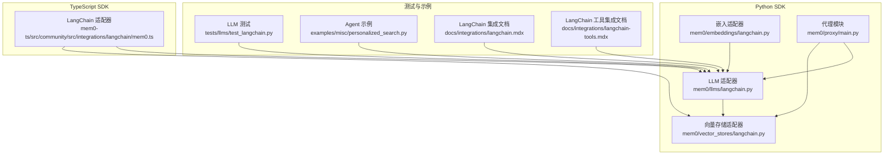
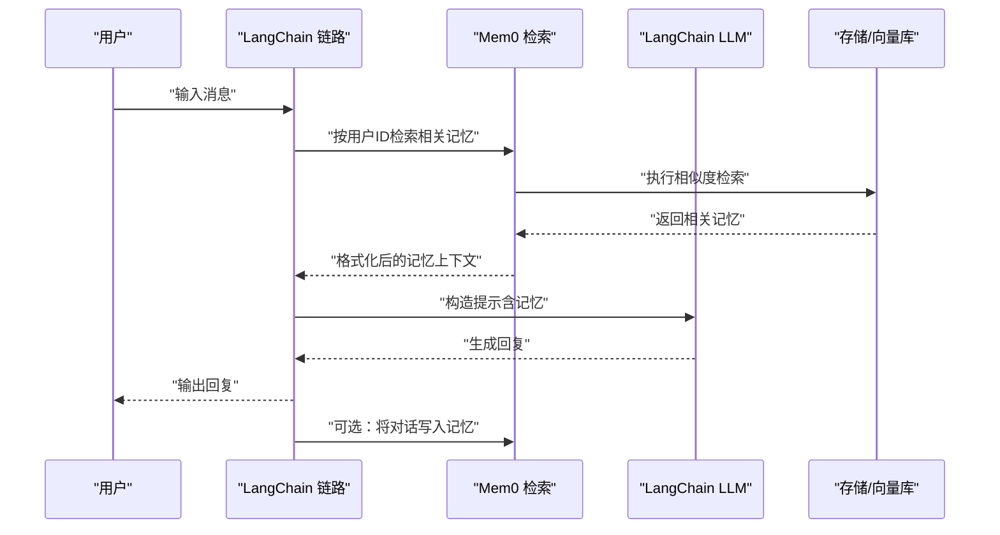
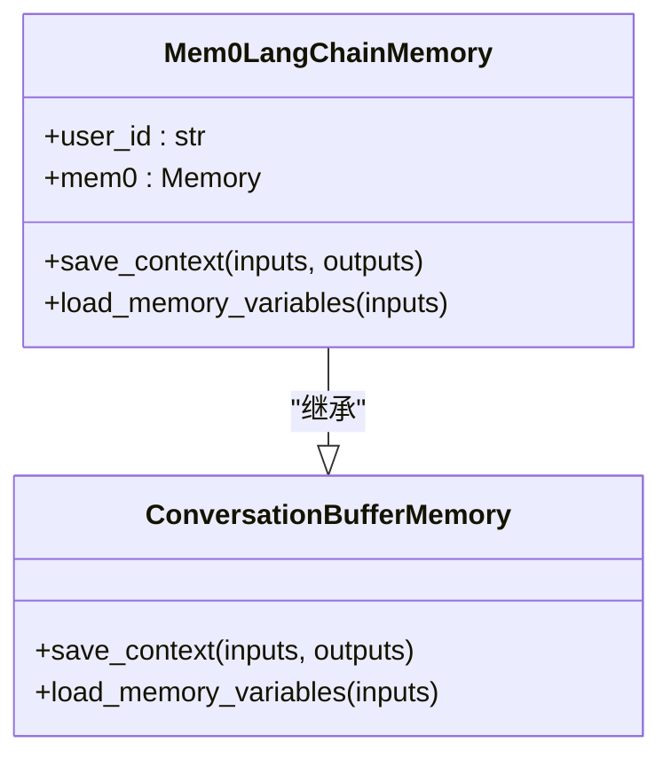
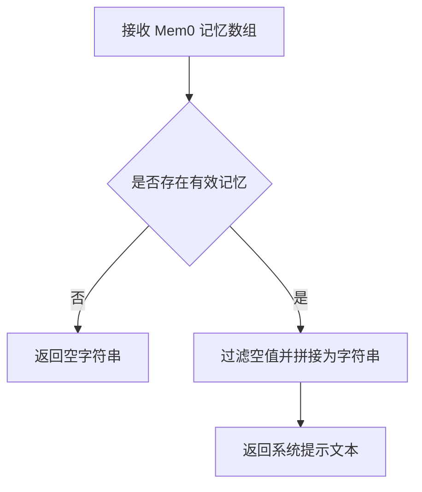
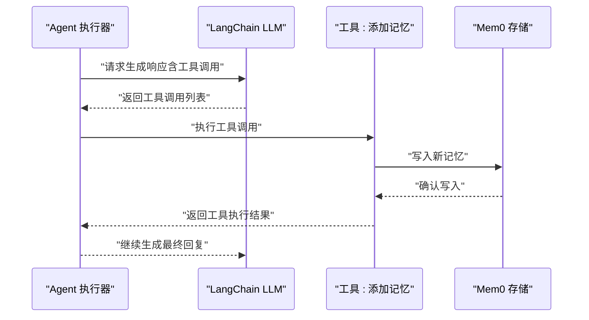
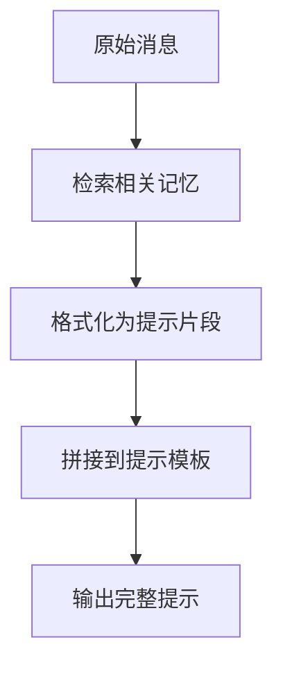
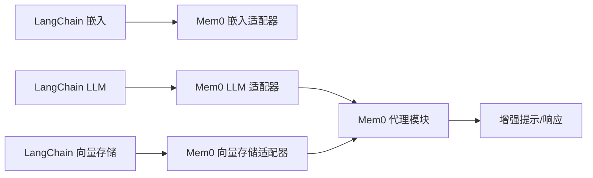

# LangChain 集成

<cite>
**本文引用的文件**
- [LLM.md](file://LLM.md)
- [langchain.py（嵌入）](file://mem0/embeddings/langchain.py)
- [langchain.py（LLM）](file://mem0/llms/langchain.py)
- [langchain.py（向量存储）](file://mem0/vector_stores/langchain.py)
- [test_langchain.py](file://tests/llms/test_langchain.py)
- [mem0.ts（LangChain 适配器）](file://mem0-ts/src/community/src/integrations/langchain/mem0.ts)
- [main.py（代理）](file://mem0/proxy/main.py)
- [langchain.mdx（LangChain 集成文档）](file://docs/integrations/langchain.mdx)
- [langchain-tools.mdx（LangChain 工具集成）](file://docs/integrations/langchain-tools.mdx)
- [personalized_search.py（示例）](file://examples/misc/personalized_search.py)
</cite>

## 目录
1. [简介](#简介)
2. [项目结构](#项目结构)
3. [核心组件](#核心组件)
4. [架构总览](#架构总览)
5. [组件详解](#组件详解)
6. [依赖关系分析](#依赖关系分析)
7. [性能考量](#性能考量)
8. [故障排查指南](#故障排查指南)
9. [结论](#结论)
10. [附录](#附录)

## 简介
本指南面向希望在 LangChain 应用中集成 Mem0 的开发者，系统讲解如何将 Mem0 作为长期记忆与检索增强的核心组件，覆盖以下主题：
- 在 LangChain 中使用 Mem0 进行记忆链式调用
- 将 Mem0 与提示模板（Prompt）集成，增强上下文
- 将 Mem0 与工具链（Tools）集成，实现“记忆写入/读取”的自动化
- 配置 LangChain Agent 使用 Mem0 记忆功能
- LangChain 适配器实现要点、内存管理策略与性能优化建议

Mem0 提供了统一的记忆存储、检索与管理能力，结合 LangChain 的消息缓冲、提示模板与工具调用机制，可实现“短期对话记忆 + 长期知识记忆”的双层记忆体系。

## 项目结构
围绕 LangChain 集成的关键目录与文件：
- Python SDK：提供与 LangChain 兼容的嵌入、LLM 和向量存储适配器
- TypeScript SDK：提供 LangChain 社区版适配器与工具函数
- 测试用例：验证 LangChain LLM 与工具调用的集成行为
- 示例与文档：演示 Agent 集成与工具链使用

图表来源
- [langchain.py（嵌入）](file://mem0/embeddings/langchain.py)
- [langchain.py（LLM）](file://mem0/llms/langchain.py)
- [langchain.py（向量存储）](file://mem0/vector_stores/langchain.py)
- [mem0.ts（LangChain 适配器）](file://mem0-ts/src/community/src/integrations/langchain/mem0.ts)
- [test_langchain.py](file://tests/llms/test_langchain.py)
- [personalized_search.py（示例）](file://examples/misc/personalized_search.py)
- [langchain.mdx（LangChain 集成文档）](file://docs/integrations/langchain.mdx)
- [langchain-tools.mdx（LangChain 工具集成）](file://docs/integrations/langchain-tools.mdx)

章节来源
- [langchain.py（嵌入）](file://mem0/embeddings/langchain.py)
- [langchain.py（LLM）](file://mem0/llms/langchain.py)
- [langchain.py（向量存储）](file://mem0/vector_stores/langchain.py)
- [mem0.ts（LangChain 适配器）](file://mem0-ts/src/community/src/integrations/langchain/mem0.ts)
- [test_langchain.py](file://tests/llms/test_langchain.py)
- [personalized_search.py（示例）](file://examples/misc/personalized_search.py)
- [langchain.mdx（LangChain 集成文档）](file://docs/integrations/langchain.mdx)
- [langchain-tools.mdx（LangChain 工具集成）](file://docs/integrations/langchain-tools.mdx)

## 核心组件
- 嵌入适配器：将 LangChain 的嵌入模型与 Mem0 向量化流程对接，支持 OpenAI、HuggingFace、Ollama 等生态
- LLM 适配器：将 LangChain 的聊天模型与 Mem0 的检索/代理流程对接，支持多供应商与结构化输出
- 向量存储适配器：将 LangChain 的向量存储与 Mem0 的持久化检索后端对接
- 代理模块：封装“查询格式化 + 相关记忆拼接”等逻辑，便于在链路中复用
- TypeScript 适配器：为 LangChain 社区版提供记忆上下文到系统提示的转换工具

章节来源
- [langchain.py（嵌入）](file://mem0/embeddings/langchain.py)
- [langchain.py（LLM）](file://mem0/llms/langchain.py)
- [langchain.py（向量存储）](file://mem0/vector_stores/langchain.py)
- [mem0.ts（LangChain 适配器）](file://mem0-ts/src/community/src/integrations/langchain/mem0.ts)
- [main.py（代理）](file://mem0/proxy/main.py)

## 架构总览
LangChain 与 Mem0 的集成路径通常包含以下步骤：
- 输入消息进入链路
- 通过 Mem0 检索相关记忆（按用户维度）
- 将检索结果格式化并注入到提示模板或系统消息中
- 调用 LangChain LLM 生成响应
- 可选：将对话内容写入 Mem0，形成闭环

图表来源
- [main.py（代理）](file://mem0/proxy/main.py)
- [langchain.py（LLM）](file://mem0/llms/langchain.py)
- [langchain.py（向量存储）](file://mem0/vector_stores/langchain.py)

## 组件详解

### LangChain 记忆适配器（Python）
- 自定义 LangChain 内存类：继承 ConversationBufferMemory，同时维护 Mem0 实例
- 行为要点：
  - 保存上下文时同步写入 Mem0
  - 加载变量时从 Mem0 搜索相关记忆并拼接到历史字段
  - 支持限制检索数量以控制上下文长度

图表来源
- [LLM.md（LangChain 集成示例）](file://LLM.md)

章节来源
- [LLM.md（LangChain 集成示例）](file://LLM.md)

### LangChain 记忆适配器（TypeScript）
- 工具函数：将 Mem0 返回的记忆对象数组转换为系统提示字符串
- 适用场景：在 LangChain 社区版中将检索到的记忆直接注入系统消息

图表来源
- [mem0.ts（LangChain 适配器）](file://mem0-ts/src/community/src/integrations/langchain/mem0.ts)

章节来源
- [mem0.ts（LangChain 适配器）](file://mem0-ts/src/community/src/integrations/langchain/mem0.ts)

### LLM 适配器与工具链集成
- LLM 适配器：支持多种供应商与结构化输出，便于在 Agent 中启用工具调用
- 工具链集成：通过 LangChain 工具接口，将“添加记忆”“检索记忆”等操作暴露给模型，实现自动记忆管理
- 测试验证：对工具调用的响应进行断言，确保工具名称与参数正确传递

图表来源
- [test_langchain.py（工具调用测试）](file://tests/llms/test_langchain.py)
- [langchain-tools.mdx（LangChain 工具集成）](file://docs/integrations/langchain-tools.mdx)

章节来源
- [test_langchain.py（工具调用测试）](file://tests/llms/test_langchain.py)
- [langchain-tools.mdx（LangChain 工具集成）](file://docs/integrations/langchain-tools.mdx)

### 提示模板集成
- 将检索到的记忆拼接到系统提示或 MessagesPlaceholder 中
- 代理模块提供统一的查询格式化方法，将“相关记忆/实体/问题”整合为结构化提示

图表来源
- [main.py（代理）](file://mem0/proxy/main.py)

章节来源
- [main.py（代理）](file://mem0/proxy/main.py)

### Agent 配置与使用示例
- 使用 create_openai_tools_agent 与 AgentExecutor 构建具备工具调用能力的 Agent
- 结合 LangChain Prompt 模板与 Mem0 检索结果，实现个性化与连续性增强的对话体验

章节来源
- [personalized_search.py（示例）](file://examples/misc/personalized_search.py)
- [langchain.mdx（LangChain 集成文档）](file://docs/integrations/langchain.mdx)

## 依赖关系分析
- 嵌入适配器依赖 LangChain 嵌入模型，输出向量用于向量存储
- LLM 适配器依赖 LangChain LLM 接口，支持结构化输出与工具调用
- 向量存储适配器依赖 LangChain 向量存储接口，承载检索后端
- 代理模块依赖 Mem0 的检索与格式化能力，为链路提供上下文增强

图表来源
- [langchain.py（嵌入）](file://mem0/embeddings/langchain.py)
- [langchain.py（LLM）](file://mem0/llms/langchain.py)
- [langchain.py（向量存储）](file://mem0/vector_stores/langchain.py)
- [main.py（代理）](file://mem0/proxy/main.py)

章节来源
- [langchain.py（嵌入）](file://mem0/embeddings/langchain.py)
- [langchain.py（LLM）](file://mem0/llms/langchain.py)
- [langchain.py（向量存储）](file://mem0/vector_stores/langchain.py)
- [main.py（代理）](file://mem0/proxy/main.py)

## 性能考量
- 检索限制：通过 limit 控制检索记忆条数，避免上下文过长导致延迟与成本上升
- 缓存与批处理：在链路前端缓存最近一次检索结果，减少重复查询；批量写入记忆以降低网络开销
- 向量维度与索引：选择合适的嵌入模型与向量库配置，平衡召回质量与查询速度
- 上下文截断：对超长历史进行截断或摘要，确保提示长度在模型上下文窗口内
- 异步写入：在不影响用户体验的前提下，采用异步方式写入记忆，提升吞吐

## 故障排查指南
- 工具调用未生效
  - 检查工具定义是否与模型期望一致（名称、参数类型）
  - 确认 AgentExecutor 正确绑定工具并允许工具调用
- 记忆检索为空
  - 核对 user_id 是否一致，以及检索关键词是否合理
  - 检查向量库是否已建立索引且数据已入库
- 上下文过长报错
  - 减少检索条数或对历史进行压缩
  - 调整提示模板，仅保留必要上下文
- TypeScript 适配器无法注入系统提示
  - 确保传入的记忆数组非空且包含有效 memory 字段
  - 检查转换函数是否被正确调用

章节来源
- [test_langchain.py（工具调用测试）](file://tests/llms/test_langchain.py)
- [mem0.ts（LangChain 适配器）](file://mem0-ts/src/community/src/integrations/langchain/mem0.ts)

## 结论
通过将 Mem0 的检索与记忆管理能力与 LangChain 的消息缓冲、提示模板与工具链深度集成，可以构建具备“短期对话记忆 + 长期知识记忆”的智能体。建议优先采用自定义 LangChain 内存类实现双向同步，配合代理模块统一格式化检索结果，并在 Agent 中启用工具调用以实现自动化记忆管理。在生产环境中，应重视检索限制、缓存与批处理、向量库配置与上下文截断等性能优化手段。

## 附录
- 参考示例与文档
  - [LangChain 集成文档](file://docs/integrations/langchain.mdx)
  - [LangChain 工具集成文档](file://docs/integrations/langchain-tools.mdx)
  - [Agent 示例：personalized_search.py](file://examples/misc/personalized_search.py)
- 关键实现参考
  - [LangChain 记忆适配器（Python）](file://LLM.md)
  - [LangChain 记忆适配器（TypeScript）](file://mem0-ts/src/community/src/integrations/langchain/mem0.ts)
  - [LLM 适配器与工具链测试](file://tests/llms/test_langchain.py)
  - [代理模块：查询格式化](file://mem0/proxy/main.py)