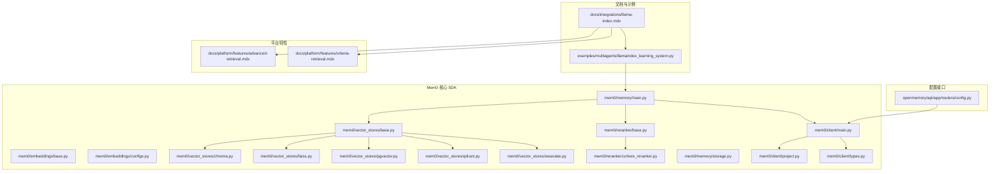
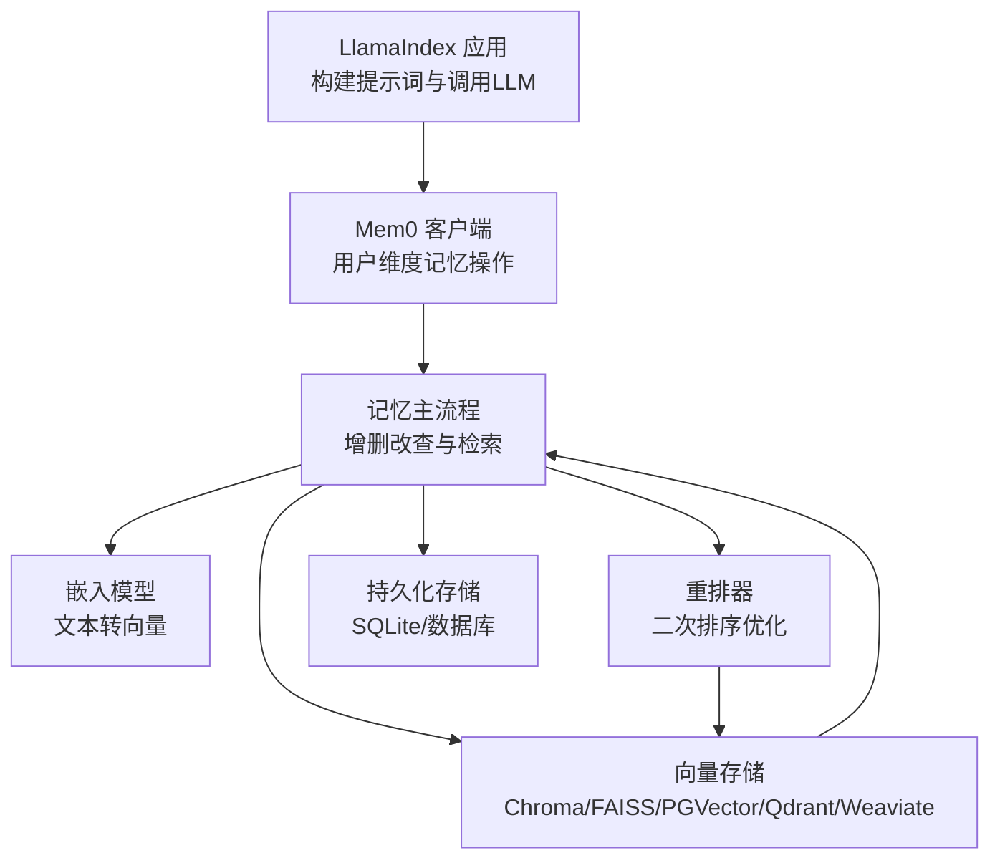
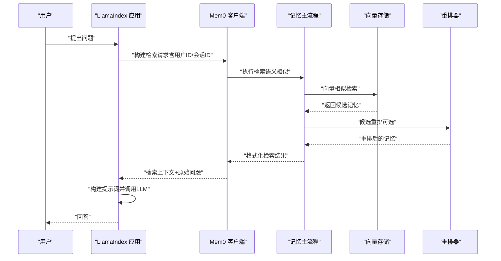
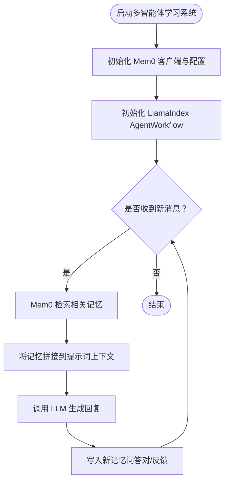
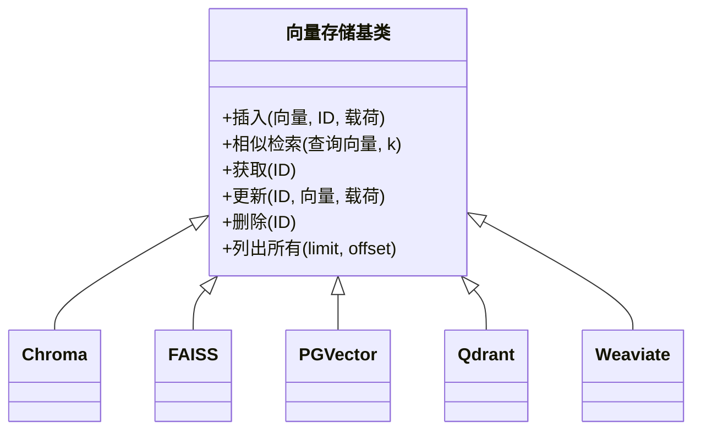
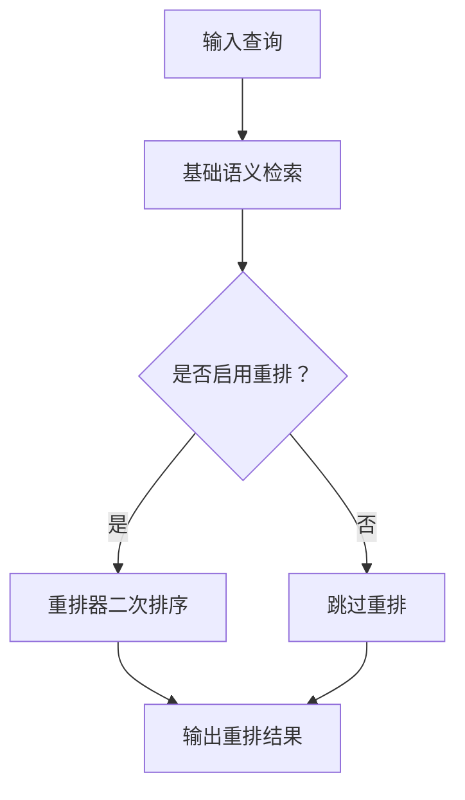
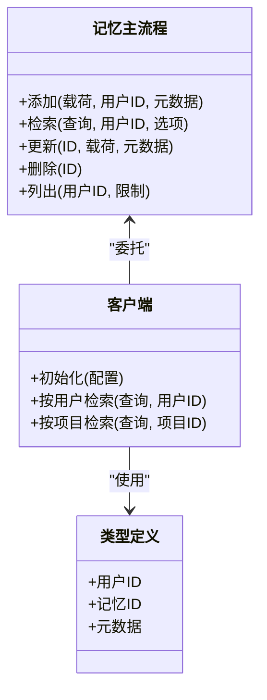
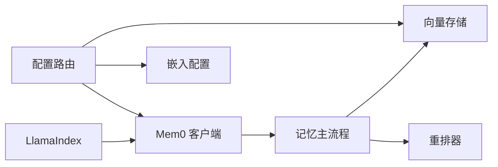

# LlamaIndex 集成

<cite>
**本文引用的文件**
- [llama-index.mdx](file://docs/integrations/llama-index.mdx)
- [llamaindex_learning_system.py](file://examples/multiagents/llamaindex_learning_system.py)
- [advanced-retrieval.mdx](file://docs/platform/features/advanced-retrieval.mdx)
- [criteria-retrieval.mdx](file://docs/platform/features/criteria-retrieval.mdx)
- [embeddings/base.py](file://mem0/embeddings/base.py)
- [embeddings/configs.py](file://mem0/embeddings/configs.py)
- [vector_stores/base.py](file://mem0/vector_stores/base.py)
- [vector_stores/chroma.py](file://mem0/vector_stores/chroma.py)
- [vector_stores/faiss.py](file://mem0/vector_stores/faiss.py)
- [vector_stores/pgvector.py](file://mem0/vector_stores/pgvector.py)
- [vector_stores/qdrant.py](file://mem0/vector_stores/qdrant.py)
- [vector_stores/weaviate.py](file://mem0/vector_stores/weaviate.py)
- [reranker/base.py](file://mem0/reranker/base.py)
- [reranker/cohere_reranker.py](file://mem0/reranker/cohere_reranker.py)
- [memory/main.py](file://mem0/memory/main.py)
- [memory/storage.py](file://mem0/memory/storage.py)
- [client/main.py](file://mem0/client/main.py)
- [client/project.py](file://mem0/client/project.py)
- [client/types.py](file://mem0/client/types.py)
- [openmemory/api/app/routers/config.py](file://openmemory/api/app/routers/config.py)
</cite>

## 目录
1. [简介](#简介)
2. [项目结构](#项目结构)
3. [核心组件](#核心组件)
4. [架构总览](#架构总览)
5. [详细组件分析](#详细组件分析)
6. [依赖关系分析](#依赖关系分析)
7. [性能考虑](#性能考虑)
8. [故障排除指南](#故障排除指南)
9. [结论](#结论)
10. [附录](#附录)

## 简介
本指南面向希望在 LlamaIndex 中集成 Mem0 的开发者，系统讲解如何将 Mem0 作为增强数据源与记忆组件接入 LlamaIndex 的检索增强生成（RAG）流程中。文档覆盖从概念到实践的完整路径：包括 Mem0 的记忆存储与检索能力、向量数据库与重排器的配置、以及在 LlamaIndex 多智能体学习系统中的实际应用示例。同时提供索引管理与查询优化策略，帮助在真实业务场景中实现稳定、可扩展且高性能的记忆增强问答系统。

## 项目结构
围绕 LlamaIndex 与 Mem0 的集成，仓库中与之直接相关的模块主要分布在以下区域：
- 文档与集成指南：docs/integrations/llama-index.mdx 提供高层集成思路与特性说明
- 示例工程：examples/multiagents/llamaindex_learning_system.py 展示多智能体学习系统中如何结合 LlamaIndex 与 Mem0
- 平台特性：docs/platform/features 下的高级检索与条件检索文档，指导搜索增强与排序策略
- 核心 SDK：mem0/ 目录下包含嵌入、向量存储、重排器、记忆主流程等模块
- 配置接口：openmemory/api/app/routers/config.py 提供运行时配置更新能力

**图示来源**
- [llama-index.mdx](file://docs/integrations/llama-index.mdx)
- [llamaindex_learning_system.py](file://examples/multiagents/llamaindex_learning_system.py)
- [advanced-retrieval.mdx](file://docs/platform/features/advanced-retrieval.mdx)
- [criteria-retrieval.mdx](file://docs/platform/features/criteria-retrieval.mdx)
- [embeddings/base.py](file://mem0/embeddings/base.py)
- [embeddings/configs.py](file://mem0/embeddings/configs.py)
- [vector_stores/base.py](file://mem0/vector_stores/base.py)
- [vector_stores/chroma.py](file://mem0/vector_stores/chroma.py)
- [vector_stores/faiss.py](file://mem0/vector_stores/faiss.py)
- [vector_stores/pgvector.py](file://mem0/vector_stores/pgvector.py)
- [vector_stores/qdrant.py](file://mem0/vector_stores/qdrant.py)
- [vector_stores/weaviate.py](file://mem0/vector_stores/weaviate.py)
- [reranker/base.py](file://mem0/reranker/base.py)
- [reranker/cohere_reranker.py](file://mem0/reranker/cohere_reranker.py)
- [memory/main.py](file://mem0/memory/main.py)
- [memory/storage.py](file://mem0/memory/storage.py)
- [client/main.py](file://mem0/client/main.py)
- [client/project.py](file://mem0/client/project.py)
- [client/types.py](file://mem0/client/types.py)
- [openmemory/api/app/routers/config.py](file://openmemory/api/app/routers/config.py)

**章节来源**
- [llama-index.mdx](file://docs/integrations/llama-index.mdx)
- [llamaindex_learning_system.py](file://examples/multiagents/llamaindex_learning_system.py)

## 核心组件
- 嵌入模型与配置：负责将文本转换为向量表示，支持多种提供商与本地实现，是检索的基础。
- 向量存储：提供多种向量数据库适配（如 Chroma、FAISS、PGVector、Qdrant、Weaviate），用于高效相似性检索。
- 重排器：在语义相似基础上进行二次排序，提升结果的相关性与顺序质量。
- 记忆主流程：封装记忆的增删改查、持久化与检索逻辑，统一对外接口。
- 客户端与项目配置：提供用户维度的记忆操作入口与项目级配置管理。
- 运行时配置更新：通过 API 路由动态调整嵌入与向量存储配置，无需重启服务。

**章节来源**
- [embeddings/base.py](file://mem0/embeddings/base.py)
- [embeddings/configs.py](file://mem0/embeddings/configs.py)
- [vector_stores/base.py](file://mem0/vector_stores/base.py)
- [reranker/base.py](file://mem0/reranker/base.py)
- [memory/main.py](file://mem0/memory/main.py)
- [client/main.py](file://mem0/client/main.py)
- [client/project.py](file://mem0/client/project.py)
- [openmemory/api/app/routers/config.py](file://openmemory/api/app/routers/config.py)

## 架构总览
下图展示了 LlamaIndex 与 Mem0 在 RAG 场景中的交互架构：LlamaIndex 负责构建提示词与调用大模型，Mem0 提供记忆检索与上下文增强，向量存储支撑高维相似性搜索，重排器优化最终候选顺序。

**图示来源**
- [llama-index.mdx](file://docs/integrations/llama-index.mdx)
- [memory/main.py](file://mem0/memory/main.py)
- [embeddings/base.py](file://mem0/embeddings/base.py)
- [vector_stores/base.py](file://mem0/vector_stores/base.py)
- [reranker/base.py](file://mem0/reranker/base.py)
- [memory/storage.py](file://mem0/memory/storage.py)

## 详细组件分析

### LlamaIndex 集成要点与适配器实现
- 集成目标：将 Mem0 的“记忆检索”能力作为 LlamaIndex 的外部数据源，增强检索阶段的上下文丰富度。
- 适配器模式：在 LlamaIndex 中通过自定义节点或检索器包装 Mem0 的检索接口，将返回的记忆片段拼接为检索上下文。
- 查询优化：在检索前对用户问题进行意图抽取与实体识别，缩小检索空间；在检索后利用重排器对候选进行再排序。
- 索引管理：根据业务规模选择合适的向量存储（如 FAISS 适合小规模快速检索，PGVector/Qdrant/Weaviate 适合生产环境）。

**图示来源**
- [llama-index.mdx](file://docs/integrations/llama-index.mdx)
- [memory/main.py](file://mem0/memory/main.py)
- [vector_stores/base.py](file://mem0/vector_stores/base.py)
- [reranker/base.py](file://mem0/reranker/base.py)

**章节来源**
- [llama-index.mdx](file://docs/integrations/llama-index.mdx)

### 多智能体学习系统示例（Mem0 + LlamaIndex）
该示例展示了如何在多智能体环境中，利用 LlamaIndex 的 AgentWorkflow 与 Mem0 的记忆能力，构建持续学习与上下文增强的对话系统。系统通过 Mem0 存储历史交互，LlamaIndex 将其转化为检索增强的上下文，从而实现个性化与连续性的智能体验。

**图示来源**
- [llamaindex_learning_system.py](file://examples/multiagents/llamaindex_learning_system.py)

**章节来源**
- [llamaindex_learning_system.py](file://examples/multiagents/llamaindex_learning_system.py)

### 向量存储与检索优化
- 向量存储选择：根据数据规模、延迟要求与部署环境选择合适引擎。FAISS 适合快速原型与小规模；PGVector/Qdrant/Weaviate 适合生产级检索。
- 检索参数：通过阈值、top_k、元数据过滤等参数控制召回范围与质量。
- 嵌入维度与归一化：确保向量维度一致并进行归一化处理，提升相似性计算稳定性。

**图示来源**
- [vector_stores/base.py](file://mem0/vector_stores/base.py)
- [vector_stores/chroma.py](file://mem0/vector_stores/chroma.py)
- [vector_stores/faiss.py](file://mem0/vector_stores/faiss.py)
- [vector_stores/pgvector.py](file://mem0/vector_stores/pgvector.py)
- [vector_stores/qdrant.py](file://mem0/vector_stores/qdrant.py)
- [vector_stores/weaviate.py](file://mem0/vector_stores/weaviate.py)

**章节来源**
- [vector_stores/base.py](file://mem0/vector_stores/base.py)
- [vector_stores/chroma.py](file://mem0/vector_stores/chroma.py)
- [vector_stores/faiss.py](file://mem0/vector_stores/faiss.py)
- [vector_stores/pgvector.py](file://mem0/vector_stores/pgvector.py)
- [vector_stores/qdrant.py](file://mem0/vector_stores/qdrant.py)
- [vector_stores/weaviate.py](file://mem0/vector_stores/weaviate.py)

### 重排器与高级检索策略
- 重排器：在语义相似的基础上，利用更深层的语义理解对候选进行再排序，显著提升相关性与顺序质量。
- 条件检索：通过自定义权重与情感/主题特征，对检索结果进行定向重排，满足特定业务需求。
- 性能权衡：重排会带来额外延迟，需结合业务场景评估启用策略。

**图示来源**
- [advanced-retrieval.mdx](file://docs/platform/features/advanced-retrieval.mdx)
- [criteria-retrieval.mdx](file://docs/platform/features/criteria-retrieval.mdx)
- [reranker/base.py](file://mem0/reranker/base.py)
- [reranker/cohere_reranker.py](file://mem0/reranker/cohere_reranker.py)

**章节来源**
- [advanced-retrieval.mdx](file://docs/platform/features/advanced-retrieval.mdx)
- [criteria-retrieval.mdx](file://docs/platform/features/criteria-retrieval.mdx)
- [reranker/base.py](file://mem0/reranker/base.py)
- [reranker/cohere_reranker.py](file://mem0/reranker/cohere_reranker.py)

### 记忆主流程与客户端
- 记忆主流程：统一处理记忆的增删改查、持久化与检索，屏蔽底层向量存储差异。
- 客户端：提供用户维度的操作入口，支持按用户/项目隔离记忆。
- 类型与配置：通过类型定义与配置对象约束行为，保证一致性与可维护性。

**图示来源**
- [memory/main.py](file://mem0/memory/main.py)
- [client/main.py](file://mem0/client/main.py)
- [client/types.py](file://mem0/client/types.py)

**章节来源**
- [memory/main.py](file://mem0/memory/main.py)
- [client/main.py](file://mem0/client/main.py)
- [client/types.py](file://mem0/client/types.py)

## 依赖关系分析
- LlamaIndex 与 Mem0 的耦合点在于检索阶段：LlamaIndex 调用 Mem0 客户端以获取上下文增强的记忆片段。
- 向量存储与重排器作为 Mem0 的内部依赖，彼此独立演进，可通过配置切换。
- 运行时配置路由允许在不重启的情况下更新嵌入与向量存储配置，提升运维灵活性。

**图示来源**
- [llama-index.mdx](file://docs/integrations/llama-index.mdx)
- [memory/main.py](file://mem0/memory/main.py)
- [vector_stores/base.py](file://mem0/vector_stores/base.py)
- [reranker/base.py](file://mem0/reranker/base.py)
- [openmemory/api/app/routers/config.py](file://openmemory/api/app/routers/config.py)

**章节来源**
- [openmemory/api/app/routers/config.py](file://openmemory/api/app/routers/config.py)

## 性能考虑
- 检索延迟：基础检索通常毫秒级，启用重排会增加约 150-200ms 的额外延迟，需结合业务容忍度评估。
- 缓存策略：对高频查询与会话内重复检索进行缓存，减少重复向量计算与存储访问。
- 分页与阈值：合理设置 top_k 与相似度阈值，避免过多候选导致的性能退化。
- 向量维度与索引：保持嵌入维度一致并进行归一化；在大规模场景优先选择支持高效索引的向量存储。
- 重排成本：仅在关键路径或需要最高精度时启用重排，普通场景可关闭以降低延迟。

**章节来源**
- [advanced-retrieval.mdx](file://docs/platform/features/advanced-retrieval.mdx)

## 故障排除指南
- 检索为空：检查用户 ID 是否正确、记忆是否已写入、向量存储是否初始化成功；必要时回退到基础检索验证链路。
- 相关性差：开启重排或调整检索阈值；检查嵌入模型与向量存储配置是否匹配。
- 性能异常：监控检索耗时与重排耗时，评估缓存命中率与索引效率；对热点查询建立缓存。
- 配置变更无效：确认运行时配置路由已正确更新并触发客户端重置；检查嵌入与向量存储提供商版本兼容性。

**章节来源**
- [openmemory/api/app/routers/config.py](file://openmemory/api/app/routers/config.py)

## 结论
通过将 Mem0 的记忆检索能力与 LlamaIndex 的 RAG 流程深度融合，可以构建具备上下文记忆与持续学习能力的智能问答系统。结合合适的向量存储与重排策略，在保证性能的同时显著提升回答质量与用户体验。建议在开发过程中遵循“先基础检索、后重排优化”的渐进式策略，并通过缓存与阈值调优实现生产级稳定性。

## 附录
- 快速开始：参考 LlamaIndex 集成文档与多智能体示例，完成最小可用的检索增强问答系统。
- 最佳实践：优先使用 FAISS 进行原型验证，生产环境迁移至 PGVector/Qdrant/Weaviate；在关键路径启用重排并配合缓存。
- 参考路径：嵌入模型与配置位于 mem0/embeddings，向量存储位于 mem0/vector_stores，重排器位于 mem0/reranker，记忆主流程位于 mem0/memory，客户端位于 mem0/client。