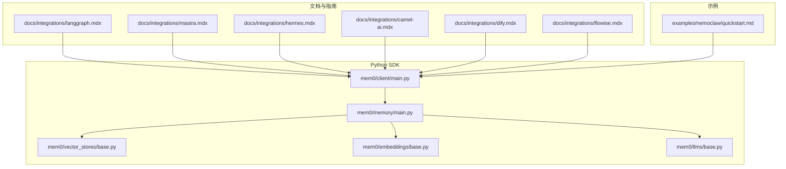
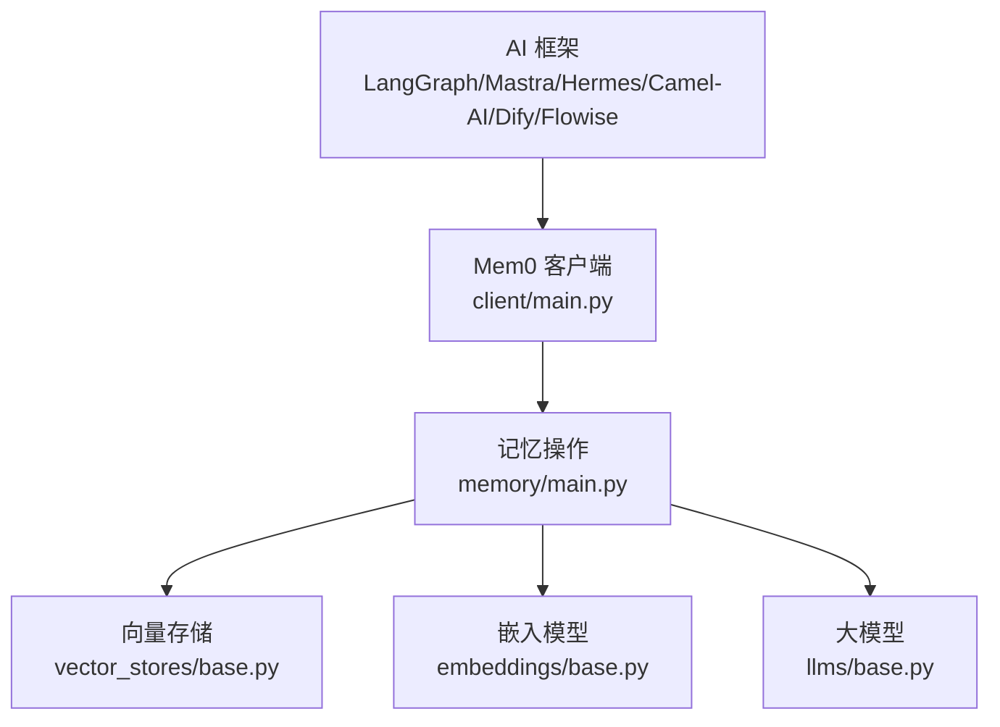
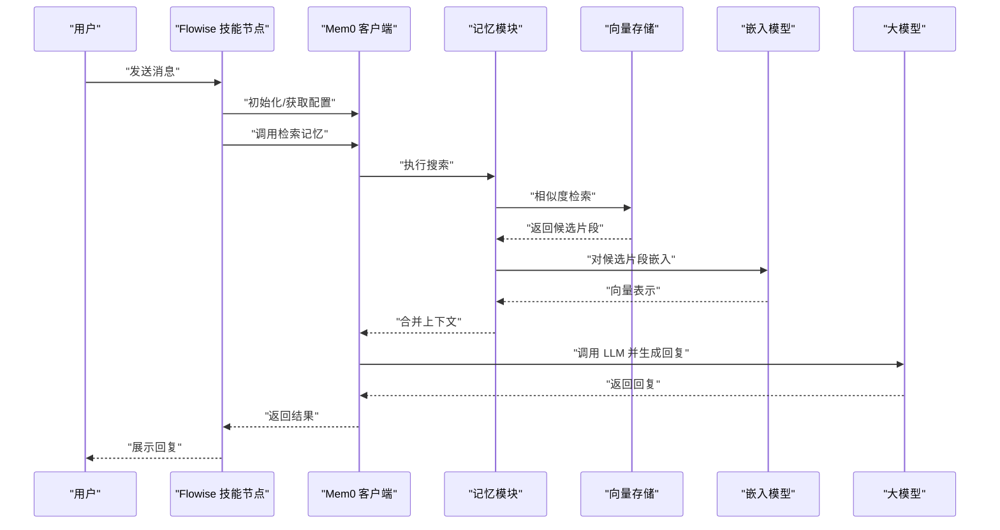
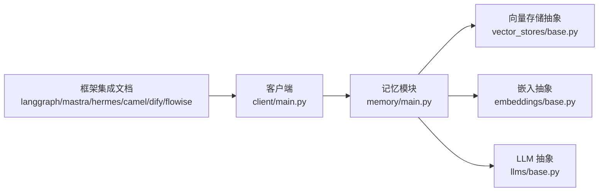

# 其他框架集成

<cite>
**本文引用的文件**
- [README.md](file://README.md)
- [integrations/mastra/README.md](file://integrations/mastra/README.md)
- [docs/integrations/langgraph.mdx](file://docs/integrations/langgraph.mdx)
- [docs/integrations/mastra.mdx](file://docs/integrations/mastra.mdx)
- [docs/integrations/hermes.mdx](file://docs/integrations/hermes.mdx)
- [docs/integrations/camel-ai.mdx](file://docs/integrations/camel-ai.mdx)
- [docs/integrations/dify.mdx](file://docs/integrations/dify.mdx)
- [docs/integrations/flowise.mdx](file://docs/integrations/flowise.mdx)
- [mem0/client/main.py](file://mem0/client/main.py)
- [mem0/memory/main.py](file://mem0/memory/main.py)
- [mem0/vector_stores/base.py](file://mem0/vector_stores/base.py)
- [mem0/embeddings/base.py](file://mem0/embeddings/base.py)
- [mem0/llms/base.py](file://mem0/llms/base.py)
- [examples/nemoclaw/quickstart.md](file://examples/nemoclaw/quickstart.md)
</cite>

## 目录
1. [简介](#简介)
2. [项目结构](#项目结构)
3. [核心组件](#核心组件)
4. [架构总览](#架构总览)
5. [详细组件分析](#详细组件分析)
6. [依赖关系分析](#依赖关系分析)
7. [性能考虑](#性能考虑)
8. [故障排除指南](#故障排除指南)
9. [结论](#结论)

## 简介
本指南面向希望在其他主流 AI 框架中集成 Mem0 的开发者，覆盖 LangGraph、Mastra、Hermes、Camel-AI、Dify、Flowise 等框架的集成方式。内容包括基础集成步骤、配置要点、各框架特点与适用场景、快速开始指引以及常见问题排查建议。Mem0 提供统一的记忆存储与检索能力，支持多种嵌入模型、向量数据库与大模型服务，可作为这些框架的外部记忆层或工具扩展。

## 项目结构
- 文档与集成指南集中在 docs/integrations 下，包含各框架的官方集成说明与最佳实践。
- Python SDK 在 mem0/client 与 mem0/memory 中提供客户端与记忆操作接口。
- 向量存储、嵌入与大模型抽象位于 mem0/vector_stores、mem0/embeddings、mem0/llms 的 base 类中，便于扩展适配。
- 示例工程 examples/nemoclaw 展示了与外部平台的快速集成思路。

**图表来源**
- [docs/integrations/langgraph.mdx](file://docs/integrations/langgraph.mdx)
- [docs/integrations/mastra.mdx](file://docs/integrations/mastra.mdx)
- [docs/integrations/hermes.mdx](file://docs/integrations/hermes.mdx)
- [docs/integrations/camel-ai.mdx](file://docs/integrations/camel-ai.mdx)
- [docs/integrations/dify.mdx](file://docs/integrations/dify.mdx)
- [docs/integrations/flowise.mdx](file://docs/integrations/flowise.mdx)
- [mem0/client/main.py](file://mem0/client/main.py)
- [mem0/memory/main.py](file://mem0/memory/main.py)
- [mem0/vector_stores/base.py](file://mem0/vector_stores/base.py)
- [mem0/embeddings/base.py](file://mem0/embeddings/base.py)
- [mem0/llms/base.py](file://mem0/llms/base.py)
- [examples/nemoclaw/quickstart.md](file://examples/nemoclaw/quickstart.md)

**章节来源**
- [README.md](file://README.md)
- [docs/integrations/langgraph.mdx](file://docs/integrations/langgraph.mdx)
- [docs/integrations/mastra.mdx](file://docs/integrations/mastra.mdx)
- [docs/integrations/hermes.mdx](file://docs/integrations/hermes.mdx)
- [docs/integrations/camel-ai.mdx](file://docs/integrations/camel-ai.mdx)
- [docs/integrations/dify.mdx](file://docs/integrations/dify.mdx)
- [docs/integrations/flowise.mdx](file://docs/integrations/flowise.mdx)
- [mem0/client/main.py](file://mem0/client/main.py)
- [mem0/memory/main.py](file://mem0/memory/main.py)
- [mem0/vector_stores/base.py](file://mem0/vector_stores/base.py)
- [mem0/embeddings/base.py](file://mem0/embeddings/base.py)
- [mem0/llms/base.py](file://mem0/llms/base.py)
- [examples/nemoclaw/quickstart.md](file://examples/nemoclaw/quickstart.md)

## 核心组件
- 客户端与记忆操作：通过 mem0/client/main.py 提供统一的初始化与调用入口；mem0/memory/main.py 实现记忆的增删改查、搜索与历史记录等核心功能。
- 向量存储抽象：mem0/vector_stores/base.py 定义向量数据库的通用接口，便于对接 Chroma、Pinecone、Qdrant、Weaviate、FAISS、Redis、PgVector 等。
- 嵌入模型抽象：mem0/embeddings/base.py 抽象嵌入生成接口，支持 OpenAI、HuggingFace、Gemini、Ollama、Vertex AI 等。
- 大模型抽象：mem0/llms/base.py 抽象 LLM 调用接口，兼容 OpenAI、Anthropic、Bedrock、Groq、Together 等。
- 配置与工厂：mem0/configs 下包含各类组件的配置项与枚举，配合工厂模块实现按需加载与替换。

**章节来源**
- [mem0/client/main.py](file://mem0/client/main.py)
- [mem0/memory/main.py](file://mem0/memory/main.py)
- [mem0/vector_stores/base.py](file://mem0/vector_stores/base.py)
- [mem0/embeddings/base.py](file://mem0/embeddings/base.py)
- [mem0/llms/base.py](file://mem0/llms/base.py)

## 架构总览
下图展示了 Mem0 在各框架中的典型集成位置：作为外部记忆层（Memory Layer）或工具/节点扩展（Tool/Node），与框架的执行流协同工作。

**图表来源**
- [mem0/client/main.py](file://mem0/client/main.py)
- [mem0/memory/main.py](file://mem0/memory/main.py)
- [mem0/vector_stores/base.py](file://mem0/vector_stores/base.py)
- [mem0/embeddings/base.py](file://mem0/embeddings/base.py)
- [mem0/llms/base.py](file://mem0/llms/base.py)

## 详细组件分析

### LangGraph 集成
- 集成方式：将 Mem0 作为 Graph 节点的工具或在节点逻辑中直接调用 Mem0 客户端进行记忆检索与写入。
- 关键步骤
  - 初始化 Mem0 客户端与配置（嵌入、向量库、LLM）。
  - 在节点函数中调用搜索/添加记忆 API，将上下文注入到 LLM 推理链路。
  - 使用历史查询增强长期记忆。
- 适用场景：需要在多轮对话或复杂流程中维护与检索用户/任务相关记忆的场景。
- 快速开始：参考 LangGraph 集成文档与示例工程思路。

**章节来源**
- [docs/integrations/langgraph.mdx](file://docs/integrations/langgraph.mdx)
- [mem0/client/main.py](file://mem0/client/main.py)
- [mem0/memory/main.py](file://mem0/memory/main.py)

### Mastra 集成
- 集成方式：通过 Mastra 的工具系统封装 Mem0 客户端，使其成为可被代理使用的工具。
- 关键步骤
  - 将 Mem0 的“搜索记忆”“添加记忆”等能力包装为工具。
  - 在 Mastra 的代理配置中注册该工具，使代理可在推理过程中调用。
- 适用场景：构建以工具调用为核心的自动化代理，强调可组合性与可插拔性。
- 快速开始：参考 Mastra 集成文档与工具封装示例。

**章节来源**
- [docs/integrations/mastra.mdx](file://docs/integrations/mastra.mdx)
- [mem0/client/main.py](file://mem0/client/main.py)
- [mem0/memory/main.py](file://mem0/memory/main.py)

### Hermes 集成
- 集成方式：在 Hermes 的代理执行流程中，于消息处理前后调用 Mem0 进行记忆的读取与更新。
- 关键步骤
  - 在收到用户输入后先检索相关记忆，再将上下文拼接至提示词。
  - 在输出生成后将关键信息写入记忆，形成闭环。
- 适用场景：强调对话连贯性的智能体，需要基于历史交互持续优化回复质量。
- 快速开始：参考 Hermes 集成文档与对话式应用示例。

**章节来源**
- [docs/integrations/hermes.mdx](file://docs/integrations/hermes.mdx)
- [mem0/client/main.py](file://mem0/client/main.py)
- [mem0/memory/main.py](file://mem0/memory/main.py)

### Camel-AI 集成
- 集成方式：将 Mem0 作为团队智能体的共享记忆源，跨角色协作时共享检索结果。
- 关键步骤
  - 为每个角色配置独立的用户 ID 或会话标识，避免记忆混淆。
  - 在角色切换或任务交接时，使用搜索接口获取上下文，减少重复输入。
- 适用场景：多角色协作、任务编排与知识沉淀的复杂工作流。
- 快速开始：参考 Camel-AI 集成文档与团队协作示例。

**章节来源**
- [docs/integrations/camel-ai.mdx](file://docs/integrations/camel-ai.mdx)
- [mem0/client/main.py](file://mem0/client/main.py)
- [mem0/memory/main.py](file://mem0/memory/main.py)

### Dify 集成
- 集成方式：通过 Dify 的工作流节点或函数工具接入 Mem0，实现“检索增强”或“记忆回放”。
- 关键步骤
  - 在工作流中插入“检索记忆”节点，将返回结果注入到下游 LLM 节点。
  - 对输出进行“写入记忆”节点，完成经验积累。
- 适用场景：低代码/可视化构建智能体，强调易用性与快速迭代。
- 快速开始：参考 Dify 集成文档与工作流示例。

**章节来源**
- [docs/integrations/dify.mdx](file://docs/integrations/dify.mdx)
- [mem0/client/main.py](file://mem0/client/main.py)
- [mem0/memory/main.py](file://mem0/memory/main.py)

### Flowise 集成
- 集成方式：在 Flowise 的技能（Skill）或自定义节点中封装 Mem0 客户端，实现检索与写入。
- 关键步骤
  - 创建“检索记忆”与“添加记忆”的技能节点。
  - 在聊天机器人流程中串联这些节点，提升个性化与一致性。
- 适用场景：快速搭建聊天机器人原型，强调灵活性与可扩展性。
- 快速开始：参考 Flowise 集成文档与技能开发指南。

**章节来源**
- [docs/integrations/flowise.mdx](file://docs/integrations/flowise.mdx)
- [mem0/client/main.py](file://mem0/client/main.py)
- [mem0/memory/main.py](file://mem0/memory/main.py)

### 组件调用序列（以 Flowise 为例）

**图表来源**
- [mem0/client/main.py](file://mem0/client/main.py)
- [mem0/memory/main.py](file://mem0/memory/main.py)
- [mem0/vector_stores/base.py](file://mem0/vector_stores/base.py)
- [mem0/embeddings/base.py](file://mem0/embeddings/base.py)
- [mem0/llms/base.py](file://mem0/llms/base.py)

## 依赖关系分析
- 组件耦合：框架侧仅依赖 Mem0 客户端接口，具体实现（嵌入、向量库、LLM）通过配置解耦，降低框架绑定风险。
- 扩展点：通过 base 抽象类可无缝替换实现，例如更换向量库或嵌入模型提供商。
- 外部依赖：各框架的版本兼容性与工具/节点生态可能影响集成体验，建议优先采用官方推荐版本。

**图表来源**
- [docs/integrations/langgraph.mdx](file://docs/integrations/langgraph.mdx)
- [docs/integrations/mastra.mdx](file://docs/integrations/mastra.mdx)
- [docs/integrations/hermes.mdx](file://docs/integrations/hermes.mdx)
- [docs/integrations/camel-ai.mdx](file://docs/integrations/camel-ai.mdx)
- [docs/integrations/dify.mdx](file://docs/integrations/dify.mdx)
- [docs/integrations/flowise.mdx](file://docs/integrations/flowise.mdx)
- [mem0/client/main.py](file://mem0/client/main.py)
- [mem0/memory/main.py](file://mem0/memory/main.py)
- [mem0/vector_stores/base.py](file://mem0/vector_stores/base.py)
- [mem0/embeddings/base.py](file://mem0/embeddings/base.py)
- [mem0/llms/base.py](file://mem0/llms/base.py)

**章节来源**
- [docs/integrations/langgraph.mdx](file://docs/integrations/langgraph.mdx)
- [docs/integrations/mastra.mdx](file://docs/integrations/mastra.mdx)
- [docs/integrations/hermes.mdx](file://docs/integrations/hermes.mdx)
- [docs/integrations/camel-ai.mdx](file://docs/integrations/camel-ai.mdx)
- [docs/integrations/dify.mdx](file://docs/integrations/dify.mdx)
- [docs/integrations/flowise.mdx](file://docs/integrations/flowise.mdx)
- [mem0/client/main.py](file://mem0/client/main.py)
- [mem0/memory/main.py](file://mem0/memory/main.py)
- [mem0/vector_stores/base.py](file://mem0/vector_stores/base.py)
- [mem0/embeddings/base.py](file://mem0/embeddings/base.py)
- [mem0/llms/base.py](file://mem0/llms/base.py)

## 性能考虑
- 向量检索优化：合理设置向量库参数（如 top_k、距离度量）与索引策略，平衡召回率与延迟。
- 嵌入成本控制：批量处理文本、缓存常用查询的嵌入向量，减少重复计算。
- LLM 调用节流：对长上下文进行截断或摘要，避免超出上下文长度限制。
- 异步写入：在不影响实时性的前提下，采用异步写入减少前端等待时间。
- 缓存策略：对热点记忆与常用检索结果进行缓存，降低重复检索开销。

## 故障排除指南
- 认证与密钥
  - 确认所有服务的 API Key 与端点配置正确，检查网络访问权限。
  - 若使用代理或企业防火墙，确保允许相关域名通信。
- 向量库连接失败
  - 检查连接字符串、认证凭据与实例状态；确认网络连通性与安全组规则。
- 嵌入模型不可用
  - 切换到本地嵌入模型（如 Ollama/FastEmbed）进行验证，排除云端服务异常。
- LLM 调用超时
  - 降低并发请求、启用重试与指数退避；必要时切换到更稳定的模型提供商。
- 记忆未命中或重复
  - 检查用户 ID/会话标识是否一致；确认检索阈值与过滤条件设置合理。
- 快速开始参考
  - 可参考 Nemoclaw 快速开始文档，了解从零到一的集成路径与常见陷阱。

**章节来源**
- [examples/nemoclaw/quickstart.md](file://examples/nemoclaw/quickstart.md)

## 结论
通过将 Mem0 作为统一的记忆中枢，各主流 AI 框架可以以最小侵入的方式获得强大的长期记忆与检索能力。建议根据自身技术栈选择合适的集成文档与示例，结合性能与稳定性需求调整配置，并在上线前完成充分的测试与压测。