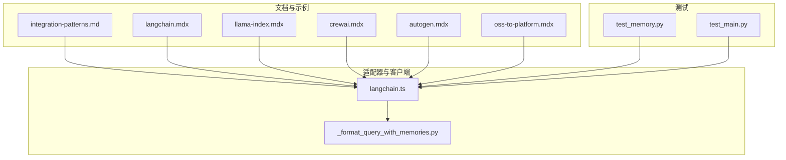
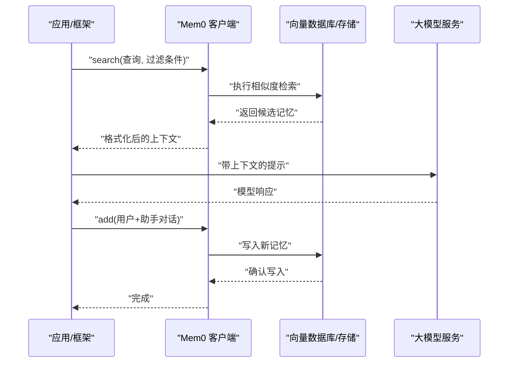
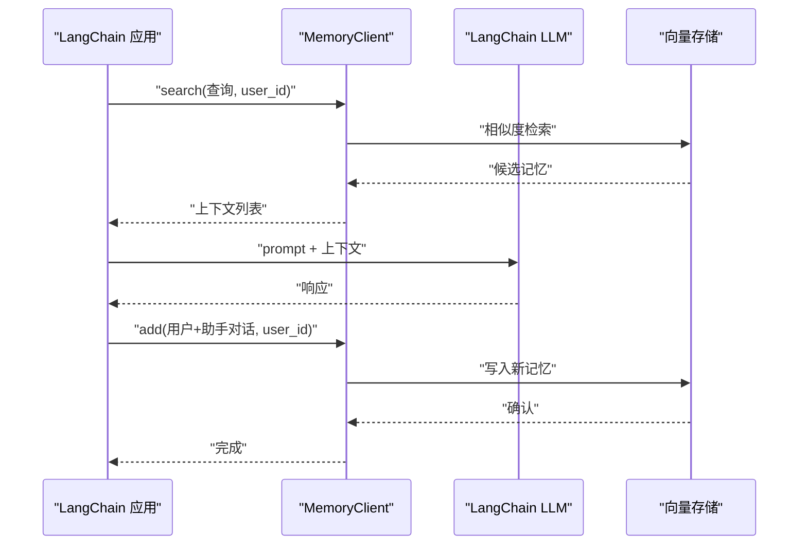
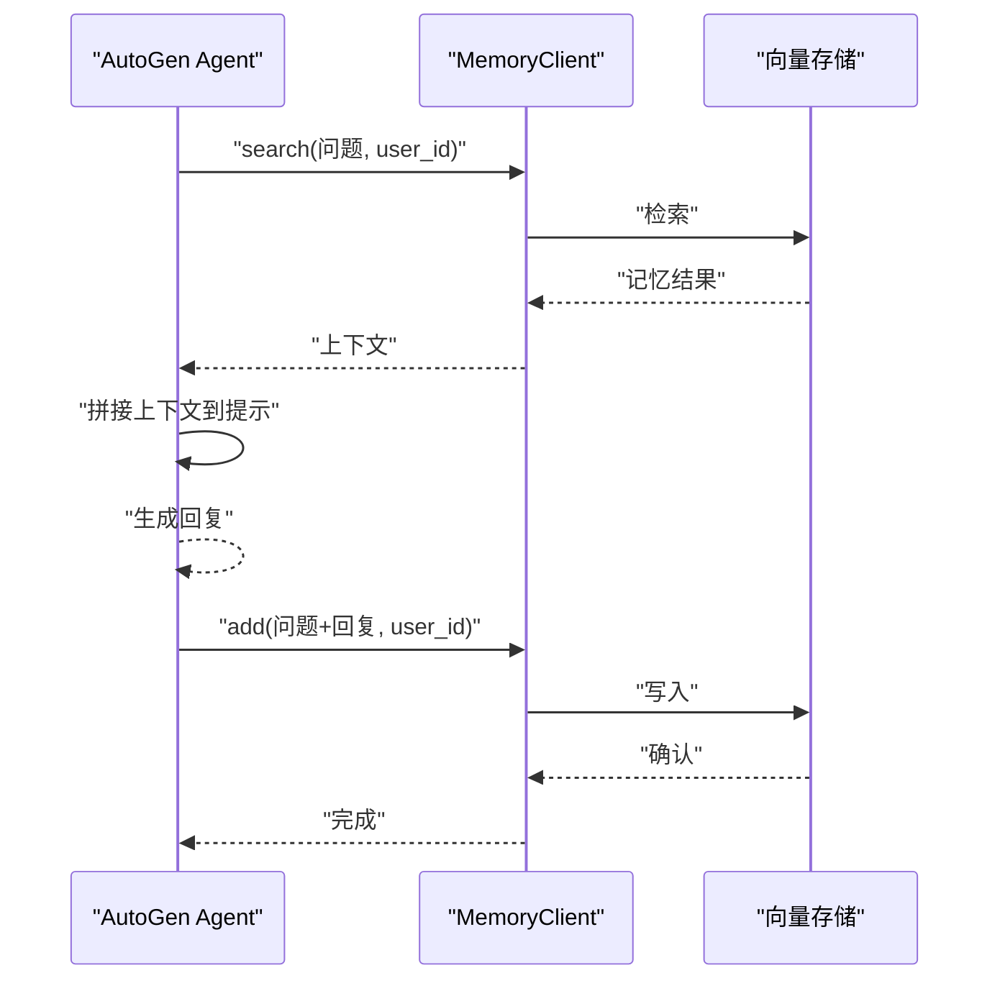
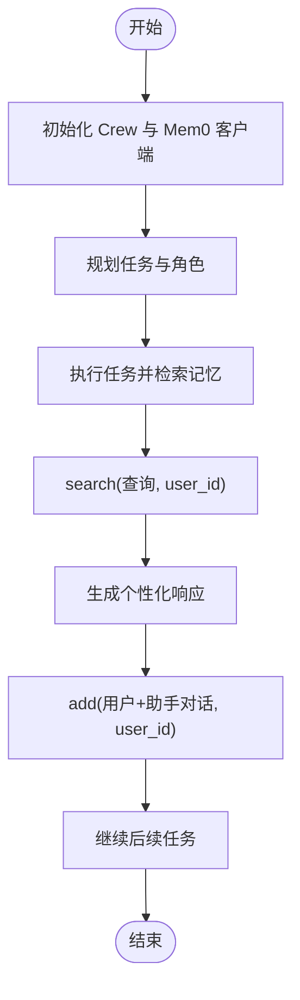
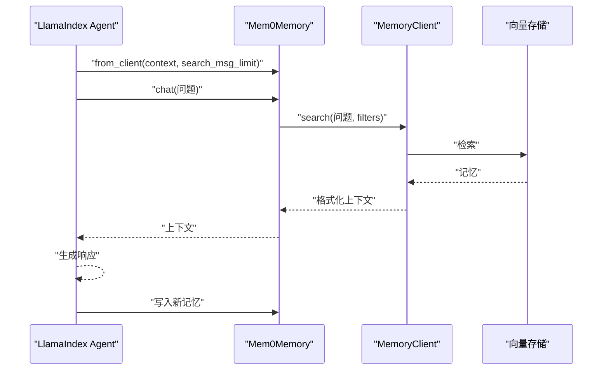
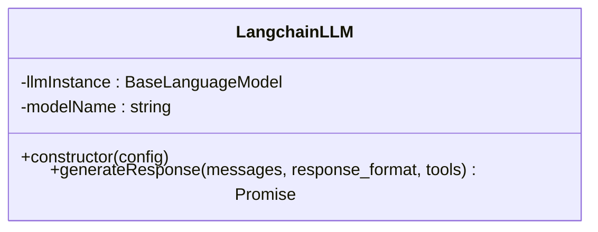
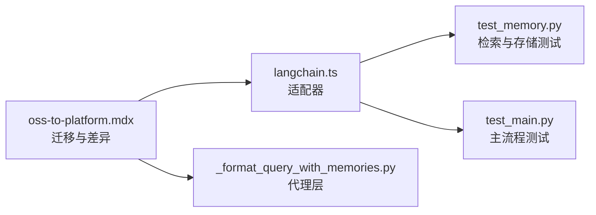

# 框架集成

<cite>
**本文引用的文件**
- [integration-patterns.md](file://skills/mem0/references/integration-patterns.md)
- [langchain.mdx](file://docs/integrations/langchain.mdx)
- [llama-index.mdx](file://docs/integrations/llama-index.mdx)
- [crewai.mdx](file://docs/integrations/crewai.mdx)
- [autogen.mdx](file://docs/integrations/autogen.mdx)
- [oss-to-platform.mdx](file://docs/migration/oss-to-platform.mdx)
- [langchain.ts](file://mem0-ts/src/oss/src/llms/langchain.ts)
- [_format_query_with_memories.py](file://mem0/proxy/main.py)
- [test_memory.py](file://tests/test_memory.py)
- [test_main.py](file://tests/test_main.py)
</cite>

## 目录
1. [简介](#简介)
2. [项目结构](#项目结构)
3. [核心组件](#核心组件)
4. [架构总览](#架构总览)
5. [详细组件分析](#详细组件分析)
6. [依赖关系分析](#依赖关系分析)
7. [性能考量](#性能考量)
8. [故障排除指南](#故障排除指南)
9. [结论](#结论)
10. [附录](#附录)

## 简介
本指南面向希望在主流 AI 框架（LangChain、AutoGen、CrewAI、LlamaIndex）中集成 Mem0 记忆能力的开发者。文档系统性阐述各框架的集成模式、适配器实现、配置要点、性能优化与常见问题排查方法，并通过图示与路径指引帮助快速落地。

## 项目结构
围绕“框架集成”的相关资源主要分布在以下位置：
- 文档与示例：docs/integrations/*.mdx 与 skills/mem0/references/integration-patterns.md
- TypeScript 适配器：mem0-ts/src/oss/src/llms/langchain.ts
- 平台客户端与代理层：mem0/proxy/main.py
- 测试用例：tests/test_memory.py、tests/test_main.py
- 迁移与平台差异：docs/migration/oss-to-platform.mdx

图表来源
- [integration-patterns.md:1-380](file://skills/mem0/references/integration-patterns.md#L1-L380)
- [langchain.ts:38-69](file://mem0-ts/src/oss/src/llms/langchain.ts#L38-L69)
- [_format_query_with_memories.py:181-191](file://mem0/proxy/main.py#L181-L191)
- [test_memory.py:101-165](file://tests/test_memory.py#L101-L165)
- [test_main.py:68-100](file://tests/test_main.py#L68-L100)

章节来源
- [integration-patterns.md:1-380](file://skills/mem0/references/integration-patterns.md#L1-L380)
- [langchain.ts:38-69](file://mem0-ts/src/oss/src/llms/langchain.ts#L38-L69)
- [oss-to-platform.mdx:385-406](file://docs/migration/oss-to-platform.mdx#L385-L406)

## 核心组件
- 集成模式（通用三步法）
  - 检索：在生成前基于查询检索相关记忆
  - 生成：将检索到的记忆作为上下文注入提示
  - 存储：将本次交互写回 Mem0，形成闭环
- 平台客户端与代理层
  - MemoryClient 提供统一的搜索、添加、删除等操作接口
  - 代理层负责格式化检索结果与消息拼接
- TypeScript 适配器
  - LangchainLLM 将 LangChain 实例包装为可调用的 LLM 适配器，支持结构化输出与工具调用

章节来源
- [integration-patterns.md:10-18](file://skills/mem0/references/integration-patterns.md#L10-L18)
- [_format_query_with_memories.py:181-191](file://mem0/proxy/main.py#L181-L191)
- [langchain.ts:38-69](file://mem0-ts/src/oss/src/llms/langchain.ts#L38-L69)

## 架构总览
下图展示了 Mem0 在不同框架中的典型调用链路与数据流：

图表来源
- [integration-patterns.md:10-18](file://skills/mem0/references/integration-patterns.md#L10-L18)
- [oss-to-platform.mdx:385-406](file://docs/migration/oss-to-platform.mdx#L385-L406)

## 详细组件分析

### LangChain 集成
- 集成模式
  - 使用 ChatPromptTemplate 定义包含占位符的提示
  - 调用 MemoryClient.search 获取相关记忆，拼装为系统消息
  - 通过链式调用 llm 生成回复
  - 将对话对写回 Mem0
- 关键实现要点
  - 检索与拼装：从 search 结果提取 memory 字段并序列化
  - 上下文注入：将检索到的事实与实体信息拼接到最终提示
  - 一致性：确保 user_id 与 agent_id（如适用）贯穿检索与存储
- 适配器与类型安全
  - LangchainLLM 构造函数校验传入实例具备 invoke 方法
  - 支持结构化输出与工具调用参数透传
- 最佳实践
  - 控制检索上下文长度，避免上下文溢出
  - 对检索到的记忆进行去重与排序
  - 在多轮对话中复用 user_id 保持会话连续性

图表来源
- [integration-patterns.md:24-61](file://skills/mem0/references/integration-patterns.md#L24-L61)
- [langchain.ts:38-69](file://mem0-ts/src/oss/src/llms/langchain.ts#L38-L69)

章节来源
- [integration-patterns.md:20-67](file://skills/mem0/references/integration-patterns.md#L20-L67)
- [langchain.mdx:1-44](file://docs/integrations/langchain.mdx#L1-L44)
- [langchain.ts:38-69](file://mem0-ts/src/oss/src/llms/langchain.ts#L38-L69)

### AutoGen 集成
- 集成模式
  - 基于 ConversableAgent 构建对话智能体
  - 在每次回复前调用 MemoryClient.search 获取历史上下文
  - 将上下文拼接到提示中，再生成回复
  - 将新的问答对写回 Mem0
- 关键实现要点
  - 统一 user_id：保证跨轮次记忆一致
  - 上下文格式：将检索到的记忆拼接为字符串，作为系统提示的一部分
- 最佳实践
  - 合理设置检索条数，避免上下文过长
  - 对重复或低质量记忆进行过滤

图表来源
- [integration-patterns.md:346-377](file://skills/mem0/references/integration-patterns.md#L346-L377)

章节来源
- [integration-patterns.md:338-377](file://skills/mem0/references/integration-patterns.md#L338-L377)
- [autogen.mdx:1-44](file://docs/integrations/autogen.mdx#L1-L44)

### CrewAI 集成
- 集成模式
  - 使用 CrewAI 的 Agent、Task、Crew 管理任务编排
  - 通过 MemoryClient 存储与检索用户偏好与历史交互
  - 可结合搜索工具（如 SerperDevTool）增强检索能力
- 关键实现要点
  - 初始化 MemoryClient 并设置 API Key
  - 在任务执行前后进行记忆读写
- 最佳实践
  - 将用户 ID 与任务上下文绑定，提升个性化效果
  - 对搜索结果进行二次筛选与摘要

图表来源
- [crewai.mdx:15-44](file://docs/integrations/crewai.mdx#L15-L44)

章节来源
- [crewai.mdx:1-44](file://docs/integrations/crewai.mdx#L1-L44)

### LlamaIndex 集成
- 集成模式
  - 使用 Mem0Memory.from_client 创建内存实例
  - 支持 ReAct 与 FunctionCalling Agent
  - 通过 search_msg_limit 控制检索的历史消息数量
- 关键实现要点
  - 从平台客户端初始化 Mem0Memory，自动对接云端基础设施
  - 与 LlamaIndex Agent 协同，实现上下文感知的聊天与工具调用
- 最佳实践
  - 合理设置 search_msg_limit，平衡上下文长度与检索成本
  - 在多 Agent 场景中为每个 Agent 分配独立 user_id

图表来源
- [llama-index.mdx:38-194](file://docs/integrations/llama-index.mdx#L38-L194)
- [integration-patterns.md:301-334](file://skills/mem0/references/integration-patterns.md#L301-L334)

章节来源
- [llama-index.mdx:1-214](file://docs/integrations/llama-index.mdx#L1-L214)
- [integration-patterns.md:301-334](file://skills/mem0/references/integration-patterns.md#L301-L334)

### TypeScript 适配器（LangChainLLM）
- 设计目标
  - 将 LangChain 的 BaseLanguageModel 包装为统一的 LLM 接口
  - 支持结构化输出与工具调用参数透传
- 关键点
  - 构造函数校验传入实例具备 invoke 方法
  - 自动推断模型标识（modelId 或 model），用于日志与追踪
  - generateResponse 中根据 response_format 判断是否启用结构化输出

图表来源
- [langchain.ts:38-69](file://mem0-ts/src/oss/src/llms/langchain.ts#L38-L69)

章节来源
- [langchain.ts:38-69](file://mem0-ts/src/oss/src/llms/langchain.ts#L38-L69)

## 依赖关系分析
- 平台迁移与客户端差异
  - 从开源版本切换至平台版本时，初始化方式、过滤参数位置与部分方法签名发生变化
  - 建议在迁移前后核对 API 行为差异，必要时采用回滚计划
- 代理层与存储层耦合
  - 代理层负责将检索结果格式化为提示文本，降低上层框架对底层存储细节的依赖
- 测试覆盖
  - 测试用例覆盖了集合名重置、不完整负载处理、评分详情等场景，保障检索稳定性

图表来源
- [oss-to-platform.mdx:385-406](file://docs/migration/oss-to-platform.mdx#L385-L406)
- [langchain.ts:38-69](file://mem0-ts/src/oss/src/llms/langchain.ts#L38-L69)
- [_format_query_with_memories.py:181-191](file://mem0/proxy/main.py#L181-L191)
- [test_memory.py:101-165](file://tests/test_memory.py#L101-L165)
- [test_main.py:68-100](file://tests/test_main.py#L68-L100)

章节来源
- [oss-to-platform.mdx:385-406](file://docs/migration/oss-to-platform.mdx#L385-L406)
- [test_memory.py:101-165](file://tests/test_memory.py#L101-L165)
- [test_main.py:68-100](file://tests/test_main.py#L68-L100)

## 性能考量
- 检索效率
  - 控制检索上下文长度与返回条数，避免上下文溢出与延迟上升
  - 对检索结果进行去重与排序，减少无关信息干扰
- 写入策略
  - 批量写入与去重策略可降低写放大
  - 对重复或低质量记忆进行过滤，维持向量库健康度
- 类型安全与适配器
  - 通过 LangchainLLM 的构造校验与模型标识推断，减少运行期错误
- 测试驱动
  - 通过测试用例验证检索异常负载处理与评分细节，提升稳定性

## 故障排除指南
- 常见问题
  - 初始化失败：确认已正确设置 API Key 或配置对象
  - 检索无结果：检查 user_id 是否一致、过滤条件是否正确
  - 上下文过长：调整检索条数与上下文拼装策略
- 回滚与迁移
  - 若遇到平台版本问题，可按迁移文档回退至开源版本
- 测试辅助
  - 使用测试用例定位检索异常负载与评分细节问题

章节来源
- [oss-to-platform.mdx:385-406](file://docs/migration/oss-to-platform.mdx#L385-L406)
- [test_memory.py:125-152](file://tests/test_memory.py#L125-L152)
- [test_main.py:93-100](file://tests/test_main.py#L93-L100)

## 结论
通过统一的“检索-生成-存储”三步法与适配器封装，Mem0 能够以较低侵入的方式融入 LangChain、AutoGen、CrewAI、LlamaIndex 等主流框架。建议在实际项目中结合自身业务特点，合理设置检索参数与写入策略，并通过测试与迁移文档保障稳定性与可维护性。

## 附录
- 快速参考路径
  - LangChain 集成示例与模式：[integration-patterns.md:20-67](file://skills/mem0/references/integration-patterns.md#L20-L67)
  - AutoGen 集成示例：[integration-patterns.md:346-377](file://skills/mem0/references/integration-patterns.md#L346-L377)
  - CrewAI 集成示例：[crewai.mdx:15-44](file://docs/integrations/crewai.mdx#L15-L44)
  - LlamaIndex 集成示例：[llama-index.mdx:38-194](file://docs/integrations/llama-index.mdx#L38-L194)
  - TypeScript 适配器实现：[langchain.ts:38-69](file://mem0-ts/src/oss/src/llms/langchain.ts#L38-L69)
  - 平台迁移与差异：[oss-to-platform.mdx:385-406](file://docs/migration/oss-to-platform.mdx#L385-L406)
  - 代理层上下文格式化：[_format_query_with_memories.py:181-191](file://mem0/proxy/main.py#L181-L191)
  - 检索异常负载测试：[test_memory.py:125-152](file://tests/test_memory.py#L125-L152)
  - 主流程测试：[test_main.py:93-100](file://tests/test_main.py#L93-L100)