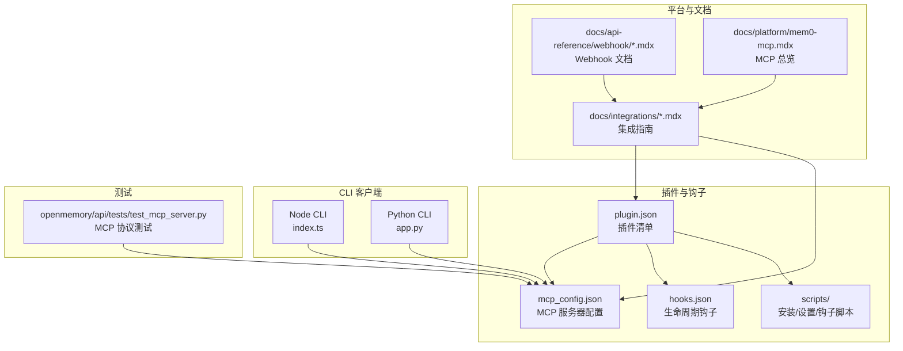
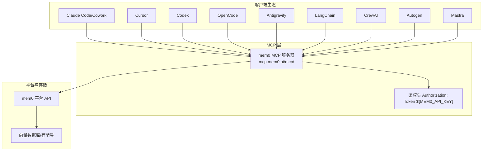
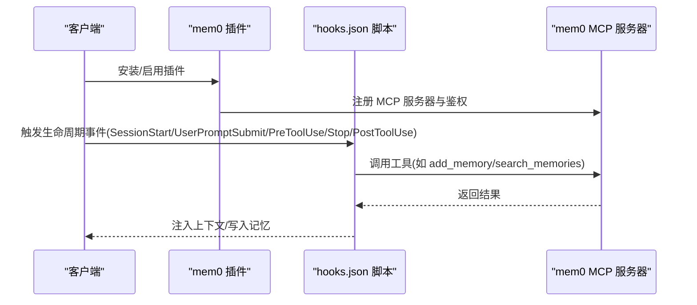
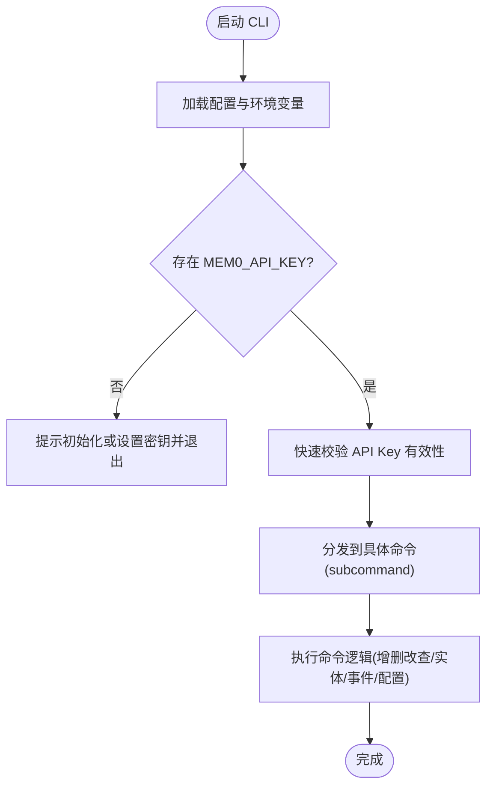
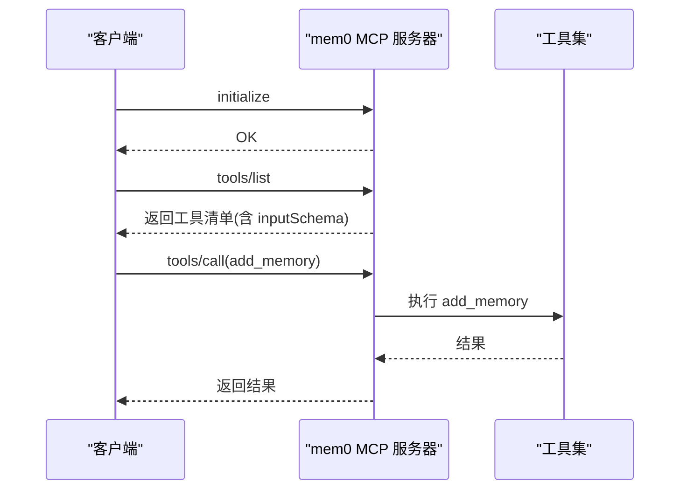
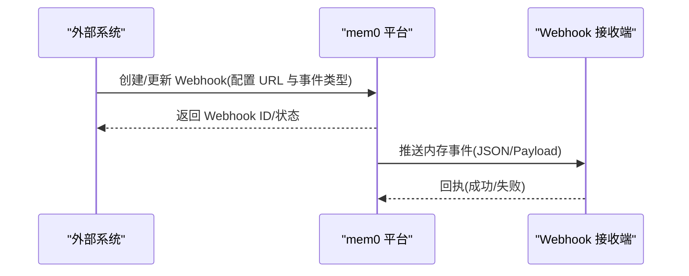
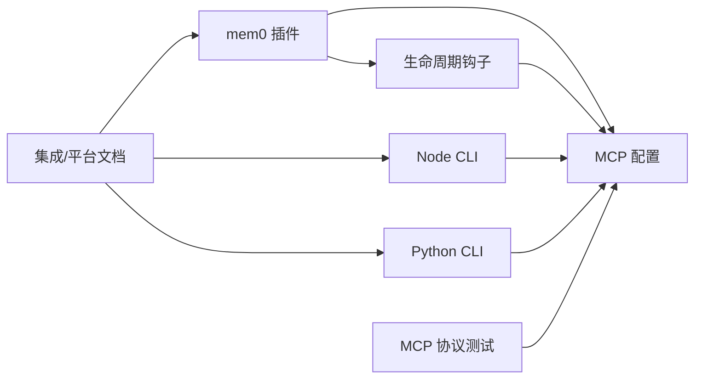

# 第三方集成

<cite>
**本文引用的文件**
- [integrations/mem0-plugin/plugin.json](file://integrations/mem0-plugin/plugin.json)
- [integrations/mem0-plugin/hooks.json](file://integrations/mem0-plugin/hooks.json)
- [integrations/mem0-plugin/mcp_config.json](file://integrations/mem0-plugin/mcp_config.json)
- [integrations/mem0-plugin/README.md](file://integrations/mem0-plugin/README.md)
- [integrations/mem0-plugin/scripts/install_codex_hooks.py](file://integrations/mem0-plugin/scripts/install_codex_hooks.py)
- [integrations/mem0-plugin/scripts/setup_coding_categories.py](file://integrations/mem0-plugin/scripts/setup_coding_categories.py)
- [cli/node/src/index.ts](file://cli/node/src/index.ts)
- [cli/python/src/mem0_cli/app.py](file://cli/python/src/mem0_cli/app.py)
- [openmemory/api/tests/test_mcp_server.py](file://openmemory/api/tests/test_mcp_server.py)
- [docs/api-reference/webhook/create-webhook.mdx](file://docs/api-reference/webhook/create-webhook.mdx)
- [docs/api-reference/webhook/update-webhook.mdx](file://docs/api-reference/webhook/update-webhook.mdx)
- [docs/platform/features/webhooks.mdx](file://docs/platform/features/webhooks.mdx)
- [docs/integrations/langchain.mdx](file://docs/integrations/langchain.mdx)
- [docs/integrations/crewai.mdx](file://docs/integrations/crewai.mdx)
- [docs/integrations/autogen.mdx](file://docs/integrations/autogen.mdx)
- [docs/integrations/claude-code.mdx](file://docs/integrations/claude-code.mdx)
- [docs/integrations/cursor.mdx](file://docs/integrations/cursor.mdx)
- [docs/integrations/mastra.mdx](file://docs/integrations/mastra.mdx)
- [docs/platform/mem0-mcp.mdx](file://docs/platform/mem0-mcp.mdx)
- [docs/platform/features/mcp-integration.mdx](file://docs/platform/features/mcp-integration.mdx)
- [docs/platform/advanced-memory-operations.mdx](file://docs/platform/advanced-memory-operations.mdx)
- [docs/platform/overview.mdx](file://docs/platform/overview.mdx)
- [docs/open-source/setup.mdx](file://docs/open-source/setup.mdx)
- [docs/open-source/python-quickstart.mdx](file://docs/open-source/python-quickstart.mdx)
- [docs/open-source/node-quickstart.mdx](file://docs/open-source/node-quickstart.mdx)
- [docs/migration/api-changes.mdx](file://docs/migration/api-changes.mdx)
- [docs/migration/oss-to-platform.mdx](file://docs/migration/oss-to-platform.mdx)
- [docs/migration/oss-v2-to-v3.mdx](file://docs/migration/oss-v2-to-v3.mdx)
- [docs/migration/platform-v2-to-v3.mdx](file://docs/migration/platform-v2-to-v3.mdx)
- [docs/migration/server-pgvector-upgrade.mdx](file://docs/migration/server-pgvector-upgrade.mdx)
</cite>

## 目录
1. [简介](#简介)
2. [项目结构](#项目结构)
3. [核心组件](#核心组件)
4. [架构总览](#架构总览)
5. [详细组件分析](#详细组件分析)
6. [依赖关系分析](#依赖关系分析)
7. [性能考量](#性能考量)
8. [故障排查指南](#故障排查指南)
9. [结论](#结论)
10. [附录](#附录)

## 简介
本指南面向需要在各类 AI 框架与开发工具中集成 mem0 的工程师与平台团队，覆盖以下目标：
- 与 LangChain、CrewAI、Autogen、Claude Code、Cursor 等工具的集成步骤与最佳实践
- 插件系统的架构与开发规范（MCP 服务器、生命周期钩子、技能与脚本）
- 自定义集成的开发指南：API 扩展、Webhook 集成与实时通信
- 兼容性要求、版本管理与迁移策略
- 集成测试与调试技巧

mem0 提供统一的记忆存储与检索能力，并通过 MCP（Model Context Protocol）与多客户端协作，同时支持 CLI 工具链与平台 API，便于在不同生态中复用。

## 项目结构
围绕“第三方集成”，本仓库的关键目录与文件如下：
- 插件与钩子：integrations/mem0-plugin（包含插件清单、MCP 配置、生命周期钩子、安装脚本等）
- CLI 客户端：cli/node 与 cli/python（命令行入口、参数解析、后端调用）
- 平台与文档：docs（官方集成指南、平台特性、迁移与配置）
- 测试：openmemory/api/tests（MCP 协议端到端测试）

图表来源
- [integrations/mem0-plugin/plugin.json:1-14](file://integrations/mem0-plugin/plugin.json#L1-L14)
- [integrations/mem0-plugin/hooks.json:1-105](file://integrations/mem0-plugin/hooks.json#L1-L105)
- [integrations/mem0-plugin/mcp_config.json:1-11](file://integrations/mem0-plugin/mcp_config.json#L1-L11)
- [cli/node/src/index.ts:1-881](file://cli/node/src/index.ts#L1-L881)
- [cli/python/src/mem0_cli/app.py:1-1334](file://cli/python/src/mem0_cli/app.py#L1-L1334)
- [openmemory/api/tests/test_mcp_server.py:115-343](file://openmemory/api/tests/test_mcp_server.py#L115-L343)

章节来源
- [integrations/mem0-plugin/README.md:1-306](file://integrations/mem0-plugin/README.md#L1-L306)
- [integrations/mem0-plugin/plugin.json:1-14](file://integrations/mem0-plugin/plugin.json#L1-L14)
- [integrations/mem0-plugin/hooks.json:1-105](file://integrations/mem0-plugin/hooks.json#L1-L105)
- [integrations/mem0-plugin/mcp_config.json:1-11](file://integrations/mem0-plugin/mcp_config.json#L1-L11)
- [cli/node/src/index.ts:1-881](file://cli/node/src/index.ts#L1-L881)
- [cli/python/src/mem0_cli/app.py:1-1334](file://cli/python/src/mem0_cli/app.py#L1-L1334)
- [openmemory/api/tests/test_mcp_server.py:115-343](file://openmemory/api/tests/test_mcp_server.py#L115-L343)

## 核心组件
- 插件清单与元数据：定义插件标识、名称、版本、描述、上下文文件等，用于各客户端识别与注册。
- MCP 服务器配置：集中声明远程 MCP 服务地址与鉴权头，确保客户端可直接连接 mem0 平台的 MCP 服务。
- 生命周期钩子：在会话开始、用户提交提示、工具使用前后、停止等事件点触发本地脚本，实现自动记忆捕获、元数据强制、上下文注入等。
- CLI 客户端：Node 与 Python 双栈 CLI，负责初始化、认证、实体与内存操作、事件查询、导入导出等，为集成提供一致的命令行体验。
- 平台与文档：官方集成指南、MCP 总览、Webhook 能力、迁移与配置文档，支撑跨框架对接。

章节来源
- [integrations/mem0-plugin/plugin.json:1-14](file://integrations/mem0-plugin/plugin.json#L1-L14)
- [integrations/mem0-plugin/mcp_config.json:1-11](file://integrations/mem0-plugin/mcp_config.json#L1-L11)
- [integrations/mem0-plugin/hooks.json:1-105](file://integrations/mem0-plugin/hooks.json#L1-L105)
- [cli/node/src/index.ts:1-881](file://cli/node/src/index.ts#L1-L881)
- [cli/python/src/mem0_cli/app.py:1-1334](file://cli/python/src/mem0_cli/app.py#L1-L1334)

## 架构总览
mem0 的第三方集成以“MCP 为中心”的架构实现跨客户端与框架的统一访问。客户端通过 MCP 服务器调用 mem0 的工具集（添加、搜索、更新、删除记忆等），同时借助生命周期钩子实现无侵入的记忆捕获与上下文增强。

图表来源
- [integrations/mem0-plugin/mcp_config.json:1-11](file://integrations/mem0-plugin/mcp_config.json#L1-L11)
- [docs/platform/mem0-mcp.mdx](file://docs/platform/mem0-mcp.mdx)
- [docs/platform/features/mcp-integration.mdx](file://docs/platform/features/mcp-integration.mdx)

## 详细组件分析

### 组件一：插件系统与生命周期钩子
- 插件清单：包含插件元信息与上下文文件，用于客户端识别与加载。
- MCP 配置：统一声明 mem0 MCP 服务器地址与鉴权方式，适配不同客户端的配置格式。
- 生命周期钩子：在关键事件触发本地脚本，实现自动记忆捕获、元数据强制、文件读取上下文注入、会话总结等。

图表来源
- [integrations/mem0-plugin/hooks.json:1-105](file://integrations/mem0-plugin/hooks.json#L1-L105)
- [integrations/mem0-plugin/mcp_config.json:1-11](file://integrations/mem0-plugin/mcp_config.json#L1-L11)
- [integrations/mem0-plugin/plugin.json:1-14](file://integrations/mem0-plugin/plugin.json#L1-L14)

章节来源
- [integrations/mem0-plugin/plugin.json:1-14](file://integrations/mem0-plugin/plugin.json#L1-L14)
- [integrations/mem0-plugin/hooks.json:1-105](file://integrations/mem0-plugin/hooks.json#L1-L105)
- [integrations/mem0-plugin/mcp_config.json:1-11](file://integrations/mem0-plugin/mcp_config.json#L1-L11)
- [integrations/mem0-plugin/README.md:1-306](file://integrations/mem0-plugin/README.md#L1-L306)

### 组件二：CLI 客户端（Node 与 Python）
- Node CLI：命令式入口，支持 init、memory 增删改查、entity 管理、event 查询、config 管理等；内置 API Key 校验与遥测上报。
- Python CLI：功能对齐 Node 版本，提供相同命令语义与输出格式；同样具备 API Key 校验与遥测。

图表来源
- [cli/node/src/index.ts:33-88](file://cli/node/src/index.ts#L33-L88)
- [cli/python/src/mem0_cli/app.py:100-152](file://cli/python/src/mem0_cli/app.py#L100-L152)

章节来源
- [cli/node/src/index.ts:1-881](file://cli/node/src/index.ts#L1-L881)
- [cli/python/src/mem0_cli/app.py:1-1334](file://cli/python/src/mem0_cli/app.py#L1-L1334)

### 组件三：MCP 协议与工具集
- 协议测试：覆盖初始化、工具列表、未知工具调用、不同用户隔离等场景，验证响应正确性与传输错误码保留。
- 工具集：包括 add_memory、search_memories、get_memories、get_memory、update_memory、delete_memory、delete_all_memories、delete_entities、list_entities 等。

图表来源
- [openmemory/api/tests/test_mcp_server.py:140-343](file://openmemory/api/tests/test_mcp_server.py#L140-L343)

章节来源
- [openmemory/api/tests/test_mcp_server.py:115-343](file://openmemory/api/tests/test_mcp_server.py#L115-L343)
- [integrations/mem0-plugin/README.md:287-302](file://integrations/mem0-plugin/README.md#L287-L302)

### 组件四：Webhook 实时通知
- 平台提供 Webhook 能力，可在项目上创建/更新 Webhook，订阅内存事件，接收实时通知。
- 文档定义了创建与更新 Webhook 的接口与用途。

图表来源
- [docs/api-reference/webhook/create-webhook.mdx:1-5](file://docs/api-reference/webhook/create-webhook.mdx#L1-L5)
- [docs/api-reference/webhook/update-webhook.mdx:1-5](file://docs/api-reference/webhook/update-webhook.mdx#L1-L5)
- [docs/platform/features/webhooks.mdx](file://docs/platform/features/webhooks.mdx)

章节来源
- [docs/api-reference/webhook/create-webhook.mdx:1-5](file://docs/api-reference/webhook/create-webhook.mdx#L1-L5)
- [docs/api-reference/webhook/update-webhook.mdx:1-5](file://docs/api-reference/webhook/update-webhook.mdx#L1-L5)
- [docs/platform/features/webhooks.mdx](file://docs/platform/features/webhooks.mdx)

## 依赖关系分析
- 插件依赖：各客户端通过插件清单与 MCP 配置文件发现并连接 mem0 MCP 服务器。
- CLI 依赖：Node 与 Python CLI 依赖统一的配置加载与后端封装，确保跨语言一致性。
- 平台依赖：MCP 工具集与平台 API 紧密耦合，测试覆盖协议正确性与隔离性。
- 文档依赖：集成指南与平台特性文档为第三方集成提供权威参考。

图表来源
- [integrations/mem0-plugin/plugin.json:1-14](file://integrations/mem0-plugin/plugin.json#L1-L14)
- [integrations/mem0-plugin/mcp_config.json:1-11](file://integrations/mem0-plugin/mcp_config.json#L1-L11)
- [integrations/mem0-plugin/hooks.json:1-105](file://integrations/mem0-plugin/hooks.json#L1-L105)
- [cli/node/src/index.ts:1-881](file://cli/node/src/index.ts#L1-L881)
- [cli/python/src/mem0_cli/app.py:1-1334](file://cli/python/src/mem0_cli/app.py#L1-L1334)
- [openmemory/api/tests/test_mcp_server.py:115-343](file://openmemory/api/tests/test_mcp_server.py#L115-L343)

章节来源
- [integrations/mem0-plugin/plugin.json:1-14](file://integrations/mem0-plugin/plugin.json#L1-L14)
- [integrations/mem0-plugin/mcp_config.json:1-11](file://integrations/mem0-plugin/mcp_config.json#L1-L11)
- [integrations/mem0-plugin/hooks.json:1-105](file://integrations/mem0-plugin/hooks.json#L1-L105)
- [cli/node/src/index.ts:1-881](file://cli/node/src/index.ts#L1-L881)
- [cli/python/src/mem0_cli/app.py:1-1334](file://cli/python/src/mem0_cli/app.py#L1-L1334)
- [openmemory/api/tests/test_mcp_server.py:115-343](file://openmemory/api/tests/test_mcp_server.py#L115-L343)

## 性能考量
- MCP 连接与超时：在钩子与客户端中合理设置超时，避免阻塞主流程；对网络不稳定场景进行降级处理。
- 工具调用频率控制：批量写入与高并发场景下，建议合并请求或限流，减少平台压力。
- 本地脚本开销：钩子脚本应尽量轻量化，避免长耗时操作；必要时异步化或延迟执行。
- 缓存与预热：在会话开始阶段预加载常用上下文，减少检索等待时间。

## 故障排查指南
- API Key 无效或过期：CLI 在启动时进行快速校验，若失败请重新初始化或检查环境变量。
- 插件未生效：确认已设置 MEM0_API_KEY，重启客户端以重新读取配置；不同客户端的配置位置与格式略有差异。
- 钩子未触发：Codex 需要手动安装钩子；确保 feature 标志开启且路径正确。
- MCP 工具不可用：检查工具清单与 inputSchema 是否存在；验证初始化与调用流程。
- Webhook 不可达：核对回调地址、鉴权与重试策略；关注平台返回的回执状态。

章节来源
- [cli/node/src/index.ts:33-88](file://cli/node/src/index.ts#L33-L88)
- [cli/python/src/mem0_cli/app.py:100-152](file://cli/python/src/mem0_cli/app.py#L100-L152)
- [integrations/mem0-plugin/README.md:1-306](file://integrations/mem0-plugin/README.md#L1-L306)
- [openmemory/api/tests/test_mcp_server.py:115-343](file://openmemory/api/tests/test_mcp_server.py#L115-L343)

## 结论
mem0 通过标准化的 MCP 与插件体系，实现了在多种 AI 工具与框架中的无缝集成。结合生命周期钩子、CLI 工具与平台 API/Webhook，开发者可以构建从自动记忆捕获到实时事件通知的完整闭环。遵循本文档的集成步骤、开发规范与最佳实践，可显著降低集成成本并提升稳定性。

## 附录

### 与主流框架与工具的集成步骤
- LangChain
  - 使用 MCP 工具集在链路中插入记忆检索与写入；参考官方集成指南与 MCP 总览。
  - 章节来源
    - [docs/integrations/langchain.mdx](file://docs/integrations/langchain.mdx)
    - [docs/platform/mem0-mcp.mdx](file://docs/platform/mem0-mcp.mdx)
- CrewAI
  - 在 Crew 的任务编排中调用 mem0 MCP 工具，实现跨回合的记忆累积与上下文注入。
  - 章节来源
    - [docs/integrations/crewai.mdx](file://docs/integrations/crewai.mdx)
    - [docs/platform/mem0-mcp.mdx](file://docs/platform/mem0-mcp.mdx)
- Autogen
  - 在多智能体编排中通过 MCP 工具共享与检索记忆，实现跨代理的知识复用。
  - 章节来源
    - [docs/integrations/autogen.mdx](file://docs/integrations/autogen.mdx)
    - [docs/platform/mem0-mcp.mdx](file://docs/platform/mem0-mcp.mdx)
- Claude Code
  - 通过插件市场安装 mem0 插件，启用 MCP 与生命周期钩子；使用 onboard/health/stats 等命令验证。
  - 章节来源
    - [docs/integrations/claude-code.mdx](file://docs/integrations/claude-code.mdx)
    - [integrations/mem0-plugin/README.md:1-306](file://integrations/mem0-plugin/README.md#L1-L306)
- Cursor
  - 支持一键 deeplink 或手动配置 MCP；也可从 Marketplace 安装完整插件包。
  - 章节来源
    - [docs/integrations/cursor.mdx](file://docs/integrations/cursor.mdx)
    - [integrations/mem0-plugin/README.md:129-186](file://integrations/mem0-plugin/README.md#L129-L186)
- Mastra
  - 通过 MCP 工具集与平台 API 构建可扩展的 AI 应用；参考官方集成指南。
  - 章节来源
    - [docs/integrations/mastra.mdx](file://docs/integrations/mastra.mdx)
    - [docs/platform/mem0-mcp.mdx](file://docs/platform/mem0-mcp.mdx)

### 插件开发规范与最佳实践
- 插件清单：确保 id/name/version/description/author/repository/license 等字段完整。
- MCP 配置：统一使用 Authorization 头携带 MEM0_API_KEY；避免硬编码。
- 生命周期钩子：匹配表达式精准，超时合理设置；脚本路径绝对化并考虑跨平台兼容。
- 技能与脚本：保持幂等性与可重复执行；提供健康检查与错误回退。
- 章节来源
  - [integrations/mem0-plugin/plugin.json:1-14](file://integrations/mem0-plugin/plugin.json#L1-L14)
  - [integrations/mem0-plugin/mcp_config.json:1-11](file://integrations/mem0-plugin/mcp_config.json#L1-L11)
  - [integrations/mem0-plugin/hooks.json:1-105](file://integrations/mem0-plugin/hooks.json#L1-L105)
  - [integrations/mem0-plugin/README.md:1-306](file://integrations/mem0-plugin/README.md#L1-L306)

### API 扩展、Webhook 与实时通信
- API 扩展：基于平台 API 进行业务扩展（如自定义检索、导出/导入、实体管理）。
- Webhook：创建/更新项目级 Webhook，订阅内存事件，实现实时通知与联动。
- 章节来源
  - [docs/api-reference/webhook/create-webhook.mdx:1-5](file://docs/api-reference/webhook/create-webhook.mdx#L1-L5)
  - [docs/api-reference/webhook/update-webhook.mdx:1-5](file://docs/api-reference/webhook/update-webhook.mdx#L1-L5)
  - [docs/platform/features/webhooks.mdx](file://docs/platform/features/webhooks.mdx)

### 兼容性、版本管理与迁移策略
- 兼容性：遵循各客户端的插件与 MCP 配置格式；在不同版本间保持最小变更。
- 版本管理：使用 semver 管理插件版本；发布前进行多客户端验证。
- 迁移策略：参考 OSS 到平台、v2 到 v3、API 变更与服务升级等迁移文档。
- 章节来源
  - [docs/migration/api-changes.mdx](file://docs/migration/api-changes.mdx)
  - [docs/migration/oss-to-platform.mdx](file://docs/migration/oss-to-platform.mdx)
  - [docs/migration/oss-v2-to-v3.mdx](file://docs/migration/oss-v2-to-v3.mdx)
  - [docs/migration/platform-v2-to-v3.mdx](file://docs/migration/platform-v2-to-v3.mdx)
  - [docs/migration/server-pgvector-upgrade.mdx](file://docs/migration/server-pgvector-upgrade.mdx)

### 集成测试与调试技巧
- MCP 协议测试：覆盖初始化、工具列表、未知工具调用、不同用户隔离等场景。
- CLI 行为验证：使用 health/stats/remember/tour 等命令快速验证连通性与功能。
- 钩子调试：Codex 需要安装钩子；确保 feature 标志开启；路径绝对化。
- 章节来源
  - [openmemory/api/tests/test_mcp_server.py:115-343](file://openmemory/api/tests/test_mcp_server.py#L115-L343)
  - [integrations/mem0-plugin/README.md:200-223](file://integrations/mem0-plugin/README.md#L200-L223)
  - [integrations/mem0-plugin/scripts/install_codex_hooks.py](file://integrations/mem0-plugin/scripts/install_codex_hooks.py)