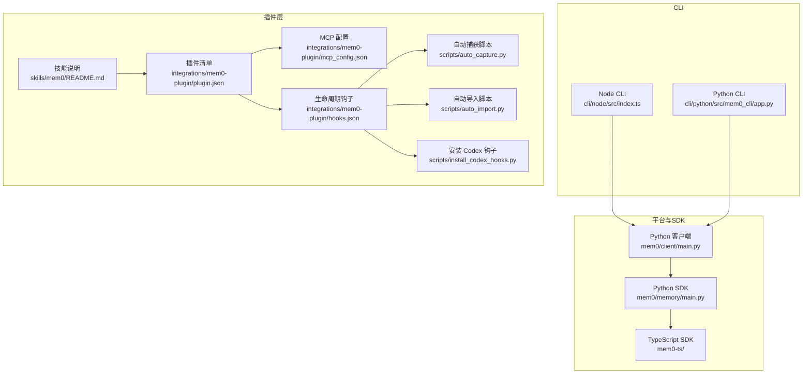
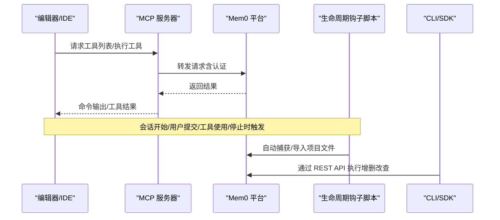
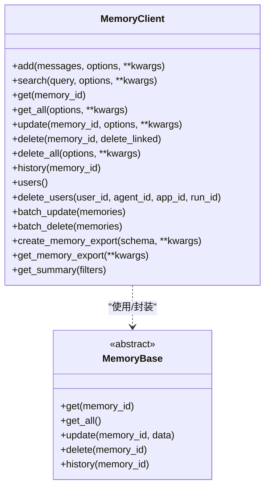
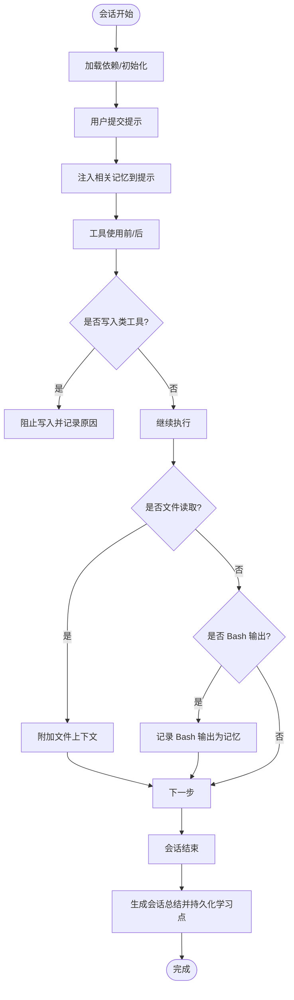
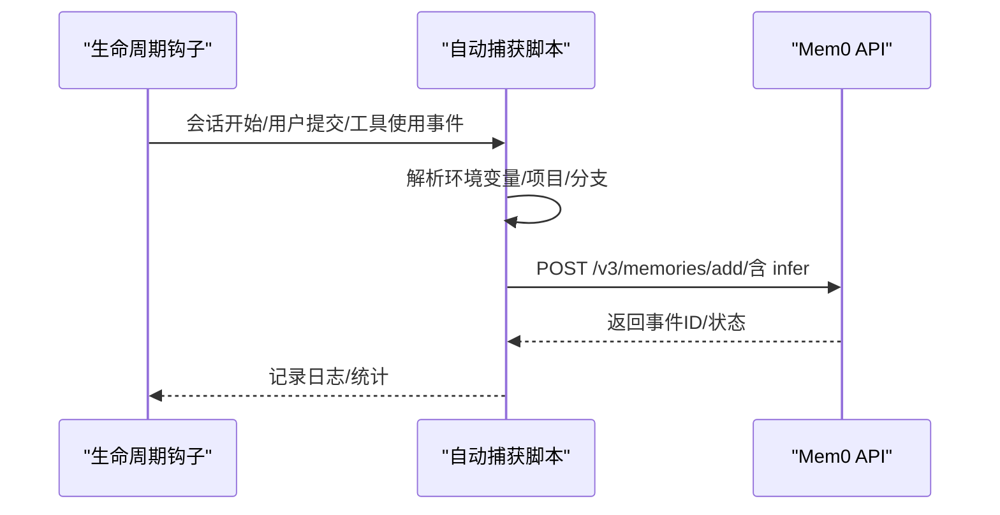
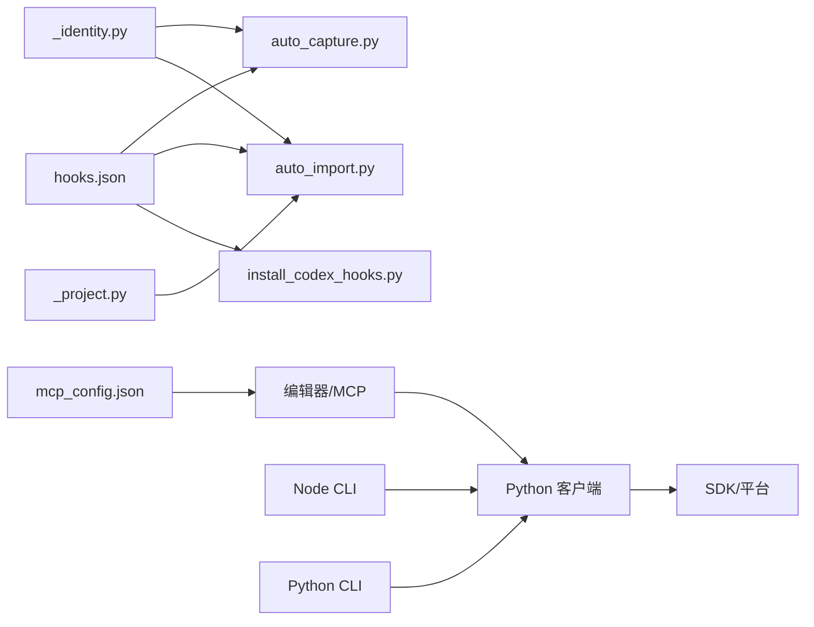

# 自定义集成开发

<cite>
**本文档引用的文件**
- [integrations/mem0-plugin/README.md](file://integrations/mem0-plugin/README.md)
- [integrations/mem0-plugin/plugin.json](file://integrations/mem0-plugin/plugin.json)
- [integrations/mem0-plugin/hooks.json](file://integrations/mem0-plugin/hooks.json)
- [integrations/mem0-plugin/mcp_config.json](file://integrations/mem0-plugin/mcp_config.json)
- [integrations/mem0-plugin/scripts/auto_capture.py](file://integrations/mem0-plugin/scripts/auto_capture.py)
- [integrations/mem0-plugin/scripts/auto_import.py](file://integrations/mem0-plugin/scripts/auto_import.py)
- [integrations/mem0-plugin/scripts/install_codex_hooks.py](file://integrations/mem0-plugin/scripts/install_codex_hooks.py)
- [integrations/mem0-plugin/scripts/_identity.py](file://integrations/mem0-plugin/scripts/_identity.py)
- [integrations/mem0-plugin/scripts/_project.py](file://integrations/mem0-plugin/scripts/_project.py)
- [integrations/mem0-plugin/skills/mem0/README.md](file://integrations/mem0-plugin/skills/mem0/README.md)
- [cli/node/src/index.ts](file://cli/node/src/index.ts)
- [cli/python/src/mem0_cli/app.py](file://cli/python/src/mem0_cli/app.py)
- [mem0/client/main.py](file://mem0/client/main.py)
- [mem0/memory/main.py](file://mem0/memory/main.py)
- [mem0/memory/base.py](file://mem0/memory/base.py)
- [cli/node/tests/commands.test.ts](file://cli/node/tests/commands.test.ts)
- [cli/python/tests/test_commands.py](file://cli/python/tests/test_commands.py)
</cite>

## 目录
1. [简介](#简介)
2. [项目结构](#项目结构)
3. [核心组件](#核心组件)
4. [架构总览](#架构总览)
5. [详细组件分析](#详细组件分析)
6. [依赖关系分析](#依赖关系分析)
7. [性能考虑](#性能考虑)
8. [故障排除指南](#故障排除指南)
9. [结论](#结论)
10. [附录](#附录)

## 简介
本指南面向希望为 Mem0 平台开发自定义集成的工程师与产品团队，涵盖插件架构设计原则、MCP 协议实现、生命周期钩子系统、工具开发（记忆操作工具）、脚本编写规范、自动捕获与导入机制，以及测试、调试与发布最佳实践。通过遵循本文档，您可以在不同 IDE/编辑器（如 Cursor、Claude Code/Cowork、Codex、OpenCode、Antigravity）中快速集成 Mem0 的持久语义记忆能力，并构建可扩展的记忆工作流。

## 项目结构
Mem0 仓库采用多语言、多组件并行的组织方式：Python SDK 提供核心内存管理与客户端；Node/Python CLI 提供命令行工具；integrations/mem0-plugin 作为跨平台插件，封装 MCP 服务器、生命周期钩子与技能（Skill），并提供自动捕获与导入脚本。

图表来源
- [integrations/mem0-plugin/plugin.json:1-14](file://integrations/mem0-plugin/plugin.json#L1-L14)
- [integrations/mem0-plugin/mcp_config.json:1-11](file://integrations/mem0-plugin/mcp_config.json#L1-L11)
- [integrations/mem0-plugin/hooks.json:1-105](file://integrations/mem0-plugin/hooks.json#L1-L105)
- [integrations/mem0-plugin/scripts/auto_capture.py:1-211](file://integrations/mem0-plugin/scripts/auto_capture.py#L1-L211)
- [integrations/mem0-plugin/scripts/auto_import.py:1-375](file://integrations/mem0-plugin/scripts/auto_import.py#L1-L375)
- [integrations/mem0-plugin/scripts/install_codex_hooks.py:1-163](file://integrations/mem0-plugin/scripts/install_codex_hooks.py#L1-L163)
- [integrations/mem0-plugin/skills/mem0/README.md:1-74](file://integrations/mem0-plugin/skills/mem0/README.md#L1-L74)
- [cli/node/src/index.ts:1-881](file://cli/node/src/index.ts#L1-L881)
- [cli/python/src/mem0_cli/app.py:1-1334](file://cli/python/src/mem0_cli/app.py#L1-L1334)
- [mem0/client/main.py:1-1809](file://mem0/client/main.py#L1-L1809)
- [mem0/memory/main.py:1-3542](file://mem0/memory/main.py#L1-L3542)

章节来源
- [integrations/mem0-plugin/README.md:1-306](file://integrations/mem0-plugin/README.md#L1-L306)
- [integrations/mem0-plugin/plugin.json:1-14](file://integrations/mem0-plugin/plugin.json#L1-L14)
- [integrations/mem0-plugin/mcp_config.json:1-11](file://integrations/mem0-plugin/mcp_config.json#L1-L11)
- [integrations/mem0-plugin/hooks.json:1-105](file://integrations/mem0-plugin/hooks.json#L1-L105)

## 核心组件
- 插件清单与元数据：定义插件标识、版本、描述、关键词等，用于在各编辑器市场中注册与展示。
- MCP 配置：声明远程 MCP 服务器地址与认证头（基于环境变量），使编辑器通过标准 MCP 协议调用 Mem0 工具。
- 生命周期钩子：在会话开始、用户提交提示、工具使用前后、停止时触发本地脚本，实现自动记忆捕获、上下文注入、元数据强制等。
- 自动捕获与导入：后台扫描对话记录与项目文件，自动提取要点写入平台或导入项目配置文件为记忆。
- 技能（Skill）：为 Claude 等 AI 助手提供“如何集成 Mem0”的指导与文档引用，加速工程落地。
- CLI 与客户端：Node/Python CLI 提供统一的命令行入口；Python 客户端封装 REST API 调用，支持添加、搜索、更新、删除、导出等操作。

章节来源
- [integrations/mem0-plugin/plugin.json:1-14](file://integrations/mem0-plugin/plugin.json#L1-L14)
- [integrations/mem0-plugin/mcp_config.json:1-11](file://integrations/mem0-plugin/mcp_config.json#L1-L11)
- [integrations/mem0-plugin/hooks.json:1-105](file://integrations/mem0-plugin/hooks.json#L1-L105)
- [integrations/mem0-plugin/scripts/auto_capture.py:1-211](file://integrations/mem0-plugin/scripts/auto_capture.py#L1-L211)
- [integrations/mem0-plugin/scripts/auto_import.py:1-375](file://integrations/mem0-plugin/scripts/auto_import.py#L1-L375)
- [integrations/mem0-plugin/skills/mem0/README.md:1-74](file://integrations/mem0-plugin/skills/mem0/README.md#L1-L74)
- [cli/node/src/index.ts:1-881](file://cli/node/src/index.ts#L1-L881)
- [cli/python/src/mem0_cli/app.py:1-1334](file://cli/python/src/mem0_cli/app.py#L1-L1334)
- [mem0/client/main.py:1-1809](file://mem0/client/main.py#L1-L1809)

## 架构总览
Mem0 集成以“插件 + MCP + 钩子 + 脚本 + CLI/SDK”协同工作：编辑器通过 MCP 发现并调用工具；生命周期钩子在关键节点触发本地脚本，完成自动捕获与导入；CLI/SDK 提供统一的编程接口与测试框架。

图表来源
- [integrations/mem0-plugin/mcp_config.json:1-11](file://integrations/mem0-plugin/mcp_config.json#L1-L11)
- [integrations/mem0-plugin/hooks.json:1-105](file://integrations/mem0-plugin/hooks.json#L1-L105)
- [mem0/client/main.py:1-1809](file://mem0/client/main.py#L1-L1809)
- [cli/node/src/index.ts:1-881](file://cli/node/src/index.ts#L1-L881)
- [cli/python/src/mem0_cli/app.py:1-1334](file://cli/python/src/mem0_cli/app.py#L1-L1334)

## 详细组件分析

### 插件架构设计原则
- 清晰的职责分离：插件负责 MCP 注册、钩子装配与技能分发；SDK 负责底层存储与检索；CLI 提供统一交互入口。
- 可移植性：通过环境变量与配置文件解耦认证与目标主机，便于在不同编辑器间复用。
- 可观测性：日志与调试开关（如 MEM0_DEBUG）便于问题定位；CLI 支持 JSON 输出，利于自动化集成。
- 兼容性：Node 与 Python 双 CLI 并行，满足不同生态需求；MCP 作为通用协议降低适配成本。

章节来源
- [integrations/mem0-plugin/plugin.json:1-14](file://integrations/mem0-plugin/plugin.json#L1-L14)
- [integrations/mem0-plugin/mcp_config.json:1-11](file://integrations/mem0-plugin/mcp_config.json#L1-L11)
- [integrations/mem0-plugin/README.md:1-306](file://integrations/mem0-plugin/README.md#L1-L306)

### MCP 协议实现
- 远程 MCP 服务器：在各编辑器中以配置形式注册 Mem0 的 MCP 服务，使用 Token 认证头从环境变量读取。
- 工具集：提供 add_memory、search_memories、get_memories、get_memory、update_memory、delete_memory、delete_all_memories、delete_entities、list_entities 等工具，覆盖典型记忆操作。
- 安全与稳定性：通过环境变量注入认证信息，避免硬编码；对网络错误进行降级处理，保证编辑器体验。

图表来源
- [mem0/client/main.py:1-1809](file://mem0/client/main.py#L1-L1809)
- [mem0/memory/base.py:1-64](file://mem0/memory/base.py#L1-L64)

章节来源
- [integrations/mem0-plugin/mcp_config.json:1-11](file://integrations/mem0-plugin/mcp_config.json#L1-L11)
- [integrations/mem0-plugin/README.md:287-302](file://integrations/mem0-plugin/README.md#L287-L302)
- [mem0/client/main.py:1-1809](file://mem0/client/main.py#L1-L1809)

### 生命周期钩子系统开发
- 钩子事件：SessionStart、UserPromptSubmit、PreToolUse、Stop、PostToolUse。
- 匹配器与动作：根据工具类型或事件匹配器执行相应脚本，如阻止特定写入、注入文件上下文、记录 Bash 输出、生成会话摘要等。
- 安装与维护：Codex 需要手动安装钩子并启用特性开关；其他平台通常由插件自动装配。

图表来源
- [integrations/mem0-plugin/hooks.json:1-105](file://integrations/mem0-plugin/hooks.json#L1-L105)
- [integrations/mem0-plugin/scripts/install_codex_hooks.py:1-163](file://integrations/mem0-plugin/scripts/install_codex_hooks.py#L1-L163)

章节来源
- [integrations/mem0-plugin/hooks.json:1-105](file://integrations/mem0-plugin/hooks.json#L1-L105)
- [integrations/mem0-plugin/scripts/install_codex_hooks.py:1-163](file://integrations/mem0-plugin/scripts/install_codex_hooks.py#L1-L163)

### 工具开发指南（记忆操作工具）
- 工具清单：add_memory、search_memories、get_memories、get_memory、update_memory、delete_memory、delete_all_memories、delete_entities、list_entities。
- 开发步骤：
  1) 在编辑器中注册 MCP 服务器（参考 mcp_config.json）。
  2) 实现工具函数：参数校验、调用客户端 API、返回标准化结果。
  3) 处理权限与错误：统一异常捕获与错误码映射。
  4) 文档化工具签名与示例，确保与插件工具清单一致。

章节来源
- [integrations/mem0-plugin/README.md:287-302](file://integrations/mem0-plugin/README.md#L287-L302)
- [integrations/mem0-plugin/mcp_config.json:1-11](file://integrations/mem0-plugin/mcp_config.json#L1-L11)
- [mem0/client/main.py:1-1809](file://mem0/client/main.py#L1-L1809)

### 脚本编写规范与自动捕获/导入
- 规范要求：
  - 明确输入输出：环境变量解析、参数校验、日志输出（仅 stderr，退出码 0）。
  - 幂等与去重：自动导入使用哈希与锁文件避免重复；自动捕获按消息长度与内容过滤。
  - 错误隔离：网络失败不阻塞主流程，记录警告日志。
- 自动捕获：从会话日志尾部提取最近对话交换，调用平台 API 进行事实抽取并写入记忆。
- 自动导入：扫描项目文件（如 CLAUDE.md、AGENTS.md、.cursorrules 等），按大小与哈希限制导入，支持分块与去重。

图表来源
- [integrations/mem0-plugin/scripts/auto_capture.py:1-211](file://integrations/mem0-plugin/scripts/auto_capture.py#L1-L211)
- [integrations/mem0-plugin/scripts/auto_import.py:1-375](file://integrations/mem0-plugin/scripts/auto_import.py#L1-L375)
- [integrations/mem0-plugin/scripts/_identity.py:1-105](file://integrations/mem0-plugin/scripts/_identity.py#L1-L105)
- [integrations/mem0-plugin/scripts/_project.py:1-176](file://integrations/mem0-plugin/scripts/_project.py#L1-L176)

章节来源
- [integrations/mem0-plugin/scripts/auto_capture.py:1-211](file://integrations/mem0-plugin/scripts/auto_capture.py#L1-L211)
- [integrations/mem0-plugin/scripts/auto_import.py:1-375](file://integrations/mem0-plugin/scripts/auto_import.py#L1-L375)
- [integrations/mem0-plugin/scripts/_identity.py:1-105](file://integrations/mem0-plugin/scripts/_identity.py#L1-L105)
- [integrations/mem0-plugin/scripts/_project.py:1-176](file://integrations/mem0-plugin/scripts/_project.py#L1-L176)

### 导入功能实现
- 文件扫描：优先当前目录，其次 Git 根目录；支持 Markdown 分节与纯文本导入。
- 去重策略：基于 SHA-256 哈希与服务端已存在记忆检测，避免重复导入。
- 分块上传：Markdown 按标题层级切分，超长内容截断，提升检索质量。
- 项目映射：保存 cwd 到 project_id 的映射，支持移动/重命名后的自愈恢复。

章节来源
- [integrations/mem0-plugin/scripts/auto_import.py:1-375](file://integrations/mem0-plugin/scripts/auto_import.py#L1-L375)
- [integrations/mem0-plugin/scripts/_project.py:1-176](file://integrations/mem0-plugin/scripts/_project.py#L1-L176)

### 测试方法与调试技巧
- 测试框架：
  - Node CLI 使用 Vitest，覆盖 add/search/get/list/update/delete/event 等命令。
  - Python CLI 使用 pytest，覆盖相同命令路径与输出格式。
- 关键测试点：
  - 参数解析与默认值（如 --no-infer、--json/--agent）。
  - 输出格式（text/json/agent）与空结果处理。
  - 幂等性与重复事件合并（PENDING 去重）。
- 调试建议：
  - 启用 MEM0_DEBUG 日志，查看 hooks.log。
  - 使用 CLI --json/--agent 输出进行自动化验证。
  - 检查 MEM0_API_KEY、MCP 认证头与编辑器配置一致性。

章节来源
- [cli/node/tests/commands.test.ts:1-467](file://cli/node/tests/commands.test.ts#L1-L467)
- [cli/python/tests/test_commands.py:1-800](file://cli/python/tests/test_commands.py#L1-L800)

### 发布流程最佳实践
- 版本管理：插件清单中维护版本号，随功能迭代同步更新。
- 配置验证：在 CI 中检查 mcp_config.json 与 hooks.json 的语法与路径正确性。
- 自动化测试：Node 与 Python CLI 各自的测试套件在 PR 中运行，确保命令行为稳定。
- 文档同步：变更工具清单、钩子或脚本时，同步更新插件 README 与技能文档。

章节来源
- [integrations/mem0-plugin/plugin.json:1-14](file://integrations/mem0-plugin/plugin.json#L1-L14)
- [integrations/mem0-plugin/README.md:1-306](file://integrations/mem0-plugin/README.md#L1-L306)

## 依赖关系分析
- 插件依赖 MCP 服务器与编辑器生命周期钩子；钩子依赖本地脚本与环境变量。
- CLI 依赖客户端 SDK；客户端 SDK 依赖平台 API。
- 项目映射与身份解析模块被自动捕获/导入脚本广泛使用，确保跨会话一致性。

图表来源
- [integrations/mem0-plugin/hooks.json:1-105](file://integrations/mem0-plugin/hooks.json#L1-L105)
- [integrations/mem0-plugin/scripts/auto_capture.py:1-211](file://integrations/mem0-plugin/scripts/auto_capture.py#L1-L211)
- [integrations/mem0-plugin/scripts/auto_import.py:1-375](file://integrations/mem0-plugin/scripts/auto_import.py#L1-L375)
- [integrations/mem0-plugin/scripts/install_codex_hooks.py:1-163](file://integrations/mem0-plugin/scripts/install_codex_hooks.py#L1-L163)
- [integrations/mem0-plugin/scripts/_identity.py:1-105](file://integrations/mem0-plugin/scripts/_identity.py#L1-L105)
- [integrations/mem0-plugin/scripts/_project.py:1-176](file://integrations/mem0-plugin/scripts/_project.py#L1-L176)
- [integrations/mem0-plugin/mcp_config.json:1-11](file://integrations/mem0-plugin/mcp_config.json#L1-L11)
- [cli/node/src/index.ts:1-881](file://cli/node/src/index.ts#L1-L881)
- [cli/python/src/mem0_cli/app.py:1-1334](file://cli/python/src/mem0_cli/app.py#L1-L1334)
- [mem0/client/main.py:1-1809](file://mem0/client/main.py#L1-L1809)

章节来源
- [integrations/mem0-plugin/hooks.json:1-105](file://integrations/mem0-plugin/hooks.json#L1-L105)
- [integrations/mem0-plugin/scripts/_identity.py:1-105](file://integrations/mem0-plugin/scripts/_identity.py#L1-L105)
- [integrations/mem0-plugin/scripts/_project.py:1-176](file://integrations/mem0-plugin/scripts/_project.py#L1-L176)
- [mem0/client/main.py:1-1809](file://mem0/client/main.py#L1-L1809)

## 性能考虑
- 搜索与检索：合理设置 top_k 与阈值，必要时启用重排序；对大文本进行分块与截断，减少无关噪声。
- 写入批量化：批量更新/删除可显著降低网络往返开销。
- 钩子非阻塞：自动捕获/导入脚本应尽快返回，避免影响编辑器响应；日志与统计独立处理。
- 缓存与去重：利用哈希与锁文件避免重复导入；对重复 PENDING 事件进行去重显示。

## 故障排除指南
- API Key 无效或过期：CLI 在启动时进行快速连通性验证；检查 MEM0_API_KEY 是否正确导出。
- MCP 连接失败：确认 mcp_config.json 中 URL 与认证头；重启编辑器会话以重新读取环境变量。
- 钩子未生效（Codex）：运行安装脚本并启用特性开关；检查 hooks.json 绝对路径与权限。
- 自动导入未触发：确认 MEM0_DEBUG 日志与哈希缓存；检查文件大小与内容去重逻辑。
- CLI 输出不符合预期：使用 --json 或 --agent 模式进行自动化集成；核对参数传递与默认值。

章节来源
- [cli/node/src/index.ts:1-881](file://cli/node/src/index.ts#L1-L881)
- [cli/python/src/mem0_cli/app.py:1-1334](file://cli/python/src/mem0_cli/app.py#L1-L1334)
- [integrations/mem0-plugin/scripts/install_codex_hooks.py:1-163](file://integrations/mem0-plugin/scripts/install_codex_hooks.py#L1-L163)
- [integrations/mem0-plugin/scripts/auto_import.py:1-375](file://integrations/mem0-plugin/scripts/auto_import.py#L1-L375)

## 结论
通过遵循本指南，您可以基于 Mem0 的插件架构、MCP 协议与生命周期钩子系统，快速在多种编辑器环境中集成持久语义记忆能力。结合自动捕获与导入脚本、完善的 CLI/SDK 接口与测试体系，能够构建稳定、可观测且可扩展的记忆工作流，支撑从个人助手到团队协作的多样化场景。

## 附录
- 技能文档：为 Claude 等 AI 助手提供 Mem0 集成与使用指导，加速工程落地。
- 常用命令：/mem0:onboard、/mem0:health、/mem0:stats、/mem0:remember、/mem0:tour 等。

章节来源
- [integrations/mem0-plugin/skills/mem0/README.md:1-74](file://integrations/mem0-plugin/skills/mem0/README.md#L1-L74)
- [integrations/mem0-plugin/README.md:200-244](file://integrations/mem0-plugin/README.md#L200-L244)