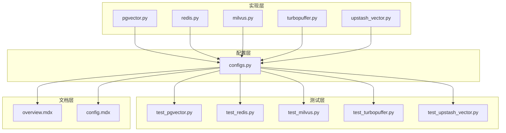
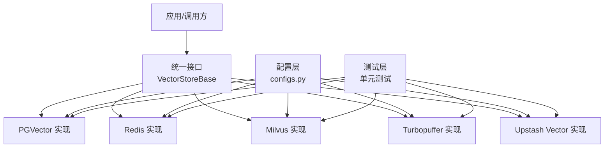
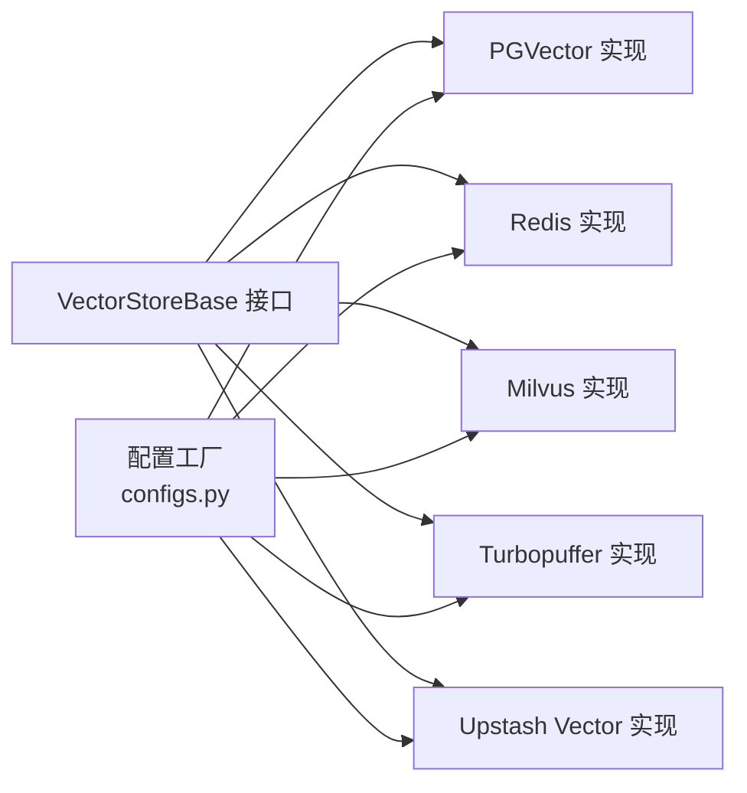

# 专用向量数据库

<cite>
**本文引用的文件**
- [pgvector.py](file://mem0/vector_stores/pgvector.py)
- [redis.py](file://mem0/vector_stores/redis.py)
- [milvus.py](file://mem0/vector_stores/milvus.py)
- [turbopuffer.py](file://mem0/vector_stores/turbopuffer.py)
- [upstash_vector.py](file://mem0/vector_stores/upstash_vector.py)
- [configs.py](file://mem0/vector_stores/configs.py)
- [test_pgvector.py](file://tests/vector_stores/test_pgvector.py)
- [test_redis.py](file://tests/vector_stores/test_redis.py)
- [test_milvus.py](file://tests/vector_stores/test_milvus.py)
- [test_turbopuffer.py](file://tests/vector_stores/test_turbopuffer.py)
- [test_upstash_vector.py](file://tests/vector_stores/test_upstash_vector.py)
- [overview.mdx](file://docs/components/vectordbs/overview.mdx)
- [config.mdx](file://docs/components/vectordbs/config.mdx)
</cite>

## 目录
1. [简介](#简介)
2. [项目结构](#项目结构)
3. [核心组件](#核心组件)
4. [架构概览](#架构概览)
5. [详细组件分析](#详细组件分析)
6. [依赖关系分析](#依赖关系分析)
7. [性能考量](#性能考量)
8. [故障排除指南](#故障排除指南)
9. [结论](#结论)
10. [附录](#附录)

## 简介
本文件面向需要在系统中部署和使用专用向量数据库的工程师与架构师，围绕 PGVector、Redis、Milvus、Turbopuffer、Upstash Vector 等向量数据库进行深入说明。内容涵盖：
- 各数据库的配置参数、初始化流程与关键特性
- 性能特征与适用场景
- 针对不同需求的优化配置与最佳实践
- 与嵌入模型、检索器等组件的集成方式与兼容性
- 基准测试与容量规划建议

## 项目结构
向量数据库相关代码集中在以下位置：
- 实现层：mem0/vector_stores 下包含各数据库的具体实现模块
- 配置层：mem0/configs/vector_stores 下包含各数据库的配置类与默认值
- 测试层：tests/vector_stores 下包含各数据库的单元测试与行为验证
- 文档层：docs/components/vectordbs 下包含概览与配置说明文档

**图表来源**
- [pgvector.py](file://mem0/vector_stores/pgvector.py)
- [redis.py](file://mem0/vector_stores/redis.py)
- [milvus.py](file://mem0/vector_stores/milvus.py)
- [turbopuffer.py](file://mem0/vector_stores/turbopuffer.py)
- [upstash_vector.py](file://mem0/vector_stores/upstash_vector.py)
- [configs.py](file://mem0/vector_stores/configs.py)
- [test_pgvector.py](file://tests/vector_stores/test_pgvector.py)
- [test_redis.py](file://tests/vector_stores/test_redis.py)
- [test_milvus.py](file://tests/vector_stores/test_milvus.py)
- [test_turbopuffer.py](file://tests/vector_stores/test_turbopuffer.py)
- [test_upstash_vector.py](file://tests/vector_stores/test_upstash_vector.py)
- [overview.mdx](file://docs/components/vectordbs/overview.mdx)
- [config.mdx](file://docs/components/vectordbs/config.mdx)

**章节来源**
- [pgvector.py](file://mem0/vector_stores/pgvector.py)
- [redis.py](file://mem0/vector_stores/redis.py)
- [milvus.py](file://mem0/vector_stores/milvus.py)
- [turbopuffer.py](file://mem0/vector_stores/turbopuffer.py)
- [upstash_vector.py](file://mem0/vector_stores/upstash_vector.py)
- [configs.py](file://mem0/vector_stores/configs.py)
- [overview.mdx](file://docs/components/vectordbs/overview.mdx)
- [config.mdx](file://docs/components/vectordbs/config.mdx)

## 核心组件
- 向量存储基类：所有具体实现均继承自统一的 VectorStoreBase 接口，确保一致的插入、查询、更新、删除等操作契约。
- 配置工厂：通过 configs.py 中的工厂方法或配置类，按需构建对应数据库客户端实例，支持从环境变量或显式参数注入连接信息。
- 测试用例：每个数据库均有对应的单元测试，覆盖插入、查询、分页、更新、删除等关键路径，便于回归与性能验证。

**章节来源**
- [configs.py](file://mem0/vector_stores/configs.py)
- [test_pgvector.py](file://tests/vector_stores/test_pgvector.py)
- [test_redis.py](file://tests/vector_stores/test_redis.py)
- [test_milvus.py](file://tests/vector_stores/test_milvus.py)
- [test_turbopuffer.py](file://tests/vector_stores/test_turbopuffer.py)
- [test_upstash_vector.py](file://tests/vector_stores/test_upstash_vector.py)

## 架构概览
下图展示了向量存储在系统中的角色与调用关系：应用通过统一接口调用具体向量数据库实现，配置层负责解析参数并建立连接；测试层保障功能正确性与稳定性。

**图表来源**
- [configs.py](file://mem0/vector_stores/configs.py)
- [pgvector.py](file://mem0/vector_stores/pgvector.py)
- [redis.py](file://mem0/vector_stores/redis.py)
- [milvus.py](file://mem0/vector_stores/milvus.py)
- [turbopuffer.py](file://mem0/vector_stores/turbopuffer.py)
- [upstash_vector.py](file://mem0/vector_stores/upstash_vector.py)
- [test_pgvector.py](file://tests/vector_stores/test_pgvector.py)
- [test_redis.py](file://tests/vector_stores/test_redis.py)
- [test_milvus.py](file://tests/vector_stores/test_milvus.py)
- [test_turbopuffer.py](file://tests/vector_stores/test_turbopuffer.py)
- [test_upstash_vector.py](file://tests/vector_stores/test_upstash_vector.py)

## 详细组件分析

### PGVector（PostgreSQL 扩展）
- 初始化与连接
  - 支持通过连接字符串或独立主机/端口/数据库名/用户/密码等方式建立连接。
  - 可配置向量维度、索引类型与扩展安装状态检查。
- 关键能力
  - 向量插入与批量写入，支持元数据字段存储。
  - 向量相似度搜索（内积/余弦/欧氏距离），支持过滤与 Top-K 返回。
  - 元数据过滤与分页查询。
- 性能特征
  - 利用 PostgreSQL 的索引与并行扫描能力，适合中等规模向量集与复杂 SQL 查询场景。
  - 在高并发写入时需关注 WAL 与索引维护开销。
- 使用场景
  - 需要与关系型数据强耦合、要求事务一致性与复杂联表查询的系统。
- 最佳实践
  - 合理设置向量维度与索引策略，定期重建索引以维持查询性能。
  - 对高频写入场景启用批量写入与异步刷新。
  - 结合查询缓存与结果去重，降低重复检索成本。
- 集成与兼容
  - 与嵌入模型输出维度保持一致，确保索引与查询匹配。
  - 注意 PostgreSQL 版本与 pgvector 扩展版本兼容性。

**章节来源**
- [pgvector.py](file://mem0/vector_stores/pgvector.py)
- [test_pgvector.py](file://tests/vector_stores/test_pgvector.py)

### Redis（基于 RedisJSON/RedisSearch 或 RediSQL/Valkey）
- 初始化与连接
  - 支持标准 Redis 连接参数，可选 Valkey 兼容模式。
  - 可配置命名空间与集合名称，用于多租户隔离。
- 关键能力
  - 向量插入与更新，支持 JSON 元数据存储。
  - 向量相似度搜索与元数据过滤，支持游标分页。
- 性能特征
  - 内存型存储，读写延迟低，适合实时检索与高吞吐写入。
  - 需关注内存占用与持久化策略（RDB/AOF）对性能的影响。
- 使用场景
  - 低延迟检索、会话记忆、短期缓存与高并发在线服务。
- 最佳实践
  - 合理设置过期时间与内存淘汰策略，避免内存压力。
  - 对热数据采用预加载与批量写入，减少网络往返。
- 集成与兼容
  - 与嵌入模型输出维度一致，确保向量字段类型匹配。
  - 注意 Redis 模块（RedisJSON/RediSearch）版本与命令兼容性。

**章节来源**
- [redis.py](file://mem0/vector_stores/redis.py)
- [test_redis.py](file://tests/vector_stores/test_redis.py)

### Milvus（分布式向量数据库）
- 初始化与连接
  - 支持直连与通过代理/认证的连接方式。
  - 可配置集合名、分区、分片数量与副本策略。
- 关键能力
  - 向量插入与批量导入，支持动态字段与复杂元数据。
  - 多种索引类型（IvfFlat/IvfPQ/HNSW/ANNOY）与混合搜索策略。
  - 高级过滤、聚合统计与流式增量同步。
- 性能特征
  - 分布式架构，支持水平扩展与高可用，适合大规模向量集。
  - 查询延迟与索引类型、分片数与副本数密切相关。
- 使用场景
  - 大规模向量检索、多模态检索、推荐系统与企业级应用。
- 最佳实践
  - 根据数据分布选择合适索引与参数，定期评估查询性能并调整。
  - 合理划分分区与分片，避免热点与单点瓶颈。
- 集成与兼容
  - 与嵌入维度严格一致，确保索引与查询参数匹配。
  - 注意 Milvus 版本升级对客户端 API 的影响。

**章节来源**
- [milvus.py](file://mem0/vector_stores/milvus.py)
- [test_milvus.py](file://tests/vector_stores/test_milvus.py)

### Turbopuffer（云原生向量引擎）
- 初始化与连接
  - 支持 API 密钥与命名空间配置。
  - 可配置批量大小与并发度，适配不同吞吐需求。
- 关键能力
  - 高效向量插入与更新，支持元数据过滤与排序。
  - 流式查询与游标分页，支持增量返回。
- 性能特征
  - 云原生架构，弹性伸缩，适合快速迭代与按需扩容。
  - 延迟与带宽受限于网络与并发请求控制。
- 使用场景
  - 快速原型、中小规模检索、多租户 SaaS 场景。
- 最佳实践
  - 控制批量大小与并发，避免触发限流。
  - 对冷数据采用归档策略，降低存储与查询成本。
- 集成与兼容
  - 与嵌入模型输出维度一致，遵循 API 字段规范。
  - 注意 API 版本与速率限制策略变化。

**章节来源**
- [turbopuffer.py](file://mem0/vector_stores/turbopuffer.py)
- [test_turbopuffer.py](file://tests/vector_stores/test_turbopuffer.py)

### Upstash Vector（Serverless 向量服务）
- 初始化与连接
  - 支持通过 URL 与 Token 初始化客户端实例。
  - 可配置命名空间与是否启用嵌入模型直接写入（enable_embeddings）。
- 关键能力
  - 向量 upsert（插入/更新），支持元数据与向量字段。
  - fetch 获取单条记录，resumable_query 支持游标分页。
  - info 查询索引维度等元信息。
- 性能特征
  - Serverless 架构，按需计费，适合低到中等规模与突发流量。
  - 延迟受网络与并发影响，适合交互式检索。
- 使用场景
  - 个人项目、小团队应用、原型验证与边缘计算场景。
- 最佳实践
  - 合理控制批量大小与并发，避免超时与限流。
  - 对频繁访问的数据采用本地缓存与结果去重。
- 集成与兼容
  - 与嵌入模型输出维度一致，确保 upsert 与查询字段匹配。
  - 注意 Upstash API 的版本演进与字段命名变更。

**章节来源**
- [upstash_vector.py](file://mem0/vector_stores/upstash_vector.py)
- [test_upstash_vector.py](file://tests/vector_stores/test_upstash_vector.py)

## 依赖关系分析
- 组件耦合
  - 各实现均依赖统一的 VectorStoreBase 接口，保证上层调用的一致性。
  - 配置层通过工厂或配置类集中管理连接参数，降低实现细节暴露。
- 外部依赖
  - PGVector 依赖 PostgreSQL 与 pgvector 扩展。
  - Redis/Milvus/Turbopuffer/Upstash Vector 分别依赖对应客户端库或服务端。
- 潜在风险
  - 客户端库版本不匹配可能导致运行时异常。
  - 索引参数与嵌入维度不一致会导致查询失败或性能下降。

**图表来源**
- [configs.py](file://mem0/vector_stores/configs.py)
- [pgvector.py](file://mem0/vector_stores/pgvector.py)
- [redis.py](file://mem0/vector_stores/redis.py)
- [milvus.py](file://mem0/vector_stores/milvus.py)
- [turbopuffer.py](file://mem0/vector_stores/turbopuffer.py)
- [upstash_vector.py](file://mem0/vector_stores/upstash_vector.py)

**章节来源**
- [configs.py](file://mem0/vector_stores/configs.py)
- [pgvector.py](file://mem0/vector_stores/pgvector.py)
- [redis.py](file://mem0/vector_stores/redis.py)
- [milvus.py](file://mem0/vector_stores/milvus.py)
- [turbopuffer.py](file://mem0/vector_stores/turbopuffer.py)
- [upstash_vector.py](file://mem0/vector_stores/upstash_vector.py)

## 性能考量
- 索引与查询
  - 为不同数据库选择合适的索引类型与参数，定期评估查询延迟与召回率。
  - 对高频查询结果进行缓存，减少重复检索。
- 写入与吞吐
  - 批量写入优于逐条插入，合理设置批大小与并发度。
  - 在高并发场景下，注意数据库的限流与背压机制。
- 存储与容量
  - 根据向量维度与数据量估算存储需求，预留增长空间。
  - 对冷数据采用分层存储或归档策略，平衡成本与性能。
- 资源规划
  - 为不同数据库设定资源上限与监控阈值，结合业务峰值进行容量规划。
  - 对云服务型数据库（如 Upstash、Turbopuffer）关注按量计费与配额限制。

[本节为通用指导，无需列出具体文件来源]

## 故障排除指南
- 连接问题
  - 检查连接参数（URL/Token/主机/端口/凭据）是否正确。
  - 确认网络可达性与防火墙规则。
- 索引与维度不匹配
  - 确保嵌入模型输出维度与数据库索引配置一致。
  - 对已有数据执行重建索引或迁移。
- 查询异常
  - 使用最小复现样例定位问题，逐步缩小范围。
  - 查看数据库日志与客户端错误码，结合测试用例对比行为。
- 性能退化
  - 分析慢查询与热点数据，优化索引与分片策略。
  - 调整批量大小与并发度，避免触发限流。

**章节来源**
- [test_pgvector.py](file://tests/vector_stores/test_pgvector.py)
- [test_redis.py](file://tests/vector_stores/test_redis.py)
- [test_milvus.py](file://tests/vector_stores/test_milvus.py)
- [test_turbopuffer.py](file://tests/vector_stores/test_turbopuffer.py)
- [test_upstash_vector.py](file://tests/vector_stores/test_upstash_vector.py)

## 结论
- PGVector 适合需要与关系型数据强耦合且具备一定规模的场景。
- Redis 适合低延迟与高吞吐的在线检索。
- Milvus 适合大规模分布式向量检索与企业级应用。
- Turbopuffer 适合快速迭代与中小规模的云原生场景。
- Upstash Vector 适合原型验证与边缘计算场景。
- 建议根据业务规模、性能目标与运维能力选择合适的数据库，并结合测试与监控持续优化。

[本节为总结性内容，无需列出具体文件来源]

## 附录
- 配置参考
  - 参考文档：向量数据库概览与配置说明，了解各数据库的参数项与默认值。
- 测试参考
  - 单元测试覆盖了插入、查询、分页、更新等关键路径，可作为行为参考与回归保障。

**章节来源**
- [overview.mdx](file://docs/components/vectordbs/overview.mdx)
- [config.mdx](file://docs/components/vectordbs/config.mdx)