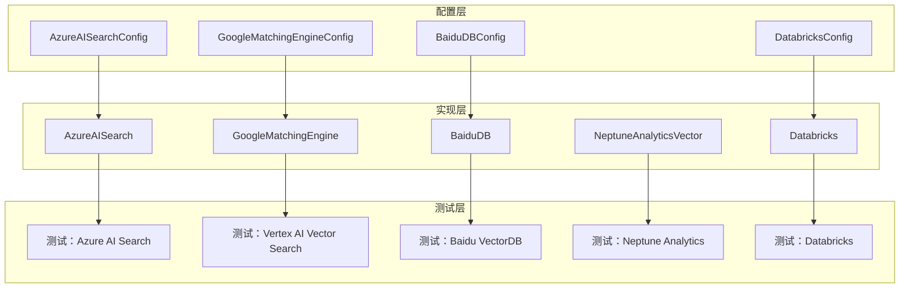
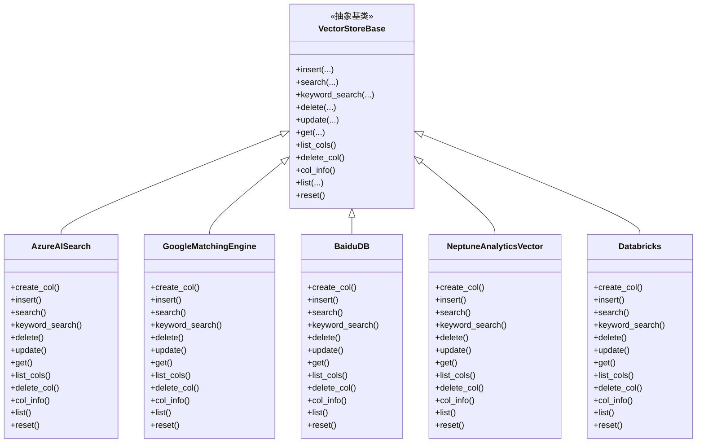
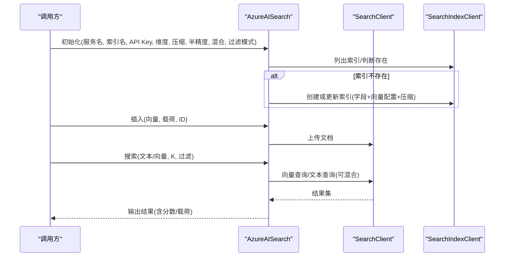
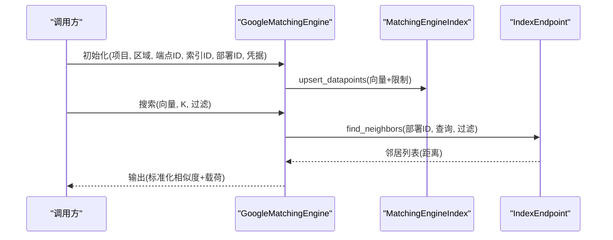
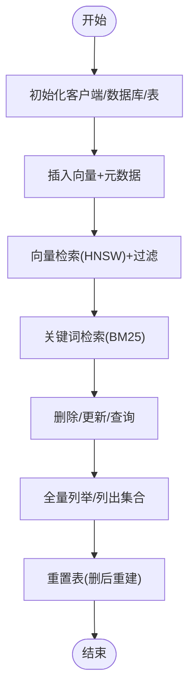
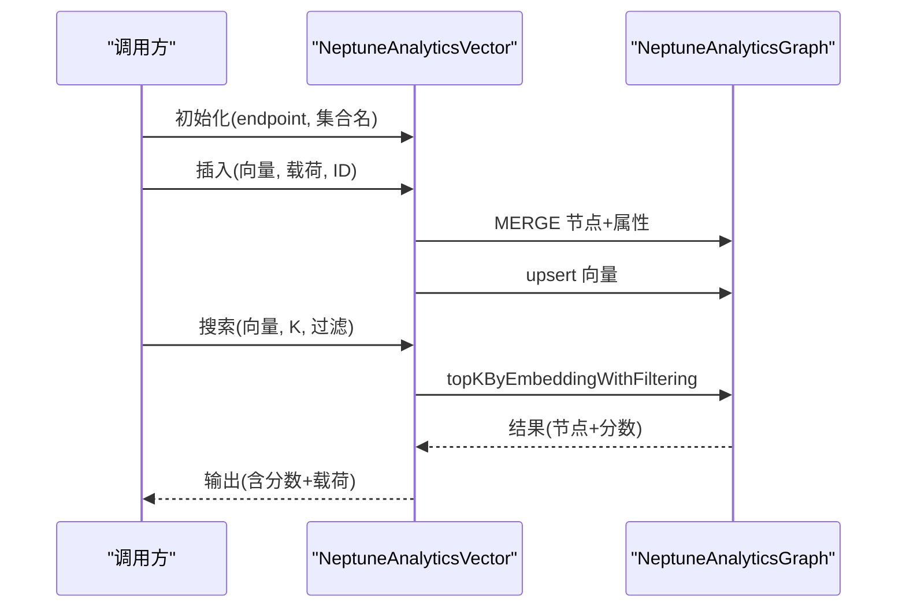
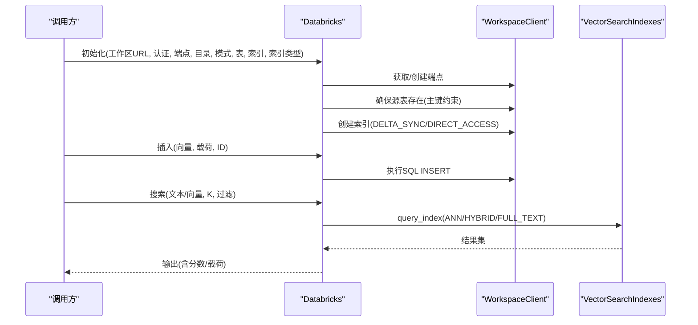
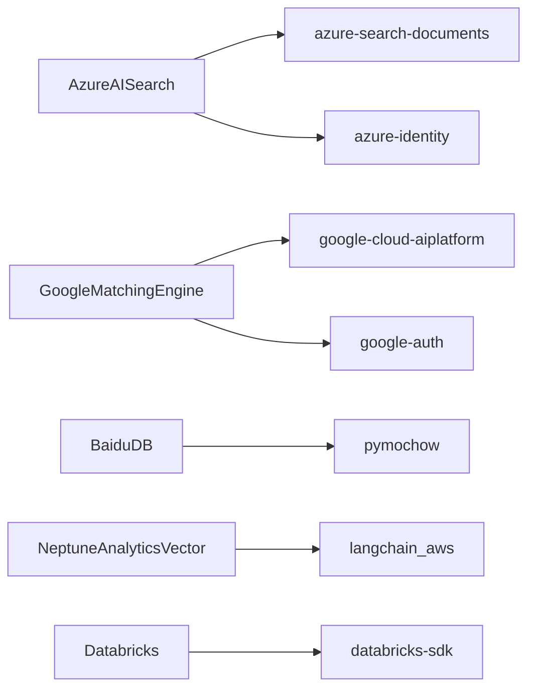

# 云原生服务

<cite>
**本文引用的文件**
- [azure_ai_search.py](file://mem0/vector_stores/azure_ai_search.py)
- [vertex_ai_vector_search.py](file://mem0/vector_stores/vertex_ai_vector_search.py)
- [baidu.py](file://mem0/vector_stores/baidu.py)
- [neptune_analytics.py](file://mem0/vector_stores/neptune_analytics.py)
- [databricks.py](file://mem0/vector_stores/databricks.py)
- [azure_ai_search.py（配置）](file://mem0/configs/vector_stores/azure_ai_search.py)
- [vertex_ai_vector_search.py（配置）](file://mem0/configs/vector_stores/vertex_ai_vector_search.py)
- [baidu.py（配置）](file://mem0/configs/vector_stores/baidu.py)
- [databricks.py（配置）](file://mem0/configs/vector_stores/databricks.py)
- [测试：Azure AI Search](file://tests/vector_stores/test_azure_ai_search.py)
- [测试：Vertex AI Vector Search](file://tests/vector_stores/test_vertex_ai_vector_search.py)
- [测试：Baidu VectorDB](file://tests/vector_stores/test_baidu.py)
- [测试：Neptune Analytics](file://tests/vector_stores/test_neptune_analytics.py)
- [测试：Databricks](file://tests/vector_stores/test_databricks.py)
</cite>

## 目录
1. [简介](#简介)
2. [项目结构](#项目结构)
3. [核心组件](#核心组件)
4. [架构总览](#架构总览)
5. [详细组件分析](#详细组件分析)
6. [依赖关系分析](#依赖关系分析)
7. [性能与成本优化](#性能与成本优化)
8. [故障排查指南](#故障排查指南)
9. [结论](#结论)
10. [附录](#附录)

## 简介
本文件面向云原生向量服务的使用者与平台工程师，系统梳理并解读以下服务在本仓库中的实现与用法：
- Azure AI Search（向量检索、混合检索、量化压缩）
- Google Vertex AI Vector Search（匹配引擎、过滤器命名空间、距离归一化）
- 百度 VectorDB（Mochow 客户端、HNSW 索引、BM25 关键词检索）
- AWS Neptune Analytics（图数据库向量操作、openCypher 查询）
- Databricks Vector Search（Unity Catalog、Delta 同步索引、直接访问索引）

内容涵盖认证机制、区域与合规、多云/混合云部署建议、弹性扩展与自动运维、成本优化策略，以及服务迁移与灾备最佳实践。

## 项目结构
围绕“向量存储”模块，相关实现与配置分布如下：
- 实现层：mem0/vector_stores 下的各云服务适配器
- 配置层：mem0/configs/vector_stores 下的 Pydantic 配置模型
- 测试层：tests/vector_stores 下的单元/集成测试

图表来源
- [azure_ai_search.py（配置）:1-58](file://mem0/configs/vector_stores/azure_ai_search.py#L1-L58)
- [vertex_ai_vector_search.py（配置）:1-29](file://mem0/configs/vector_stores/vertex_ai_vector_search.py#L1-L29)
- [baidu.py（配置）:1-28](file://mem0/configs/vector_stores/baidu.py#L1-L28)
- [databricks.py（配置）:1-62](file://mem0/configs/vector_stores/databricks.py#L1-L62)
- [azure_ai_search.py:1-425](file://mem0/vector_stores/azure_ai_search.py#L1-L425)
- [vertex_ai_vector_search.py:1-649](file://mem0/vector_stores/vertex_ai_vector_search.py#L1-L649)
- [baidu.py:1-412](file://mem0/vector_stores/baidu.py#L1-L412)
- [neptune_analytics.py:1-468](file://mem0/vector_stores/neptune_analytics.py#L1-L468)
- [databricks.py:1-876](file://mem0/vector_stores/databricks.py#L1-L876)
- [测试：Azure AI Search:1-666](file://tests/vector_stores/test_azure_ai_search.py#L1-L666)
- [测试：Vertex AI Vector Search:1-142](file://tests/vector_stores/test_vertex_ai_vector_search.py#L1-L142)
- [测试：Baidu VectorDB:1-238](file://tests/vector_stores/test_baidu.py#L1-L238)
- [测试：Neptune Analytics:1-187](file://tests/vector_stores/test_neptune_analytics.py#L1-L187)
- [测试：Databricks:1-1068](file://tests/vector_stores/test_databricks.py#L1-L1068)

章节来源
- [azure_ai_search.py:1-425](file://mem0/vector_stores/azure_ai_search.py#L1-L425)
- [vertex_ai_vector_search.py:1-649](file://mem0/vector_stores/vertex_ai_vector_search.py#L1-L649)
- [baidu.py:1-412](file://mem0/vector_stores/baidu.py#L1-L412)
- [neptune_analytics.py:1-468](file://mem0/vector_stores/neptune_analytics.py#L1-L468)
- [databricks.py:1-876](file://mem0/vector_stores/databricks.py#L1-L876)
- [azure_ai_search.py（配置）:1-58](file://mem0/configs/vector_stores/azure_ai_search.py#L1-L58)
- [vertex_ai_vector_search.py（配置）:1-29](file://mem0/configs/vector_stores/vertex_ai_vector_search.py#L1-L29)
- [baidu.py（配置）:1-28](file://mem0/configs/vector_stores/baidu.py#L1-L28)
- [databricks.py（配置）:1-62](file://mem0/configs/vector_stores/databricks.py#L1-L62)

## 核心组件
- AzureAISearch：基于 Azure AI Search 的向量索引管理，支持二进制/标量量化、半精度/单精度向量存储、混合检索与过滤模式。
- GoogleMatchingEngine：基于 Vertex AI 匹配引擎的向量检索，支持命名空间过滤、距离归一化为相似度。
- BaiduDB：基于百度 Mochow 的向量检索，支持 HNSW 索引、BM25 关键词检索与 JSON 元数据过滤。
- NeptuneAnalyticsVector：基于 AWS Neptune Analytics 的图数据库向量能力，通过 openCypher 执行向量插入、相似度查询与过滤。
- Databricks：基于 Databricks Vector Search 的索引管理，支持 DELTA_SYNC 与 DIRECT_ACCESS 两种索引类型，统一目录（Unity Catalog）管理。

章节来源
- [azure_ai_search.py:43-425](file://mem0/vector_stores/azure_ai_search.py#L43-L425)
- [vertex_ai_vector_search.py:35-649](file://mem0/vector_stores/vertex_ai_vector_search.py#L35-L649)
- [baidu.py:49-412](file://mem0/vector_stores/baidu.py#L49-L412)
- [neptune_analytics.py:23-468](file://mem0/vector_stores/neptune_analytics.py#L23-L468)
- [databricks.py:45-876](file://mem0/vector_stores/databricks.py#L45-L876)

## 架构总览
下图展示各云原生向量服务在本项目中的类关系与职责边界：

图表来源
- [azure_ai_search.py:43-425](file://mem0/vector_stores/azure_ai_search.py#L43-L425)
- [vertex_ai_vector_search.py:35-649](file://mem0/vector_stores/vertex_ai_vector_search.py#L35-L649)
- [baidu.py:49-412](file://mem0/vector_stores/baidu.py#L49-L412)
- [neptune_analytics.py:23-468](file://mem0/vector_stores/neptune_analytics.py#L23-L468)
- [databricks.py:45-876](file://mem0/vector_stores/databricks.py#L45-L876)

## 详细组件分析

### Azure AI Search 组件分析
- 认证与初始化
  - 支持 API Key 或默认凭据（DefaultAzureCredential），自动设置用户代理标识。
  - 初始化时检查索引是否存在，不存在则按配置创建。
- 索引与字段
  - 字段包含主键 id、可过滤字段 user_id/run_id/agent_id、向量字段 vector（支持 Edm.Half/Edm.Single）、可搜索的 payload。
  - 支持向量压缩（标量量化/二进制量化）与 HNSW 算法配置。
- 检索能力
  - 向量检索：支持 ANN 与混合检索（hybrid_search），可设置向量过滤模式（preFilter/postFilter）。
  - 文本检索：BM25 关键词检索（payload 字段）。
- 运维能力
  - 增删改查、列出集合、删除集合、集合信息、全量列举、重置索引。

图表来源
- [azure_ai_search.py:43-247](file://mem0/vector_stores/azure_ai_search.py#L43-L247)
- [测试：Azure AI Search:143-265](file://tests/vector_stores/test_azure_ai_search.py#L143-L265)

章节来源
- [azure_ai_search.py:43-425](file://mem0/vector_stores/azure_ai_search.py#L43-L425)
- [azure_ai_search.py（配置）:6-58](file://mem0/configs/vector_stores/azure_ai_search.py#L6-L58)
- [测试：Azure AI Search:1-666](file://tests/vector_stores/test_azure_ai_search.py#L1-L666)

### Google Vertex AI Vector Search 组件分析
- 认证与初始化
  - 通过 Vertex AI SDK 初始化，支持服务账号文件或 JSON 凭据；指定项目、区域、端点与索引路径。
- 索引与检索
  - 通过命名空间过滤（Namespace）实现元数据过滤；返回邻居节点时将 restricts 解析为 payload。
  - 距离归一化为相似度（score = 1 - distance）。
- 运维能力
  - 插入/删除/更新/查询/列出集合/集合信息/全量列举；不支持删除集合。

图表来源
- [vertex_ai_vector_search.py:35-280](file://mem0/vector_stores/vertex_ai_vector_search.py#L35-L280)
- [测试：Vertex AI Vector Search:1-142](file://tests/vector_stores/test_vertex_ai_vector_search.py#L1-L142)

章节来源
- [vertex_ai_vector_search.py:1-649](file://mem0/vector_stores/vertex_ai_vector_search.py#L1-L649)
- [vertex_ai_vector_search.py（配置）:1-29](file://mem0/configs/vector_stores/vertex_ai_vector_search.py#L1-L29)
- [测试：Vertex AI Vector Search:1-142](file://tests/vector_stores/test_vertex_ai_vector_search.py#L1-L142)

### 百度 VectorDB 组件分析
- 认证与初始化
  - 使用 BCE 凭据与 Endpoint 初始化 Mochow 客户端；确保数据库与表存在。
- 索引与检索
  - 表级 HNSW 向量索引与 JSON 元数据过滤索引；支持 BM25 关键词检索。
- 运维能力
  - 增删改查、列出集合、删除集合（带状态等待）、集合信息、全量列举、重置表。

图表来源
- [baidu.py:49-412](file://mem0/vector_stores/baidu.py#L49-L412)
- [测试：Baidu VectorDB:1-238](file://tests/vector_stores/test_baidu.py#L1-L238)

章节来源
- [baidu.py:1-412](file://mem0/vector_stores/baidu.py#L1-L412)
- [baidu.py（配置）:1-28](file://mem0/configs/vector_stores/baidu.py#L1-L28)
- [测试：Baidu VectorDB:1-238](file://tests/vector_stores/test_baidu.py#L1-L238)

### AWS Neptune Analytics 组件分析
- 认证与初始化
  - 通过 Neptune Analytics Graph 对象连接图数据库；校验 endpoint 格式。
- 图向量操作
  - 使用 MERGE 创建/更新节点属性；调用内置算法 upsert 向量；支持 topKByEmbeddingWithFiltering 查询。
- 运维能力
  - 插入/删除/更新/查询/列出集合/删除集合/集合信息/全量列举/重置。

图表来源
- [neptune_analytics.py:23-468](file://mem0/vector_stores/neptune_analytics.py#L23-L468)
- [测试：Neptune Analytics:1-187](file://tests/vector_stores/test_neptune_analytics.py#L1-L187)

章节来源
- [neptune_analytics.py:1-468](file://mem0/vector_stores/neptune_analytics.py#L1-L468)
- [测试：Neptune Analytics:1-187](file://tests/vector_stores/test_neptune_analytics.py#L1-L187)

### Databricks Vector Search 组件分析
- 认证与初始化
  - 支持个人访问令牌、服务主体（含 Azure AD）三种认证；自动确保向量搜索端点存在；确保源 Delta 表存在并创建主键约束；根据索引类型创建索引。
- 索引类型
  - DELTA_SYNC：由 Unity Catalog 管理源表，索引通过变更流同步；可选嵌入模型端点或自管向量。
  - DIRECT_ACCESS：索引直接维护嵌入列，适合自管向量。
- 检索与运维
  - 搜索支持 ANN/HYBRID；DELTA_SYNC 可做全文检索；关键字检索仅支持 DELTA_SYNC；提供增删改查、列出集合、集合信息、全量列举、重置。

图表来源
- [databricks.py:45-876](file://mem0/vector_stores/databricks.py#L45-L876)
- [测试：Databricks:1-1068](file://tests/vector_stores/test_databricks.py#L1-L1068)

章节来源
- [databricks.py:1-876](file://mem0/vector_stores/databricks.py#L1-L876)
- [databricks.py（配置）:1-62](file://mem0/configs/vector_stores/databricks.py#L1-L62)
- [测试：Databricks:1-1068](file://tests/vector_stores/test_databricks.py#L1-L1068)

## 依赖关系分析
- 外部依赖
  - Azure：azure-search-documents、azure-identity
  - Google：google-cloud-aiplatform、google-auth
  - 百度：pymochow
  - AWS：langchain_aws（Neptune Analytics）
  - Databricks：databricks-sdk
- 内部耦合
  - 各实现均继承统一基类接口，保证 CRUD 与集合管理行为一致。
  - 配置模型严格校验参数，避免误用旧版参数名。

图表来源
- [azure_ai_search.py:11-32](file://mem0/vector_stores/azure_ai_search.py#L11-L32)
- [vertex_ai_vector_search.py:6-17](file://mem0/vector_stores/vertex_ai_vector_search.py#L6-L17)
- [baidu.py:9-38](file://mem0/vector_stores/baidu.py#L9-L38)
- [neptune_analytics.py:8-11](file://mem0/vector_stores/neptune_analytics.py#L8-L11)
- [databricks.py:8-28](file://mem0/vector_stores/databricks.py#L8-L28)

章节来源
- [azure_ai_search.py:1-425](file://mem0/vector_stores/azure_ai_search.py#L1-L425)
- [vertex_ai_vector_search.py:1-649](file://mem0/vector_stores/vertex_ai_vector_search.py#L1-L649)
- [baidu.py:1-412](file://mem0/vector_stores/baidu.py#L1-L412)
- [neptune_analytics.py:1-468](file://mem0/vector_stores/neptune_analytics.py#L1-L468)
- [databricks.py:1-876](file://mem0/vector_stores/databricks.py#L1-L876)

## 性能与成本优化
- Azure AI Search
  - 向量精度：半精度（Edm.Half）可降低存储与带宽开销，但需权衡精度；仅在对精度影响可接受时启用。
  - 压缩：标量量化/二进制量化可显著节省存储与加速检索，注意重打分与过采样参数对召回的影响。
  - 混合检索：结合文本与向量可提升召回质量，但会增加计算与网络开销。
- Google Vertex AI
  - 距离到相似度的归一化可直接用于排序；命名空间过滤应尽量精确，减少候选集。
- 百度 VectorDB
  - HNSW 参数（如 efconstruction、m）影响构建与查询性能；BM25 与向量检索可按场景组合。
- Neptune Analytics
  - openCypher 查询可利用内置向量算法；合理设置过滤条件与 topK，避免全表扫描。
- Databricks
  - DELTA_SYNC 适合托管嵌入模型端点；DIRECT_ACCESS 适合自管向量；选择合适索引类型与查询类型（ANN/HYBRID）平衡性能与成本。
  - 端点类型（STANDARD/STORAGE_OPTIMIZED）与管道类型（TRIGGERED/CONTINUOUS）影响吞吐与延迟。

[本节为通用指导，无需特定文件引用]

## 故障排查指南
- Azure AI Search
  - 索引创建失败：检查字段定义、向量维度、压缩配置是否匹配；确认 API Key 或默认凭据可用。
  - 混合检索报错：确认 vector_filter_mode 与 hybrid_search 配置一致。
  - 插入失败：检查返回状态码与错误消息，定位具体文档。
- Google Vertex AI
  - 初始化失败：确认项目/区域/端点/索引路径正确；凭据有效。
  - 搜索无结果：检查命名空间过滤是否过于严格；确认部署 ID 与索引一致。
- 百度 VectorDB
  - 表未就绪：等待表状态变为 NORMAL；确认 HNSW 参数合理。
  - 过滤无效：确认过滤表达式语法与 JSON 键一致。
- Neptune Analytics
  - endpoint 格式错误：必须以 neptune-graph:// 开头；检查 GRAPH ID。
  - 查询异常：核对过滤条件与 nodeFilter 格式。
- Databricks
  - 认证失败：确认 access_token 或服务主体参数；Azure Databricks 使用 Azure AD 应提供 azure_client_id/azure_client_secret。
  - 端点/表/索引不存在：初始化流程会尝试创建，若失败请检查权限与名称。
  - 搜索参数缺失：DELTA_SYNC + 模型端点时必须提供查询文本；否则需提供向量。

章节来源
- [测试：Azure AI Search:432-512](file://tests/vector_stores/test_azure_ai_search.py#L432-L512)
- [测试：Vertex AI Vector Search:133-142](file://tests/vector_stores/test_vertex_ai_vector_search.py#L133-L142)
- [测试：Baidu VectorDB:221-238](file://tests/vector_stores/test_baidu.py#L221-L238)
- [测试：Neptune Analytics:178-187](file://tests/vector_stores/test_neptune_analytics.py#L178-L187)
- [测试：Databricks:250-253](file://tests/vector_stores/test_databricks.py#L250-L253)

## 结论
本项目提供了五大云原生向量服务的一致化封装，覆盖从认证、索引创建、检索到运维的完整生命周期。通过严格的配置校验与完善的测试用例，确保在不同云厂商与技术栈下的稳定性与可移植性。建议在多云/混合云环境中，优先采用统一的配置模型与工厂创建方式，结合各服务的性能与成本特性进行选型与调优，并建立标准化的迁移与灾备流程。

[本节为总结性内容，无需特定文件引用]

## 附录
- 多云/混合云部署建议
  - 统一配置模型：使用各 Provider 的 Config 模型集中管理密钥、区域、端点等参数。
  - 工厂创建：通过工厂方法按 Provider 名称创建实例，便于切换与扩展。
  - 数据一致性：跨云迁移时，统一向量维度与元数据结构；必要时在源端进行预处理。
- 弹性扩展与自动运维
  - Azure：根据负载调整索引压缩与过滤模式；监控混合检索的资源消耗。
  - Vertex AI：按查询峰值扩容端点；合理设置命名空间过滤粒度。
  - 百度：动态调整 HNSW efconstruction 与 m；定期评估 BM25 与向量检索比例。
  - Neptune：利用内置算法与过滤条件控制查询复杂度；按节点标签隔离集合。
  - Databricks：选择合适的端点类型与管道类型；监控变更流同步延迟。
- 成本优化
  - 向量精度与压缩：在满足召回率前提下优先使用半精度与量化。
  - 查询类型：优先 ANN，必要时再启用 HYBRID；避免不必要的全文检索。
  - 存储与网络：合并批量写入、减少小事务；合理设置 topK 与过滤范围。
- 迁移与灾备
  - 迁移：先在目标云创建索引与表，再进行增量迁移；保持 ID 与元数据一致。
  - 灾备：定期导出索引与表结构；在备用区域重建端点/索引；验证查询一致性。

[本节为通用指导，无需特定文件引用]