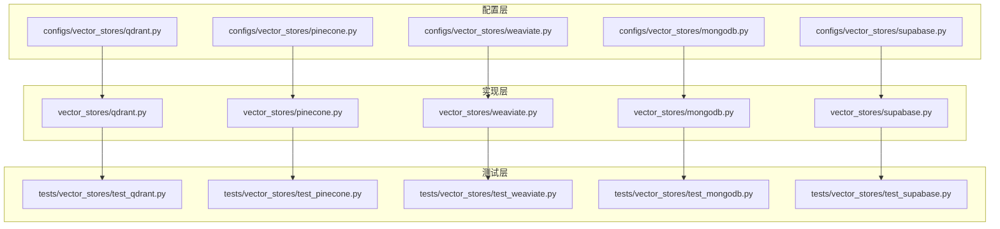
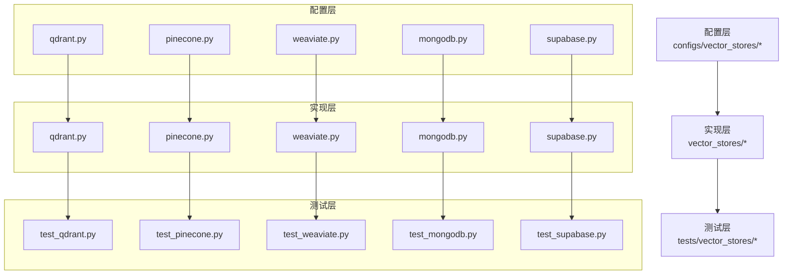
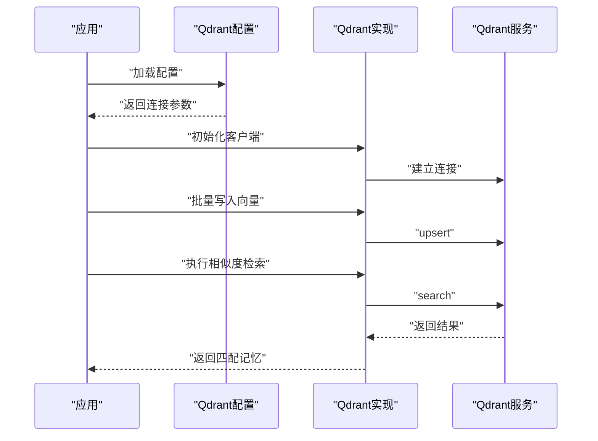
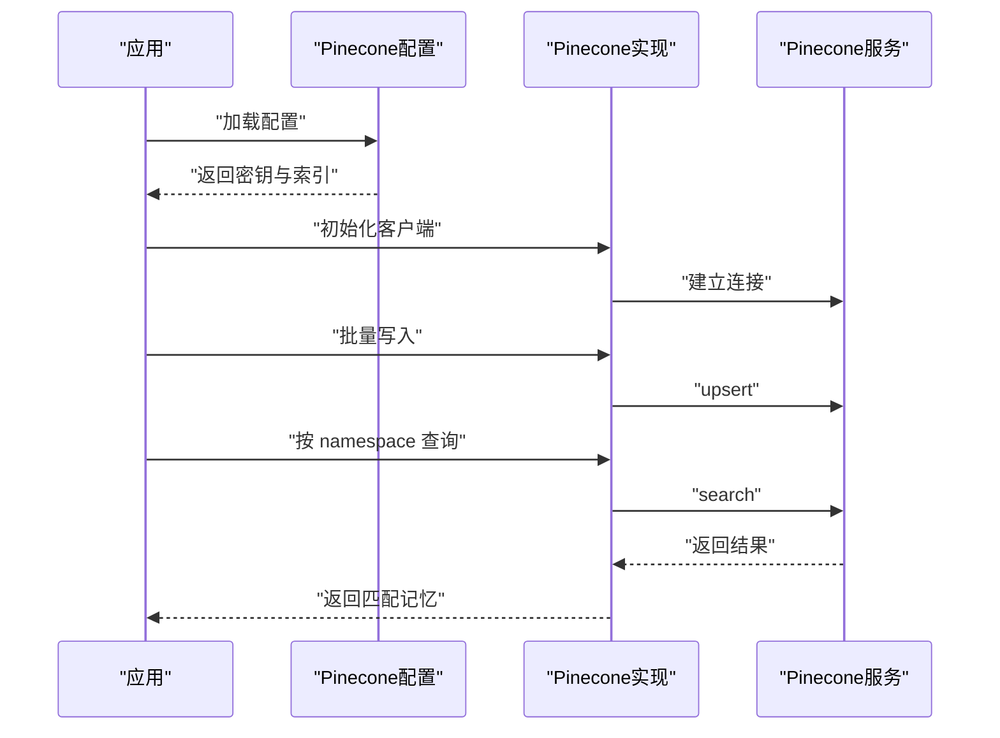
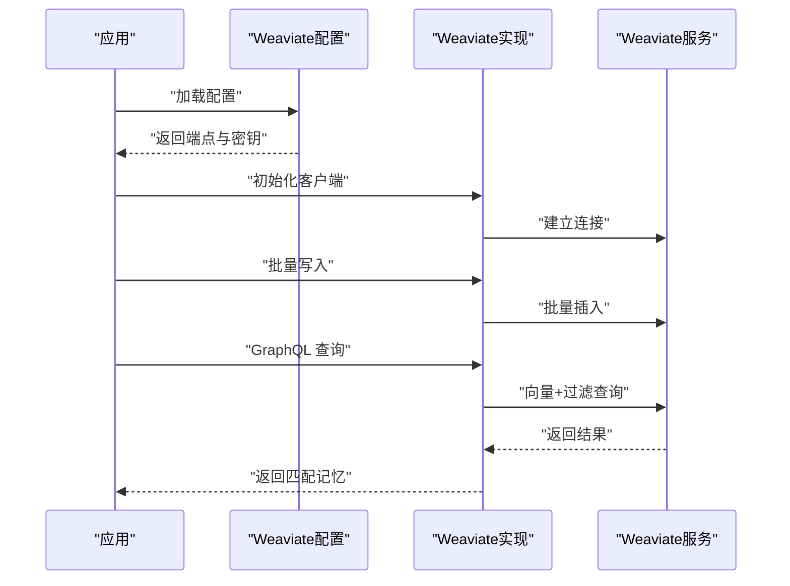
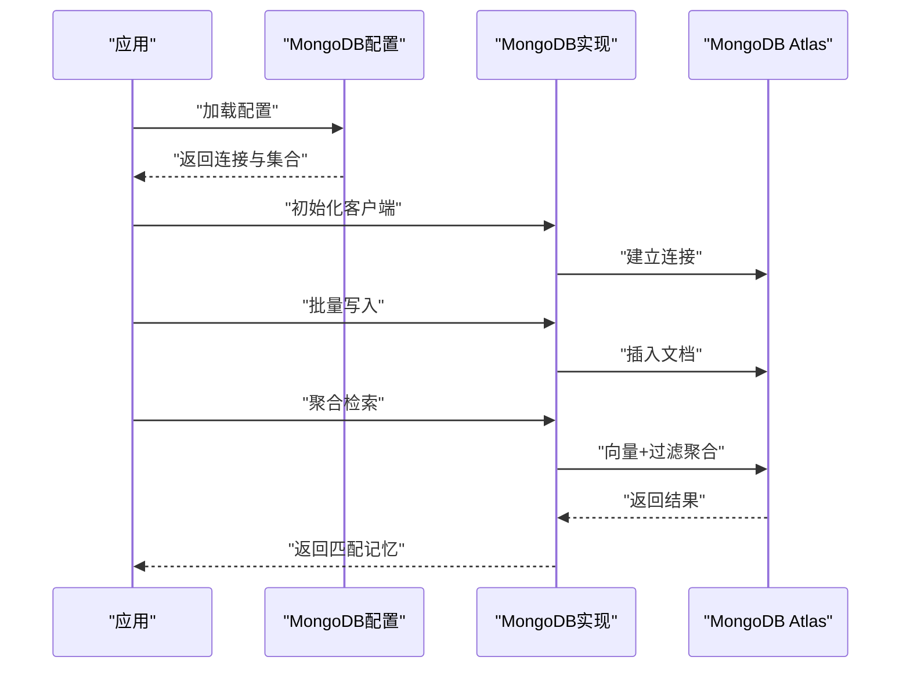
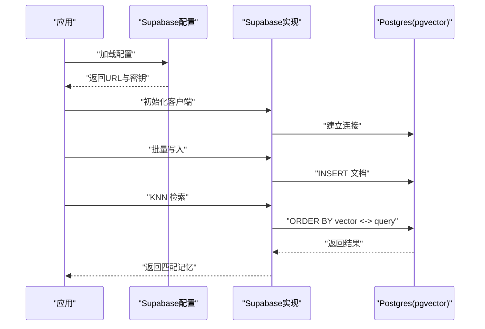
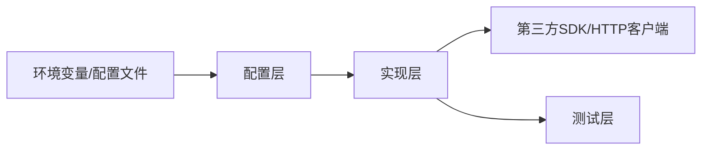

# 云端向量数据库

<cite>
**本文引用的文件**
- [qdrant.py](file://mem0/configs/vector_stores/qdrant.py)
- [qdrant.py](file://mem0/vector_stores/qdrant.py)
- [test_qdrant.py](file://tests/vector_stores/test_qdrant.py)
- [test_qdrant_config.py](file://tests/vector_stores/test_qdrant_config.py)
- [pinecone.py](file://mem0/configs/vector_stores/pinecone.py)
- [pinecone.py](file://mem0/vector_stores/pinecone.py)
- [test_pinecone.py](file://tests/vector_stores/test_pinecone.py)
- [weaviate.py](file://mem0/configs/vector_stores/weaviate.py)
- [weaviate.py](file://mem0/vector_stores/weaviate.py)
- [test_weaviate.py](file://tests/vector_stores/test_weaviate.py)
- [mongodb.py](file://mem0/configs/vector_stores/mongodb.py)
- [mongodb.py](file://mem0/vector_stores/mongodb.py)
- [test_mongodb.py](file://tests/vector_stores/test_mongodb.py)
- [supabase.py](file://mem0/configs/vector_stores/supabase.py)
- [supabase.py](file://mem0/vector_stores/supabase.py)
- [test_supabase.py](file://tests/vector_stores/test_supabase.py)
</cite>

## 目录
1. [简介](#简介)
2. [项目结构](#项目结构)
3. [核心组件](#核心组件)
4. [架构总览](#架构总览)
5. [详细组件分析](#详细组件分析)
6. [依赖关系分析](#依赖关系分析)
7. [性能考量](#性能考量)
8. [故障排除指南](#故障排除指南)
9. [结论](#结论)
10. [附录](#附录)

## 简介
本文件面向希望在 mem0 中集成主流云端向量数据库（Qdrant、Pinecone、Weaviate、MongoDB Atlas、Supabase）的开发者与运维人员。内容涵盖：
- 各服务的认证方式、连接参数与配置项
- 在 mem0 中的集成路径与关键实现位置
- 性能特征、成本与适用场景的对比建议
- 配置最佳实践与常见问题排查

## 项目结构
mem0 将“向量数据库”抽象为可插拔的后端模块，位于以下目录：
- 配置层：mem0/configs/vector_stores/*.py
- 实现层：mem0/vector_stores/*.py
- 测试层：tests/vector_stores/test_*service*.py

下图展示了与云端向量数据库相关的模块组织与分层职责。

图表来源
- [qdrant.py](file://mem0/configs/vector_stores/qdrant.py)
- [pinecone.py](file://mem0/configs/vector_stores/pinecone.py)
- [weaviate.py](file://mem0/configs/vector_stores/weaviate.py)
- [mongodb.py](file://mem0/configs/vector_stores/mongodb.py)
- [supabase.py](file://mem0/configs/vector_stores/supabase.py)
- [qdrant.py](file://mem0/vector_stores/qdrant.py)
- [pinecone.py](file://mem0/vector_stores/pinecone.py)
- [weaviate.py](file://mem0/vector_stores/weaviate.py)
- [mongodb.py](file://mem0/vector_stores/mongodb.py)
- [supabase.py](file://mem0/vector_stores/supabase.py)
- [test_qdrant.py](file://tests/vector_stores/test_qdrant.py)
- [test_pinecone.py](file://tests/vector_stores/test_pinecone.py)
- [test_weaviate.py](file://tests/vector_stores/test_weaviate.py)
- [test_mongodb.py](file://tests/vector_stores/test_mongodb.py)
- [test_supabase.py](file://tests/vector_stores/test_supabase.py)

章节来源
- [qdrant.py](file://mem0/configs/vector_stores/qdrant.py)
- [pinecone.py](file://mem0/configs/vector_stores/pinecone.py)
- [weaviate.py](file://mem0/configs/vector_stores/weaviate.py)
- [mongodb.py](file://mem0/configs/vector_stores/mongodb.py)
- [supabase.py](file://mem0/configs/vector_stores/supabase.py)
- [qdrant.py](file://mem0/vector_stores/qdrant.py)
- [pinecone.py](file://mem0/vector_stores/pinecone.py)
- [weaviate.py](file://mem0/vector_stores/weaviate.py)
- [mongodb.py](file://mem0/vector_stores/mongodb.py)
- [supabase.py](file://mem0/vector_stores/supabase.py)
- [test_qdrant.py](file://tests/vector_stores/test_qdrant.py)
- [test_pinecone.py](file://tests/vector_stores/test_pinecone.py)
- [test_weaviate.py](file://tests/vector_stores/test_weaviate.py)
- [test_mongodb.py](file://tests/vector_stores/test_mongodb.py)
- [test_supabase.py](file://tests/vector_stores/test_supabase.py)

## 核心组件
本节概述 mem0 中对五类云端向量数据库的配置与实现要点，并给出在 mem0 中的集成入口与关键实现位置。

- Qdrant
  - 配置入口：mem0/configs/vector_stores/qdrant.py
  - 实现入口：mem0/vector_stores/qdrant.py
  - 测试入口：tests/vector_stores/test_qdrant.py、tests/vector_stores/test_qdrant_config.py
  - 关键点：支持本地或远程集群；通过 API 密钥或无认证模式；集合（collection）命名与向量维度管理；批量写入与查询接口封装。

- Pinecone
  - 配置入口：mem0/configs/vector_stores/pinecone.py
  - 实现入口：mem0/vector_stores/pinecone.py
  - 测试入口：tests/vector_stores/test_pinecone.py
  - 关键点：通过 API 密钥认证；索引名称与向量维度；命名空间（namespace）隔离；批量 upsert/search/delete。

- Weaviate
  - 配置入口：mem0/configs/vector_stores/weaviate.py
  - 实现入口：mem0/vector_stores/weaviate.py
  - 测试入口：tests/vector_stores/test_weaviate.py
  - 关键点：支持 HTTP/HTTPS；通过 API 密钥或无认证；类（class）作为集合；GraphQL-风格查询与向量元数据。

- MongoDB Atlas（向量搜索）
  - 配置入口：mem0/configs/vector_stores/mongodb.py
  - 实现入口：mem0/vector_stores/mongodb.py
  - 测试入口：tests/vector_stores/test_mongodb.py
  - 关键点：通过连接字符串与凭据；集合与索引；向量嵌入字段名与相似度度量；聚合管道检索。

- Supabase Vector
  - 配置入口：mem0/configs/vector_stores/supabase.py
  - 实现入口：mem0/vector_stores/supabase.py
  - 测试入口：tests/vector_stores/test_supabase.py
  - 关键点：基于 Postgres 的 pgvector 扩展；通过项目 URL 与 API 密钥；表与向量列；KNN 检索与过滤。

章节来源
- [qdrant.py](file://mem0/configs/vector_stores/qdrant.py)
- [qdrant.py](file://mem0/vector_stores/qdrant.py)
- [test_qdrant.py](file://tests/vector_stores/test_qdrant.py)
- [test_qdrant_config.py](file://tests/vector_stores/test_qdrant_config.py)
- [pinecone.py](file://mem0/configs/vector_stores/pinecone.py)
- [pinecone.py](file://mem0/vector_stores/pinecone.py)
- [test_pinecone.py](file://tests/vector_stores/test_pinecone.py)
- [weaviate.py](file://mem0/configs/vector_stores/weaviate.py)
- [weaviate.py](file://mem0/vector_stores/weaviate.py)
- [test_weaviate.py](file://tests/vector_stores/test_weaviate.py)
- [mongodb.py](file://mem0/configs/vector_stores/mongodb.py)
- [mongodb.py](file://mem0/vector_stores/mongodb.py)
- [test_mongodb.py](file://tests/vector_stores/test_mongodb.py)
- [supabase.py](file://mem0/configs/vector_stores/supabase.py)
- [supabase.py](file://mem0/vector_stores/supabase.py)
- [test_supabase.py](file://tests/vector_stores/test_supabase.py)

## 架构总览
下图展示了 mem0 的向量存储抽象与具体实现的关系，以及与配置层的耦合方式。

图表来源
- [qdrant.py](file://mem0/configs/vector_stores/qdrant.py)
- [pinecone.py](file://mem0/configs/vector_stores/pinecone.py)
- [weaviate.py](file://mem0/configs/vector_stores/weaviate.py)
- [mongodb.py](file://mem0/configs/vector_stores/mongodb.py)
- [supabase.py](file://mem0/configs/vector_stores/supabase.py)
- [qdrant.py](file://mem0/vector_stores/qdrant.py)
- [pinecone.py](file://mem0/vector_stores/pinecone.py)
- [weaviate.py](file://mem0/vector_stores/weaviate.py)
- [mongodb.py](file://mem0/vector_stores/mongodb.py)
- [supabase.py](file://mem0/vector_stores/supabase.py)
- [test_qdrant.py](file://tests/vector_stores/test_qdrant.py)
- [test_pinecone.py](file://tests/vector_stores/test_pinecone.py)
- [test_weaviate.py](file://tests/vector_stores/test_weaviate.py)
- [test_mongodb.py](file://tests/vector_stores/test_mongodb.py)
- [test_supabase.py](file://tests/vector_stores/test_supabase.py)

## 详细组件分析

### Qdrant 组件分析
- 认证与连接
  - 支持通过 API 密钥或无认证模式访问远程集群
  - 连接参数包含地址、端口、TLS 开关、API 密钥等
- 集合与向量
  - 使用集合（collection）作为命名空间；集合需预先存在或自动创建
  - 向量维度需与嵌入模型一致；支持批量 upsert/search/delete
- 配置与实现
  - 配置文件定义了连接参数与集合策略
  - 实现文件封装了客户端初始化、批量操作与查询接口
- 测试覆盖
  - 单测验证配置解析、连接可用性、批量写入与检索流程

图表来源
- [qdrant.py](file://mem0/configs/vector_stores/qdrant.py)
- [qdrant.py](file://mem0/vector_stores/qdrant.py)

章节来源
- [qdrant.py](file://mem0/configs/vector_stores/qdrant.py)
- [qdrant.py](file://mem0/vector_stores/qdrant.py)
- [test_qdrant.py](file://tests/vector_stores/test_qdrant.py)
- [test_qdrant_config.py](file://tests/vector_stores/test_qdrant_config.py)

### Pinecone 组件分析
- 认证与连接
  - 通过 API 密钥进行认证
  - 需要指定索引名称与向量维度
- 命名空间与操作
  - 使用命名空间（namespace）隔离不同用户或会话
  - 支持批量 upsert/search/delete；支持过滤与元数据检索
- 配置与实现
  - 配置文件定义 API 密钥与索引参数
  - 实现文件封装客户端初始化与批量接口
- 测试覆盖
  - 单测验证索引存在性、批量写入与检索正确性

图表来源
- [pinecone.py](file://mem0/configs/vector_stores/pinecone.py)
- [pinecone.py](file://mem0/vector_stores/pinecone.py)

章节来源
- [pinecone.py](file://mem0/configs/vector_stores/pinecone.py)
- [pinecone.py](file://mem0/vector_stores/pinecone.py)
- [test_pinecone.py](file://tests/vector_stores/test_pinecone.py)

### Weaviate 组件分析
- 认证与连接
  - 支持 HTTP/HTTPS；可通过 API 密钥或无认证访问
  - 类（class）作为集合；需要预先创建类或自动创建
- GraphQL 风格检索
  - 支持向量与元数据联合查询；可设置过滤器与排序
- 配置与实现
  - 配置文件定义端点、密钥与类名
  - 实现文件封装客户端初始化与查询构建
- 测试覆盖
  - 单测验证类存在性、批量写入与 GraphQL 查询

图表来源
- [weaviate.py](file://mem0/configs/vector_stores/weaviate.py)
- [weaviate.py](file://mem0/vector_stores/weaviate.py)

章节来源
- [weaviate.py](file://mem0/configs/vector_stores/weaviate.py)
- [weaviate.py](file://mem0/vector_stores/weaviate.py)
- [test_weaviate.py](file://tests/vector_stores/test_weaviate.py)

### MongoDB Atlas（向量搜索）组件分析
- 连接与认证
  - 通过连接字符串与凭据连接；支持 TLS
  - 需要目标数据库与集合
- 索引与检索
  - 使用向量搜索索引；指定向量字段名与相似度度量
  - 支持聚合管道检索与元数据过滤
- 配置与实现
  - 配置文件定义连接参数与集合/索引
  - 实现文件封装连接、索引检查与聚合查询
- 测试覆盖
  - 单测验证连接可用性、索引存在性与检索流程

图表来源
- [mongodb.py](file://mem0/configs/vector_stores/mongodb.py)
- [mongodb.py](file://mem0/vector_stores/mongodb.py)

章节来源
- [mongodb.py](file://mem0/configs/vector_stores/mongodb.py)
- [mongodb.py](file://mem0/vector_stores/mongodb.py)
- [test_mongodb.py](file://tests/vector_stores/test_mongodb.py)

### Supabase Vector 组件分析
- 连接与认证
  - 基于 Postgres 的 pgvector；通过项目 URL 与 API 密钥
  - 需要目标表与向量列
- 检索与过滤
  - 使用 KNN 检索；支持 WHERE 过滤与元数据筛选
- 配置与实现
  - 配置文件定义项目 URL、密钥与表/列
  - 实现文件封装连接、KNN 查询与过滤
- 测试覆盖
  - 单测验证连接、KNN 检索与过滤逻辑

图表来源
- [supabase.py](file://mem0/configs/vector_stores/supabase.py)
- [supabase.py](file://mem0/vector_stores/supabase.py)

章节来源
- [supabase.py](file://mem0/configs/vector_stores/supabase.py)
- [supabase.py](file://mem0/vector_stores/supabase.py)
- [test_supabase.py](file://tests/vector_stores/test_supabase.py)

## 依赖关系分析
- 耦合与内聚
  - 配置层与实现层通过统一接口解耦；实现层各自封装第三方 SDK
  - 测试层独立于实现细节，仅依赖公开接口
- 外部依赖
  - 各实现依赖对应云厂商 SDK 或 HTTP 客户端
  - 配置层依赖环境变量或配置文件，避免硬编码敏感信息
- 可能的循环依赖
  - 当前结构清晰，未见循环导入迹象

图表来源
- [qdrant.py](file://mem0/configs/vector_stores/qdrant.py)
- [pinecone.py](file://mem0/configs/vector_stores/pinecone.py)
- [weaviate.py](file://mem0/configs/vector_stores/weaviate.py)
- [mongodb.py](file://mem0/configs/vector_stores/mongodb.py)
- [supabase.py](file://mem0/configs/vector_stores/supabase.py)
- [qdrant.py](file://mem0/vector_stores/qdrant.py)
- [pinecone.py](file://mem0/vector_stores/pinecone.py)
- [weaviate.py](file://mem0/vector_stores/weaviate.py)
- [mongodb.py](file://mem0/vector_stores/mongodb.py)
- [supabase.py](file://mem0/vector_stores/supabase.py)

章节来源
- [qdrant.py](file://mem0/configs/vector_stores/qdrant.py)
- [pinecone.py](file://mem0/configs/vector_stores/pinecone.py)
- [weaviate.py](file://mem0/configs/vector_stores/weaviate.py)
- [mongodb.py](file://mem0/configs/vector_stores/mongodb.py)
- [supabase.py](file://mem0/configs/vector_stores/supabase.py)
- [qdrant.py](file://mem0/vector_stores/qdrant.py)
- [pinecone.py](file://mem0/vector_stores/pinecone.py)
- [weaviate.py](file://mem0/vector_stores/weaviate.py)
- [mongodb.py](file://mem0/vector_stores/mongodb.py)
- [supabase.py](file://mem0/vector_stores/supabase.py)

## 性能考量
- 写入吞吐
  - 批量 upsert 是提升吞吐的关键；应根据服务限制调整批次大小
- 检索延迟
  - 向量维度越高、数据量越大，延迟通常越高；合理选择索引与过滤条件
- 成本控制
  - 按调用量与存储计费的服务需关注写入/查询频率与数据规模
  - 利用命名空间/集合隔离减少无关扫描
- 可靠性
  - 建议开启重试与超时配置；对网络抖动具备弹性

## 故障排除指南
- 连接失败
  - 检查密钥、端点与 TLS 设置是否正确
  - 确认网络可达性与防火墙规则
- 写入异常
  - 核对向量维度与嵌入模型一致
  - 检查集合/索引/类是否存在且已准备就绪
- 查询异常
  - 对于 Weaviate，确认类结构与属性映射
  - 对于 MongoDB/Supabase，确认向量字段名与索引存在
- 性能问题
  - 减少每次查询的 top_k；使用过滤缩小候选集
  - 分批写入与异步处理可缓解峰值压力

## 结论
mem0 提供了对主流云端向量数据库的一致抽象与实现，便于在不同服务间切换。通过配置层与实现层的清晰分离，开发者可以快速集成并优化检索体验。建议结合业务规模与预算选择合适的服务，并遵循本文的最佳实践与排障建议。

## 附录
- 配置最佳实践
  - 将密钥与敏感参数放入环境变量或安全配置中心
  - 为不同租户/用户划分集合/索引/命名空间
  - 设定合理的超时与重试策略
  - 对高并发场景启用批量写入与异步检索
- 适用场景建议
  - Qdrant：通用向量检索、灵活过滤、易于部署
  - Pinecone：托管向量服务、易扩展、生态完善
  - Weaviate：图谱/语义检索、多模态、强类型 Schema
  - MongoDB Atlas：已有 MongoDB 生态、向量搜索即插即用
  - Supabase：Postgres 生态、KNN 检索、低门槛上手