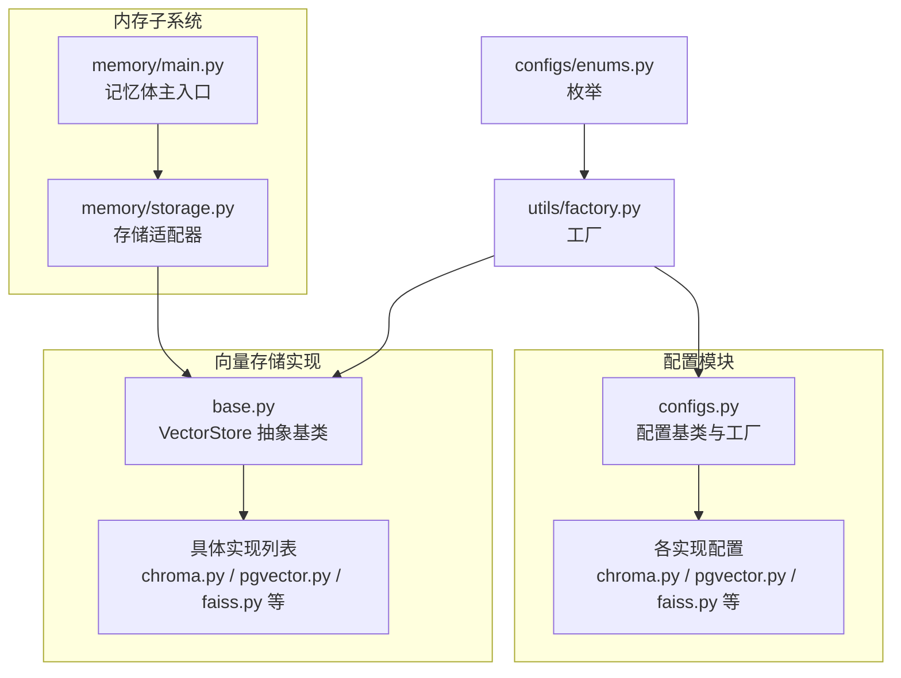
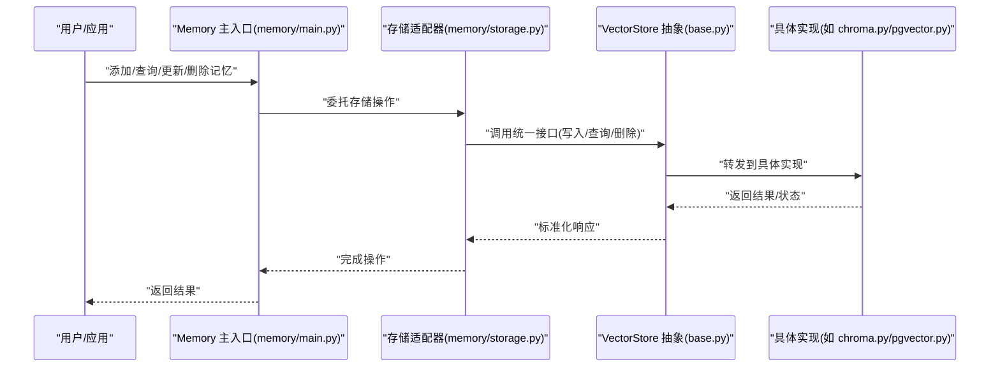
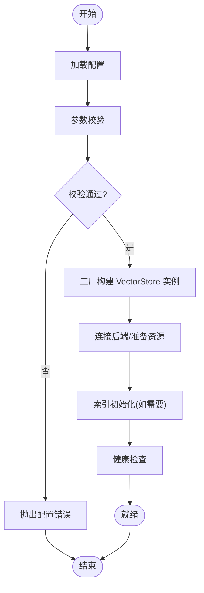
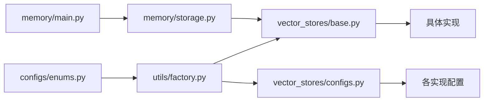

# 向量存储概览

<cite>
**本文引用的文件**
- [mem0/vector_stores/base.py](file://mem0/vector_stores/base.py)
- [mem0/vector_stores/configs.py](file://mem0/vector_stores/configs.py)
- [mem0/configs/vector_stores/chroma.py](file://mem0/configs/vector_stores/chroma.py)
- [mem0/configs/vector_stores/pgvector.py](file://mem0/configs/vector_stores/pgvector.py)
- [mem0/configs/vector_stores/faiss.py](file://mem0/configs/vector_stores/faiss.py)
- [mem0/configs/vector_stores/qdrant.py](file://mem0/configs/vector_stores/qdrant.py)
- [mem0/configs/vector_stores/pinecone.py](file://mem0/configs/vector_stores/pinecone.py)
- [mem0/configs/vector_stores/weaviate.py](file://mem0/configs/vector_stores/weaviate.py)
- [mem0/configs/vector_stores/redis.py](file://mem0/configs/vector_stores/redis.py)
- [mem0/configs/vector_stores/opensearch.py](file://mem0/configs/vector_stores/opensearch.py)
- [mem0/configs/vector_stores/elasticsearch.py](file://mem0/configs/vector_stores/elasticsearch.py)
- [mem0/configs/vector_stores/mongodb.py](file://mem0/configs/vector_stores/mongodb.py)
- [mem0/configs/vector_stores/milvus.py](file://mem0/configs/vector_stores/milvus.py)
- [mem0/configs/vector_stores/azure_ai_search.py](file://mem0/configs/vector_stores/azure_ai_search.py)
- [mem0/configs/vector_stores/azure_mysql.py](file://mem0/configs/vector_stores/azure_mysql.py)
- [mem0/configs/vector_stores/s3_vectors.py](file://mem0/configs/vector_stores/s3_vectors.py)
- [mem0/configs/vector_stores/supabase.py](file://mem0/configs/vector_stores/supabase.py)
- [mem0/configs/vector_stores/turbopuffer.py](file://mem0/configs/vector_stores/turbopuffer.py)
- [mem0/configs/vector_stores/upstash_vector.py](file://mem0/configs/vector_stores/upstash_vector.py)
- [mem0/configs/vector_stores/valkey.py](file://mem0/configs/vector_stores/valkey.py)
- [mem0/configs/vector_stores/vertex_ai_vector_search.py](file://mem0/configs/vector_stores/vertex_ai_vector_search.py)
- [mem0/configs/vector_stores/neptune_analytics.py](file://mem0/configs/vector_stores/neptune_analytics.py)
- [mem0/configs/vector_stores/databricks.py](file://mem0/configs/vector_stores/databricks.py)
- [mem0/configs/vector_stores/cassandra.py](file://mem0/configs/vector_stores/cassandra.py)
- [mem0/configs/vector_stores/baidu.py](file://mem0/configs/vector_stores/baidu.py)
- [mem0/memory/storage.py](file://mem0/memory/storage.py)
- [mem0/memory/main.py](file://mem0/memory/main.py)
- [mem0/utils/factory.py](file://mem0/utils/factory.py)
- [mem0/configs/base.py](file://mem0/configs/base.py)
- [mem0/configs/enums.py](file://mem0/configs/enums.py)
- [mem0/__init__.py](file://mem0/__init__.py)
</cite>

## 目录
1. [引言](#引言)
2. [项目结构](#项目结构)
3. [核心组件](#核心组件)
4. [架构总览](#架构总览)
5. [详细组件分析](#详细组件分析)
6. [依赖关系分析](#依赖关系分析)
7. [性能考量](#性能考量)
8. [故障排查指南](#故障排查指南)
9. [结论](#结论)
10. [附录](#附录)

## 引言
本文件面向向量存储（Vector Store）组件，系统性阐述其在 mem0 架构中的定位与职责、基础架构与抽象接口设计原理、VectorStore 基类的设计模式与核心方法定义、通用配置选项与初始化流程、生命周期管理策略、选择指南与性能对比要点，以及扩展新向量存储实现的开发指南。目标是帮助读者快速理解并正确选型与集成向量存储能力。

## 项目结构
向量存储相关代码主要分布在以下位置：
- 核心实现：mem0/vector_stores 下包含多种具体实现与基础抽象
- 配置模块：mem0/configs/vector_stores 下为各实现对应的配置类
- 内存子系统：mem0/memory 下与向量存储交互的存储层与主入口
- 工厂与枚举：mem0/utils/factory.py 与 mem0/configs/enums.py 提供实例化与类型枚举支持
- 初始化入口：mem0/__init__.py 暴露对外接口

**图表来源**
- [mem0/vector_stores/base.py](file://mem0/vector_stores/base.py)
- [mem0/vector_stores/chroma.py](file://mem0/vector_stores/chroma.py)
- [mem0/vector_stores/pgvector.py](file://mem0/vector_stores/pgvector.py)
- [mem0/vector_stores/faiss.py](file://mem0/vector_stores/faiss.py)
- [mem0/vector_stores/configs.py](file://mem0/vector_stores/configs.py)
- [mem0/configs/vector_stores/chroma.py](file://mem0/configs/vector_stores/chroma.py)
- [mem0/configs/vector_stores/pgvector.py](file://mem0/configs/vector_stores/pgvector.py)
- [mem0/configs/vector_stores/faiss.py](file://mem0/configs/vector_stores/faiss.py)
- [mem0/memory/storage.py](file://mem0/memory/storage.py)
- [mem0/memory/main.py](file://mem0/memory/main.py)
- [mem0/utils/factory.py](file://mem0/utils/factory.py)
- [mem0/configs/enums.py](file://mem0/configs/enums.py)

**章节来源**
- [mem0/vector_stores/base.py](file://mem0/vector_stores/base.py)
- [mem0/vector_stores/configs.py](file://mem0/vector_stores/configs.py)
- [mem0/memory/storage.py](file://mem0/memory/storage.py)
- [mem0/memory/main.py](file://mem0/memory/main.py)
- [mem0/utils/factory.py](file://mem0/utils/factory.py)
- [mem0/configs/enums.py](file://mem0/configs/enums.py)

## 核心组件
- VectorStore 抽象基类：定义统一的向量索引与检索接口，屏蔽不同后端差异
- 具体实现：覆盖本地嵌入式引擎（如 FAISS）、云原生向量数据库（如 Qdrant、Pinecone、Weaviate）及传统数据库扩展（如 pgvector）
- 配置体系：每种实现对应独立配置类，集中管理连接参数、索引参数、认证信息等
- 存储适配器：memory/storage.py 将 VectorStore 与上层记忆体操作解耦，负责写入、查询、删除等生命周期管理
- 工厂与枚举：通过工厂按配置动态构建具体 VectorStore 实例；枚举约束可用实现类型

**章节来源**
- [mem0/vector_stores/base.py](file://mem0/vector_stores/base.py)
- [mem0/vector_stores/configs.py](file://mem0/vector_stores/configs.py)
- [mem0/memory/storage.py](file://mem0/memory/storage.py)
- [mem0/utils/factory.py](file://mem0/utils/factory.py)
- [mem0/configs/enums.py](file://mem0/configs/enums.py)

## 架构总览
向量存储在 mem0 中承担“持久化与检索”的关键角色。上层记忆体操作通过存储适配器调用 VectorStore 接口，实现对不同后端的一致封装。工厂根据配置选择具体实现，确保可插拔与可替换。

**图表来源**
- [mem0/memory/main.py](file://mem0/memory/main.py)
- [mem0/memory/storage.py](file://mem0/memory/storage.py)
- [mem0/vector_stores/base.py](file://mem0/vector_stores/base.py)
- [mem0/vector_stores/chroma.py](file://mem0/vector_stores/chroma.py)
- [mem0/vector_stores/pgvector.py](file://mem0/vector_stores/pgvector.py)

## 详细组件分析

### VectorStore 抽象基类与设计模式
- 设计模式：模板方法 + 策略模式
  - 抽象基类定义标准接口，具体实现仅关注差异化逻辑
  - 工厂按配置选择策略，运行时透明切换
- 核心方法族（语义层面）
  - 初始化与连接：建立与后端的连接或准备本地资源
  - 写入/批量写入：将向量与元数据写入索引
  - 查询/相似度检索：基于向量进行相似度计算与过滤
  - 删除/清理：按条件或标识符删除记录
  - 管理接口：索引创建、存在性检查、统计信息、健康检查
- 错误处理：统一异常模型，区分连接失败、参数错误、后端异常等
- 生命周期：明确初始化、使用、关闭阶段，避免资源泄漏

```mermaid
classDiagram
class VectorStore {
+initialize(config)
+add(vectors, metadatas, ids)
+search(query_vector, filters, top_k)
+delete(ids)
+health_check()
+close()
}
class ChromaVectorStore
class PgvectorVectorStore
class FaissVectorStore
class QdrantVectorStore
class PineconeVectorStore
class WeaviateVectorStore
class RedisVectorStore
class OpenSearchVectorStore
class ElasticsearchVectorStore
class MongoDBVectorStore
class MilvusVectorStore
class AzureAiSearchVectorStore
class AzureMySQLVectorStore
class S3VectorsVectorStore
class SupabaseVectorStore
class TurbopufferVectorStore
class UpstashVectorStore
class ValkeyVectorStore
class VertexAiVectorSearchVectorStore
class NeptuneAnalyticsVectorStore
class DatabricksVectorStore
class CassandraVectorStore
class BaiduVectorStore
VectorStore <|-- ChromaVectorStore
VectorStore <|-- PgvectorVectorStore
VectorStore <|-- FaissVectorStore
VectorStore <|-- QdrantVectorStore
VectorStore <|-- PineconeVectorStore
VectorStore <|-- WeaviateVectorStore
VectorStore <|-- RedisVectorStore
VectorStore <|-- OpenSearchVectorStore
VectorStore <|-- ElasticsearchVectorStore
VectorStore <|-- MongoDBVectorStore
VectorStore <|-- MilvusVectorStore
VectorStore <|-- AzureAiSearchVectorStore
VectorStore <|-- AzureMySQLVectorStore
VectorStore <|-- S3VectorsVectorStore
VectorStore <|-- SupabaseVectorStore
VectorStore <|-- TurbopufferVectorStore
VectorStore <|-- UpstashVectorStore
VectorStore <|-- ValkeyVectorStore
VectorStore <|-- VertexAiVectorSearchVectorStore
VectorStore <|-- NeptuneAnalyticsVectorStore
VectorStore <|-- DatabricksVectorStore
VectorStore <|-- CassandraVectorStore
VectorStore <|-- BaiduVectorStore
```

**图表来源**
- [mem0/vector_stores/base.py](file://mem0/vector_stores/base.py)
- [mem0/vector_stores/chroma.py](file://mem0/vector_stores/chroma.py)
- [mem0/vector_stores/pgvector.py](file://mem0/vector_stores/pgvector.py)
- [mem0/vector_stores/faiss.py](file://mem0/vector_stores/faiss.py)
- [mem0/vector_stores/qdrant.py](file://mem0/vector_stores/qdrant.py)
- [mem0/vector_stores/pinecone.py](file://mem0/vector_stores/pinecone.py)
- [mem0/vector_stores/weaviate.py](file://mem0/vector_stores/weaviate.py)
- [mem0/vector_stores/redis.py](file://mem0/vector_stores/redis.py)
- [mem0/vector_stores/opensearch.py](file://mem0/vector_stores/opensearch.py)
- [mem0/vector_stores/elasticsearch.py](file://mem0/vector_stores/elasticsearch.py)
- [mem0/vector_stores/mongodb.py](file://mem0/vector_stores/mongodb.py)
- [mem0/vector_stores/milvus.py](file://mem0/vector_stores/milvus.py)
- [mem0/vector_stores/azure_ai_search.py](file://mem0/vector_stores/azure_ai_search.py)
- [mem0/vector_stores/azure_mysql.py](file://mem0/vector_stores/azure_mysql.py)
- [mem0/vector_stores/s3_vectors.py](file://mem0/vector_stores/s3_vectors.py)
- [mem0/vector_stores/supabase.py](file://mem0/vector_stores/supabase.py)
- [mem0/vector_stores/turbopuffer.py](file://mem0/vector_stores/turbopuffer.py)
- [mem0/vector_stores/upstash_vector.py](file://mem0/vector_stores/upstash_vector.py)
- [mem0/vector_stores/valkey.py](file://mem0/vector_stores/valkey.py)
- [mem0/vector_stores/vertex_ai_vector_search.py](file://mem0/vector_stores/vertex_ai_vector_search.py)
- [mem0/vector_stores/neptune_analytics.py](file://mem0/vector_stores/neptune_analytics.py)
- [mem0/vector_stores/databricks.py](file://mem0/vector_stores/databricks.py)
- [mem0/vector_stores/cassandra.py](file://mem0/vector_stores/cassandra.py)
- [mem0/vector_stores/baidu.py](file://mem0/vector_stores/baidu.py)

**章节来源**
- [mem0/vector_stores/base.py](file://mem0/vector_stores/base.py)

### 配置体系与初始化流程
- 配置基类与工厂
  - 配置基类统一字段与校验逻辑，派生类聚焦特定实现的参数
  - 工厂根据配置中的实现类型枚举，构造对应 VectorStore 实例
- 初始化步骤
  - 读取配置 → 校验参数 → 连接后端/准备本地资源 → 建立索引（如需）→ 健康检查
- 生命周期管理
  - 明确 close 调用时机，避免未释放连接或文件句柄
  - 支持热切换：通过工厂重建实例，保证运行时可替换

**图表来源**
- [mem0/vector_stores/configs.py](file://mem0/vector_stores/configs.py)
- [mem0/utils/factory.py](file://mem0/utils/factory.py)
- [mem0/configs/enums.py](file://mem0/configs/enums.py)

**章节来源**
- [mem0/vector_stores/configs.py](file://mem0/vector_stores/configs.py)
- [mem0/utils/factory.py](file://mem0/utils/factory.py)
- [mem0/configs/enums.py](file://mem0/configs/enums.py)

### 存储适配器与上层交互
- 存储适配器负责将记忆体操作转换为对 VectorStore 的调用
- 统一的增删改查接口，屏蔽底层实现差异
- 在批量写入、分页检索、过滤条件等方面提供一致性行为

**章节来源**
- [mem0/memory/storage.py](file://mem0/memory/storage.py)
- [mem0/memory/main.py](file://mem0/memory/main.py)

### 典型实现示例与特性对比
- Chroma：本地/嵌入式，适合开发与小规模部署
- FAISS：高性能 CPU 向量检索，适合单机场景
- pgvector：PostgreSQL 扩展，适合已有 SQL 生态
- Qdrant/Pinecone/Weaviate：云原生服务端，具备高可用与弹性
- Redis/OpenSearch/Elasticsearch：结合缓存/全文检索能力
- MongoDB/Milvus/Azure Ai Search：多模态与企业级特性
- 其他：S3 Vectors、Supabase、Turbopuffer、Upstash、Valkey、Vertex AI、Neptune Analytics、Databricks、Cassandra、Baidu 等

**章节来源**
- [mem0/configs/vector_stores/chroma.py](file://mem0/configs/vector_stores/chroma.py)
- [mem0/configs/vector_stores/pgvector.py](file://mem0/configs/vector_stores/pgvector.py)
- [mem0/configs/vector_stores/faiss.py](file://mem0/configs/vector_stores/faiss.py)
- [mem0/configs/vector_stores/qdrant.py](file://mem0/configs/vector_stores/qdrant.py)
- [mem0/configs/vector_stores/pinecone.py](file://mem0/configs/vector_stores/pinecone.py)
- [mem0/configs/vector_stores/weaviate.py](file://mem0/configs/vector_stores/weaviate.py)
- [mem0/configs/vector_stores/redis.py](file://mem0/configs/vector_stores/redis.py)
- [mem0/configs/vector_stores/opensearch.py](file://mem0/configs/vector_stores/opensearch.py)
- [mem0/configs/vector_stores/elasticsearch.py](file://mem0/configs/vector_stores/elasticsearch.py)
- [mem0/configs/vector_stores/mongodb.py](file://mem0/configs/vector_stores/mongodb.py)
- [mem0/configs/vector_stores/milvus.py](file://mem0/configs/vector_stores/milvus.py)
- [mem0/configs/vector_stores/azure_ai_search.py](file://mem0/configs/vector_stores/azure_ai_search.py)
- [mem0/configs/vector_stores/azure_mysql.py](file://mem0/configs/vector_stores/azure_mysql.py)
- [mem0/configs/vector_stores/s3_vectors.py](file://mem0/configs/vector_stores/s3_vectors.py)
- [mem0/configs/vector_stores/supabase.py](file://mem0/configs/vector_stores/supabase.py)
- [mem0/configs/vector_stores/turbopuffer.py](file://mem0/configs/vector_stores/turbopuffer.py)
- [mem0/configs/vector_stores/upstash_vector.py](file://mem0/configs/vector_stores/upstash_vector.py)
- [mem0/configs/vector_stores/valkey.py](file://mem0/configs/vector_stores/valkey.py)
- [mem0/configs/vector_stores/vertex_ai_vector_search.py](file://mem0/configs/vector_stores/vertex_ai_vector_search.py)
- [mem0/configs/vector_stores/neptune_analytics.py](file://mem0/configs/vector_stores/neptune_analytics.py)
- [mem0/configs/vector_stores/databricks.py](file://mem0/configs/vector_stores/databricks.py)
- [mem0/configs/vector_stores/cassandra.py](file://mem0/configs/vector_stores/cassandra.py)
- [mem0/configs/vector_stores/baidu.py](file://mem0/configs/vector_stores/baidu.py)

## 依赖关系分析
- 松耦合：VectorStore 抽象与具体实现之间通过工厂与配置解耦
- 可替换性：通过枚举与工厂，可在不修改上层逻辑的情况下切换实现
- 外部依赖：各实现依赖对应 SDK 或驱动，配置中集中管理版本与认证

**图表来源**
- [mem0/configs/enums.py](file://mem0/configs/enums.py)
- [mem0/utils/factory.py](file://mem0/utils/factory.py)
- [mem0/vector_stores/base.py](file://mem0/vector_stores/base.py)
- [mem0/vector_stores/configs.py](file://mem0/vector_stores/configs.py)
- [mem0/memory/storage.py](file://mem0/memory/storage.py)
- [mem0/memory/main.py](file://mem0/memory/main.py)

**章节来源**
- [mem0/configs/enums.py](file://mem0/configs/enums.py)
- [mem0/utils/factory.py](file://mem0/utils/factory.py)
- [mem0/vector_stores/base.py](file://mem0/vector_stores/base.py)
- [mem0/vector_stores/configs.py](file://mem0/vector_stores/configs.py)
- [mem0/memory/storage.py](file://mem0/memory/storage.py)
- [mem0/memory/main.py](file://mem0/memory/main.py)

## 性能考量
- 索引规模与查询延迟：不同实现的索引结构与优化策略差异较大
- 写入吞吐：批量写入、并发控制、索引刷新策略
- 存储成本：云服务按请求/存储计费；本地实现需评估磁盘与内存占用
- 可靠性：是否支持副本、快照、备份与跨区域复制
- 企业特性：访问控制、审计日志、合规要求

[本节为通用指导，无需列出具体文件来源]

## 故障排查指南
- 连接失败：检查网络、认证凭据、端点地址与防火墙设置
- 参数错误：核对维度、索引参数、过滤表达式格式
- 性能问题：确认批量大小、top_k 设置、是否启用预过滤
- 资源泄漏：确保在退出或重载时调用 close
- 日志与监控：开启后端日志，结合埋点定位瓶颈

[本节为通用指导，无需列出具体文件来源]

## 结论
向量存储是 mem0 记忆体系统的核心基础设施。通过抽象基类与工厂机制，mem0 实现了对多种后端的统一接入与灵活替换。合理选择与配置向量存储，能够显著提升检索质量与系统整体性能。

[本节为总结性内容，无需列出具体文件来源]

## 附录

### 向量存储选择指南
- 开发/测试/小规模：Chroma、FAISS
- 与 SQL 生态融合：pgvector
- 云原生与弹性：Qdrant、Pinecone、Weaviate
- 缓存/全文检索一体化：Redis、OpenSearch、Elasticsearch
- 企业级与多模态：MongoDB、Milvus、Azure Ai Search
- 其他：依据对象存储、边缘计算、图数据库等需求选择相应实现

**章节来源**
- [mem0/configs/vector_stores/chroma.py](file://mem0/configs/vector_stores/chroma.py)
- [mem0/configs/vector_stores/pgvector.py](file://mem0/configs/vector_stores/pgvector.py)
- [mem0/configs/vector_stores/faiss.py](file://mem0/configs/vector_stores/faiss.py)
- [mem0/configs/vector_stores/qdrant.py](file://mem0/configs/vector_stores/qdrant.py)
- [mem0/configs/vector_stores/pinecone.py](file://mem0/configs/vector_stores/pinecone.py)
- [mem0/configs/vector_stores/weaviate.py](file://mem0/configs/vector_stores/weaviate.py)
- [mem0/configs/vector_stores/redis.py](file://mem0/configs/vector_stores/redis.py)
- [mem0/configs/vector_stores/opensearch.py](file://mem0/configs/vector_stores/opensearch.py)
- [mem0/configs/vector_stores/elasticsearch.py](file://mem0/configs/vector_stores/elasticsearch.py)
- [mem0/configs/vector_stores/mongodb.py](file://mem0/configs/vector_stores/mongodb.py)
- [mem0/configs/vector_stores/milvus.py](file://mem0/configs/vector_stores/milvus.py)
- [mem0/configs/vector_stores/azure_ai_search.py](file://mem0/configs/vector_stores/azure_ai_search.py)

### 扩展新向量存储实现开发指南
- 步骤
  - 新建实现文件：继承 VectorStore 抽象基类，实现核心方法
  - 新建配置文件：继承配置基类，定义必要参数与默认值
  - 注册枚举：在枚举中新增实现类型，便于工厂识别
  - 工厂适配：确保工厂能根据新类型构造实例
  - 单测与集成测试：覆盖初始化、写入、查询、删除、健康检查
- 关键注意
  - 保持接口一致性，避免破坏上层契约
  - 明确资源生命周期管理，提供健壮的错误处理
  - 文档化参数含义、限制与最佳实践

**章节来源**
- [mem0/vector_stores/base.py](file://mem0/vector_stores/base.py)
- [mem0/vector_stores/configs.py](file://mem0/vector_stores/configs.py)
- [mem0/configs/enums.py](file://mem0/configs/enums.py)
- [mem0/utils/factory.py](file://mem0/utils/factory.py)