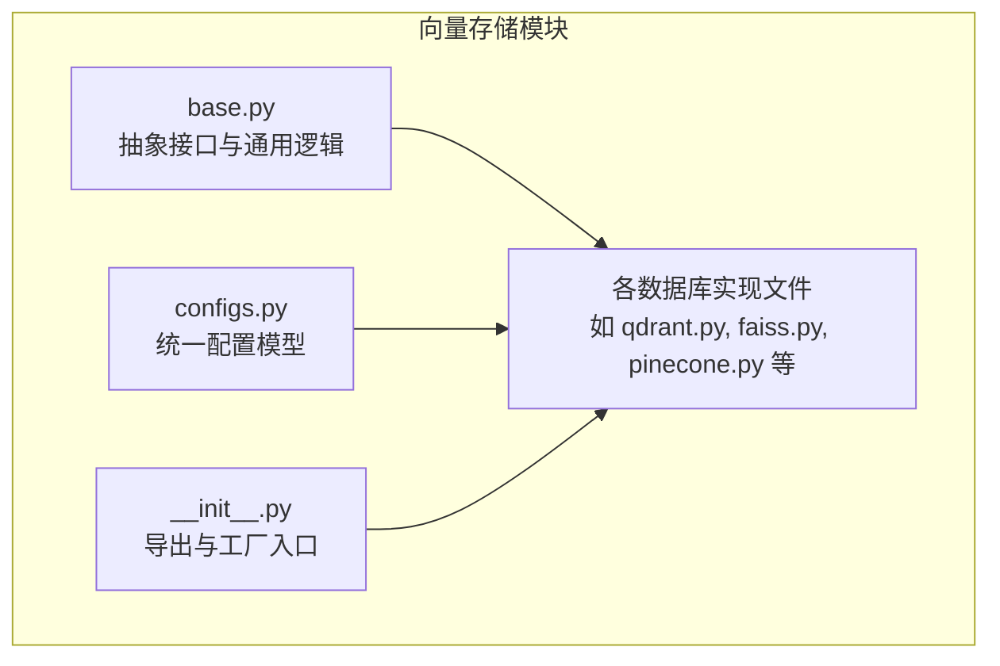
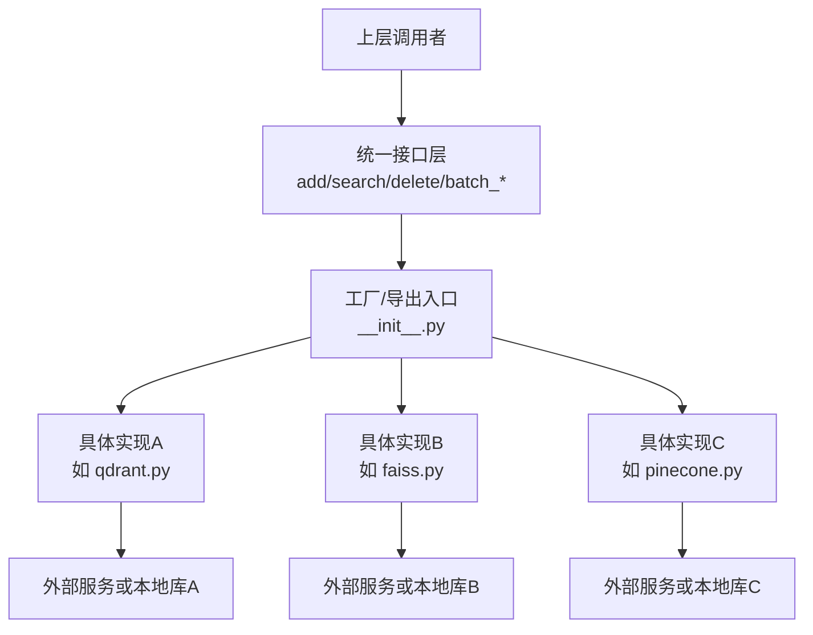
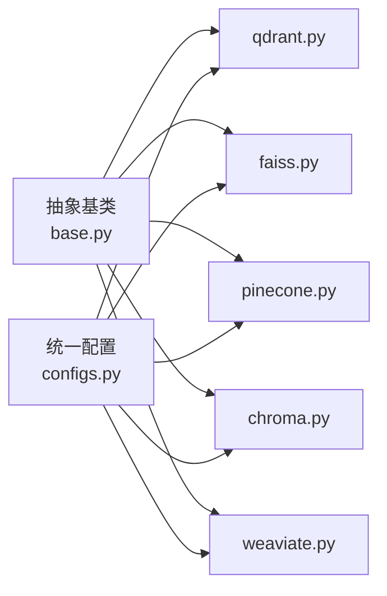

# 向量存储组件

<cite>
**本文引用的文件**
- [mem0/vector_stores/base.py](file://mem0/vector_stores/base.py)
- [mem0/vector_stores/configs.py](file://mem0/vector_stores/configs.py)
- [mem0/vector_stores/qdrant.py](file://mem0/vector_stores/qdrant.py)
- [mem0/vector_stores/faiss.py](file://mem0/vector_stores/faiss.py)
- [mem0/vector_stores/pinecone.py](file://mem0/vector_stores/pinecone.py)
- [mem0/vector_stores/chroma.py](file://mem0/vector_stores/chroma.py)
- [mem0/vector_stores/weaviate.py](file://mem0/vector_stores/weaviate.py)
- [mem0/vector_stores/pgvector.py](file://mem0/vector_stores/pgvector.py)
- [mem0/vector_stores/elasticsearch.py](file://mem0/vector_stores/elasticsearch.py)
- [mem0/vector_stores/mongodb.py](file://mem0/vector_stores/mongodb.py)
- [mem0/vector_stores/redis.py](file://mem0/vector_stores/redis.py)
- [mem0/vector_stores/opensearch.py](file://mem0/vector_stores/opensearch.py)
- [mem0/vector_stores/milvus.py](file://mem0/vector_stores/milvus.py)
- [mem0/vector_stores/cassandra.py](file://mem0/vector_stores/cassandra.py)
- [mem0/vector_stores/supabase.py](file://mem0/vector_stores/supabase.py)
- [mem0/vector_stores/turbopuffer.py](file://mem0/vector_stores/turbopuffer.py)
- [mem0/vector_stores/upstash_vector.py](file://mem0/vector_stores/upstash_vector.py)
- [mem0/vector_stores/valkey.py](file://mem0/vector_stores/valkey.py)
- [mem0/vector_stores/azure_ai_search.py](file://mem0/vector_stores/azure_ai_search.py)
- [mem0/vector_stores/vertex_ai_vector_search.py](file://mem0/vector_stores/vertex_ai_vector_search.py)
- [mem0/vector_stores/azure_mysql.py](file://mem0/vector_stores/azure_mysql.py)
- [mem0/vector_stores/databricks.py](file://mem0/vector_stores/databricks.py)
- [mem0/vector_stores/neptune_analytics.py](file://mem0/vector_stores/neptune_analytics.py)
- [mem0/vector_stores/s3_vectors.py](file://mem0/vector_stores/s3_vectors.py)
- [mem0/vector_stores/baidu.py](file://mem0/vector_stores/baidu.py)
- [mem0/vector_stores/langchain.py](file://mem0/vector_stores/langchain.py)
- [mem0/vector_stores/__init__.py](file://mem0/vector_stores/__init__.py)
- [tests/vector_stores/test_qdrant.py](file://tests/vector_stores/test_qdrant.py)
- [tests/vector_stores/test_faiss.py](file://tests/vector_stores/test_faiss.py)
- [tests/vector_stores/test_pinecone.py](file://tests/vector_stores/test_pinecone.py)
- [tests/vector_stores/test_chroma.py](file://tests/vector_stores/test_chroma.py)
- [tests/vector_stores/test_weaviate.py](file://tests/vector_stores/test_weaviate.py)
- [tests/vector_stores/test_pgvector.py](file://tests/vector_stores/test_pgvector.py)
- [tests/vector_stores/test_elasticsearch.py](file://tests/vector_stores/test_elasticsearch.py)
- [tests/vector_stores/test_mongodb.py](file://tests/vector_stores/test_mongodb.py)
- [tests/vector_stores/test_redis.py](file://tests/vector_stores/test_redis.py)
- [tests/vector_stores/test_opensearch.py](file://tests/vector_stores/test_opensearch.py)
- [tests/vector_stores/test_milvus.py](file://tests/vector_stores/test_milvus.py)
- [tests/vector_stores/test_cassandra.py](file://tests/vector_stores/test_cassandra.py)
- [tests/vector_stores/test_supabase.py](file://tests/vector_stores/test_supabase.py)
- [tests/vector_stores/test_turbopuffer.py](file://tests/vector_stores/test_turbopuffer.py)
- [tests/vector_stores/test_upstash_vector.py](file://tests/vector_stores/test_upstash_vector.py)
- [tests/vector_stores/test_valkey.py](file://tests/vector_stores/test_valkey.py)
- [tests/vector_stores/test_azure_ai_search.py](file://tests/vector_stores/test_azure_ai_search.py)
- [tests/vector_stores/test_vertex_ai_vector_search.py](file://tests/vector_stores/test_vertex_ai_vector_search.py)
- [tests/vector_stores/test_azure_mysql.py](file://tests/vector_stores/test_azure_mysql.py)
- [tests/vector_stores/test_databricks.py](file://tests/vector_stores/test_databricks.py)
- [tests/vector_stores/test_neptune_analytics.py](file://tests/vector_stores/test_neptune_analytics.py)
- [tests/vector_stores/test_s3_vectors.py](file://tests/vector_stores/test_s3_vectors.py)
- [tests/vector_stores/test_baidu.py](file://tests/vector_stores/test_baidu.py)
- [tests/vector_stores/test_langchain.py](file://tests/vector_stores/test_langchain.py)
</cite>

## 目录
1. [简介](#简介)
2. [项目结构](#项目结构)
3. [核心组件](#核心组件)
4. [架构总览](#架构总览)
5. [详细组件分析](#详细组件分析)
6. [依赖关系分析](#依赖关系分析)
7. [性能考虑](#性能考虑)
8. [故障排除指南](#故障排除指南)
9. [结论](#结论)
10. [附录](#附录)

## 简介
本文件系统性梳理向量存储组件的设计与实现，覆盖抽象接口、统一配置模型以及对多种向量数据库（Qdrant、FAISS、Pinecone、Chroma、Weaviate 等）的支持方式。文档重点解释：
- 基础架构与抽象接口设计
- 各实现的配置要点、连接参数与使用方法
- 性能特征、适用场景与限制条件
- 索引管理、批量操作与性能优化建议
- 故障排除与迁移思路

## 项目结构
向量存储模块位于 mem0/vector_stores 下，采用“按数据库类型分文件”的组织方式，每个数据库实现独立文件，并通过统一的基类与配置模型对外暴露一致的接口。

图表来源
- [mem0/vector_stores/base.py](file://mem0/vector_stores/base.py)
- [mem0/vector_stores/configs.py](file://mem0/vector_stores/configs.py)
- [mem0/vector_stores/__init__.py](file://mem0/vector_stores/__init__.py)

章节来源
- [mem0/vector_stores/base.py](file://mem0/vector_stores/base.py)
- [mem0/vector_stores/configs.py](file://mem0/vector_stores/configs.py)
- [mem0/vector_stores/__init__.py](file://mem0/vector_stores/__init__.py)

## 核心组件
- 抽象基类：定义统一的向量存储接口（如添加、查询、删除、批量写入等），确保不同后端实现具备一致的行为契约。
- 配置模型：集中化管理各后端所需的连接参数、索引策略、元数据字段等，便于在运行时动态切换与校验。
- 实现层：针对具体向量数据库的适配器，负责将抽象接口映射到实际 SDK 或服务调用。
- 工厂与导出：通过 __init__.py 暴露统一入口，便于上层按名称选择实现。

章节来源
- [mem0/vector_stores/base.py](file://mem0/vector_stores/base.py)
- [mem0/vector_stores/configs.py](file://mem0/vector_stores/configs.py)
- [mem0/vector_stores/__init__.py](file://mem0/vector_stores/__init__.py)

## 架构总览
下图展示从上层调用到底层数据库的交互路径，强调统一接口与多实现解耦：

图表来源
- [mem0/vector_stores/__init__.py](file://mem0/vector_stores/__init__.py)
- [mem0/vector_stores/base.py](file://mem0/vector_stores/base.py)
- [mem0/vector_stores/qdrant.py](file://mem0/vector_stores/qdrant.py)
- [mem0/vector_stores/faiss.py](file://mem0/vector_stores/faiss.py)
- [mem0/vector_stores/pinecone.py](file://mem0/vector_stores/pinecone.py)

## 详细组件分析

### 抽象接口与统一配置
- 抽象接口：定义 add、search、delete、update、batch_add、batch_delete、batch_update 等方法签名；包含索引管理（创建、删除、刷新）、元数据过滤、向量维度与距离度量等约定。
- 统一配置：以 Pydantic 模型形式承载各后端参数，如连接地址、认证凭据、命名空间、索引参数、超时重试等；支持运行时校验与默认值填充。

章节来源
- [mem0/vector_stores/base.py](file://mem0/vector_stores/base.py)
- [mem0/vector_stores/configs.py](file://mem0/vector_stores/configs.py)

### Qdrant 实现
- 连接与配置：支持主机地址、端口、API 密钥、TLS 开关、集合命名、向量维度、距离度量（余弦/点积/Euclid）、过滤器等。
- 使用方法：初始化客户端 → 创建/检查集合 → 批量插入向量与元数据 → 执行向量检索与过滤 → 删除或更新指定 ID 的记录。
- 性能特征：基于分布式倒排文件与内存索引，适合高维稀疏向量与复杂过滤；支持并发写入与近似最近邻搜索。
- 适用场景：需要强过滤能力与可扩展性的检索系统。
- 限制条件：大规模集合需关注资源占用与网络延迟；部分高级过滤可能影响吞吐。
- 最佳实践：合理设置向量维度与距离度量；利用元数据分区；批量写入提升吞吐；定期重建索引优化查询延迟。

章节来源
- [mem0/vector_stores/qdrant.py](file://mem0/vector_stores/qdrant.py)
- [tests/vector_stores/test_qdrant.py](file://tests/vector_stores/test_qdrant.py)

### FAISS 实现
- 连接与配置：本地嵌入式向量库，支持 CPU/GPU 索引、量化压缩、索引类型（Flat/IVF/PQ/HSI）与内存管理。
- 使用方法：构建索引对象 → 添加向量与元数据 → 设置查询参数（top_k、过滤）→ 执行检索 → 支持增量更新与持久化。
- 性能特征：极低延迟与高吞吐，适合小中规模数据与本地部署；支持多种量化策略降低内存占用。
- 适用场景：本地私有化、边缘计算、低延迟检索。
- 限制条件：单机部署，横向扩展有限；大规模数据需注意内存与磁盘 IO。
- 最佳实践：根据数据规模选择合适索引类型；启用量化与分块加载；定期合并碎片与重建索引。

章节来源
- [mem0/vector_stores/faiss.py](file://mem0/vector_stores/faiss.py)
- [tests/vector_stores/test_faiss.py](file://tests/vector_stores/test_faiss.py)

### Pinecone 实现
- 连接与配置：服务端托管，支持命名空间、向量维度、metric（cosine/euclidean/inner_product）、向量与元数据字段、批量大小与并发。
- 使用方法：初始化客户端 → 选择命名空间 → 批量 upsert → 查询与过滤 → 删除或更新。
- 性能特征：托管即用、弹性扩缩容；适合云原生与高可用需求。
- 适用场景：快速上线、多租户隔离、弹性伸缩。
- 限制条件：成本随数据与查询线性增长；网络延迟影响查询体验。
- 最佳实践：合理划分命名空间；控制批量大小与并发；开启压缩与缓存；监控指标与告警。

章节来源
- [mem0/vector_stores/pinecone.py](file://mem0/vector_stores/pinecone.py)
- [tests/vector_stores/test_pinecone.py](file://tests/vector_stores/test_pinecone.py)

### Chroma 实现
- 连接与配置：支持本地文件存储与远程服务模式；集合/命名空间、向量维度、元数据字段、嵌套过滤。
- 使用方法：初始化 → 创建/打开集合 → 批量添加 → 过滤查询 → 删除与更新。
- 性能特征：轻量易用，适合开发测试与小规模生产；远程模式依赖网络稳定性。
- 适用场景：原型验证、本地开发、小团队协作。
- 限制条件：大规模生产建议使用更成熟的向量 DB；远程模式存在网络抖动风险。
- 最佳实践：本地模式使用 WAL 与快照；远程模式使用稳定网络与高可用服务；合理设置过滤条件。

章节来源
- [mem0/vector_stores/chroma.py](file://mem0/vector_stores/chroma.py)
- [tests/vector_stores/test_chroma.py](file://tests/vector_stores/test_chroma.py)

### Weaviate 实现
- 连接与配置：支持主机、端口、认证、TLS、类名、属性映射、向量字段、模块与向量化配置。
- 使用方法：初始化客户端 → 定义/检查类 → 批量导入 → GraphQL 风格查询与过滤 → 更新与删除。
- 性能特征：Schema 驱动、强类型元数据；支持复杂查询与推理。
- 适用场景：知识图谱、实体识别、结构化检索。
- 限制条件：Schema 变更成本较高；复杂查询可能带来延迟。
- 最佳实践：提前规划 Schema；使用向量化模块；批量导入与事务控制；监控查询计划。

章节来源
- [mem0/vector_stores/weaviate.py](file://mem0/vector_stores/weaviate.py)
- [tests/vector_stores/test_weaviate.py](file://tests/vector_stores/test_weaviate.py)

### 其他实现概览
以下为其他常见向量存储的实现文件，便于按需查阅与集成：
- 关系型扩展：pgvector、azure_mysql、databricks
- 搜索引擎：elasticsearch、opensearch、supabase
- 文档数据库：mongodb、s3_vectors
- 时序/键值：valkey、upstash_vector
- 分布式/云原生：milvus、cassandra、turbopuffer、neptune_analytics
- 云 AI Vector Search：azure_ai_search、vertex_ai_vector_search
- 其他：baidu

章节来源
- [mem0/vector_stores/pgvector.py](file://mem0/vector_stores/pgvector.py)
- [mem0/vector_stores/elasticsearch.py](file://mem0/vector_stores/elasticsearch.py)
- [mem0/vector_stores/mongodb.py](file://mem0/vector_stores/mongodb.py)
- [mem0/vector_stores/redis.py](file://mem0/vector_stores/redis.py)
- [mem0/vector_stores/opensearch.py](file://mem0/vector_stores/opensearch.py)
- [mem0/vector_stores/milvus.py](file://mem0/vector_stores/milvus.py)
- [mem0/vector_stores/cassandra.py](file://mem0/vector_stores/cassandra.py)
- [mem0/vector_stores/supabase.py](file://mem0/vector_stores/supabase.py)
- [mem0/vector_stores/turbopuffer.py](file://mem0/vector_stores/turbopuffer.py)
- [mem0/vector_stores/upstash_vector.py](file://mem0/vector_stores/upstash_vector.py)
- [mem0/vector_stores/valkey.py](file://mem0/vector_stores/valkey.py)
- [mem0/vector_stores/azure_ai_search.py](file://mem0/vector_stores/azure_ai_search.py)
- [mem0/vector_stores/vertex_ai_vector_search.py](file://mem0/vector_stores/vertex_ai_vector_search.py)
- [mem0/vector_stores/azure_mysql.py](file://mem0/vector_stores/azure_mysql.py)
- [mem0/vector_stores/databricks.py](file://mem0/vector_stores/databricks.py)
- [mem0/vector_stores/neptune_analytics.py](file://mem0/vector_stores/neptune_analytics.py)
- [mem0/vector_stores/s3_vectors.py](file://mem0/vector_stores/s3_vectors.py)
- [mem0/vector_stores/baidu.py](file://mem0/vector_stores/baidu.py)

## 依赖关系分析
- 耦合与内聚：实现层严格依赖抽象基类与统一配置模型，保持良好内聚；与第三方 SDK 的耦合通过适配器封装，便于替换。
- 外部依赖：各实现直接依赖对应 SDK 或服务端 API；统一配置模型提供参数校验与默认值，降低上层调用复杂度。
- 循环依赖：未见循环依赖迹象；实现文件之间无直接相互导入。

图表来源
- [mem0/vector_stores/base.py](file://mem0/vector_stores/base.py)
- [mem0/vector_stores/configs.py](file://mem0/vector_stores/configs.py)
- [mem0/vector_stores/qdrant.py](file://mem0/vector_stores/qdrant.py)
- [mem0/vector_stores/faiss.py](file://mem0/vector_stores/faiss.py)
- [mem0/vector_stores/pinecone.py](file://mem0/vector_stores/pinecone.py)
- [mem0/vector_stores/chroma.py](file://mem0/vector_stores/chroma.py)
- [mem0/vector_stores/weaviate.py](file://mem0/vector_stores/weaviate.py)

章节来源
- [mem0/vector_stores/base.py](file://mem0/vector_stores/base.py)
- [mem0/vector_stores/configs.py](file://mem0/vector_stores/configs.py)
- [mem0/vector_stores/__init__.py](file://mem0/vector_stores/__init__.py)

## 性能考虑
- 写入吞吐
  - 批量写入：优先使用批量接口（batch_add、batch_upsert）减少网络往返与事务开销。
  - 并发控制：根据后端最大并发与资源上限调整线程/进程数与批量大小。
  - 索引策略：FAISS 选择合适索引类型；Qdrant 合理设置段大小与刷新周期；Pinecone 控制批大小与命名空间。
- 查询延迟
  - 索引优化：定期重建或重载索引；启用预聚合与缓存；对高频查询建立专用索引。
  - 过滤与排序：避免在大结果集上进行昂贵过滤；使用布尔过滤与数值范围过滤。
  - 距离度量：根据向量分布选择合适的度量（余弦/点积/Euclid）。
- 存储与内存
  - 量化与压缩：FAISS 启用 IVF/PQ/HNSW；Qdrant 合理设置段与内存阈值。
  - 分片与副本：分布式数据库（Milvus、Weaviate、Pinecone）按业务拆分集合与命名空间。
- 可靠性
  - 超时与重试：统一配置超时与指数退避；对临时性错误自动重试。
  - 健康检查：定时探测后端健康状态；异常时降级或熔断。

## 故障排除指南
- 连接失败
  - 校验主机、端口、认证与 TLS 配置；确认网络连通与防火墙放行。
  - 对于云端服务，检查密钥权限与配额。
- 写入异常
  - 检查批量大小是否超过后端限制；确认向量维度与字段类型匹配。
  - 对 FAISS：检查索引是否只读或被其他进程锁定。
- 查询异常
  - 检查过滤表达式语法与字段是否存在；确认索引已刷新。
  - 对 Qdrant：确认集合存在且向量字段已正确向量化。
- 性能骤降
  - 查看后端指标（CPU/内存/IO/网络）；评估是否需要扩容或调整索引策略。
  - 对 Pinecone：检查命名空间是否过载；对 Milvus/Weaviate：检查查询计划与索引状态。
- 数据不一致
  - 强制刷新索引；执行一致性检查；必要时重建集合/索引。
- 迁移与回滚
  - 导出旧数据（如 JSON/Parquet）→ 在新后端重建索引 → 批量导入 → 校验一致性 → 切换流量 → 清理旧后端。

章节来源
- [tests/vector_stores/test_qdrant.py](file://tests/vector_stores/test_qdrant.py)
- [tests/vector_stores/test_faiss.py](file://tests/vector_stores/test_faiss.py)
- [tests/vector_stores/test_pinecone.py](file://tests/vector_stores/test_pinecone.py)
- [tests/vector_stores/test_chroma.py](file://tests/vector_stores/test_chroma.py)
- [tests/vector_stores/test_weaviate.py](file://tests/vector_stores/test_weaviate.py)
- [tests/vector_stores/test_pgvector.py](file://tests/vector_stores/test_pgvector.py)
- [tests/vector_stores/test_elasticsearch.py](file://tests/vector_stores/test_elasticsearch.py)
- [tests/vector_stores/test_mongodb.py](file://tests/vector_stores/test_mongodb.py)
- [tests/vector_stores/test_redis.py](file://tests/vector_stores/test_redis.py)
- [tests/vector_stores/test_opensearch.py](file://tests/vector_stores/test_opensearch.py)
- [tests/vector_stores/test_milvus.py](file://tests/vector_stores/test_milvus.py)
- [tests/vector_stores/test_cassandra.py](file://tests/vector_stores/test_cassandra.py)
- [tests/vector_stores/test_supabase.py](file://tests/vector_stores/test_supabase.py)
- [tests/vector_stores/test_turbopuffer.py](file://tests/vector_stores/test_turbopuffer.py)
- [tests/vector_stores/test_upstash_vector.py](file://tests/vector_stores/test_upstash_vector.py)
- [tests/vector_stores/test_valkey.py](file://tests/vector_stores/test_valkey.py)
- [tests/vector_stores/test_azure_ai_search.py](file://tests/vector_stores/test_azure_ai_search.py)
- [tests/vector_stores/test_vertex_ai_vector_search.py](file://tests/vector_stores/test_vertex_ai_vector_search.py)
- [tests/vector_stores/test_azure_mysql.py](file://tests/vector_stores/test_azure_mysql.py)
- [tests/vector_stores/test_databricks.py](file://tests/vector_stores/test_databricks.py)
- [tests/vector_stores/test_neptune_analytics.py](file://tests/vector_stores/test_neptune_analytics.py)
- [tests/vector_stores/test_s3_vectors.py](file://tests/vector_stores/test_s3_vectors.py)
- [tests/vector_stores/test_baidu.py](file://tests/vector_stores/test_baidu.py)
- [tests/vector_stores/test_langchain.py](file://tests/vector_stores/test_langchain.py)

## 结论
向量存储组件通过抽象接口与统一配置模型实现了多后端的一致性访问，结合各数据库的特性与限制，可在不同场景下选择最优方案。建议在生产环境中优先采用批量写入、合理的索引策略与完善的监控告警体系，以获得稳定的吞吐与低延迟。

## 附录
- 快速选型参考
  - 本地低延迟：FAISS
  - 云原生弹性：Pinecone/Qdrant（托管）
  - 复杂 Schema/元数据：Weaviate
  - 搜索增强：Elasticsearch/OpenSearch
  - 文档型数据：MongoDB
  - 键值/时序：Redis/Valkey/Upstash
  - 分布式/多模型：Milvus/Cassandra
  - 云 AI Vector Search：Azure AI Search/Vertex AI Vector Search
  - 其他：Supabase/S3 Vectors/Baidu/Databricks/Azure MySQL/Neptune Analytics