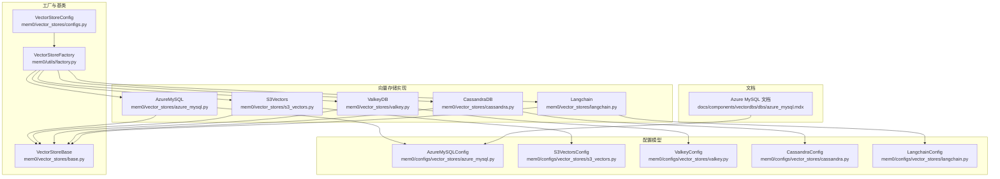
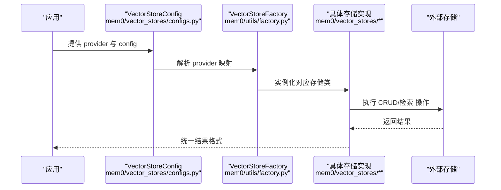
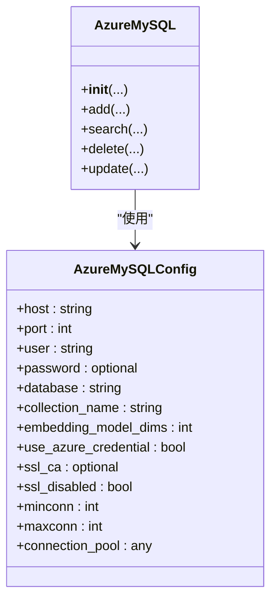
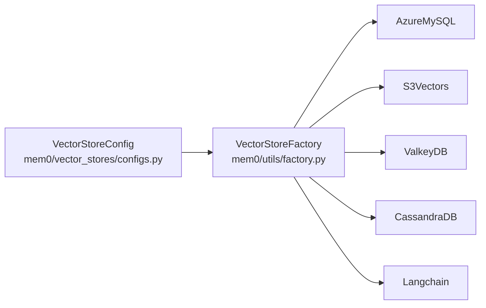

# 数据存储后端

<cite>
**本文引用的文件**
- [mem0/vector_stores/azure_mysql.py](file://mem0/vector_stores/azure_mysql.py)
- [mem0/configs/vector_stores/azure_mysql.py](file://mem0/configs/vector_stores/azure_mysql.py)
- [docs/components/vectordbs/dbs/azure_mysql.mdx](file://docs/components/vectordbs/dbs/azure_mysql.mdx)
- [mem0/utils/factory.py](file://mem0/utils/factory.py)
- [mem0/vector_stores/configs.py](file://mem0/vector_stores/configs.py)
- [mem0/vector_stores/s3_vectors.py](file://mem0/vector_stores/s3_vectors.py)
- [mem0/configs/vector_stores/s3_vectors.py](file://mem0/configs/vector_stores/s3_vectors.py)
- [mem0/vector_stores/valkey.py](file://mem0/vector_stores/valkey.py)
- [mem0/configs/vector_stores/valkey.py](file://mem0/configs/vector_stores/valkey.py)
- [mem0/vector_stores/cassandra.py](file://mem0/vector_stores/cassandra.py)
- [mem0/configs/vector_stores/cassandra.py](file://mem0/configs/vector_stores/cassandra.py)
- [mem0/vector_stores/langchain.py](file://mem0/vector_stores/langchain.py)
- [mem0/configs/vector_stores/langchain.py](file://mem0/configs/vector_stores/langchain.py)
- [mem0/vector_stores/base.py](file://mem0/vector_stores/base.py)
- [openmemory/backup-scripts/export_openmemory.sh](file://openmemory/backup-scripts/export_openmemory.sh)
- [openmemory/compose/chroma.yml](file://openmemory/compose/chroma.yml)
- [openmemory/compose/elasticsearch.yml](file://openmemory/compose/elasticsearch.yml)
- [openmemory/compose/faiss.yml](file://openmemory/compose/faiss.yml)
- [openmemory/compose/milvus.yml](file://openmemory/compose/milvus.yml)
- [openmemory/compose/opensearch.yml](file://openmemory/compose/opensearch.yml)
- [openmemory/compose/pgvector.yml](file://openmemory/compose/pgvector.yml)
- [openmemory/compose/qdrant.yml](file://openmemory/compose/qdrant.yml)
- [openmemory/compose/redis.yml](file://openmemory/compose/redis.yml)
- [openmemory/compose/weaviate.yml](file://openmemory/compose/weaviate.yml)
</cite>

## 目录
1. [简介](#简介)
2. [项目结构](#项目结构)
3. [核心组件](#核心组件)
4. [架构总览](#架构总览)
5. [详细组件分析](#详细组件分析)
6. [依赖关系分析](#依赖关系分析)
7. [性能考虑](#性能考虑)
8. [故障排查指南](#故障排查指南)
9. [结论](#结论)
10. [附录](#附录)

## 简介
本文件面向数据存储后端的使用者与运维人员，系统性梳理并深入解析以下存储后端：Azure MySQL、Amazon S3 Vectors、Valkey、Apache Cassandra、LangChain。内容涵盖：
- 配置参数与认证方式
- 数据模型与索引策略
- 查询优化与性能调优
- 数据迁移、备份与恢复
- 高可用部署与故障转移
- 存储后端选择原则与成本效益分析

## 项目结构
存储后端在代码库中主要分布在以下位置：
- 向量数据库实现：mem0/vector_stores/*
- 配置模型：mem0/configs/vector_stores/*
- 文档说明：docs/components/vectordbs/dbs/*
- 工厂注册：mem0/utils/factory.py
- 基类接口：mem0/vector_stores/base.py

下图展示与本文相关的模块组织关系：

图表来源
- [mem0/vector_stores/azure_mysql.py:47-120](file://mem0/vector_stores/azure_mysql.py#L47-L120)
- [mem0/vector_stores/s3_vectors.py](file://mem0/vector_stores/s3_vectors.py)
- [mem0/vector_stores/valkey.py](file://mem0/vector_stores/valkey.py)
- [mem0/vector_stores/cassandra.py](file://mem0/vector_stores/cassandra.py)
- [mem0/vector_stores/langchain.py](file://mem0/vector_stores/langchain.py)
- [mem0/configs/vector_stores/azure_mysql.py:6-27](file://mem0/configs/vector_stores/azure_mysql.py#L6-L27)
- [mem0/configs/vector_stores/s3_vectors.py](file://mem0/configs/vector_stores/s3_vectors.py)
- [mem0/configs/vector_stores/valkey.py](file://mem0/configs/vector_stores/valkey.py)
- [mem0/configs/vector_stores/cassandra.py](file://mem0/configs/vector_stores/cassandra.py)
- [mem0/configs/vector_stores/langchain.py](file://mem0/configs/vector_stores/langchain.py)
- [mem0/utils/factory.py:168-194](file://mem0/utils/factory.py#L168-L194)
- [mem0/vector_stores/base.py](file://mem0/vector_stores/base.py)
- [mem0/vector_stores/configs.py:1-38](file://mem0/vector_stores/configs.py#L1-L38)
- [docs/components/vectordbs/dbs/azure_mysql.mdx:40-81](file://docs/components/vectordbs/dbs/azure_mysql.mdx#L40-L81)

章节来源
- [mem0/utils/factory.py:168-194](file://mem0/utils/factory.py#L168-L194)
- [mem0/vector_stores/configs.py:1-38](file://mem0/vector_stores/configs.py#L1-L38)

## 核心组件
- 向量存储工厂：负责根据 provider 名称实例化具体存储实现，统一入口便于配置与扩展。
- 配置模型：为每个存储后端提供类型安全的配置校验与默认值，确保运行时一致性。
- 基类接口：定义统一的向量检索、插入、更新、删除等操作契约，保证不同后端行为一致。

章节来源
- [mem0/utils/factory.py:168-194](file://mem0/utils/factory.py#L168-L194)
- [mem0/vector_stores/configs.py:1-38](file://mem0/vector_stores/configs.py#L1-L38)
- [mem0/vector_stores/base.py](file://mem0/vector_stores/base.py)

## 架构总览
下图展示从配置到具体存储实现的调用链路，以及各后端在工厂中的映射关系：

图表来源
- [mem0/vector_stores/configs.py:1-38](file://mem0/vector_stores/configs.py#L1-L38)
- [mem0/utils/factory.py:168-194](file://mem0/utils/factory.py#L168-L194)
- [mem0/vector_stores/azure_mysql.py:47-120](file://mem0/vector_stores/azure_mysql.py#L47-L120)

## 详细组件分析

### Azure MySQL（向量存储）
- 配置要点
  - 主机、端口、用户、数据库、集合名、嵌入维度、SSL 参数、连接池大小、是否使用 Azure 凭证（如托管身份）等。
  - 使用 Azure 默认凭据时可避免明文密码，适合生产环境。
- 数据模型
  - 以“表”为集合容器，向量维度由嵌入模型决定；典型字段包含标识符、向量列、负载（payload）与评分（score）等。
- 索引策略
  - 建议对向量列建立专用索引；结合业务过滤字段建立复合索引，减少全表扫描。
- 查询优化
  - 使用向量相似度检索时，限制返回 top-k 并结合元数据过滤；合理设置连接池大小与超时。
- 认证与安全
  - 生产推荐启用 SSL 与 Azure 默认凭据；最小权限原则管理数据库用户。
- 备份与恢复
  - 利用 MySQL 备份工具进行逻辑或物理备份；验证恢复流程与数据一致性。
- 高可用与故障转移
  - 结合 MySQL 主从复制或云厂商高可用方案；配置健康检查与自动切换。

图表来源
- [mem0/configs/vector_stores/azure_mysql.py:6-27](file://mem0/configs/vector_stores/azure_mysql.py#L6-L27)
- [mem0/vector_stores/azure_mysql.py:47-120](file://mem0/vector_stores/azure_mysql.py#L47-L120)

章节来源
- [mem0/configs/vector_stores/azure_mysql.py:6-27](file://mem0/configs/vector_stores/azure_mysql.py#L6-L27)
- [mem0/vector_stores/azure_mysql.py:47-120](file://mem0/vector_stores/azure_mysql.py#L47-L120)
- [docs/components/vectordbs/dbs/azure_mysql.mdx:40-81](file://docs/components/vectordbs/dbs/azure_mysql.mdx#L40-L81)

### Amazon S3 Vectors（向量存储）
- 配置要点
  - 存储桶名称、对象键前缀、访问凭证、区域等。
- 数据模型
  - 向量数据以对象形式存于 S3；典型包含元数据、向量数组与分片信息。
- 索引策略
  - 对象键按主题/时间/实体分区；通过元数据标签辅助检索。
- 查询优化
  - 使用分页与并发下载；对大对象采用流式处理；缓存热点对象。
- 备份与恢复
  - 启用版本控制与跨区域复制；定期导出清单用于审计与恢复。
- 高可用与故障转移
  - 多区域冗余与回退策略；监控 S3 服务状态与延迟。

章节来源
- [mem0/vector_stores/s3_vectors.py](file://mem0/vector_stores/s3_vectors.py)
- [mem0/configs/vector_stores/s3_vectors.py](file://mem0/configs/vector_stores/s3_vectors.py)

### Valkey（向量存储）
- 配置要点
  - 连接地址、认证、数据库索引、集群/哨兵模式、序列化选项等。
- 数据模型
  - 使用键空间组织集合；向量以有序集合或列表形式存储，配合元数据哈希。
- 索引策略
  - 利用 Redis ZSET 的分数与字典序特性进行近似最近邻检索；必要时引入额外索引。
- 查询优化
  - 控制批量写入大小与管道；合理设置过期策略；开启压缩与持久化策略。
- 备份与恢复
  - RDB/AOF 持久化与快照；主从复制与 Sentinel/Cluster 高可用。
- 高可用与故障转移
  - 集群模式下的节点替换与重平衡；自动故障检测与切换。

章节来源
- [mem0/vector_stores/valkey.py](file://mem0/vector_stores/valkey.py)
- [mem0/configs/vector_stores/valkey.py](file://mem0/configs/vector_stores/valkey.py)

### Apache Cassandra（向量存储）
- 配置要点
  - 种子节点、密钥空间、表结构、复制策略、压缩与分区器。
- 数据模型
  - 表作为集合容器；分区键与聚簇键设计需兼顾查询模式与数据分布。
- 索引策略
  - 优先使用分区键过滤；对非主键列建立二级索引或宽列模式；避免 N+1 查询。
- 查询优化
  - 固定分区大小与均匀分布；批量写入与写一致性权衡；读放大控制。
- 备份与恢复
  - 使用 snapshots 与 nodetool 备份；跨数据中心同步与恢复演练。
- 高可用与故障转移
  - 多数据中心复制；自动节点替换与重新平衡；读写一致性级别调整。

章节来源
- [mem0/vector_stores/cassandra.py](file://mem0/vector_stores/cassandra.py)
- [mem0/configs/vector_stores/cassandra.py](file://mem0/configs/vector_stores/cassandra.py)

### LangChain（向量存储）
- 配置要点
  - LangChain 集成通常通过适配器桥接到具体向量存储；关注链路配置与回调。
- 数据模型
  - 与 LangChain 的文档与向量记录结构保持一致；元数据与元信息透传。
- 索引策略
  - 依据底层存储的索引能力进行优化；在链路层做预过滤与后筛选。
- 查询优化
  - 控制检索上下文大小与提示词长度；批量化与并发控制。
- 备份与恢复
  - 依赖底层存储的备份策略；对链路配置进行版本化管理。
- 高可用与故障转移
  - 链路级熔断与降级；多后端热备与切换策略。

章节来源
- [mem0/vector_stores/langchain.py](file://mem0/vector_stores/langchain.py)
- [mem0/configs/vector_stores/langchain.py](file://mem0/configs/vector_stores/langchain.py)

## 依赖关系分析
- 工厂映射
  - 工厂将 provider 字符串映射到具体实现类，支持快速扩展新后端。
- 配置耦合
  - VectorStoreConfig 负责解析 provider 并加载对应配置模型，确保类型安全。
- 接口一致性
  - 所有实现均遵循 VectorStoreBase 的接口约定，保证上层调用的一致性。

图表来源
- [mem0/vector_stores/configs.py:1-38](file://mem0/vector_stores/configs.py#L1-L38)
- [mem0/utils/factory.py:168-194](file://mem0/utils/factory.py#L168-L194)

章节来源
- [mem0/vector_stores/configs.py:1-38](file://mem0/vector_stores/configs.py#L1-L38)
- [mem0/utils/factory.py:168-194](file://mem0/utils/factory.py#L168-L194)

## 性能考虑
- 连接池与并发
  - 合理设置最小/最大连接数，避免资源争用与超时。
- 索引与分区
  - 针对查询模式设计索引与分区键，减少扫描范围。
- 缓存与批处理
  - 对热点数据启用缓存；批量写入与异步刷新降低延迟。
- 监控与告警
  - 关键指标包括 QPS、P95/P99 延迟、错误率、连接池利用率等。
- 资源规划
  - 根据向量维度、数据量与查询频率评估 CPU、内存、IO 与网络带宽。

## 故障排查指南
- 常见问题定位
  - 连接失败：检查主机、端口、认证与网络连通性；确认 SSL 设置与证书路径。
  - 权限不足：核对数据库/存储桶/密钥空间权限；最小权限原则。
  - 查询缓慢：审查索引与过滤条件；检查是否存在全表扫描或过度分区。
- 日志与可观测性
  - 开启详细日志与追踪；结合指标面板定位瓶颈。
- 备份与恢复演练
  - 定期执行备份恢复测试，验证数据一致性与恢复时间目标。

## 结论
- 选择原则
  - 依据数据规模、查询复杂度、一致性需求与运维能力选择合适后端。
  - 成本效益需综合考虑许可、运维与扩展成本。
- 最佳实践
  - 规范配置与权限管理；完善索引与分区策略；建立备份与高可用机制；持续监控与优化。

## 附录
- 备份脚本与编排示例
  - 备份脚本：openmemory/backup-scripts/export_openmemory.sh
  - 各存储后端的 docker-compose 示例：openmemory/compose/*.yml（如 chroma.yml、elasticsearch.yml、faiss.yml、milvus.yml、opensearch.yml、pgvector.yml、qdrant.yml、redis.yml、weaviate.yml）

章节来源
- [openmemory/backup-scripts/export_openmemory.sh](file://openmemory/backup-scripts/export_openmemory.sh)
- [openmemory/compose/chroma.yml](file://openmemory/compose/chroma.yml)
- [openmemory/compose/elasticsearch.yml](file://openmemory/compose/elasticsearch.yml)
- [openmemory/compose/faiss.yml](file://openmemory/compose/faiss.yml)
- [openmemory/compose/milvus.yml](file://openmemory/compose/milvus.yml)
- [openmemory/compose/opensearch.yml](file://openmemory/compose/opensearch.yml)
- [openmemory/compose/pgvector.yml](file://openmemory/compose/pgvector.yml)
- [openmemory/compose/qdrant.yml](file://openmemory/compose/qdrant.yml)
- [openmemory/compose/redis.yml](file://openmemory/compose/redis.yml)
- [openmemory/compose/weaviate.yml](file://openmemory/compose/weaviate.yml)