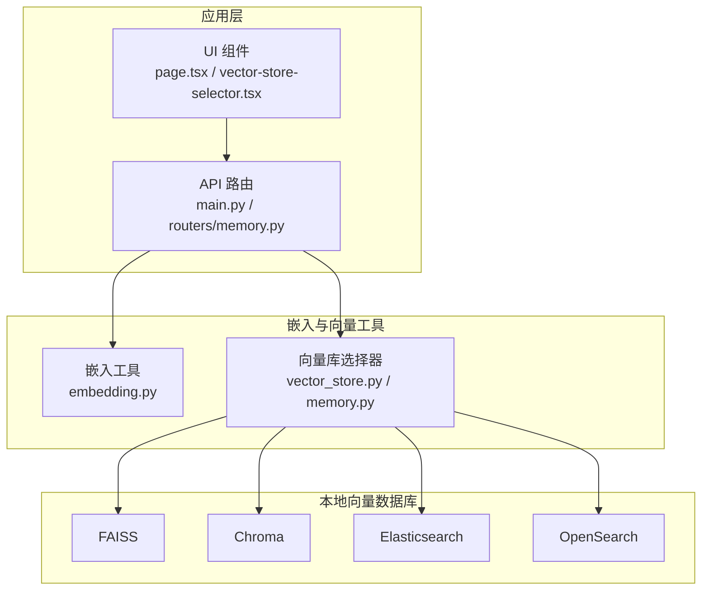
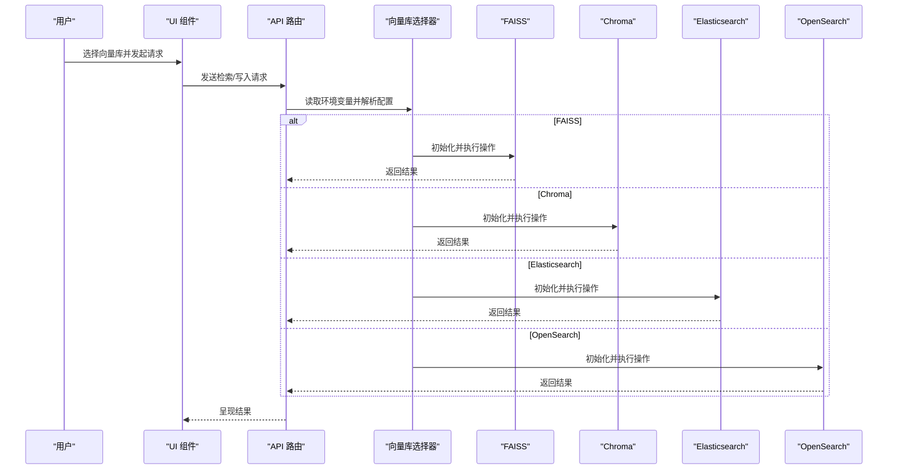
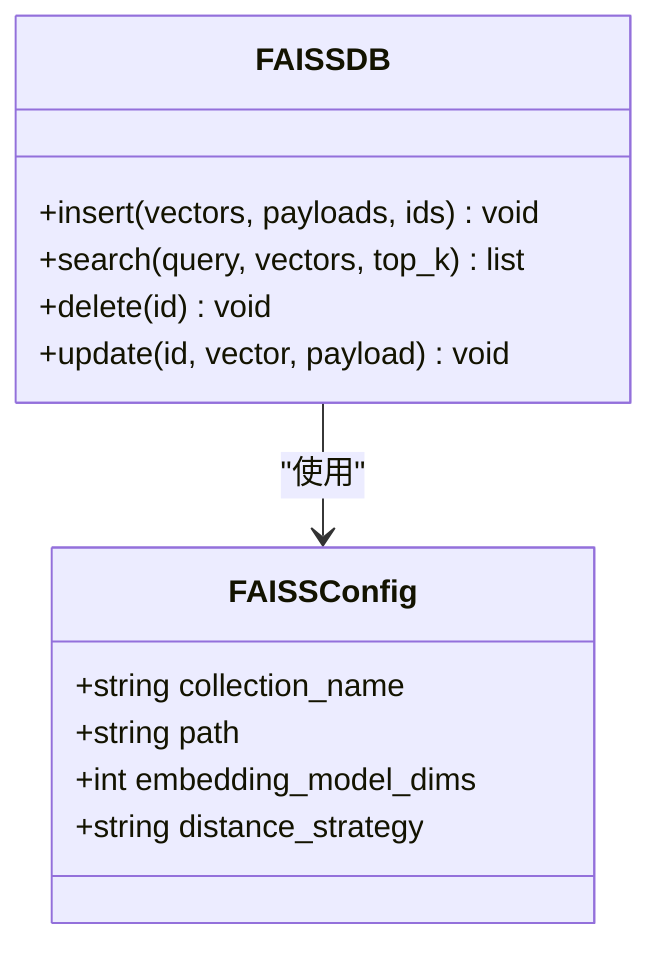
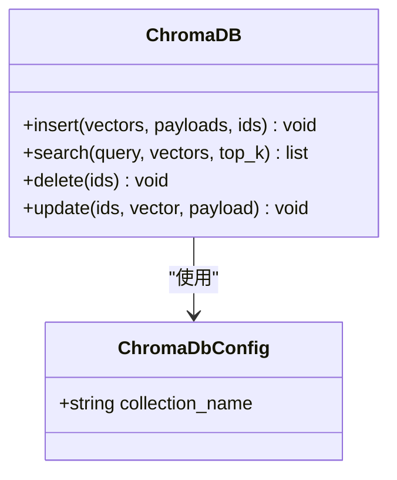
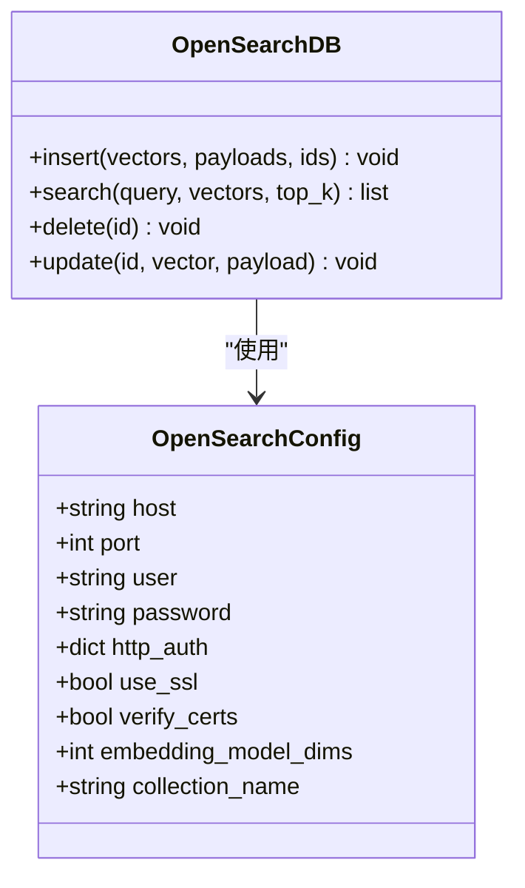
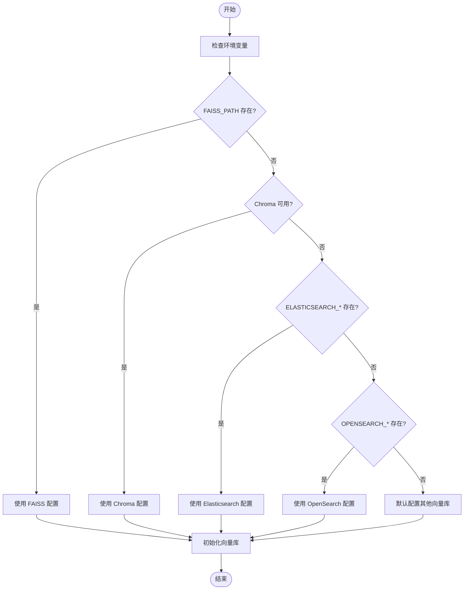
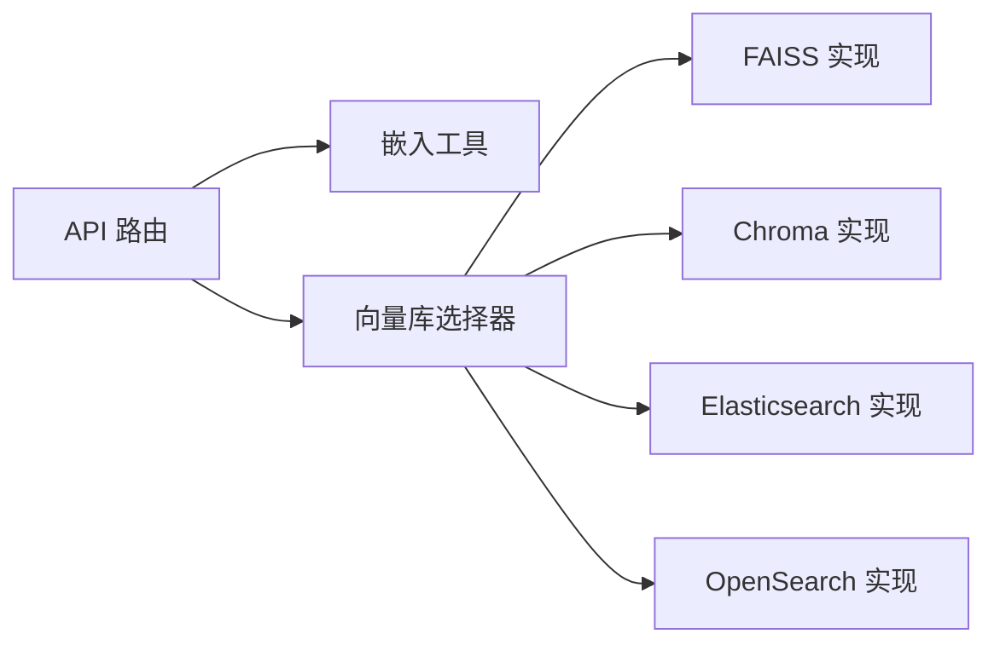

# 本地向量数据库

<cite>
**本文引用的文件**
- [openmemory/api/app/utils/memory.py](file://openmemory/api/app/utils/memory.py)
- [mem0/vector_stores/faiss.py](file://mem0/vector_stores/faiss.py)
- [mem0/vector_stores/chroma.py](file://mem0/vector_stores/chroma.py)
- [mem0/vector_stores/elasticsearch.py](file://mem0/vector_stores/elasticsearch.py)
- [mem0/vector_stores/opensearch.py](file://mem0/vector_stores/opensearch.py)
- [mem0/configs/vector_stores/faiss.py](file://mem0/configs/vector_stores/faiss.py)
- [mem0/configs/vector_stores/chroma.py](file://mem0/configs/vector_stores/chroma.py)
- [mem0/configs/vector_stores/elasticsearch.py](file://mem0/configs/vector_stores/elasticsearch.py)
- [mem0/configs/vector_stores/opensearch.py](file://mem0/configs/vector_stores/opensearch.py)
- [openmemory/compose/faiss.yml](file://openmemory/compose/faiss.yml)
- [openmemory/compose/chroma.yml](file://openmemory/compose/chroma.yml)
- [openmemory/compose/elasticsearch.yml](file://openmemory/compose/elasticsearch.yml)
- [openmemory/compose/opensearch.yml](file://openmemory/compose/opensearch.yml)
- [openmemory/ui/app/page.tsx](file://openmemory/ui/app/page.tsx)
- [openmemory/ui/components/vector-store-selector.tsx](file://openmemory/ui/components/vector-store-selector.tsx)
- [openmemory/backup-scripts/export_openmemory.sh](file://openmemory/backup-scripts/export_openmemory.sh)
- [openmemory/api/main.py](file://openmemory/api/main.py)
- [openmemory/api/app/routers/memory.py](file://openmemory/api/app/routers/memory.py)
- [openmemory/api/app/utils/embedding.py](file://openmemory/api/app/utils/embedding.py)
- [openmemory/api/app/utils/vector_store.py](file://openmemory/api/app/utils/vector_store.py)
</cite>

## 目录
1. [引言](#引言)
2. [项目结构](#项目结构)
3. [核心组件](#核心组件)
4. [架构总览](#架构总览)
5. [详细组件分析](#详细组件分析)
6. [依赖关系分析](#依赖关系分析)
7. [性能考虑](#性能考虑)
8. [故障排除指南](#故障排除指南)
9. [结论](#结论)
10. [附录](#附录)

## 引言
本文件面向需要在本地部署与使用向量数据库的工程师与运维人员，系统梳理 FAISS、Chroma、Elasticsearch、OpenSearch 四类本地向量数据库的安装、配置、运行与性能调优方法，并结合仓库中的实际实现与编排脚本，给出可操作的部署指南、配置示例、备份恢复策略、集群与监控告警最佳实践。同时总结本地部署的优势、局限性与适用场景，帮助读者在不同业务需求下做出合理选型。

## 项目结构
本仓库包含以下与本地向量数据库密切相关的模块与资源：
- 向量存储实现：mem0/vector_stores 下的 faiss.py、chroma.py、elasticsearch.py、opensearch.py
- 配置模型：mem0/configs/vector_stores 下对应实现的配置文件
- 运行时自动选择逻辑：openmemory/api/app/utils/memory.py 中的环境变量驱动的向量库自动检测
- 编排与部署：openmemory/compose 下的各服务编排文件（faiss.yml、chroma.yml、elasticsearch.yml、opensearch.yml）
- 备份脚本：openmemory/backup-scripts/export_openmemory.sh
- UI 交互：openmemory/ui 下的页面与组件，支持切换向量库
- API 层：openmemory/api 下的主程序与路由，负责嵌入与向量检索的统一入口

图表来源
- [openmemory/api/app/utils/memory.py:281-328](file://openmemory/api/app/utils/memory.py#L281-L328)
- [openmemory/api/app/utils/vector_store.py](file://openmemory/api/app/utils/vector_store.py)
- [openmemory/api/app/utils/embedding.py](file://openmemory/api/app/utils/embedding.py)
- [openmemory/api/main.py](file://openmemory/api/main.py)
- [openmemory/api/app/routers/memory.py](file://openmemory/api/app/routers/memory.py)

章节来源
- [openmemory/api/app/utils/memory.py:281-328](file://openmemory/api/app/utils/memory.py#L281-L328)
- [openmemory/compose/faiss.yml](file://openmemory/compose/faiss.yml)
- [openmemory/compose/chroma.yml](file://openmemory/compose/chroma.yml)
- [openmemory/compose/elasticsearch.yml](file://openmemory/compose/elasticsearch.yml)
- [openmemory/compose/opensearch.yml](file://openmemory/compose/opensearch.yml)

## 核心组件
- 向量存储实现与配置
  - FAISS：基于文件系统的本地索引，适合单机、低延迟检索场景；通过路径参数与维度配置进行初始化。
  - Chroma：独立的向量数据库客户端，支持集合管理与查询；通过集合名与客户端连接参数进行初始化。
  - Elasticsearch：通过 OpenSearch 客户端封装实现，支持认证、SSL、证书校验等安全选项；通过主机、端口、凭据与嵌入维度配置初始化。
  - OpenSearch：与 Elasticsearch 类似，但使用专用客户端；支持认证、SSL、连接池大小等参数。
- 自动选择与运行时配置
  - 应用层根据环境变量自动选择向量库，并注入相应的配置字典，便于在不同环境中快速切换。
- 编排与部署
  - 提供 Docker Compose 文件，分别启动 FAISS、Chroma、Elasticsearch、OpenSearch 的本地实例，便于一键部署与测试。
- 备份与恢复
  - 提供导出脚本，用于备份 OpenMemory 数据，确保在迁移或灾难恢复时的数据完整性。
- UI 与 API
  - UI 支持选择不同的向量库；API 层统一处理嵌入生成与向量检索请求。

章节来源
- [mem0/vector_stores/faiss.py](file://mem0/vector_stores/faiss.py)
- [mem0/vector_stores/chroma.py](file://mem0/vector_stores/chroma.py)
- [mem0/vector_stores/elasticsearch.py](file://mem0/vector_stores/elasticsearch.py)
- [mem0/vector_stores/opensearch.py](file://mem0/vector_stores/opensearch.py)
- [mem0/configs/vector_stores/faiss.py](file://mem0/configs/vector_stores/faiss.py)
- [mem0/configs/vector_stores/chroma.py](file://mem0/configs/vector_stores/chroma.py)
- [mem0/configs/vector_stores/elasticsearch.py](file://mem0/configs/vector_stores/elasticsearch.py)
- [mem0/configs/vector_stores/opensearch.py](file://mem0/configs/vector_stores/opensearch.py)
- [openmemory/backup-scripts/export_openmemory.sh](file://openmemory/backup-scripts/export_openmemory.sh)

## 架构总览
下图展示了从 UI 到 API，再到向量库的完整调用链路，以及运行时如何依据环境变量自动选择向量库：

图表来源
- [openmemory/api/app/utils/memory.py:281-328](file://openmemory/api/app/utils/memory.py#L281-L328)
- [openmemory/api/app/utils/vector_store.py](file://openmemory/api/app/utils/vector_store.py)
- [openmemory/api/app/utils/embedding.py](file://openmemory/api/app/utils/embedding.py)
- [openmemory/api/main.py](file://openmemory/api/main.py)
- [openmemory/api/app/routers/memory.py](file://openmemory/api/app/routers/memory.py)

## 详细组件分析

### FAISS 组件分析
- 实现要点
  - 使用文件系统持久化索引，通过路径参数指定索引文件位置。
  - 需要显式设置嵌入维度与距离策略（如余弦）以匹配嵌入模型输出。
  - 在插入与查询前通常需要构建/加载索引，保证数据一致性。
- 配置关键项
  - collection_name：集合标识
  - path：索引文件路径
  - embedding_model_dims：嵌入维度
  - distance_strategy：距离度量（如 cosine）
- 适用场景
  - 单机、低延迟、高吞吐的本地检索
  - 对检索精度敏感且嵌入维度适中的场景
- 性能建议
  - 合理设置索引类型（如 IVF/PQ）与参数，平衡内存与查询速度
  - 批量写入时合并提交，减少磁盘 IO
  - 定期备份索引文件，避免单点故障

图表来源
- [mem0/vector_stores/faiss.py](file://mem0/vector_stores/faiss.py)
- [mem0/configs/vector_stores/faiss.py](file://mem0/configs/vector_stores/faiss.py)

章节来源
- [mem0/vector_stores/faiss.py](file://mem0/vector_stores/faiss.py)
- [mem0/configs/vector_stores/faiss.py](file://mem0/configs/vector_stores/faiss.py)

### Chroma 组件分析
- 实现要点
  - 基于 chromadb.Client 的集合管理与查询接口
  - 支持添加/查询/更新/删除操作，元数据以字典形式存储
- 配置关键项
  - collection_name：集合名称
  - 其他客户端连接参数（如服务器地址、认证等，视具体部署而定）
- 适用场景
  - 快速原型、开发测试、小规模生产
  - 需要简单易用、无需复杂运维的场景
- 性能建议
  - 控制批量大小，避免单次请求过大
  - 合理设置集合数量与命名规范，降低管理成本

图表来源
- [mem0/vector_stores/chroma.py](file://mem0/vector_stores/chroma.py)
- [mem0/configs/vector_stores/chroma.py](file://mem0/configs/vector_stores/chroma.py)

章节来源
- [mem0/vector_stores/chroma.py](file://mem0/vector_stores/chroma.py)
- [mem0/configs/vector_stores/chroma.py](file://mem0/configs/vector_stores/chroma.py)

### Elasticsearch 组件分析
- 实现要点
  - 通过 OpenSearch 客户端封装，支持认证、SSL、证书校验等安全选项
  - 使用自定义字段存储向量与元数据，查询时按自定义 id 匹配文档
- 配置关键项
  - host/port：服务地址与端口
  - user/password 或 http_auth：认证方式
  - use_ssl/verify_certs：SSL 与证书校验
  - embedding_model_dims：嵌入维度
- 适用场景
  - 已有 Elasticsearch 生态的企业环境
  - 需要与日志/指标系统集成的场景
- 性能建议
  - 合理设置连接池大小与超时时间
  - 为向量字段与元数据字段建立合适的映射与索引策略

图表来源
- [mem0/vector_stores/opensearch.py](file://mem0/vector_stores/opensearch.py)
- [mem0/configs/vector_stores/opensearch.py](file://mem0/configs/vector_stores/opensearch.py)

章节来源
- [mem0/vector_stores/elasticsearch.py](file://mem0/vector_stores/elasticsearch.py)
- [mem0/vector_stores/opensearch.py](file://mem0/vector_stores/opensearch.py)
- [mem0/configs/vector_stores/elasticsearch.py](file://mem0/configs/vector_stores/elasticsearch.py)
- [mem0/configs/vector_stores/opensearch.py](file://mem0/configs/vector_stores/opensearch.py)

### OpenSearch 组件分析
- 实现要点
  - 与 Elasticsearch 类似，但使用专用客户端；支持认证、SSL、连接池大小等参数
  - 查询与更新均基于文档 id，先按自定义 id 搜索再定位内部文档 id
- 配置关键项
  - host/port：服务地址与端口
  - user/password 或 http_auth：认证方式
  - use_ssl/verify_certs：SSL 与证书校验
  - embedding_model_dims：嵌入维度
- 适用场景
  - 企业级搜索与检索场景，强调安全与合规
  - 需要与现有 OpenSearch 生态集成的组织
- 性能建议
  - 合理设置连接池大小与并发请求上限
  - 为常用查询字段建立索引，优化检索性能

图表来源
- [mem0/vector_stores/opensearch.py](file://mem0/vector_stores/opensearch.py)
- [mem0/configs/vector_stores/opensearch.py](file://mem0/configs/vector_stores/opensearch.py)

章节来源
- [mem0/vector_stores/opensearch.py](file://mem0/vector_stores/opensearch.py)
- [mem0/configs/vector_stores/opensearch.py](file://mem0/configs/vector_stores/opensearch.py)

### 运行时自动选择与配置流程
- 自动选择逻辑
  - 应用层根据环境变量判断优先级：FAISS > Chroma > Elasticsearch > OpenSearch > 默认（其他）
  - 将对应的配置字典注入到向量库初始化流程中
- 配置注入
  - FAISS：路径、集合名、维度、距离策略
  - Chroma：集合名
  - Elasticsearch/OpenSearch：主机、端口、用户、密码、SSL/证书校验、维度
- UI 与 API 的交互
  - UI 提供向量库选择界面
  - API 负责接收请求、调用嵌入模型与向量库执行操作

图表来源
- [openmemory/api/app/utils/memory.py:281-328](file://openmemory/api/app/utils/memory.py#L281-L328)

章节来源
- [openmemory/api/app/utils/memory.py:281-328](file://openmemory/api/app/utils/memory.py#L281-L328)
- [openmemory/ui/app/page.tsx](file://openmemory/ui/app/page.tsx)
- [openmemory/ui/components/vector-store-selector.tsx](file://openmemory/ui/components/vector-store-selector.tsx)

## 依赖关系分析
- 组件耦合
  - API 层依赖嵌入工具与向量库选择器，向量库选择器再依赖具体实现与配置
  - UI 层仅负责选择与展示，不直接依赖具体实现
- 外部依赖
  - FAISS：文件系统持久化
  - Chroma：chromadb 客户端
  - Elasticsearch/OpenSearch：对应 Python 客户端库
- 潜在风险
  - 不同向量库对嵌入维度与距离度量要求严格，需确保配置一致
  - 安全配置（SSL/证书/认证）必须正确，否则会导致连接失败

图表来源
- [openmemory/api/app/utils/vector_store.py](file://openmemory/api/app/utils/vector_store.py)
- [openmemory/api/app/utils/embedding.py](file://openmemory/api/app/utils/embedding.py)
- [openmemory/api/app/utils/memory.py:281-328](file://openmemory/api/app/utils/memory.py#L281-L328)

章节来源
- [openmemory/api/app/utils/vector_store.py](file://openmemory/api/app/utils/vector_store.py)
- [openmemory/api/app/utils/embedding.py](file://openmemory/api/app/utils/embedding.py)
- [openmemory/api/app/utils/memory.py:281-328](file://openmemory/api/app/utils/memory.py#L281-L328)

## 性能考虑
- 索引与存储
  - FAISS：合理选择索引类型与参数，控制内存占用与查询延迟；批量写入合并提交
  - Chroma：控制集合数量与命名规范，避免过多集合导致管理开销
  - Elasticsearch/OpenSearch：为向量字段与元数据字段建立合适映射；启用连接池与并发限制
- 网络与安全
  - 启用 SSL 与证书校验时，注意证书链与 CA 配置；合理设置超时与重试策略
- 监控与告警
  - 关注查询延迟、错误率、连接数、磁盘空间与 CPU/内存使用率
  - 建立基于阈值的告警与自动扩缩容策略（针对容器化部署）

## 故障排除指南
- 常见问题
  - 嵌入维度不匹配：检查 embedding_model_dims 与嵌入模型输出维度是否一致
  - 认证失败：核对 user/password 或 http_auth 配置；确认 SSL/证书设置
  - 连接超时：检查网络连通性、防火墙与代理设置；适当增大超时与重试次数
  - 权限不足：确保向量库与数据目录具备正确的读写权限
- 排查步骤
  - 通过 UI 切换向量库并复现问题，缩小范围
  - 查看 API 日志与向量库日志，定位异常阶段
  - 校验环境变量与配置文件，确保与实际部署一致
- 备份与恢复
  - 使用备份脚本定期导出数据，验证导入流程
  - 在迁移或升级前，先进行离线备份，再逐步替换

章节来源
- [openmemory/backup-scripts/export_openmemory.sh](file://openmemory/backup-scripts/export_openmemory.sh)
- [mem0/vector_stores/opensearch.py:280-308](file://mem0/vector_stores/opensearch.py#L280-L308)

## 结论
本仓库提供了 FAISS、Chroma、Elasticsearch、OpenSearch 四类本地向量数据库的完整实现与运行时自动选择机制，并配套了编排、备份与 UI 交互能力。通过合理的配置与性能调优，可在不同业务场景下获得稳定可靠的向量检索能力。建议在生产环境中结合监控告警与备份策略，确保系统的高可用与可维护性。

## 附录

### 部署指南（基于 Compose）
- FAISS
  - 使用 openmemory/compose/faiss.yml 启动 FAISS 本地实例，设置 FAISS_PATH 指向索引文件路径
- Chroma
  - 使用 openmemory/compose/chroma.yml 启动 Chroma 本地实例，通过 collection_name 管理集合
- Elasticsearch
  - 使用 openmemory/compose/elasticsearch.yml 启动 Elasticsearch 本地实例，配置 ELASTICSEARCH_HOST/PORT/USER/PASSWORD 等环境变量
- OpenSearch
  - 使用 openmemory/compose/opensearch.yml 启动 OpenSearch 本地实例，配置 OPENSEARCH_HOST/PORT 等环境变量

章节来源
- [openmemory/compose/faiss.yml](file://openmemory/compose/faiss.yml)
- [openmemory/compose/chroma.yml](file://openmemory/compose/chroma.yml)
- [openmemory/compose/elasticsearch.yml](file://openmemory/compose/elasticsearch.yml)
- [openmemory/compose/opensearch.yml](file://openmemory/compose/opensearch.yml)

### 配置示例（环境变量与关键参数）
- FAISS
  - FAISS_PATH：索引文件路径
  - collection_name：集合名
  - embedding_model_dims：嵌入维度
  - distance_strategy：距离度量（如 cosine）
- Chroma
  - collection_name：集合名
- Elasticsearch
  - ELASTICSEARCH_HOST/ELASTICSEARCH_PORT：主机与端口
  - ELASTICSEARCH_USER/ELASTICSEARCH_PASSWORD：用户名与密码
  - verify_certs/use_ssl：证书校验与 SSL 开关
  - embedding_model_dims：嵌入维度
- OpenSearch
  - OPENSEARCH_HOST/OPENSEARCH_PORT：主机与端口
  - user/password 或 http_auth：认证方式
  - use_ssl/verify_certs：SSL 与证书校验
  - embedding_model_dims：嵌入维度

章节来源
- [openmemory/api/app/utils/memory.py:281-328](file://openmemory/api/app/utils/memory.py#L281-L328)
- [mem0/configs/vector_stores/faiss.py](file://mem0/configs/vector_stores/faiss.py)
- [mem0/configs/vector_stores/chroma.py](file://mem0/configs/vector_stores/chroma.py)
- [mem0/configs/vector_stores/elasticsearch.py](file://mem0/configs/vector_stores/elasticsearch.py)
- [mem0/configs/vector_stores/opensearch.py](file://mem0/configs/vector_stores/opensearch.py)

### 数据备份与恢复
- 备份
  - 使用 openmemory/backup-scripts/export_openmemory.sh 导出数据，定期执行并验证导出文件完整性
- 恢复
  - 在目标环境执行导入流程，确保向量库版本与配置一致后再进行数据恢复

章节来源
- [openmemory/backup-scripts/export_openmemory.sh](file://openmemory/backup-scripts/export_openmemory.sh)