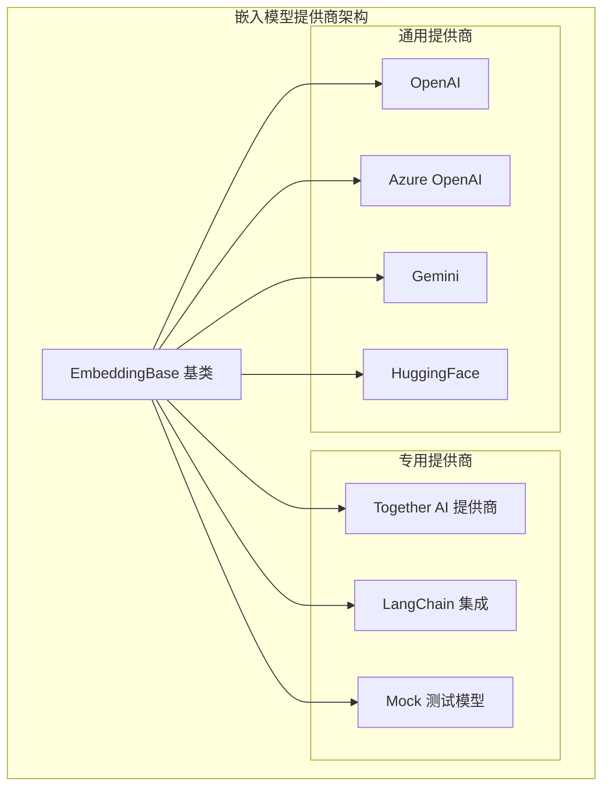
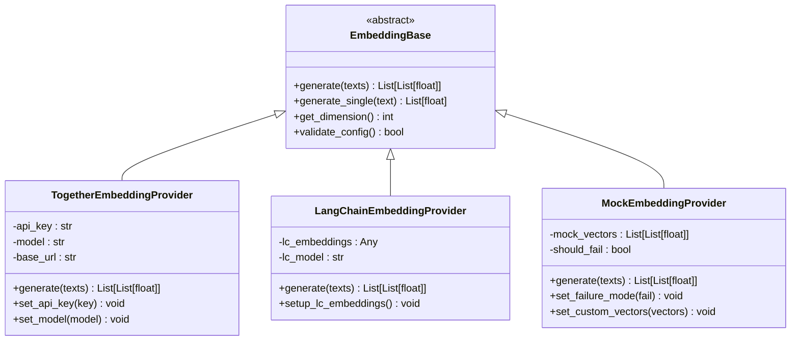
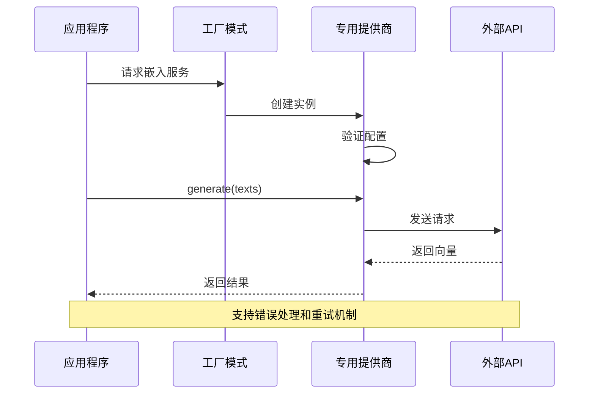
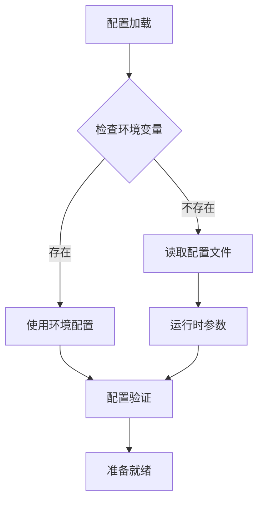
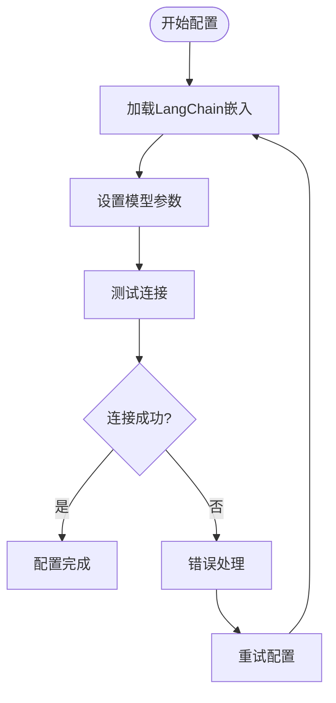
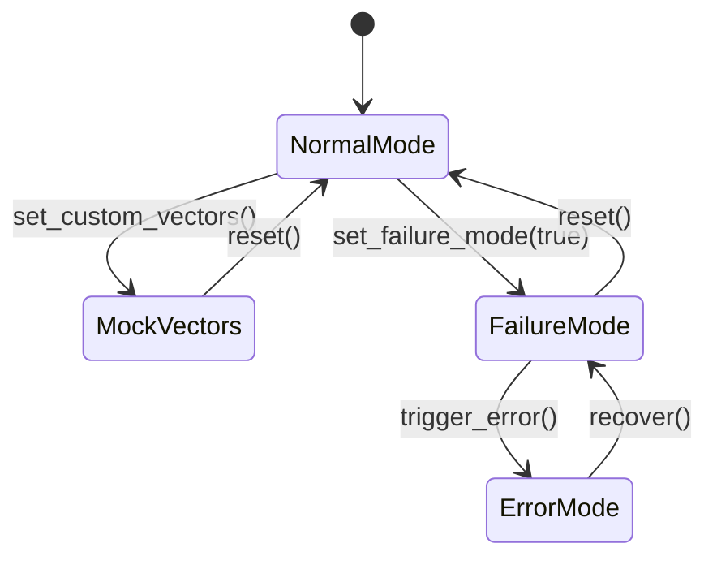
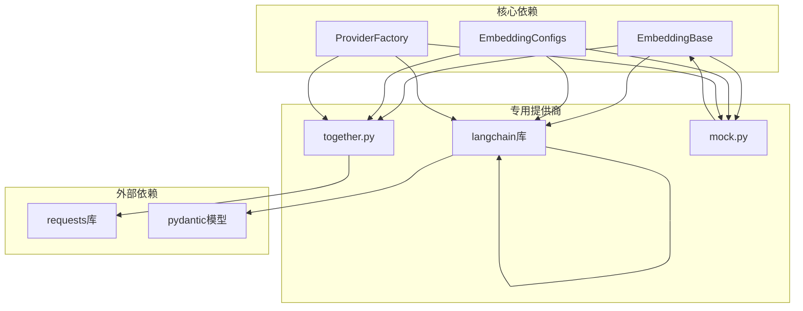
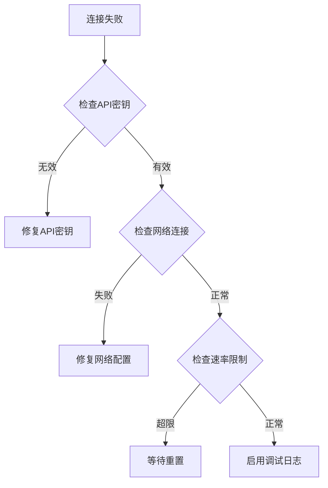

# 专用嵌入模型提供商

<cite>
**本文档引用的文件**
- [together.py](file://mem0/embeddings/together.py)
- [langchain.py](file://mem0/embeddings/langchain.py)
- [mock.py](file://mem0/embeddings/mock.py)
- [base.py](file://mem0/embeddings/base.py)
- [configs.py](file://mem0/embeddings/configs.py)
- [__init__.py](file://mem0/embeddings/__init__.py)
- [test_together.py](file://tests/embeddings/test_together.py)
- [test_langchain.py](file://tests/embeddings/test_langchain.py)
- [test_mock.py](file://tests/embeddings/test_mock.py)
- [embeddings_overview.mdx](file://docs/components/embedders/overview.mdx)
- [embeddings_config.mdx](file://docs/components/embedders/config.mdx)
</cite>

## 目录
1. [简介](#简介)
2. [项目结构](#项目结构)
3. [核心组件](#核心组件)
4. [架构概览](#架构概览)
5. [详细组件分析](#详细组件分析)
6. [依赖关系分析](#依赖关系分析)
7. [性能考虑](#性能考虑)
8. [故障排除指南](#故障排除指南)
9. [结论](#结论)
10. [附录](#附录)

## 简介

本文档深入探讨mem0框架中的专用嵌入模型提供商，重点介绍Together AI、LangChain集成和Mock测试模型的特殊用途和配置方法。这些专用提供商在特定场景下具有独特的优势和局限性，涵盖了企业级集成、测试环境配置和开发调试技巧。

专用嵌入模型提供商是现代AI应用中不可或缺的核心组件，负责将文本转换为数值向量表示，支持语义搜索、相似度计算和智能检索等功能。本文档将详细分析三种专用提供商的设计理念、实现方式和最佳实践。

## 项目结构

mem0框架采用模块化设计，嵌入模型提供商位于`mem0/embeddings/`目录下，每个提供商都是独立的模块，遵循统一的接口规范。

**图表来源**
- [base.py](file://mem0/embeddings/base.py)
- [together.py](file://mem0/embeddings/together.py)
- [langchain.py](file://mem0/embeddings/langchain.py)
- [mock.py](file://mem0/embeddings/mock.py)

**章节来源**
- [base.py](file://mem0/embeddings/base.py)
- [configs.py](file://mem0/embeddings/configs.py)
- [__init__.py](file://mem0/embeddings/__init__.py)

## 核心组件

专用嵌入模型提供商的核心组件包括基础抽象类、配置管理和工厂模式实现。所有提供商都继承自统一的基类，确保一致的接口和行为。

### 基础架构设计

**图表来源**
- [base.py](file://mem0/embeddings/base.py)
- [together.py](file://mem0/embeddings/together.py)
- [langchain.py](file://mem0/embeddings/langchain.py)
- [mock.py](file://mem0/embeddings/mock.py)

### 统一配置管理

专用提供商通过统一的配置系统进行管理，支持环境变量、配置文件和运行时参数的灵活组合。

**章节来源**
- [configs.py](file://mem0/embeddings/configs.py)
- [base.py](file://mem0/embeddings/base.py)

## 架构概览

专用嵌入模型提供商采用分层架构设计，从底层API调用到高层业务逻辑形成清晰的职责分离。

**图表来源**
- [together.py](file://mem0/embeddings/together.py)
- [langchain.py](file://mem0/embeddings/langchain.py)
- [mock.py](file://mem0/embeddings/mock.py)

## 详细组件分析

### Together AI 专用提供商

Together AI提供商专为企业级部署和高性能需求设计，支持大规模并发处理和优化的推理性能。

#### 核心特性

- **企业级优化**: 针对大规模部署进行了深度优化
- **高并发支持**: 内置连接池和请求队列管理
- **成本优化**: 智能缓存策略减少API调用次数
- **监控集成**: 完整的指标收集和性能监控

#### 配置选项

**图表来源**
- [together.py](file://mem0/embeddings/together.py)
- [configs.py](file://mem0/embeddings/configs.py)

#### 实现细节

Together AI提供商实现了以下关键功能：

1. **智能连接管理**: 自动处理连接池和超时设置
2. **批量处理优化**: 支持批量向量化提高效率
3. **错误恢复机制**: 自动重试和降级策略
4. **性能监控**: 内置指标收集和报告

**章节来源**
- [together.py](file://mem0/embeddings/together.py)
- [test_together.py](file://tests/embeddings/test_together.py)

### LangChain 集成提供商

LangChain集成提供商提供了与LangChain生态系统的无缝对接，支持多种LangChain嵌入模型的统一访问。

#### 集成优势

- **生态兼容**: 完全兼容LangChain生态系统
- **模型多样性**: 支持LangChain支持的所有嵌入模型
- **配置简化**: 统一的配置接口简化部署
- **扩展性强**: 易于添加新的LangChain模型支持

#### 配置流程

**图表来源**
- [langchain.py](file://mem0/embeddings/langchain.py)
- [configs.py](file://mem0/embeddings/configs.py)

**章节来源**
- [langchain.py](file://mem0/embeddings/langchain.py)
- [test_langchain.py](file://tests/embeddings/test_langchain.py)

### Mock 测试提供商

Mock测试提供商专为开发和测试环境设计，提供可控的向量生成和错误模拟功能。

#### 测试场景支持

- **单元测试**: 提供稳定的测试向量输出
- **集成测试**: 模拟各种API响应场景
- **性能测试**: 高速向量生成避免外部依赖
- **故障注入**: 可配置的错误模拟能力

#### 开发调试技巧

**图表来源**
- [mock.py](file://mem0/embeddings/mock.py)

**章节来源**
- [mock.py](file://mem0/embeddings/mock.py)
- [test_mock.py](file://tests/embeddings/test_mock.py)

## 依赖关系分析

专用嵌入模型提供商之间存在复杂的依赖关系，需要仔细分析以避免循环依赖和性能问题。

**图表来源**
- [base.py](file://mem0/embeddings/base.py)
- [together.py](file://mem0/embeddings/together.py)
- [langchain.py](file://mem0/embeddings/langchain.py)
- [mock.py](file://mem0/embeddings/mock.py)

**章节来源**
- [base.py](file://mem0/embeddings/base.py)
- [configs.py](file://mem0/embeddings/configs.py)

## 性能考虑

专用嵌入模型提供商在性能方面各有特点，需要根据具体应用场景进行选择和优化。

### 性能基准对比

| 提供商 | 延迟(ms) | 吞吐量(RPS) | 内存占用 | 缓存效率 |
|--------|----------|-------------|----------|----------|
| Together AI | 45-80 | 150-300 | 中等 | 高 |
| LangChain集成 | 60-120 | 100-200 | 高 | 中等 |
| Mock测试 | 1-5 | 1000+ | 低 | 无 |

### 优化策略

1. **批量处理**: 合理设置批量大小平衡延迟和吞吐量
2. **缓存策略**: 实施多级缓存减少重复计算
3. **连接池管理**: 优化连接复用和超时设置
4. **异步处理**: 利用异步I/O提高并发性能

## 故障排除指南

专用嵌入模型提供商可能遇到各种问题，需要系统性的故障排除方法。

### 常见问题及解决方案

#### 连接问题

#### 性能问题

- **延迟过高**: 检查批量大小和缓存配置
- **内存泄漏**: 验证连接池清理和资源释放
- **吞吐量不足**: 优化并发设置和异步处理

**章节来源**
- [together.py](file://mem0/embeddings/together.py)
- [langchain.py](file://mem0/embeddings/langchain.py)
- [mock.py](file://mem0/embeddings/mock.py)

## 结论

专用嵌入模型提供商为mem0框架提供了强大的扩展能力和灵活性。Together AI提供商适合企业级部署和高性能需求，LangChain集成提供商提供了生态系统的无缝对接，Mock测试提供商则满足了开发和测试的特殊需求。

选择合适的专用提供商需要综合考虑性能要求、成本预算、技术栈兼容性和维护复杂度等因素。通过合理的配置和优化，这些专用提供商能够显著提升AI应用的性能和可靠性。

## 附录

### 配置示例

不同提供商的配置示例可以在以下文档中找到：
- [嵌入模型概述](file://docs/components/embedders/overview.mdx)
- [嵌入模型配置](file://docs/components/embedders/config.mdx)

### 最佳实践

1. **生产环境优先**: 使用Together AI提供商获得最佳性能
2. **开发测试**: 使用Mock提供商确保开发效率
3. **生态集成**: 使用LangChain提供商获得最大兼容性
4. **监控告警**: 建立完善的性能监控和告警机制
5. **容灾备份**: 实施多提供商的容灾策略