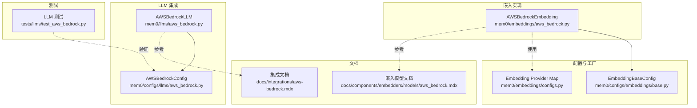
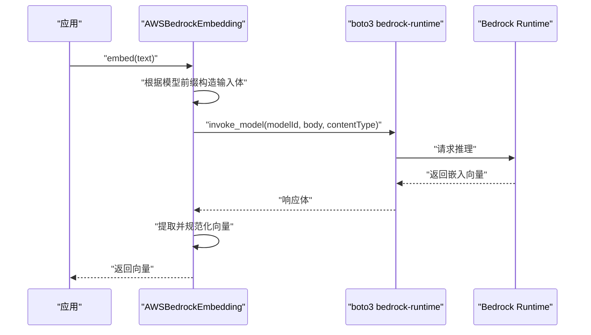
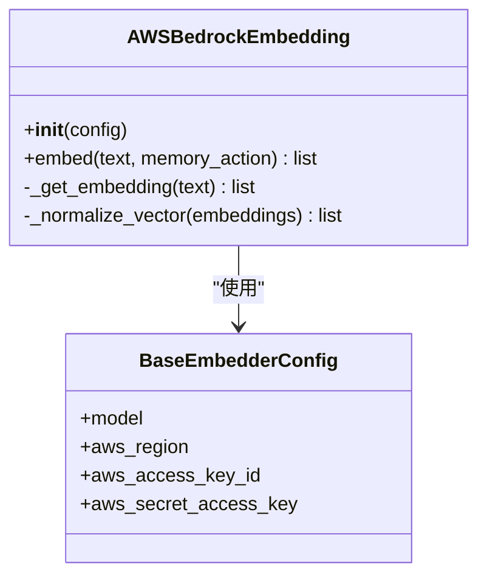
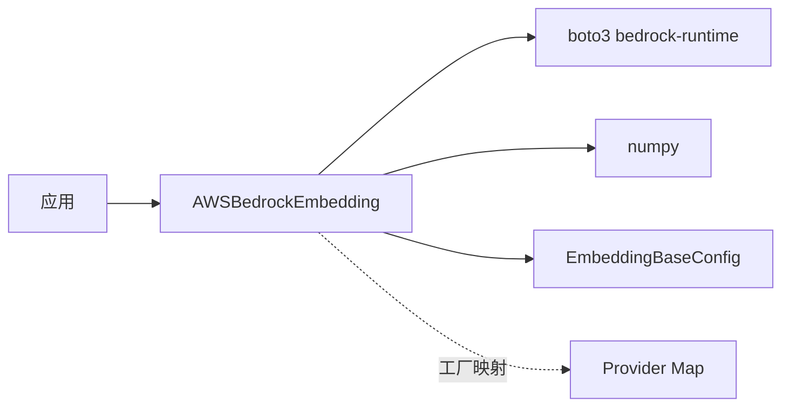

# AWS Bedrock 嵌入模型

<cite>
**本文引用的文件**
- [aws_bedrock.py](file://mem0/embeddings/aws_bedrock.py)
- [aws_bedrock.mdx](file://docs/components/embedders/models/aws_bedrock.mdx)
- [aws_bedrock.mdx](file://docs/integrations/aws-bedrock.mdx)
- [aws_bedrock.py](file://mem0/configs/llms/aws_bedrock.py)
- [aws_bedrock.py](file://mem0/llms/aws_bedrock.py)
- [base.py](file://mem0/configs/embeddings/base.py)
- [configs.py](file://mem0/embeddings/configs.py)
- [test_aws_bedrock.py](file://tests/llms/test_aws_bedrock.py)
</cite>

## 目录
1. [简介](#简介)
2. [项目结构](#项目结构)
3. [核心组件](#核心组件)
4. [架构总览](#架构总览)
5. [详细组件分析](#详细组件分析)
6. [依赖关系分析](#依赖关系分析)
7. [性能考虑](#性能考虑)
8. [故障排除指南](#故障排除指南)
9. [结论](#结论)
10. [附录](#附录)

## 简介
本指南面向在 Mem0 中使用 AWS Bedrock 嵌入模型的开发者与运维人员，系统讲解如何配置与使用 Bedrock 嵌入能力，覆盖 AWS 凭证配置、IAM 权限与区域选择，并说明与其他 AWS 服务（如向量数据库）的集成方式。文档同时提供成本优化、性能调优与常见问题排查建议，帮助您在生产环境中稳定高效地使用 Bedrock 嵌入。

## 项目结构
围绕 AWS Bedrock 嵌入的相关代码与文档主要分布在以下位置：
- 实现层：mem0/embeddings/aws_bedrock.py 提供嵌入调用逻辑
- 文档层：docs/components/embedders/models/aws_bedrock.mdx 与 docs/integrations/aws-bedrock.mdx 提供使用说明与集成指引
- 配置层：mem0/configs/embeddings/base.py、mem0/embeddings/configs.py 定义通用嵌入配置与工厂映射
- LLM 集成：mem0/configs/llms/aws_bedrock.py 与 mem0/llms/aws_bedrock.py 支持 Bedrock LLM 能力（便于统一 AWS 配置）
- 测试：tests/llms/test_aws_bedrock.py 提供行为验证

图表来源
- [aws_bedrock.py:15-100](file://mem0/embeddings/aws_bedrock.py#L15-L100)
- [base.py:38-105](file://mem0/configs/embeddings/base.py#L38-L105)
- [configs.py](file://mem0/embeddings/configs.py#L25)
- [aws_bedrock.mdx:1-63](file://docs/components/embedders/models/aws_bedrock.mdx#L1-L63)
- [aws_bedrock.mdx](file://docs/integrations/aws-bedrock.mdx)
- [aws_bedrock.py:6-146](file://mem0/configs/llms/aws_bedrock.py#L6-L146)
- [aws_bedrock.py:33-37](file://mem0/llms/aws_bedrock.py#L33-L37)
- [test_aws_bedrock.py](file://tests/llms/test_aws_bedrock.py)

章节来源
- [aws_bedrock.py:1-100](file://mem0/embeddings/aws_bedrock.py#L1-L100)
- [aws_bedrock.mdx:1-63](file://docs/components/embedders/models/aws_bedrock.mdx#L1-L63)
- [aws_bedrock.mdx](file://docs/integrations/aws-bedrock.mdx)

## 核心组件
- AWSBedrockEmbedding：封装 boto3 客户端，负责调用 Bedrock Runtime 的 invoke_model 接口，按不同供应商格式化输入并解析输出，返回标准化的向量。
- 配置基类与映射：EmbeddingBaseConfig 与嵌入提供者映射确保在配置中以 provider: "aws_bedrock" 的形式启用该实现。
- LLM 集成：AWSBedrockConfig 与 AWSBedrockLLM 提供 Bedrock LLM 能力，便于在同一 AWS 区域与凭证下复用配置。

章节来源
- [aws_bedrock.py:15-100](file://mem0/embeddings/aws_bedrock.py#L15-L100)
- [base.py:38-105](file://mem0/configs/embeddings/base.py#L38-L105)
- [configs.py](file://mem0/embeddings/configs.py#L25)
- [aws_bedrock.py:6-146](file://mem0/configs/llms/aws_bedrock.py#L6-L146)
- [aws_bedrock.py:33-37](file://mem0/llms/aws_bedrock.py#L33-L37)

## 架构总览
下图展示从应用到 Bedrock Runtime 的调用链路，以及环境变量与配置对客户端初始化的影响。

图表来源
- [aws_bedrock.py:55-88](file://mem0/embeddings/aws_bedrock.py#L55-L88)

## 详细组件分析

### AWSBedrockEmbedding 组件
- 初始化与认证
  - 优先从环境变量读取 AWS_REGION、AWS_ACCESS_KEY_ID、AWS_SECRET_ACCESS_KEY、AWS_SESSION_TOKEN；若配置对象中提供了 aws_* 字段则覆盖。
  - 使用上述凭据初始化 boto3 bedrock-runtime 客户端，默认区域为 us-west-2。
- 输入格式适配
  - 模型 ID 以点号分隔，依据前缀自动区分供应商（如 cohere 与 Amazon），分别构造 input_type/texts 或 inputText 字段。
- 输出解析与归一化
  - 解析响应体提取 embeddings 或 embedding 字段，随后进行 L2 归一化处理，保证向量单位长度。
- 错误处理
  - 对 invoke_model 异常进行捕获并抛出可读错误信息，便于定位调用失败原因。

图表来源
- [aws_bedrock.py:16-100](file://mem0/embeddings/aws_bedrock.py#L16-L100)
- [base.py:38-105](file://mem0/configs/embeddings/base.py#L38-L105)

章节来源
- [aws_bedrock.py:15-100](file://mem0/embeddings/aws_bedrock.py#L15-L100)

### 配置与工厂映射
- 嵌入配置基类
  - 在嵌入配置中支持 aws_bedrock 特定字段（如 aws_region、aws_access_key_id 等），用于初始化客户端。
- 提供者映射
  - 在嵌入工厂映射中注册 "aws_bedrock"，使得在配置中指定 provider 即可启用对应实现。

章节来源
- [base.py:38-105](file://mem0/configs/embeddings/base.py#L38-L105)
- [configs.py](file://mem0/embeddings/configs.py#L25)

### LLM 集成参考
- AWSBedrockConfig 与 AWSBedrockLLM
  - 为 Bedrock LLM 提供统一配置与实现，便于在相同 AWS 凭证与区域下同时使用嵌入与生成能力。
- 测试用例
  - tests/llms/test_aws_bedrock.py 验证 LLM 行为，可作为嵌入调用稳定性与异常处理的参考。

章节来源
- [aws_bedrock.py:6-146](file://mem0/configs/llms/aws_bedrock.py#L6-L146)
- [aws_bedrock.py:33-37](file://mem0/llms/aws_bedrock.py#L33-L37)
- [test_aws_bedrock.py](file://tests/llms/test_aws_bedrock.py)

## 依赖关系分析
- 外部依赖
  - boto3：用于访问 AWS Bedrock Runtime。
  - numpy：用于向量归一化。
- 内部依赖
  - EmbeddingBaseConfig：提供统一的嵌入配置接口。
  - 嵌入工厂映射：通过 provider 关键字选择具体实现。

图表来源
- [aws_bedrock.py:1-14](file://mem0/embeddings/aws_bedrock.py#L1-L14)
- [base.py:38-105](file://mem0/configs/embeddings/base.py#L38-L105)
- [configs.py](file://mem0/embeddings/configs.py#L25)

章节来源
- [aws_bedrock.py:1-14](file://mem0/embeddings/aws_bedrock.py#L1-L14)
- [base.py:38-105](file://mem0/configs/embeddings/base.py#L38-L105)
- [configs.py](file://mem0/embeddings/configs.py#L25)

## 性能考虑
- 向量归一化
  - 嵌入结果默认进行 L2 归一化，有助于相似度计算的数值稳定性与一致性。
- 批量处理
  - 当前实现逐条文本调用 invoke_model，若需要批量嵌入，可在上层聚合多条文本后调用，减少网络往返次数。
- 模型选择
  - 不同模型在精度与延迟上存在差异，建议结合业务场景选择合适模型并进行基准测试。
- 连接复用
  - 尽量避免频繁创建 boto3 客户端实例，可在进程内复用已初始化的客户端以降低初始化开销。

## 故障排除指南
- 凭证与区域问题
  - 确认 AWS_REGION、AWS_ACCESS_KEY_ID、AWS_SECRET_ACCESS_KEY 设置正确；若配置对象中提供了 aws_* 字段，请检查是否被正确覆盖。
- 模型 ID 与输入格式
  - 确保 model 字段符合 Bedrock 规范；不同供应商前缀（如 cohere 与 Amazon）会触发不同的输入格式。
- 网络与权限
  - 确认 AWS 账户具备 Bedrock 访问权限且目标区域已开通服务；检查安全组与 VPC 配置是否允许访问 AWS 公有云端点。
- 异常处理
  - invoke_model 抛出的异常会被捕获并转换为可读错误信息，便于快速定位问题。

章节来源
- [aws_bedrock.py:27-47](file://mem0/embeddings/aws_bedrock.py#L27-L47)
- [aws_bedrock.py:55-88](file://mem0/embeddings/aws_bedrock.py#L55-L88)

## 结论
通过 AWSBedrockEmbedding 与统一的配置体系，Mem0 能够在无需额外 SDK 的情况下，基于 boto3 直接调用 Bedrock 嵌入模型。配合规范的凭证管理、区域选择与输入格式适配，可在多种 AWS 服务间实现稳定高效的嵌入能力。建议在生产环境中结合批量处理、连接复用与模型基准测试，持续优化成本与性能。

## 附录

### 快速开始与配置要点
- 凭证与区域
  - 在运行环境中设置 AWS_REGION、AWS_ACCESS_KEY_ID、AWS_SECRET_ACCESS_KEY；如需临时令牌，可设置 AWS_SESSION_TOKEN。
- 模型选择
  - 在嵌入配置中指定 model 字段，例如 amazon.titan-embed-text-v1 或 amazon.titan-embed-text-v2:0。
- 代码示例路径
  - 参考文档中的示例片段路径，了解如何在配置中启用 aws_bedrock 提供者并调用嵌入。

章节来源
- [aws_bedrock.mdx:18-63](file://docs/components/embedders/models/aws_bedrock.mdx#L18-L63)