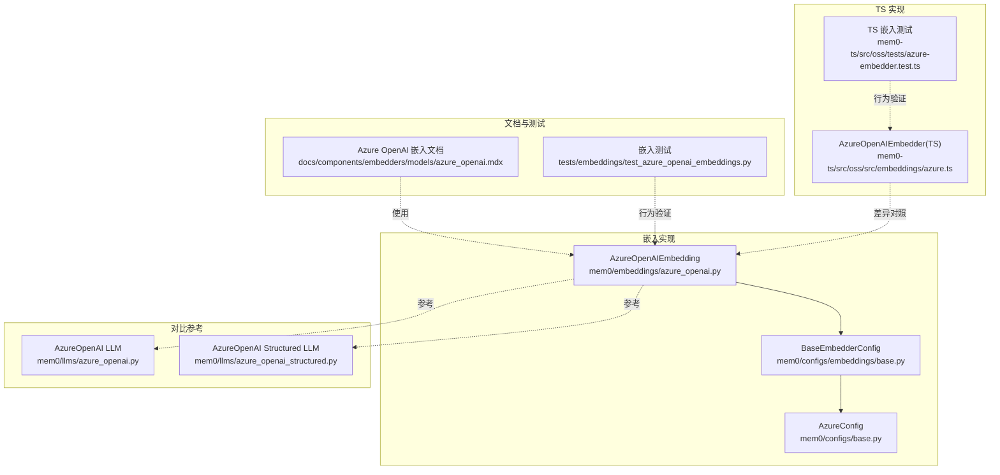
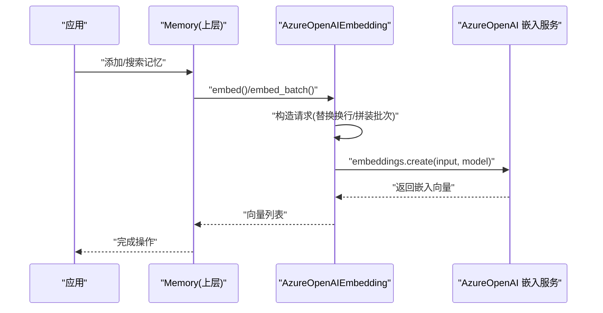
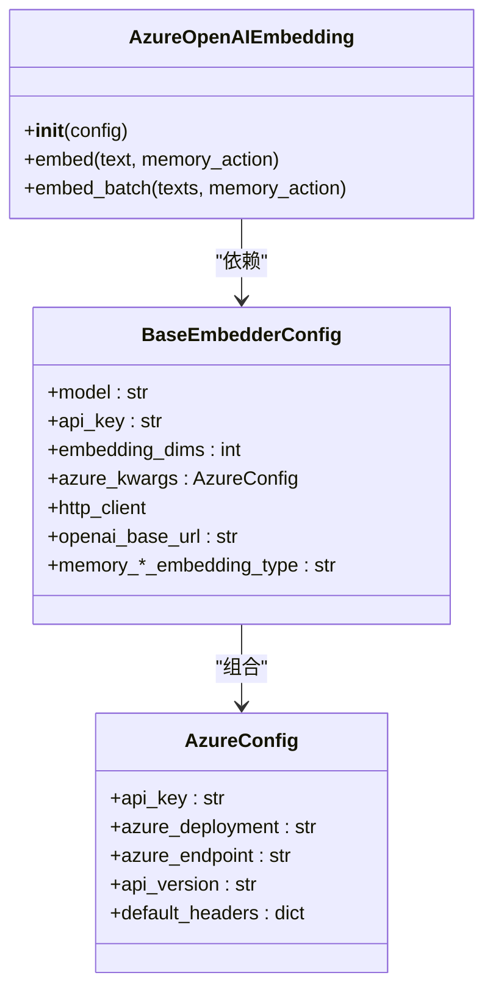
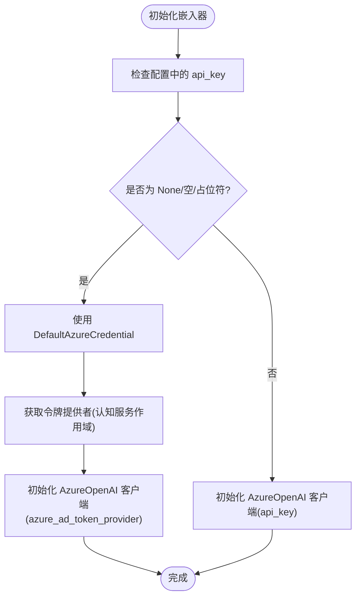
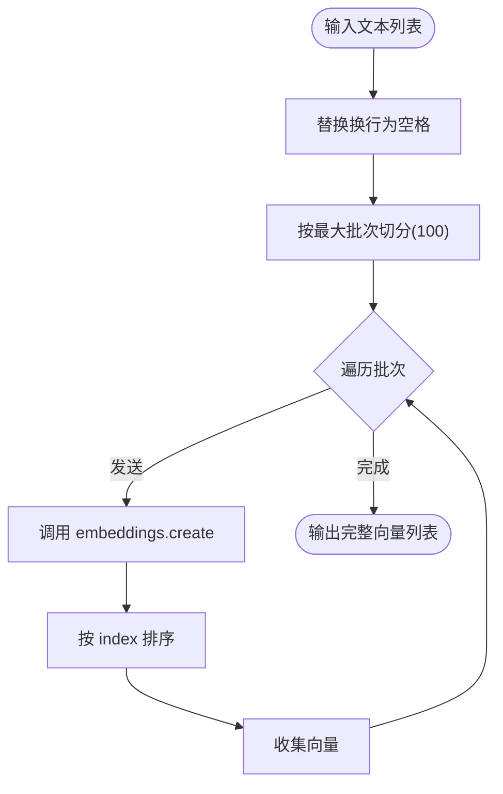
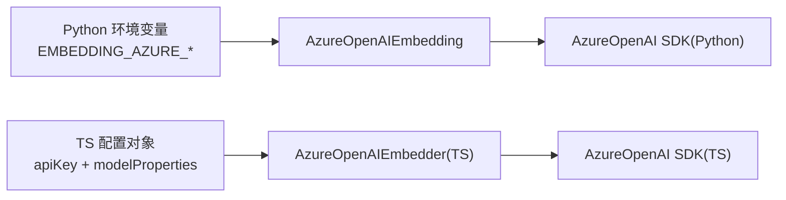

# Azure OpenAI 嵌入模型

<cite>
**本文引用的文件**
- [mem0/embeddings/azure_openai.py](file://mem0/embeddings/azure_openai.py)
- [mem0/configs/embeddings/base.py](file://mem0/configs/embeddings/base.py)
- [mem0/configs/base.py](file://mem0/configs/base.py)
- [docs/components/embedders/models/azure_openai.mdx](file://docs/components/embedders/models/azure_openai.mdx)
- [tests/embeddings/test_azure_openai_embeddings.py](file://tests/embeddings/test_azure_openai_embeddings.py)
- [mem0/llms/azure_openai.py](file://mem0/llms/azure_openai.py)
- [mem0/llms/azure_openai_structured.py](file://mem0/llms/azure_openai_structured.py)
- [mem0-ts/src/oss/src/embeddings/azure.ts](file://mem0-ts/src/oss/src/embeddings/azure.ts)
- [mem0-ts/src/oss/tests/azure-embedder.test.ts](file://mem0-ts/src/oss/tests/azure-embedder.test.ts)
</cite>

## 目录
1. [简介](#简介)
2. [项目结构](#项目结构)
3. [核心组件](#核心组件)
4. [架构总览](#架构总览)
5. [组件详解](#组件详解)
6. [依赖关系分析](#依赖关系分析)
7. [性能与成本考量](#性能与成本考量)
8. [故障排查指南](#故障排查指南)
9. [结论](#结论)
10. [附录：配置与迁移指南](#附录配置与迁移指南)

## 简介
本文件面向在企业环境中使用 Azure OpenAI 嵌入模型的工程团队，系统性梳理 Mem0 在嵌入模块中对 Azure OpenAI 的支持方式、配置要点、与标准 OpenAI API 的差异、以及从开源版本迁移到平台版本时的注意事项。内容覆盖订阅与资源组准备、API 密钥与 Azure Identity 两种认证路径、批量嵌入与请求限流、安全与合规建议、以及成本优化策略。

## 项目结构
围绕 Azure OpenAI 嵌入能力，核心代码与文档分布如下：
- Python 实现：mem0/embeddings/azure_openai.py 提供嵌入客户端封装；mem0/configs/embeddings/base.py 定义嵌入配置基类；mem0/configs/base.py 定义 AzureConfig 结构。
- 文档：docs/components/embedders/models/azure_openai.mdx 提供使用说明、参数表与示例。
- 测试：tests/embeddings/test_azure_openai_embeddings.py 覆盖初始化、环境变量、默认凭据等行为。
- 对比参考：mem0/llms/azure_openai.py、mem0/llms/azure_openai_structured.py 展示 LLM 模块中的 Azure 配置模式（便于理解一致性）。
- TypeScript 实现：mem0-ts/src/oss/src/embeddings/azure.ts 与测试用例 mem0-ts/src/oss/tests/azure-embedder.test.ts 展示 TS 版本的差异与约束。

**图表来源**
- [mem0/embeddings/azure_openai.py:1-73](file://mem0/embeddings/azure_openai.py#L1-L73)
- [mem0/configs/embeddings/base.py:1-111](file://mem0/configs/embeddings/base.py#L1-L111)
- [mem0/configs/base.py:60-82](file://mem0/configs/base.py#L60-L82)
- [docs/components/embedders/models/azure_openai.mdx:1-138](file://docs/components/embedders/models/azure_openai.mdx#L1-L138)
- [tests/embeddings/test_azure_openai_embeddings.py:1-167](file://tests/embeddings/test_azure_openai_embeddings.py#L1-L167)
- [mem0/llms/azure_openai.py:45-74](file://mem0/llms/azure_openai.py#L45-L74)
- [mem0/llms/azure_openai_structured.py:29-67](file://mem0/llms/azure_openai_structured.py#L29-L67)
- [mem0-ts/src/oss/src/embeddings/azure.ts:1-57](file://mem0-ts/src/oss/src/embeddings/azure.ts#L1-L57)
- [mem0-ts/src/oss/tests/azure-embedder.test.ts:133-163](file://mem0-ts/src/oss/tests/azure-embedder.test.ts#L133-L163)

**章节来源**
- [mem0/embeddings/azure_openai.py:1-73](file://mem0/embeddings/azure_openai.py#L1-L73)
- [mem0/configs/embeddings/base.py:1-111](file://mem0/configs/embeddings/base.py#L1-L111)
- [mem0/configs/base.py:60-82](file://mem0/configs/base.py#L60-L82)
- [docs/components/embedders/models/azure_openai.mdx:1-138](file://docs/components/embedders/models/azure_openai.mdx#L1-L138)
- [tests/embeddings/test_azure_openai_embeddings.py:1-167](file://tests/embeddings/test_azure_openai_embeddings.py#L1-L167)
- [mem0/llms/azure_openai.py:45-74](file://mem0/llms/azure_openai.py#L45-L74)
- [mem0/llms/azure_openai_structured.py:29-67](file://mem0/llms/azure_openai_structured.py#L29-L67)
- [mem0-ts/src/oss/src/embeddings/azure.ts:1-57](file://mem0-ts/src/oss/src/embeddings/azure.ts#L1-L57)
- [mem0-ts/src/oss/tests/azure-embedder.test.ts:133-163](file://mem0-ts/src/oss/tests/azure-embedder.test.ts#L133-L163)

## 核心组件
- AzureOpenAIEmbedding：封装 AzureOpenAI 客户端，支持 API Key 与 Azure Identity 两种认证方式；提供单条与批量嵌入接口；自动按最大批次限制切分。
- BaseEmbedderConfig：统一的嵌入配置入口，包含模型名、维度、代理、Azure 特定参数等字段，并将 azure_kwargs 转换为 AzureConfig。
- AzureConfig：标准化的 Azure 参数载体，包含 api_key、azure_deployment、azure_endpoint、api_version、default_headers。
- 文档与测试：提供参数表、示例与行为验证，覆盖环境变量注入、占位符处理、默认凭据链等关键场景。

**章节来源**
- [mem0/embeddings/azure_openai.py:13-73](file://mem0/embeddings/azure_openai.py#L13-L73)
- [mem0/configs/embeddings/base.py:10-111](file://mem0/configs/embeddings/base.py#L10-L111)
- [mem0/configs/base.py:60-82](file://mem0/configs/base.py#L60-L82)
- [docs/components/embedders/models/azure_openai.mdx:118-137](file://docs/components/embedders/models/azure_openai.mdx#L118-L137)
- [tests/embeddings/test_azure_openai_embeddings.py:17-31](file://tests/embeddings/test_azure_openai_embeddings.py#L17-L31)

## 架构总览
下图展示嵌入调用在内存模块中的典型流程：应用通过 Memory 接口触发添加/搜索操作，底层由嵌入器生成向量，再写入或检索向量数据库。

**图表来源**
- [mem0/embeddings/azure_openai.py:44-72](file://mem0/embeddings/azure_openai.py#L44-L72)

## 组件详解

### 类关系与职责

**图表来源**
- [mem0/configs/embeddings/base.py:10-111](file://mem0/configs/embeddings/base.py#L10-L111)
- [mem0/configs/base.py:60-82](file://mem0/configs/base.py#L60-L82)
- [mem0/embeddings/azure_openai.py:13-73](file://mem0/embeddings/azure_openai.py#L13-L73)

**章节来源**
- [mem0/configs/embeddings/base.py:10-111](file://mem0/configs/embeddings/base.py#L10-L111)
- [mem0/configs/base.py:60-82](file://mem0/configs/base.py#L60-L82)
- [mem0/embeddings/azure_openai.py:13-73](file://mem0/embeddings/azure_openai.py#L13-L73)

### 初始化与认证流程
- 优先使用显式配置中的 api_key；若为空或为占位符，则切换到 Azure Identity，默认作用域为认知服务范围。
- 支持从环境变量注入关键参数，便于 CI/CD 与容器化部署。
- 当使用 API Key 时，Azure Identity 不会参与；当未提供有效密钥时，SDK 将尝试默认凭据链。

**图表来源**
- [mem0/embeddings/azure_openai.py:17-42](file://mem0/embeddings/azure_openai.py#L17-L42)
- [tests/embeddings/test_azure_openai_embeddings.py:72-95](file://tests/embeddings/test_azure_openai_embeddings.py#L72-L95)
- [tests/embeddings/test_azure_openai_embeddings.py:117-140](file://tests/embeddings/test_azure_openai_embeddings.py#L117-L140)
- [tests/embeddings/test_azure_openai_embeddings.py:143-166](file://tests/embeddings/test_azure_openai_embeddings.py#L143-L166)

**章节来源**
- [mem0/embeddings/azure_openai.py:17-42](file://mem0/embeddings/azure_openai.py#L17-L42)
- [tests/embeddings/test_azure_openai_embeddings.py:72-95](file://tests/embeddings/test_azure_openai_embeddings.py#L72-L95)
- [tests/embeddings/test_azure_openai_embeddings.py:98-114](file://tests/embeddings/test_azure_openai_embeddings.py#L98-L114)
- [tests/embeddings/test_azure_openai_embeddings.py:117-140](file://tests/embeddings/test_azure_openai_embeddings.py#L117-L140)
- [tests/embeddings/test_azure_openai_embeddings.py:143-166](file://tests/embeddings/test_azure_openai_embeddings.py#L143-L166)

### 批量嵌入与排序
- 自动按最大批次上限切分输入文本，避免超出 API 限制。
- 返回结果按原始索引排序，保证输出顺序与输入一致。

**图表来源**
- [mem0/embeddings/azure_openai.py:57-72](file://mem0/embeddings/azure_openai.py#L57-L72)

**章节来源**
- [mem0/embeddings/azure_openai.py:57-72](file://mem0/embeddings/azure_openai.py#L57-L72)

### 与标准 OpenAI API 的差异
- 认证方式：AzureOpenAIEmbedding 支持 API Key 与 Azure Identity；标准 OpenAI 仅使用 API Key。
- 请求目标：AzureOpenAIEmbedding 通过 AzureOpenAI SDK 发送请求；标准 OpenAI 通过 openai 库。
- 参数命名：Azure 模块强调 azure_deployment、azure_endpoint、api_version；标准 OpenAI 更关注 model 与 base_url。
- 批量行为：两者均支持批量，但 Azure 实现明确以 100 为上限切分并排序。
- TS 实现差异：TypeScript 版本要求同时提供 apiKey 与 endpoint，否则抛出错误；Python 版本允许使用默认凭据链。

**章节来源**
- [mem0/embeddings/azure_openai.py:17-42](file://mem0/embeddings/azure_openai.py#L17-L42)
- [mem0-ts/src/oss/src/embeddings/azure.ts:10-24](file://mem0-ts/src/oss/src/embeddings/azure.ts#L10-L24)
- [mem0-ts/src/oss/tests/azure-embedder.test.ts:149-161](file://mem0-ts/src/oss/tests/azure-embedder.test.ts#L149-L161)

## 依赖关系分析
- 内部依赖：AzureOpenAIEmbedding 依赖 BaseEmbedderConfig 与 AzureConfig；BaseEmbedderConfig 依赖 httpx.Client（可选）与 AzureConfig。
- 外部依赖：AzureOpenAI SDK（Python）与 openai SDK（TypeScript）。
- 环境变量：Python 侧通过 os.getenv 注入 EMBEDDING_AZURE_* 与 LLM_AZURE_*（LLM 模块），TS 侧通过配置对象传入。

**图表来源**
- [mem0/embeddings/azure_openai.py:17-21](file://mem0/embeddings/azure_openai.py#L17-L21)
- [mem0-ts/src/oss/src/embeddings/azure.ts:10-24](file://mem0-ts/src/oss/src/embeddings/azure.ts#L10-L24)

**章节来源**
- [mem0/embeddings/azure_openai.py:17-21](file://mem0/embeddings/azure_openai.py#L17-L21)
- [mem0-ts/src/oss/src/embeddings/azure.ts:10-24](file://mem0-ts/src/oss/src/embeddings/azure.ts#L10-L24)

## 性能与成本考量
- 批量上限：默认每批最多 100 条，减少往返次数并控制请求体大小。
- 文本预处理：自动将换行替换为空格，有助于稳定嵌入质量与长度。
- 代理与超时：可通过 http_client 传入代理与连接参数，结合重试策略降低失败率。
- 成本优化建议：
  - 选择合适模型与维度：较小维度通常更经济，但需满足检索精度需求。
  - 控制输入长度：过长文本先做摘要或截断，避免不必要的开销。
  - 批量写入：合并多次调用为批量请求，提高吞吐并降低单位成本。
  - 缓存策略：对重复文本进行去重与缓存，减少重复嵌入。

[本节为通用指导，不直接分析具体文件]

## 故障排查指南
- 环境变量缺失：确认已设置 EMBEDDING_AZURE_OPENAI_API_KEY、EMBEDDING_AZURE_DEPLOYMENT、EMBEDDING_AZURE_ENDPOINT、EMBEDDING_AZURE_API_VERSION。
- 占位符导致的身份验证问题：若 api_key 为占位符或空字符串，将启用默认凭据链；请确保当前运行环境具备相应角色与权限。
- TS 端必填项：TypeScript 版本要求同时提供 apiKey 与 endpoint，缺少任一将抛出异常。
- 默认凭据链问题：参考 Azure Identity 故障排查文档，确保本地开发或托管环境正确配置身份凭证。

**章节来源**
- [docs/components/embedders/models/azure_openai.mdx:6](file://docs/components/embedders/models/azure_openai.mdx#L6)
- [docs/components/embedders/models/azure_openai.mdx:116](file://docs/components/embedders/models/azure_openai.mdx#L116)
- [mem0-ts/src/oss/tests/azure-embedder.test.ts:149-161](file://mem0-ts/src/oss/tests/azure-embedder.test.ts#L149-L161)
- [tests/embeddings/test_azure_openai_embeddings.py:117-140](file://tests/embeddings/test_azure_openai_embeddings.py#L117-L140)

## 结论
Azure OpenAI 嵌入在 Mem0 中提供了灵活的认证与配置方式，既支持传统 API Key，也支持现代的 Azure Identity 凭据链，便于在企业环境中实现最小权限与集中治理。通过批量处理与合理的文本预处理，可在保证检索质量的同时提升吞吐与降低成本。建议在生产中结合代理、重试与缓存策略，并遵循最小权限原则配置身份凭证。

[本节为总结性内容，不直接分析具体文件]

## 附录：配置与迁移指南

### Azure 订阅与资源组准备
- 在 Azure 门户创建 OpenAI 或 AI Foundry 资源，记录终结点与部署名称。
- 为资源分配访问角色，确保运行环境具备调用嵌入模型所需的权限。

[本小节为通用指导，不直接分析具体文件]

### API 密钥与 Azure Identity 配置
- API Key 方案：在配置中设置 api_key，或通过环境变量注入；适用于快速集成与传统部署。
- Azure Identity 方案：移除或清空 api_key，SDK 将自动使用默认凭据链；适用于 AKS、VMSS、Managed Identities 等受管环境。

**章节来源**
- [mem0/embeddings/azure_openai.py:23-32](file://mem0/embeddings/azure_openai.py#L23-L32)
- [tests/embeddings/test_azure_openai_embeddings.py:117-140](file://tests/embeddings/test_azure_openai_embeddings.py#L117-L140)

### 环境变量与配置键
- Python 嵌入：EMBEDDING_AZURE_OPENAI_API_KEY、EMBEDDING_AZURE_DEPLOYMENT、EMBEDDING_AZURE_ENDPOINT、EMBEDDING_AZURE_API_VERSION。
- LLM 模块：LLM_AZURE_OPENAI_API_KEY、LLM_AZURE_DEPLOYMENT、LLM_AZURE_ENDPOINT、LLM_AZURE_API_VERSION。
- TS 嵌入：通过配置对象提供 apiKey 与 modelProperties.endpoint。

**章节来源**
- [mem0/embeddings/azure_openai.py:17-21](file://mem0/embeddings/azure_openai.py#L17-L21)
- [mem0/llms/azure_openai.py:45-49](file://mem0/llms/azure_openai.py#L45-L49)
- [mem0-ts/src/oss/src/embeddings/azure.ts:10-24](file://mem0-ts/src/oss/src/embeddings/azure.ts#L10-L24)

### 与标准 OpenAI 的差异与迁移
- 认证差异：AzureOpenAIEmbedding 支持 Azure Identity；标准 OpenAI 仅支持 API Key。
- 参数差异：Azure 模块强调 azure_deployment、azure_endpoint、api_version；标准 OpenAI 强调 model 与 base_url。
- 批量行为：两者均支持批量，但 Azure 实现以 100 为上限并排序。
- TS 差异：TypeScript 版本要求同时提供 apiKey 与 endpoint，缺少任一即报错。

**章节来源**
- [mem0/embeddings/azure_openai.py:17-42](file://mem0/embeddings/azure_openai.py#L17-L42)
- [mem0-ts/src/oss/src/embeddings/azure.ts:10-24](file://mem0-ts/src/oss/src/embeddings/azure.ts#L10-L24)
- [mem0-ts/src/oss/tests/azure-embedder.test.ts:149-161](file://mem0-ts/src/oss/tests/azure-embedder.test.ts#L149-L161)

### 企业级部署与安全
- 最小权限：优先使用 Azure Identity 并授予资源级最小权限。
- 凭据轮换：定期轮换 API Key 或更新托管身份访问令牌。
- 网络隔离：通过 VNET/防火墙与出站规则限制访问范围。
- 审计与日志：开启 Azure Monitor 与日志分析，追踪调用与错误。

[本小节为通用指导，不直接分析具体文件]

### 成本管理策略
- 选择合适模型：根据精度与成本平衡选择模型与维度。
- 输入治理：对长文本进行预处理与截断，减少无效开销。
- 批量优化：合并请求，减少往返与 API 调用次数。
- 缓存复用：对重复文本进行去重与缓存，降低重复嵌入成本。

[本小节为通用指导，不直接分析具体文件]