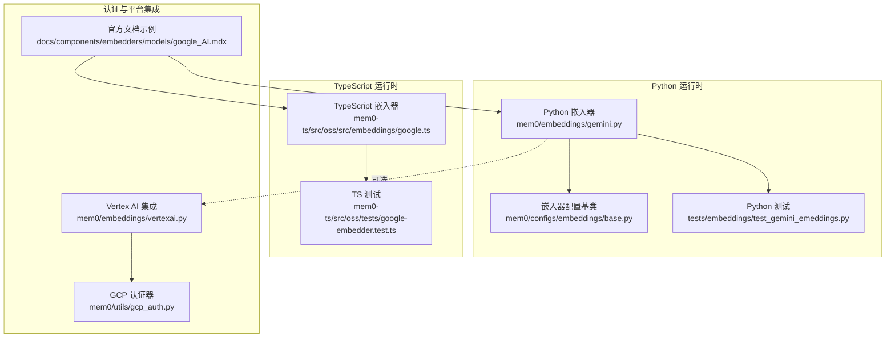
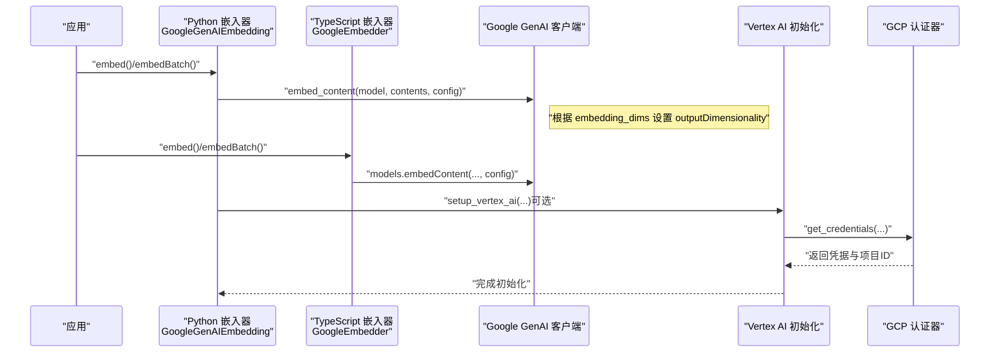
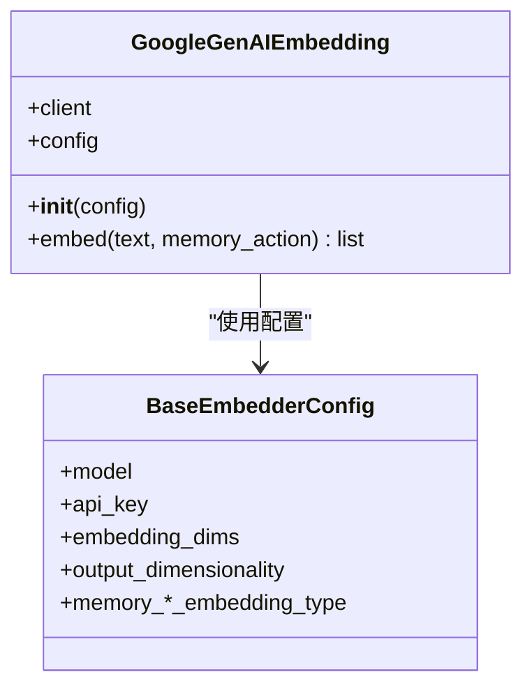
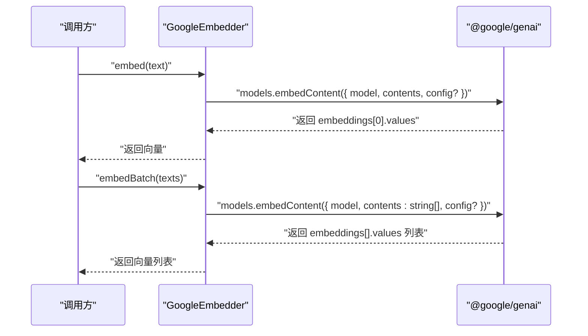
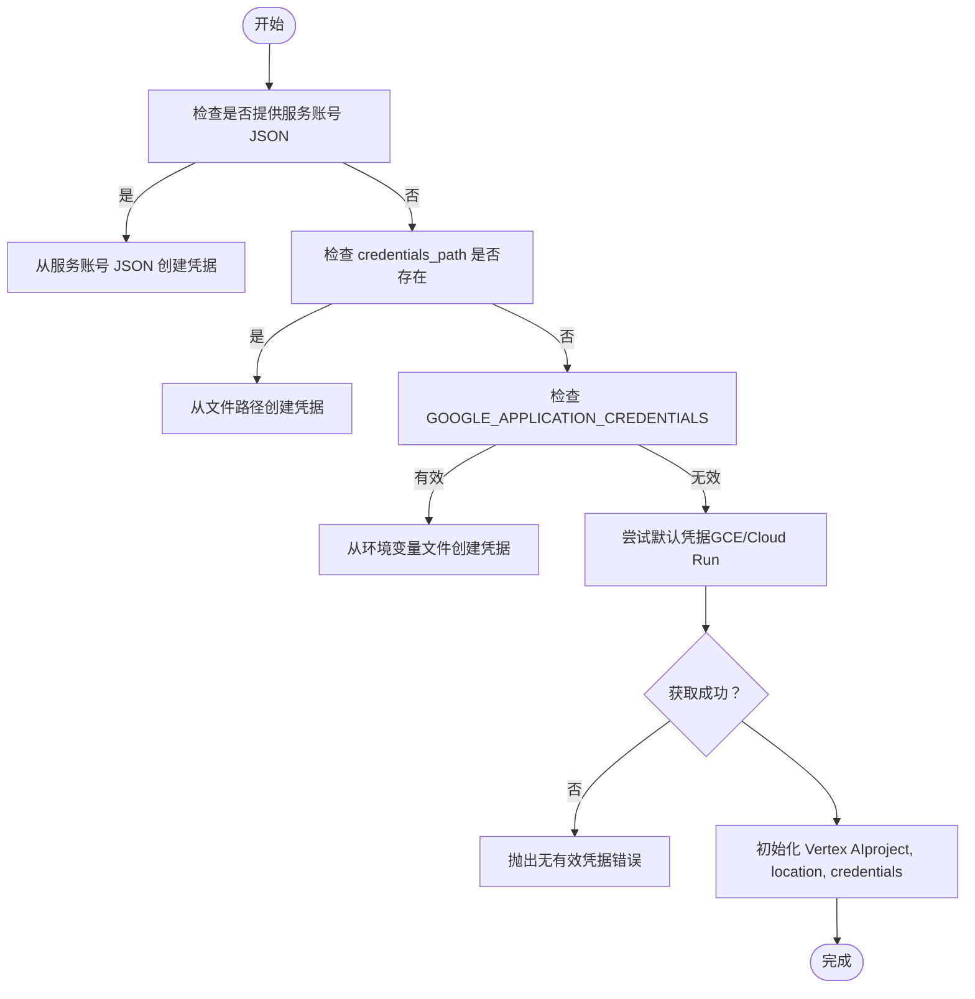
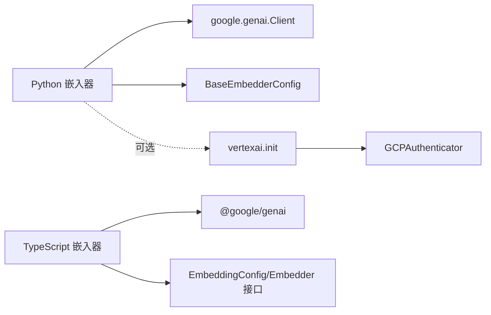

# Google Gemini 嵌入模型

<cite>
**本文引用的文件**
- [mem0/embeddings/gemini.py](file://mem0/embeddings/gemini.py)
- [mem0-ts/src/oss/src/embeddings/google.ts](file://mem0-ts/src/oss/src/embeddings/google.ts)
- [mem0/configs/embeddings/base.py](file://mem0/configs/embeddings/base.py)
- [docs/components/embedders/models/google_AI.mdx](file://docs/components/embedders/models/google_AI.mdx)
- [tests/embeddings/test_gemini_emeddings.py](file://tests/embeddings/test_gemini_emeddings.py)
- [mem0-ts/src/oss/tests/google-embedder.test.ts](file://mem0-ts/src/oss/tests/google-embedder.test.ts)
- [mem0/embeddings/vertexai.py](file://mem0/embeddings/vertexai.py)
- [mem0/utils/gcp_auth.py](file://mem0/utils/gcp_auth.py)
</cite>

## 目录
1. [简介](#简介)
2. [项目结构](#项目结构)
3. [核心组件](#核心组件)
4. [架构总览](#架构总览)
5. [详细组件分析](#详细组件分析)
6. [依赖关系分析](#依赖关系分析)
7. [性能考虑](#性能考虑)
8. [故障排查指南](#故障排查指南)
9. [结论](#结论)
10. [附录](#附录)

## 简介
本指南面向希望在 Mem0 中使用 Google Gemini 嵌入模型的开发者，系统讲解如何配置与集成 Google AI（Gemini）嵌入模型，覆盖以下主题：
- Google Cloud API 认证方式与环境变量配置
- 项目配置与权限设置
- 不同 Gemini 模型的特点与适用场景
- 配置示例与代码实现路径
- 批量处理、错误处理与性能优化策略
- 与 Google Cloud Platform 的集成最佳实践

## 项目结构
与 Gemini 嵌入模型直接相关的代码分布在以下模块：
- Python 嵌入器实现：mem0/embeddings/gemini.py
- TypeScript 嵌入器实现：mem0-ts/src/oss/src/embeddings/google.ts
- 嵌入器通用配置基类：mem0/configs/embeddings/base.py
- 官方文档示例与参数说明：docs/components/embedders/models/google_AI.mdx
- 单元测试与行为验证：tests/embeddings/test_gemini_emeddings.py、mem0-ts/src/oss/tests/google-embedder.test.ts
- Vertex AI 与 GCP 认证支持：mem0/embeddings/vertexai.py、mem0/utils/gcp_auth.py

图表来源
- [mem0/embeddings/gemini.py:1-40](file://mem0/embeddings/gemini.py#L1-L40)
- [mem0-ts/src/oss/src/embeddings/google.ts:1-40](file://mem0-ts/src/oss/src/embeddings/google.ts#L1-L40)
- [mem0/configs/embeddings/base.py:1-111](file://mem0/configs/embeddings/base.py#L1-L111)
- [mem0/embeddings/vertexai.py:24-46](file://mem0/embeddings/vertexai.py#L24-L46)
- [mem0/utils/gcp_auth.py:13-167](file://mem0/utils/gcp_auth.py#L13-L167)
- [docs/components/embedders/models/google_AI.mdx:1-81](file://docs/components/embedders/models/google_AI.mdx#L1-L81)

章节来源
- [mem0/embeddings/gemini.py:1-40](file://mem0/embeddings/gemini.py#L1-L40)
- [mem0-ts/src/oss/src/embeddings/google.ts:1-40](file://mem0-ts/src/oss/src/embeddings/google.ts#L1-L40)
- [mem0/configs/embeddings/base.py:1-111](file://mem0/configs/embeddings/base.py#L1-L111)
- [docs/components/embedders/models/google_AI.mdx:1-81](file://docs/components/embedders/models/google_AI.mdx#L1-L81)

## 核心组件
- Python 嵌入器 GoogleGenAIEmbedding
  - 负责通过 Google GenAI 客户端调用 embed_content 接口生成向量
  - 支持自定义模型名与输出维度，并从环境变量或配置中读取 API Key
- TypeScript 嵌入器 GoogleEmbedder
  - 使用 @google/genai 的 models.embedContent 接口进行单条与批量嵌入
  - 当显式配置 embeddingDims 时，会传入 outputDimensionality 参数
- 嵌入器配置基类 BaseEmbedderConfig
  - 提供统一的配置项，包含模型名、API Key、embedding_dims、内存动作对应的嵌入类型等
  - 同时兼容 VertexAI、AzureOpenAI、HuggingFace、Ollama、AWS Bedrock 等多提供商参数
- 文档与示例
  - 官方文档提供 Python 与 TypeScript 的配置示例及参数说明
- 认证与平台集成
  - Vertex AI 集成通过 GCPAuthenticator 统一处理多种凭据来源（服务账号 JSON、文件路径、环境变量、默认凭据）
  - 支持初始化 Vertex AI 并自动推断项目 ID

章节来源
- [mem0/embeddings/gemini.py:11-40](file://mem0/embeddings/gemini.py#L11-L40)
- [mem0-ts/src/oss/src/embeddings/google.ts:5-39](file://mem0-ts/src/oss/src/embeddings/google.ts#L5-L39)
- [mem0/configs/embeddings/base.py:10-111](file://mem0/configs/embeddings/base.py#L10-L111)
- [docs/components/embedders/models/google_AI.mdx:6-81](file://docs/components/embedders/models/google_AI.mdx#L6-L81)
- [mem0/embeddings/vertexai.py:24-46](file://mem0/embeddings/vertexai.py#L24-L46)
- [mem0/utils/gcp_auth.py:13-167](file://mem0/utils/gcp_auth.py#L13-L167)

## 架构总览
下图展示了从应用到 Google GenAI 的调用链路，以及可选的 Vertex AI 认证路径。

图表来源
- [mem0/embeddings/gemini.py:22-40](file://mem0/embeddings/gemini.py#L22-L40)
- [mem0-ts/src/oss/src/embeddings/google.ts:18-39](file://mem0-ts/src/oss/src/embeddings/google.ts#L18-L39)
- [mem0/embeddings/vertexai.py:24-46](file://mem0/embeddings/vertexai.py#L24-L46)
- [mem0/utils/gcp_auth.py:92-132](file://mem0/utils/gcp_auth.py#L92-L132)

## 详细组件分析

### Python 嵌入器 GoogleGenAIEmbedding
- 功能要点
  - 默认模型名与维度：若未指定则使用 models/gemini-embedding-001 与 768 维度
  - API Key 来源：优先使用配置中的 api_key，否则回退到环境变量 GOOGLE_API_KEY
  - 嵌入调用：构造 EmbedContentConfig 并调用 embed_content，返回第一个向量
- 批量处理
  - 通过传入字符串数组触发批量嵌入；返回值为向量列表
- 错误处理
  - 单测覆盖了异常抛出与空向量返回的边界情况
- 性能建议
  - 尽量复用客户端实例，避免重复初始化
  - 对长文本进行预处理（如换行替换），减少 API 调用失败概率

图表来源
- [mem0/embeddings/gemini.py:11-40](file://mem0/embeddings/gemini.py#L11-L40)
- [mem0/configs/embeddings/base.py:10-111](file://mem0/configs/embeddings/base.py#L10-L111)

章节来源
- [mem0/embeddings/gemini.py:11-40](file://mem0/embeddings/gemini.py#L11-L40)
- [tests/embeddings/test_gemini_emeddings.py:22-60](file://tests/embeddings/test_gemini_emeddings.py#L22-L60)

### TypeScript 嵌入器 GoogleEmbedder
- 功能要点
  - 构造函数从配置或环境变量读取 apiKey，默认模型为 gemini-embedding-001
  - embed 与 embedBatch 均支持可选的 outputDimensionality（仅当 embeddingDims 显式配置时传递）
- 行为验证
  - 单测覆盖了不传 config、传入 outputDimensionality、以及自定义模型名的行为

图表来源
- [mem0-ts/src/oss/src/embeddings/google.ts:18-39](file://mem0-ts/src/oss/src/embeddings/google.ts#L18-L39)
- [mem0-ts/src/oss/tests/google-embedder.test.ts:31-112](file://mem0-ts/src/oss/tests/google-embedder.test.ts#L31-L112)

章节来源
- [mem0-ts/src/oss/src/embeddings/google.ts:5-39](file://mem0-ts/src/oss/src/embeddings/google.ts#L5-L39)
- [mem0-ts/src/oss/tests/google-embedder.test.ts:1-153](file://mem0-ts/src/oss/tests/google-embedder.test.ts#L1-L153)

### 配置与参数
- Python 配置项
  - model：默认 models/gemini-embedding-001
  - embedding_dims：默认 768（与 output_dimensionality 兼容）
  - api_key：来自配置或 GOOGLE_API_KEY
  - memory_*_embedding_type：针对 add/search/update 的嵌入类型
- TypeScript 配置项
  - model：默认 gemini-embedding-001
  - embeddingDims：传入后映射为 outputDimensionality
  - apiKey：来自配置或 GOOGLE_API_KEY

章节来源
- [mem0/configs/embeddings/base.py:15-111](file://mem0/configs/embeddings/base.py#L15-L111)
- [docs/components/embedders/models/google_AI.mdx:64-81](file://docs/components/embedders/models/google_AI.mdx#L64-L81)

### Vertex AI 与 GCP 认证
- Vertex AI 集成
  - 通过 setup_vertex_ai 初始化，支持服务账号 JSON、文件路径、环境变量、默认凭据
  - 自动推断项目 ID，必要时要求显式提供或设置 GOOGLE_CLOUD_PROJECT
- 认证器能力
  - get_credentials 支持多种来源，统一返回 Credentials 与 project_id
  - get_genai_client 支持 API Key 或服务账号凭据

图表来源
- [mem0/embeddings/vertexai.py:24-46](file://mem0/embeddings/vertexai.py#L24-L46)
- [mem0/utils/gcp_auth.py:24-91](file://mem0/utils/gcp_auth.py#L24-L91)
- [mem0/utils/gcp_auth.py:92-132](file://mem0/utils/gcp_auth.py#L92-L132)

章节来源
- [mem0/embeddings/vertexai.py:24-46](file://mem0/embeddings/vertexai.py#L24-L46)
- [mem0/utils/gcp_auth.py:13-167](file://mem0/utils/gcp_auth.py#L13-L167)

## 依赖关系分析
- Python 嵌入器依赖
  - google.genai 客户端
  - BaseEmbedderConfig 提供统一配置
- TypeScript 嵌入器依赖
  - @google/genai 包
  - Embedder 接口与 EmbeddingConfig 类型
- 认证与平台
  - Vertex AI 需要 google-cloud-aiplatform
  - GCP 认证需要 google-auth

图表来源
- [mem0/embeddings/gemini.py:4-21](file://mem0/embeddings/gemini.py#L4-L21)
- [mem0-ts/src/oss/src/embeddings/google.ts:1-3](file://mem0-ts/src/oss/src/embeddings/google.ts#L1-L3)
- [mem0/configs/embeddings/base.py:10-111](file://mem0/configs/embeddings/base.py#L10-L111)
- [mem0/embeddings/vertexai.py:42](file://mem0/embeddings/vertexai.py#L42)
- [mem0/utils/gcp_auth.py:114-118](file://mem0/utils/gcp_auth.py#L114-L118)

章节来源
- [mem0/embeddings/gemini.py:4-21](file://mem0/embeddings/gemini.py#L4-L21)
- [mem0-ts/src/oss/src/embeddings/google.ts:1-3](file://mem0-ts/src/oss/src/embeddings/google.ts#L1-L3)
- [mem0/embeddings/vertexai.py:42](file://mem0/embeddings/vertexai.py#L42)
- [mem0/utils/gcp_auth.py:114-118](file://mem0/utils/gcp_auth.py#L114-L118)

## 性能考虑
- 输出维度控制
  - 通过 embedding_dims 控制 outputDimensionality，可在满足检索质量的前提下降低向量维度，减少存储与计算开销
- 批量嵌入
  - 使用 embedBatch 一次提交多个文本，减少网络往返次数
- 凭据与初始化
  - 复用已初始化的客户端与认证上下文，避免重复认证与初始化带来的额外延迟
- 文本预处理
  - 在调用前对长文本进行清洗（如换行替换），有助于提升 API 成功率与稳定性

## 故障排查指南
- 常见问题与定位
  - API Key 缺失：确认 GOOGLE_API_KEY 已设置，或在配置中提供 api_key
  - Vertex AI 凭据问题：检查 GOOGLE_APPLICATION_CREDENTIALS 文件路径、服务账号 JSON 内容，或使用默认凭据
  - 项目 ID 未确定：确保提供 project_id 或设置 GOOGLE_CLOUD_PROJECT
  - 返回空向量：检查输入内容是否为空或被模型屏蔽
  - 异常抛出：捕获底层异常并记录上下文信息以便重试或降级
- 单元测试参考
  - Python 测试覆盖了 embed 返回空列表、异常抛出与配置初始化
  - TypeScript 测试覆盖了 outputDimensionality 的传递条件与 embedBatch 的行为

章节来源
- [tests/embeddings/test_gemini_emeddings.py:37-53](file://tests/embeddings/test_gemini_emeddings.py#L37-L53)
- [mem0-ts/src/oss/tests/google-embedder.test.ts:31-112](file://mem0-ts/src/oss/tests/google-embedder.test.ts#L31-L112)
- [mem0/embeddings/vertexai.py:32-40](file://mem0/embeddings/vertexai.py#L32-L40)
- [mem0/utils/gcp_auth.py:80-88](file://mem0/utils/gcp_auth.py#L80-L88)

## 结论
通过本指南，您可以在 Mem0 中便捷地集成 Google Gemini 嵌入模型，支持 Python 与 TypeScript 双运行时，并具备灵活的认证方式与性能优化手段。建议在生产环境中：
- 明确配置 API Key 与输出维度
- 使用批量嵌入与复用客户端
- 在需要时启用 Vertex AI 并正确配置 GCP 凭据
- 建立完善的错误处理与监控机制

## 附录

### 快速配置示例（路径指引）
- Python 示例
  - 环境变量与配置：参见 [docs/components/embedders/models/google_AI.mdx:10-35](file://docs/components/embedders/models/google_AI.mdx#L10-L35)
  - 嵌入器实现：参见 [mem0/embeddings/gemini.py:11-40](file://mem0/embeddings/gemini.py#L11-L40)
- TypeScript 示例
  - 配置与调用：参见 [docs/components/embedders/models/google_AI.mdx:37-59](file://docs/components/embedders/models/google_AI.mdx#L37-L59)
  - 嵌入器实现：参见 [mem0-ts/src/oss/src/embeddings/google.ts:5-39](file://mem0-ts/src/oss/src/embeddings/google.ts#L5-L39)

### 参数对照表
- Python
  - model → 模型名（默认 models/gemini-embedding-001）
  - embedding_dims → 输出维度（默认 768）
  - api_key → API Key（来自配置或 GOOGLE_API_KEY）
- TypeScript
  - model → 模型名（默认 gemini-embedding-001）
  - embeddingDims → 输出维度（映射为 outputDimensionality）
  - apiKey → API Key（来自配置或 GOOGLE_API_KEY）

章节来源
- [docs/components/embedders/models/google_AI.mdx:64-81](file://docs/components/embedders/models/google_AI.mdx#L64-L81)
- [mem0/configs/embeddings/base.py:15-111](file://mem0/configs/embeddings/base.py#L15-L111)