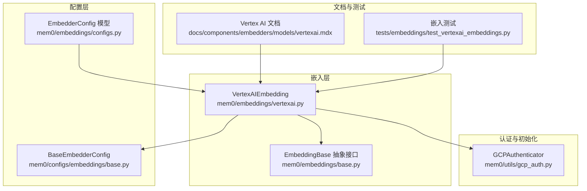
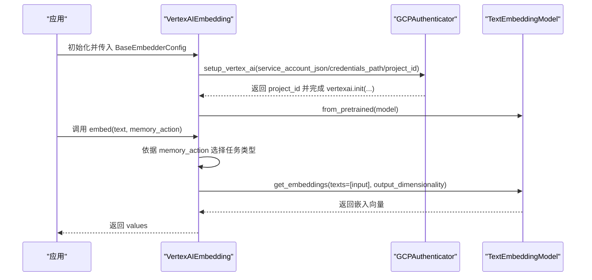
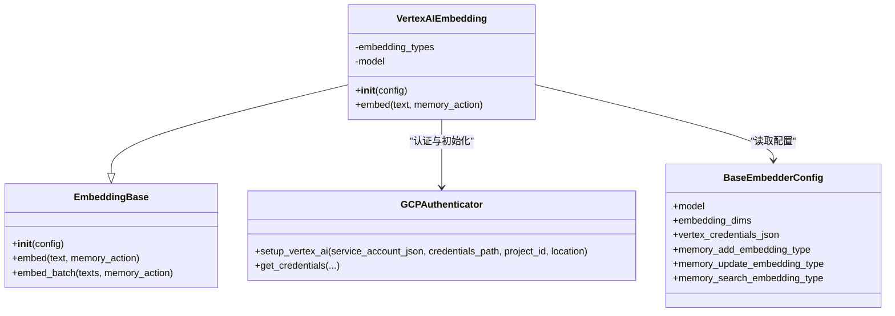
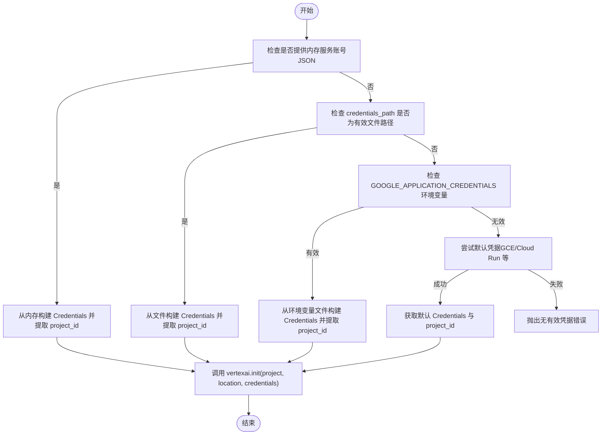
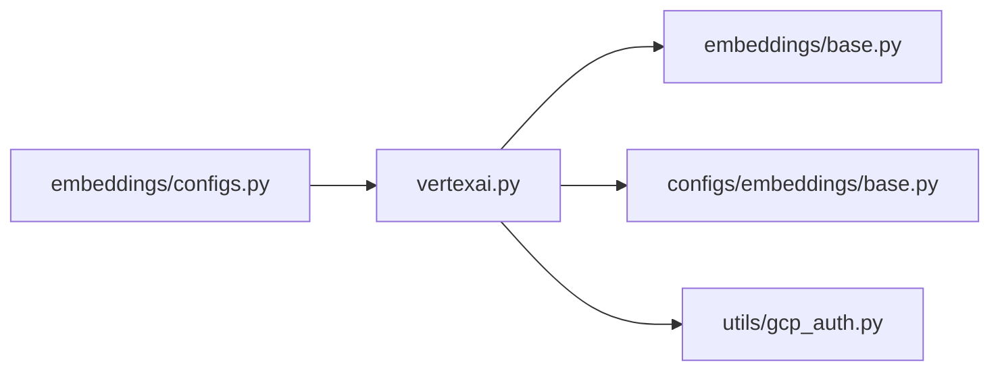

# Google Vertex AI 嵌入模型

<cite>
**本文引用的文件**
- [vertexai.py](file://mem0/embeddings/vertexai.py)
- [gcp_auth.py](file://mem0/utils/gcp_auth.py)
- [base.py（嵌入基类）](file://mem0/embeddings/base.py)
- [base.py（嵌入配置基类）](file://mem0/configs/embeddings/base.py)
- [configs.py（嵌入器配置模型）](file://mem0/embeddings/configs.py)
- [vertexai.mdx（文档）](file://docs/components/embedders/models/vertexai.mdx)
- [test_vertexai_embeddings.py（测试）](file://tests/embeddings/test_vertexai_embeddings.py)
</cite>

## 目录
1. [简介](#简介)
2. [项目结构](#项目结构)
3. [核心组件](#核心组件)
4. [架构总览](#架构总览)
5. [详细组件分析](#详细组件分析)
6. [依赖关系分析](#依赖关系分析)
7. [性能考虑](#性能考虑)
8. [故障排查指南](#故障排查指南)
9. [结论](#结论)
10. [附录](#附录)

## 简介
本文件面向在企业环境中使用 Google Vertex AI 嵌入模型的工程师与架构师，系统性阐述如何在 Mem0 中配置与集成 Vertex AI 嵌入模型，覆盖认证方式（服务账号、环境变量、默认凭据）、项目与区域设置、模型选择与维度控制、任务类型（检索文档/查询等）以及与向量数据库、检索流程的协同方式。同时提供企业级部署建议、安全配置与性能优化策略，帮助您在生产中稳定、高效地运行基于嵌入的检索增强生成（RAG）与记忆系统。

## 项目结构
与 Vertex AI 嵌入相关的核心模块分布如下：
- 嵌入实现：mem0/embeddings/vertexai.py
- 认证与初始化：mem0/utils/gcp_auth.py
- 配置基类与字段：mem0/configs/embeddings/base.py
- 嵌入器配置模型（Provider 校验）：mem0/embeddings/configs.py
- 文档与示例：docs/components/embedders/models/vertexai.mdx
- 单元测试：tests/embeddings/test_vertexai_embeddings.py
- 基类接口：mem0/embeddings/base.py

图表来源
- [vertexai.py:11-65](file://mem0/embeddings/vertexai.py#L11-L65)
- [base.py（嵌入基类）:7-48](file://mem0/embeddings/base.py#L7-L48)
- [base.py（嵌入配置基类）:10-111](file://mem0/configs/embeddings/base.py#L10-L111)
- [configs.py:6-32](file://mem0/embeddings/configs.py#L6-L32)
- [gcp_auth.py:13-167](file://mem0/utils/gcp_auth.py#L13-L167)
- [vertexai.mdx:1-60](file://docs/components/embedders/models/vertexai.mdx#L1-L60)
- [test_vertexai_embeddings.py:1-162](file://tests/embeddings/test_vertexai_embeddings.py#L1-L162)

章节来源
- [vertexai.py:11-65](file://mem0/embeddings/vertexai.py#L11-L65)
- [gcp_auth.py:13-167](file://mem0/utils/gcp_auth.py#L13-L167)
- [base.py（嵌入基类）:7-48](file://mem0/embeddings/base.py#L7-L48)
- [base.py（嵌入配置基类）:10-111](file://mem0/configs/embeddings/base.py#L10-L111)
- [configs.py:6-32](file://mem0/embeddings/configs.py#L6-L32)
- [vertexai.mdx:1-60](file://docs/components/embedders/models/vertexai.mdx#L1-L60)
- [test_vertexai_embeddings.py:1-162](file://tests/embeddings/test_vertexai_embeddings.py#L1-L162)

## 核心组件
- VertexAIEmbedding：实现 Vertex AI 嵌入调用，支持按记忆动作（新增/更新/检索）选择任务类型，并通过 GCPAuthenticator 完成认证与初始化。
- GCPAuthenticator：统一处理多种 GCP 凭据来源（内存字典、文件路径、环境变量、默认凭据），并负责初始化 Vertex AI。
- BaseEmbedderConfig：集中定义嵌入器通用配置项，包含 Vertex AI 特有参数（如凭证路径、任务类型、输出维度等）。
- EmbeddingBase：嵌入器抽象接口，定义 embed/embed_batch 等标准方法。
- EmbedderConfig：对 Provider 进行校验，确保仅允许受支持的嵌入提供方。

章节来源
- [vertexai.py:11-65](file://mem0/embeddings/vertexai.py#L11-L65)
- [gcp_auth.py:13-167](file://mem0/utils/gcp_auth.py#L13-L167)
- [base.py（嵌入基类）:7-48](file://mem0/embeddings/base.py#L7-L48)
- [base.py（嵌入配置基类）:10-111](file://mem0/configs/embeddings/base.py#L10-L111)
- [configs.py:6-32](file://mem0/embeddings/configs.py#L6-L32)

## 架构总览
下图展示了从应用到 Vertex AI 的调用链路与认证初始化过程：

图表来源
- [vertexai.py:24-42](file://mem0/embeddings/vertexai.py#L24-L42)
- [gcp_auth.py:92-132](file://mem0/utils/gcp_auth.py#L92-L132)
- [vertexai.py:44-64](file://mem0/embeddings/vertexai.py#L44-L64)

## 详细组件分析

### VertexAIEmbedding 类
职责与行为
- 默认模型与维度：若未指定模型或维度，自动采用默认值以保证兼容性。
- 任务类型映射：根据记忆动作（新增/更新/检索）选择对应的任务类型（如检索文档/检索查询）。
- 认证与初始化：优先通过 GCPAuthenticator.setup_vertex_ai 完成认证与项目/区域初始化；若失败则回退至环境变量方式。
- 嵌入生成：构造 TextEmbeddingInput，调用模型 get_embeddings 获取向量。

图表来源
- [vertexai.py:11-65](file://mem0/embeddings/vertexai.py#L11-L65)
- [base.py（嵌入基类）:7-48](file://mem0/embeddings/base.py#L7-L48)
- [base.py（嵌入配置基类）:10-111](file://mem0/configs/embeddings/base.py#L10-L111)
- [gcp_auth.py:13-167](file://mem0/utils/gcp_auth.py#L13-L167)

章节来源
- [vertexai.py:11-65](file://mem0/embeddings/vertexai.py#L11-L65)
- [base.py（嵌入基类）:7-48](file://mem0/embeddings/base.py#L7-L48)
- [base.py（嵌入配置基类）:10-111](file://mem0/configs/embeddings/base.py#L10-L111)
- [gcp_auth.py:13-167](file://mem0/utils/gcp_auth.py#L13-L167)

### 认证与初始化（GCPAuthenticator）
能力概览
- 多源凭据支持：内存字典、文件路径、环境变量、默认凭据（适用于云环境）。
- Vertex AI 初始化：自动解析项目 ID（可显式传入或从凭据文件提取），并完成 vertexai.init(...)。
- GenAI 客户端支持：可选 API Key 或服务账号方式获取 GenAI 客户端。

图表来源
- [gcp_auth.py:24-90](file://mem0/utils/gcp_auth.py#L24-L90)
- [gcp_auth.py:92-132](file://mem0/utils/gcp_auth.py#L92-L132)

章节来源
- [gcp_auth.py:24-90](file://mem0/utils/gcp_auth.py#L24-L90)
- [gcp_auth.py:92-132](file://mem0/utils/gcp_auth.py#L92-L132)

### 配置与模型选择
- BaseEmbedderConfig 提供通用字段，其中 Vertex AI 特有字段包括：
  - vertex_credentials_json：凭证文件路径
  - memory_add/update/search_embedding_type：针对不同记忆动作的任务类型
  - embedding_dims：输出维度
- EmbedderConfig 对 Provider 进行白名单校验，vertexai 在允许列表中。
- 文档示例展示如何通过配置对象启用 Vertex AI 嵌入，并指定任务类型。

章节来源
- [base.py（嵌入配置基类）:30-98](file://mem0/configs/embeddings/base.py#L30-L98)
- [configs.py:13-31](file://mem0/embeddings/configs.py#L13-L31)
- [vertexai.mdx:19-59](file://docs/components/embedders/models/vertexai.mdx#L19-L59)

### 与向量数据库与检索的协同
- 嵌入维度与向量库匹配：确保 embedding_dims 与目标向量库期望维度一致，避免索引不匹配或降维开销。
- 任务类型选择：检索场景优先使用“检索查询”类型，文档入库使用“检索文档”类型，有助于提升召回质量。
- 批量嵌入：EmbeddingBase 提供 embed_batch 默认实现，具体嵌入器可按需重写以利用原生批量接口提升吞吐。

章节来源
- [base.py（嵌入基类）:33-47](file://mem0/embeddings/base.py#L33-L47)
- [vertexai.py:18-22](file://mem0/embeddings/vertexai.py#L18-L22)

## 依赖关系分析
- 组件耦合
  - VertexAIEmbedding 依赖 EmbeddingBase 接口与 BaseEmbedderConfig 配置。
  - 认证逻辑集中在 GCPAuthenticator，避免在各嵌入器中重复实现。
  - Provider 校验由 EmbedderConfig 统一执行，降低配置错误风险。
- 外部依赖
  - vertexai.language_models：用于加载与调用嵌入模型。
  - google-auth 与 google-cloud-aiplatform：用于认证与初始化。
- 可能的循环依赖
  - 当前文件间为单向依赖（实现依赖接口与配置），未见循环导入迹象。

图表来源
- [vertexai.py:6-8](file://mem0/embeddings/vertexai.py#L6-L8)
- [base.py（嵌入基类）:4](file://mem0/embeddings/base.py#L4)
- [base.py（嵌入配置基类）:7](file://mem0/configs/embeddings/base.py#L7)
- [configs.py:3](file://mem0/embeddings/configs.py#L3)
- [gcp_auth.py:5-8](file://mem0/utils/gcp_auth.py#L5-L8)

章节来源
- [vertexai.py:6-8](file://mem0/embeddings/vertexai.py#L6-L8)
- [base.py（嵌入基类）:4](file://mem0/embeddings/base.py#L4)
- [base.py（嵌入配置基类）:7](file://mem0/configs/embeddings/base.py#L7)
- [configs.py:3](file://mem0/embeddings/configs.py#L3)
- [gcp_auth.py:5-8](file://mem0/utils/gcp_auth.py#L5-L8)

## 性能考虑
- 批量嵌入：优先使用原生批量接口（如 OpenAI 等），若无原生支持，可在子类中重写 embed_batch 以减少往返次数。
- 输出维度控制：合理设置 embedding_dims，避免过大导致存储与计算压力，过小影响检索精度。
- 任务类型一致性：在相同业务场景下保持任务类型一致，有助于缓存命中与索引稳定性。
- 凭据与初始化复用：在进程内复用已初始化的 Vertex AI 客户端实例，避免重复认证与初始化开销。
- 网络与超时：结合代理与超时策略（如 BaseEmbedderConfig 支持的 HTTP 客户端代理），在网络不稳定环境下提升鲁棒性。

## 故障排查指南
常见问题与定位要点
- 缺少凭据或项目 ID
  - 现象：初始化时报错提示无法确定项目 ID 或无有效凭据。
  - 处理：提供 service_account_json、credentials_path 或设置 GOOGLE_APPLICATION_CREDENTIALS；或在运行环境使用默认凭据。
- 环境变量未生效
  - 现象：未设置 GOOGLE_APPLICATION_CREDENTIALS 或路径无效。
  - 处理：确认路径存在且可读，或改用其他凭据方式。
- 任务类型非法
  - 现象：传入 memory_action 非 add/update/search。
  - 处理：仅使用受支持的动作类型。
- 模型或维度不匹配
  - 现象：返回向量维度与预期不符。
  - 处理：核对 embedding_dims 与目标向量库要求一致；确认模型支持该维度。

章节来源
- [vertexai.py:32-40](file://mem0/embeddings/vertexai.py#L32-L40)
- [test_vertexai_embeddings.py:127-134](file://tests/embeddings/test_vertexai_embeddings.py#L127-L134)
- [test_vertexai_embeddings.py:153-162](file://tests/embeddings/test_vertexai_embeddings.py#L153-L162)

## 结论
通过统一的认证入口与清晰的配置模型，Mem0 将 Vertex AI 嵌入的接入复杂度降至最低。配合任务类型与维度的精细化配置，可在企业级 RAG 与记忆系统中获得稳定、可扩展的检索效果。建议在生产中结合默认凭据、批量嵌入与合理的维度策略，持续监控与优化检索质量与延迟。

## 附录

### 配置参数速查表
- 参数名称：model
  - 描述：要使用的 Vertex AI 嵌入模型名称
  - 默认值：gemini-embedding-001
- 参数名称：vertex_credentials_json
  - 描述：Google Cloud 凭证 JSON 文件路径
  - 默认值：None
- 参数名称：embedding_dims
  - 描述：输出嵌入向量维度
  - 默认值：256
- 参数名称：memory_add_embedding_type
  - 描述：新增记忆时的任务类型
  - 默认值：RETRIEVAL_DOCUMENT
- 参数名称：memory_update_embedding_type
  - 描述：更新记忆时的任务类型
  - 默认值：RETRIEVAL_DOCUMENT
- 参数名称：memory_search_embedding_type
  - 描述：检索记忆时的任务类型
  - 默认值：RETRIEVAL_QUERY

章节来源
- [vertexai.mdx:50-59](file://docs/components/embedders/models/vertexai.mdx#L50-L59)