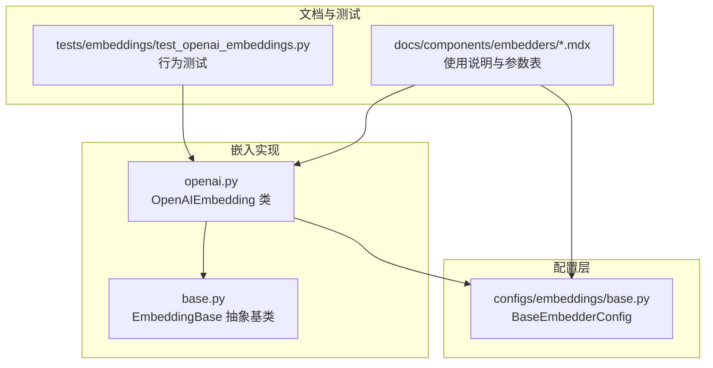
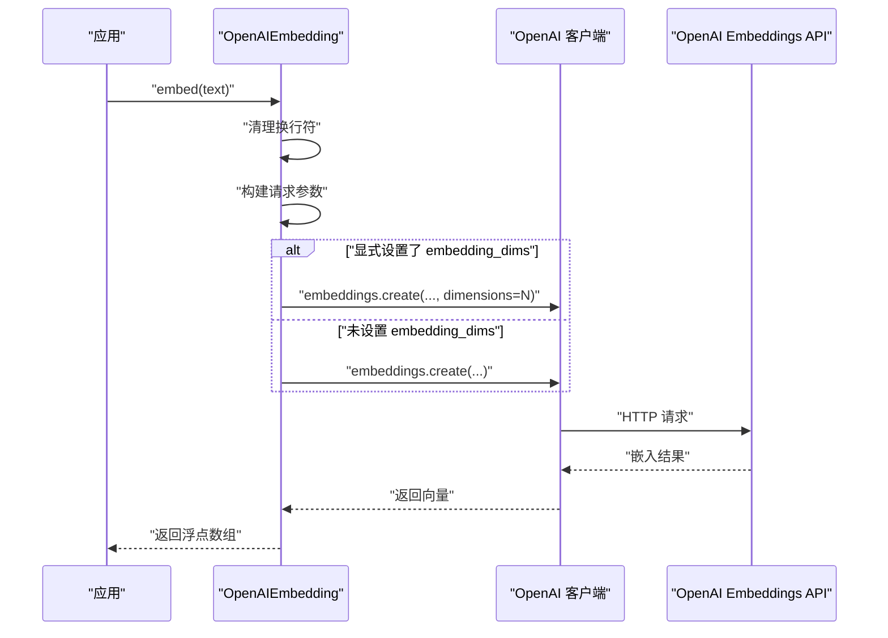
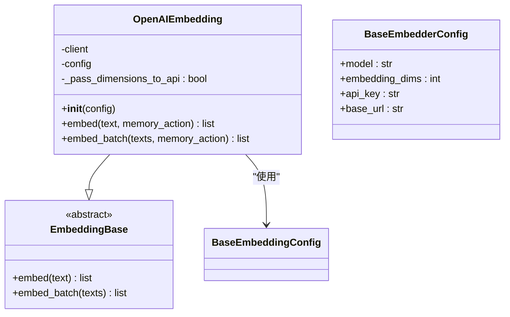
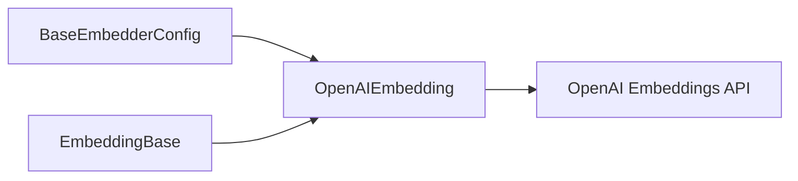

# OpenAI 嵌入模型

<cite>
**本文引用的文件**
- [mem0/embeddings/openai.py](file://mem0/embeddings/openai.py)
- [mem0/embeddings/base.py](file://mem0/embeddings/base.py)
- [mem0/configs/embeddings/base.py](file://mem0/configs/embeddings/base.py)
- [tests/embeddings/test_openai_embeddings.py](file://tests/embeddings/test_openai_embeddings.py)
- [docs/components/embedders/models/openai.mdx](file://docs/components/embedders/models/openai.mdx)
- [docs/components/embedders/config.mdx](file://docs/components/embedders/config.mdx)
- [docs/components/embedders/overview.mdx](file://docs/components/embedders/overview.mdx)
</cite>

## 目录
1. [简介](#简介)
2. [项目结构](#项目结构)
3. [核心组件](#核心组件)
4. [架构概览](#架构概览)
5. [详细组件分析](#详细组件分析)
6. [依赖关系分析](#依赖关系分析)
7. [性能考量](#性能考量)
8. [故障排除指南](#故障排除指南)
9. [结论](#结论)
10. [附录](#附录)

## 简介
本文件面向希望在 mem0 中使用 OpenAI 嵌入模型的开发者与运维人员，系统讲解如何配置与调用 OpenAI Embeddings API，覆盖以下主题：
- API 密钥设置与认证流程
- 模型选择与维度配置（embedding_dims）
- 单文本嵌入与批量嵌入的实现方式
- 嵌入维度参数的作用与兼容性注意事项
- 错误处理、速率限制与成本优化最佳实践
- 完整的使用示例与参考路径

## 项目结构
OpenAI 嵌入能力由 Python SDK 提供，核心位于嵌入模块与配置层，并通过测试用例验证行为。下图展示了与 OpenAI 嵌入相关的关键文件及其职责：

图表来源
- [mem0/embeddings/openai.py:10-60](file://mem0/embeddings/openai.py#L10-L60)
- [mem0/embeddings/base.py:1-100](file://mem0/embeddings/base.py#L1-L100)
- [mem0/configs/embeddings/base.py:1-80](file://mem0/configs/embeddings/base.py#L1-L80)
- [tests/embeddings/test_openai_embeddings.py:1-150](file://tests/embeddings/test_openai_embeddings.py#L1-L150)
- [docs/components/embedders/models/openai.mdx:1-200](file://docs/components/embedders/models/openai.mdx#L1-L200)

章节来源
- [mem0/embeddings/openai.py:10-60](file://mem0/embeddings/openai.py#L10-L60)
- [mem0/embeddings/base.py:1-100](file://mem0/embeddings/base.py#L1-L100)
- [mem0/configs/embeddings/base.py:1-80](file://mem0/configs/embeddings/base.py#L1-L80)
- [tests/embeddings/test_openai_embeddings.py:1-150](file://tests/embeddings/test_openai_embeddings.py#L1-L150)
- [docs/components/embedders/models/openai.mdx:1-200](file://docs/components/embedders/models/openai.mdx#L1-L200)

## 核心组件
- OpenAIEmbedding：封装 OpenAI 嵌入调用，负责单文本与批量嵌入、维度参数传递、换行符清理等逻辑。
- EmbeddingBase：嵌入器抽象基类，统一接口契约（如 embed、embed_batch）。
- BaseEmbedderConfig：嵌入器通用配置基类，包含模型名、维度、API 密钥等字段。

关键点
- 文本预处理：自动将换行符替换为空格，避免 API 调用异常。
- 维度控制：仅当显式设置了 embedding_dims 时才向 API 传递 dimensions 参数，以支持 Matryoshka/截断嵌入模式。
- 批量嵌入：通过一次 API 调用处理多个文本，减少往返开销。

章节来源
- [mem0/embeddings/openai.py:35-60](file://mem0/embeddings/openai.py#L35-L60)
- [mem0/embeddings/base.py:1-100](file://mem0/embeddings/base.py#L1-L100)
- [mem0/configs/embeddings/base.py:1-80](file://mem0/configs/embeddings/base.py#L1-L80)

## 架构概览
下图展示从应用到 OpenAI API 的调用链路与关键决策点（如是否传递 dimensions）：

图表来源
- [mem0/embeddings/openai.py:35-60](file://mem0/embeddings/openai.py#L35-L60)
- [tests/embeddings/test_openai_embeddings.py:39-124](file://tests/embeddings/test_openai_embeddings.py#L39-L124)

## 详细组件分析

### OpenAIEmbedding 类
职责与行为
- 单文本嵌入：对输入文本进行换行符清理，构造请求参数（模型、编码格式、可选维度），调用 OpenAI 客户端发起 API 请求，解析返回的向量。
- 批量嵌入：将多个文本一次性提交给 API，减少网络往返与延迟。
- 维度参数策略：仅在配置中显式指定 embedding_dims 时才传入 dimensions，否则不传，确保与默认模型维度一致。

实现要点
- 文本清洗：将换行符替换为空格，提升兼容性与稳定性。
- 参数拼装：根据配置动态决定是否包含 dimensions 字段。
- 返回值：返回浮点数列表形式的向量。

图表来源
- [mem0/embeddings/openai.py:10-60](file://mem0/embeddings/openai.py#L10-L60)
- [mem0/embeddings/base.py:1-100](file://mem0/embeddings/base.py#L1-L100)
- [mem0/configs/embeddings/base.py:1-80](file://mem0/configs/embeddings/base.py#L1-L80)

章节来源
- [mem0/embeddings/openai.py:35-60](file://mem0/embeddings/openai.py#L35-L60)
- [mem0/embeddings/base.py:1-100](file://mem0/embeddings/base.py#L1-L100)
- [mem0/configs/embeddings/base.py:1-80](file://mem0/configs/embeddings/base.py#L1-L80)

### 配置与参数
- 模型选择：通过配置中的 model 字段指定，如 text-embedding-3-small 或 text-embedding-2-medium。
- 维度配置：embedding_dims 控制输出向量长度；仅在显式设置时传递给 API。
- API 密钥：支持从环境变量或配置对象注入；客户端初始化时传入。
- 基础 URL：可选的 base_url 用于代理或自定义端点。

章节来源
- [mem0/configs/embeddings/base.py:1-80](file://mem0/configs/embeddings/base.py#L1-L80)
- [tests/embeddings/test_openai_embeddings.py:39-124](file://tests/embeddings/test_openai_embeddings.py#L39-L124)
- [docs/components/embedders/models/openai.mdx:1-200](file://docs/components/embedders/models/openai.mdx#L1-L200)

### 使用示例与参考路径
- 基础配置与单文本嵌入：参考测试用例中的调用与断言，了解默认模型与维度行为。
- 自定义模型与维度：参考测试用例中显式设置 embedding_dims 的场景，验证 dimensions 参数的传递。
- 批量嵌入：参考嵌入器的 embed_batch 方法签名与行为测试，确认一次调用处理多条文本。

章节来源
- [tests/embeddings/test_openai_embeddings.py:39-124](file://tests/embeddings/test_openai_embeddings.py#L39-L124)
- [mem0/embeddings/openai.py:57-60](file://mem0/embeddings/openai.py#L57-L60)

## 依赖关系分析
- OpenAIEmbedding 依赖 OpenAI 客户端进行 HTTP 调用。
- 继承自 EmbeddingBase，遵循统一的嵌入接口。
- 通过 BaseEmbedderConfig 获取模型、维度、密钥等配置信息。
- 测试用例覆盖了换行符清理、维度参数传递、API 密钥来源等关键路径。

图表来源
- [mem0/embeddings/openai.py:10-60](file://mem0/embeddings/openai.py#L10-L60)
- [mem0/embeddings/base.py:1-100](file://mem0/embeddings/base.py#L1-L100)
- [mem0/configs/embeddings/base.py:1-80](file://mem0/configs/embeddings/base.py#L1-L80)

章节来源
- [mem0/embeddings/openai.py:10-60](file://mem0/embeddings/openai.py#L10-L60)
- [mem0/embeddings/base.py:1-100](file://mem0/embeddings/base.py#L1-L100)
- [mem0/configs/embeddings/base.py:1-80](file://mem0/configs/embeddings/base.py#L1-L80)

## 性能考量
- 批量嵌入：优先使用 embed_batch 减少网络往返，提高吞吐量。
- 维度裁剪：仅在需要更短向量时设置 embedding_dims，避免不必要的 API 调用差异。
- 文本预处理：提前清理换行符与多余空白，减少 API 层面的兼容性问题。
- 连接复用：保持客户端实例复用，降低连接建立开销。

## 故障排除指南
常见问题与建议
- API 密钥无效或缺失：检查配置对象中的 api_key 设置或环境变量注入；确保 base_url 正确指向可用端点。
- 维度参数不生效：确认是否显式设置了 embedding_dims；未设置时不向 API 传递 dimensions。
- 换行符导致的异常：代码已内置换行符清理逻辑，若仍出现异常，请检查上游文本来源。
- 成本优化：优先使用较小维度的模型（如 text-embedding-3-small），并在批量场景合并请求。
- 速率限制：合理控制并发与请求频率，必要时增加重试与退避策略。

章节来源
- [tests/embeddings/test_openai_embeddings.py:39-124](file://tests/embeddings/test_openai_embeddings.py#L39-L124)
- [mem0/embeddings/openai.py:35-60](file://mem0/embeddings/openai.py#L35-L60)

## 结论
OpenAI 嵌入在 mem0 中通过简洁的接口与智能的参数传递策略实现了高可用与高性价比的向量化能力。通过合理配置模型与维度、采用批量嵌入与成本优化策略，可在保证检索质量的同时显著降低调用成本与延迟。

## 附录
- 参考文档：嵌入器概览与配置说明
  - [嵌入器概览](file://docs/components/embedders/overview.mdx)
  - [嵌入器配置](file://docs/components/embedders/config.mdx)
  - [OpenAI 嵌入模型文档](file://docs/components/embedders/models/openai.mdx)