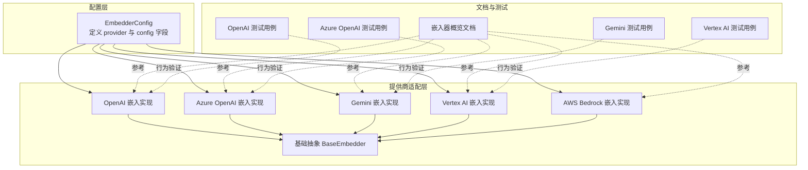
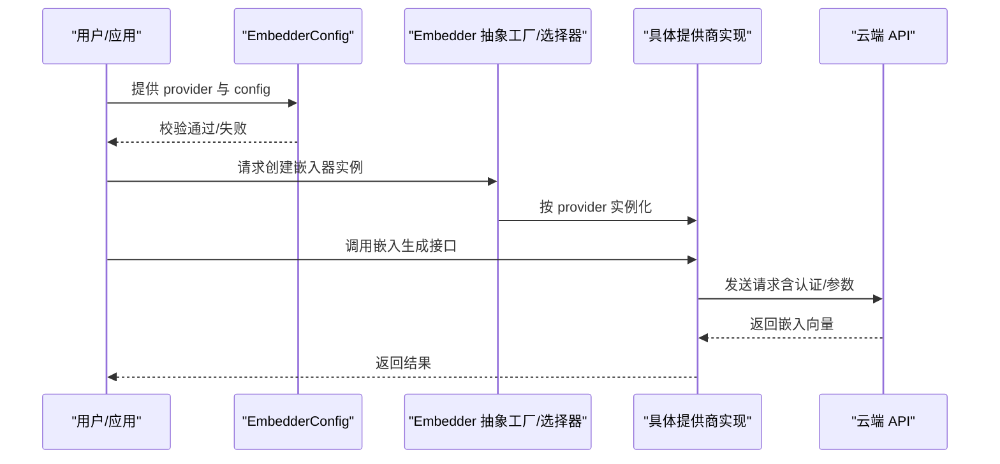
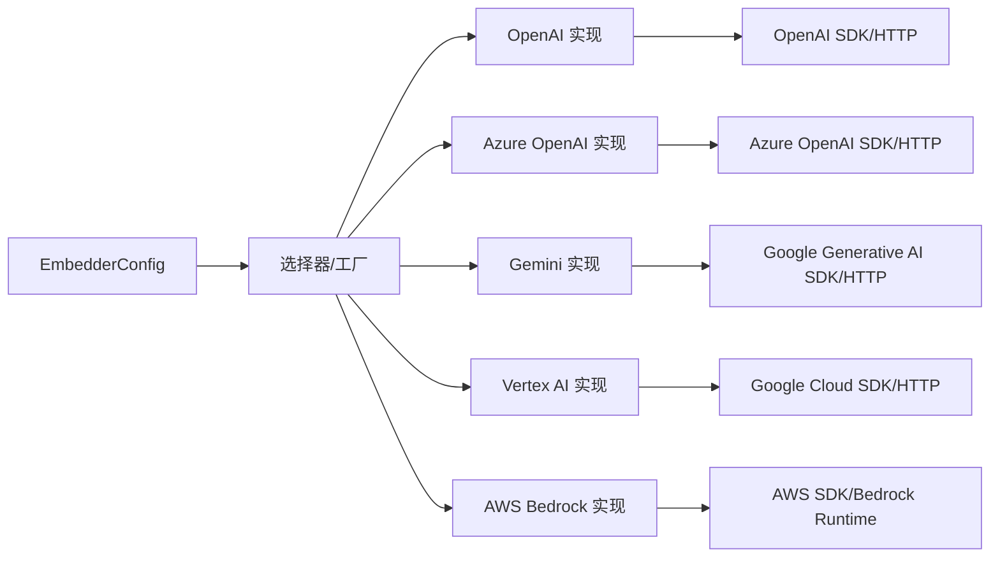
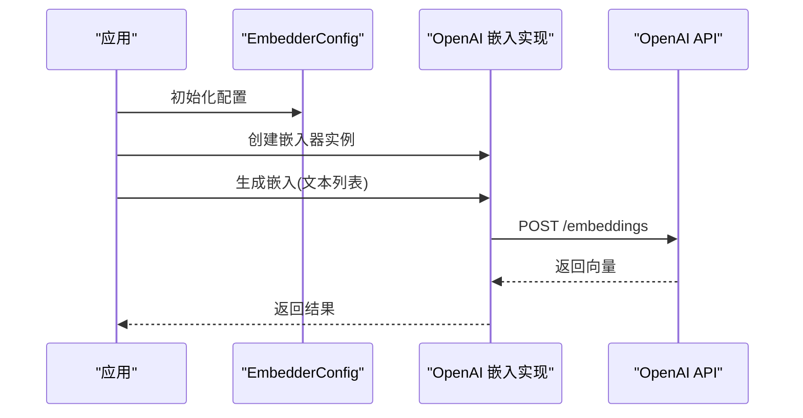

# 云端嵌入模型提供商

<cite>
**本文引用的文件**
- [mem0/embeddings/configs.py](file://mem0/embeddings/configs.py)
- [mem0/embeddings/openai.py](file://mem0/embeddings/openai.py)
- [mem0/embeddings/azure_openai.py](file://mem0/embeddings/azure_openai.py)
- [mem0/embeddings/gemini.py](file://mem0/embeddings/gemini.py)
- [mem0/embeddings/vertexai.py](file://mem0/embeddings/vertexai.py)
- [mem0/embeddings/aws_bedrock.py](file://mem0/embeddings/aws_bedrock.py)
- [mem0/embeddings/base.py](file://mem0/embeddings/base.py)
- [docs/components/embedders/overview.mdx](file://docs/components/embedders/overview.mdx)
- [docs/integrations/aws-bedrock.mdx](file://docs/integrations/aws-bedrock.mdx)
- [tests/embeddings/test_openai_embeddings.py](file://tests/embeddings/test_openai_embeddings.py)
- [tests/embeddings/test_azure_openai_embeddings.py](file://tests/embeddings/test_azure_openai_embeddings.py)
- [tests/embeddings/test_gemini_emeddings.py](file://tests/embeddings/test_gemini_emeddings.py)
- [tests/embeddings/test_vertexai_embeddings.py](file://tests/embeddings/test_vertexai_embeddings.py)
</cite>

## 目录
1. [简介](#简介)
2. [项目结构](#项目结构)
3. [核心组件](#核心组件)
4. [架构总览](#架构总览)
5. [详细组件分析](#详细组件分析)
6. [依赖关系分析](#依赖关系分析)
7. [性能考虑](#性能考虑)
8. [故障排除指南](#故障排除指南)
9. [结论](#结论)
10. [附录](#附录)

## 简介
本文件面向需要在云端部署与使用嵌入模型的工程师与技术文档读者，系统梳理 Mem0 支持的主流云端嵌入模型提供商：OpenAI、Google Gemini（文中统称“Gemini”）、Azure OpenAI、AWS Bedrock 与 Google Cloud Vertex AI。内容覆盖以下方面：
- 各提供商的配置要点与认证方式
- API 密钥管理、速率限制与成本控制策略
- 批量嵌入处理、错误重试机制与性能优化技巧
- 具体的配置模板与环境变量建议
- 代码级调用流程与关键实现位置索引

说明：当前仓库中嵌入模型的官方文档以概览为主，具体提供商的详细配置与最佳实践可结合各提供商的官方文档与本仓库中的测试用例进行对照。

## 项目结构
与云端嵌入模型相关的代码主要集中在以下模块：
- 配置层：定义通用嵌入器配置模型与校验逻辑
- 提供商适配层：针对不同云厂商的嵌入实现
- 文档与测试：提供使用概览、集成指南与行为验证

**图表来源**
- [mem0/embeddings/configs.py:1-31](file://mem0/embeddings/configs.py#L1-L31)
- [mem0/embeddings/openai.py](file://mem0/embeddings/openai.py)
- [mem0/embeddings/azure_openai.py](file://mem0/embeddings/azure_openai.py)
- [mem0/embeddings/gemini.py](file://mem0/embeddings/gemini.py)
- [mem0/embeddings/vertexai.py](file://mem0/embeddings/vertexai.py)
- [mem0/embeddings/aws_bedrock.py](file://mem0/embeddings/aws_bedrock.py)
- [mem0/embeddings/base.py](file://mem0/embeddings/base.py)
- [docs/components/embedders/overview.mdx:1-33](file://docs/components/embedders/overview.mdx#L1-L33)
- [tests/embeddings/test_openai_embeddings.py](file://tests/embeddings/test_openai_embeddings.py)
- [tests/embeddings/test_azure_openai_embeddings.py](file://tests/embeddings/test_azure_openai_embeddings.py)
- [tests/embeddings/test_gemini_emeddings.py](file://tests/embeddings/test_gemini_emeddings.py)
- [tests/embeddings/test_vertexai_embeddings.py](file://tests/embeddings/test_vertexai_embeddings.py)

**章节来源**
- [mem0/embeddings/configs.py:1-31](file://mem0/embeddings/configs.py#L1-L31)
- [docs/components/embedders/overview.mdx:1-33](file://docs/components/embedders/overview.mdx#L1-L33)

## 核心组件
- 嵌入器配置模型
  - 定义字段 provider（字符串）与 config（字典），用于选择与定制嵌入模型。
  - 校验逻辑确保 provider 属于已支持列表，否则抛出异常。
- 基础抽象类
  - 所有云端嵌入实现均继承自统一的抽象基类，保证接口一致性与扩展性。
- 主要提供商实现
  - OpenAI：标准的云端嵌入调用路径，支持批量与流式等常见模式。
  - Azure OpenAI：在 OpenAI 基础上增加区域与版本化路由等参数。
  - Gemini：Google AI 平台的嵌入接口封装。
  - Vertex AI：Google Cloud 的向量检索与嵌入能力封装。
  - AWS Bedrock：通过 Bedrock Runtime 调用多种后端模型的统一入口。

**章节来源**
- [mem0/embeddings/configs.py:6-31](file://mem0/embeddings/configs.py#L6-L31)
- [mem0/embeddings/base.py](file://mem0/embeddings/base.py)
- [mem0/embeddings/openai.py](file://mem0/embeddings/openai.py)
- [mem0/embeddings/azure_openai.py](file://mem0/embeddings/azure_openai.py)
- [mem0/embeddings/gemini.py](file://mem0/embeddings/gemini.py)
- [mem0/embeddings/vertexai.py](file://mem0/embeddings/vertexai.py)
- [mem0/embeddings/aws_bedrock.py](file://mem0/embeddings/aws_bedrock.py)

## 架构总览
下图展示了从配置到具体提供商调用的整体流程，以及与基础抽象类的关系。

**图表来源**
- [mem0/embeddings/configs.py:6-31](file://mem0/embeddings/configs.py#L6-L31)
- [mem0/embeddings/base.py](file://mem0/embeddings/base.py)
- [mem0/embeddings/openai.py](file://mem0/embeddings/openai.py)
- [mem0/embeddings/azure_openai.py](file://mem0/embeddings/azure_openai.py)
- [mem0/embeddings/gemini.py](file://mem0/embeddings/gemini.py)
- [mem0/embeddings/vertexai.py](file://mem0/embeddings/vertexai.py)
- [mem0/embeddings/aws_bedrock.py](file://mem0/embeddings/aws_bedrock.py)

## 详细组件分析

### OpenAI 嵌入
- 配置要点
  - 必需：API 密钥（通常通过环境变量注入）
  - 可选：模型名称、批次大小、超时时间、并发数等
- 认证与密钥管理
  - 建议使用环境变量或安全的密钥管理服务，避免硬编码
- 速率限制与成本控制
  - 使用指数退避与并发节流；按最大上下文长度与批量大小控制成本
- 批量处理与重试
  - 将输入分批，对网络/服务端错误进行幂等重试
- 关键实现位置
  - 嵌入器实现文件：[mem0/embeddings/openai.py](file://mem0/embeddings/openai.py)
  - 配置模型：[mem0/embeddings/configs.py:6-31](file://mem0/embeddings/configs.py#L6-L31)
  - 行为验证：[tests/embeddings/test_openai_embeddings.py](file://tests/embeddings/test_openai_embeddings.py)

**章节来源**
- [mem0/embeddings/openai.py](file://mem0/embeddings/openai.py)
- [mem0/embeddings/configs.py:6-31](file://mem0/embeddings/configs.py#L6-L31)
- [tests/embeddings/test_openai_embeddings.py](file://tests/embeddings/test_openai_embeddings.py)

### Azure OpenAI 嵌入
- 配置要点
  - 必需：API 密钥、端点、部署名称、API 版本
  - 可选：超时、并发、日志级别
- 认证与密钥管理
  - 优先使用托管身份或 Azure Key Vault；避免明文存储
- 速率限制与成本控制
  - 结合资源限额与配额监控，合理设置批量与并发
- 批量处理与重试
  - 对 429/5xx 错误进行指数退避重试
- 关键实现位置
  - 嵌入器实现文件：[mem0/embeddings/azure_openai.py](file://mem0/embeddings/azure_openai.py)
  - 行为验证：[tests/embeddings/test_azure_openai_embeddings.py](file://tests/embeddings/test_azure_openai_embeddings.py)

**章节来源**
- [mem0/embeddings/azure_openai.py](file://mem0/embeddings/azure_openai.py)
- [tests/embeddings/test_azure_openai_embeddings.py](file://tests/embeddings/test_azure_openai_embeddings.py)

### Google Gemini 嵌入
- 配置要点
  - 必需：API 密钥、模型名称
  - 可选：文本类型、维度、请求超时
- 认证与密钥管理
  - 使用 Google Cloud Secret Manager 或 IAM 最小权限原则
- 速率限制与成本控制
  - 利用配额与预算告警，控制请求频率与批量大小
- 批量处理与重试
  - 对瞬时错误进行重试，避免重复提交
- 关键实现位置
  - 嵌入器实现文件：[mem0/embeddings/gemini.py](file://mem0/embeddings/gemini.py)
  - 行为验证：[tests/embeddings/test_gemini_emeddings.py](file://tests/embeddings/test_gemini_emeddings.py)

**章节来源**
- [mem0/embeddings/gemini.py](file://mem0/embeddings/gemini.py)
- [tests/embeddings/test_gemini_emeddings.py](file://tests/embeddings/test_gemini_emeddings.py)

### Google Cloud Vertex AI 嵌入
- 配置要点
  - 必需：项目 ID、区域、端点、模型名称
  - 可选：认证凭据（服务账号 JSON）、超时、批次
- 认证与密钥管理
  - 使用服务账号与工作负载身份，最小权限授权
- 速率限制与成本控制
  - 通过项目配额与成本中心监控，限制并发与批量
- 批量处理与重试
  - 对 429/5xx 与 DeadlineExceeded 进行重试
- 关键实现位置
  - 嵌入器实现文件：[mem0/embeddings/vertexai.py](file://mem0/embeddings/vertexai.py)
  - 行为验证：[tests/embeddings/test_vertexai_embeddings.py](file://tests/embeddings/test_vertexai_embeddings.py)

**章节来源**
- [mem0/embeddings/vertexai.py](file://mem0/embeddings/vertexai.py)
- [tests/embeddings/test_vertexai_embeddings.py](file://tests/embeddings/test_vertexai_embeddings.py)

### AWS Bedrock 嵌入
- 配置要点
  - 必需：访问密钥、秘密密钥、区域、模型 ID
  - 可选：超时、代理、日志级别
- 认证与密钥管理
  - 使用 IAM 角色/策略与 Secrets Manager；避免长期凭证
- 速率限制与成本控制
  - 通过服务配额与成本标签追踪，限制并发与批量
- 批量处理与重试
  - 对 429/500/503 等进行指数退避重试
- 关键实现位置
  - 嵌入器实现文件：[mem0/embeddings/aws_bedrock.py](file://mem0/embeddings/aws_bedrock.py)
  - 集成指南文档：[docs/integrations/aws-bedrock.mdx](file://docs/integrations/aws-bedrock.mdx)

**章节来源**
- [mem0/embeddings/aws_bedrock.py](file://mem0/embeddings/aws_bedrock.py)
- [docs/integrations/aws-bedrock.mdx](file://docs/integrations/aws-bedrock.mdx)

### 统一抽象与工厂选择
- 抽象基类
  - 所有提供商实现共享统一接口，便于替换与扩展
- 工厂/选择器
  - 根据配置中的 provider 自动选择对应实现
- 关键实现位置
  - 抽象基类：[mem0/embeddings/base.py](file://mem0/embeddings/base.py)
  - 配置模型：[mem0/embeddings/configs.py:6-31](file://mem0/embeddings/configs.py#L6-L31)

**章节来源**
- [mem0/embeddings/base.py](file://mem0/embeddings/base.py)
- [mem0/embeddings/configs.py:6-31](file://mem0/embeddings/configs.py#L6-L31)

## 依赖关系分析
- 组件耦合
  - 配置层与实现层解耦：通过 provider 字段动态绑定
  - 实现层依赖各自云厂商 SDK 或 HTTP 客户端
- 外部依赖
  - OpenAI/Azure OpenAI/Gemini/Vertex AI/AWS Bedrock 的官方 SDK 或 HTTP 接口
- 潜在循环依赖
  - 当前结构清晰，无明显循环导入

**图表来源**
- [mem0/embeddings/configs.py:6-31](file://mem0/embeddings/configs.py#L6-L31)
- [mem0/embeddings/openai.py](file://mem0/embeddings/openai.py)
- [mem0/embeddings/azure_openai.py](file://mem0/embeddings/azure_openai.py)
- [mem0/embeddings/gemini.py](file://mem0/embeddings/gemini.py)
- [mem0/embeddings/vertexai.py](file://mem0/embeddings/vertexai.py)
- [mem0/embeddings/aws_bedrock.py](file://mem0/embeddings/aws_bedrock.py)

**章节来源**
- [mem0/embeddings/configs.py:6-31](file://mem0/embeddings/configs.py#L6-L31)

## 性能考虑
- 批量处理
  - 合理设置批次大小，平衡吞吐与延迟；对长文本进行分段
- 并发与限流
  - 使用信号量或队列控制并发；根据提供商速率限制调整
- 指数退避
  - 对 429/5xx 与网络瞬态错误采用指数退避与抖动
- 缓存与去重
  - 对相同输入进行缓存与去重，减少重复请求
- 超时与重试
  - 设置合理的连接/读取超时；区分可重试与不可重试错误
- 成本控制
  - 监控每千 tokens 成本与请求量；按模型与维度选择最优配置

## 故障排除指南
- 常见错误与定位
  - 认证失败：检查密钥、区域、端点与权限
  - 429/配额不足：降低并发与批量，启用退避重试
  - 超时/网络不稳定：增加超时阈值与重试次数
  - 输入格式错误：核对文本长度、特殊字符与编码
- 行为验证参考
  - OpenAI：[tests/embeddings/test_openai_embeddings.py](file://tests/embeddings/test_openai_embeddings.py)
  - Azure OpenAI：[tests/embeddings/test_azure_openai_embeddings.py](file://tests/embeddings/test_azure_openai_embeddings.py)
  - Gemini：[tests/embeddings/test_gemini_emeddings.py](file://tests/embeddings/test_gemini_emeddings.py)
  - Vertex AI：[tests/embeddings/test_vertexai_embeddings.py](file://tests/embeddings/test_vertexai_embeddings.py)

**章节来源**
- [tests/embeddings/test_openai_embeddings.py](file://tests/embeddings/test_openai_embeddings.py)
- [tests/embeddings/test_azure_openai_embeddings.py](file://tests/embeddings/test_azure_openai_embeddings.py)
- [tests/embeddings/test_gemini_emeddings.py](file://tests/embeddings/test_gemini_emeddings.py)
- [tests/embeddings/test_vertexai_embeddings.py](file://tests/embeddings/test_vertexai_embeddings.py)

## 结论
本文件基于仓库现有实现与文档，系统梳理了 Mem0 在 OpenAI、Azure OpenAI、Gemini、Vertex AI 与 AWS Bedrock 上的嵌入模型使用方式。建议在生产环境中：
- 明确密钥与凭据管理策略
- 建立速率限制与成本监控
- 实施批量处理与指数退避重试
- 通过测试用例验证行为与边界条件

## 附录

### 配置模板与环境变量建议
- 通用配置字段
  - provider：提供商标识（如 openai、azure_openai、gemini、vertexai、aws_bedrock）
  - config：各提供商专属参数字典
- 环境变量建议
  - OpenAI：OPENAI_API_KEY
  - Azure OpenAI：AZURE_OPENAI_API_KEY、AZURE_OPENAI_ENDPOINT、AZURE_OPENAI_DEPLOYMENT
  - Gemini：GEMINI_API_KEY
  - Vertex AI：GOOGLE_CLOUD_PROJECT、GOOGLE_CLOUD_REGION、GOOGLE_APPLICATION_CREDENTIALS
  - AWS Bedrock：AWS_ACCESS_KEY_ID、AWS_SECRET_ACCESS_KEY、AWS_DEFAULT_REGION

### 代码级调用流程（OpenAI）

**图表来源**
- [mem0/embeddings/openai.py](file://mem0/embeddings/openai.py)
- [mem0/embeddings/configs.py:6-31](file://mem0/embeddings/configs.py#L6-L31)