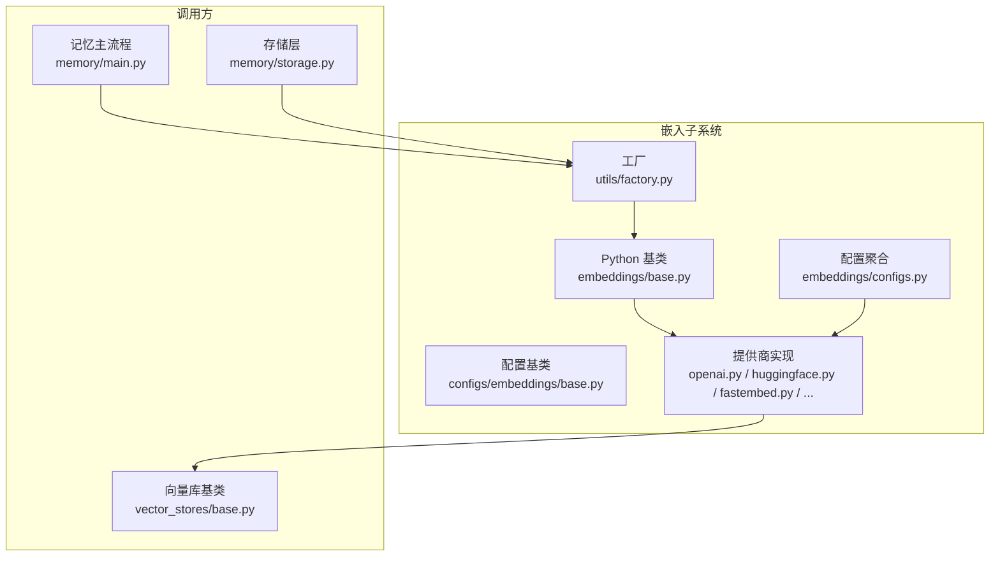
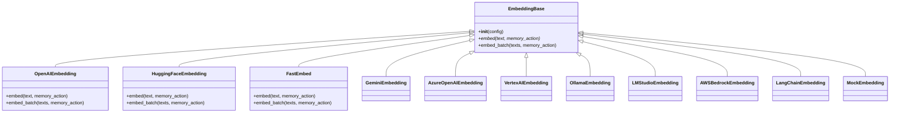
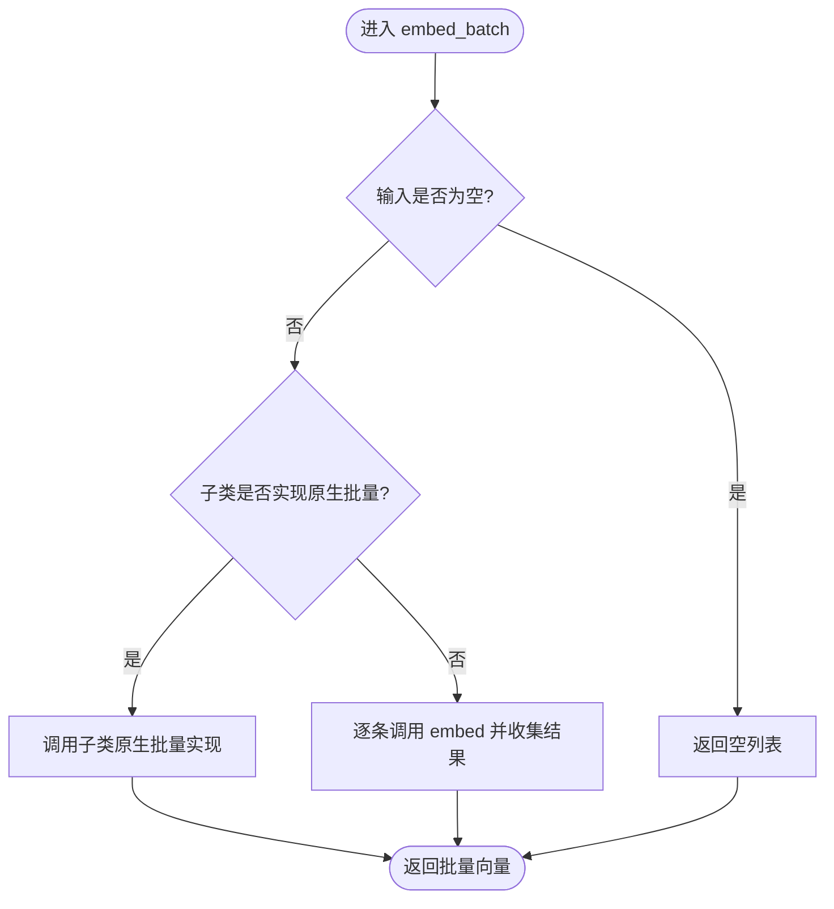
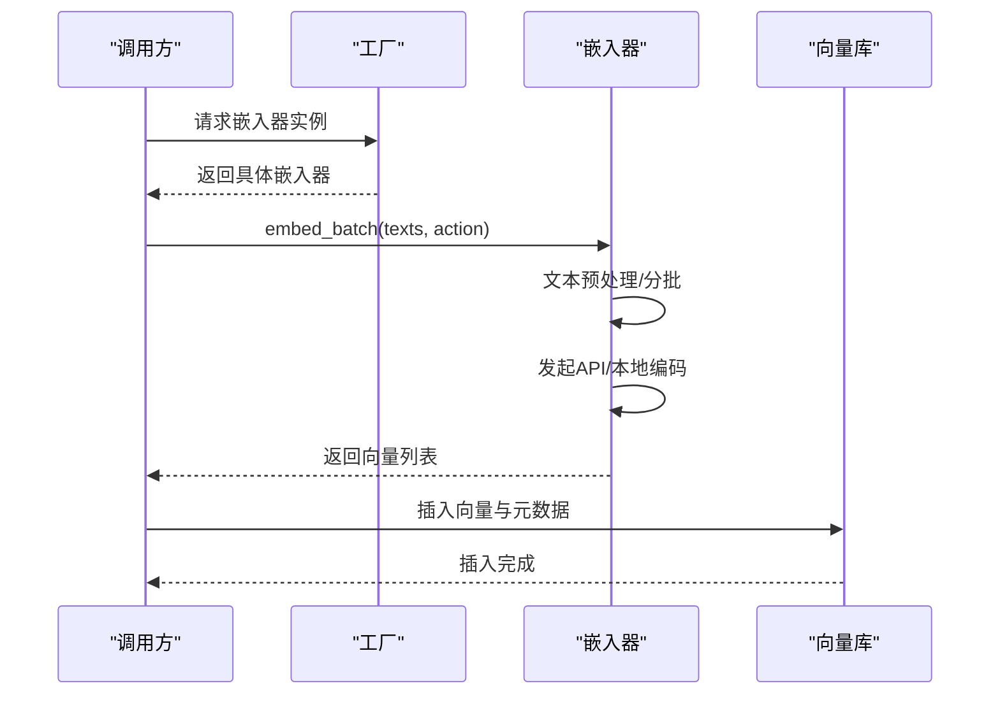
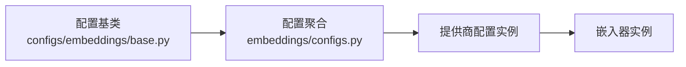
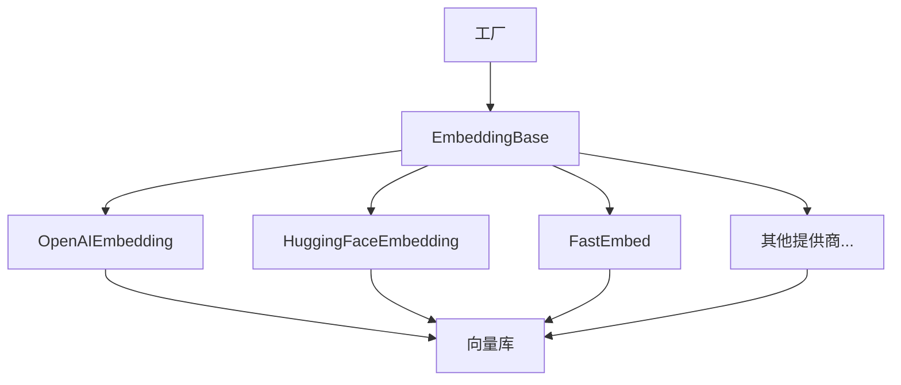

# 嵌入模型基础架构

<cite>
**本文档引用的文件**
- [mem0/embeddings/base.py](file://mem0/embeddings/base.py)
- [mem0/configs/embeddings/base.py](file://mem0/configs/embeddings/base.py)
- [mem0/embeddings/openai.py](file://mem0/embeddings/openai.py)
- [mem0/embeddings/huggingface.py](file://mem0/embeddings/huggingface.py)
- [mem0/embeddings/fastembed.py](file://mem0/embeddings/fastembed.py)
- [mem0/embeddings/gemini.py](file://mem0/embeddings/gemini.py)
- [mem0/embeddings/azure_openai.py](file://mem0/embeddings/azure_openai.py)
- [mem0/embeddings/vertexai.py](file://mem0/embeddings/vertexai.py)
- [mem0/embeddings/ollama.py](file://mem0/embeddings/ollama.py)
- [mem0/embeddings/lmstudio.py](file://mem0/embeddings/lmstudio.py)
- [mem0/embeddings/aws_bedrock.py](file://mem0/embeddings/aws_bedrock.py)
- [mem0/embeddings/langchain.py](file://mem0/embeddings/langchain.py)
- [mem0/embeddings/mock.py](file://mem0/embeddings/mock.py)
- [mem0/embeddings/configs.py](file://mem0/embeddings/configs.py)
- [mem0/utils/factory.py](file://mem0/utils/factory.py)
- [mem0/memory/main.py](file://mem0/memory/main.py)
- [mem0/memory/storage.py](file://mem0/memory/storage.py)
- [mem0/vector_stores/base.py](file://mem0/vector_stores/base.py)
- [mem0-ts/src/oss/src/embeddings/base.ts](file://mem0-ts/src/oss/src/embeddings/base.ts)
</cite>

## 目录
1. [简介](#简介)
2. [项目结构](#项目结构)
3. [核心组件](#核心组件)
4. [架构总览](#架构总览)
5. [详细组件分析](#详细组件分析)
6. [依赖关系分析](#依赖关系分析)
7. [性能考虑](#性能考虑)
8. [故障排除指南](#故障排除指南)
9. [结论](#结论)
10. [附录](#附录)

## 简介
本文件系统性阐述嵌入模型基础架构的设计与实现，覆盖抽象基类与接口规范、嵌入向量生成流程、维度管理与批量处理机制、配置系统（默认参数、环境变量与运行时配置优先级）、错误处理与缓存策略、性能监控，以及扩展新嵌入模型提供商的开发指南与最佳实践。目标是帮助开发者在不深入源码的情况下快速理解并正确使用与扩展嵌入子系统。

## 项目结构
嵌入子系统位于 Python 包 mem0 的 embeddings 目录下，采用“按提供商分文件”的模块化组织方式；同时提供 TypeScript 的嵌入器接口定义用于前端或跨语言场景。配置系统位于 configs/embeddings 子目录，工厂模式负责根据配置实例化具体嵌入器。

**图表来源**
- [mem0/embeddings/base.py:1-47](file://mem0/embeddings/base.py#L1-L47)
- [mem0/configs/embeddings/base.py](file://mem0/configs/embeddings/base.py)
- [mem0/embeddings/openai.py:57-76](file://mem0/embeddings/openai.py#L57-L76)
- [mem0/embeddings/huggingface.py:46-72](file://mem0/embeddings/huggingface.py#L46-L72)
- [mem0/embeddings/fastembed.py](file://mem0/embeddings/fastembed.py)
- [mem0/embeddings/gemini.py](file://mem0/embeddings/gemini.py)
- [mem0/embeddings/azure_openai.py](file://mem0/embeddings/azure_openai.py)
- [mem0/embeddings/vertexai.py](file://mem0/embeddings/vertexai.py)
- [mem0/embeddings/ollama.py](file://mem0/embeddings/ollama.py)
- [mem0/embeddings/lmstudio.py](file://mem0/embeddings/lmstudio.py)
- [mem0/embeddings/aws_bedrock.py](file://mem0/embeddings/aws_bedrock.py)
- [mem0/embeddings/langchain.py](file://mem0/embeddings/langchain.py)
- [mem0/embeddings/mock.py](file://mem0/embeddings/mock.py)
- [mem0/embeddings/configs.py](file://mem0/embeddings/configs.py)
- [mem0/utils/factory.py](file://mem0/utils/factory.py)
- [mem0/memory/main.py](file://mem0/memory/main.py)
- [mem0/memory/storage.py](file://mem0/memory/storage.py)
- [mem0/vector_stores/base.py](file://mem0/vector_stores/base.py)

**章节来源**
- [mem0/embeddings/base.py:1-47](file://mem0/embeddings/base.py#L1-L47)
- [mem0/configs/embeddings/base.py](file://mem0/configs/embeddings/base.py)
- [mem0/embeddings/configs.py](file://mem0/embeddings/configs.py)

## 核心组件
- 抽象基类：定义统一的 embed/embed_batch 接口与默认的批量实现策略，确保所有提供商实现一致的行为契约。
- 配置基类：集中管理嵌入器所需的通用配置项（如模型名、维度、超参等），支持默认值与运行时覆盖。
- 提供商实现：各主流服务（OpenAI、Azure OpenAI、Gemini、HuggingFace、FastEmbed、Vertex AI、Ollama、LM Studio、AWS Bedrock）的具体实现，体现各自的 API 特性与优化。
- 工厂：依据配置动态选择并实例化合适的嵌入器，屏蔽调用方对具体提供商的感知。
- 调用链路：记忆主流程与存储层通过工厂获取嵌入器，完成文本到向量的转换，并写入向量库。

**章节来源**
- [mem0/embeddings/base.py:1-47](file://mem0/embeddings/base.py#L1-L47)
- [mem0/configs/embeddings/base.py](file://mem0/configs/embeddings/base.py)
- [mem0/embeddings/openai.py:57-76](file://mem0/embeddings/openai.py#L57-L76)
- [mem0/embeddings/huggingface.py:46-72](file://mem0/embeddings/huggingface.py#L46-L72)
- [mem0/embeddings/fastembed.py](file://mem0/embeddings/fastembed.py)
- [mem0/embeddings/gemini.py](file://mem0/embeddings/gemini.py)
- [mem0/embeddings/azure_openai.py](file://mem0/embeddings/azure_openai.py)
- [mem0/embeddings/vertexai.py](file://mem0/embeddings/vertexai.py)
- [mem0/embeddings/ollama.py](file://mem0/embeddings/ollama.py)
- [mem0/embeddings/lmstudio.py](file://mem0/embeddings/lmstudio.py)
- [mem0/embeddings/aws_bedrock.py](file://mem0/embeddings/aws_bedrock.py)
- [mem0/embeddings/langchain.py](file://mem0/embeddings/langchain.py)
- [mem0/embeddings/mock.py](file://mem0/embeddings/mock.py)
- [mem0/embeddings/configs.py](file://mem0/embeddings/configs.py)
- [mem0/utils/factory.py](file://mem0/utils/factory.py)
- [mem0/memory/main.py](file://mem0/memory/main.py)
- [mem0/memory/storage.py](file://mem0/memory/storage.py)
- [mem0/vector_stores/base.py](file://mem0/vector_stores/base.py)

## 架构总览
嵌入子系统遵循“抽象基类 + 多提供商实现 + 工厂 + 配置”的分层设计。调用方仅依赖抽象接口与工厂，无需关心具体提供商差异。批量处理与维度控制在基类与部分提供商中得到统一处理，保证性能与一致性。

**图表来源**
- [mem0/embeddings/base.py:1-47](file://mem0/embeddings/base.py#L1-L47)
- [mem0/embeddings/openai.py:57-76](file://mem0/embeddings/openai.py#L57-L76)
- [mem0/embeddings/huggingface.py:46-72](file://mem0/embeddings/huggingface.py#L46-L72)
- [mem0/embeddings/fastembed.py](file://mem0/embeddings/fastembed.py)
- [mem0/embeddings/gemini.py](file://mem0/embeddings/gemini.py)
- [mem0/embeddings/azure_openai.py](file://mem0/embeddings/azure_openai.py)
- [mem0/embeddings/vertexai.py](file://mem0/embeddings/vertexai.py)
- [mem0/embeddings/ollama.py](file://mem0/embeddings/ollama.py)
- [mem0/embeddings/lmstudio.py](file://mem0/embeddings/lmstudio.py)
- [mem0/embeddings/aws_bedrock.py](file://mem0/embeddings/aws_bedrock.py)
- [mem0/embeddings/langchain.py](file://mem0/embeddings/langchain.py)
- [mem0/embeddings/mock.py](file://mem0/embeddings/mock.py)

## 详细组件分析

### 抽象基类与接口规范
- 统一接口：embed(text, memory_action) 返回单条向量；embed_batch(texts, memory_action) 返回批量向量列表。
- 默认批量策略：若子类未重写 embed_batch，则默认顺序调用 embed 实现，便于无原生批量能力的提供商。
- 内存动作上下文：memory_action 参数允许区分“添加”“检索”“更新”三种语义场景，为不同动作定制嵌入策略提供可能。

**图表来源**
- [mem0/embeddings/base.py:33-47](file://mem0/embeddings/base.py#L33-L47)

**章节来源**
- [mem0/embeddings/base.py:1-47](file://mem0/embeddings/base.py#L1-L47)

### 嵌入向量生成流程
- 文本预处理：部分提供商在批量前进行换行符替换等清洗，以提升兼容性与稳定性。
- API 调用：通过客户端 SDK 或 HTTP 客户端发起请求，携带模型名与维度等参数。
- 结果解析：从响应中提取向量数据，保持顺序与索引对应。
- 向量入库：将向量与元数据写入向量数据库，准备后续检索。

**图表来源**
- [mem0/embeddings/openai.py:57-76](file://mem0/embeddings/openai.py#L57-L76)
- [mem0/embeddings/huggingface.py:46-72](file://mem0/embeddings/huggingface.py#L46-L72)
- [mem0/memory/main.py](file://mem0/memory/main.py)
- [mem0/memory/storage.py](file://mem0/memory/storage.py)

**章节来源**
- [mem0/embeddings/openai.py:57-76](file://mem0/embeddings/openai.py#L57-L76)
- [mem0/embeddings/huggingface.py:46-72](file://mem0/embeddings/huggingface.py#L46-L72)
- [mem0/memory/main.py](file://mem0/memory/main.py)
- [mem0/memory/storage.py](file://mem0/memory/storage.py)

### 维度管理
- 动态维度传递：当提供商支持指定输出维度时，会将 embedding_dims 作为参数传入 API，确保向量维度与向量库期望一致。
- 兼容性回退：若提供商不支持该参数，则忽略或使用默认维度，避免功能降级。

**章节来源**
- [mem0/embeddings/openai.py:72-74](file://mem0/embeddings/openai.py#L72-L74)

### 批量处理机制
- OpenAI 批量：按最大批次大小切分，减少 API 调用次数；对响应按原始索引排序，保证输出顺序。
- HuggingFace 批量：本地 SentenceTransformer 支持原生批量编码；远程 TEI/OpenAI 兼容端点回退至顺序实现。
- FastEmbed：面向本地高效编码，批量处理提升吞吐。

**章节来源**
- [mem0/embeddings/openai.py:57-76](file://mem0/embeddings/openai.py#L57-L76)
- [mem0/embeddings/huggingface.py:46-72](file://mem0/embeddings/huggingface.py#L46-L72)
- [mem0/embeddings/fastembed.py](file://mem0/embeddings/fastembed.py)

### 配置系统架构
- 配置基类：集中定义嵌入器所需的关键字段（如模型名、维度、超参等），提供默认值与类型约束。
- 运行时配置：允许在初始化时传入覆盖对象，实现灵活的运行时定制。
- 配置聚合：embeddings/configs.py 汇总各提供商的配置项，形成统一入口。

**图表来源**
- [mem0/configs/embeddings/base.py](file://mem0/configs/embeddings/base.py)
- [mem0/embeddings/configs.py](file://mem0/embeddings/configs.py)

**章节来源**
- [mem0/configs/embeddings/base.py](file://mem0/configs/embeddings/base.py)
- [mem0/embeddings/configs.py](file://mem0/embeddings/configs.py)

### 错误处理与缓存策略
- 错误处理：本地编码失败时回退到逐条调用，保证可用性；异常捕获后继续执行，避免中断整体流程。
- 缓存策略：当前实现未见全局嵌入缓存逻辑，建议在上层或调用方引入基于文本内容哈希的缓存以降低重复计算成本。

**章节来源**
- [mem0/embeddings/huggingface.py:66-72](file://mem0/embeddings/huggingface.py#L66-L72)

### 性能监控
- 日志记录：向量插入等关键步骤包含日志输出，便于追踪性能瓶颈与问题定位。
- 批量优化：通过原生批量接口与分批策略显著降低网络往返与模型调度开销。

**章节来源**
- [mem0/vector_stores/base.py](file://mem0/vector_stores/base.py)
- [mem0/embeddings/openai.py:57-76](file://mem0/embeddings/openai.py#L57-L76)

### 跨语言接口（TypeScript）
- TS 嵌入器接口：定义 embed 与 embedBatch 的 Promise 类型签名，确保前后端行为一致。
- 与 Python 实现映射：TS 接口与 Python 基类方法一一对应，便于在前端或跨语言场景复用同一抽象。

**章节来源**
- [mem0-ts/src/oss/src/embeddings/base.ts:1-4](file://mem0-ts/src/oss/src/embeddings/base.ts#L1-L4)

## 依赖关系分析
- 耦合与内聚：嵌入器与向量库解耦，通过统一接口交互；提供商内部高内聚，各自封装差异。
- 外部依赖：各提供商依赖其官方 SDK 或 HTTP 客户端；本地模型依赖本地推理库。
- 工厂依赖：工厂根据配置选择具体嵌入器，避免调用方直接依赖具体提供商。

**图表来源**
- [mem0/utils/factory.py](file://mem0/utils/factory.py)
- [mem0/embeddings/base.py:1-47](file://mem0/embeddings/base.py#L1-L47)
- [mem0/embeddings/openai.py:57-76](file://mem0/embeddings/openai.py#L57-L76)
- [mem0/embeddings/huggingface.py:46-72](file://mem0/embeddings/huggingface.py#L46-L72)
- [mem0/embeddings/fastembed.py](file://mem0/embeddings/fastembed.py)

**章节来源**
- [mem0/utils/factory.py](file://mem0/utils/factory.py)
- [mem0/embeddings/base.py:1-47](file://mem0/embeddings/base.py#L1-L47)

## 性能考虑
- 批量优先：优先使用提供商原生批量接口，或在本地模型上启用批量编码。
- 文本清洗：对换行符等特殊字符进行预处理，提高 API 兼容性与稳定性。
- 维度一致性：确保嵌入维度与向量库索引维度匹配，避免二次转换带来的性能损失。
- 日志与可观测性：在关键路径增加日志，结合外部监控工具进行端到端性能分析。

[本节为通用指导，无需特定文件来源]

## 故障排除指南
- 本地编码失败：自动回退到逐条嵌入，检查本地模型加载与依赖版本。
- API 限流或错误：检查配额、密钥与网络连通性；必要时调整批次大小或重试策略。
- 维度不匹配：确认 embedding_dims 与向量库配置一致；对不支持自定义维度的提供商使用默认值。
- 空输入：批量接口需处理空列表边界情况，避免无意义调用。

**章节来源**
- [mem0/embeddings/huggingface.py:66-72](file://mem0/embeddings/huggingface.py#L66-L72)
- [mem0/embeddings/openai.py:57-76](file://mem0/embeddings/openai.py#L57-L76)

## 结论
嵌入模型基础架构通过抽象基类与工厂模式实现了高度可扩展与可维护的设计。批量处理、维度管理与错误回退机制共同保障了性能与可靠性。建议在实际部署中结合业务场景选择合适的提供商与批量策略，并在上层引入缓存与监控以进一步优化体验。

[本节为总结，无需特定文件来源]

## 附录

### 开发新嵌入模型提供商的步骤与最佳实践
- 继承抽象基类：实现 embed 与 embed_batch 方法，优先提供原生批量能力。
- 配置对接：在配置聚合模块中注册新提供商的配置项，确保默认值与校验规则完整。
- 错误与回退：对本地编码与网络调用分别设置异常捕获与回退策略。
- 性能优化：利用分批、预处理与日志记录，持续评估与改进吞吐与延迟。
- 单元测试：覆盖正常路径、空输入、异常回退等场景，确保稳定性。

**章节来源**
- [mem0/embeddings/base.py:1-47](file://mem0/embeddings/base.py#L1-L47)
- [mem0/embeddings/configs.py](file://mem0/embeddings/configs.py)