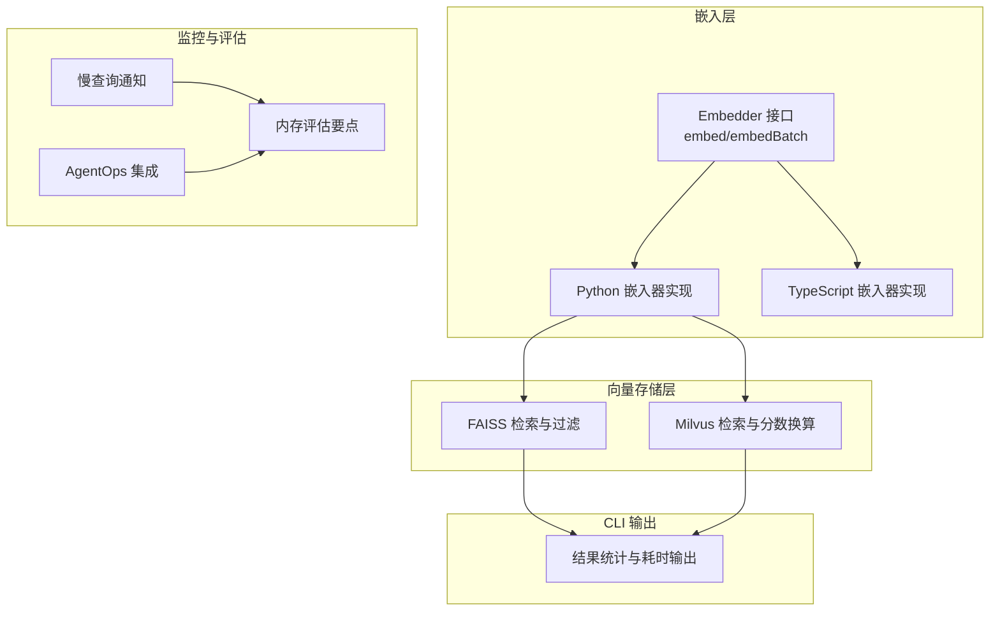
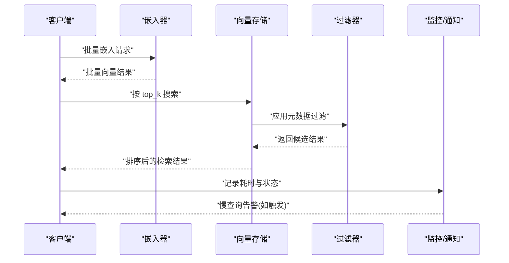
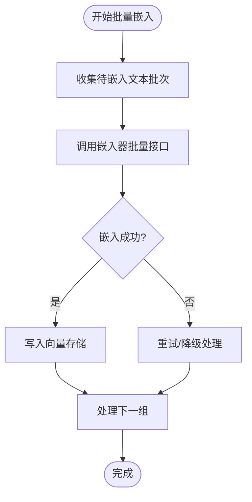
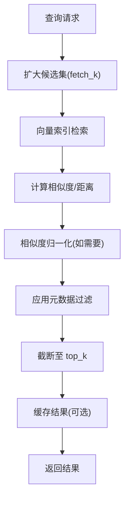
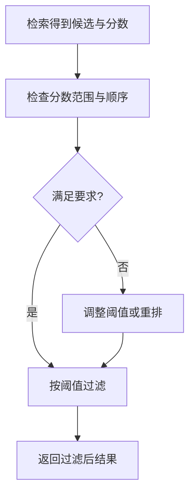
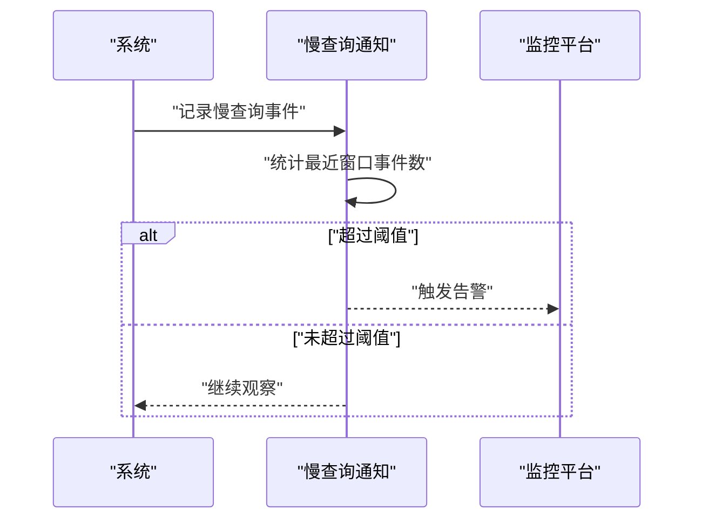
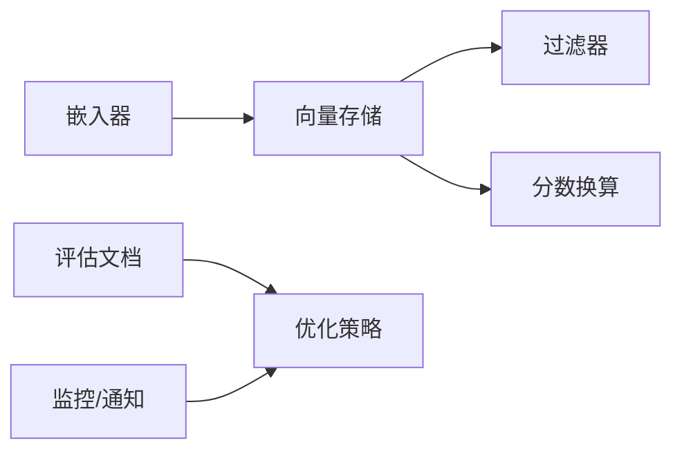

# 嵌入模型性能优化

<cite>
**本文引用的文件**
- [embeddings/base.ts](file://mem0-ts/src/oss/src/embeddings/base.ts)
- [faiss.py](file://mem0/vector_stores/faiss.py)
- [milvus.py](file://mem0/vector_stores/milvus.py)
- [test_score_normalization.py](file://tests/vector_stores/test_score_normalization.py)
- [index.test.ts](file://integrations/openclaw/index.test.ts)
- [notices.py](file://mem0/memory/notices.py)
- [output.ts](file://cli/node/src/output.ts)
- [memory-evaluation.mdx](file://docs/core-concepts/memory-evaluation.mdx)
- [agentops.mdx](file://docs/integrations/agentops.mdx)
</cite>

## 目录
1. [引言](#引言)
2. [项目结构](#项目结构)
3. [核心组件](#核心组件)
4. [架构总览](#架构总览)
5. [详细组件分析](#详细组件分析)
6. [依赖关系分析](#依赖关系分析)
7. [性能考量](#性能考量)
8. [故障排除指南](#故障排除指南)
9. [结论](#结论)
10. [附录](#附录)

## 引言
本指南聚焦于嵌入模型在大规模检索与内存系统中的性能优化，围绕批量处理、缓存与预取、向量维度与相似度计算、过滤优化、成本控制、资源利用率监控与基准测试等方面，结合仓库中实际实现与文档，给出可操作的优化建议与最佳实践，并覆盖高并发、大数据量与实时处理等典型场景。

## 项目结构
本项目包含多语言客户端（Python 与 TypeScript）、嵌入器实现、向量数据库适配层、CLI 工具、服务端与集成示例。与嵌入性能优化直接相关的模块主要分布在以下位置：
- 嵌入接口与实现：mem0-ts 的 Embedder 接口与 Python 的嵌入器实现
- 向量存储检索：FAISS、Milvus 等向量库的搜索与过滤逻辑
- 测试与评估：相似度归一化与阈值过滤的测试用例
- 监控与告警：慢查询通知与第三方监控集成文档
- 输出与 CLI：结果统计与耗时输出

**图表来源**
- [embeddings/base.ts:1-4](file://mem0-ts/src/oss/src/embeddings/base.ts#L1-L4)
- [faiss.py:387-434](file://mem0/vector_stores/faiss.py#L387-L434)
- [milvus.py:149-193](file://mem0/vector_stores/milvus.py#L149-L193)
- [notices.py:1286-1368](file://mem0/memory/notices.py#L1286-L1368)
- [memory-evaluation.mdx:312-322](file://docs/core-concepts/memory-evaluation.mdx#L312-L322)
- [agentops.mdx:143-174](file://docs/integrations/agentops.mdx#L143-L174)
- [output.ts:375-397](file://cli/node/src/output.ts#L375-L397)

**章节来源**
- [embeddings/base.ts:1-4](file://mem0-ts/src/oss/src/embeddings/base.ts#L1-L4)
- [faiss.py:387-434](file://mem0/vector_stores/faiss.py#L387-L434)
- [milvus.py:149-193](file://mem0/vector_stores/milvus.py#L149-L193)
- [output.ts:375-397](file://cli/node/src/output.ts#L375-L397)

## 核心组件
- 嵌入接口与批量处理
  - TypeScript 侧定义了统一的 Embedder 接口，支持单条与批量嵌入，便于后续批量处理策略落地。
  - Python 侧提供多种嵌入器实现，为批量调用与后端优化提供基础。
- 向量检索与过滤
  - FAISS 实现了基于 top_k 的搜索与过滤逻辑，支持先扩大候选集再应用过滤，以平衡召回与性能。
  - Milvus 在检索后对距离进行分数换算，便于统一相似度范围。
- 相似度与阈值过滤
  - 测试用例验证相似度分数的非负性、上限与降序特性，并通过阈值过滤确保结果质量。
- 监控与告警
  - 内置慢查询通知机制，记录最近窗口内的慢查询事件，达到容量阈值后触发告警。
  - 提供与第三方监控平台的集成文档，便于构建可视化仪表盘与会话管理。

**章节来源**
- [embeddings/base.ts:1-4](file://mem0-ts/src/oss/src/embeddings/base.ts#L1-L4)
- [faiss.py:387-434](file://mem0/vector_stores/faiss.py#L387-L434)
- [milvus.py:149-193](file://mem0/vector_stores/milvus.py#L149-L193)
- [test_score_normalization.py:52-74](file://tests/vector_stores/test_score_normalization.py#L52-L74)
- [notices.py:1286-1368](file://mem0/memory/notices.py#L1286-L1368)
- [agentops.mdx:143-174](file://docs/integrations/agentops.mdx#L143-L174)

## 架构总览
下图展示了从文本输入到向量检索与结果输出的关键流程，以及与监控系统的交互。

**图表来源**
- [embeddings/base.ts:1-4](file://mem0-ts/src/oss/src/embeddings/base.ts#L1-L4)
- [faiss.py:387-434](file://mem0/vector_stores/faiss.py#L387-L434)
- [milvus.py:149-193](file://mem0/vector_stores/milvus.py#L149-L193)
- [notices.py:1286-1368](file://mem0/memory/notices.py#L1286-L1368)

## 详细组件分析

### 批量处理策略
- 统一接口
  - TypeScript 的 Embedder 接口同时提供单条与批量嵌入方法，便于在上层统一调度。
- Python 嵌入器
  - 多种嵌入器实现为批量调用提供了基础，可结合外部批处理器或并发框架提升吞吐。
- CLI 输出统计
  - CLI 层提供结果计数、分页与耗时输出，便于在批量场景下观测整体性能。

**图表来源**
- [embeddings/base.ts:1-4](file://mem0-ts/src/oss/src/embeddings/base.ts#L1-L4)
- [output.ts:375-397](file://cli/node/src/output.ts#L375-L397)

**章节来源**
- [embeddings/base.ts:1-4](file://mem0-ts/src/oss/src/embeddings/base.ts#L1-L4)
- [output.ts:375-397](file://cli/node/src/output.ts#L375-L397)

### 缓存机制
- 向量存储缓存
  - FAISS 与 Milvus 在检索阶段均支持先扩大候选集（fetch_k）再过滤，减少重复计算与网络往返。
- 元数据缓存
  - Milvus 将元数据与距离映射为统一分数，便于在上层缓存与复用检索结果。
- 过滤缓存
  - 对常见过滤条件（如用户 ID、会话 ID）建立索引或预过滤，降低每次检索的过滤开销。

**图表来源**
- [faiss.py:387-434](file://mem0/vector_stores/faiss.py#L387-L434)
- [milvus.py:149-193](file://mem0/vector_stores/milvus.py#L149-L193)
- [test_score_normalization.py:52-74](file://tests/vector_stores/test_score_normalization.py#L52-L74)

**章节来源**
- [faiss.py:387-434](file://mem0/vector_stores/faiss.py#L387-L434)
- [milvus.py:149-193](file://mem0/vector_stores/milvus.py#L149-L193)
- [test_score_normalization.py:52-74](file://tests/vector_stores/test_score_normalization.py#L52-L74)

### 预取技术
- 查询前预取
  - 在检索前对高频过滤键进行预取与缓存，减少检索阶段的过滤判断。
- 结果预取
  - 对 top_k 附近的候选向量进行预取，避免二次拉取元数据导致的延迟。
- 分页预取
  - 在高并发场景下，对分页边界进行预取，降低抖动与尾延迟。

[本节为通用优化建议，不直接分析具体文件，故无“章节来源”]

### 向量维度选择
- 维度与性能权衡
  - 更高维度通常带来更强表征能力，但也会增加存储与计算开销；需结合任务精度要求与硬件资源做折中。
- 归一化与距离度量
  - FAISS 支持 L2 与内积等度量，必要时进行 L2 归一化以稳定相似度分布。
- 分数换算
  - Milvus 将 L2 距离换算为相似度，确保跨存储的一致性。

**章节来源**
- [faiss.py:387-388](file://mem0/vector_stores/faiss.py#L387-L388)
- [milvus.py:181-184](file://mem0/vector_stores/milvus.py#L181-L184)

### 相似度计算与阈值过滤
- 相似度范围校验
  - 测试用例确保相似度非负且不超过 1.0，且按质量降序排列，阈值过滤应保持该顺序。
- 阈值策略
  - 使用中间阈值过滤可保留至少两个结果，避免空结果；阈值为 0 则不过滤。
- 过滤一致性
  - 不同向量库的分数换算需统一，避免阈值在不同存储间不可比。

**图表来源**
- [test_score_normalization.py:52-74](file://tests/vector_stores/test_score_normalization.py#L52-L74)
- [index.test.ts:639-653](file://integrations/openclaw/index.test.ts#L639-L653)

**章节来源**
- [test_score_normalization.py:52-74](file://tests/vector_stores/test_score_normalization.py#L52-L74)
- [index.test.ts:639-653](file://integrations/openclaw/index.test.ts#L639-L653)

### 成本控制策略
- 批量与并发
  - 通过批量嵌入与并发检索减少 API 调用次数与网络往返，从而降低 Token 与带宽成本。
- 存储与索引
  - 选择合适的向量库与索引参数，避免过度索引导致的存储与写放大。
- 过滤前置
  - 将昂贵的过滤逻辑前置到写入或预处理阶段，减少检索阶段的计算与 IO。

[本节为通用优化建议，不直接分析具体文件，故无“章节来源”]

### 资源利用率监控与性能基准测试
- 慢查询通知
  - 系统内置慢查询通知，记录最近窗口内的事件数量，达到阈值后触发告警，便于定位瓶颈。
- 第三方监控集成
  - 文档提供与 AgentOps 的集成指南，支持会话管理、实时仪表盘与错误处理最佳实践。
- 基准测试
  - 文档强调在相同检索预算、模型与延迟预算下进行公平比较，关注 10M 规模的真实压力测试。

**图表来源**
- [notices.py:1286-1368](file://mem0/memory/notices.py#L1286-L1368)
- [agentops.mdx:143-174](file://docs/integrations/agentops.mdx#L143-L174)
- [memory-evaluation.mdx:312-322](file://docs/core-concepts/memory-evaluation.mdx#L312-L322)

**章节来源**
- [notices.py:1286-1368](file://mem0/memory/notices.py#L1286-L1368)
- [agentops.mdx:143-174](file://docs/integrations/agentops.mdx#L143-L174)
- [memory-evaluation.mdx:312-322](file://docs/core-concepts/memory-evaluation.mdx#L312-L322)

### 不同场景下的优化建议
- 高并发
  - 批量嵌入与批量检索；连接池与限流；结果缓存与去重。
- 大数据量
  - 分片与分区；增量索引；定期重排与压缩；过滤键建立二级索引。
- 实时处理
  - 预取与预热；异步写入与批量提交；低延迟过滤；阈值动态调整。

[本节为通用优化建议，不直接分析具体文件，故无“章节来源”]

## 依赖关系分析
- 嵌入层依赖向量存储层进行检索与过滤
- 向量存储层依赖过滤器与分数换算模块
- 监控层与评估文档共同指导性能优化方向

**图表来源**
- [embeddings/base.ts:1-4](file://mem0-ts/src/oss/src/embeddings/base.ts#L1-L4)
- [faiss.py:387-434](file://mem0/vector_stores/faiss.py#L387-L434)
- [milvus.py:149-193](file://mem0/vector_stores/milvus.py#L149-L193)
- [memory-evaluation.mdx:312-322](file://docs/core-concepts/memory-evaluation.mdx#L312-L322)
- [notices.py:1286-1368](file://mem0/memory/notices.py#L1286-L1368)

**章节来源**
- [embeddings/base.ts:1-4](file://mem0-ts/src/oss/src/embeddings/base.ts#L1-L4)
- [faiss.py:387-434](file://mem0/vector_stores/faiss.py#L387-L434)
- [milvus.py:149-193](file://mem0/vector_stores/milvus.py#L149-L193)
- [memory-evaluation.mdx:312-322](file://docs/core-concepts/memory-evaluation.mdx#L312-L322)
- [notices.py:1286-1368](file://mem0/memory/notices.py#L1286-L1368)

## 性能考量
- 批量 vs 单次：优先使用批量接口，减少握手与序列化开销
- 过滤前置：尽量在写入或预处理阶段完成过滤，降低检索复杂度
- 分数一致性：统一相似度范围，避免阈值在不同存储间不可比
- 基准测试：在相同约束下对比，关注真实规模（如 10M）下的表现

[本节为通用性能讨论，不直接分析具体文件，故无“章节来源”]

## 故障排除指南
- 慢查询告警
  - 当系统检测到慢查询事件数量达到阈值，会触发告警；可通过查看最近窗口内的事件列表定位问题
- 结果为空或质量差
  - 检查阈值设置是否过严；确认相似度分数范围与排序是否符合预期
- 过滤不生效
  - 确认过滤键类型与格式一致；检查向量库的过滤语法与索引配置

**章节来源**
- [notices.py:1286-1368](file://mem0/memory/notices.py#L1286-L1368)
- [test_score_normalization.py:52-74](file://tests/vector_stores/test_score_normalization.py#L52-L74)
- [index.test.ts:639-653](file://integrations/openclaw/index.test.ts#L639-L653)

## 结论
通过统一的嵌入接口、高效的批量处理、合理的缓存与预取策略、一致的相似度计算与阈值过滤、完善的监控与告警体系，以及面向真实规模的基准测试，可以在高并发、大数据量与实时处理等复杂场景下显著提升嵌入模型的性能与稳定性。建议在工程实践中持续迭代这些策略，并结合业务特征进行定制化优化。

## 附录
- 相关文档与参考
  - 内存评估要点与基准测试建议
  - AgentOps 集成与监控最佳实践

**章节来源**
- [memory-evaluation.mdx:312-322](file://docs/core-concepts/memory-evaluation.mdx#L312-L322)
- [agentops.mdx:143-174](file://docs/integrations/agentops.mdx#L143-L174)