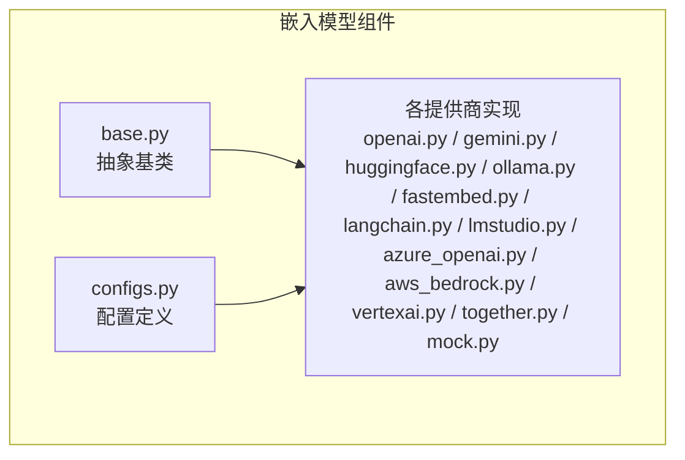
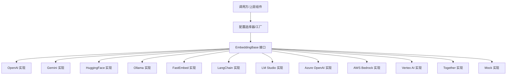
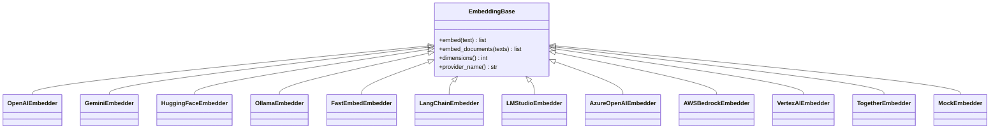
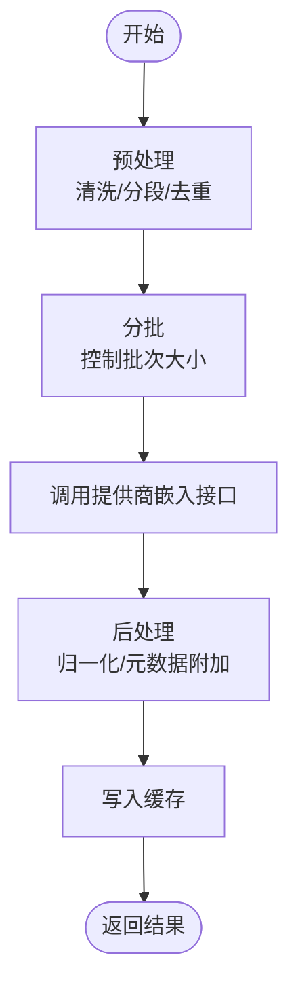
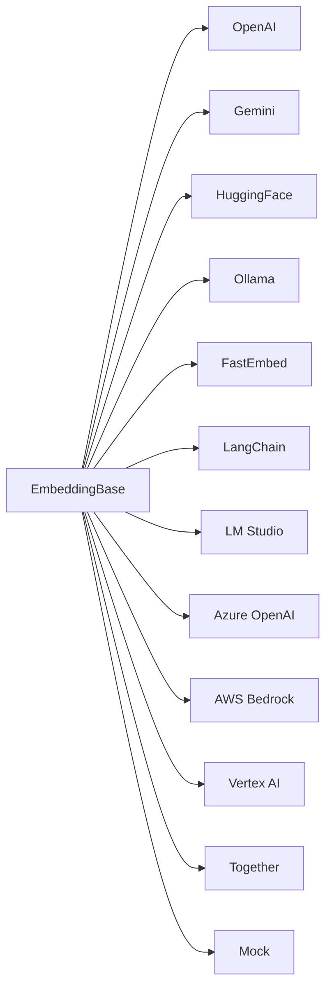

# 嵌入模型组件

<cite>
**本文档引用的文件**
- [mem0/embeddings/base.py](file://mem0/embeddings/base.py)
- [mem0/embeddings/configs.py](file://mem0/embeddings/configs.py)
- [mem0/embeddings/openai.py](file://mem0/embeddings/openai.py)
- [mem0/embeddings/gemini.py](file://mem0/embeddings/gemini.py)
- [mem0/embeddings/huggingface.py](file://mem0/embeddings/huggingface.py)
- [mem0/embeddings/ollama.py](file://mem0/embeddings/ollama.py)
- [mem0/embeddings/fastembed.py](file://mem0/embeddings/fastembed.py)
- [mem0/embeddings/langchain.py](file://mem0/embeddings/langchain.py)
- [mem0/embeddings/lmstudio.py](file://mem0/embeddings/lmstudio.py)
- [mem0/embeddings/azure_openai.py](file://mem0/embeddings/azure_openai.py)
- [mem0/embeddings/aws_bedrock.py](file://mem0/embeddings/aws_bedrock.py)
- [mem0/embeddings/vertexai.py](file://mem0/embeddings/vertexai.py)
- [mem0/embeddings/together.py](file://mem0/embeddings/together.py)
- [mem0/embeddings/mock.py](file://mem0/embeddings/mock.py)
- [mem0/configs/embeddings/](file://mem0/configs/embeddings/)
- [tests/embeddings/](file://tests/embeddings/)
- [docs/components/embedders/overview.mdx](file://docs/components/embedders/overview.mdx)
- [docs/components/embedders/config.mdx](file://docs/components/embedders/config.mdx)
</cite>

## 目录
1. [简介](#简介)
2. [项目结构](#项目结构)
3. [核心组件](#核心组件)
4. [架构总览](#架构总览)
5. [详细组件分析](#详细组件分析)
6. [依赖关系分析](#依赖关系分析)
7. [性能考虑](#性能考虑)
8. [故障排除指南](#故障排除指南)
9. [结论](#结论)
10. [附录](#附录)

## 简介
本文件系统性梳理嵌入模型组件的设计与实现，覆盖基础架构、向量化原理、多提供商适配（OpenAI、Gemini、HuggingFace、Ollama、FastEmbed、LangChain、Azure OpenAI、AWS Bedrock、Vertex AI、Together、LM Studio、Mock）、批量嵌入、缓存策略、性能优化、本地部署与混合模式配置，并给出成本控制与质量保证的最佳实践。

## 项目结构
嵌入模型组件位于 mem0/embeddings 目录下，采用“按提供商分文件”的模块化组织方式，每个提供商对应一个独立实现文件；同时提供统一的基类与配置管理，便于扩展与替换。

图表来源
- [mem0/embeddings/base.py](file://mem0/embeddings/base.py)
- [mem0/embeddings/configs.py](file://mem0/embeddings/configs.py)
- [mem0/embeddings/openai.py](file://mem0/embeddings/openai.py)
- [mem0/embeddings/gemini.py](file://mem0/embeddings/gemini.py)
- [mem0/embeddings/huggingface.py](file://mem0/embeddings/huggingface.py)
- [mem0/embeddings/ollama.py](file://mem0/embeddings/ollama.py)
- [mem0/embeddings/fastembed.py](file://mem0/embeddings/fastembed.py)
- [mem0/embeddings/langchain.py](file://mem0/embeddings/langchain.py)
- [mem0/embeddings/lmstudio.py](file://mem0/embeddings/lmstudio.py)
- [mem0/embeddings/azure_openai.py](file://mem0/embeddings/azure_openai.py)
- [mem0/embeddings/aws_bedrock.py](file://mem0/embeddings/aws_bedrock.py)
- [mem0/embeddings/vertexai.py](file://mem0/embeddings/vertexai.py)
- [mem0/embeddings/together.py](file://mem0/embeddings/together.py)
- [mem0/embeddings/mock.py](file://mem0/embeddings/mock.py)

章节来源
- [mem0/embeddings/base.py](file://mem0/embeddings/base.py)
- [mem0/embeddings/configs.py](file://mem0/embeddings/configs.py)

## 核心组件
- 抽象基类：定义统一的嵌入接口规范，包括文本到向量的转换方法、批量处理能力、元数据与维度信息等。
- 配置管理：集中管理各提供商的配置项、默认值与校验逻辑，确保在不同运行环境下的可移植性。
- 提供商实现：针对不同后端（云端API、本地推理引擎、第三方服务）提供具体实现，屏蔽差异。
- 测试与文档：配套测试用例与官方文档，覆盖功能验证与使用说明。

章节来源
- [mem0/embeddings/base.py](file://mem0/embeddings/base.py)
- [mem0/embeddings/configs.py](file://mem0/embeddings/configs.py)

## 架构总览
整体架构遵循“统一接口 + 多实现 + 配置驱动”的设计原则，通过工厂或配置选择器加载具体提供商实现，实现对上层透明。

图表来源
- [mem0/embeddings/base.py](file://mem0/embeddings/base.py)
- [mem0/embeddings/openai.py](file://mem0/embeddings/openai.py)
- [mem0/embeddings/gemini.py](file://mem0/embeddings/gemini.py)
- [mem0/embeddings/huggingface.py](file://mem0/embeddings/huggingface.py)
- [mem0/embeddings/ollama.py](file://mem0/embeddings/ollama.py)
- [mem0/embeddings/fastembed.py](file://mem0/embeddings/fastembed.py)
- [mem0/embeddings/langchain.py](file://mem0/embeddings/langchain.py)
- [mem0/embeddings/lmstudio.py](file://mem0/embeddings/lmstudio.py)
- [mem0/embeddings/azure_openai.py](file://mem0/embeddings/azure_openai.py)
- [mem0/embeddings/aws_bedrock.py](file://mem0/embeddings/aws_bedrock.py)
- [mem0/embeddings/vertexai.py](file://mem0/embeddings/vertexai.py)
- [mem0/embeddings/together.py](file://mem0/embeddings/together.py)
- [mem0/embeddings/mock.py](file://mem0/embeddings/mock.py)

## 详细组件分析

### 基类与接口设计
- 统一方法签名：提供 embed 文本向量化与 embed_documents 批量向量化接口，返回标准化的向量数组与元数据。
- 维度与元数据：嵌入结果包含向量维度、提供商标识、时间戳等元信息，便于后续检索与调试。
- 异常与错误码：定义清晰的异常类型与错误码，便于上层捕获与降级处理。

图表来源
- [mem0/embeddings/base.py](file://mem0/embeddings/base.py)
- [mem0/embeddings/openai.py](file://mem0/embeddings/openai.py)
- [mem0/embeddings/gemini.py](file://mem0/embeddings/gemini.py)
- [mem0/embeddings/huggingface.py](file://mem0/embeddings/huggingface.py)
- [mem0/embeddings/ollama.py](file://mem0/embeddings/ollama.py)
- [mem0/embeddings/fastembed.py](file://mem0/embeddings/fastembed.py)
- [mem0/embeddings/langchain.py](file://mem0/embeddings/langchain.py)
- [mem0/embeddings/lmstudio.py](file://mem0/embeddings/lmstudio.py)
- [mem0/embeddings/azure_openai.py](file://mem0/embeddings/azure_openai.py)
- [mem0/embeddings/aws_bedrock.py](file://mem0/embeddings/aws_bedrock.py)
- [mem0/embeddings/vertexai.py](file://mem0/embeddings/vertexai.py)
- [mem0/embeddings/together.py](file://mem0/embeddings/together.py)
- [mem0/embeddings/mock.py](file://mem0/embeddings/mock.py)

章节来源
- [mem0/embeddings/base.py](file://mem0/embeddings/base.py)

### OpenAI 嵌入
- 适用场景：高质量通用语义向量，适合广泛检索任务。
- 关键特性：支持批量请求、流式与非流式两种模式、可选自定义模型名称。
- 性能与成本：按字符/令牌计费，建议合并短文本以降低请求次数；可启用缓存减少重复计算。
- 配置要点：API 密钥、基础URL、超时、并发限制、模型名称与尺寸。

章节来源
- [mem0/embeddings/openai.py](file://mem0/embeddings/openai.py)

### Gemini 嵌入
- 适用场景：Google 生态集成、多语言支持良好。
- 关键特性：支持文本与图像（多模态）向量化（视具体模型），批量处理能力。
- 性能与成本：按请求次数计费，注意控制批次大小与并发。
- 配置要点：项目ID、凭证、模型名称、请求超时、批大小。

章节来源
- [mem0/embeddings/gemini.py](file://mem0/embeddings/gemini.py)

### HuggingFace 嵌入
- 适用场景：开源模型、隐私敏感场景、可定制模型。
- 关键特性：支持本地模型加载与远程推理；可配置模型仓库、设备与精度。
- 性能与成本：本地部署零请求成本，但需考虑硬件资源；远程推理按请求计费。
- 配置要点：模型ID、是否本地、设备（CPU/GPU）、安全令牌、批大小。

章节来源
- [mem0/embeddings/huggingface.py](file://mem0/embeddings/huggingface.py)

### Ollama 嵌入
- 适用场景：本地私有化部署、低延迟实时向量生成。
- 关键特性：轻量、易部署，支持多种开源嵌入模型；可与本地大模型协同。
- 性能与成本：零外部请求成本，受本地硬件限制。
- 配置要点：服务地址、模型名称、超时、批大小、设备选择。

章节来源
- [mem0/embeddings/ollama.py](file://mem0/embeddings/ollama.py)

### FastEmbed 嵌入
- 适用场景：高性能、低延迟的工业级嵌入，支持多模型族。
- 关键特性：C++加速、内存占用低、支持稀疏与稠密向量；内置缓存与批处理。
- 性能与成本：本地部署，无网络请求成本；吞吐高、延迟低。
- 配置要点：模型名称、禁用浮点运算、批大小、缓存目录。

章节来源
- [mem0/embeddings/fastembed.py](file://mem0/embeddings/fastembed.py)

### LangChain 嵌入
- 适用场景：与 LangChain 生态集成，统一抽象第三方嵌入。
- 关键特性：适配多种后端（OpenAI、HuggingFace、Vertex AI 等），支持回调与链式处理。
- 性能与成本：取决于底层提供商；可通过批处理与缓存优化。
- 配置要点：底层嵌入实例、批大小、回调钩子。

章节来源
- [mem0/embeddings/langchain.py](file://mem0/embeddings/langchain.py)

### LM Studio 嵌入
- 适用场景：本地桌面/服务器部署，适合开发与小规模生产。
- 关键特性：简单易用，支持多种开源模型；可与本地大模型共存。
- 性能与成本：本地部署，零请求成本。
- 配置要点：服务地址、模型名称、批大小、超时。

章节来源
- [mem0/embeddings/lmstudio.py](file://mem0/embeddings/lmstudio.py)

### Azure OpenAI 嵌入
- 适用场景：企业级合规与托管，与 Azure 生态深度集成。
- 关键特性：支持专用集群、RBAC、审计日志；可选模型版本与部署名称。
- 性能与成本：按请求计费，建议结合缓存与批处理。
- 配置要点：订阅号、资源组、端点、密钥、部署名称、超时。

章节来源
- [mem0/embeddings/azure_openai.py](file://mem0/embeddings/azure_openai.py)

### AWS Bedrock 嵌入
- 适用场景：云原生企业应用，多提供商统一接入。
- 关键特性：统一API访问多家模型供应商；支持加密与合规。
- 性能与成本：按请求计费，建议设置合理的批大小与重试策略。
- 配置要点：区域、模型ID、认证凭据、超时、批大小。

章节来源
- [mem0/embeddings/aws_bedrock.py](file://mem0/embeddings/aws_bedrock.py)

### Vertex AI 嵌入
- 适用场景：Google Cloud 原生应用，与 GCS、IAM 等服务联动。
- 关键特性：支持多模型族；可配置项目ID与服务账户。
- 性能与成本：按请求计费，建议批处理与缓存。
- 配置要点：项目ID、凭证、模型名称、批大小、超时。

章节来源
- [mem0/embeddings/vertexai.py](file://mem0/embeddings/vertexai.py)

### Together 嵌入
- 适用场景：聚合多家模型的高性能嵌入服务。
- 关键特性：统一接口聚合多个提供商；支持自动切换与回退。
- 性能与成本：按请求计费，建议结合缓存与批处理。
- 配置要点：API 密钥、模型族、批大小、超时。

章节来源
- [mem0/embeddings/together.py](file://mem0/embeddings/together.py)

### Mock 嵌入
- 适用场景：测试与演示，快速验证流程。
- 关键特性：固定输出或随机向量，便于单元测试与集成测试。
- 性能与成本：无外部依赖，成本为零。
- 配置要点：维度、输出模式、随机种子（可选）。

章节来源
- [mem0/embeddings/mock.py](file://mem0/embeddings/mock.py)

### 向量化原理与批量处理
- 向量化流程：输入文本 → 分词/编码 → 模型前向 → 归一化/投影 → 输出向量。
- 批量策略：合并短文本、控制批次大小、异步并发、结果拼接与去重。
- 缓存策略：基于内容哈希的键，避免重复计算；设置TTL与容量上限；区分热/冷数据。

图表来源
- [mem0/embeddings/base.py](file://mem0/embeddings/base.py)

## 依赖关系分析
- 内聚性：各提供商实现内聚于自身特性的封装，接口对外保持一致。
- 耦合性：通过统一基类与配置管理降低耦合；新增提供商只需实现基类接口。
- 外部依赖：各提供商依赖其官方 SDK 或 HTTP 客户端；统一错误处理与重试机制。

图表来源
- [mem0/embeddings/base.py](file://mem0/embeddings/base.py)
- [mem0/embeddings/openai.py](file://mem0/embeddings/openai.py)
- [mem0/embeddings/gemini.py](file://mem0/embeddings/gemini.py)
- [mem0/embeddings/huggingface.py](file://mem0/embeddings/huggingface.py)
- [mem0/embeddings/ollama.py](file://mem0/embeddings/ollama.py)
- [mem0/embeddings/fastembed.py](file://mem0/embeddings/fastembed.py)
- [mem0/embeddings/langchain.py](file://mem0/embeddings/langchain.py)
- [mem0/embeddings/lmstudio.py](file://mem0/embeddings/lmstudio.py)
- [mem0/embeddings/azure_openai.py](file://mem0/embeddings/azure_openai.py)
- [mem0/embeddings/aws_bedrock.py](file://mem0/embeddings/aws_bedrock.py)
- [mem0/embeddings/vertexai.py](file://mem0/embeddings/vertexai.py)
- [mem0/embeddings/together.py](file://mem0/embeddings/together.py)
- [mem0/embeddings/mock.py](file://mem0/embeddings/mock.py)

## 性能考虑
- 批量优化：合理设置批大小，避免过小导致频繁往返与过大导致内存压力；对长文本进行分段。
- 并发控制：限制并发数，避免触发第三方限流；对失败请求进行指数退避重试。
- 缓存策略：启用内容哈希缓存，设置TTL与容量上限；区分热数据与冷数据，定期清理。
- 本地优先：在满足延迟与准确率前提下优先本地部署（如 Ollama/FastEmbed），减少网络开销。
- 混合模式：对高价值/高敏感数据走私有部署，普通数据走云端，动态分流与回退。

## 故障排除指南
- 认证失败：检查密钥、端点、代理与网络连通性；确认模型部署状态。
- 超时与限流：降低并发与批大小，增加重试与退避；必要时切换至备用提供商。
- 维度不匹配：核对配置中的维度与实际返回维度一致性；检查模型族与版本。
- 缓存命中率低：检查缓存键生成规则与内容去重策略；确保输入标准化。
- 日志与监控：开启详细日志与指标采集，定位慢查询与异常请求。

章节来源
- [tests/embeddings/](file://tests/embeddings/)
- [mem0/embeddings/openai.py](file://mem0/embeddings/openai.py)
- [mem0/embeddings/ollama.py](file://mem0/embeddings/ollama.py)
- [mem0/embeddings/fastembed.py](file://mem0/embeddings/fastembed.py)

## 结论
该嵌入模型组件通过统一接口与模块化设计，实现了对多提供商的无缝适配与灵活切换。结合批量处理、缓存与本地部署策略，可在性能、成本与质量之间取得平衡。建议在生产环境中采用混合模式与监控告警，持续优化配置与缓存策略。

## 附录
- 配置参考：各提供商的配置项、默认值与示例可参考官方文档与配置文件。
- 快速开始：参考文档中的概览与配置指南，选择合适的提供商与部署模式。
- 最佳实践：统一维度、启用缓存、控制批大小与并发、定期评估与切换提供商。

章节来源
- [docs/components/embedders/overview.mdx](file://docs/components/embedders/overview.mdx)
- [docs/components/embedders/config.mdx](file://docs/components/embedders/config.mdx)
- [mem0/configs/embeddings/](file://mem0/configs/embeddings/)