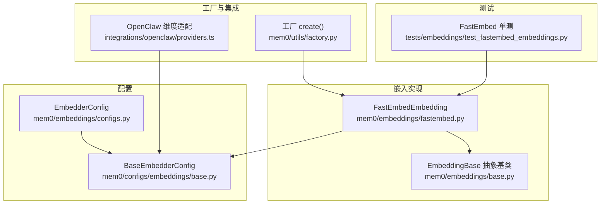
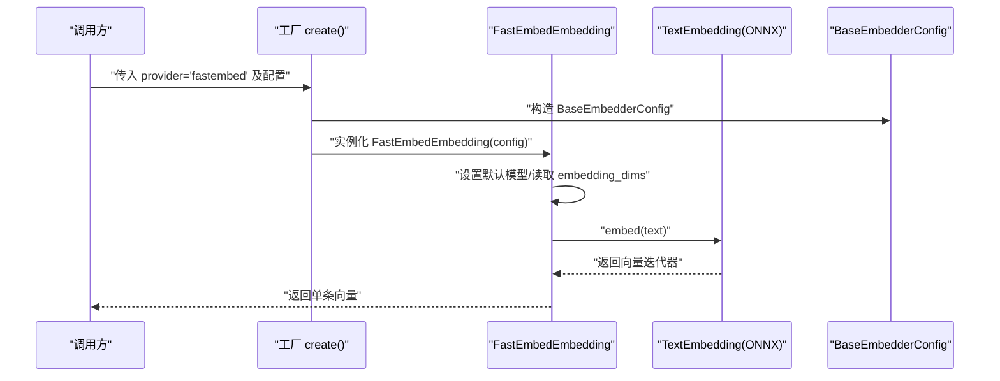
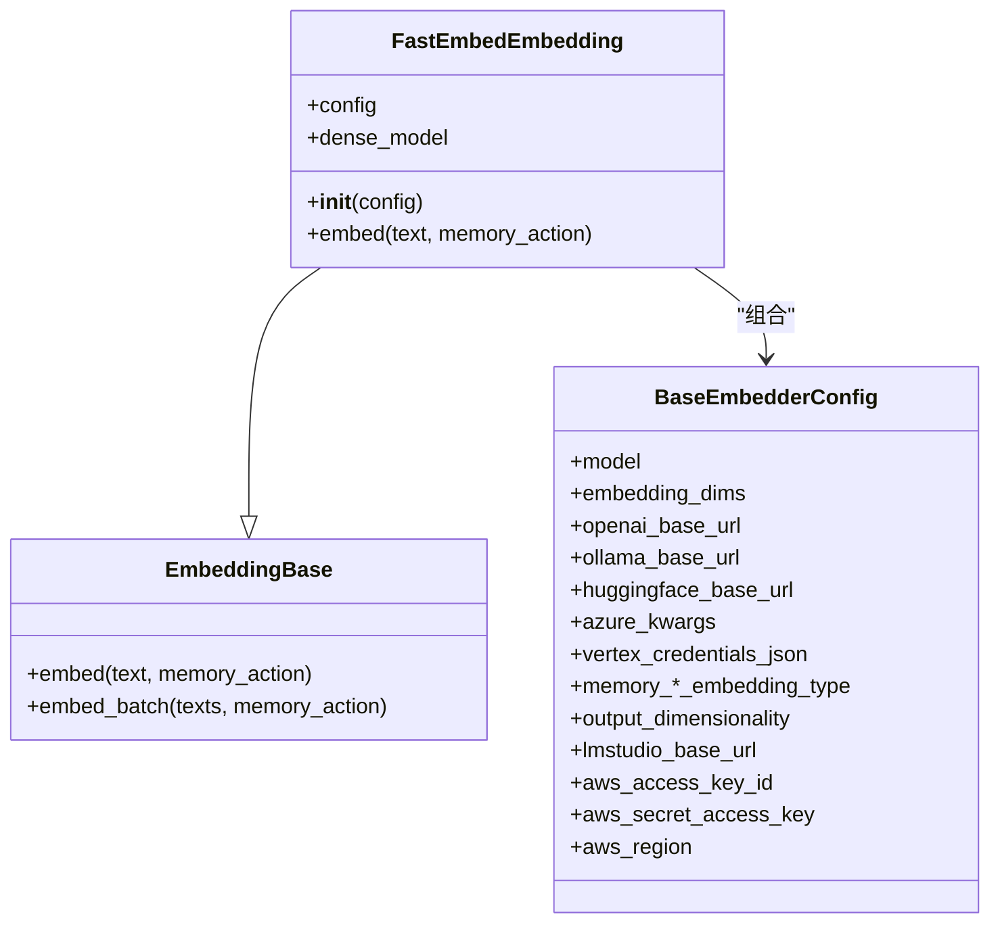
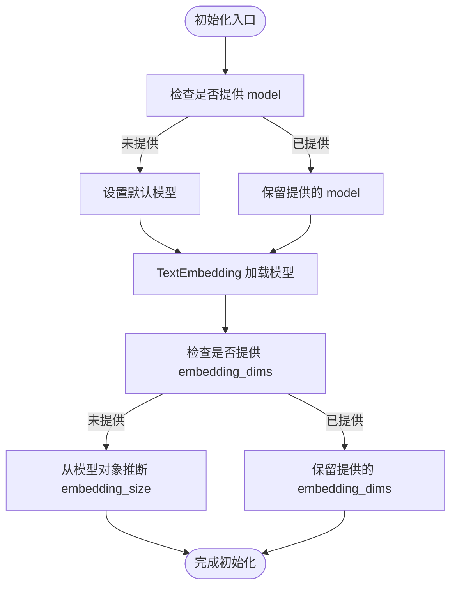
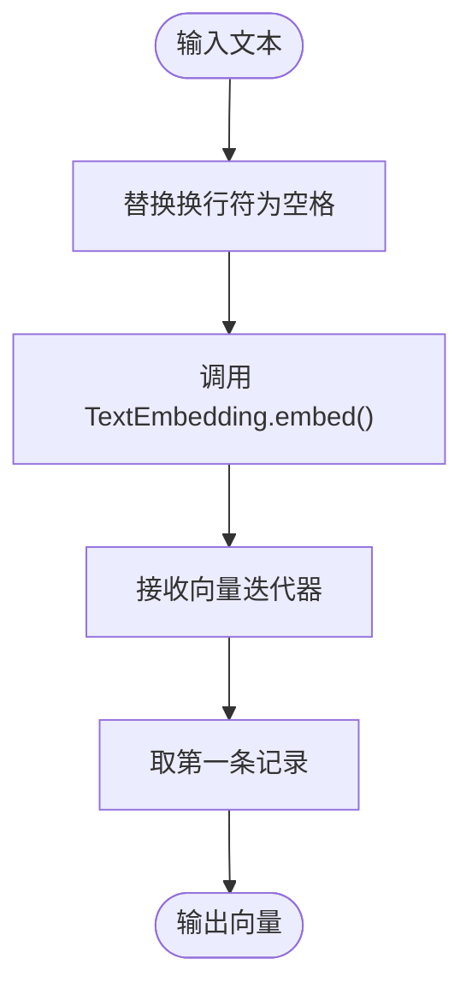
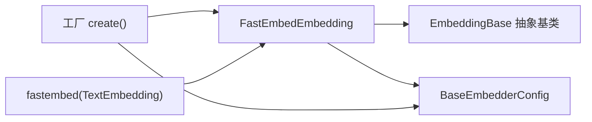

# FastEmbed 本地模型

<cite>
**本文引用的文件**
- [fastembed.py](file://mem0/embeddings/fastembed.py)
- [base.py（嵌入基类）](file://mem0/embeddings/base.py)
- [configs.py（嵌入配置）](file://mem0/embeddings/configs.py)
- [base.py（嵌入配置基类）](file://mem0/configs/embeddings/base.py)
- [factory.py](file://mem0/utils/factory.py)
- [test_fastembed_embeddings.py](file://tests/embeddings/test_fastembed_embeddings.py)
- [poetry.lock](file://poetry.lock)
- [providers.ts](file://integrations/openclaw/providers.ts)
</cite>

## 目录
1. [简介](#简介)
2. [项目结构](#项目结构)
3. [核心组件](#核心组件)
4. [架构总览](#架构总览)
5. [组件详解](#组件详解)
6. [依赖关系分析](#依赖关系分析)
7. [性能与内存特性](#性能与内存特性)
8. [模型选择与配置建议](#模型选择与配置建议)
9. [批量处理与并发优化](#批量处理与并发优化)
10. [与其他嵌入提供商的对比](#与其他嵌入提供商的对比)
11. [迁移指南](#迁移指南)
12. [故障排查](#故障排查)
13. [结论](#结论)

## 简介
本文件面向希望在本地部署与运行嵌入模型的用户，系统性介绍 FastEmbed 在 mem0 中作为本地嵌入提供商的实现方式与使用方法。内容覆盖初始化流程、模型加载机制、向量生成算法、支持的模型类型、性能与内存特征、批量与并发优化策略、与其他提供商的对比以及迁移路径。

## 项目结构
与 FastEmbed 相关的关键文件位于 Python 后端模块中，采用“按功能域分层”的组织方式：
- 嵌入基类与具体实现：mem0/embeddings/
- 配置模型与工厂：mem0/configs/embeddings/、mem0/utils/factory.py
- 测试用例：tests/embeddings/test_fastembed_embeddings.py
- 依赖声明：poetry.lock

**图表来源**
- [fastembed.py:1-33](file://mem0/embeddings/fastembed.py#L1-L33)
- [base.py（嵌入基类）:1-48](file://mem0/embeddings/base.py#L1-L48)
- [configs.py（嵌入配置）:1-32](file://mem0/embeddings/configs.py#L1-L32)
- [base.py（嵌入配置基类）:1-111](file://mem0/configs/embeddings/base.py#L1-L111)
- [factory.py:155-165](file://mem0/utils/factory.py#L155-L165)
- [providers.ts:328-353](file://integrations/openclaw/providers.ts#L328-L353)
- [test_fastembed_embeddings.py:1-46](file://tests/embeddings/test_fastembed_embeddings.py#L1-L46)

**章节来源**
- [fastembed.py:1-33](file://mem0/embeddings/fastembed.py#L1-L33)
- [base.py（嵌入基类）:1-48](file://mem0/embeddings/base.py#L1-L48)
- [configs.py（嵌入配置）:1-32](file://mem0/embeddings/configs.py#L1-L32)
- [base.py（嵌入配置基类）:1-111](file://mem0/configs/embeddings/base.py#L1-L111)
- [factory.py:155-165](file://mem0/utils/factory.py#L155-L165)
- [providers.ts:328-353](file://integrations/openclaw/providers.ts#L328-L353)
- [test_fastembed_embeddings.py:1-46](file://tests/embeddings/test_fastembed_embeddings.py#L1-L46)

## 核心组件
- FastEmbedEmbedding：基于 fastembed.TextEmbedding 的本地嵌入实现，负责文本到向量的转换。
- EmbeddingBase：所有嵌入提供商的抽象基类，定义统一接口与默认的批量处理行为。
- BaseEmbedderConfig：通用嵌入配置模型，包含模型名、维度、代理、平台特定参数等。
- EmbedderConfig：上层配置模型，校验 provider 是否为受支持列表，其中包含 "fastembed"。
- 工厂 create()：根据 provider 名称动态实例化对应嵌入器，并注入 BaseEmbedderConfig。
- 测试用例：验证模型初始化、换行符清理、维度设置等行为。

**章节来源**
- [fastembed.py:11-32](file://mem0/embeddings/fastembed.py#L11-L32)
- [base.py（嵌入基类）:7-47](file://mem0/embeddings/base.py#L7-L47)
- [base.py（嵌入配置基类）:10-111](file://mem0/configs/embeddings/base.py#L10-L111)
- [configs.py（嵌入配置）:6-31](file://mem0/embeddings/configs.py#L6-L31)
- [factory.py:155-165](file://mem0/utils/factory.py#L155-L165)
- [test_fastembed_embeddings.py:13-46](file://tests/embeddings/test_fastembed_embeddings.py#L13-L46)

## 架构总览
FastEmbed 在 mem0 中以“本地 ONNX 运行时”方式工作，通过 TextEmbedding 加载模型并生成向量。整体调用链如下：

**图表来源**
- [factory.py:155-165](file://mem0/utils/factory.py#L155-L165)
- [fastembed.py:12-32](file://mem0/embeddings/fastembed.py#L12-L32)
- [base.py（嵌入配置基类）:15-111](file://mem0/configs/embeddings/base.py#L15-L111)

## 组件详解

### FastEmbedEmbedding 类
- 初始化逻辑
  - 若未指定模型名，则回退至默认模型。
  - 使用 TextEmbedding(model_name=...) 加载模型。
  - 若未显式设置 embedding_dims，则从 dense_model.embedding_size 推断。
- 文本预处理
  - 将输入中的换行符替换为空格，避免模型输入异常。
- 向量生成
  - 调用 embed() 返回向量迭代器，取第一条记录作为结果。

**图表来源**
- [base.py（嵌入基类）:7-47](file://mem0/embeddings/base.py#L7-L47)
- [fastembed.py:11-32](file://mem0/embeddings/fastembed.py#L11-L32)
- [base.py（嵌入配置基类）:10-111](file://mem0/configs/embeddings/base.py#L10-L111)

**章节来源**
- [fastembed.py:11-32](file://mem0/embeddings/fastembed.py#L11-L32)
- [base.py（嵌入基类）:20-47](file://mem0/embeddings/base.py#L20-L47)
- [base.py（嵌入配置基类）:15-111](file://mem0/configs/embeddings/base.py#L15-L111)

### 初始化与模型加载机制
- 默认模型：若未提供 model，将使用内置默认值。
- 维度推断：若 embedding_dims 未设置，会从模型对象的 embedding_size 属性读取。
- ONNX 运行时：底层由 fastembed.TextEmbedding 驱动，具备本地推理能力。

**图表来源**
- [fastembed.py:12-19](file://mem0/embeddings/fastembed.py#L12-L19)

**章节来源**
- [fastembed.py:12-19](file://mem0/embeddings/fastembed.py#L12-L19)

### 向量生成算法与数据流
- 输入预处理：将换行符替换为空格，确保输入格式一致。
- 批量生成：embed() 内部对单条文本调用 embed() 并取第一个元素；如需批量，请使用 embed_batch() 或在上层循环调用。
- 输出：返回一维浮点数组，长度等于 embedding_dims。

**图表来源**
- [fastembed.py:21-32](file://mem0/embeddings/fastembed.py#L21-L32)

**章节来源**
- [fastembed.py:21-32](file://mem0/embeddings/fastembed.py#L21-L32)

### 支持的模型类型
- 默认模型：当未指定 model 时，使用内置默认模型。
- 自定义模型：可通过配置传入任意受支持的 fastembed 模型名称。
- 维度兼容：若未显式设置 embedding_dims，将自动从模型对象读取。

**章节来源**
- [fastembed.py:15-19](file://mem0/embeddings/fastembed.py#L15-L19)

### 工厂与集成
- 工厂 create()：根据 provider 名称映射到具体类，构造 BaseEmbedderConfig 并实例化嵌入器。
- OpenClaw 集成：在向量存储初始化过程中，若未提供 embeddingModelDims 或 dimension，会尝试从配置中读取或延迟初始化，保证维度一致性。

**章节来源**
- [factory.py:155-165](file://mem0/utils/factory.py#L155-L165)
- [providers.ts:328-353](file://integrations/openclaw/providers.ts#L328-L353)

## 依赖关系分析
- 外部依赖：fastembed（版本号见 poetry.lock），描述为“快速、轻量、准确的检索嵌入生成库”，用于本地 ONNX 推理。
- 内部依赖：FastEmbedEmbedding 继承自 EmbeddingBase，组合 BaseEmbedderConfig；工厂通过 provider 名称解析类并实例化。

**图表来源**
- [fastembed.py:3-4](file://mem0/embeddings/fastembed.py#L3-L4)
- [base.py（嵌入基类）:1-4](file://mem0/embeddings/base.py#L1-L4)
- [factory.py:155-165](file://mem0/utils/factory.py#L155-L165)
- [poetry.lock:1608-1614](file://poetry.lock#L1608-L1614)

**章节来源**
- [fastembed.py:3-4](file://mem0/embeddings/fastembed.py#L3-L4)
- [factory.py:155-165](file://mem0/utils/factory.py#L155-L165)
- [poetry.lock:1608-1614](file://poetry.lock#L1608-L1614)

## 性能与内存特性
- 运行时：基于 ONNX Runtime 的本地推理，避免网络调用，延迟低、吞吐高。
- 模型大小：具体取决于所选模型；默认模型与自定义模型的 embedding_size 不同，应按需配置 embedding_dims。
- 批量能力：当前 embed() 逐条处理；如需更高吞吐，可使用 embed_batch() 或在上层并发调用。
- 内存占用：受模型规模与输入长度影响；建议在生产环境监控内存峰值并结合批量/并发策略优化。

[本节为通用性能讨论，不直接分析具体文件]

## 模型选择与配置建议
- 默认模型优先：未指定 model 时使用内置默认值，适合快速起步。
- 明确维度：若使用第三方模型，建议显式设置 embedding_dims，避免运行时推断带来的不确定性。
- 平台参数：如需代理访问或跨平台部署，可在 BaseEmbedderConfig 中配置相应参数（例如 http_client_proxies、base_url 等）。
- OpenClaw 集成：若与向量存储联动，确保 embeddingModelDims 或 dimension 正确传递，避免初始化失败。

**章节来源**
- [fastembed.py:15-19](file://mem0/embeddings/fastembed.py#L15-L19)
- [base.py（嵌入配置基类）:15-111](file://mem0/configs/embeddings/base.py#L15-L111)
- [providers.ts:328-353](file://integrations/openclaw/providers.ts#L328-L353)

## 批量处理与并发优化
- 默认批量策略：EmbeddingBase.embed_batch() 采用顺序调用 embed() 的方式，子类可覆写以获得原生批处理能力。
- FastEmbed 当前实现：embed() 逐条生成向量；建议在上层并发执行 embed() 或使用 embed_batch()（如子类实现）。
- 并发建议：结合业务场景，使用线程池/进程池或异步任务队列，控制并发度与内存峰值，避免过载。

**章节来源**
- [base.py（嵌入基类）:33-47](file://mem0/embeddings/base.py#L33-L47)
- [fastembed.py:21-32](file://mem0/embeddings/fastembed.py#L21-L32)

## 与其他嵌入提供商的对比
- 对比维度
  - 部署形态：FastEmbed 为本地 ONNX 推理；其他提供商多为云端服务或本地 LLM 引擎（如 Ollama）。
  - 初始化与依赖：FastEmbed 仅需安装 fastembed；其他提供商可能需要额外 SDK 或本地服务。
  - 维度与模型：FastEmbed 通过 embedding_size 推断维度；其他提供商可能有各自的维度查询接口或固定值。
  - 批处理：部分提供商（如 OpenAI）提供原生批量 API；FastEmbed 当前以逐条处理为主。
- 选择建议
  - 低延迟与离线可用：优先 FastEmbed。
  - 云服务生态：可考虑 OpenAI、Azure OpenAI、Gemini、Vertex AI 等。
  - 本地大模型：可考虑 Ollama、LM Studio 等。

[本节为概念性对比说明，不直接分析具体文件]

## 迁移指南
- 从云端提供商迁移到 FastEmbed
  - 更新配置：将 provider 从 "openai"/"azure_openai"/"gemini" 等改为 "fastembed"。
  - 设置模型与维度：明确 model 与 embedding_dims，避免运行时推断差异。
  - 调整批量策略：如需更高吞吐，使用 embed_batch() 或上层并发。
- 从本地 LLM 引擎迁移到 FastEmbed
  - 移除引擎依赖：不再需要本地服务或长连接。
  - 统一向量维度：确保向量存储与嵌入器维度一致（参考 OpenClaw 维度适配逻辑）。

**章节来源**
- [configs.py（嵌入配置）:6-31](file://mem0/embeddings/configs.py#L6-L31)
- [factory.py:155-165](file://mem0/utils/factory.py#L155-L165)
- [providers.ts:328-353](file://integrations/openclaw/providers.ts#L328-L353)

## 故障排查
- 未安装 fastembed
  - 现象：导入时报错，提示需安装 fastembed。
  - 处理：按照错误提示安装对应版本。
- 换行符导致输入异常
  - 现象：文本中换行符影响模型输入。
  - 处理：确认输入已被替换为空格；测试用例验证了该行为。
- 维度不匹配
  - 现象：向量存储初始化失败或检索异常。
  - 处理：显式设置 embedding_dims，或确保从模型对象正确推断。

**章节来源**
- [fastembed.py:6-9](file://mem0/embeddings/fastembed.py#L6-L9)
- [test_fastembed_embeddings.py:35-46](file://tests/embeddings/test_fastembed_embeddings.py#L35-L46)
- [providers.ts:328-353](file://integrations/openclaw/providers.ts#L328-L353)

## 结论
FastEmbed 作为本地嵌入提供商，凭借 ONNX 运行时实现了低延迟与高吞吐的嵌入生成能力。通过清晰的初始化流程、灵活的配置模型与工厂化实例化，能够快速集成到 mem0 的记忆与检索体系中。建议在生产环境中明确模型与维度、合理规划批量与并发策略，并结合向量存储的维度适配逻辑，获得稳定高效的检索体验。