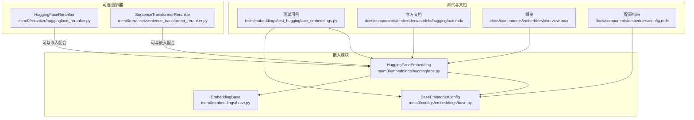
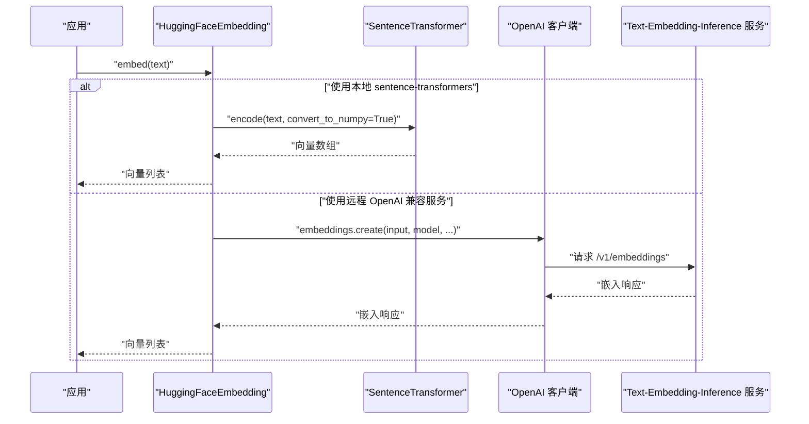
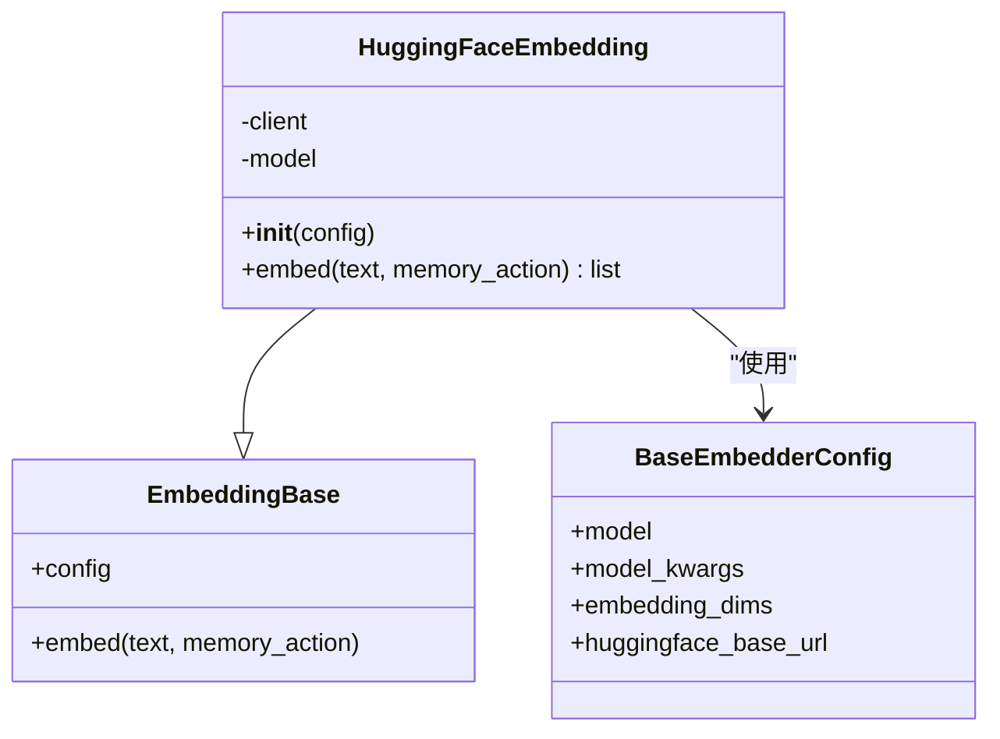
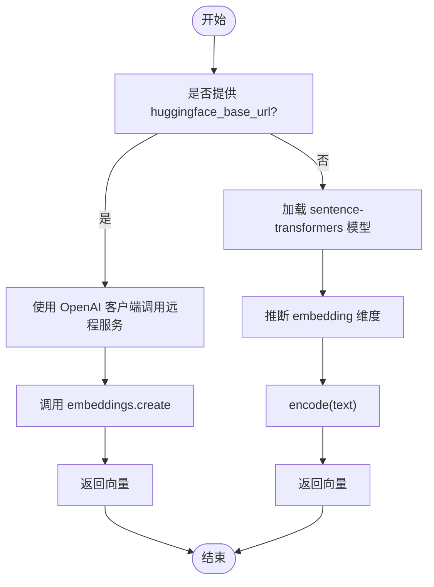
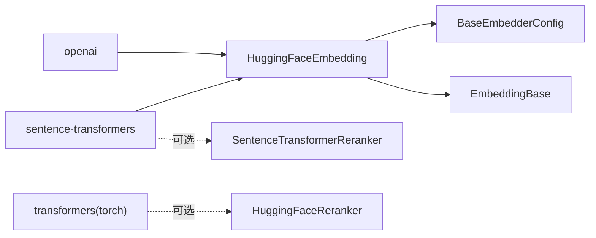

# HuggingFace 本地模型

<cite>
**本文引用的文件**
- [huggingface.py](file://mem0/embeddings/huggingface.py)
- [test_huggingface_embeddings.py](file://tests/embeddings/test_huggingface_embeddings.py)
- [base.py](file://mem0/configs/embeddings/base.py)
- [base.py](file://mem0/embeddings/base.py)
- [huggingface.mdx](file://docs/components/embedders/models/huggingface.mdx)
- [overview.mdx](file://docs/components/embedders/overview.mdx)
- [config.mdx](file://docs/components/embedders/config.mdx)
- [huggingface_reranker.py](file://mem0/reranker/huggingface_reranker.py)
- [sentence_transformer_reranker.py](file://mem0/reranker/sentence_transformer_reranker.py)
</cite>

## 目录
1. [简介](#简介)
2. [项目结构](#项目结构)
3. [核心组件](#核心组件)
4. [架构总览](#架构总览)
5. [详细组件分析](#详细组件分析)
6. [依赖关系分析](#依赖关系分析)
7. [性能考虑](#性能考虑)
8. [故障排查指南](#故障排查指南)
9. [结论](#结论)
10. [附录](#附录)

## 简介
本文件面向在本地环境中使用 HuggingFace Transformers 的嵌入模型提供商，系统性说明如何在项目中集成与使用 sentence-transformers 模型，并覆盖以下主题：
- 模型下载、缓存与本地存储机制
- 不同类型嵌入模型（sentence-transformers）的配置与使用
- 模型选择指南、推理优化与资源管理建议
- 高级配置：模型量化、混合精度训练与分布式推理思路

同时，文档结合测试用例与官方文档片段，帮助读者快速上手并在生产环境中稳定运行。

## 项目结构
与 HuggingFace 本地嵌入相关的核心文件与位置如下：
- 嵌入实现：mem0/embeddings/huggingface.py
- 配置基类：mem0/configs/embeddings/base.py
- 嵌入基类：mem0/embeddings/base.py
- 测试用例：tests/embeddings/test_huggingface_embeddings.py
- 官方文档：docs/components/embedders/models/huggingface.mdx、docs/components/embedders/overview.mdx、docs/components/embedders/config.mdx
- 相关重排器（可选）：mem0/reranker/huggingface_reranker.py、mem0/reranker/sentence_transformer_reranker.py

**图表来源**
- [huggingface.py:15-44](file://mem0/embeddings/huggingface.py#L15-L44)
- [base.py](file://mem0/configs/embeddings/base.py)
- [base.py](file://mem0/embeddings/base.py)
- [test_huggingface_embeddings.py:1-103](file://tests/embeddings/test_huggingface_embeddings.py#L1-L103)
- [huggingface.mdx](file://docs/components/embedders/models/huggingface.mdx)
- [overview.mdx](file://docs/components/embedders/overview.mdx)
- [config.mdx](file://docs/components/embedders/config.mdx)
- [huggingface_reranker.py](file://mem0/reranker/huggingface_reranker.py)
- [sentence_transformer_reranker.py](file://mem0/reranker/sentence_transformer_reranker.py)

**章节来源**
- [huggingface.py:15-44](file://mem0/embeddings/huggingface.py#L15-L44)
- [base.py](file://mem0/configs/embeddings/base.py)
- [base.py](file://mem0/embeddings/base.py)
- [test_huggingface_embeddings.py:1-103](file://tests/embeddings/test_huggingface_embeddings.py#L1-L103)
- [huggingface.mdx](file://docs/components/embedders/models/huggingface.mdx)
- [overview.mdx](file://docs/components/embedders/overview.mdx)
- [config.mdx](file://docs/components/embedders/config.mdx)
- [huggingface_reranker.py](file://mem0/reranker/huggingface_reranker.py)
- [sentence_transformer_reranker.py](file://mem0/reranker/sentence_transformer_reranker.py)

## 核心组件
- HuggingFaceEmbedding：基于 sentence-transformers 的本地嵌入生成器；支持通过 huggingface_base_url 使用兼容 OpenAI 接口的本地服务（如 Text-Embedding-Inference），或直接加载本地模型。
- BaseEmbedderConfig：嵌入配置基类，包含 model、model_kwargs、embedding_dims、huggingface_base_url 等关键字段。
- EmbeddingBase：嵌入抽象基类，统一接口规范。
- 测试用例：验证默认模型、自定义模型、设备参数传递、维度设置以及自定义 base_url 的行为。

关键点：
- 当未提供 huggingface_base_url 时，默认使用 sentence-transformers 加载模型，并自动推断 embedding 维度。
- 当提供 huggingface_base_url 时，内部使用 OpenAI 兼容客户端调用远程服务，保持一致的接口返回格式。
- 支持通过 model_kwargs 向底层模型传递设备等参数（例如 device="cuda"）。

**章节来源**
- [huggingface.py:15-44](file://mem0/embeddings/huggingface.py#L15-L44)
- [base.py](file://mem0/configs/embeddings/base.py)
- [base.py](file://mem0/embeddings/base.py)
- [test_huggingface_embeddings.py:18-103](file://tests/embeddings/test_huggingface_embeddings.py#L18-L103)

## 架构总览
下图展示了 HuggingFace 本地嵌入的两种工作模式：本地 sentence-transformers 模式与远程 OpenAI 兼容服务模式。

**图表来源**
- [huggingface.py:29-44](file://mem0/embeddings/huggingface.py#L29-L44)
- [test_huggingface_embeddings.py:75-103](file://tests/embeddings/test_huggingface_embeddings.py#L75-L103)

## 详细组件分析

### HuggingFaceEmbedding 类
该类继承自 EmbeddingBase，负责根据配置选择本地或远程模式进行嵌入计算。

要点说明：
- 初始化逻辑：若提供 huggingface_base_url，则使用 OpenAI 客户端；否则使用 sentence-transformers 加载模型并推断维度。
- embed 方法：本地模式直接 encode 返回；远程模式通过 embeddings.create 获取向量。
- 日志级别控制：抑制 transformers/sentence_transformers/huggingface_hub 的冗余日志输出。

**图表来源**
- [huggingface.py:15-44](file://mem0/embeddings/huggingface.py#L15-L44)
- [base.py](file://mem0/embeddings/base.py)
- [base.py](file://mem0/configs/embeddings/base.py)

**章节来源**
- [huggingface.py:15-44](file://mem0/embeddings/huggingface.py#L15-L44)
- [base.py](file://mem0/configs/embeddings/base.py)
- [base.py](file://mem0/embeddings/base.py)

### 测试流程与行为验证
测试用例覆盖了以下典型场景：
- 默认模型与自定义模型的行为差异
- 通过 model_kwargs 传入设备参数（如 cuda）
- 自动/手动设置 embedding_dims
- 使用自定义 huggingface_base_url 调用远程服务

**图表来源**
- [huggingface.py:19-27](file://mem0/embeddings/huggingface.py#L19-L27)
- [huggingface.py:39-44](file://mem0/embeddings/huggingface.py#L39-L44)
- [test_huggingface_embeddings.py:18-103](file://tests/embeddings/test_huggingface_embeddings.py#L18-L103)

**章节来源**
- [test_huggingface_embeddings.py:18-103](file://tests/embeddings/test_huggingface_embeddings.py#L18-L103)

### 文档与配置参考
- 官方文档页面提供了嵌入器的使用说明、配置项与最佳实践，可作为部署与调优的权威参考。
- 配置文件与概览页面补充了嵌入器在整体系统中的定位与与其他组件的协作方式。

**章节来源**
- [huggingface.mdx](file://docs/components/embedders/models/huggingface.mdx)
- [overview.mdx](file://docs/components/embedders/overview.mdx)
- [config.mdx](file://docs/components/embedders/config.mdx)

### 可选重排器（与嵌入协同）
- HuggingFaceReranker：基于 transformers 的分类模型，适合细粒度排序。
- SentenceTransformerReranker：基于 cross-encoder，适合高质量重排但成本较高。

这些组件可与嵌入结果配合，形成检索-重排链路。

**章节来源**
- [huggingface_reranker.py](file://mem0/reranker/huggingface_reranker.py)
- [sentence_transformer_reranker.py](file://mem0/reranker/sentence_transformer_reranker.py)

## 依赖关系分析
- 外部依赖
  - sentence-transformers：用于本地模型加载与编码
  - openai：用于远程 OpenAI 兼容服务的客户端封装
  - transformers（可选）：用于 HuggingFaceReranker
- 内部依赖
  - BaseEmbedderConfig：统一配置入口
  - EmbeddingBase：统一接口抽象

**图表来源**
- [huggingface.py:4-6](file://mem0/embeddings/huggingface.py#L4-L6)
- [huggingface.py:15-44](file://mem0/embeddings/huggingface.py#L15-L44)
- [huggingface_reranker.py](file://mem0/reranker/huggingface_reranker.py)
- [sentence_transformer_reranker.py](file://mem0/reranker/sentence_transformer_reranker.py)

**章节来源**
- [huggingface.py:4-6](file://mem0/embeddings/huggingface.py#L4-L6)
- [huggingface.py:15-44](file://mem0/embeddings/huggingface.py#L15-L44)
- [huggingface_reranker.py](file://mem0/reranker/huggingface_reranker.py)
- [sentence_transformer_reranker.py](file://mem0/reranker/sentence_transformer_reranker.py)

## 性能考虑
- 模型加载与缓存
  - sentence-transformers 会自动下载并缓存模型到本地目录（通常为用户主目录下的缓存路径）。首次加载耗时较长，后续加载更快。
  - 可通过设置环境变量或配置文件指定缓存目录，确保持久化与跨进程共享。
- 设备与并发
  - 通过 model_kwargs 传入设备参数（如 CUDA），可将推理迁移到 GPU 以提升吞吐。
  - 对于 CPU 场景，合理设置线程数与批处理大小可提高效率。
- 远程服务（TEI）
  - 使用 huggingface_base_url 时，建议在同一内网部署 TEI 并启用合适的并发与批处理策略，减少网络开销。
- 维度与向量存储
  - 显式设置 embedding_dims 可避免重复推断，便于与向量数据库的索引参数对齐。
- 混合精度与量化（高级）
  - 在 GPU 上可尝试半精度（FP16）以降低显存占用与提升吞吐，注意数值稳定性。
  - 模型量化（INT8/4）可显著减小模型体积与内存占用，但可能带来精度损失，需结合业务评估。
- 分布式推理（思路）
  - 将 TEI 拆分为多个实例并通过负载均衡分发请求，或使用多卡多进程并行编码。
  - 对于大规模检索，建议结合向量数据库的分片与副本策略。

[本节为通用性能建议，不直接分析具体文件]

## 故障排查指南
- 无法加载本地模型
  - 检查 sentence-transformers 是否正确安装，确认模型名称可用且缓存目录有写权限。
  - 若首次加载失败，可先在命令行手动触发一次下载，再在程序中重试。
- 远程服务连接失败
  - 确认 huggingface_base_url 正确指向 TEI 服务地址与端口。
  - 检查网络连通性与防火墙策略。
- 设备参数无效
  - 确保 model_kwargs 中的设备参数与实际硬件匹配（如 CUDA 可用性）。
- 维度不一致
  - 若手动设置了 embedding_dims，请确保与向量数据库索引维度一致。
- 日志干扰
  - 已在初始化阶段降低了 transformers/sentence_transformers/huggingface_hub 的日志级别，如仍需调试可临时调整。

**章节来源**
- [huggingface.py:10-12](file://mem0/embeddings/huggingface.py#L10-L12)
- [test_huggingface_embeddings.py:75-103](file://tests/embeddings/test_huggingface_embeddings.py#L75-L103)

## 结论
通过 HuggingFaceEmbedding，项目可在本地与远程两种模式间灵活切换：本地模式适合可控、低延迟与隐私保护场景；远程模式适合弹性扩展与集中管理。结合合理的资源配置（设备、批处理、并发）、缓存策略与向量维度对齐，可获得稳定高效的嵌入能力。对于更高阶需求，可探索混合精度、量化与分布式推理方案以进一步优化资源利用与吞吐表现。

[本节为总结性内容，不直接分析具体文件]

## 附录

### 快速上手清单
- 本地模式
  - 安装 sentence-transformers 与所需模型
  - 配置 BaseEmbedderConfig 的 model 与 model_kwargs（如 device）
  - 初始化 HuggingFaceEmbedding 并调用 embed
- 远程模式（TEI）
  - 启动 TEI 服务并确认可访问
  - 设置 huggingface_base_url 与 model
  - 初始化 HuggingFaceEmbedding 并调用 embed

**章节来源**
- [huggingface.py:16-27](file://mem0/embeddings/huggingface.py#L16-L27)
- [test_huggingface_embeddings.py:18-48](file://tests/embeddings/test_huggingface_embeddings.py#L18-L48)