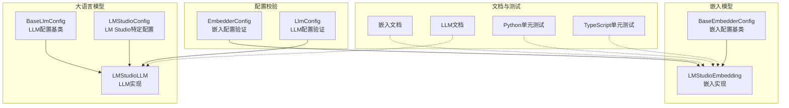
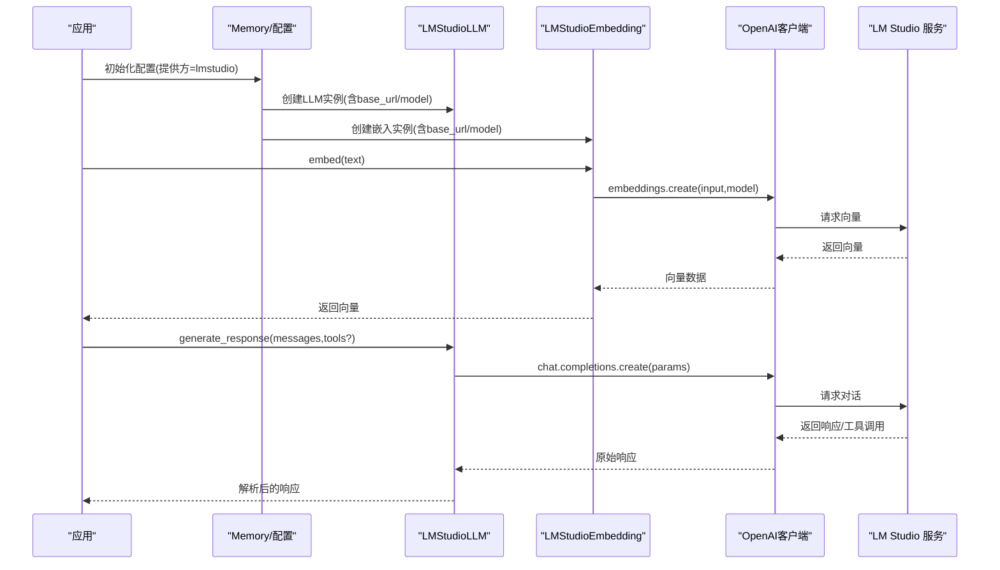
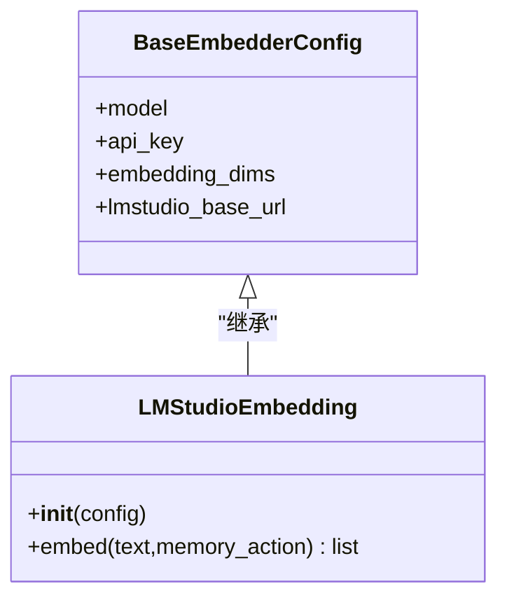
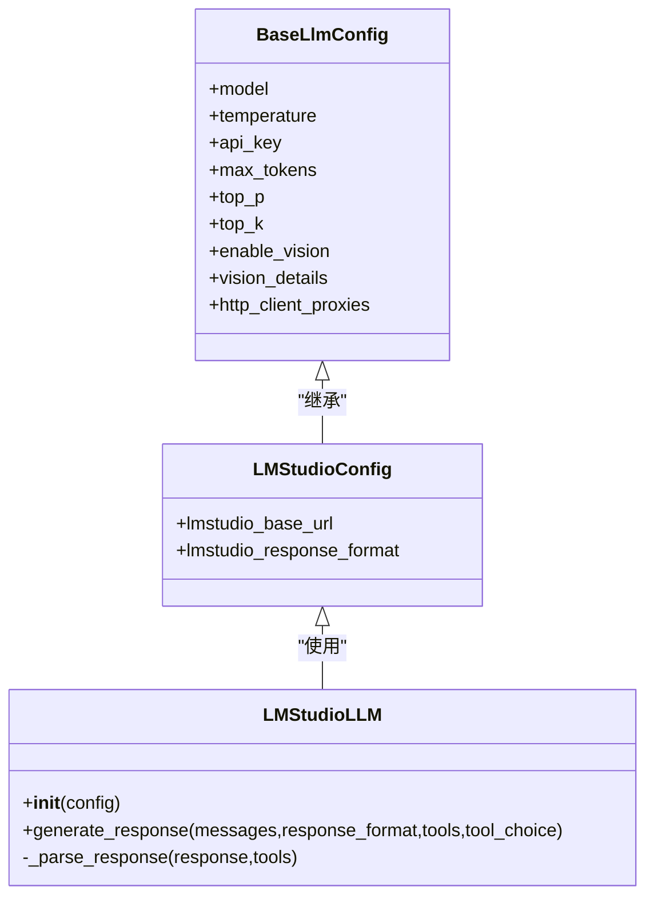
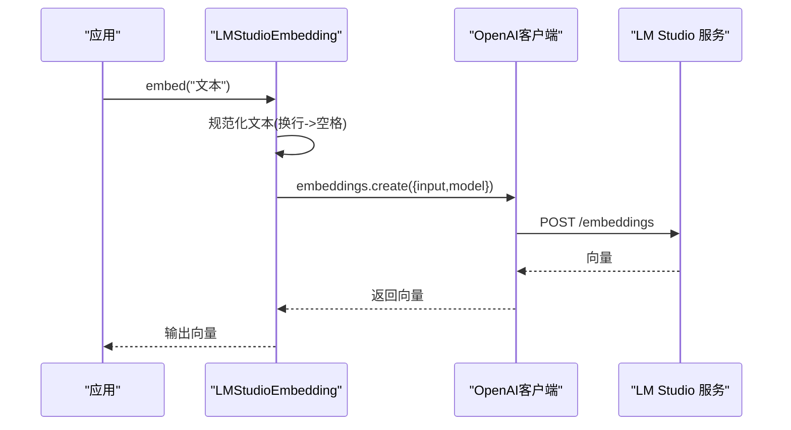
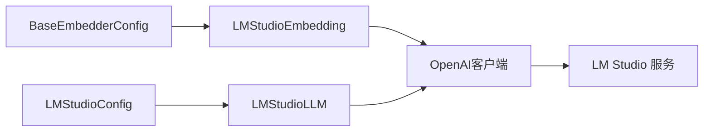

# LM Studio 本地模型

<cite>
**本文引用的文件**
- [mem0/embeddings/lmstudio.py](file://mem0/embeddings/lmstudio.py)
- [mem0/llms/lmstudio.py](file://mem0/llms/lmstudio.py)
- [mem0/configs/embeddings/base.py](file://mem0/configs/embeddings/base.py)
- [mem0/configs/llms/lmstudio.py](file://mem0/configs/llms/lmstudio.py)
- [mem0/embeddings/configs.py](file://mem0/embeddings/configs.py)
- [mem0/llms/configs.py](file://mem0/llms/configs.py)
- [docs/components/embedders/models/lmstudio.mdx](file://docs/components/embedders/models/lmstudio.mdx)
- [docs/components/llms/models/lmstudio.mdx](file://docs/components/llms/models/lmstudio.mdx)
- [tests/embeddings/test_lm_studio_embeddings.py](file://tests/embeddings/test_lm_studio_embeddings.py)
- [mem0-ts/src/oss/tests/lmstudio-embedder.test.ts](file://mem0-ts/src/oss/tests/lmstudio-embedder.test.ts)
</cite>

## 目录
1. [简介](#简介)
2. [项目结构](#项目结构)
3. [核心组件](#核心组件)
4. [架构总览](#架构总览)
5. [详细组件分析](#详细组件分析)
6. [依赖关系分析](#依赖关系分析)
7. [性能考虑](#性能考虑)
8. [故障排除指南](#故障排除指南)
9. [结论](#结论)
10. [附录](#附录)

## 简介
本文件面向希望在本地使用 LM Studio 运行嵌入与大语言模型（LLM）的用户，系统性介绍 LM Studio 在 Mem0 中的安装、启动与模型加载流程；说明 LM Studio API 客户端的配置与使用方法；覆盖本地模型的下载、管理与推理流程；并提供模型选择建议、资源配置优化与性能调优技巧，以及与 OpenAI 兼容的 API 使用方法与最佳实践。

## 项目结构
围绕 LM Studio 的实现主要分布在以下模块：
- 嵌入模型提供方：mem0/embeddings/lmstudio.py
- 大语言模型提供方：mem0/llms/lmstudio.py
- 配置基类与 LM Studio 特定配置：mem0/configs/embeddings/base.py、mem0/configs/llms/lmstudio.py
- 配置校验（Pydantic 模型）：mem0/embeddings/configs.py、mem0/llms/configs.py
- 文档与示例：docs/components/embedders/models/lmstudio.mdx、docs/components/llms/models/lmstudio.mdx
- 单元测试：tests/embeddings/test_lm_studio_embeddings.py、mem0-ts/src/oss/tests/lmstudio-embedder.test.ts

图表来源
- [mem0/embeddings/lmstudio.py:1-30](file://mem0/embeddings/lmstudio.py#L1-L30)
- [mem0/llms/lmstudio.py:1-115](file://mem0/llms/lmstudio.py#L1-L115)
- [mem0/configs/embeddings/base.py:1-111](file://mem0/configs/embeddings/base.py#L1-L111)
- [mem0/configs/llms/lmstudio.py:1-60](file://mem0/configs/llms/lmstudio.py#L1-L60)
- [mem0/embeddings/configs.py:1-32](file://mem0/embeddings/configs.py#L1-L32)
- [mem0/llms/configs.py:1-36](file://mem0/llms/configs.py#L1-L36)
- [docs/components/embedders/models/lmstudio.mdx:1-42](file://docs/components/embedders/models/lmstudio.mdx#L1-L42)
- [docs/components/llms/models/lmstudio.mdx:1-85](file://docs/components/llms/models/lmstudio.mdx#L1-L85)
- [tests/embeddings/test_lm_studio_embeddings.py:1-29](file://tests/embeddings/test_lm_studio_embeddings.py#L1-L29)
- [mem0-ts/src/oss/tests/lmstudio-embedder.test.ts:1-48](file://mem0-ts/src/oss/tests/lmstudio-embedder.test.ts#L1-L48)

章节来源
- [mem0/embeddings/lmstudio.py:1-30](file://mem0/embeddings/lmstudio.py#L1-L30)
- [mem0/llms/lmstudio.py:1-115](file://mem0/llms/lmstudio.py#L1-L115)
- [mem0/configs/embeddings/base.py:1-111](file://mem0/configs/embeddings/base.py#L1-L111)
- [mem0/configs/llms/lmstudio.py:1-60](file://mem0/configs/llms/lmstudio.py#L1-L60)
- [mem0/embeddings/configs.py:1-32](file://mem0/embeddings/configs.py#L1-L32)
- [mem0/llms/configs.py:1-36](file://mem0/llms/configs.py#L1-L36)
- [docs/components/embedders/models/lmstudio.mdx:1-42](file://docs/components/embedders/models/lmstudio.mdx#L1-L42)
- [docs/components/llms/models/lmstudio.mdx:1-85](file://docs/components/llms/models/lmstudio.mdx#L1-L85)
- [tests/embeddings/test_lm_studio_embeddings.py:1-29](file://tests/embeddings/test_lm_studio_embeddings.py#L1-L29)
- [mem0-ts/src/oss/tests/lmstudio-embedder.test.ts:1-48](file://mem0-ts/src/oss/tests/lmstudio-embedder.test.ts#L1-L48)

## 核心组件
- LM Studio 嵌入实现：通过 OpenAI 兼容客户端访问本地 LM Studio 服务，生成文本向量表示。
- LM Studio LLM 实现：通过 OpenAI 兼容客户端访问本地 LM Studio 服务，进行对话与工具调用。
- 配置体系：
  - 嵌入配置基类：包含通用参数与 LM Studio 特定的 base_url。
  - LLM 配置类：扩展基础 LLM 参数，并增加 LM Studio 特定的响应格式与 base_url。
  - Pydantic 配置校验：限定 provider 取值范围，确保配置合法。
- 文档与示例：提供嵌入与 LLM 的使用示例、参数说明与注意事项。

章节来源
- [mem0/embeddings/lmstudio.py:9-29](file://mem0/embeddings/lmstudio.py#L9-L29)
- [mem0/llms/lmstudio.py:12-114](file://mem0/llms/lmstudio.py#L12-L114)
- [mem0/configs/embeddings/base.py:37-104](file://mem0/configs/embeddings/base.py#L37-L104)
- [mem0/configs/llms/lmstudio.py:24-59](file://mem0/configs/llms/lmstudio.py#L24-L59)
- [mem0/embeddings/configs.py:6-31](file://mem0/embeddings/configs.py#L6-L31)
- [mem0/llms/configs.py:6-35](file://mem0/llms/configs.py#L6-L35)
- [docs/components/embedders/models/lmstudio.mdx:1-42](file://docs/components/embedders/models/lmstudio.mdx#L1-L42)
- [docs/components/llms/models/lmstudio.mdx:1-85](file://docs/components/llms/models/lmstudio.mdx#L1-L85)

## 架构总览
LM Studio 在 Mem0 中以“OpenAI 兼容接口”的形式被封装为嵌入与 LLM 提供方。其核心交互路径如下：

图表来源
- [mem0/llms/lmstudio.py:43-114](file://mem0/llms/lmstudio.py#L43-L114)
- [mem0/embeddings/lmstudio.py:19-29](file://mem0/embeddings/lmstudio.py#L19-L29)
- [mem0/configs/llms/lmstudio.py:57-59](file://mem0/configs/llms/lmstudio.py#L57-L59)
- [mem0/configs/embeddings/base.py:103-104](file://mem0/configs/embeddings/base.py#L103-L104)

## 详细组件分析

### 嵌入组件分析
- 组件职责
  - 负责将输入文本转换为固定维度的向量表示，用于后续检索与记忆管理。
  - 默认模型与维度、默认 API Key 与 base_url 均在初始化时设置。
- 关键行为
  - 将换行符替换为空格后提交给 LM Studio 服务。
  - 使用 OpenAI 兼容接口的 embeddings.create 方法获取向量。
- 配置要点
  - model：嵌入模型名称（需与已加载模型一致）。
  - embedding_dims：期望输出维度（如 1536）。
  - lmstudio_base_url：LM Studio 的 OpenAI 兼容 API 地址，默认 http://localhost:1234/v1。

图表来源
- [mem0/configs/embeddings/base.py:10-111](file://mem0/configs/embeddings/base.py#L10-L111)
- [mem0/embeddings/lmstudio.py:9-29](file://mem0/embeddings/lmstudio.py#L9-L29)

章节来源
- [mem0/embeddings/lmstudio.py:9-29](file://mem0/embeddings/lmstudio.py#L9-L29)
- [mem0/configs/embeddings/base.py:37-104](file://mem0/configs/embeddings/base.py#L37-L104)
- [docs/components/embedders/models/lmstudio.mdx:34-42](file://docs/components/embedders/models/lmstudio.mdx#L34-L42)

### LLM 组件分析
- 组件职责
  - 负责基于消息列表生成回复，支持工具调用与结构化响应格式。
  - 自动处理响应格式与工具调用解析。
- 关键行为
  - 支持从基础配置自动转换为 LM Studio 配置。
  - 默认模型与 API Key 在初始化时设置。
  - 通过 OpenAI 兼容接口 chat.completions.create 发起请求。
- 配置要点
  - model：LLM 模型名称（需与已加载模型一致）。
  - temperature/top_p/top_k/max_tokens：采样与长度控制。
  - lmstudio_base_url：LM Studio 的 OpenAI 兼容 API 地址，默认 http://localhost:1234/v1。
  - lmstudio_response_format：响应格式（如 JSON Schema）。

图表来源
- [mem0/configs/llms/lmstudio.py:6-59](file://mem0/configs/llms/lmstudio.py#L6-L59)
- [mem0/llms/lmstudio.py:12-114](file://mem0/llms/lmstudio.py#L12-L114)

章节来源
- [mem0/llms/lmstudio.py:12-114](file://mem0/llms/lmstudio.py#L12-L114)
- [mem0/configs/llms/lmstudio.py:24-59](file://mem0/configs/llms/lmstudio.py#L24-L59)
- [docs/components/llms/models/lmstudio.mdx:8-85](file://docs/components/llms/models/lmstudio.mdx#L8-L85)

### 配置与校验
- 嵌入配置校验
  - 通过 Pydantic 模型限制 provider 取值，lmstudio 在允许列表中。
- LLM 配置校验
  - 通过 Pydantic 模型限制 provider 取值，lmstudio 在允许列表中。
- 配置参数
  - 嵌入：model、embedding_dims、lmstudio_base_url。
  - LLM：model、temperature、max_tokens、top_p、top_k、enable_vision、vision_details、http_client_proxies、lmstudio_base_url、lmstudio_response_format。

章节来源
- [mem0/embeddings/configs.py:6-31](file://mem0/embeddings/configs.py#L6-L31)
- [mem0/llms/configs.py:6-35](file://mem0/llms/configs.py#L6-L35)
- [mem0/configs/embeddings/base.py:37-104](file://mem0/configs/embeddings/base.py#L37-L104)
- [mem0/configs/llms/lmstudio.py:24-59](file://mem0/configs/llms/lmstudio.py#L24-L59)

### OpenAI 兼容 API 使用流程
- 嵌入调用序列
  - 输入文本标准化（换行替换为空格）。
  - 调用 embeddings.create，指定 model 与 input。
  - 返回向量数组中的第一个向量作为结果。
- LLM 调用序列
  - 组装参数（model、messages、response_format、tools/tool_choice）。
  - 调用 chat.completions.create。
  - 解析响应，提取内容或工具调用。

图表来源
- [mem0/embeddings/lmstudio.py:19-29](file://mem0/embeddings/lmstudio.py#L19-L29)

章节来源
- [mem0/embeddings/lmstudio.py:19-29](file://mem0/embeddings/lmstudio.py#L19-L29)
- [mem0/llms/lmstudio.py:73-114](file://mem0/llms/lmstudio.py#L73-L114)

## 依赖关系分析
- 组件耦合
  - LMStudioEmbedding/LMStudioLLM 均依赖 OpenAI 兼容客户端，通过 base_url 与本地服务通信。
  - 配置类提供统一的参数入口，降低上层对具体提供方的感知。
- 外部依赖
  - LM Studio 本地服务需开启 OpenAI 兼容 API 端点。
  - 模型需在 LM Studio 中完成下载与加载。
- 潜在循环依赖
  - 当前模块间为单向依赖（配置 -> 实现），无明显循环。

图表来源
- [mem0/configs/embeddings/base.py:103-104](file://mem0/configs/embeddings/base.py#L103-L104)
- [mem0/configs/llms/lmstudio.py:57-59](file://mem0/configs/llms/lmstudio.py#L57-L59)
- [mem0/embeddings/lmstudio.py:17](file://mem0/embeddings/lmstudio.py#L17)
- [mem0/llms/lmstudio.py:41](file://mem0/llms/lmstudio.py#L41)

章节来源
- [mem0/embeddings/lmstudio.py:17](file://mem0/embeddings/lmstudio.py#L17)
- [mem0/llms/lmstudio.py:41](file://mem0/llms/lmstudio.py#L41)
- [mem0/configs/embeddings/base.py:103-104](file://mem0/configs/embeddings/base.py#L103-L104)
- [mem0/configs/llms/lmstudio.py:57-59](file://mem0/configs/llms/lmstudio.py#L57-L59)

## 性能考虑
- 模型选择建议
  - 嵌入模型：优先选择与任务匹配且开源社区广泛使用的模型，如 nomic-embed-text 系列，注意 embedding_dims 与下游向量库兼容性。
  - LLM 模型：根据推理需求选择合适规模与量化精度的 GGUF 模型，兼顾速度与质量。
- 资源配置优化
  - 为 LM Studio 分配足够的显存/内存，避免 OOM。
  - 合理设置 temperature、top_p、top_k、max_tokens，平衡生成质量与延迟。
- 推理流程优化
  - 文本预处理：统一换行符为单个空格，减少不必要空白字符影响。
  - 批量嵌入：若批量处理文本，尽量合并请求以减少往返开销。
  - 响应格式：在需要结构化输出时明确 response_format，减少后处理成本。
- 端到端调优
  - 通过基准测试对比不同模型与参数组合，选择最优方案。
  - 结合向量库索引策略（如降维、分片）提升检索效率。

## 故障排除指南
- 常见问题
  - 无法连接 LM Studio：检查 lmstudio_base_url 是否正确，确认本地服务已启动且端口未被占用。
  - 模型未加载：确保在 LM Studio 中已下载并加载目标模型，名称需与配置一致。
  - 嵌入维度不匹配：确认 embedding_dims 与向量库预期维度一致。
  - 工具调用失败：检查 tools 与 tool_choice 配置是否正确，确保模型支持函数调用。
- 调试步骤
  - 使用最小可复现配置（仅设置 provider 与 model）先验证连通性。
  - 查看 OpenAI 兼容接口返回的错误信息，定位具体参数问题。
  - 对照单元测试与文档示例，逐项核对配置项。
- 相关测试参考
  - Python 嵌入单元测试：验证模型名、输入格式与返回向量。
  - TypeScript 嵌入单元测试：验证 OpenAI 调用参数与换行符规范化。

章节来源
- [tests/embeddings/test_lm_studio_embeddings.py:1-29](file://tests/embeddings/test_lm_studio_embeddings.py#L1-L29)
- [mem0-ts/src/oss/tests/lmstudio-embedder.test.ts:19-48](file://mem0-ts/src/oss/tests/lmstudio-embedder.test.ts#L19-L48)
- [docs/components/llms/models/lmstudio.mdx:68-80](file://docs/components/llms/models/lmstudio.mdx#L68-L80)
- [docs/components/embedders/models/lmstudio.mdx:34-42](file://docs/components/embedders/models/lmstudio.mdx#L34-L42)

## 结论
LM Studio 在 Mem0 中通过 OpenAI 兼容接口实现了本地嵌入与 LLM 的无缝集成。借助清晰的配置体系与严格的参数校验，用户可以快速完成本地模型的部署、加载与推理。结合合理的模型选择与资源配置，可在保证性能的同时获得稳定的用户体验。

## 附录
- 快速开始要点
  - 下载并安装 LM Studio，启动本地服务器，确保 OpenAI 兼容端点可用。
  - 在配置中设置 provider 为 lmstudio，并指定 model 与 base_url。
  - 若同时使用嵌入与 LLM，请分别加载对应的嵌入与 LLM 模型。
- 最佳实践
  - 明确区分嵌入与 LLM 的模型类型与维度，避免混淆。
  - 在生产环境启用日志与监控，记录关键指标（延迟、吞吐、错误率）。
  - 定期评估模型效果，按需更新模型与参数。