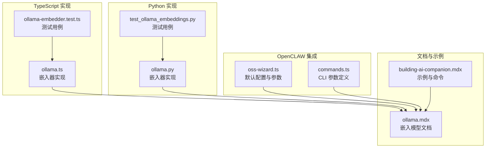
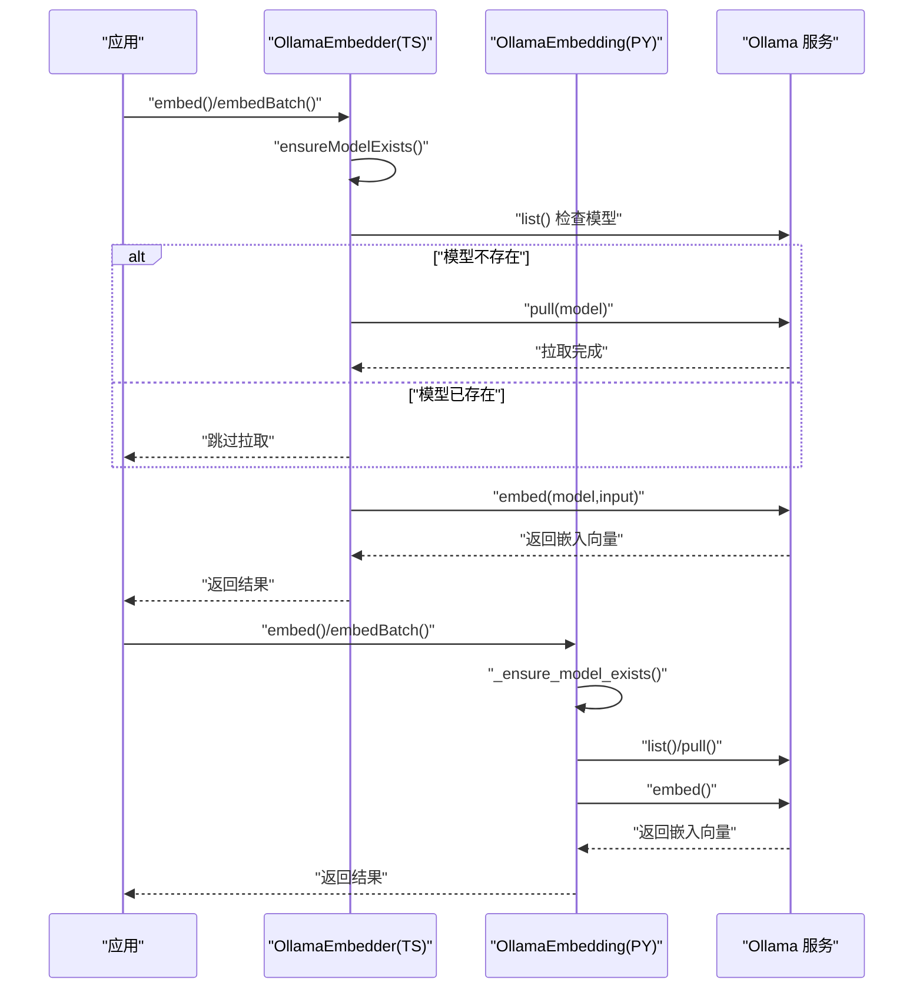
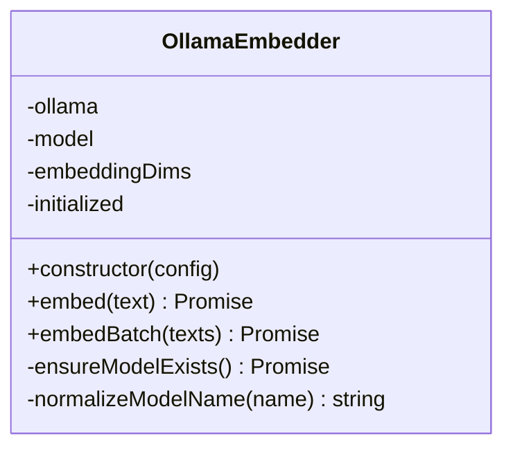
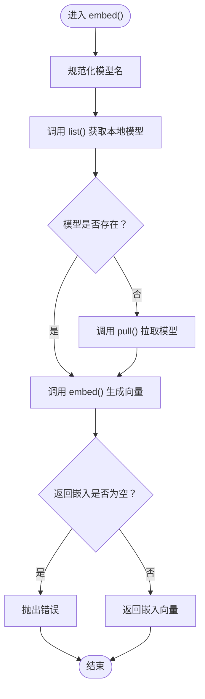
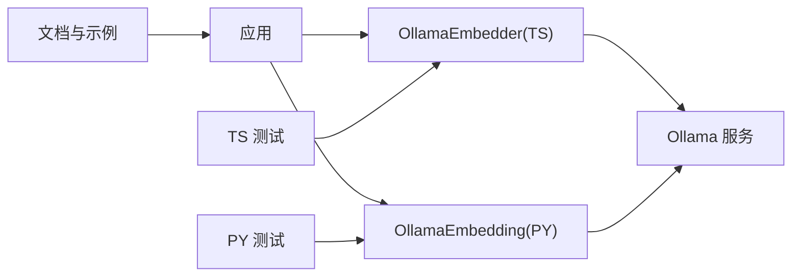

# Ollama 本地模型

<cite>
**本文引用的文件**
- [ollama.ts](file://mem0-ts/src/oss/src/embeddings/ollama.ts)
- [ollama.py](file://mem0/embeddings/ollama.py)
- [ollama.mdx](file://docs/components/embedders/models/ollama.mdx)
- [building-ai-companion.mdx](file://docs/cookbooks/essentials/building-ai-companion.mdx)
- [ollama-embedder.test.ts](file://mem0-ts/src/oss/tests/ollama-embedder.test.ts)
- [test_ollama_embeddings.py](file://tests/embeddings/test_ollama_embeddings.py)
- [ollama.py（LLM）](file://mem0/llms/ollama.py)
- [ollama.py（配置）](file://mem0/configs/llms/ollama.py)
- [oss-wizard.ts](file://integrations/openclaw/cli/oss-wizard.ts)
- [commands.ts](file://integrations/openclaw/cli/commands.ts)
</cite>

## 目录
1. [简介](#简介)
2. [项目结构](#项目结构)
3. [核心组件](#核心组件)
4. [架构总览](#架构总览)
5. [详细组件分析](#详细组件分析)
6. [依赖关系分析](#依赖关系分析)
7. [性能考虑](#性能考虑)
8. [故障排除指南](#故障排除指南)
9. [结论](#结论)
10. [附录](#附录)

## 简介
本文件面向在本地使用 Ollama 运行嵌入模型的用户与开发者，系统性说明 Ollama 嵌入模型提供商的安装、配置与使用方法；解释客户端初始化流程、模型拉取机制与嵌入向量生成流程；覆盖常用模型选择与配置参数（如 nomic-embed-text），并提供 Docker 部署、GPU 加速与性能优化建议，以及常见问题排查。

## 项目结构
围绕 Ollama 嵌入模型的相关实现与文档分布在以下位置：
- TypeScript 嵌入器实现：mem0-ts/src/oss/src/embeddings/ollama.ts
- Python 嵌入器实现：mem0/embeddings/ollama.py
- 文档与示例：docs/components/embedders/models/ollama.mdx、docs/cookbooks/essentials/building-ai-companion.mdx
- 测试用例：mem0-ts/src/oss/tests/ollama-embedder.test.ts、tests/embeddings/test_ollama_embeddings.py
- LLM 与配置：mem0/llms/ollama.py、mem0/configs/llms/ollama.py
- OpenCLAW 集成与命令行参数：integrations/openclaw/cli/oss-wizard.ts、integrations/openclaw/cli/commands.ts

**图表来源**
- [ollama.ts:1-70](file://mem0-ts/src/oss/src/embeddings/ollama.ts#L1-L70)
- [ollama.py:1-200](file://mem0/embeddings/ollama.py#L1-L200)
- [ollama.mdx:1-200](file://docs/components/embedders/models/ollama.mdx#L1-L200)
- [building-ai-companion.mdx:1-120](file://docs/cookbooks/essentials/building-ai-companion.mdx#L1-L120)
- [oss-wizard.ts:1-80](file://integrations/openclaw/cli/oss-wizard.ts#L1-L80)
- [commands.ts:440-460](file://integrations/openclaw/cli/commands.ts#L440-L460)

**章节来源**
- [ollama.ts:1-70](file://mem0-ts/src/oss/src/embeddings/ollama.ts#L1-L70)
- [ollama.py:1-200](file://mem0/embeddings/ollama.py#L1-L200)
- [ollama.mdx:1-200](file://docs/components/embedders/models/ollama.mdx#L1-L200)
- [building-ai-companion.mdx:1-120](file://docs/cookbooks/essentials/building-ai-companion.mdx#L1-L120)
- [oss-wizard.ts:1-80](file://integrations/openclaw/cli/oss-wizard.ts#L1-L80)
- [commands.ts:440-460](file://integrations/openclaw/cli/commands.ts#L440-L460)

## 核心组件
- TypeScript 嵌入器（OllamaEmbedder）
  - 负责通过 Ollama 客户端进行嵌入计算，支持单条与批量嵌入。
  - 初始化时自动检测并按需拉取目标模型，避免重复拉取。
  - 默认模型为 nomic-embed-text:latest，默认嵌入维度为 768。
  - 支持通过 baseURL/url 指定 Ollama 服务地址。
- Python 嵌入器（OllamaEmbedding）
  - 与 TypeScript 版本职责一致，提供相同的模型拉取与嵌入能力。
  - 使用 Ollama 官方 Python 客户端进行交互。
- 文档与示例
  - 提供 Ollama 嵌入模型的使用说明、示例命令与最佳实践。
- OpenCLAW 集成
  - 在命令行中以 --oss-embedder ollama 方式启用本地嵌入，并可指定 URL。

**章节来源**
- [ollama.ts:6-70](file://mem0-ts/src/oss/src/embeddings/ollama.ts#L6-L70)
- [ollama.py:1-200](file://mem0/embeddings/ollama.py#L1-L200)
- [ollama.mdx:1-200](file://docs/components/embedders/models/ollama.mdx#L1-L200)
- [oss-wizard.ts:30-40](file://integrations/openclaw/cli/oss-wizard.ts#L30-L40)
- [commands.ts:450-455](file://integrations/openclaw/cli/commands.ts#L450-L455)

## 架构总览
下图展示从应用到 Ollama 服务的调用链路，包括模型存在性检查、拉取与嵌入请求：

**图表来源**
- [ollama.ts:24-70](file://mem0-ts/src/oss/src/embeddings/ollama.ts#L24-L70)
- [ollama.py:1-200](file://mem0/embeddings/ollama.py#L1-L200)

## 详细组件分析

### TypeScript 嵌入器（OllamaEmbedder）
- 初始化与连接
  - 通过 baseURL/url 构造 Ollama 客户端，默认地址为 http://localhost:11434。
  - 默认模型为 nomic-embed-text:latest，嵌入维度默认 768。
- 模型拉取机制
  - ensureModelExists() 会先列出本地模型，若未找到则执行拉取。
  - 使用 normalizeModelName 规范化“无标签”模型名（如 nomic-embed-text → nomic-embed-text:latest）。
  - 通过内部标志位避免重复拉取。
- 嵌入生成流程
  - embed() 对输入进行安全转换（字符串或序列化），调用 Ollama embed 接口。
  - 若返回嵌入数组为空，抛出错误提示。
  - embedBatch() 并发执行 embed() 获取批量嵌入。
- 错误处理
  - 捕获 ensureModelExists() 异常并记录日志。
  - 返回空嵌入时抛出明确异常，便于上层处理。

**图表来源**
- [ollama.ts:6-70](file://mem0-ts/src/oss/src/embeddings/ollama.ts#L6-L70)

**章节来源**
- [ollama.ts:13-70](file://mem0-ts/src/oss/src/embeddings/ollama.ts#L13-L70)
- [ollama-embedder.test.ts:98-121](file://mem0-ts/src/oss/tests/ollama-embedder.test.ts#L98-L121)

### Python 嵌入器（OllamaEmbedding）
- 初始化与连接
  - 通过配置对象传入模型名与嵌入维度。
  - 内部使用 Ollama 官方 Python 客户端。
- 模型拉取机制
  - _ensure_model_exists() 检查本地模型列表，不存在则调用 pull() 拉取。
  - 同样支持“无标签”模型名的规范化匹配。
- 嵌入生成流程
  - embed() 调用 embed() 接口获取向量，校验返回值非空后返回。
  - embedBatch() 逐条调用 embed()。
- 错误处理
  - 当返回嵌入为空时抛出异常，便于上层捕获。

**图表来源**
- [ollama.py:1-200](file://mem0/embeddings/ollama.py#L1-L200)

**章节来源**
- [ollama.py:1-200](file://mem0/embeddings/ollama.py#L1-L200)
- [test_ollama_embeddings.py:18-62](file://tests/embeddings/test_ollama_embeddings.py#L18-L62)

### 配置与参数
- 常用参数
  - model：目标嵌入模型名称（如 nomic-embed-text 或带标签版本）。
  - embeddingDims：嵌入向量维度（默认 768）。
  - baseURL/url：Ollama 服务地址（默认 http://localhost:11434）。
- OpenCLAW 集成
  - 在命令行中通过 --oss-embedder ollama 指定嵌入器。
  - 可选 --oss-embedder-url 指定 Ollama 地址。
  - 默认模型为 nomic-embed-text，URL 默认 http://localhost:11434，维度默认 768。

**章节来源**
- [oss-wizard.ts:30-40](file://integrations/openclaw/cli/oss-wizard.ts#L30-L40)
- [commands.ts:450-455](file://integrations/openclaw/cli/commands.ts#L450-L455)

## 依赖关系分析
- 组件耦合
  - TypeScript 与 Python 嵌入器均依赖 Ollama 客户端库与服务接口。
  - 文档与示例为使用者提供配置与命令参考。
- 外部依赖
  - Ollama 服务（本地或远程）。
  - 测试用例对客户端行为进行验证（如模型拉取、空嵌入处理）。

**图表来源**
- [ollama.ts:1-70](file://mem0-ts/src/oss/src/embeddings/ollama.ts#L1-L70)
- [ollama.py:1-200](file://mem0/embeddings/ollama.py#L1-L200)
- [ollama.mdx:1-200](file://docs/components/embedders/models/ollama.mdx#L1-L200)
- [test_ollama_embeddings.py:1-62](file://tests/embeddings/test_ollama_embeddings.py#L1-L62)
- [ollama-embedder.test.ts:1-121](file://mem0-ts/src/oss/tests/ollama-embedder.test.ts#L1-L121)

**章节来源**
- [ollama.ts:1-70](file://mem0-ts/src/oss/src/embeddings/ollama.ts#L1-L70)
- [ollama.py:1-200](file://mem0/embeddings/ollama.py#L1-L200)
- [ollama.mdx:1-200](file://docs/components/embedders/models/ollama.mdx#L1-L200)
- [test_ollama_embeddings.py:1-62](file://tests/embeddings/test_ollama_embeddings.py#L1-L62)
- [ollama-embedder.test.ts:1-121](file://mem0-ts/src/oss/tests/ollama-embedder.test.ts#L1-L121)

## 性能考虑
- 批量嵌入
  - 使用 embedBatch() 并发生成嵌入，减少往返延迟。
- 模型预热
  - ensureModelExists() 仅在首次调用时拉取模型，后续复用避免重复网络开销。
- 嵌入维度
  - 根据下游向量库与检索需求选择合适维度（如默认 768）。
- 服务部署
  - 将 Ollama 服务部署在低延迟网络环境，避免跨地域访问导致的延迟。
- GPU 加速
  - 在支持的硬件上启用 GPU 推理以提升吞吐与降低延迟（具体请参考 Ollama 官方文档与硬件适配情况）。

[本节为通用指导，不直接分析特定文件]

## 故障排除指南
- 常见问题与定位
  - 无法连接 Ollama 服务
    - 检查 baseURL/url 是否正确，确认服务监听地址与端口。
  - 模型未找到或拉取失败
    - 确认模型名称与标签是否匹配（如 nomic-embed-text:latest）。
    - 查看 ensureModelExists() 日志输出，确认拉取是否触发。
  - 嵌入结果为空
    - embed() 返回嵌入数组为空时会抛错，请检查输入文本与模型兼容性。
- 单元测试参考
  - TypeScript 测试覆盖了模型存在性检查、空嵌入异常等场景。
  - Python 测试覆盖了嵌入调用、模型拉取与空响应处理。

**章节来源**
- [ollama-embedder.test.ts:98-121](file://mem0-ts/src/oss/tests/ollama-embedder.test.ts#L98-L121)
- [test_ollama_embeddings.py:18-62](file://tests/embeddings/test_ollama_embeddings.py#L18-L62)

## 结论
通过本文件的说明，您可以在本地使用 Ollama 运行嵌入模型，快速完成初始化、模型拉取与嵌入生成。结合文档与测试用例，您可以更稳健地集成与排障。对于生产环境，建议关注网络延迟、模型维度与 GPU 加速配置，以获得更优的性能表现。

[本节为总结性内容，不直接分析特定文件]

## 附录

### A. 安装与配置步骤
- 安装 Ollama
  - 参考官方安装指南并在本地启动服务。
- 拉取嵌入模型
  - 示例命令：ollama pull nomic-embed-text:latest
- 应用侧配置
  - 设置 baseURL/url 指向 Ollama 服务。
  - 指定 model 与 embeddingDims。
- OpenCLAW 快速启用
  - 使用 --oss-embedder ollama 与 --oss-embedder-url 指定地址。

**章节来源**
- [building-ai-companion.mdx:1-120](file://docs/cookbooks/essentials/building-ai-companion.mdx#L1-L120)
- [oss-wizard.ts:30-40](file://integrations/openclaw/cli/oss-wizard.ts#L30-L40)
- [commands.ts:450-455](file://integrations/openclaw/cli/commands.ts#L450-L455)

### B. 常用模型与参数
- 常用模型
  - nomic-embed-text:latest（默认）
- 关键参数
  - model：模型名称
  - embeddingDims：嵌入维度
  - baseURL/url：Ollama 服务地址

**章节来源**
- [ollama.ts:13-22](file://mem0-ts/src/oss/src/embeddings/ollama.ts#L13-L22)
- [oss-wizard.ts:30-40](file://integrations/openclaw/cli/oss-wizard.ts#L30-L40)

### C. LLM 与配置对照
- LLM 侧 Ollama 配置
  - 参考 llms/ollama.py 与 configs/llms/ollama.py 中的参数与默认值，便于统一本地推理与嵌入的配置风格。

**章节来源**
- [ollama.py（LLM）:1-200](file://mem0/llms/ollama.py#L1-L200)
- [ollama.py（配置）:1-200](file://mem0/configs/llms/ollama.py#L1-L200)