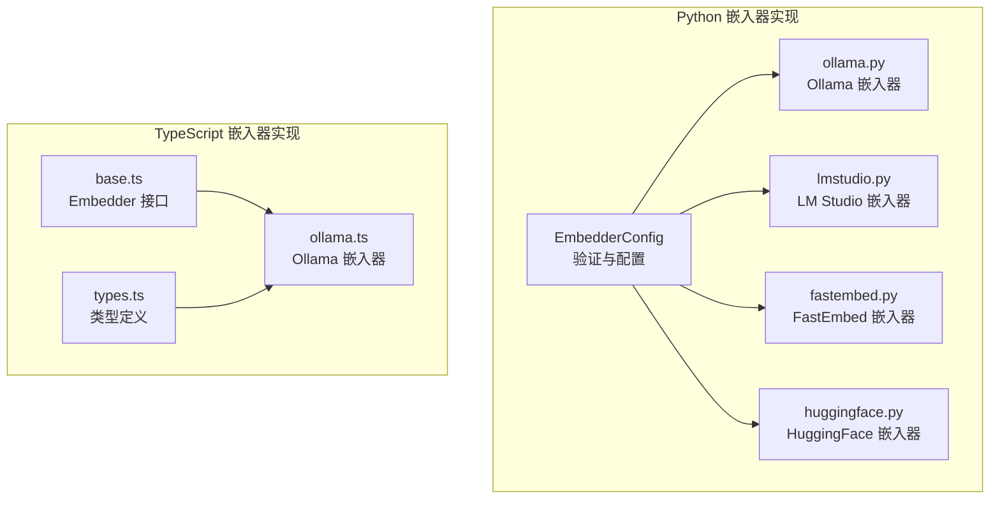
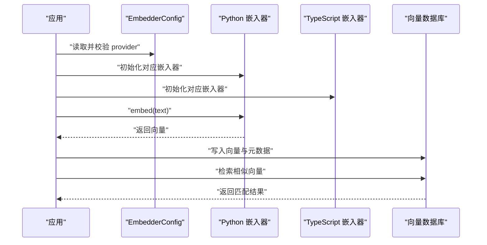
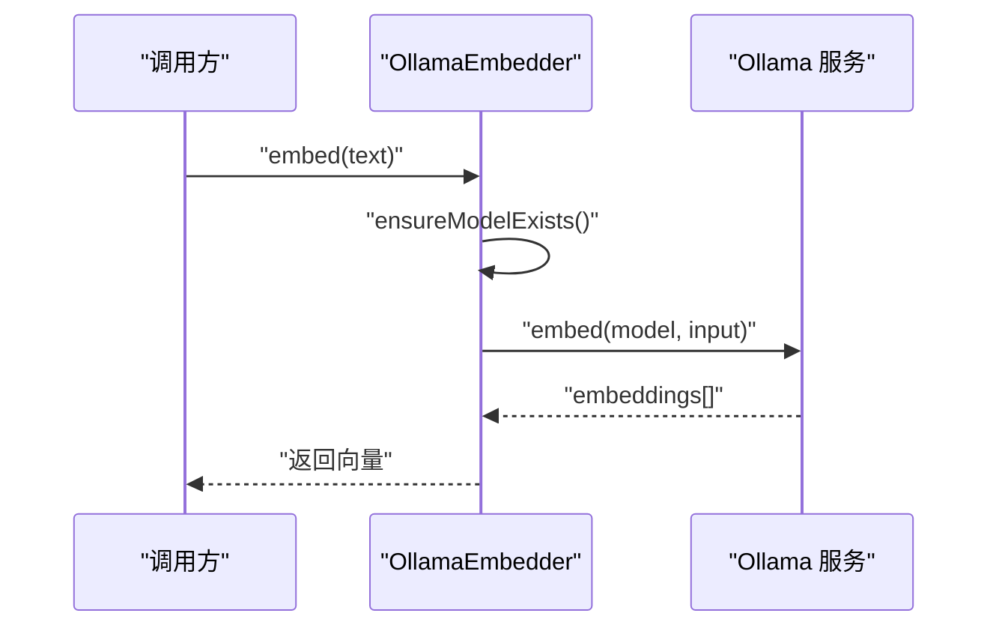
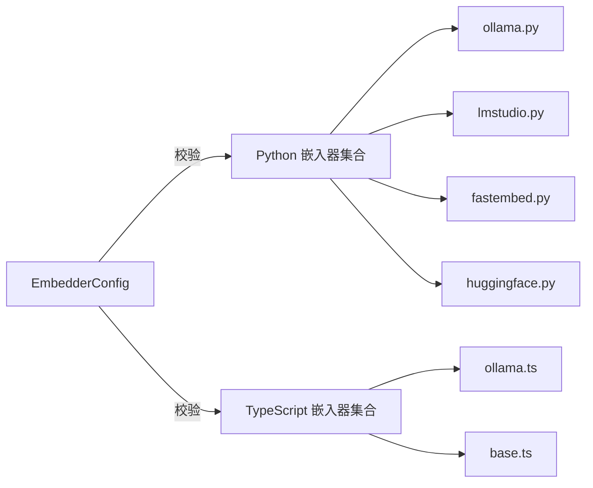
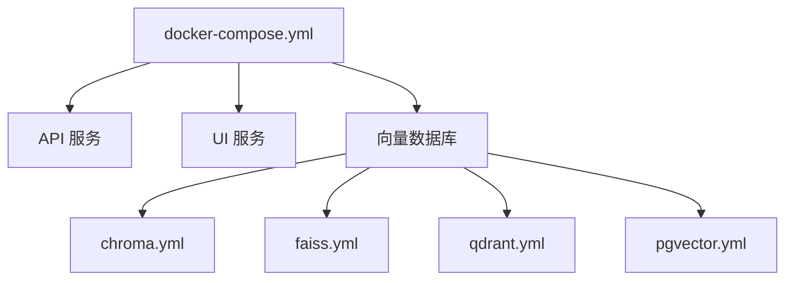

# 本地嵌入模型提供商

<cite>
**本文引用的文件**
- [mem0/embeddings/configs.py](file://mem0/embeddings/configs.py)
- [mem0/embeddings/ollama.py](file://mem0/embeddings/ollama.py)
- [mem0/embeddings/lmstudio.py](file://mem0/embeddings/lmstudio.py)
- [mem0/embeddings/fastembed.py](file://mem0/embeddings/fastembed.py)
- [mem0/embeddings/huggingface.py](file://mem0/embeddings/huggingface.py)
- [mem0-ts/src/oss/src/embeddings/ollama.ts](file://mem0-ts/src/oss/src/embeddings/ollama.ts)
- [mem0-ts/src/oss/src/embeddings/base.ts](file://mem0-ts/src/oss/src/embeddings/base.ts)
- [mem0-ts/src/oss/src/types.ts](file://mem0-ts/src/oss/src/types.ts)
- [tests/embeddings/test_ollama_embeddings.py](file://tests/embeddings/test_ollama_embeddings.py)
- [tests/embeddings/test_lm_studio_embeddings.py](file://tests/embeddings/test_lm_studio_embeddings.py)
- [tests/embeddings/test_fastembed_embeddings.py](file://tests/embeddings/test_fastembed_embeddings.py)
- [tests/embeddings/test_huggingface_embeddings.py](file://tests/embeddings/test_huggingface_embeddings.py)
- [openmemory/api/Dockerfile](file://openmemory/api/Dockerfile)
- [openmemory/ui/Dockerfile](file://openmemory/ui/Dockerfile)
- [openmemory/docker-compose.yml](file://openmemory/docker-compose.yml)
- [openmemory/compose/chroma.yml](file://openmemory/compose/chroma.yml)
- [openmemory/compose/faiss.yml](file://openmemory/compose/faiss.yml)
- [openmemory/compose/qdrant.yml](file://openmemory/compose/qdrant.yml)
- [openmemory/compose/pgvector.yml](file://openmemory/compose/pgvector.yml)
- [docs/cookbooks/companions/local-companion-ollama.mdx](file://docs/cookbooks/companions/local-companion-ollama.mdx)
- [docs/components/embedders/models/](file://docs/components/embedders/models/)
- [docs/components/embedders/config.mdx](file://docs/components/embedders/config.mdx)
- [docs/components/embedders/overview.mdx](file://docs/components/embedders/overview.mdx)
</cite>

## 目录
1. [简介](#简介)
2. [项目结构](#项目结构)
3. [核心组件](#核心组件)
4. [架构总览](#架构总览)
5. [详细组件分析](#详细组件分析)
6. [依赖关系分析](#依赖关系分析)
7. [性能考虑](#性能考虑)
8. [故障排除指南](#故障排除指南)
9. [结论](#结论)
10. [附录](#附录)

## 简介
本文件聚焦于本地嵌入模型提供商的配置与使用，覆盖 Ollama、LM Studio、FastEmbed 以及 HuggingFace 等本地部署选项。内容围绕模型下载、加载与推理流程展开，并结合仓库中的实现细节，给出 GPU 加速、内存优化与模型量化的性能调优建议；同时提供 Docker 部署、模型选择与资源管理的最佳实践，并包含离线模式下的故障排除与性能监控方法。

## 项目结构
本地嵌入能力在 Python 侧通过统一的嵌入器接口进行抽象，具体提供商以独立模块实现；TypeScript 侧同样提供嵌入器接口与 Ollama 实现，便于前端或全栈场景使用。

**图表来源**
- [mem0/embeddings/configs.py:6-31](file://mem0/embeddings/configs.py#L6-L31)
- [mem0/embeddings/ollama.py](file://mem0/embeddings/ollama.py)
- [mem0/embeddings/lmstudio.py](file://mem0/embeddings/lmstudio.py)
- [mem0/embeddings/fastembed.py](file://mem0/embeddings/fastembed.py)
- [mem0/embeddings/huggingface.py](file://mem0/embeddings/huggingface.py)
- [mem0-ts/src/oss/src/embeddings/base.ts](file://mem0-ts/src/oss/src/embeddings/base.ts)
- [mem0-ts/src/oss/src/embeddings/ollama.ts:6-42](file://mem0-ts/src/oss/src/embeddings/ollama.ts#L6-L42)
- [mem0-ts/src/oss/src/types.ts](file://mem0-ts/src/oss/src/types.ts)

**章节来源**
- [mem0/embeddings/configs.py:6-31](file://mem0/embeddings/configs.py#L6-L31)
- [mem0/embeddings/ollama.py](file://mem0/embeddings/ollama.py)
- [mem0/embeddings/lmstudio.py](file://mem0/embeddings/lmstudio.py)
- [mem0/embeddings/fastembed.py](file://mem0/embeddings/fastembed.py)
- [mem0/embeddings/huggingface.py](file://mem0/embeddings/huggingface.py)
- [mem0-ts/src/oss/src/embeddings/base.ts](file://mem0-ts/src/oss/src/embeddings/base.ts)
- [mem0-ts/src/oss/src/embeddings/ollama.ts:6-42](file://mem0-ts/src/oss/src/embeddings/ollama.ts#L6-L42)
- [mem0-ts/src/oss/src/types.ts](file://mem0-ts/src/oss/src/types.ts)

## 核心组件
- 统一配置与校验：通过嵌入器配置对象对 provider 进行白名单校验，确保仅允许受支持的提供商（如 ollama、lmstudio、fastembed、huggingface 等）。
- 抽象接口：TypeScript 侧定义 Embedder 接口，Python 侧通过基类与具体实现解耦不同提供商。
- 具体实现：Ollama、LM Studio、FastEmbed、HuggingFace 各自封装本地推理细节，暴露统一的 embed 方法。

**章节来源**
- [mem0/embeddings/configs.py:6-31](file://mem0/embeddings/configs.py#L6-L31)
- [mem0-ts/src/oss/src/embeddings/base.ts](file://mem0-ts/src/oss/src/embeddings/base.ts)
- [mem0-ts/src/oss/src/embeddings/ollama.ts:6-42](file://mem0-ts/src/oss/src/embeddings/ollama.ts#L6-L42)

## 架构总览
下图展示从应用到本地嵌入器的典型调用链，以及与向量数据库的集成点。

**图表来源**
- [mem0/embeddings/configs.py:6-31](file://mem0/embeddings/configs.py#L6-L31)
- [mem0/embeddings/ollama.py](file://mem0/embeddings/ollama.py)
- [mem0/embeddings/lmstudio.py](file://mem0/embeddings/lmstudio.py)
- [mem0/embeddings/fastembed.py](file://mem0/embeddings/fastembed.py)
- [mem0/embeddings/huggingface.py](file://mem0/embeddings/huggingface.py)
- [mem0-ts/src/oss/src/embeddings/ollama.ts:24-42](file://mem0-ts/src/oss/src/embeddings/ollama.ts#L24-L42)

## 详细组件分析

### Ollama 嵌入器
- 初始化与连接：构造函数接收配置，设置默认主机地址与模型名，异步检查模型是否存在。
- 推理流程：将输入文本标准化为字符串，调用本地 Ollama 服务生成嵌入向量，返回第一个向量作为结果。
- 错误处理：当返回无嵌入时抛出错误，便于上层捕获与重试。

**图表来源**
- [mem0-ts/src/oss/src/embeddings/ollama.ts:24-42](file://mem0-ts/src/oss/src/embeddings/ollama.ts#L24-L42)

**章节来源**
- [mem0-ts/src/oss/src/embeddings/ollama.ts:6-42](file://mem0-ts/src/oss/src/embeddings/ollama.ts#L6-L42)
- [tests/embeddings/test_ollama_embeddings.py](file://tests/embeddings/test_ollama_embeddings.py)

### LM Studio 嵌入器
- 模型与端点：通过本地运行的 LM Studio 服务提供嵌入能力，通常监听本地端口。
- 输入处理：将非字符串输入序列化为字符串，避免解析异常。
- 返回格式：期望返回数值数组形式的向量表示。

**章节来源**
- [mem0/embeddings/lmstudio.py](file://mem0/embeddings/lmstudio.py)
- [tests/embeddings/test_lm_studio_embeddings.py](file://tests/embeddings/test_lm_studio_embeddings.py)

### FastEmbed 嵌入器
- 特性：基于多语言嵌入模型，支持多种轻量级模型，适合 CPU 场景与快速部署。
- 使用场景：适用于中小规模应用与资源受限环境，具备较好的启动速度与内存占用表现。

**章节来源**
- [mem0/embeddings/fastembed.py](file://mem0/embeddings/fastembed.py)
- [tests/embeddings/test_fastembed_embeddings.py](file://tests/embeddings/test_fastembed_embeddings.py)

### HuggingFace 嵌入器
- 特性：可加载本地缓存的 HuggingFace 模型，支持离线模式。
- 资源管理：需要合理规划磁盘空间与内存占用，建议配合量化与分批处理策略。

**章节来源**
- [mem0/embeddings/huggingface.py](file://mem0/embeddings/huggingface.py)
- [tests/embeddings/test_huggingface_embeddings.py](file://tests/embeddings/test_huggingface_embeddings.py)

### 配置与校验
- 提供商白名单：仅允许特定提供商，防止非法配置导致运行时错误。
- 默认值与可选参数：为模型名、维度、URL 等提供默认值，便于快速上手。

**章节来源**
- [mem0/embeddings/configs.py:6-31](file://mem0/embeddings/configs.py#L6-L31)

## 依赖关系分析
- Provider 支持矩阵：Python 与 TypeScript 侧均支持 ollama、lmstudio、fastembed、huggingface 等提供商。
- 类型与接口：TypeScript 侧通过 Embedder 接口约束实现，保证行为一致性。
- 测试覆盖：各提供商均有对应的单元测试，验证基本功能与错误路径。

**图表来源**
- [mem0/embeddings/configs.py:6-31](file://mem0/embeddings/configs.py#L6-L31)
- [mem0/embeddings/ollama.py](file://mem0/embeddings/ollama.py)
- [mem0/embeddings/lmstudio.py](file://mem0/embeddings/lmstudio.py)
- [mem0/embeddings/fastembed.py](file://mem0/embeddings/fastembed.py)
- [mem0/embeddings/huggingface.py](file://mem0/embeddings/huggingface.py)
- [mem0-ts/src/oss/src/embeddings/ollama.ts:6-42](file://mem0-ts/src/oss/src/embeddings/ollama.ts#L6-L42)
- [mem0-ts/src/oss/src/embeddings/base.ts](file://mem0-ts/src/oss/src/embeddings/base.ts)

**章节来源**
- [mem0/embeddings/configs.py:6-31](file://mem0/embeddings/configs.py#L6-L31)
- [mem0/embeddings/ollama.py](file://mem0/embeddings/ollama.py)
- [mem0/embeddings/lmstudio.py](file://mem0/embeddings/lmstudio.py)
- [mem0/embeddings/fastembed.py](file://mem0/embeddings/fastembed.py)
- [mem0/embeddings/huggingface.py](file://mem0/embeddings/huggingface.py)
- [mem0-ts/src/oss/src/embeddings/ollama.ts:6-42](file://mem0-ts/src/oss/src/embeddings/ollama.ts#L6-L42)
- [mem0-ts/src/oss/src/embeddings/base.ts](file://mem0-ts/src/oss/src/embeddings/base.ts)

## 性能考虑
- GPU 加速
  - Ollama：通过本地服务支持 GPU 推理，需确保宿主机安装相应驱动与运行时。
  - LM Studio：利用本地 GPU 运行模型，建议优先选择支持 CUDA 的模型。
  - FastEmbed：CPU 场景优化，若需加速可考虑量化或更换更小模型。
  - HuggingFace：可启用半精度与 GPU 推理，注意显存占用与批大小控制。
- 内存优化
  - 分批处理长文本，降低单次峰值内存。
  - 使用更小的嵌入维度或模型，减少向量存储与计算开销。
  - 合理设置缓存与预热，避免重复加载模型。
- 模型量化
  - 在不显著损失精度的前提下，采用 INT4/FP4 或 AWQ 量化，降低显存与带宽压力。
  - 对于 HuggingFace 与 Ollama，可在模型下载时选择量化版本。
- 批量与并发
  - 合理设置并发度与队列长度，避免阻塞与饥饿。
  - 对高频请求进行本地缓存与去重。

[本节为通用性能指导，无需列出章节来源]

## 故障排除指南
- 本地服务不可达
  - 检查 Ollama/LM Studio 服务是否正常运行与端口开放。
  - 确认网络策略与防火墙未阻断本地回环或容器网络。
- 模型不存在或加载失败
  - 确保模型名称正确且已下载至本地服务。
  - 查看服务日志，确认模型文件完整性与权限。
- 返回空向量
  - 检查输入文本是否为空或被清洗后为空。
  - 确认服务返回结构与字段名一致。
- 向量存储问题
  - 检查向量数据库连接参数与索引配置。
  - 关注高延迟与超时，必要时调整批大小与超时阈值。
- 离线模式
  - 确保模型文件位于本地缓存目录，避免网络拉取。
  - 对 HuggingFace 模型，预先下载并指定本地路径。
- 性能监控
  - 记录推理耗时、吞吐量与错误率，定位瓶颈。
  - 结合系统指标（CPU/GPU/内存/磁盘 IO）综合分析。

**章节来源**
- [tests/embeddings/test_ollama_embeddings.py](file://tests/embeddings/test_ollama_embeddings.py)
- [tests/embeddings/test_lm_studio_embeddings.py](file://tests/embeddings/test_lm_studio_embeddings.py)
- [tests/embeddings/test_fastembed_embeddings.py](file://tests/embeddings/test_fastembed_embeddings.py)
- [tests/embeddings/test_huggingface_embeddings.py](file://tests/embeddings/test_huggingface_embeddings.py)

## 结论
本地嵌入模型提供商为离线与低延迟场景提供了可靠方案。通过统一配置与接口抽象，用户可以在 Ollama、LM Studio、FastEmbed 与 HuggingFace 之间灵活切换。结合 GPU 加速、内存优化与模型量化等手段，可在保证性能的同时降低资源消耗。Docker 部署与向量数据库组合进一步简化了生产落地。遇到问题时，按本指南逐项排查，可有效提升稳定性与可用性。

[本节为总结性内容，无需列出章节来源]

## 附录

### Docker 部署最佳实践
- API 与 UI 容器：分别构建 API 与 UI 的 Dockerfile，确保依赖隔离与最小镜像体积。
- Compose 编排：通过 docker-compose 统一编排 API、UI 与向量数据库服务，定义网络与卷。
- 向量数据库模板：参考仓库提供的 Chroma、FAISS、Qdrant、PGVector 等编排模板，按需启用。

**图表来源**
- [openmemory/docker-compose.yml](file://openmemory/docker-compose.yml)
- [openmemory/api/Dockerfile](file://openmemory/api/Dockerfile)
- [openmemory/ui/Dockerfile](file://openmemory/ui/Dockerfile)
- [openmemory/compose/chroma.yml](file://openmemory/compose/chroma.yml)
- [openmemory/compose/faiss.yml](file://openmemory/compose/faiss.yml)
- [openmemory/compose/qdrant.yml](file://openmemory/compose/qdrant.yml)
- [openmemory/compose/pgvector.yml](file://openmemory/compose/pgvector.yml)

### 模型选择与资源管理
- 模型选择：根据任务语种、精度要求与硬件条件选择合适模型；优先考虑轻量级与本地可运行版本。
- 资源管理：为模型与向量数据库预留充足磁盘与内存；对高并发场景设置合理的批大小与超时。
- 文档参考：嵌入器概览与配置说明可帮助理解各提供商特性与参数含义。

**章节来源**
- [docs/components/embedders/overview.mdx](file://docs/components/embedders/overview.mdx)
- [docs/components/embedders/config.mdx](file://docs/components/embedders/config.mdx)
- [docs/components/embedders/models/](file://docs/components/embedders/models/)

### 离线模式示例与教程
- Ollama 本地伴侶：提供完整的本地部署与使用教程，便于快速上手。

**章节来源**
- [docs/cookbooks/companions/local-companion-ollama.mdx](file://docs/cookbooks/companions/local-companion-ollama.mdx)