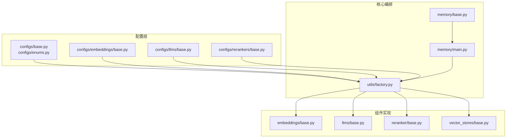
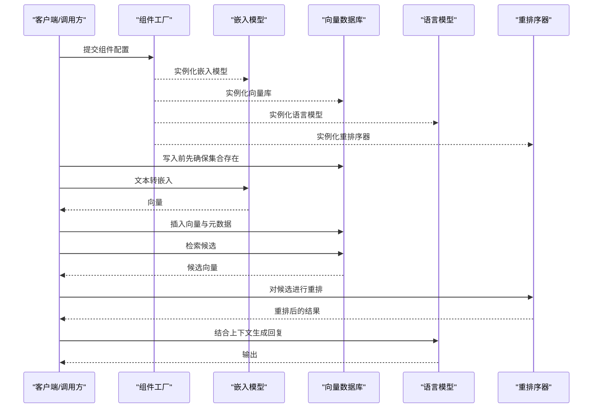
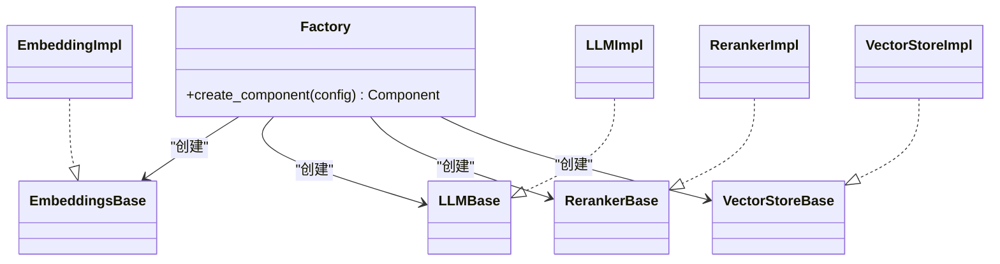
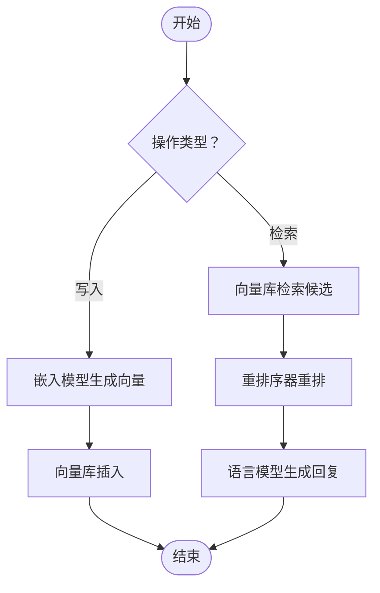
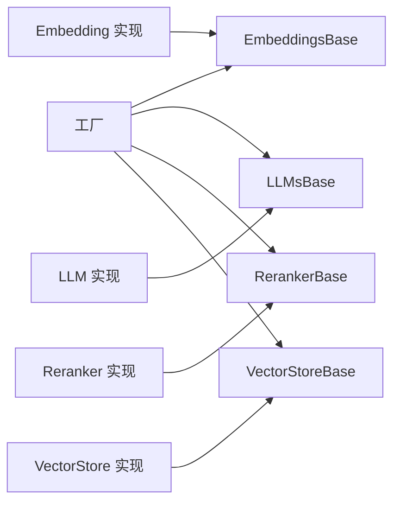

# 组件系统

<cite>
**本文引用的文件**
- [mem0/utils/factory.py](file://mem0/utils/factory.py)
- [mem0/configs/base.py](file://mem0/configs/base.py)
- [mem0/configs/enums.py](file://mem0/configs/enums.py)
- [mem0/configs/embeddings/base.py](file://mem0/configs/embeddings/base.py)
- [mem0/configs/llms/base.py](file://mem0/configs/llms/base.py)
- [mem0/configs/rerankers/base.py](file://mem0/configs/rerankers/base.py)
- [mem0/embeddings/base.py](file://mem0/embeddings/base.py)
- [mem0/llms/base.py](file://mem0/llms/base.py)
- [mem0/reranker/base.py](file://mem0/reranker/base.py)
- [mem0/vector_stores/base.py](file://mem0/vector_stores/base.py)
- [mem0/memory/base.py](file://mem0/memory/base.py)
- [mem0/memory/main.py](file://mem0/memory/main.py)
- [mem0/client/main.py](file://mem0/client/main.py)
- [docs/components/embedders/overview.mdx](file://docs/components/embedders/overview.mdx)
- [docs/components/llms/overview.mdx](file://docs/components/llms/overview.mdx)
- [docs/components/rerankers/overview.mdx](file://docs/components/rerankers/overview.mdx)
- [docs/components/vectordbs/overview.mdx](file://docs/components/vectordbs/overview.mdx)
- [docs/components/vectordbs/config.mdx](file://docs/components/vectordbs/config.mdx)
- [docs/components/embedders/config.mdx](file://docs/components/embedders/config.mdx)
- [docs/components/llms/config.mdx](file://docs/components/llms/config.mdx)
- [docs/components/rerankers/config.mdx](file://docs/components/rerankers/config.mdx)
- [examples/nemoclaw/quickstart.md](file://examples/nemoclaw/quickstart.md)
- [docs/integrations/openclaw.mdx](file://docs/integrations/openclaw.mdx)
- [marketplace.json](file://marketplace.json)
- [cli/python/src/mem0_cli/backend/base.py](file://cli/python/src/mem0_cli/backend/base.py)
</cite>

## 目录
1. [简介](#简介)
2. [项目结构](#项目结构)
3. [核心组件](#核心组件)
4. [架构总览](#架构总览)
5. [详细组件分析](#详细组件分析)
6. [依赖分析](#依赖分析)
7. [性能考虑](#性能考虑)
8. [故障排除指南](#故障排除指南)
9. [结论](#结论)
10. [附录](#附录)

## 简介
本文件系统性阐述 Mem0 的可插拔组件体系：围绕向量存储、语言模型（LLM）、嵌入模型（Embedder）与重排序器（Reranker）四大核心组件，解释其工作原理、配置方式、性能特征与组合策略，并提供组件选择指南、自定义开发方法与集成标准，以及组件间依赖关系与通信机制说明。文档同时覆盖 CLI 与平台集成场景下的配置与排障要点。

## 项目结构
Mem0 将“组件”抽象为可替换的实现模块，通过统一工厂与配置层进行装配。核心目录与职责概览如下：
- mem0/configs：各组件的配置基类与枚举，定义可选参数与默认值
- mem0/embeddings、mem0/llms、mem0/reranker、mem0/vector_stores：各组件的具体实现
- mem0/memory：记忆管理主流程，负责调用组件完成嵌入、检索、重排序与持久化
- mem0/utils/factory.py：组件工厂，按配置动态实例化具体实现
- docs/components/*：官方组件文档，包含各组件的配置项、示例与注意事项
- examples 与 docs/integrations：展示在不同平台（如 OpenCLAW）中的集成与配置

图表来源
- [mem0/configs/base.py](file://mem0/configs/base.py)
- [mem0/configs/enums.py](file://mem0/configs/enums.py)
- [mem0/configs/embeddings/base.py](file://mem0/configs/embeddings/base.py)
- [mem0/configs/llms/base.py](file://mem0/configs/llms/base.py)
- [mem0/configs/rerankers/base.py](file://mem0/configs/rerankers/base.py)
- [mem0/embeddings/base.py](file://mem0/embeddings/base.py)
- [mem0/llms/base.py](file://mem0/llms/base.py)
- [mem0/reranker/base.py](file://mem0/reranker/base.py)
- [mem0/vector_stores/base.py](file://mem0/vector_stores/base.py)
- [mem0/memory/base.py](file://mem0/memory/base.py)
- [mem0/memory/main.py](file://mem0/memory/main.py)
- [mem0/utils/factory.py](file://mem0/utils/factory.py)

章节来源
- [mem0/configs/base.py](file://mem0/configs/base.py)
- [mem0/configs/enums.py](file://mem0/configs/enums.py)
- [mem0/utils/factory.py](file://mem0/utils/factory.py)
- [mem0/memory/base.py](file://mem0/memory/base.py)
- [mem0/memory/main.py](file://mem0/memory/main.py)

## 核心组件
- 嵌入模型（Embedder）
  - 职责：将文本转换为向量表示，供向量数据库存储与检索
  - 支持：OpenAI、Azure OpenAI、Gemini、HuggingFace、Ollama、FastEmbed、Vertex AI、Bedrock、Together 等
  - 配置要点：模型名称、维度、API 密钥、端点、超时等；当自定义模型维度不为 1536 时，需在向量库配置中显式声明
- 语言模型（LLM）
  - 职责：执行提示词工程、结构化输出、函数调用等
  - 支持：OpenAI、Anthropic、Groq、Gemini、Bedrock、Azure OpenAI、LiteLLM、vLLM、Together、Minimax、XAI、DeepSeek、Sarvam 等
  - 配置要点：模型名称、温度、最大生成长度、结构化输出支持、工具调用能力等
- 向量数据库（Vector Store）
  - 职责：存储向量与元数据，支持高效相似度检索
  - 支持：Qdrant、Pinecone、Chroma、Weaviate、Redis、Milvus、Faiss、Elasticsearch、Cassandra、Supabase、Upstash、Valkey、Azure AI Search、Databricks、Neptune Analytics、Baidu、Turbopuffer、S3 Vectors、MongoDB、PgVector、OpenSearch、Vertex AI Vector Search、Azure MySQL 等
  - 配置要点：集合名、维度、连接参数、认证信息、持久化开关等；当嵌入维度与默认不一致时，需在配置中对齐
- 重排序器（Reranker）
  - 职责：对候选结果进行二次打分与重排，提升检索质量
  - 支持：Cohere、Sentence Transformer、HuggingFace、LLM-Reranker、Zero Entropy 等
  - 配置要点：模型名称、阈值、top-k、是否归一化等

章节来源
- [docs/components/embedders/overview.mdx](file://docs/components/embedders/overview.mdx)
- [docs/components/llms/overview.mdx](file://docs/components/llms/overview.mdx)
- [docs/components/vectordbs/overview.mdx](file://docs/components/vectordbs/overview.mdx)
- [docs/components/rerankers/overview.mdx](file://docs/components/rerankers/overview.mdx)

## 架构总览
Mem0 的可插拔架构以“配置驱动 + 工厂模式”为核心，客户端或服务端通过统一入口传入组件配置，工厂根据类型与实现映射动态创建具体组件实例，再由记忆模块编排调用，完成“写入（嵌入+入库）—检索（向量检索+重排）—更新/删除”的完整生命周期。

图表来源
- [mem0/utils/factory.py](file://mem0/utils/factory.py)
- [mem0/memory/main.py](file://mem0/memory/main.py)
- [mem0/vector_stores/base.py](file://mem0/vector_stores/base.py)
- [mem0/embeddings/base.py](file://mem0/embeddings/base.py)
- [mem0/llms/base.py](file://mem0/llms/base.py)
- [mem0/reranker/base.py](file://mem0/reranker/base.py)

## 详细组件分析

### 组件工厂与装配
- 工厂职责：依据配置中的组件类型与实现标识，解析并实例化具体实现
- 关键输入：组件类别（embeddings/llms/vector_stores/rerankers）、实现名称、配置字典
- 关键输出：已初始化的组件对象，供上层编排调用
- 设计优势：解耦配置与实现，便于扩展新提供商与切换现有实现

图表来源
- [mem0/utils/factory.py](file://mem0/utils/factory.py)
- [mem0/embeddings/base.py](file://mem0/embeddings/base.py)
- [mem0/llms/base.py](file://mem0/llms/base.py)
- [mem0/reranker/base.py](file://mem0/reranker/base.py)
- [mem0/vector_stores/base.py](file://mem0/vector_stores/base.py)

章节来源
- [mem0/utils/factory.py](file://mem0/utils/factory.py)
- [mem0/configs/base.py](file://mem0/configs/base.py)
- [mem0/configs/enums.py](file://mem0/configs/enums.py)

### 嵌入模型（Embedder）
- 工作原理：接收文本输入，调用后端提供商接口或本地推理引擎，返回定长向量
- 配置要点：模型名称、维度、鉴权参数、端点、超时、批处理大小等
- 性能特征：向量化速度与延迟受模型规模、硬件加速、批处理影响；维度需与向量库配置一致
- 兼容性：当使用非默认维度（如 768）时，必须同步调整向量库配置

章节来源
- [docs/components/embedders/overview.mdx](file://docs/components/embedders/overview.mdx)
- [docs/components/embedders/config.mdx](file://docs/components/embedders/config.mdx)
- [docs/components/vectordbs/overview.mdx](file://docs/components/vectordbs/overview.mdx)

### 语言模型（LLM）
- 工作原理：接收系统/用户/工具调用等提示，生成文本或结构化输出；部分实现支持函数调用
- 配置要点：模型名称、温度、最大输出长度、结构化输出、工具/函数调用、流式响应等
- 性能特征：吞吐与延迟受模型大小、并发、上下文长度与后端限流影响
- 适配范围：OpenAI 兼容、Anthropic、Bedrock、Azure OpenAI、LiteLLM 等

章节来源
- [docs/components/llms/overview.mdx](file://docs/components/llms/overview.mdx)
- [docs/components/llms/config.mdx](file://docs/components/llms/config.mdx)

### 向量数据库（Vector Store）
- 工作原理：存储向量与元数据，提供相似度检索与过滤查询；支持批量插入与更新
- 配置要点：集合名、维度、连接参数（主机、端口、URL、凭据）、持久化路径、Redis URL 等
- 性能特征：检索延迟与索引算法、倒排表大小、过滤条件复杂度相关；批量写入与索引刷新策略影响吞吐
- 兼容性：若嵌入维度与默认 1536 不一致，需在配置中显式声明

章节来源
- [docs/components/vectordbs/overview.mdx](file://docs/components/vectordbs/overview.mdx)
- [docs/components/vectordbs/config.mdx](file://docs/components/vectordbs/config.mdx)

### 重排序器（Reranker）
- 工作原理：对候选结果进行二次打分与重排，提高相关性与上下文匹配度
- 配置要点：模型名称、top-k、阈值、是否归一化、是否启用
- 性能特征：重排计算成本与候选数量、模型复杂度相关；通常用于降低后续 LLM 上下文压力

章节来源
- [docs/components/rerankers/overview.mdx](file://docs/components/rerankers/overview.mdx)
- [docs/components/rerankers/config.mdx](file://docs/components/rerankers/config.mdx)

### 记忆编排（Memory）
- 编排逻辑：写入时先嵌入，再入库；检索时先向量检索，再经重排序器重排，最后结合 LLM 生成回复
- 关键流程：add/search/update/delete，均通过工厂创建的组件完成
- 客户端入口：Python 客户端提供统一接口，内部委托 memory/main.py 执行

图表来源
- [mem0/memory/main.py](file://mem0/memory/main.py)
- [mem0/memory/base.py](file://mem0/memory/base.py)
- [mem0/client/main.py](file://mem0/client/main.py)

章节来源
- [mem0/memory/main.py](file://mem0/memory/main.py)
- [mem0/memory/base.py](file://mem0/memory/base.py)
- [mem0/client/main.py](file://mem0/client/main.py)

## 依赖分析
- 组件内聚与耦合
  - 各组件通过 base 抽象与工厂解耦，新增实现仅需遵循接口规范
  - 记忆模块仅依赖工厂与抽象接口，不直接关心具体实现细节
- 外部依赖
  - 向量库依赖外部服务或本地引擎（如 FAISS、Chroma），需正确配置网络与认证
  - LLM/Embedder 依赖第三方 API 或本地推理，需配置密钥与端点
- 可能的循环依赖
  - 当前结构以工厂为中介，避免了组件间的直接循环依赖

图表来源
- [mem0/utils/factory.py](file://mem0/utils/factory.py)
- [mem0/embeddings/base.py](file://mem0/embeddings/base.py)
- [mem0/llms/base.py](file://mem0/llms/base.py)
- [mem0/reranker/base.py](file://mem0/reranker/base.py)
- [mem0/vector_stores/base.py](file://mem0/vector_stores/base.py)

章节来源
- [mem0/utils/factory.py](file://mem0/utils/factory.py)
- [mem0/embeddings/base.py](file://mem0/embeddings/base.py)
- [mem0/llms/base.py](file://mem0/llms/base.py)
- [mem0/reranker/base.py](file://mem0/reranker/base.py)
- [mem0/vector_stores/base.py](file://mem0/vector_stores/base.py)

## 性能考虑
- 嵌入与检索
  - 控制嵌入维度与向量库索引参数，减少维度不匹配导致的运行时错误
  - 批量写入与检索可显著提升吞吐，但需平衡内存与延迟
- 重排序器
  - top-k 与阈值直接影响召回质量与延迟；建议在测试集上评估
- LLM 推理
  - 合理设置温度与最大输出长度；对长上下文场景优先考虑结构化输出与工具调用
- 平台集成
  - 在 OpenCLAW 等环境中，确保插件槽位与允许列表配置正确，避免加载失败

[本节为通用指导，无需特定文件引用]

## 故障排除指南
- “嵌入维度不匹配”错误
  - 现象：向量维度与默认 1536 不一致时报错
  - 处理：在向量库配置中显式声明 embedding_model_dims 或 dimension
- “插件未激活/不可用”
  - 现象：CLI 报告插件被排除或未启用
  - 处理：检查 plugins.allow 与 plugins.slots.memory 设置；确认插件已安装并启用
- “更新失败”
  - 处理：使用插件 ID 更新；若仍失败，尝试卸载后重新安装
- “OpenCLAW 快速开始测试未命中记忆”
  - 现象：新会话无法自动召回历史记忆
  - 处理：确认 auto-capture 与 auto-recall 流程已在沙箱中正确配置与触发

章节来源
- [docs/components/vectordbs/overview.mdx](file://docs/components/vectordbs/overview.mdx)
- [docs/integrations/openclaw.mdx](file://docs/integrations/openclaw.mdx)
- [examples/nemoclaw/quickstart.md](file://examples/nemoclaw/quickstart.md)

## 结论
Mem0 的组件系统通过“配置驱动 + 工厂模式”，实现了嵌入、检索、重排与生成的完全可插拔架构。用户可根据性能、成本与功能需求灵活选择组件组合，并通过标准化配置与接口快速扩展新的提供商。平台集成（如 OpenCLAW）提供了便捷的部署与运维通道。建议在生产环境优先验证嵌入维度一致性、重排策略与 LLM 上下文长度限制，并建立完善的监控与回滚机制。

[本节为总结性内容，无需特定文件引用]

## 附录

### 组件选择指南
- 开发/小规模测试
  - 嵌入：OpenAI text-embedding-3-small（默认）
  - 向量库：Qdrant（默认）或本地 FAISS
  - LLM：OpenAI gpt-4o-mini（默认）
  - 重排序器：关闭或轻量级模型
- 生产/高可用
  - 嵌入：与向量库维度一致的模型
  - 向量库：具备高可用与备份能力的服务型数据库
  - LLM：具备工具调用与结构化输出能力的模型
  - 重排序器：基于业务语料训练的模型或 Cohere/SentenceTransformer

[本节为通用指导，无需特定文件引用]

### 自定义组件开发与集成标准
- 实现规范
  - 继承对应 base 类，实现必需接口（如嵌入、查询、插入等）
  - 明确配置参数与默认值，保持与 configs/* 下的基类一致
- 集成步骤
  - 在工厂注册映射，使配置可识别新实现
  - 补充文档与示例，完善配置参考与常见问题
- 质量保障
  - 提供单元测试与集成测试
  - 明确性能边界与限流策略

[本节为通用指导，无需特定文件引用]

### CLI 与平台集成要点
- CLI 后端
  - Python CLI 后端提供统一的配置与状态管理入口
- 平台市场
  - marketplace.json 定义插件源与分类，确保本地或远程安装路径正确

章节来源
- [cli/python/src/mem0_cli/backend/base.py](file://cli/python/src/mem0_cli/backend/base.py)
- [marketplace.json](file://marketplace.json)