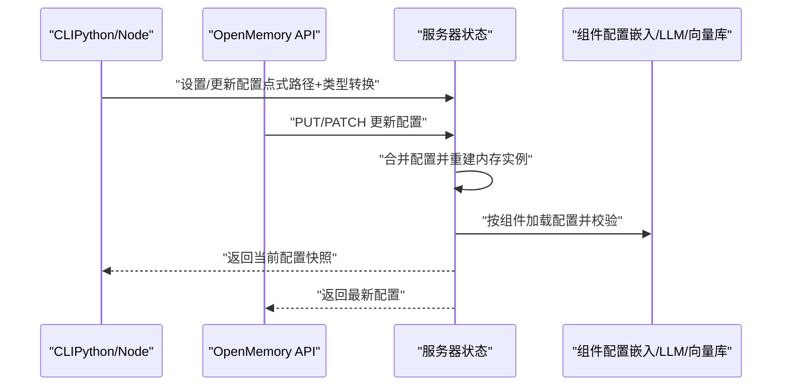
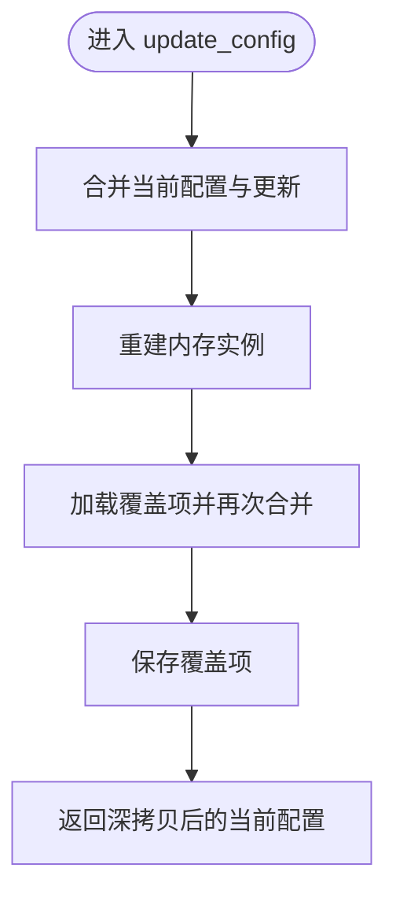
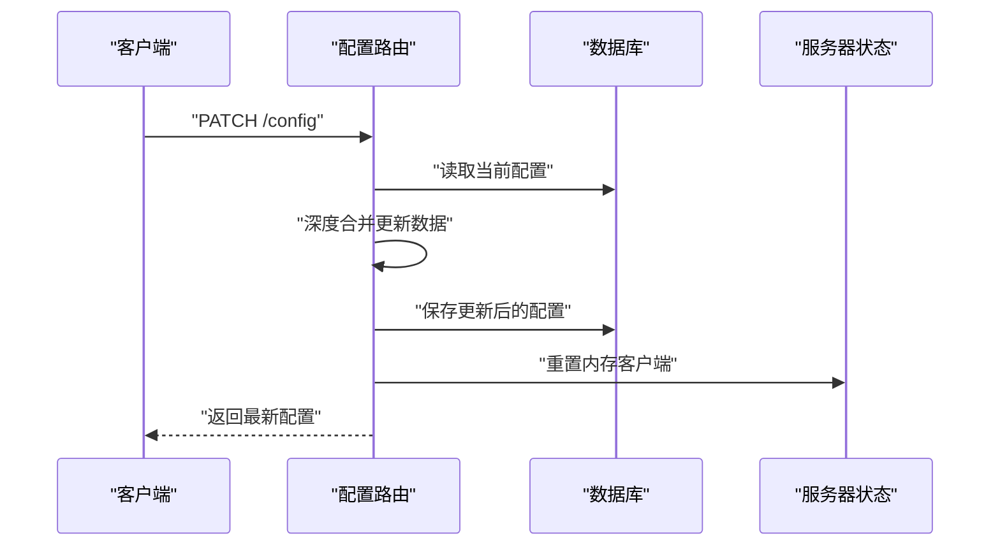
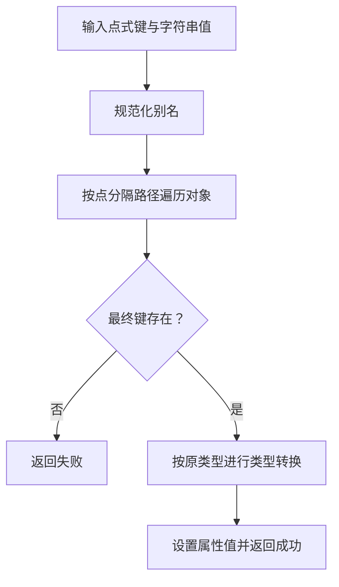
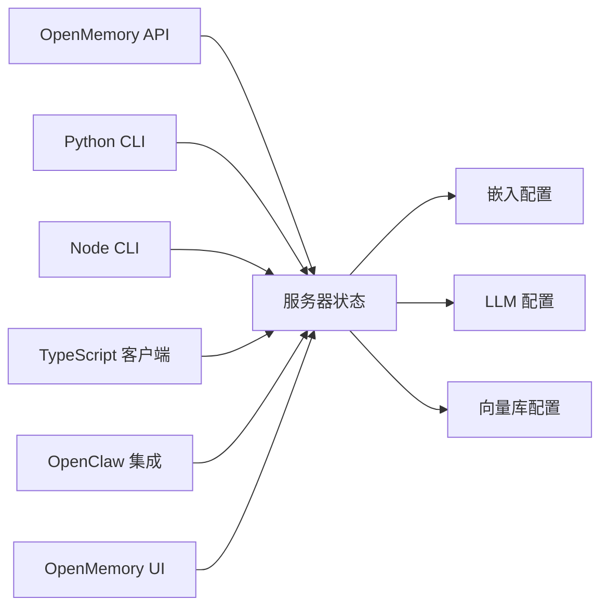

# 组件配置系统

<cite>
**本文引用的文件**
- [server_state.py](file://server/server_state.py)
- [config.py（Python CLI）](file://cli/python/src/mem0_cli/config.py)
- [config.py（OpenMemory API）](file://openmemory/api/app/routers/config.py)
- [default_config.json（OpenMemory 默认配置）](file://openmemory/api/default_config.json)
- [config.ts（Node CLI）](file://cli/node/src/config.ts)
- [config.ts（TypeScript 客户端）](file://mem0-ts/src/client/config.ts)
- [config.py（嵌入模型配置）](file://mem0/embeddings/configs.py)
- [config.py（LLM 配置）](file://mem0/llms/configs.py)
- [config.py（向量库配置）](file://mem0/vector_stores/configs.py)
- [notices.py（配置状态持久化）](file://mem0/memory/notices.py)
- [config.ts（OpenClaw 集成配置）](file://integrations/openclaw/config.ts)
- [config.ts（OpenMemory UI 配置）](file://openmemory/ui/store/configSlice.ts)
</cite>

## 目录
1. [简介](#简介)
2. [项目结构](#项目结构)
3. [核心组件](#核心组件)
4. [架构总览](#架构总览)
5. [详细组件分析](#详细组件分析)
6. [依赖关系分析](#依赖关系分析)
7. [性能考量](#性能考量)
8. [故障排除指南](#故障排除指南)
9. [结论](#结论)
10. [附录](#附录)

## 简介
本文件系统性阐述 Mem0 的组件配置体系：包括配置来源与优先级、配置文件结构、环境变量与运行时配置的使用方式、组件间依赖关系与配置验证规则、热更新与持久化策略、环境隔离与安全配置、配置迁移与版本管理、以及默认值覆盖与继承机制。目标是帮助开发者在不同运行场景（CLI、服务端、UI、集成插件）中正确地设计、应用与维护配置。

## 项目结构
Mem0 的配置系统横跨多语言与多组件：
- Python CLI：负责本地配置读写、键路径设置与类型转换。
- Node CLI：负责本地配置读写、键路径设置与类型转换。
- OpenMemory API：提供配置的数据库存储、HTTP 接口与热重载。
- TypeScript 客户端：面向前端或 SDK 的配置管理。
- 各组件子系统（嵌入、LLM、向量库）：各自定义配置模型与默认值。
- OpenClaw 集成：提供额外的配置加载与脚本解析能力。
- OpenMemory UI：前端状态中的配置片段与持久化。

```mermaid
graph TB
subgraph "CLI 层"
PYCLI["Python CLI 配置<br/>cli/python/src/mem0_cli/config.py"]
NODECLI["Node CLI 配置<br/>cli/node/src/config.ts"]
end
subgraph "服务端层"
SERVER["服务器状态与热更新<br/>server/server_state.py"]
API["OpenMemory API 路由<br/>openmemory/api/app/routers/config.py"]
DEFAULTCFG["默认配置文件<br/>openmemory/api/default_config.json"]
END
subgraph "客户端层"
TSCLIENT["TypeScript 客户端配置<br/>mem0-ts/src/client/config.ts"]
UISTORE["OpenMemory UI 配置状态<br/>openmemory/ui/store/configSlice.ts"]
END
subgraph "组件配置"
EMB["嵌入配置<br/>mem0/embeddings/configs.py"]
LLM["LLM 配置<br/>mem0/llms/configs.py"]
VS["向量库配置<br/>mem0/vector_stores/configs.py"]
OC["OpenClaw 集成配置<br/>integrations/openclaw/config.ts"]
END
PYCLI --> SERVER
NODECLI --> SERVER
API --> SERVER
DEFAULTCFG --> SERVER
TSCLIENT --> SERVER
UISTORE --> SERVER
SERVER --> EMB
SERVER --> LLM
SERVER --> VS
OC --> SERVER
```

**图表来源**
- [server_state.py:86-107](file://server/server_state.py#L86-L107)
- [config.py（OpenMemory API）:141-177](file://openmemory/api/app/routers/config.py#L141-L177)
- [default_config.json（OpenMemory 默认配置）](file://openmemory/api/default_config.json)
- [config.py（Python CLI）:218-241](file://cli/python/src/mem0_cli/config.py#L218-L241)
- [config.ts（Node CLI）](file://cli/node/src/config.ts)
- [config.ts（TypeScript 客户端）](file://mem0-ts/src/client/config.ts)
- [config.py（嵌入模型配置）](file://mem0/embeddings/configs.py)
- [config.py（LLM 配置）](file://mem0/llms/configs.py)
- [config.py（向量库配置）](file://mem0/vector_stores/configs.py)
- [config.ts（OpenClaw 集成配置）](file://integrations/openclaw/config.ts)
- [config.ts（OpenMemory UI 配置）](file://openmemory/ui/store/configSlice.ts)

**章节来源**
- [server_state.py:86-107](file://server/server_state.py#L86-L107)
- [config.py（OpenMemory API）:141-177](file://openmemory/api/app/routers/config.py#L141-L177)
- [default_config.json（OpenMemory 默认配置）](file://openmemory/api/default_config.json)

## 核心组件
- 服务器状态与热更新：集中管理当前配置、内存实例与覆盖项，并支持通过更新接口进行热替换。
- OpenMemory API：提供配置的持久化、HTTP 更新与补丁接口，并在更新后触发内存客户端重置。
- CLI 配置（Python/Node）：提供本地配置文件读写、点式路径设置、类型转换与安全脱敏输出。
- 组件配置（嵌入/LLM/向量库）：各子系统定义自身配置模型与默认值，作为配置树的一部分。
- TypeScript 客户端与 UI：在前端侧维护配置状态并与后端同步。
- OpenClaw 集成：为外部工具链提供配置加载与脚本解析能力。

**章节来源**
- [server_state.py:86-107](file://server/server_state.py#L86-L107)
- [config.py（OpenMemory API）:141-177](file://openmemory/api/app/routers/config.py#L141-L177)
- [config.py（Python CLI）:218-241](file://cli/python/src/mem0_cli/config.py#L218-L241)
- [config.ts（Node CLI）](file://cli/node/src/config.ts)
- [config.py（嵌入模型配置）](file://mem0/embeddings/configs.py)
- [config.py（LLM 配置）](file://mem0/llms/configs.py)
- [config.py（向量库配置）](file://mem0/vector_stores/configs.py)
- [config.ts（TypeScript 客户端）](file://mem0-ts/src/client/config.ts)
- [config.ts（OpenClaw 集成配置）](file://integrations/openclaw/config.ts)
- [config.ts（OpenMemory UI 配置）](file://openmemory/ui/store/configSlice.ts)

## 架构总览
配置流从“来源”到“合并”再到“应用”，贯穿 CLI、服务端与组件层：



**图表来源**
- [server_state.py:86-107](file://server/server_state.py#L86-L107)
- [config.py（Python CLI）:218-241](file://cli/python/src/mem0_cli/config.py#L218-L241)
- [config.py（OpenMemory API）:141-177](file://openmemory/api/app/routers/config.py#L141-L177)

## 详细组件分析

### 服务器状态与热更新
- 当前配置与内存实例：全局持有当前配置与内存实例；若未初始化则抛出错误。
- 更新流程：接收更新字典，合并当前配置与更新内容，重建内存实例，并持久化覆盖项。
- 并发控制：使用锁保护配置与实例的并发访问。



**图表来源**
- [server_state.py:86-107](file://server/server_state.py#L86-L107)

**章节来源**
- [server_state.py:86-107](file://server/server_state.py#L86-L107)

### OpenMemory API 配置路由
- PUT 接口：更新 openmemory 与 mem0 配置段，支持部分字段更新。
- PATCH 接口：深度合并当前配置与传入更新，保存至数据库并重置内存客户端以生效新配置。



**图表来源**
- [config.py（OpenMemory API）:141-177](file://openmemory/api/app/routers/config.py#L141-L177)

**章节来源**
- [config.py（OpenMemory API）:141-177](file://openmemory/api/app/routers/config.py#L141-L177)

### CLI 配置（Python）
- 点式路径设置：支持形如 “mem0.llm.api_key”的键路径，自动定位嵌套属性并设置。
- 类型转换：根据目标属性类型对字符串进行布尔/整数转换。
- 安全输出：对密钥类字段进行脱敏显示。



**图表来源**
- [config.py（Python CLI）:218-241](file://cli/python/src/mem0_cli/config.py#L218-L241)

**章节来源**
- [config.py（Python CLI）:218-241](file://cli/python/src/mem0_cli/config.py#L218-L241)

### CLI 配置（Node）
- 与 Python CLI 对应，提供本地配置文件读写、点式路径设置与类型转换能力。
- 用于 Node 生态下的配置管理与自动化脚本。

**章节来源**
- [config.ts（Node CLI）](file://cli/node/src/config.ts)

### TypeScript 客户端配置
- 在前端或 SDK 中维护配置对象，支持与后端配置同步与回写。
- 便于在浏览器或 Node 环境下统一管理组件参数。

**章节来源**
- [config.ts（TypeScript 客户端）](file://mem0-ts/src/client/config.ts)

### 组件配置（嵌入/LLM/向量库）
- 各子系统提供独立的配置模型与默认值，作为整体配置树的叶子节点。
- 服务器状态在重建内存实例时会读取这些配置并进行校验与实例化。

**章节来源**
- [config.py（嵌入模型配置）](file://mem0/embeddings/configs.py)
- [config.py（LLM 配置）](file://mem0/llms/configs.py)
- [config.py（向量库配置）](file://mem0/vector_stores/configs.py)

### OpenClaw 集成配置
- 提供额外的配置加载与脚本解析能力，便于在外部工具链中注入或覆盖配置。

**章节来源**
- [config.ts（OpenClaw 集成配置）](file://integrations/openclaw/config.ts)

### OpenMemory UI 配置状态
- 前端 Store 中维护配置片段，与后端保持同步，支持用户交互式调整。

**章节来源**
- [config.ts（OpenMemory UI 配置）](file://openmemory/ui/store/configSlice.ts)

## 依赖关系分析
- 服务器状态依赖于组件配置模块（嵌入/LLM/向量库）以完成实例重建。
- OpenMemory API 路由依赖数据库存储与服务器状态以实现持久化与热重载。
- CLI 与 TypeScript 客户端通过点式路径与类型转换与服务器状态对接。
- OpenClaw 集成与 UI 作为外部消费方参与配置生命周期。



**图表来源**
- [server_state.py:86-107](file://server/server_state.py#L86-L107)
- [config.py（OpenMemory API）:141-177](file://openmemory/api/app/routers/config.py#L141-L177)
- [config.py（Python CLI）:218-241](file://cli/python/src/mem0_cli/config.py#L218-L241)
- [config.ts（Node CLI）](file://cli/node/src/config.ts)
- [config.ts（TypeScript 客户端）](file://mem0-ts/src/client/config.ts)
- [config.py（嵌入模型配置）](file://mem0/embeddings/configs.py)
- [config.py（LLM 配置）](file://mem0/llms/configs.py)
- [config.py（向量库配置）](file://mem0/vector_stores/configs.py)
- [config.ts（OpenClaw 集成配置）](file://integrations/openclaw/config.ts)
- [config.ts（OpenMemory UI 配置）](file://openmemory/ui/store/configSlice.ts)

**章节来源**
- [server_state.py:86-107](file://server/server_state.py#L86-L107)
- [config.py（OpenMemory API）:141-177](file://openmemory/api/app/routers/config.py#L141-L177)
- [config.py（Python CLI）:218-241](file://cli/python/src/mem0_cli/config.py#L218-L241)
- [config.ts（Node CLI）](file://cli/node/src/config.ts)
- [config.ts（TypeScript 客户端）](file://mem0-ts/src/client/config.ts)
- [config.py（嵌入模型配置）](file://mem0/embeddings/configs.py)
- [config.py（LLM 配置）](file://mem0/llms/configs.py)
- [config.py（向量库配置）](file://mem0/vector_stores/configs.py)
- [config.ts（OpenClaw 集成配置）](file://integrations/openclaw/config.ts)
- [config.ts（OpenMemory UI 配置）](file://openmemory/ui/store/configSlice.ts)

## 性能考量
- 配置热更新成本：每次更新都会重建内存实例，建议批量更新或在低峰期执行。
- 深度合并复杂度：PATCH 接口采用递归合并，注意避免过深的嵌套结构导致性能下降。
- 并发安全：服务器状态使用锁保护，避免竞态条件引发的配置不一致。
- 类型转换开销：CLI 设置时的类型转换为常数时间操作，影响可忽略。

[本节为通用指导，无需特定文件来源]

## 故障排除指南
- 未初始化错误：当调用内存实例但尚未初始化时会抛出异常，请先完成配置更新与重建。
- 键路径无效：CLI 点式设置返回失败时，检查键是否存在且路径正确。
- 密钥泄露风险：在日志或输出中避免直接打印敏感字段，使用脱敏输出。
- 配置持久化失败：确认数据库连接正常，PATCH 成功后需重置内存客户端以生效。
- 配置状态不一致：检查 UI Store 与后端是否同步，必要时刷新页面或重新登录。

**章节来源**
- [server_state.py:103-107](file://server/server_state.py#L103-L107)
- [config.py（Python CLI）:218-241](file://cli/python/src/mem0_cli/config.py#L218-L241)
- [config.py（OpenMemory API）:141-177](file://openmemory/api/app/routers/config.py#L141-L177)

## 结论
Mem0 的配置系统通过“来源—合并—应用”的闭环，实现了多语言、多组件、多层（CLI/服务端/UI）的一致性管理。服务器状态承担了热更新与实例重建的核心职责，OpenMemory API 提供持久化与 HTTP 接口，CLI 与客户端提供便捷的配置编辑能力。遵循本文档的优先级、验证与最佳实践，可在不同环境中稳定地进行配置演进与运维。

[本节为总结，无需特定文件来源]

## 附录

### 配置来源与优先级
- 来源顺序（从高到低）：运行时更新 > 环境变量（由各组件解析） > CLI/客户端设置 > 数据库配置 > 默认配置文件。
- 合并策略：服务器状态采用“浅合并”覆盖，API 路由采用“深度合并”保留非更新字段。
- 组件默认值：嵌入/LLM/向量库各自提供默认值，作为最终兜底。

**章节来源**
- [server_state.py:86-107](file://server/server_state.py#L86-L107)
- [config.py（OpenMemory API）:141-177](file://openmemory/api/app/routers/config.py#L141-L177)
- [default_config.json（OpenMemory 默认配置）](file://openmemory/api/default_config.json)

### 配置文件结构与环境变量
- 配置文件：JSON/YAML（依据具体实现），包含组件段落与顶层设置。
- 环境变量：由各组件解析并注入到对应配置段，优先级低于运行时更新。
- CLI 设置：通过点式路径写入配置，支持布尔/整数类型转换。

**章节来源**
- [config.py（Python CLI）:218-241](file://cli/python/src/mem0_cli/config.py#L218-L241)
- [config.ts（Node CLI）](file://cli/node/src/config.ts)

### 运行时配置与热更新
- 服务器状态：提供更新入口，重建内存实例并持久化覆盖项。
- API 路由：PUT/PATCH 接口分别支持全量替换与增量合并。
- 客户端同步：TypeScript 客户端与 UI Store 与后端保持同步。

**章节来源**
- [server_state.py:86-107](file://server/server_state.py#L86-L107)
- [config.py（OpenMemory API）:141-177](file://openmemory/api/app/routers/config.py#L141-L177)
- [config.ts（TypeScript 客户端）](file://mem0-ts/src/client/config.ts)
- [config.ts（OpenMemory UI 配置）](file://openmemory/ui/store/configSlice.ts)

### 组件间依赖与配置验证
- 依赖链：服务器状态 → 组件配置（嵌入/LLM/向量库）→ 内存实例。
- 验证规则：各组件配置提供默认值与类型约束，服务器状态在重建时进行实例化校验。
- 不兼容变更：升级组件版本时，注意默认值与字段变更，必要时迁移配置。

**章节来源**
- [server_state.py:86-107](file://server/server_state.py#L86-L107)
- [config.py（嵌入模型配置）](file://mem0/embeddings/configs.py)
- [config.py（LLM 配置）](file://mem0/llms/configs.py)
- [config.py（向量库配置）](file://mem0/vector_stores/configs.py)

### 配置示例与最佳实践
- 示例：在 CLI 中通过点式路径设置 LLM 的 API Key；在 API 中使用 PATCH 增量更新；在 UI 中交互式调整。
- 最佳实践：集中管理敏感信息（密钥/令牌），使用环境变量注入；避免在生产环境直接暴露配置文件；定期备份数据库配置；在灰度环境中先行验证变更。

**章节来源**
- [config.py（Python CLI）:218-241](file://cli/python/src/mem0_cli/config.py#L218-L241)
- [config.py（OpenMemory API）:141-177](file://openmemory/api/app/routers/config.py#L141-L177)
- [config.ts（OpenMemory UI 配置）](file://openmemory/ui/store/configSlice.ts)

### 热更新、环境隔离与安全配置
- 热更新：通过服务器状态与 API 路由实现，更新后重建内存实例并重置客户端。
- 环境隔离：通过环境变量与不同配置文件区分开发/测试/生产；CLI 支持临时覆盖。
- 安全配置：脱敏输出敏感字段；限制配置文件权限；仅授权人员访问数据库配置。

**章节来源**
- [server_state.py:86-107](file://server/server_state.py#L86-L107)
- [config.py（Python CLI）:218-241](file://cli/python/src/mem0_cli/config.py#L218-L241)
- [config.py（OpenMemory API）:141-177](file://openmemory/api/app/routers/config.py#L141-L177)

### 配置迁移、版本管理与故障排除
- 迁移：从旧版本迁移时，对照组件默认值与字段变更，使用 PATCH 逐步更新。
- 版本管理：记录配置版本与变更日志，配合数据库备份与回滚策略。
- 故障排除：检查初始化顺序、合并冲突、类型转换与持久化状态。

**章节来源**
- [server_state.py:86-107](file://server/server_state.py#L86-L107)
- [config.py（OpenMemory API）:141-177](file://openmemory/api/app/routers/config.py#L141-L177)
- [default_config.json（OpenMemory 默认配置）](file://openmemory/api/default_config.json)

### 默认值覆盖与配置继承
- 默认值：组件配置提供默认值，作为最终兜底。
- 覆盖机制：运行时更新与 API PATCH 会覆盖默认值；CLI 设置同样生效。
- 继承机制：服务器状态在重建时自上而下读取并合并，形成最终配置树。

**章节来源**
- [server_state.py:86-107](file://server/server_state.py#L86-L107)
- [config.py（嵌入模型配置）](file://mem0/embeddings/configs.py)
- [config.py（LLM 配置）](file://mem0/llms/configs.py)
- [config.py（向量库配置）](file://mem0/vector_stores/configs.py)