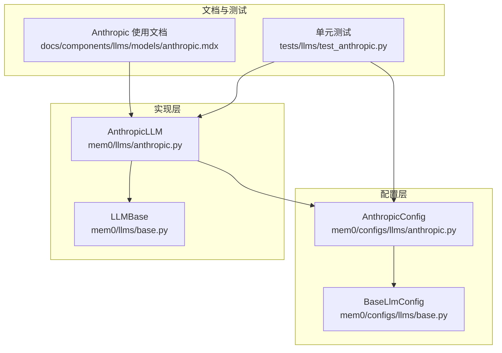
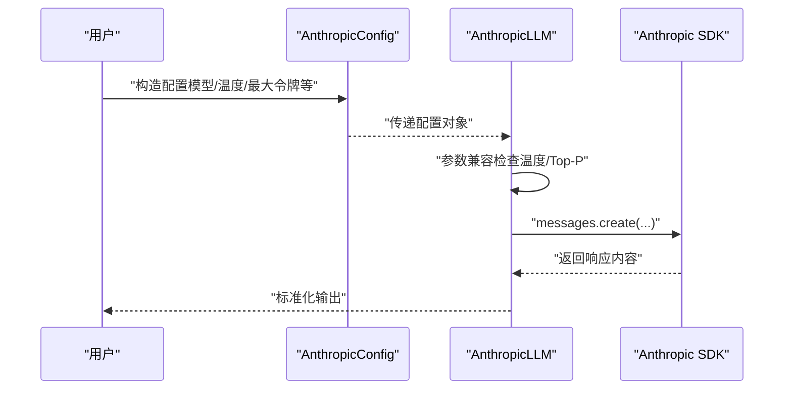
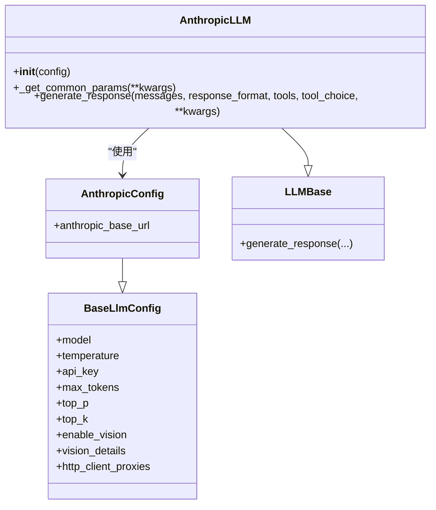
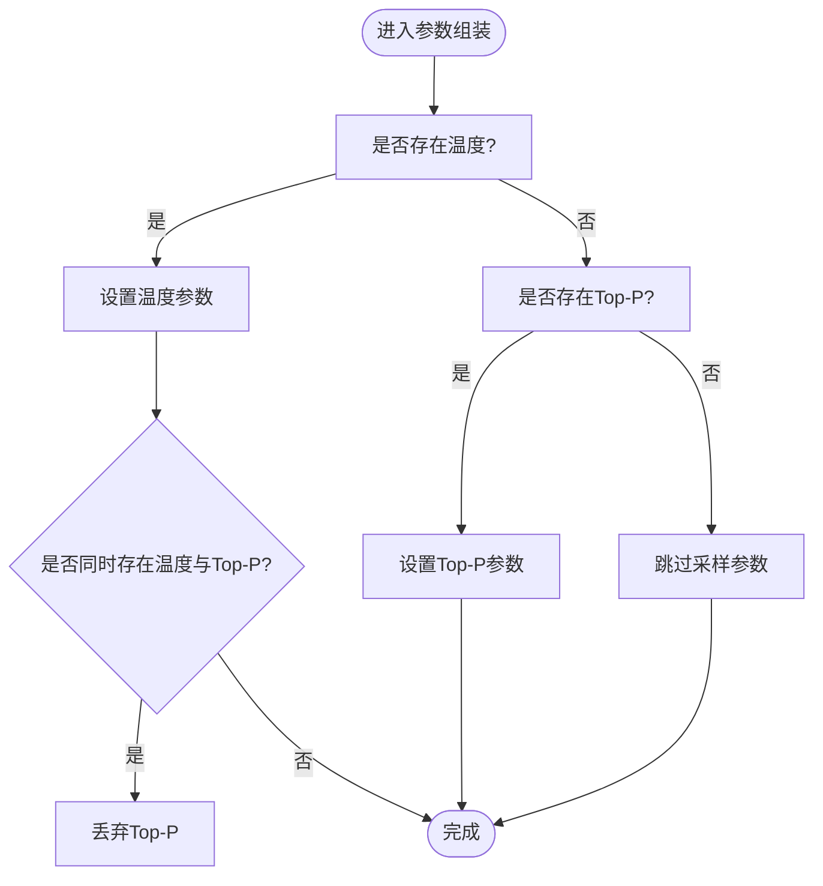

# Anthropic Claude 模型

<cite>
**本文引用的文件**
- [anthropic.py](file://mem0/configs/llms/anthropic.py)
- [anthropic.py](file://mem0/llms/anthropic.py)
- [anthropic.mdx](file://docs/components/llms/models/anthropic.mdx)
- [test_anthropic.py](file://tests/llms/test_anthropic.py)
- [base.py](file://mem0/llms/base.py)
- [base.py](file://mem0/configs/llms/base.py)
</cite>

## 目录
1. [简介](#简介)
2. [项目结构](#项目结构)
3. [核心组件](#核心组件)
4. [架构总览](#架构总览)
5. [详细组件分析](#详细组件分析)
6. [依赖关系分析](#依赖关系分析)
7. [性能考虑](#性能考虑)
8. [故障排查指南](#故障排查指南)
9. [结论](#结论)
10. [附录](#附录)

## 简介
本文件面向在 Mem0 中使用 Anthropic Claude 模型的开发者与使用者，系统性说明 Claude 系列模型的配置方法、参数调优与输出格式控制，并对比其与 OpenAI 模型的差异与优势。文档同时提供对话管理、上下文长度优化与成本控制策略，以及实际使用案例与最佳实践建议。

## 项目结构
与 Anthropic Claude 相关的核心代码分布在以下模块：
- 配置层：定义 Anthropic 特有的配置类，继承通用 LLM 配置基类
- 实现层：封装 Anthropic SDK 客户端，处理参数兼容（如温度与采样参数冲突）
- 文档示例：提供环境变量与配置示例，展示如何在 Mem0 中启用 Claude
- 测试用例：验证默认行为、参数发送规则与类型转换逻辑



图表来源
- [anthropic.py:1-56](file://mem0/configs/llms/anthropic.py#L1-L56)
- [base.py:1-200](file://mem0/configs/llms/base.py#L1-L200)
- [anthropic.py:1-77](file://mem0/llms/anthropic.py#L1-L77)
- [base.py:1-200](file://mem0/llms/base.py#L1-L200)
- [anthropic.mdx:1-41](file://docs/components/llms/models/anthropic.mdx#L1-L41)
- [test_anthropic.py:1-100](file://tests/llms/test_anthropic.py#L1-L100)

章节来源
- [anthropic.py:1-56](file://mem0/configs/llms/anthropic.py#L1-L56)
- [anthropic.py:1-77](file://mem0/llms/anthropic.py#L1-L77)
- [anthropic.mdx:1-41](file://docs/components/llms/models/anthropic.mdx#L1-L41)
- [test_anthropic.py:1-100](file://tests/llms/test_anthropic.py#L1-L100)

## 核心组件
- AnthropicConfig：定义 Claude 专属配置项，包含基础参数与 Claude 特有参数（如基础 URL），并继承通用 LLM 配置
- AnthropicLLM：封装 Anthropic SDK 客户端，负责参数兼容处理（避免同时发送温度与核采样参数）、消息生成与工具调用支持
- 文档与测试：提供使用示例与行为验证，确保默认安全策略与兼容性

章节来源
- [anthropic.py:6-56](file://mem0/configs/llms/anthropic.py#L6-L56)
- [anthropic.py:14-77](file://mem0/llms/anthropic.py#L14-L77)
- [anthropic.mdx:7-38](file://docs/components/llms/models/anthropic.mdx#L7-L38)
- [test_anthropic.py:20-100](file://tests/llms/test_anthropic.py#L20-L100)

## 架构总览
下图展示了从配置到调用的完整流程，包括参数兼容策略与默认值处理：



图表来源
- [anthropic.py:14-77](file://mem0/llms/anthropic.py#L14-L77)
- [anthropic.py:43-66](file://mem0/llms/anthropic.py#L43-L66)
- [anthropic.py:68-77](file://mem0/llms/anthropic.py#L68-L77)

## 详细组件分析

### 配置类：AnthropicConfig
- 继承自 BaseLlmConfig，复用通用参数（模型、温度、最大令牌、Top-P、Top-K、视觉能力、代理等）
- Claude 专属参数：基础 URL，便于对接自定义网关或代理
- 默认值策略：温度默认较低以提升确定性；Top-P 默认未设置，避免与温度冲突

章节来源
- [anthropic.py:6-56](file://mem0/configs/llms/anthropic.py#L6-L56)
- [base.py:1-200](file://mem0/configs/llms/base.py#L1-L200)

### 实现类：AnthropicLLM
- 初始化：自动选择默认模型；优先使用显式配置，其次读取环境变量中的 API Key
- 参数兼容：当同时设置温度与 Top-P 时，遵循 Claude 的限制，仅发送温度参数
- 响应生成：支持消息列表输入、可选工具调用与格式化输出（通过上层接口）



图表来源
- [anthropic.py:6-56](file://mem0/configs/llms/anthropic.py#L6-L56)
- [anthropic.py:14-77](file://mem0/llms/anthropic.py#L14-L77)
- [base.py:1-200](file://mem0/configs/llms/base.py#L1-L200)
- [base.py:1-200](file://mem0/llms/base.py#L1-L200)

章节来源
- [anthropic.py:14-77](file://mem0/llms/anthropic.py#L14-L77)
- [test_anthropic.py:20-100](file://tests/llms/test_anthropic.py#L20-L100)

### 参数兼容与默认行为
- 默认不发送 Top-P，避免与温度冲突
- 当仅设置 Top-P 时才发送该参数
- 当同时设置两者时，优先保留温度，丢弃 Top-P
- 基类配置若同时设置了温度与 Top-P，转换为 Claude 配置时同样遵循上述优先级



图表来源
- [anthropic.py:43-66](file://mem0/llms/anthropic.py#L43-L66)
- [test_anthropic.py:27-100](file://tests/llms/test_anthropic.py#L27-L100)

章节来源
- [anthropic.py:43-66](file://mem0/llms/anthropic.py#L43-L66)
- [test_anthropic.py:27-100](file://tests/llms/test_anthropic.py#L27-L100)

### 使用示例与集成要点
- 在文档中提供了基于环境变量与配置字典的使用示例，展示如何在 Mem0 中启用 Claude 并进行记忆写入
- 示例强调了 API Key 的设置位置与最小可用配置

章节来源
- [anthropic.mdx:7-38](file://docs/components/llms/models/anthropic.mdx#L7-L38)

## 依赖关系分析
- AnthropicLLM 依赖 Anthropic SDK 客户端，需确保运行环境中已安装相应依赖
- 配置层与实现层之间通过统一的配置对象解耦，便于扩展其他 LLM 提供商
- 测试覆盖了默认行为、参数发送规则与类型转换，保障兼容性

```mermaid
graph LR
SDK["anthropic SDK"] <- --> Impl["AnthropicLLM"]
Impl --> Cfg["AnthropicConfig"]
Cfg --> BaseCfg["BaseLlmConfig"]
Impl --> BaseImpl["LLMBase"]
```

图表来源
- [anthropic.py:14-77](file://mem0/llms/anthropic.py#L14-L77)
- [anthropic.py:6-56](file://mem0/configs/llms/anthropic.py#L6-L56)
- [base.py:1-200](file://mem0/configs/llms/base.py#L1-L200)
- [base.py:1-200](file://mem0/llms/base.py#L1-L200)

章节来源
- [anthropic.py:14-77](file://mem0/llms/anthropic.py#L14-L77)
- [anthropic.py:6-56](file://mem0/configs/llms/anthropic.py#L6-L56)
- [test_anthropic.py:12-17](file://tests/llms/test_anthropic.py#L12-L17)

## 性能考虑
- 降低温度可减少输出多样性，提高确定性，适合需要稳定回答的任务
- 合理设置最大令牌数，避免不必要的长输出导致延迟与成本上升
- 对于重复性任务，结合记忆系统进行上下文复用，减少重复输入
- 在高并发场景下，注意外部 API 的速率限制与重试策略

## 故障排查指南
- 无法导入依赖：确认已安装 Anthropic SDK，否则会抛出导入异常
- 温度与 Top-P 冲突：默认不会同时发送两者；如需使用 Top-P，请显式清除温度或保持默认
- API Key 未设置：若未在配置中指定且环境变量中也未提供，客户端初始化会失败
- 工具调用与格式化：确保上层调用传入正确的工具定义与格式化参数

章节来源
- [anthropic.py:4-7](file://mem0/llms/anthropic.py#L4-L7)
- [anthropic.py:40-41](file://mem0/llms/anthropic.py#L40-L41)
- [test_anthropic.py:20-100](file://tests/llms/test_anthropic.py#L20-L100)

## 结论
Mem0 对 Anthropic Claude 的集成提供了清晰的配置与实现边界：通过配置类抽象与实现类封装，既保证了与通用 LLM 接口的一致性，又针对 Claude 的参数约束实现了安全的默认行为。配合合理的参数调优与上下文管理策略，可在稳定性、可控性与成本之间取得良好平衡。

## 附录

### API 密钥设置
- 将 API Key 设置在环境变量中，实现零硬编码配置
- 若在配置中显式提供，将优先使用配置中的密钥

章节来源
- [anthropic.mdx:7-17](file://docs/components/llms/models/anthropic.mdx#L7-L17)
- [anthropic.py:40-41](file://mem0/llms/anthropic.py#L40-L41)

### 模型参数调优与输出格式控制
- 温度：影响输出随机性，默认较低以增强确定性
- 最大令牌：控制单次生成长度，建议按任务需求设定
- Top-P/Top-K：默认不发送 Top-P；如需使用请单独设置
- 视觉能力：可通过配置开启，具体取决于所选模型支持情况

章节来源
- [anthropic.py:12-56](file://mem0/configs/llms/anthropic.py#L12-L56)
- [anthropic.py:43-66](file://mem0/llms/anthropic.py#L43-L66)

### 与 OpenAI 模型的差异与优势
- 参数约束差异：Claude 不允许同时发送温度与 Top-P，实现层已内置兼容逻辑
- 默认策略：Claude 默认不发送 Top-P，OpenAI 默认可能不同，需按需调整
- 输出稳定性：Claude 在某些推理任务上更偏向稳定与可控，适合需要一致性的场景

章节来源
- [test_anthropic.py:27-100](file://tests/llms/test_anthropic.py#L27-L100)

### 对话管理、上下文长度优化与成本控制策略
- 对话管理：通过记忆系统记录历史交互，减少重复输入
- 上下文长度优化：合理裁剪历史消息，使用摘要或分段策略
- 成本控制：限制最大令牌数、降低温度、避免不必要的多轮生成

### 实际使用案例与最佳实践
- 使用文档示例中的最小配置快速启动
- 在生产环境使用环境变量集中管理密钥
- 针对不同任务场景分别维护温度与最大令牌的配置集

章节来源
- [anthropic.mdx:19-38](file://docs/components/llms/models/anthropic.mdx#L19-L38)