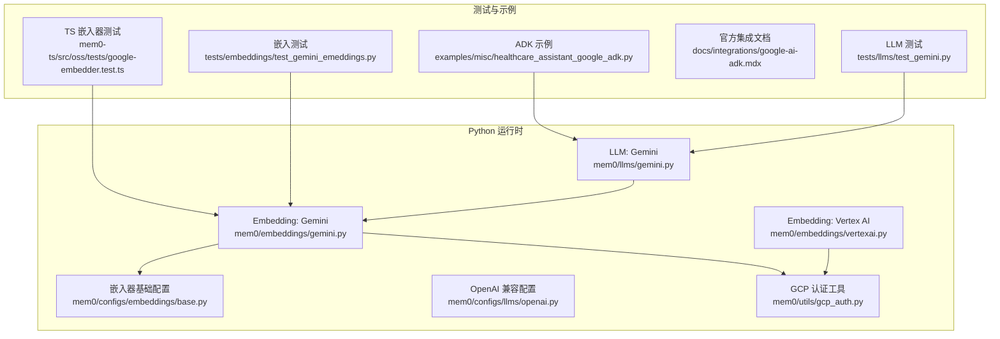
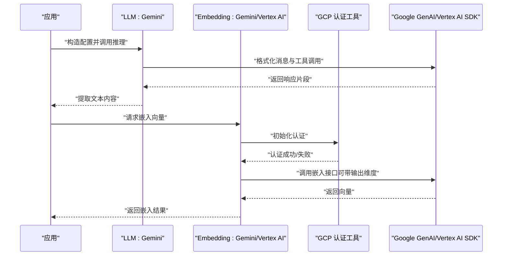
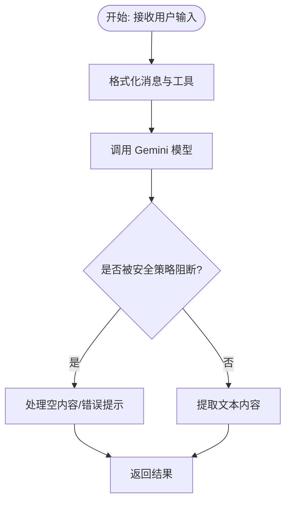
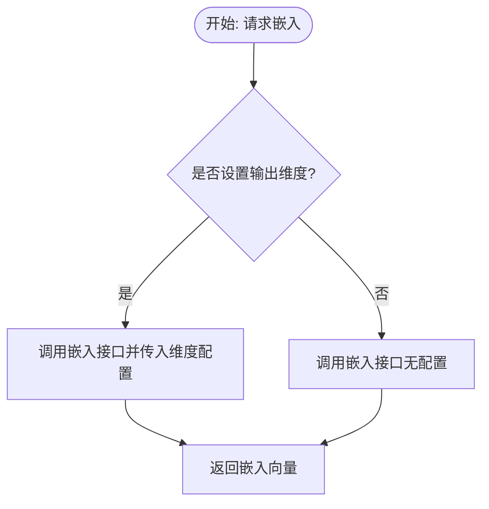
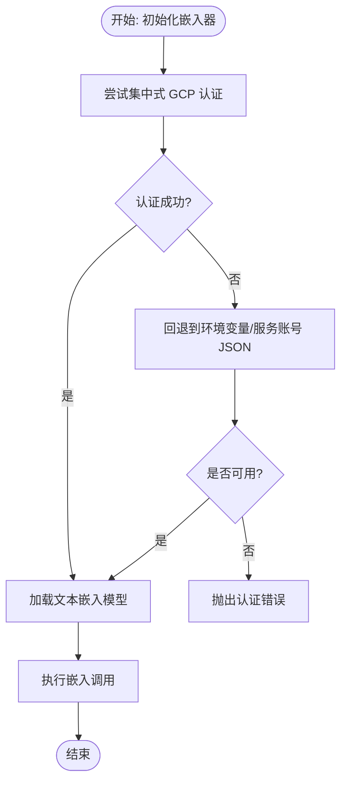
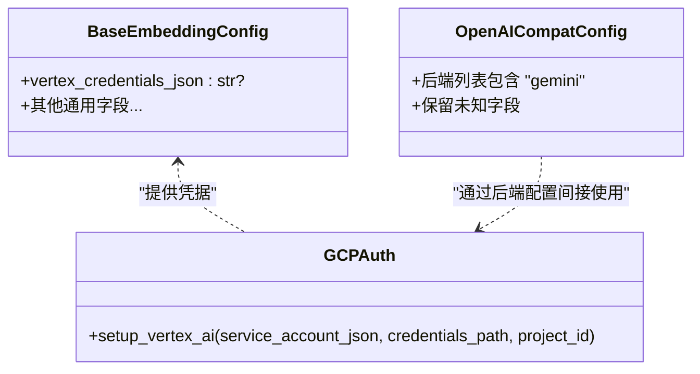
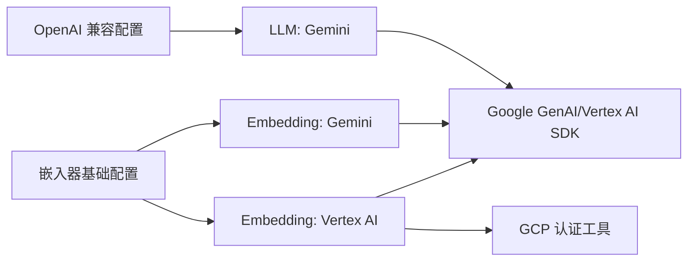

# Google 系列模型

<cite>
**本文引用的文件**
- [mem0/llms/gemini.py](file://mem0/llms/gemini.py)
- [mem0/embeddings/gemini.py](file://mem0/embeddings/gemini.py)
- [mem0/embeddings/vertexai.py](file://mem0/embeddings/vertexai.py)
- [mem0/configs/llms/openai.py](file://mem0/configs/llms/openai.py)
- [mem0/configs/embeddings/base.py](file://mem0/configs/embeddings/base.py)
- [mem0/utils/gcp_auth.py](file://mem0/utils/gcp_auth.py)
- [tests/llms/test_gemini.py](file://tests/llms/test_gemini.py)
- [tests/embeddings/test_gemini_emeddings.py](file://tests/embeddings/test_gemini_emeddings.py)
- [examples/misc/healthcare_assistant_google_adk.py](file://examples/misc/healthcare_assistant_google_adk.py)
- [docs/integrations/google-ai-adk.mdx](file://docs/integrations/google-ai-adk.mdx)
- [mem0-ts/src/oss/tests/google-embedder.test.ts](file://mem0-ts/src/oss/tests/google-embedder.test.ts)
</cite>

## 目录
1. [简介](#简介)
2. [项目结构](#项目结构)
3. [核心组件](#核心组件)
4. [架构总览](#架构总览)
5. [详细组件分析](#详细组件分析)
6. [依赖关系分析](#依赖关系分析)
7. [性能考虑](#性能考虑)
8. [故障排除指南](#故障排除指南)
9. [结论](#结论)
10. [附录](#附录)

## 简介
本文件面向在 mem0 中使用 Google 系列模型（主要为 Gemini）的开发者与产品团队，系统梳理了以下内容：
- Gemini Pro、Gemini Flash 等模型在 Python 与 TypeScript 客户端中的配置与调用方式
- Google AI Studio 集成与认证流程（含服务账号与环境变量）
- 模型参数设置、安全过滤与内容生成策略
- 多模态处理、批量嵌入与性能优化技巧
- 与其他主流 LLM 的对比与选型建议

## 项目结构
围绕 Google 系列模型的关键实现分布在如下模块：
- LLM 推理：Python 实现位于 mem0/llms/gemini.py；TypeScript 测试覆盖了嵌入器行为
- 嵌入向量：Python 嵌入器（gemini 与 vertexai）分别位于 mem0/embeddings/gemini.py 与 mem0/embeddings/vertexai.py
- 认证与配置：GCP 认证工具位于 mem0/utils/gcp_auth.py；嵌入器通用配置位于 mem0/configs/embeddings/base.py；OpenAI 兼容层配置位于 mem0/configs/llms/openai.py
- 示例与文档：示例脚本 examples/misc/healthcare_assistant_google_adk.py 展示了模型使用；官方集成文档位于 docs/integrations/google-ai-adk.mdx
- 测试：tests/llms/test_gemini.py 与 tests/embeddings/test_gemini_emeddings.py 提供行为验证

**图表来源**
- [mem0/llms/gemini.py](file://mem0/llms/gemini.py)
- [mem0/embeddings/gemini.py](file://mem0/embeddings/gemini.py)
- [mem0/embeddings/vertexai.py](file://mem0/embeddings/vertexai.py)
- [mem0/configs/embeddings/base.py](file://mem0/configs/embeddings/base.py)
- [mem0/configs/llms/openai.py](file://mem0/configs/llms/openai.py)
- [mem0/utils/gcp_auth.py](file://mem0/utils/gcp_auth.py)
- [tests/llms/test_gemini.py](file://tests/llms/test_gemini.py)
- [tests/embeddings/test_gemini_emeddings.py](file://tests/embeddings/test_gemini_emeddings.py)
- [examples/misc/healthcare_assistant_google_adk.py](file://examples/misc/healthcare_assistant_google_adk.py)
- [docs/integrations/google-ai-adk.mdx](file://docs/integrations/google-ai-adk.mdx)
- [mem0-ts/src/oss/tests/google-embedder.test.ts](file://mem0-ts/src/oss/tests/google-embedder.test.ts)

**章节来源**
- [mem0/llms/gemini.py](file://mem0/llms/gemini.py)
- [mem0/embeddings/gemini.py](file://mem0/embeddings/gemini.py)
- [mem0/embeddings/vertexai.py](file://mem0/embeddings/vertexai.py)
- [mem0/configs/embeddings/base.py](file://mem0/configs/embeddings/base.py)
- [mem0/configs/llms/openai.py](file://mem0/configs/llms/openai.py)
- [mem0/utils/gcp_auth.py](file://mem0/utils/gcp_auth.py)
- [tests/llms/test_gemini.py](file://tests/llms/test_gemini.py)
- [tests/embeddings/test_gemini_emeddings.py](file://tests/embeddings/test_gemini_emeddings.py)
- [examples/misc/healthcare_assistant_google_adk.py](file://examples/misc/healthcare_assistant_google_adk.py)
- [docs/integrations/google-ai-adk.mdx](file://docs/integrations/google-ai-adk.mdx)
- [mem0-ts/src/oss/tests/google-embedder.test.ts](file://mem0-ts/src/oss/tests/google-embedder.test.ts)

## 核心组件
- Gemini LLM 推理器：封装消息格式化、工具调用、响应提取与安全过滤逻辑，支持默认模型与参数重映射
- Gemini 嵌入器：基于 genai 或 Vertex AI SDK，支持自定义输出维度与批量嵌入
- Vertex AI 嵌入器：通过 GCP 认证工具初始化，支持多种凭据方式与回退机制
- 配置体系：嵌入器基础配置包含 Gemini 特定字段；OpenAI 兼容层允许扩展 Gemini 等后端
- 认证工具：集中式 GCP 认证器，兼容服务账号 JSON、凭据路径与环境变量

**章节来源**
- [mem0/llms/gemini.py](file://mem0/llms/gemini.py)
- [mem0/embeddings/gemini.py](file://mem0/embeddings/gemini.py)
- [mem0/embeddings/vertexai.py](file://mem0/embeddings/vertexai.py)
- [mem0/configs/embeddings/base.py](file://mem0/configs/embeddings/base.py)
- [mem0/configs/llms/openai.py](file://mem0/configs/llms/openai.py)
- [mem0/utils/gcp_auth.py](file://mem0/utils/gcp_auth.py)

## 架构总览
下图展示了从应用到 Google 模型的调用链路与关键组件交互。

**图表来源**
- [mem0/llms/gemini.py](file://mem0/llms/gemini.py)
- [mem0/embeddings/gemini.py](file://mem0/embeddings/gemini.py)
- [mem0/embeddings/vertexai.py](file://mem0/embeddings/vertexai.py)
- [mem0/utils/gcp_auth.py](file://mem0/utils/gcp_auth.py)

## 详细组件分析

### Gemini LLM 组件分析
- 职责与特性
  - 默认模型与参数映射：根据实现，推理器对默认模型与参数进行适配
  - 消息与工具格式化：将输入消息与工具规范为 Gemini 可接受的结构
  - 安全过滤：当响应被阻断时，内容可能为空，需在上层处理
  - OpenAI 兼容：在 OpenAI 兼容层中作为后端之一，保留未知字段以兼容 Gemini 等
- 关键流程
  - 输入消息预处理与工具序列化
  - 调用模型生成响应
  - 提取文本内容并返回

**图表来源**
- [mem0/llms/gemini.py](file://mem0/llms/gemini.py)
- [mem0/configs/llms/openai.py](file://mem0/configs/llms/openai.py)

**章节来源**
- [mem0/llms/gemini.py](file://mem0/llms/gemini.py)
- [mem0/configs/llms/openai.py](file://mem0/configs/llms/openai.py)

### Gemini Embedding 组件分析
- 职责与特性
  - 支持自定义输出维度（通过配置项），并在批量嵌入时传递相应参数
  - 当未显式设置维度时，不附加额外配置
  - 单次与批量嵌入均返回向量数组
- 关键流程
  - 初始化嵌入器并解析配置
  - 调用嵌入接口，按需传入输出维度
  - 返回向量或批处理结果

**图表来源**
- [mem0-ts/src/oss/tests/google-embedder.test.ts](file://mem0-ts/src/oss/tests/google-embedder.test.ts)
- [tests/embeddings/test_gemini_emeddings.py](file://tests/embeddings/test_gemini_emeddings.py)

**章节来源**
- [mem0-ts/src/oss/tests/google-embedder.test.ts](file://mem0-ts/src/oss/tests/google-embedder.test.ts)
- [tests/embeddings/test_gemini_emeddings.py](file://tests/embeddings/test_gemini_emeddings.py)

### Vertex AI Embedding 组件分析
- 职责与特性
  - 通过集中式 GCP 认证器初始化 Vertex AI，支持多种凭据方式
  - 回退机制：若集中式认证失败，则尝试传统环境变量方式
  - 默认模型名与文本嵌入调用
- 关键流程
  - 尝试集中式认证
  - 若失败则回退至环境变量或报错
  - 加载模型并执行嵌入

**图表来源**
- [mem0/embeddings/vertexai.py](file://mem0/embeddings/vertexai.py)
- [mem0/utils/gcp_auth.py](file://mem0/utils/gcp_auth.py)

**章节来源**
- [mem0/embeddings/vertexai.py](file://mem0/embeddings/vertexai.py)
- [mem0/utils/gcp_auth.py](file://mem0/utils/gcp_auth.py)

### 配置与认证组件分析
- 嵌入器基础配置
  - 包含 Vertex 凭据路径等字段，便于统一管理
- OpenAI 兼容配置
  - 允许在兼容层中配置 Gemini 等后端，保留未知字段以避免参数丢失
- GCP 认证工具
  - 提供 setup_vertex_ai 方法，支持服务账号 JSON、凭据路径与项目 ID 参数

**图表来源**
- [mem0/configs/embeddings/base.py](file://mem0/configs/embeddings/base.py)
- [mem0/configs/llms/openai.py](file://mem0/configs/llms/openai.py)
- [mem0/utils/gcp_auth.py](file://mem0/utils/gcp_auth.py)

**章节来源**
- [mem0/configs/embeddings/base.py](file://mem0/configs/embeddings/base.py)
- [mem0/configs/llms/openai.py](file://mem0/configs/llms/openai.py)
- [mem0/utils/gcp_auth.py](file://mem0/utils/gcp_auth.py)

## 依赖关系分析
- 组件耦合
  - LLM 与嵌入器之间通过配置解耦，便于替换不同后端
  - 嵌入器依赖认证工具与 SDK，Vertex AI 嵌入器进一步依赖 GCP 认证器
- 外部依赖
  - Google Auth 库用于认证相关能力（在依赖锁中可见）

**图表来源**
- [mem0/llms/gemini.py](file://mem0/llms/gemini.py)
- [mem0/embeddings/gemini.py](file://mem0/embeddings/gemini.py)
- [mem0/embeddings/vertexai.py](file://mem0/embeddings/vertexai.py)
- [mem0/configs/embeddings/base.py](file://mem0/configs/embeddings/base.py)
- [mem0/configs/llms/openai.py](file://mem0/configs/llms/openai.py)
- [mem0/utils/gcp_auth.py](file://mem0/utils/gcp_auth.py)

**章节来源**
- [mem0/llms/gemini.py](file://mem0/llms/gemini.py)
- [mem0/embeddings/gemini.py](file://mem0/embeddings/gemini.py)
- [mem0/embeddings/vertexai.py](file://mem0/embeddings/vertexai.py)
- [mem0/configs/embeddings/base.py](file://mem0/configs/embeddings/base.py)
- [mem0/configs/llms/openai.py](file://mem0/configs/llms/openai.py)
- [mem0/utils/gcp_auth.py](file://mem0/utils/gcp_auth.py)

## 性能考虑
- 批量嵌入
  - 使用批量嵌入接口可显著降低调用次数与网络开销
  - 在嵌入器测试中验证了批量模式下的参数传递
- 输出维度控制
  - 显式设置输出维度可减少下游向量存储与检索的资源消耗
- 并发与限流
  - 结合平台级速率限制与 SDK 默认重试策略，合理安排并发度
- 模型选择
  - 对于高吞吐场景优先考虑 Flash 系列；对复杂推理与长上下文任务优先考虑 Pro/2.0 系列

**章节来源**
- [mem0-ts/src/oss/tests/google-embedder.test.ts](file://mem0-ts/src/oss/tests/google-embedder.test.ts)
- [tests/embeddings/test_gemini_emeddings.py](file://tests/embeddings/test_gemini_emeddings.py)

## 故障排除指南
- 认证失败
  - 确认服务账号 JSON 路径或 GOOGLE_APPLICATION_CREDENTIALS 环境变量已正确设置
  - 若集中式认证失败，检查回退逻辑是否生效
- 响应被阻断
  - 当安全策略阻断时，响应内容可能为空，需在上层进行兜底处理
- 嵌入维度不生效
  - 仅在显式设置维度时才会传入配置；未设置时不会附加额外参数
- 示例参考
  - ADK 示例展示了如何在实际业务中选择模型并进行调用

**章节来源**
- [mem0/embeddings/vertexai.py](file://mem0/embeddings/vertexai.py)
- [mem0/llms/gemini.py](file://mem0/llms/gemini.py)
- [tests/embeddings/test_gemini_emeddings.py](file://tests/embeddings/test_gemini_emeddings.py)
- [examples/misc/healthcare_assistant_google_adk.py](file://examples/misc/healthcare_assistant_google_adk.py)

## 结论
- Gemini 在 mem0 中提供了统一的 LLM 与嵌入器抽象，支持灵活的配置与认证方式
- 通过批量嵌入与输出维度控制，可在保证质量的同时提升性能
- 在安全过滤与响应阻断方面，需要在应用层做好兜底与降级策略
- 与其他 LLM 对比时，建议结合任务类型（推理 vs. 检索）、成本与延迟目标进行选型

## 附录
- Google AI Studio 集成与认证流程
  - 参考官方集成文档以完成项目创建、密钥配置与权限授权
- 示例脚本
  - ADK 示例演示了在医疗助手场景中使用 Gemini 的完整流程

**章节来源**
- [docs/integrations/google-ai-adk.mdx](file://docs/integrations/google-ai-adk.mdx)
- [examples/misc/healthcare_assistant_google_adk.py](file://examples/misc/healthcare_assistant_google_adk.py)