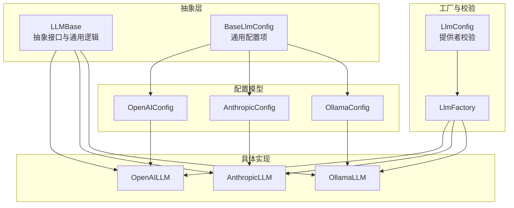
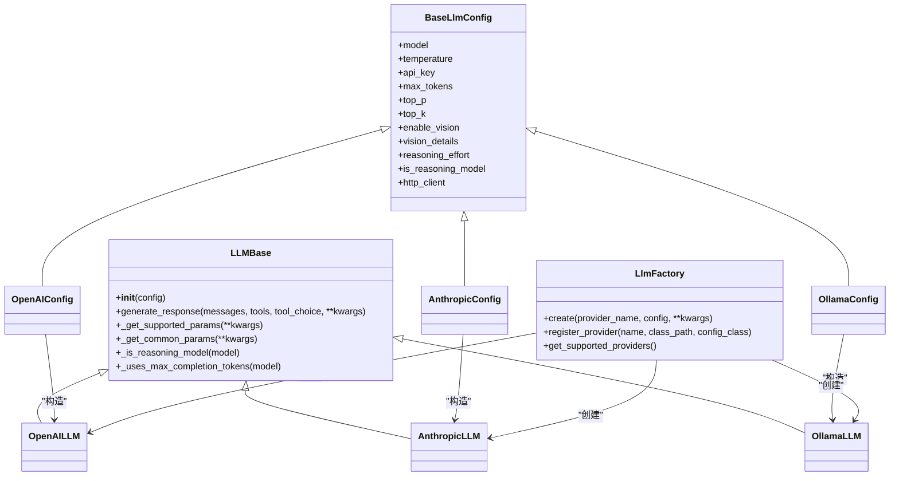
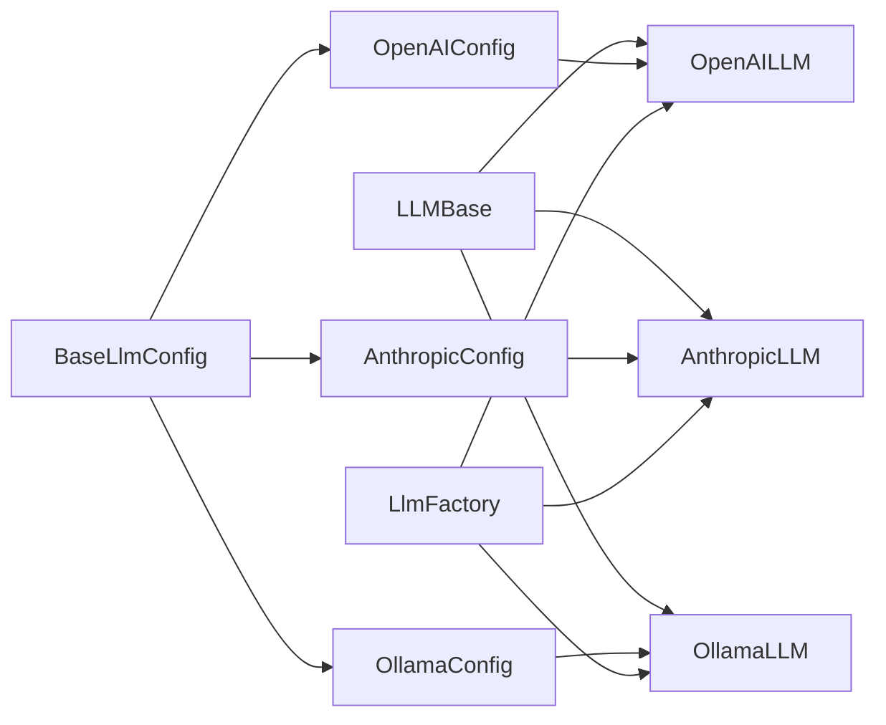

# LLM 抽象接口

<cite>
**本文引用的文件**
- [mem0/llms/base.py](file://mem0/llms/base.py)
- [mem0/configs/llms/base.py](file://mem0/configs/llms/base.py)
- [mem0/llms/configs.py](file://mem0/llms/configs.py)
- [mem0/llms/openai.py](file://mem0/llms/openai.py)
- [mem0/llms/anthropic.py](file://mem0/llms/anthropic.py)
- [mem0/llms/ollama.py](file://mem0/llms/ollama.py)
- [mem0/configs/llms/openai.py](file://mem0/configs/llms/openai.py)
- [mem0/configs/llms/anthropic.py](file://mem0/configs/llms/anthropic.py)
- [mem0/configs/llms/ollama.py](file://mem0/configs/llms/ollama.py)
- [mem0/utils/factory.py](file://mem0/utils/factory.py)
</cite>

## 目录
1. [引言](#引言)
2. [项目结构](#项目结构)
3. [核心组件](#核心组件)
4. [架构总览](#架构总览)
5. [详细组件分析](#详细组件分析)
6. [依赖关系分析](#依赖关系分析)
7. [性能考虑](#性能考虑)
8. [故障排查指南](#故障排查指南)
9. [结论](#结论)
10. [附录：自定义 LLM 提供商最佳实践](#附录自定义-llm-提供商最佳实践)

## 引言
本文件系统性阐述 mem0 中 LLM 抽象接口的设计与实现，覆盖基础接口设计原则、抽象方法定义、参数与返回值规范、接口继承体系、扩展机制与工厂注册、配置管理、错误处理与性能监控通用模式，并提供实现自定义 LLM 提供商的最佳实践与参考路径。

## 项目结构
围绕 LLM 的抽象与实现，代码主要分布在以下模块：
- 抽象基类与通用配置：mem0/llms/base.py、mem0/configs/llms/base.py
- 具体提供商实现：mem0/llms/openai.py、mem0/llms/anthropic.py、mem0/llms/ollama.py 等
- 配置模型：mem0/configs/llms/openai.py、mem0/configs/llms/anthropic.py、mem0/configs/llms/ollama.py 等
- 工厂与配置校验：mem0/utils/factory.py、mem0/llms/configs.py

图表来源
- [mem0/llms/base.py:1-176](file://mem0/llms/base.py#L1-L176)
- [mem0/configs/llms/base.py:1-78](file://mem0/configs/llms/base.py#L1-L78)
- [mem0/llms/openai.py:1-151](file://mem0/llms/openai.py#L1-L151)
- [mem0/llms/anthropic.py:1-126](file://mem0/llms/anthropic.py#L1-L126)
- [mem0/llms/ollama.py:1-144](file://mem0/llms/ollama.py#L1-L144)
- [mem0/configs/llms/openai.py:1-93](file://mem0/configs/llms/openai.py#L1-L93)
- [mem0/configs/llms/anthropic.py:1-57](file://mem0/configs/llms/anthropic.py#L1-L57)
- [mem0/configs/llms/ollama.py:1-57](file://mem0/configs/llms/ollama.py#L1-L57)
- [mem0/utils/factory.py:1-268](file://mem0/utils/factory.py#L1-L268)
- [mem0/llms/configs.py:1-36](file://mem0/llms/configs.py#L1-L36)

章节来源
- [mem0/llms/base.py:1-176](file://mem0/llms/base.py#L1-L176)
- [mem0/configs/llms/base.py:1-78](file://mem0/configs/llms/base.py#L1-L78)
- [mem0/utils/factory.py:1-268](file://mem0/utils/factory.py#L1-L268)

## 核心组件
- 抽象接口 LLMBase：定义统一的 generate_response 接口，提供通用参数过滤、推理模型识别、不同模型族的参数差异处理等能力。
- 通用配置 BaseLlmConfig：集中定义温度、采样参数、最大 token、视觉能力、推理努力级别、代理设置等跨提供商通用字段。
- 具体提供商实现：OpenAILLM、AnthropicLLM、OllamaLLM 等，负责对接各自 SDK 并实现 generate_response。
- 配置模型：OpenAIConfig、AnthropicConfig、OllamaConfig 等，扩展通用配置以满足特定提供商需求。
- 工厂 LlmFactory：根据提供者名称与配置动态创建对应 LLM 实例，支持旧版 BaseLlmConfig 与新版专用配置的转换。
- 提供者校验 LlmConfig：在高层配置中限制允许的提供商列表，确保工厂创建的安全性。

章节来源
- [mem0/llms/base.py:7-176](file://mem0/llms/base.py#L7-L176)
- [mem0/configs/llms/base.py:7-78](file://mem0/configs/llms/base.py#L7-L78)
- [mem0/llms/openai.py:14-151](file://mem0/llms/openai.py#L14-L151)
- [mem0/llms/anthropic.py:14-126](file://mem0/llms/anthropic.py#L14-L126)
- [mem0/llms/ollama.py:15-144](file://mem0/llms/ollama.py#L15-L144)
- [mem0/configs/llms/openai.py:6-93](file://mem0/configs/llms/openai.py#L6-L93)
- [mem0/configs/llms/anthropic.py:6-57](file://mem0/configs/llms/anthropic.py#L6-L57)
- [mem0/configs/llms/ollama.py:6-57](file://mem0/configs/llms/ollama.py#L6-L57)
- [mem0/utils/factory.py:31-138](file://mem0/utils/factory.py#L31-L138)
- [mem0/llms/configs.py:6-36](file://mem0/llms/configs.py#L6-L36)

## 架构总览
LLM 抽象接口采用“抽象基类 + 多实现 + 工厂 + 配置模型”的分层设计：
- 抽象层：LLMBase 定义统一接口与通用行为（参数过滤、模型族差异处理）。
- 实现层：各提供商实现 generate_response，并按需重写参数组装策略。
- 配置层：BaseLlmConfig 提供通用字段；各提供商配置类扩展专属字段。
- 工厂层：LlmFactory 负责实例化与配置转换，保证调用方透明切换提供商。

图表来源
- [mem0/llms/base.py:7-176](file://mem0/llms/base.py#L7-L176)
- [mem0/configs/llms/base.py:7-78](file://mem0/configs/llms/base.py#L7-L78)
- [mem0/llms/openai.py:14-151](file://mem0/llms/openai.py#L14-L151)
- [mem0/llms/anthropic.py:14-126](file://mem0/llms/anthropic.py#L14-L126)
- [mem0/llms/ollama.py:15-144](file://mem0/llms/ollama.py#L15-L144)
- [mem0/configs/llms/openai.py:6-93](file://mem0/configs/llms/openai.py#L6-L93)
- [mem0/configs/llms/anthropic.py:6-57](file://mem0/configs/llms/anthropic.py#L6-L57)
- [mem0/configs/llms/ollama.py:6-57](file://mem0/configs/llms/ollama.py#L6-L57)
- [mem0/utils/factory.py:31-138](file://mem0/utils/factory.py#L31-L138)

## 详细组件分析

### 抽象接口 LLMBase
- 设计要点
  - 统一入口 generate_response，屏蔽不同提供商的消息格式与参数差异。
  - 通过 _get_supported_params 与 _get_common_params 过滤与组装参数，自动适配推理模型与新老模型族的参数命名差异。
  - 内置模型族识别：推理模型（如 o1/o3/gpt-5 系列）与常规模型的参数集合不同。
- 关键方法
  - generate_response：抽象方法，子类必须实现。
  - _get_supported_params：根据模型类型筛选支持的参数集。
  - _get_common_params：组装通用采样与长度控制参数。
  - _is_reasoning_model/_uses_max_completion_tokens：模型族判断辅助函数。
- 参数与返回值
  - 输入：messages（消息数组）、tools（工具定义数组）、tool_choice（工具选择策略）、kwargs（提供商特有参数）。
  - 返回：字符串或字典（包含 content 与 tool_calls），由具体实现解析。
- 错误处理
  - 基类配置校验：要求存在 model 字段；API Key 可通过环境变量注入（由具体实现处理）。
  - 子类可自行抛出异常（如第三方库导入失败、请求失败等）。

章节来源
- [mem0/llms/base.py:13-176](file://mem0/llms/base.py#L13-L176)

### 通用配置 BaseLlmConfig
- 字段概览
  - 模型标识：model
  - 采样参数：temperature、top_p、top_k
  - 生成长度：max_tokens
  - 视觉能力：enable_vision、vision_details
  - 推理模型特性：reasoning_effort、is_reasoning_model
  - 网络代理：http_client（基于 httpx）
- 设计原则
  - 仅包含跨提供商通用字段，避免污染具体实现。
  - 为推理模型与新模型族预留开关与参数映射空间。

章节来源
- [mem0/configs/llms/base.py:16-78](file://mem0/configs/llms/base.py#L16-L78)

### 具体实现：OpenAILLM
- 特性
  - 支持 OpenAI 与 OpenRouter 双栈，自动检测 OPENROUTER_API_KEY。
  - 自动解析 JSON 工具调用参数，兼容多种响应格式。
  - 支持 response_callback 回调用于响应监控。
- 参数组装
  - 使用 _get_supported_params 过滤不支持的参数。
  - OpenRouter 场景下替换 model 为 models 列表与 route。
  - OpenAI 兼容后端仅在显式配置时传递 store。
- 返回值
  - 无工具：返回纯文本内容。
  - 有工具：返回包含 content 与 tool_calls 的字典。

章节来源
- [mem0/llms/openai.py:14-151](file://mem0/llms/openai.py#L14-L151)
- [mem0/configs/llms/openai.py:6-93](file://mem0/configs/llms/openai.py#L6-L93)

### 具体实现：AnthropicLLM
- 特性
  - 独立的参数组装策略：避免同时发送 temperature 与 top_p。
  - 系统消息分离：将 role=system 的消息提取为 system 参数。
- 参数组装
  - 使用 _get_supported_params；当两者都存在时优先保留 temperature。
  - 工具调用时将 tool_choice 包装为 {"type": tool_choice}。
- 返回值
  - 无工具：返回纯文本。
  - 有工具：聚合 content 与 tool_calls。

章节来源
- [mem0/llms/anthropic.py:14-126](file://mem0/llms/anthropic.py#L14-L126)
- [mem0/configs/llms/anthropic.py:6-57](file://mem0/configs/llms/anthropic.py#L6-L57)

### 具体实现：OllamaLLM
- 特性
  - 将 JSON 响应格式映射为 Ollama 的 format=json，并在最后一条用户消息追加 JSON 格式提示。
  - 将 max_tokens 映射为 Ollama 的 num_predict。
  - 统一解析工具调用参数（支持字符串 JSON 的提取与解析）。
- 参数组装
  - 移除 OpenAI 的 max_tokens，改用 options.num_predict。
  - 支持 tools 透传。
- 返回值
  - 无工具：返回纯文本。
  - 有工具：返回包含 content 与 tool_calls 的字典。

章节来源
- [mem0/llms/ollama.py:15-144](file://mem0/llms/ollama.py#L15-L144)
- [mem0/configs/llms/ollama.py:6-57](file://mem0/configs/llms/ollama.py#L6-L57)

### 工厂与配置校验
- LlmFactory
  - create：根据 provider_name 与配置创建实例；支持 dict、BaseLlmConfig、专用配置三类输入；必要时进行配置转换。
  - register_provider：动态注册新提供商。
  - get_supported_providers：查询支持列表。
- LlmConfig
  - 在高层配置中对 provider 字段进行白名单校验，防止非法提供商名导致运行时错误。

章节来源
- [mem0/utils/factory.py:31-138](file://mem0/utils/factory.py#L31-L138)
- [mem0/llms/configs.py:6-36](file://mem0/llms/configs.py#L6-L36)

## 依赖关系分析
- 继承与组合
  - 各提供商实现均继承 LLMBase，复用参数过滤与模型族判断逻辑。
  - 配置类继承 BaseLlmConfig，扩展专属字段，再由工厂转换为具体实现所需的配置对象。
- 工厂耦合
  - LlmFactory 与各提供商实现通过字符串类路径解耦，便于扩展。
  - 对导入失败与配置不匹配进行显式异常抛出，提升可观测性。
- 第三方库
  - OpenAI/Anthropic/Ollama 客户端由各实现内部管理，避免对外暴露细节。

图表来源
- [mem0/llms/base.py:7-176](file://mem0/llms/base.py#L7-L176)
- [mem0/configs/llms/base.py:7-78](file://mem0/configs/llms/base.py#L7-L78)
- [mem0/llms/openai.py:14-151](file://mem0/llms/openai.py#L14-L151)
- [mem0/llms/anthropic.py:14-126](file://mem0/llms/anthropic.py#L14-L126)
- [mem0/llms/ollama.py:15-144](file://mem0/llms/ollama.py#L15-L144)
- [mem0/utils/factory.py:31-138](file://mem0/utils/factory.py#L31-L138)

## 性能考虑
- 参数映射与过滤
  - 通过 _get_supported_params 与 _get_common_params 减少无效参数带来的 API 调用失败与重试成本。
  - 推理模型与新模型族参数差异（如 max_tokens vs max_completion_tokens）在基类统一处理，避免重复判断。
- 代理与网络
  - BaseLlmConfig 支持 http_client 代理设置，便于在受限网络环境下优化连接质量。
- 工具调用解析
  - 各实现对工具调用参数进行统一解析与 JSON 提取，减少上层业务的解析负担。
- 扩展点
  - response_callback 可用于记录耗时、统计调用次数、上报指标，形成统一的性能监控模式。

章节来源
- [mem0/llms/base.py:101-176](file://mem0/llms/base.py#L101-L176)
- [mem0/configs/llms/base.py:56-78](file://mem0/configs/llms/base.py#L56-L78)
- [mem0/llms/openai.py:143-150](file://mem0/llms/openai.py#L143-L150)

## 故障排查指南
- 常见问题与定位
  - 缺少 model：检查配置是否正确传入或默认值是否生效。
  - API Key 未设置：确认环境变量或配置项是否正确；不同提供商的环境变量名不同。
  - 参数冲突：Anthropic 不接受同时传入 temperature 与 top_p；OpenAI 兼容后端可能拒绝未知字段。
  - 导入库缺失：Anthropic/Ollama 客户端未安装会触发 ImportError。
- 建议流程
  - 优先使用 LlmFactory.create 创建实例，避免直接实例化错误。
  - 若出现回调异常，OpenAILLM 的 response_callback 已做日志记录但不中断主流程。
  - 对于推理模型与新模型族，优先通过 is_reasoning_model 或模型名启发式判断，避免传错参数。

章节来源
- [mem0/llms/base.py:30-42](file://mem0/llms/base.py#L30-L42)
- [mem0/llms/anthropic.py:43-66](file://mem0/llms/anthropic.py#L43-L66)
- [mem0/llms/openai.py:143-150](file://mem0/llms/openai.py#L143-L150)
- [mem0/llms/anthropic.py:4-8](file://mem0/llms/anthropic.py#L4-L8)
- [mem0/llms/ollama.py:4-8](file://mem0/llms/ollama.py#L4-L8)

## 结论
该 LLM 抽象接口通过“统一抽象 + 通用配置 + 工厂 + 多实现”的架构，实现了对多家提供商的统一接入与差异化处理。其关键优势在于：
- 明确的抽象方法与参数过滤机制，降低调用复杂度；
- 对推理模型与新模型族的参数差异进行内聚处理；
- 工厂与配置模型的解耦设计，便于扩展与维护；
- 统一的错误处理与回调监控模式，便于观测与排障。

## 附录：自定义 LLM 提供商最佳实践
- 实现步骤
  - 新建实现类继承 LLMBase，并实现 generate_response。
  - 如需专属配置，新建配置类继承 BaseLlmConfig，并在工厂中注册映射。
  - 在实现中：
    - 使用 _get_supported_params 与 _get_common_params 组装参数；
    - 对工具调用与 JSON 解析进行统一处理；
    - 对第三方库导入失败与参数冲突进行显式异常处理。
  - 在工厂中注册新提供商（register_provider），或在高层配置中加入白名单。
- 参考路径
  - 抽象基类与参数过滤：[mem0/llms/base.py:101-176](file://mem0/llms/base.py#L101-L176)
  - 通用配置模板：[mem0/configs/llms/base.py:16-78](file://mem0/configs/llms/base.py#L16-L78)
  - OpenAI 实现范式：[mem0/llms/openai.py:85-151](file://mem0/llms/openai.py#L85-L151)
  - Anthropic 实现范式：[mem0/llms/anthropic.py:68-126](file://mem0/llms/anthropic.py#L68-L126)
  - Ollama 实现范式：[mem0/llms/ollama.py:92-144](file://mem0/llms/ollama.py#L92-L144)
  - 工厂注册与创建：[mem0/utils/factory.py:59-114](file://mem0/utils/factory.py#L59-L114)