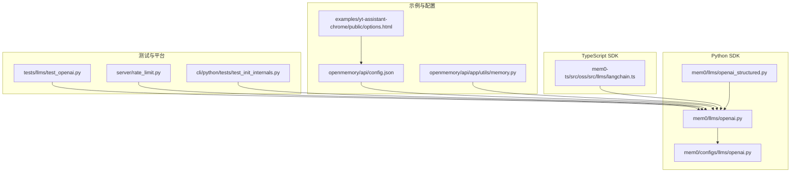
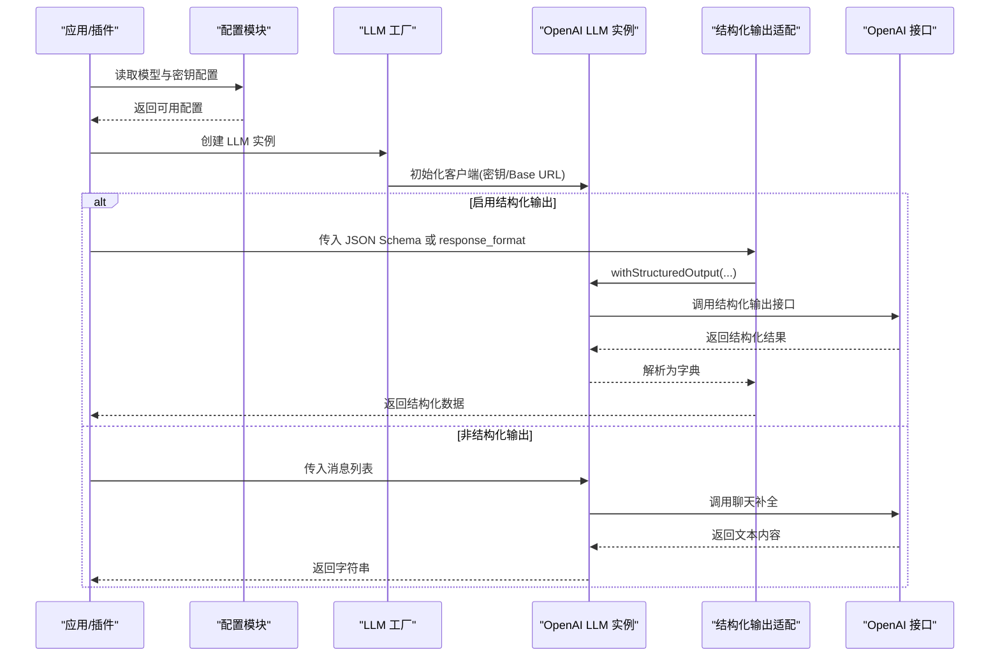
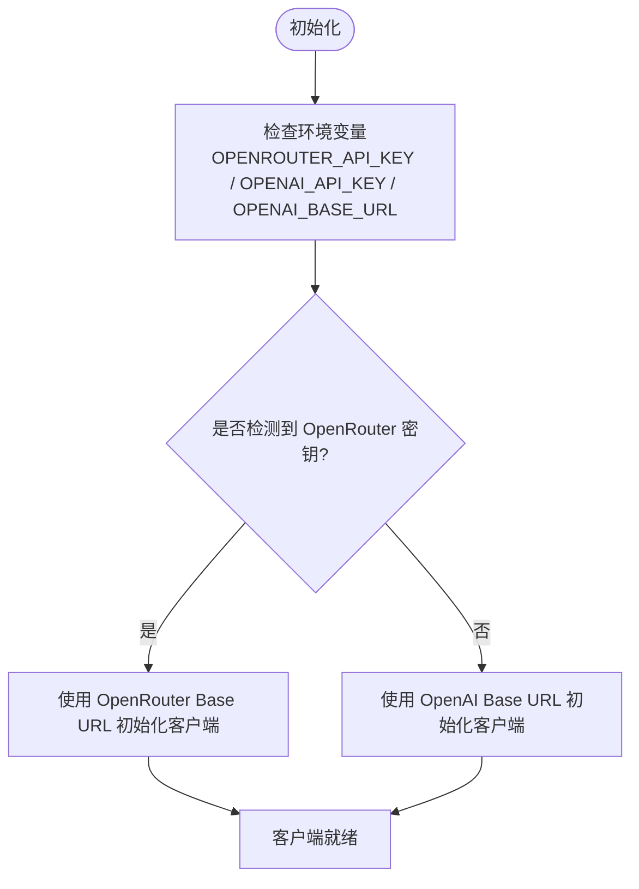
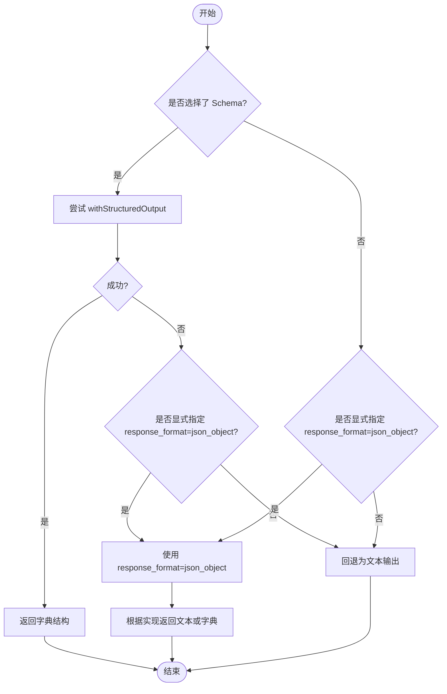
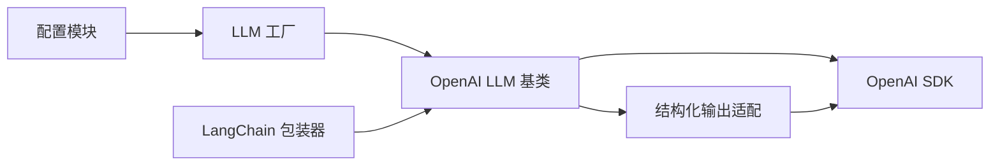

# OpenAI 系列模型

<cite>
**本文引用的文件**
- [mem0/llms/openai.py](file://mem0/llms/openai.py)
- [mem0/llms/openai_structured.py](file://mem0/llms/openai_structured.py)
- [mem0/configs/llms/openai.py](file://mem0/configs/llms/openai.py)
- [mem0-ts/src/oss/src/llms/langchain.ts](file://mem0-ts/src/oss/src/llms/langchain.ts)
- [docs/components/llms/overview.mdx](file://docs/components/llms/overview.mdx)
- [openmemory/api/config.json](file://openmemory/api/config.json)
- [openmemory/api/app/utils/memory.py](file://openmemory/api/app/utils/memory.py)
- [examples/yt-assistant-chrome/public/options.html](file://examples/yt-assistant-chrome/public/options.html)
- [tests/llms/test_openai.py](file://tests/llms/test_openai.py)
- [server/rate_limit.py](file://server/rate_limit.py)
- [cli/python/tests/test_init_internals.py](file://cli/python/tests/test_init_internals.py)
</cite>

## 目录
1. [简介](#简介)
2. [项目结构](#项目结构)
3. [核心组件](#核心组件)
4. [架构总览](#架构总览)
5. [详细组件分析](#详细组件分析)
6. [依赖关系分析](#依赖关系分析)
7. [性能考量](#性能考量)
8. [故障排查指南](#故障排查指南)
9. [结论](#结论)
10. [附录](#附录)

## 简介
本文件面向在 Mem0 生态中使用 OpenAI 系列模型（尤其是 GPT-3.5、GPT-4 及更新系列）的开发者与使用者，系统梳理以下内容：
- OpenAI 模型的配置与接入方式（含结构化输出与非结构化输出）
- 结构化输出模式的实现原理与适用场景
- API 密钥管理、请求限制与成本控制策略
- 批量处理、错误重试与性能优化最佳实践
- 模型选择建议与典型使用场景

## 项目结构
围绕 OpenAI 的能力，相关实现分布在 Python SDK、TypeScript SDK、示例应用与测试用例中：
- Python SDK：LLM 实现与配置、结构化输出适配、嵌入模型等
- TypeScript SDK：LangChain 包装器对结构化输出的支持
- 示例应用：Chrome 插件选项页展示模型选择与参数
- 测试用例：验证 OpenAI 客户端初始化、基础 URL 规范化与响应生成
- 平台侧：速率限制与错误映射

图表来源
- [mem0/llms/openai.py](file://mem0/llms/openai.py)
- [mem0/llms/openai_structured.py](file://mem0/llms/openai_structured.py)
- [mem0/configs/llms/openai.py](file://mem0/configs/llms/openai.py)
- [mem0-ts/src/oss/src/llms/langchain.ts](file://mem0-ts/src/oss/src/llms/langchain.ts)
- [examples/yt-assistant-chrome/public/options.html](file://examples/yt-assistant-chrome/public/options.html)
- [openmemory/api/config.json](file://openmemory/api/config.json)
- [openmemory/api/app/utils/memory.py](file://openmemory/api/app/utils/memory.py)
- [tests/llms/test_openai.py](file://tests/llms/test_openai.py)
- [server/rate_limit.py](file://server/rate_limit.py)
- [cli/python/tests/test_init_internals.py](file://cli/python/tests/test_init_internals.py)

章节来源
- [mem0/llms/openai.py](file://mem0/llms/openai.py)
- [mem0/llms/openai_structured.py](file://mem0/llms/openai_structured.py)
- [mem0/configs/llms/openai.py](file://mem0/configs/llms/openai.py)
- [mem0-ts/src/oss/src/llms/langchain.ts](file://mem0-ts/src/oss/src/llms/langchain.ts)
- [examples/yt-assistant-chrome/public/options.html](file://examples/yt-assistant-chrome/public/options.html)
- [openmemory/api/config.json](file://openmemory/api/config.json)
- [openmemory/api/app/utils/memory.py](file://openmemory/api/app/utils/memory.py)
- [tests/llms/test_openai.py](file://tests/llms/test_openai.py)
- [server/rate_limit.py](file://server/rate_limit.py)
- [cli/python/tests/test_init_internals.py](file://cli/python/tests/test_init_internals.py)

## 核心组件
- OpenAI LLM 基类与工厂
  - 支持通过环境变量或显式配置注入 API Key 与 Base URL
  - 自动兼容 OpenRouter 与 OpenAI，默认 Base URL 与模型回退策略
- 结构化输出适配
  - 提供专用的结构化输出实现，便于返回可解析的数据结构
- 配置与示例
  - Python 配置文件支持从环境变量注入密钥
  - 平台侧配置工厂按提供商生成默认参数
  - Chrome 插件示例页面提供模型选择与最大令牌数设置
- 类型脚本包装
  - LangChain 包装器支持结构化输出与 response_format 回退路径

章节来源
- [mem0/llms/openai.py](file://mem0/llms/openai.py)
- [mem0/llms/openai_structured.py](file://mem0/llms/openai_structured.py)
- [mem0/configs/llms/openai.py](file://mem0/configs/llms/openai.py)
- [openmemory/api/config.json](file://openmemory/api/config.json)
- [openmemory/api/app/utils/memory.py](file://openmemory/api/app/utils/memory.py)
- [examples/yt-assistant-chrome/public/options.html](file://examples/yt-assistant-chrome/public/options.html)
- [mem0-ts/src/oss/src/llms/langchain.ts](file://mem0-ts/src/oss/src/llms/langchain.ts)

## 架构总览
下图展示了从应用到 OpenAI 的调用链路，以及结构化输出与非结构化输出两种模式的差异。

图表来源
- [mem0/llms/openai.py](file://mem0/llms/openai.py)
- [mem0/llms/openai_structured.py](file://mem0/llms/openai_structured.py)
- [mem0-ts/src/oss/src/llms/langchain.ts](file://mem0-ts/src/oss/src/llms/langchain.ts)

## 详细组件分析

### OpenAI LLM 基类与工厂
- 客户端初始化
  - 优先级：显式配置 > 环境变量 > 默认值
  - 支持 OpenRouter 与 OpenAI 的 Base URL 切换
- 响应解析
  - 工具调用模式下提取 content 与 tool_calls
  - 非工具模式直接返回文本内容
- 测试覆盖
  - 验证基础 URL 尾随斜杠规范化
  - 验证无工具时的响应生成与参数透传

图表来源
- [mem0/llms/openai.py](file://mem0/llms/openai.py)

章节来源
- [mem0/llms/openai.py](file://mem0/llms/openai.py)
- [tests/llms/test_openai.py](file://tests/llms/test_openai.py)

### 结构化输出模式
- 模式说明
  - 适合需要稳定、可解析数据的场景（如抽取 JSON、表单填充、API 响应）
  - 与非结构化输出相比，解析效率更高但灵活性略低
- 实现要点
  - 通过 LangChain 包装器优先尝试 withStructuredOutput
  - 若不可用则回退至 response_format=json_object
  - 未选择 Schema 时仅在明确请求 json_object 时启用回退
- 文档指引
  - 官方结构化输出指南参见文档组件中的说明

图表来源
- [mem0-ts/src/oss/src/llms/langchain.ts](file://mem0-ts/src/oss/src/llms/langchain.ts)
- [docs/components/llms/overview.mdx](file://docs/components/llms/overview.mdx)

章节来源
- [mem0-ts/src/oss/src/llms/langchain.ts](file://mem0-ts/src/oss/src/llms/langchain.ts)
- [docs/components/llms/overview.mdx](file://docs/components/llms/overview.mdx)

### 配置与示例
- Python 配置
  - 支持从环境变量注入 API Key，避免硬编码
  - 默认模型与温度、最大令牌数等参数可统一设定
- 平台配置工厂
  - 按提供商生成默认配置（如 OpenAI 的模型与密钥来源）
  - Base URL 可选覆盖
- Chrome 插件示例
  - 提供模型选择（如 o3/o1/gpt-4o 等）与最大响应长度设置

章节来源
- [openmemory/api/config.json](file://openmemory/api/config.json)
- [openmemory/api/app/utils/memory.py](file://openmemory/api/app/utils/memory.py)
- [examples/yt-assistant-chrome/public/options.html](file://examples/yt-assistant-chrome/public/options.html)

### 使用流程与最佳实践
- 请求与响应
  - 明确区分结构化输出与非结构化输出两类调用路径
  - 在结构化输出失败时，按需启用 response_format 回退
- 批量处理
  - 对多条消息进行批量化封装，减少重复初始化开销
  - 控制并发度以避免触发速率限制
- 错误重试
  - 对网络异常与服务不可用错误进行指数退避重试
  - 对 403 权限类错误进行语义化提示转换
- 成本控制
  - 合理设置 max_tokens 与 temperature
  - 优先使用结构化输出以降低后处理成本
  - 使用缓存与去重策略减少重复调用

章节来源
- [mem0/llms/openai.py](file://mem0/llms/openai.py)
- [mem0/llms/openai_structured.py](file://mem0/llms/openai_structured.py)
- [cli/python/tests/test_init_internals.py](file://cli/python/tests/test_init_internals.py)

## 依赖关系分析
- 组件耦合
  - LLM 基类与结构化输出适配解耦，便于按需启用
  - 配置模块与工厂负责参数聚合，降低上层调用复杂度
- 外部依赖
  - OpenAI 官方 SDK 作为底层通信层
  - LangChain 包装器提供结构化输出能力
- 潜在风险
  - Base URL 与环境变量解析顺序不当可能导致连接失败
  - 缺少统一的重试与熔断机制可能放大瞬时故障

图表来源
- [mem0/llms/openai.py](file://mem0/llms/openai.py)
- [mem0/llms/openai_structured.py](file://mem0/llms/openai_structured.py)
- [mem0-ts/src/oss/src/llms/langchain.ts](file://mem0-ts/src/oss/src/llms/langchain.ts)

章节来源
- [mem0/llms/openai.py](file://mem0/llms/openai.py)
- [mem0/llms/openai_structured.py](file://mem0/llms/openai_structured.py)
- [mem0-ts/src/oss/src/llms/langchain.ts](file://mem0-ts/src/oss/src/llms/langchain.ts)

## 性能考量
- 模型选择
  - GPT-4o 系列适合通用对话与多媒体理解
  - o1/o3 系列适合推理与结构化输出
  - GPT-4o-mini 适合低成本、高吞吐的任务
- 参数调优
  - 降低 temperature 与 max_tokens 可显著降低成本
  - 使用结构化输出减少后处理与解析成本
- 并发与缓存
  - 合理控制并发度，结合本地缓存与去重策略
  - 对高频查询结果进行短期缓存

## 故障排查指南
- 常见问题
  - 403 权限错误：平台侧会将其翻译为“达到每日限额”等用户友好提示
  - 5xx 网络错误：映射为网络异常，建议指数退避重试
  - 未知状态码：统一映射为内存错误并附带重试建议
- 诊断步骤
  - 检查 API Key 与 Base URL 是否正确
  - 确认模型名称与权限范围
  - 查看日志与重试策略执行情况

章节来源
- [cli/python/tests/test_init_internals.py](file://cli/python/tests/test_init_internals.py)
- [mem0-ts/src/common/exceptions.test.ts](file://mem0-ts/src/common/exceptions.test.ts)

## 结论
- OpenAI 系列模型在 Mem0 中通过统一的 LLM 基类与工厂实现接入，支持结构化与非结构化两种输出模式
- 结构化输出在数据抽取与 API 响应场景具有明显优势，应优先考虑
- 通过合理的配置、重试与成本控制策略，可在保证稳定性的同时优化性能与成本

## 附录
- 模型选择建议
  - 高精度推理与结构化输出：o1/o3
  - 通用对话与多媒体：gpt-4o
  - 低成本高吞吐：gpt-4o-mini
- 关键参数参考
  - temperature：越低越确定，越高越创造性
  - max_tokens：控制输出长度，影响成本与时延
  - response_format：在非结构化输出中引导格式