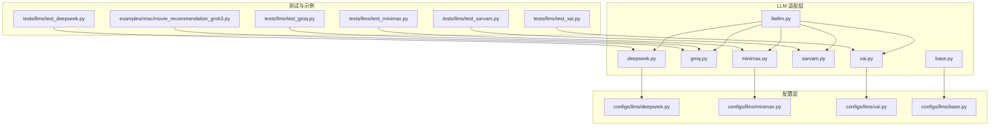
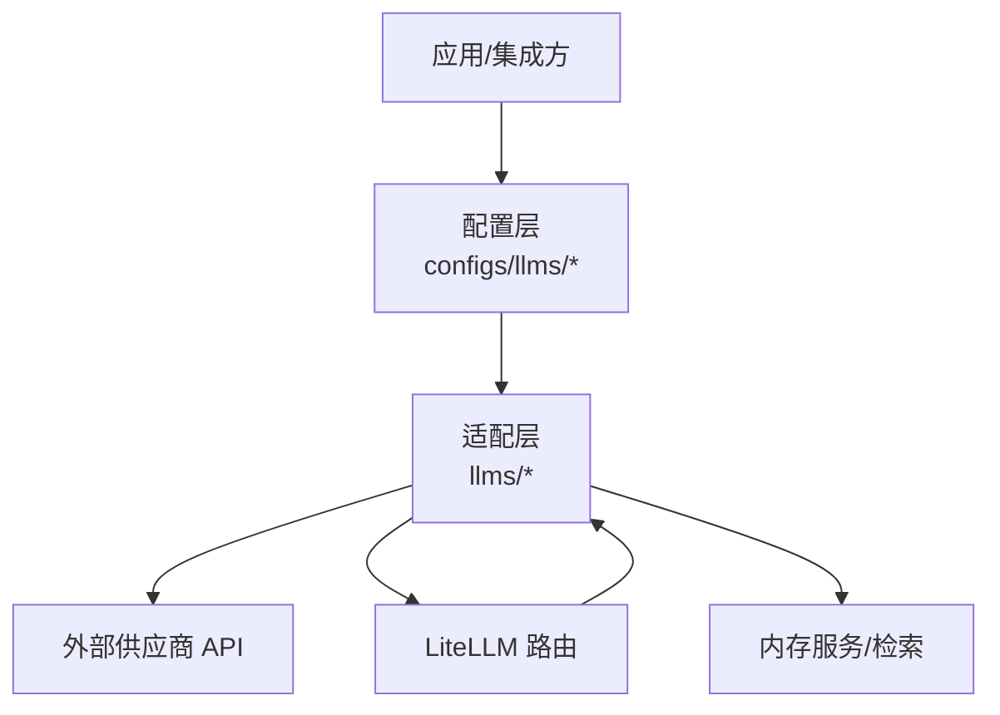
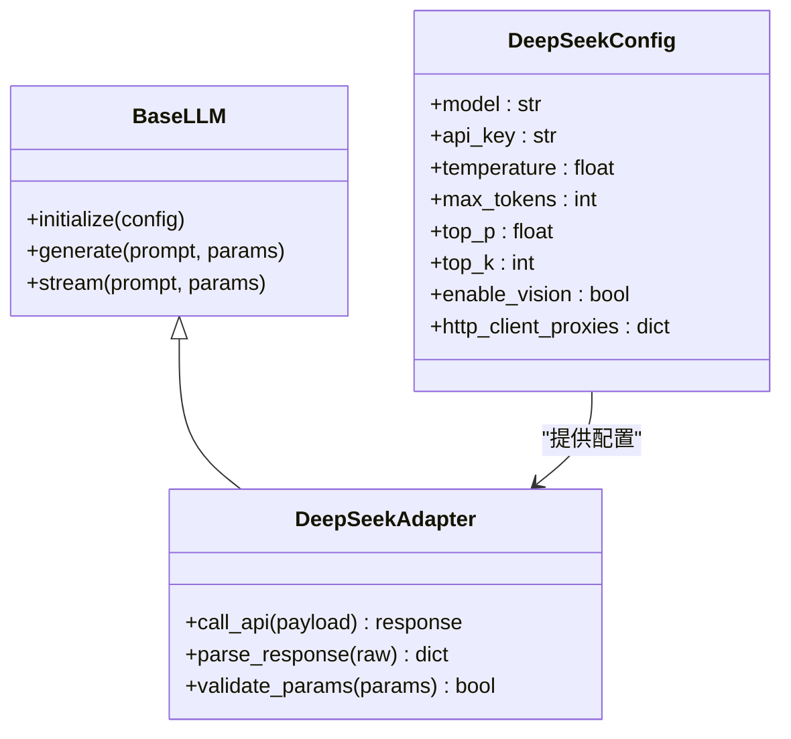
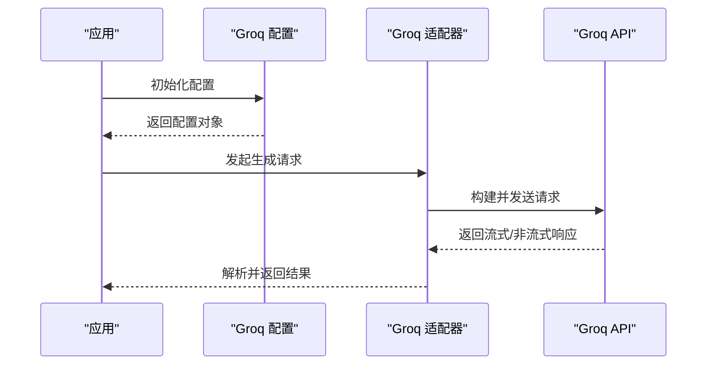
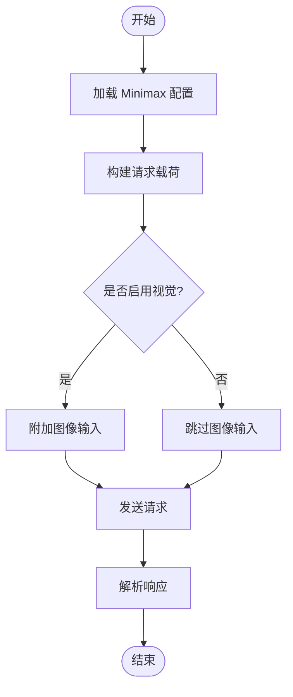
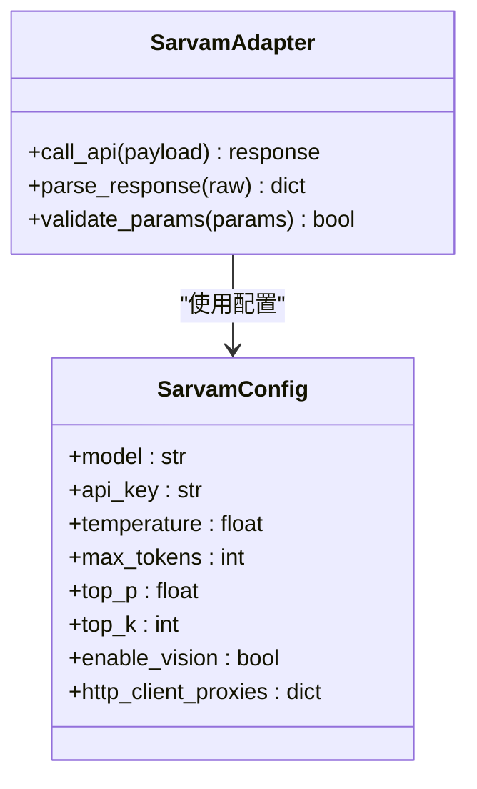
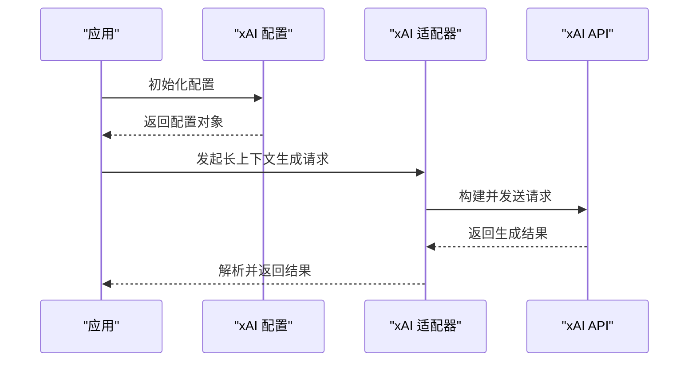
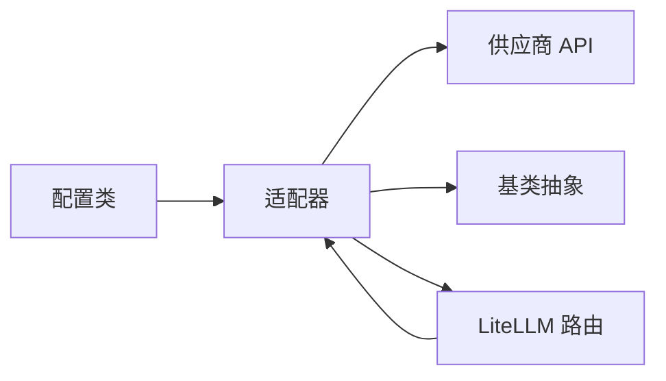

# 专用模型系列

<cite>
**本文引用的文件**
- [mem0/llms/deepseek.py](file://mem0/llms/deepseek.py)
- [mem0/configs/llms/deepseek.py](file://mem0/configs/llms/deepseek.py)
- [mem0/llms/groq.py](file://mem0/llms/groq.py)
- [mem0/llms/minimax.py](file://mem0/llms/minimax.py)
- [mem0/configs/llms/minimax.py](file://mem0/configs/llms/minimax.py)
- [mem0/llms/sarvam.py](file://mem0/llms/sarvam.py)
- [mem0/llms/xai.py](file://mem0/llms/xai.py)
- [mem0/configs/llms/xai.py](file://mem0/configs/llms/xai.py)
- [mem0/llms/base.py](file://mem0/llms/base.py)
- [mem0/configs/llms/base.py](file://mem0/configs/llms/base.py)
- [mem0/llms/litellm.py](file://mem0/llms/litellm.py)
- [tests/llms/test_deepseek.py](file://tests/llms/test_deepseek.py)
- [tests/llms/test_groq.py](file://tests/llms/test_groq.py)
- [tests/llms/test_minimax.py](file://tests/llms/test_minimax.py)
- [tests/llms/test_sarvam.py](file://tests/llms/test_sarvam.py)
- [tests/llms/test_xai.py](file://tests/llms/test_xai.py)
- [docs/components/llms/models/deepseek.mdx](file://docs/components/llms/models/deepseek.mdx)
- [docs/components/llms/models/groq.mdx](file://docs/components/llms/models/groq.mdx)
- [docs/components/llms/models/minimax.mdx](file://docs/components/llms/models/minimax.mdx)
- [docs/components/llms/models/sarvam.mdx](file://docs/components/llms/models/sarvam.mdx)
- [docs/components/llms/models/xai.mdx](file://docs/components/llms/models/xai.mdx)
- [examples/misc/movie_recommendation_grok3.py](file://examples/misc/movie_recommendation_grok3.py)
</cite>

## 目录
1. [引言](#引言)
2. [项目结构](#项目结构)
3. [核心组件](#核心组件)
4. [架构总览](#架构总览)
5. [详细组件分析](#详细组件分析)
6. [依赖关系分析](#依赖关系分析)
7. [性能考量](#性能考量)
8. [故障排除指南](#故障排除指南)
9. [结论](#结论)
10. [附录](#附录)

## 引言
本文件聚焦于专用模型系列，系统梳理 DeepSeek、Groq、Minimax、Sarvam、xAI 等专业模型在本仓库中的实现与使用方式。内容覆盖各模型的配置要点、特点与优势领域、适用场景、性能特征、价格对比与功能差异，并提供模型选择指南、参数调优建议与集成最佳实践，同时展望新兴模型的发展趋势。

## 项目结构
专用模型系列位于内存与大模型交互层，主要由以下模块构成：
- 模型适配层：mem0/llms 下的各具体模型实现（如 deepseek.py、groq.py、minimax.py、sarvam.py、xai.py）
- 配置层：mem0/configs/llms 下的对应配置类（如 deepseek.py、minimax.py、xai.py）
- 基类抽象：mem0/llms/base.py 与 mem0/configs/llms/base.py 提供统一接口与继承规范
- 通用路由与聚合：mem0/llms/litellm.py 提供多供应商统一调度能力
- 测试与示例：tests/llms 下的单元测试；examples/misc 中包含 Grok3 的使用示例

**图表来源**
- [mem0/llms/deepseek.py](file://mem0/llms/deepseek.py)
- [mem0/llms/groq.py](file://mem0/llms/groq.py)
- [mem0/llms/minimax.py](file://mem0/llms/minimax.py)
- [mem0/llms/sarvam.py](file://mem0/llms/sarvam.py)
- [mem0/llms/xai.py](file://mem0/llms/xai.py)
- [mem0/llms/base.py](file://mem0/llms/base.py)
- [mem0/llms/litellm.py](file://mem0/llms/litellm.py)
- [mem0/configs/llms/deepseek.py](file://mem0/configs/llms/deepseek.py)
- [mem0/configs/llms/minimax.py](file://mem0/configs/llms/minimax.py)
- [mem0/configs/llms/xai.py](file://mem0/configs/llms/xai.py)
- [mem0/configs/llms/base.py](file://mem0/configs/llms/base.py)
- [tests/llms/test_deepseek.py](file://tests/llms/test_deepseek.py)
- [tests/llms/test_groq.py](file://tests/llms/test_groq.py)
- [tests/llms/test_minimax.py](file://tests/llms/test_minimax.py)
- [tests/llms/test_sarvam.py](file://tests/llms/test_sarvam.py)
- [tests/llms/test_xai.py](file://tests/llms/test_xai.py)
- [examples/misc/movie_recommendation_grok3.py](file://examples/misc/movie_recommendation_grok3.py)

**章节来源**
- [mem0/llms/deepseek.py](file://mem0/llms/deepseek.py)
- [mem0/llms/groq.py](file://mem0/llms/groq.py)
- [mem0/llms/minimax.py](file://mem0/llms/minimax.py)
- [mem0/llms/sarvam.py](file://mem0/llms/sarvam.py)
- [mem0/llms/xai.py](file://mem0/llms/xai.py)
- [mem0/llms/base.py](file://mem0/llms/base.py)
- [mem0/llms/litellm.py](file://mem0/llms/litellm.py)

## 核心组件
- 统一基类：所有模型均继承自基础抽象类，确保一致的初始化、参数校验与调用协议
- 配置类：每个模型的配置类负责解析环境变量、设置默认值与兼容性参数
- 适配器：针对不同供应商的 SDK 或 API 进行封装，屏蔽差异
- 聚合路由：通过 LiteLLM 实现多供应商统一调度，便于切换与灰度

关键职责划分：
- 模型适配层：负责实际请求构建、响应解析与错误处理
- 配置层：负责参数验证、默认值与供应商特定字段映射
- 基类抽象：定义公共接口与生命周期钩子，保证扩展一致性

**章节来源**
- [mem0/llms/base.py](file://mem0/llms/base.py)
- [mem0/configs/llms/base.py](file://mem0/configs/llms/base.py)
- [mem0/llms/litellm.py](file://mem0/llms/litellm.py)

## 架构总览
下图展示专用模型系列在系统中的位置与交互关系：

**图表来源**
- [mem0/llms/litellm.py](file://mem0/llms/litellm.py)
- [mem0/llms/deepseek.py](file://mem0/llms/deepseek.py)
- [mem0/llms/groq.py](file://mem0/llms/groq.py)
- [mem0/llms/minimax.py](file://mem0/llms/minimax.py)
- [mem0/llms/sarvam.py](file://mem0/llms/sarvam.py)
- [mem0/llms/xai.py](file://mem0/llms/xai.py)

## 详细组件分析

### DeepSeek 模型
- 适配器特性
  - 支持温度、最大生成长度等标准参数
  - 提供供应商特定的参数映射与默认值
- 配置要点
  - 通过配置类读取 API 密钥与模型名称
  - 默认温度较低以提升确定性输出
- 适用场景
  - 代码辅助、知识问答、逻辑推理
- 性能特征
  - 在中长文本生成任务上表现稳定
  - 对复杂指令遵循较好
- 集成建议
  - 使用 LiteLLM 路由进行多供应商切换
  - 结合内存检索增强生成质量

**图表来源**
- [mem0/llms/base.py](file://mem0/llms/base.py)
- [mem0/configs/llms/deepseek.py](file://mem0/configs/llms/deepseek.py)
- [mem0/llms/deepseek.py](file://mem0/llms/deepseek.py)

**章节来源**
- [mem0/llms/deepseek.py](file://mem0/llms/deepseek.py)
- [mem0/configs/llms/deepseek.py](file://mem0/configs/llms/deepseek.py)
- [tests/llms/test_deepseek.py](file://tests/llms/test_deepseek.py)
- [docs/components/llms/models/deepseek.mdx](file://docs/components/llms/models/deepseek.mdx)

### Groq 模型
- 适配器特性
  - 针对 Groq 的高吞吐 API 进行封装
  - 支持流式与非流式两种模式
- 配置要点
  - 通过配置类设置 API 密钥与模型标识
  - 默认参数偏向低延迟与高并发
- 适用场景
  - 实时对话、流式生成、边缘计算部署
- 性能特征
  - 显著的推理速度优势
  - 在短文本与对话任务上表现突出
- 集成建议
  - 使用流式接口优化用户体验
  - 与 LiteLLM 路由结合实现弹性扩缩容

**图表来源**
- [mem0/llms/groq.py](file://mem0/llms/groq.py)
- [mem0/llms/litellm.py](file://mem0/llms/litellm.py)

**章节来源**
- [mem0/llms/groq.py](file://mem0/llms/groq.py)
- [tests/llms/test_groq.py](file://tests/llms/test_groq.py)
- [docs/components/llms/models/groq.mdx](file://docs/components/llms/models/groq.mdx)
- [examples/misc/movie_recommendation_grok3.py](file://examples/misc/movie_recommendation_grok3.py)

### Minimax 模型
- 适配器特性
  - 支持视觉能力开关与细节级别控制
  - 提供基础 URL 自定义与代理支持
- 配置要点
  - 通过配置类设置 API 密钥、基础 URL 与视觉参数
  - 默认温度与采样参数偏向稳定输出
- 适用场景
  - 多模态理解、图文结合问答
- 性能特征
  - 视觉任务表现良好
  - 文本生成稳定性较高
- 集成建议
  - 启用视觉能力时注意输入格式与资源消耗
  - 使用 LiteLLM 路由实现多供应商备份

**图表来源**
- [mem0/llms/minimax.py](file://mem0/llms/minimax.py)
- [mem0/configs/llms/minimax.py](file://mem0/configs/llms/minimax.py)

**章节来源**
- [mem0/llms/minimax.py](file://mem0/llms/minimax.py)
- [mem0/configs/llms/minimax.py](file://mem0/configs/llms/minimax.py)
- [tests/llms/test_minimax.py](file://tests/llms/test_minimax.py)
- [docs/components/llms/models/minimax.mdx](file://docs/components/llms/models/minimax.mdx)

### Sarvam 模型
- 适配器特性
  - 面向多语言与多模态场景
  - 参数体系与通用基类保持一致
- 配置要点
  - 通过配置类设置 API 密钥与模型标识
  - 默认参数兼顾多语言稳定性
- 适用场景
  - 多语言对话、跨语言检索增强
- 性能特征
  - 多语言理解能力较强
  - 在复杂语境下的上下文保持较好
- 集成建议
  - 结合内存检索提升多轮对话质量
  - 使用 LiteLLM 路由实现弹性切换

**图表来源**
- [mem0/llms/sarvam.py](file://mem0/llms/sarvam.py)

**章节来源**
- [mem0/llms/sarvam.py](file://mem0/llms/sarvam.py)
- [tests/llms/test_sarvam.py](file://tests/llms/test_sarvam.py)
- [docs/components/llms/models/sarvam.mdx](file://docs/components/llms/models/sarvam.mdx)

### xAI 模型
- 适配器特性
  - 高性能推理与长上下文支持
  - 参数体系与通用基类保持一致
- 配置要点
  - 通过配置类设置 API 密钥与模型标识
  - 默认参数偏向长文本与高吞吐
- 适用场景
  - 长文档摘要、知识抽取、大规模推理
- 性能特征
  - 在长上下文任务上表现优异
  - 推理速度较快
- 集成建议
  - 使用 LiteLLM 路由实现多供应商统一管理
  - 结合内存检索提升上下文相关性

**图表来源**
- [mem0/llms/xai.py](file://mem0/llms/xai.py)
- [mem0/configs/llms/xai.py](file://mem0/configs/llms/xai.py)
- [mem0/llms/litellm.py](file://mem0/llms/litellm.py)

**章节来源**
- [mem0/llms/xai.py](file://mem0/llms/xai.py)
- [mem0/configs/llms/xai.py](file://mem0/configs/llms/xai.py)
- [tests/llms/test_xai.py](file://tests/llms/test_xai.py)
- [docs/components/llms/models/xai.mdx](file://docs/components/llms/models/xai.mdx)

## 依赖关系分析
- 组件耦合
  - 适配器与配置类强绑定，通过构造函数注入
  - 基类提供统一接口，降低新增模型的接入成本
- 外部依赖
  - 各供应商 SDK/API 差异通过适配器屏蔽
  - LiteLLM 提供统一路由与降级策略
- 潜在风险
  - 供应商 API 变更可能影响适配器行为
  - 参数映射不当可能导致性能或稳定性问题

**图表来源**
- [mem0/llms/base.py](file://mem0/llms/base.py)
- [mem0/configs/llms/base.py](file://mem0/configs/llms/base.py)
- [mem0/llms/litellm.py](file://mem0/llms/litellm.py)

**章节来源**
- [mem0/llms/base.py](file://mem0/llms/base.py)
- [mem0/configs/llms/base.py](file://mem0/configs/llms/base.py)
- [mem0/llms/litellm.py](file://mem0/llms/litellm.py)

## 性能考量
- 推理速度
  - Groq 在实时与流式场景具有明显优势
  - xAI 在长上下文与大规模推理方面表现突出
- 输出稳定性
  - DeepSeek 与 Minimax 在确定性输出与多模态理解方面较为稳健
  - Sarvam 在多语言场景下表现稳定
- 资源消耗
  - 视觉能力启用会增加带宽与计算开销
  - 长上下文与大批量请求需关注内存与网络限制
- 成本控制
  - 建议通过 LiteLLM 路由实现多供应商比价与自动切换
  - 结合缓存与预取策略降低重复请求

## 故障排除指南
- 常见问题
  - API 密钥无效或过期：检查配置类中的密钥读取逻辑与环境变量
  - 请求超时：调整超时参数与重试策略，必要时启用代理
  - 参数不兼容：核对供应商特定参数映射，参考配置类默认值
- 定位手段
  - 查看适配器日志与错误码
  - 使用 LiteLLM 路由查看后端供应商状态
  - 运行对应测试用例验证配置正确性
- 修复建议
  - 更新配置类默认值以适配最新 API
  - 扩展适配器的异常处理与重试机制
  - 在文档中补充常见错误与解决方案

**章节来源**
- [tests/llms/test_deepseek.py](file://tests/llms/test_deepseek.py)
- [tests/llms/test_groq.py](file://tests/llms/test_groq.py)
- [tests/llms/test_minimax.py](file://tests/llms/test_minimax.py)
- [tests/llms/test_sarvam.py](file://tests/llms/test_sarvam.py)
- [tests/llms/test_xai.py](file://tests/llms/test_xai.py)

## 结论
专用模型系列通过统一的基类与配置体系，实现了对 DeepSeek、Groq、Minimax、Sarvam、xAI 等供应商的标准化接入。结合 LiteLLM 路由，可在性能、成本与稳定性之间取得平衡。建议根据任务类型选择合适模型，并通过参数调优与集成最佳实践持续优化效果。

## 附录
- 模型选择指南
  - 实时对话与流式生成：优先考虑 Groq
  - 长上下文与大规模推理：优先考虑 xAI
  - 多语言与跨语言任务：优先考虑 Sarvam
  - 确定性输出与多模态理解：可考虑 DeepSeek 与 Minimax
- 参数调优建议
  - 温度：越低越确定，越高越创造性
  - 采样参数：top_p/top_k 控制多样性与稳定性
  - 最大生成长度：根据任务长度动态调整
- 集成最佳实践
  - 使用 LiteLLM 路由实现多供应商统一管理
  - 结合内存检索增强上下文相关性
  - 建立完善的监控与告警机制