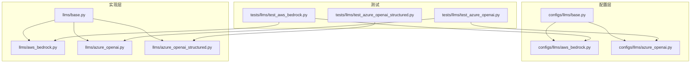
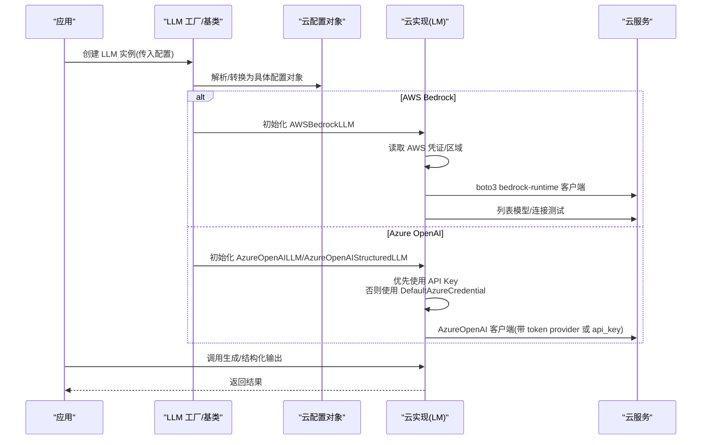
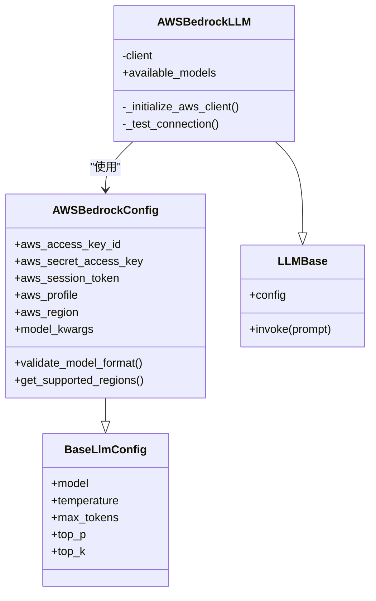
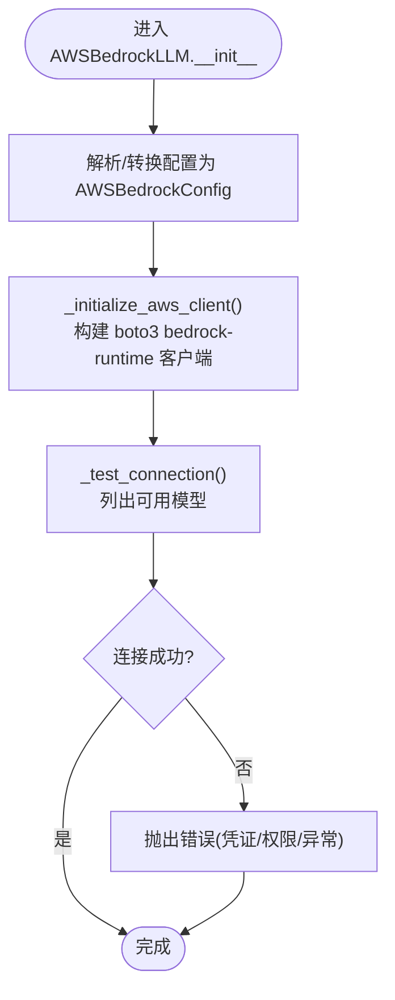
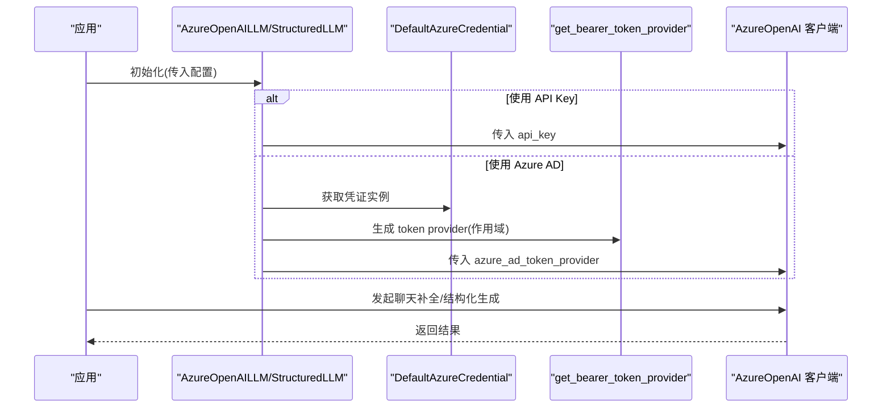
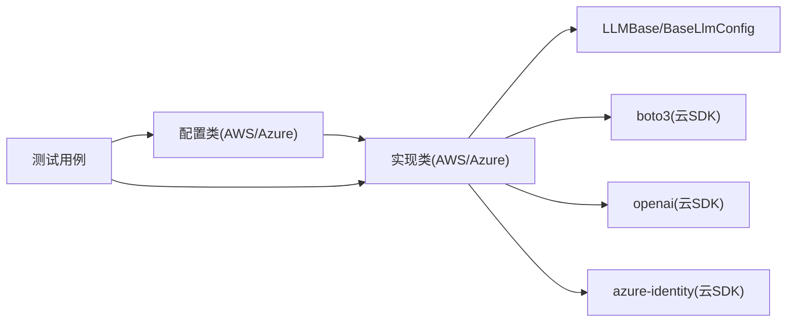

# 云平台模型

<cite>
**本文引用的文件**
- [mem0/configs/llms/aws_bedrock.py](file://mem0/configs/llms/aws_bedrock.py)
- [mem0/llms/aws_bedrock.py](file://mem0/llms/aws_bedrock.py)
- [mem0/configs/llms/base.py](file://mem0/configs/llms/base.py)
- [mem0/llms/base.py](file://mem0/llms/base.py)
- [mem0/llms/azure_openai.py](file://mem0/llms/azure_openai.py)
- [mem0/llms/azure_openai_structured.py](file://mem0/llms/azure_openai_structured.py)
- [mem0/configs/llms/azure_openai.py](file://mem0/configs/llms/azure_openai.py)
- [tests/llms/test_aws_bedrock.py](file://tests/llms/test_aws_bedrock.py)
- [tests/llms/test_azure_openai.py](file://tests/llms/test_azure_openai.py)
- [tests/llms/test_azure_openai_structured.py](file://tests/llms/test_azure_openai_structured.py)
- [docs/integrations/aws-bedrock.mdx](file://docs/integrations/aws-bedrock.mdx)
- [docs/components/embedders/models/aws_bedrock.mdx](file://docs/components/embedders/models/aws_bedrock.mdx)
- [docs/cookbooks/essentials/tagging-and-organizing-memories.mdx](file://docs/cookbooks/essentials/tagging-and-organizing-memories.mdx)
</cite>

## 目录
1. [简介](#简介)
2. [项目结构](#项目结构)
3. [核心组件](#核心组件)
4. [架构总览](#架构总览)
5. [详细组件分析](#详细组件分析)
6. [依赖关系分析](#依赖关系分析)
7. [性能与成本优化](#性能与成本优化)
8. [故障排查指南](#故障排查指南)
9. [结论](#结论)
10. [附录](#附录)

## 简介
本文件系统性梳理 mem0 在云平台模型（以 AWS Bedrock、Azure OpenAI 为代表）上的配置与使用，覆盖认证机制、区域选择、资源管理、成本与性能优化、故障排查、多云部署与灾难恢复、合规性考虑，以及结构化输出在不同云平台上的实现差异。内容基于仓库中的实现与测试用例进行归纳总结，并辅以可视化图示帮助读者快速建立整体认知。

## 项目结构
围绕云平台模型的关键目录与文件如下：
- 配置层：mem0/configs/llms 下包含各云厂商的配置类（如 AWSBedrockConfig、AzureOpenAIConfig）
- 实现层：mem0/llms 下包含对应 LLM 的具体实现（如 AWSBedrockLLM、AzureOpenAILLM、AzureOpenAIStructuredLLM）
- 基类与工厂：mem0/llms/base.py 与 mem0/configs/llms/base.py 提供统一抽象
- 文档与示例：docs/integrations 与 docs/components/embedders/models 中提供集成说明
- 测试：tests/llms 下覆盖 AWS Bedrock 与 Azure OpenAI 的行为验证

图表来源
- [mem0/configs/llms/aws_bedrock.py:1-155](file://mem0/configs/llms/aws_bedrock.py#L1-L155)
- [mem0/llms/aws_bedrock.py:41-109](file://mem0/llms/aws_bedrock.py#L41-L109)
- [mem0/configs/llms/azure_openai.py](file://mem0/configs/llms/azure_openai.py)
- [mem0/llms/azure_openai.py](file://mem0/llms/azure_openai.py)
- [mem0/llms/azure_openai_structured.py:1-27](file://mem0/llms/azure_openai_structured.py#L1-L27)
- [tests/llms/test_aws_bedrock.py:105-128](file://tests/llms/test_aws_bedrock.py#L105-L128)
- [tests/llms/test_azure_openai.py:370-419](file://tests/llms/test_azure_openai.py#L370-L419)
- [tests/llms/test_azure_openai_structured.py:43-116](file://tests/llms/test_azure_openai_structured.py#L43-L116)

章节来源
- [mem0/configs/llms/aws_bedrock.py:1-155](file://mem0/configs/llms/aws_bedrock.py#L1-L155)
- [mem0/llms/aws_bedrock.py:41-109](file://mem0/llms/aws_bedrock.py#L41-L109)
- [mem0/configs/llms/azure_openai.py](file://mem0/configs/llms/azure_openai.py)
- [mem0/llms/azure_openai.py](file://mem0/llms/azure_openai.py)
- [mem0/llms/azure_openai_structured.py:1-27](file://mem0/llms/azure_openai_structured.py#L1-L27)
- [tests/llms/test_aws_bedrock.py:105-128](file://tests/llms/test_aws_bedrock.py#L105-L128)
- [tests/llms/test_azure_openai.py:370-419](file://tests/llms/test_azure_openai.py#L370-L419)
- [tests/llms/test_azure_openai_structured.py:43-116](file://tests/llms/test_azure_openai_structured.py#L43-L116)

## 核心组件
- AWS Bedrock 配置与实现
  - AWSBedrockConfig：封装模型名、温度、最大令牌数、Top-P/Top-K、AWS 凭证与区域等参数；提供模型格式校验与支持区域列表
  - AWSBedrockLLM：初始化 AWS 客户端（boto3 bedrock-runtime），连接测试，解析可用模型列表
- Azure OpenAI 配置与实现
  - AzureOpenAIConfig：封装 azure_deployment、azure_endpoint、api_version、默认头等参数
  - AzureOpenAILLM：支持 API Key 与 Azure AD Token Provider（DefaultAzureCredential + get_bearer_token_provider）两种认证方式
  - AzureOpenAIStructuredLLM：面向结构化输出的实现，强调 JSON 提取与工具调用场景
- 基类与工厂
  - BaseLlmConfig 与 LLMBase 提供统一抽象，便于扩展新云厂商或模型族

章节来源
- [mem0/configs/llms/aws_bedrock.py:7-155](file://mem0/configs/llms/aws_bedrock.py#L7-L155)
- [mem0/llms/aws_bedrock.py:41-109](file://mem0/llms/aws_bedrock.py#L41-L109)
- [mem0/configs/llms/azure_openai.py](file://mem0/configs/llms/azure_openai.py)
- [mem0/llms/azure_openai.py](file://mem0/llms/azure_openai.py)
- [mem0/llms/azure_openai_structured.py:1-27](file://mem0/llms/azure_openai_structured.py#L1-L27)
- [mem0/configs/llms/base.py](file://mem0/configs/llms/base.py)
- [mem0/llms/base.py](file://mem0/llms/base.py)

## 架构总览
下图展示从配置到实现再到认证与调用的整体流程，突出 AWS Bedrock 与 Azure OpenAI 的差异化点（凭据与客户端初始化）：

图表来源
- [mem0/llms/aws_bedrock.py:77-109](file://mem0/llms/aws_bedrock.py#L77-L109)
- [mem0/llms/azure_openai.py](file://mem0/llms/azure_openai.py)
- [mem0/llms/azure_openai_structured.py:15-27](file://mem0/llms/azure_openai_structured.py#L15-L27)
- [mem0/configs/llms/aws_bedrock.py:14-28](file://mem0/configs/llms/aws_bedrock.py#L14-L28)
- [mem0/configs/llms/azure_openai.py](file://mem0/configs/llms/azure_openai.py)

## 详细组件分析

### AWS Bedrock 组件分析
- 配置类（AWSBedrockConfig）
  - 关键字段：模型名、温度、最大令牌数、Top-P/Top-K、AWS 凭证（AccessKey、SecretKey、SessionToken、Profile）、区域、附加模型参数
  - 模型格式校验：要求“供应商.模型名”格式且供应商在白名单中
  - 支持区域：列举了 us-east-1、us-west-2、eu-west-1、ap-southeast-1、ap-northeast-1 等
- 实现类（AWSBedrockLLM）
  - 初始化：将通用配置转换为 AWSBedrockConfig，构建 boto3 bedrock-runtime 客户端，执行连接测试
  - 错误处理：未配置凭证时抛出明确提示；权限不足时提示授权问题；其他 AWS 异常转为可读错误
  - 可用模型：通过 boto3 bedrock 客户端列出模型并缓存

图表来源
- [mem0/configs/llms/aws_bedrock.py:7-155](file://mem0/configs/llms/aws_bedrock.py#L7-L155)
- [mem0/llms/aws_bedrock.py:41-109](file://mem0/llms/aws_bedrock.py#L41-L109)
- [mem0/llms/base.py](file://mem0/llms/base.py)
- [mem0/configs/llms/base.py](file://mem0/configs/llms/base.py)

图表来源
- [mem0/llms/aws_bedrock.py:77-109](file://mem0/llms/aws_bedrock.py#L77-L109)
- [mem0/configs/llms/aws_bedrock.py:14-28](file://mem0/configs/llms/aws_bedrock.py#L14-L28)

章节来源
- [mem0/configs/llms/aws_bedrock.py:7-155](file://mem0/configs/llms/aws_bedrock.py#L7-L155)
- [mem0/llms/aws_bedrock.py:41-109](file://mem0/llms/aws_bedrock.py#L41-L109)
- [tests/llms/test_aws_bedrock.py:105-128](file://tests/llms/test_aws_bedrock.py#L105-L128)

### Azure OpenAI 组件分析
- 配置类（AzureOpenAIConfig）
  - 关键字段：azure_deployment、azure_endpoint、api_version、默认请求头、HTTP 客户端等
- 实现类（AzureOpenAILLM）
  - 认证优先级：若显式提供 API Key，则直接使用；否则使用 DefaultAzureCredential 获取令牌并通过 get_bearer_token_provider 注入
  - 客户端初始化：构造 AzureOpenAI 客户端，传入 azure_deployment、azure_endpoint、azure_ad_token_provider 等
- 实现类（AzureOpenAIStructuredLLM）
  - 面向结构化输出：自动提取 JSON、适配工具调用场景；当未提供模型名时设置默认值
  - 认证策略与 AzureOpenAILLM 类似，但更强调结构化响应处理

图表来源
- [mem0/llms/azure_openai.py](file://mem0/llms/azure_openai.py)
- [mem0/llms/azure_openai_structured.py:15-27](file://mem0/llms/azure_openai_structured.py#L15-L27)
- [tests/llms/test_azure_openai.py:370-419](file://tests/llms/test_azure_openai.py#L370-L419)
- [tests/llms/test_azure_openai_structured.py:43-116](file://tests/llms/test_azure_openai_structured.py#L43-L116)

章节来源
- [mem0/configs/llms/azure_openai.py](file://mem0/configs/llms/azure_openai.py)
- [mem0/llms/azure_openai.py](file://mem0/llms/azure_openai.py)
- [mem0/llms/azure_openai_structured.py:1-27](file://mem0/llms/azure_openai_structured.py#L1-L27)
- [tests/llms/test_azure_openai.py:370-419](file://tests/llms/test_azure_openai.py#L370-L419)
- [tests/llms/test_azure_openai_structured.py:43-116](file://tests/llms/test_azure_openai_structured.py#L43-L116)

### 结构化输出在云平台上的实现差异
- AzureOpenAIStructuredLLM
  - 自动注入结构化输出能力（JSON 提取、工具调用），适合需要稳定 JSON 输出的场景
  - 当未提供模型名时设置默认值，确保最小可用配置
- AzureOpenAILLM
  - 更通用的实现，支持多种认证方式；结构化输出需由上层逻辑配合
- AWS Bedrock
  - 通过模型参数与提示工程实现结构化输出；具体取决于所选模型对 JSON/函数调用的支持程度

章节来源
- [mem0/llms/azure_openai_structured.py:15-27](file://mem0/llms/azure_openai_structured.py#L15-L27)
- [tests/llms/test_azure_openai_structured.py:43-116](file://tests/llms/test_azure_openai_structured.py#L43-L116)

## 依赖关系分析
- 配置与实现解耦：通过 BaseLlmConfig 与 LLMBase 抽象，新增云厂商只需实现对应 Config 与 LLM 类
- AWS 依赖：boto3（bedrock-runtime、bedrock 客户端）
- Azure 依赖：openai（AzureOpenAI）、azure-identity（DefaultAzureCredential、get_bearer_token_provider）
- 测试覆盖：针对 AWS Bedrock 与 Azure OpenAI 的初始化、认证与调用路径进行了单元测试

图表来源
- [mem0/configs/llms/aws_bedrock.py:1-155](file://mem0/configs/llms/aws_bedrock.py#L1-L155)
- [mem0/llms/aws_bedrock.py:77-109](file://mem0/llms/aws_bedrock.py#L77-L109)
- [mem0/llms/azure_openai.py](file://mem0/llms/azure_openai.py)
- [mem0/llms/azure_openai_structured.py:1-27](file://mem0/llms/azure_openai_structured.py#L1-L27)
- [tests/llms/test_aws_bedrock.py:105-128](file://tests/llms/test_aws_bedrock.py#L105-L128)
- [tests/llms/test_azure_openai.py:370-419](file://tests/llms/test_azure_openai.py#L370-L419)
- [tests/llms/test_azure_openai_structured.py:43-116](file://tests/llms/test_azure_openai_structured.py#L43-L116)

章节来源
- [mem0/configs/llms/aws_bedrock.py:1-155](file://mem0/configs/llms/aws_bedrock.py#L1-L155)
- [mem0/llms/aws_bedrock.py:77-109](file://mem0/llms/aws_bedrock.py#L77-L109)
- [mem0/llms/azure_openai.py](file://mem0/llms/azure_openai.py)
- [mem0/llms/azure_openai_structured.py:1-27](file://mem0/llms/azure_openai_structured.py#L1-L27)
- [tests/llms/test_aws_bedrock.py:105-128](file://tests/llms/test_aws_bedrock.py#L105-L128)
- [tests/llms/test_azure_openai.py:370-419](file://tests/llms/test_azure_openai.py#L370-L419)
- [tests/llms/test_azure_openai_structured.py:43-116](file://tests/llms/test_azure_openai_structured.py#L43-L116)

## 性能与成本优化
- 模型参数调优
  - 温度、Top-P/Top-K：在可接受的创造性与稳定性之间平衡，避免过高导致重复与冗长
  - 最大令牌数：根据任务长度合理设置，避免不必要的超长输出
- 连接与重试
  - AWS：boto3 客户端具备重试与超时配置，建议结合业务场景调整
  - Azure：AzureOpenAI 客户端支持自定义 HTTP 客户端与默认头，可用于连接池与超时控制
- 成本控制
  - 选择合适模型与上下文窗口：优先使用更小、更快的模型满足低延迟需求
  - 批量与并发：在保证 SLA 的前提下合并请求，减少往返次数
- 命中率与检索前置
  - 通过分类与元数据过滤减少无效调用，提升整体吞吐

## 故障排查指南
- AWS Bedrock
  - 凭证缺失：检查 AWS_ACCESS_KEY_ID、AWS_SECRET_ACCESS_KEY、AWS_REGION 是否正确设置
  - 权限不足：确认账户对 Bedrock 具备访问权限，特别是目标区域
  - 连接失败：查看 AWS 异常信息，定位网络或服务不可达问题
- Azure OpenAI
  - API Key 与 Azure AD 并存：若提供 API Key，优先使用；否则确保 DefaultAzureCredential 可用且具备所需作用域
  - 令牌获取失败：检查作用域是否为 https://cognitiveservices.azure.com/.default
- 结构化输出
  - AzureOpenAIStructuredLLM：若返回非 JSON，检查模型是否支持 JSON 输出模式，或在提示中强化 JSON schema 约束

章节来源
- [mem0/llms/aws_bedrock.py:88-101](file://mem0/llms/aws_bedrock.py#L88-L101)
- [mem0/llms/azure_openai.py](file://mem0/llms/azure_openai.py)
- [mem0/llms/azure_openai_structured.py:15-27](file://mem0/llms/azure_openai_structured.py#L15-L27)
- [tests/llms/test_azure_openai.py:370-419](file://tests/llms/test_azure_openai.py#L370-L419)
- [tests/llms/test_azure_openai_structured.py:43-116](file://tests/llms/test_azure_openai_structured.py#L43-L116)

## 结论
mem0 对 AWS Bedrock 与 Azure OpenAI 的抽象清晰，配置与实现分离，便于扩展与维护。通过合理的认证策略、区域选择与参数调优，可在保证性能的同时降低总体成本。结构化输出在 AzureOpenAIStructuredLLM 中得到专门优化，适合需要稳定 JSON 输出的场景。建议在生产环境中结合分类与元数据过滤、批量与并发控制等手段进一步提升效率与合规性。

## 附录
- 多云部署与灾难恢复
  - 将配置按环境变量或密钥管理服务分层，实现跨区域与跨云的切换
  - 通过健康检查与降级策略（本地回退或备用模型）保障可用性
- 合规性考虑
  - 分类与标签体系有助于审计与导出，参见“标记与组织记忆”的实践
  - 严格控制敏感信息（如 API Key、令牌）的存储与传输，遵循最小权限原则

章节来源
- [docs/cookbooks/essentials/tagging-and-organizing-memories.mdx:234-251](file://docs/cookbooks/essentials/tagging-and-organizing-memories.mdx#L234-L251)