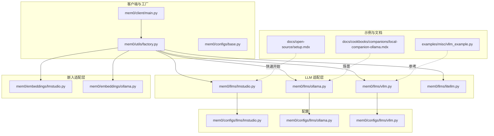
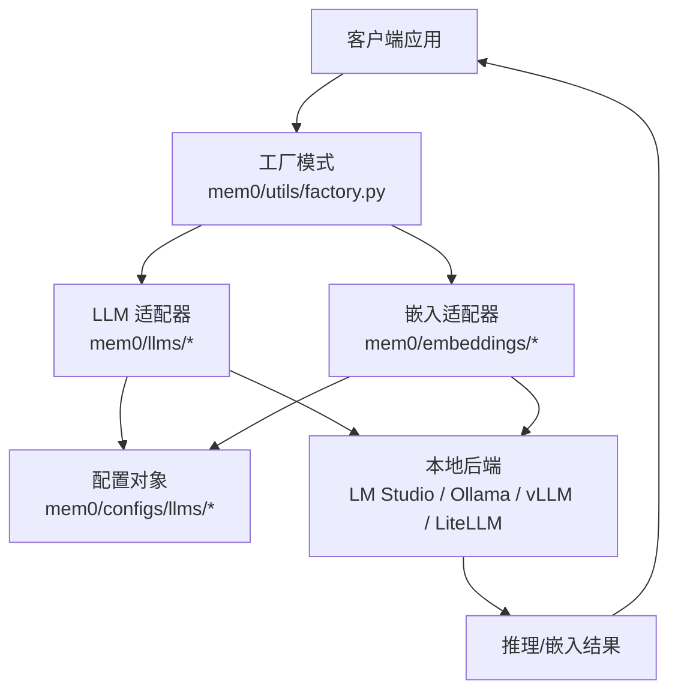
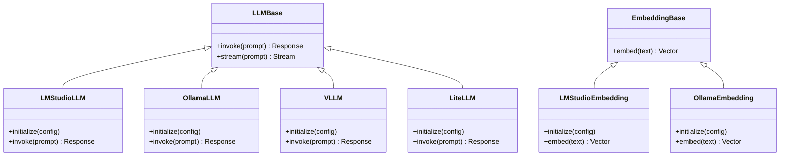
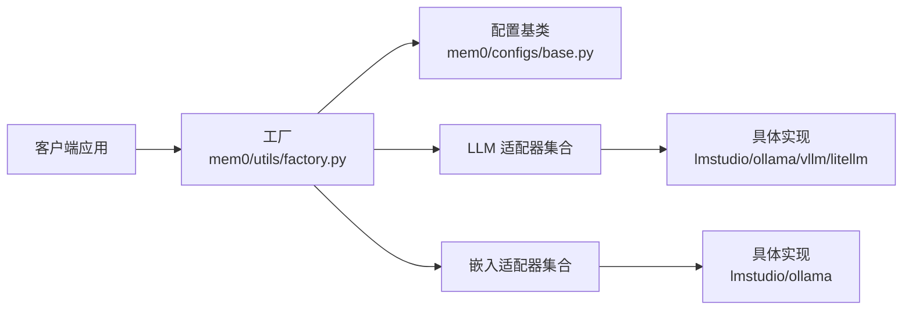
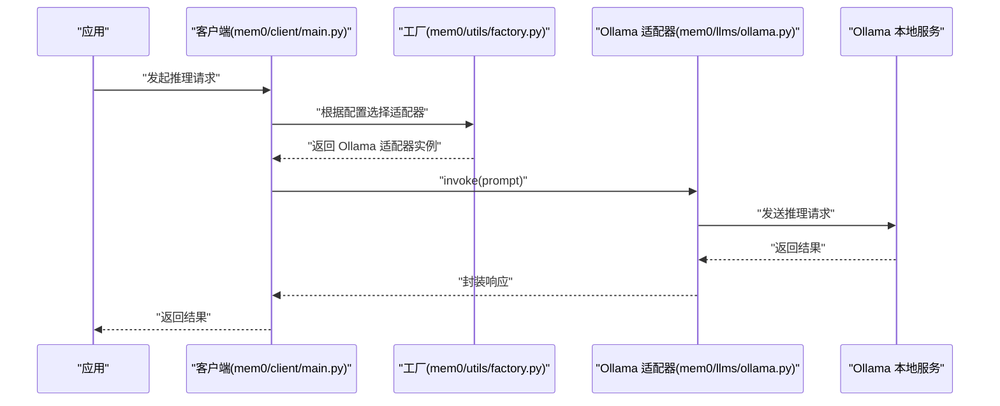

# 本地部署模型

<cite>
**本文引用的文件**
- [mem0/llms/lmstudio.py](file://mem0/llms/lmstudio.py)
- [mem0/embeddings/lmstudio.py](file://mem0/embeddings/lmstudio.py)
- [mem0/configs/llms/lmstudio.py](file://mem0/configs/llms/lmstudio.py)
- [mem0/llms/ollama.py](file://mem0/llms/ollama.py)
- [mem0/embeddings/ollama.py](file://mem0/embeddings/ollama.py)
- [mem0/configs/llms/ollama.py](file://mem0/configs/llms/ollama.py)
- [mem0/llms/vllm.py](file://mem0/llms/vllm.py)
- [mem0/configs/llms/vllm.py](file://mem0/configs/llms/vllm.py)
- [mem0/llms/litellm.py](file://mem0/llms/litellm.py)
- [docs/cookbooks/companions/local-companion-ollama.mdx](file://docs/cookbooks/companions/local-companion-ollama.mdx)
- [docs/open-source/setup.mdx](file://docs/open-source/setup.mdx)
- [examples/misc/vllm_example.py](file://examples/misc/vllm_example.py)
- [mem0-ts/src/oss/index.ts](file://mem0-ts/src/oss/index.ts)
- [mem0/client/main.py](file://mem0/client/main.py)
- [mem0/memory/main.py](file://mem0/memory/main.py)
- [mem0/utils/factory.py](file://mem0/utils/factory.py)
- [mem0/configs/base.py](file://mem0/configs/base.py)
- [mem0/exceptions.py](file://mem0/exceptions.py)
</cite>

## 目录
1. [引言](#引言)
2. [项目结构](#项目结构)
3. [核心组件](#核心组件)
4. [架构总览](#架构总览)
5. [详细组件分析](#详细组件分析)
6. [依赖关系分析](#依赖关系分析)
7. [性能考量](#性能考量)
8. [故障排查指南](#故障排查指南)
9. [结论](#结论)
10. [附录](#附录)

## 引言
本文件面向需要在本地部署与运行大语言模型（LLM）与嵌入模型（Embeddings）的用户，系统性介绍如何在本地环境中配置与使用 LM Studio、Ollama、vLLM、LiteLLM 等方案，并结合本仓库中的实现与示例，给出从安装、配置、加载到管理的完整流程。同时覆盖性能优化、资源监控与故障排查，以及隐私保护、离线使用与自定义部署场景。

## 项目结构
本仓库围绕“内存”与“向量存储”能力构建，提供多厂商与本地化 LLM 的适配层，便于在本地或私有环境中进行推理与嵌入计算。本地部署相关的关键位置如下：
- 本地 LLM 实现：mem0/llms 下包含各平台适配器（如 lmstudio.py、ollama.py、vllm.py、litellm.py）
- 嵌入模型适配：mem0/embeddings 下包含对应适配器（lmstudio.py、ollama.py）
- 配置对象：mem0/configs/llms 下包含各平台配置类
- 示例与文档：examples/misc/vllm_example.py、docs/cookbooks/companions/local-companion-ollama.mdx、docs/open-source/setup.mdx
- 客户端与工厂：mem0/client/main.py、mem0/utils/factory.py、mem0/configs/base.py

图表来源
- [mem0/client/main.py](file://mem0/client/main.py)
- [mem0/utils/factory.py](file://mem0/utils/factory.py)
- [mem0/llms/lmstudio.py](file://mem0/llms/lmstudio.py)
- [mem0/llms/ollama.py](file://mem0/llms/ollama.py)
- [mem0/llms/vllm.py](file://mem0/llms/vllm.py)
- [mem0/llms/litellm.py](file://mem0/llms/litellm.py)
- [mem0/embeddings/lmstudio.py](file://mem0/embeddings/lmstudio.py)
- [mem0/embeddings/ollama.py](file://mem0/embeddings/ollama.py)
- [mem0/configs/llms/lmstudio.py](file://mem0/configs/llms/lmstudio.py)
- [mem0/configs/llms/ollama.py](file://mem0/configs/llms/ollama.py)
- [mem0/configs/llms/vllm.py](file://mem0/configs/llms/vllm.py)
- [examples/misc/vllm_example.py](file://examples/misc/vllm_example.py)
- [docs/cookbooks/companions/local-companion-ollama.mdx](file://docs/cookbooks/companions/local-companion-ollama.mdx)
- [docs/open-source/setup.mdx](file://docs/open-source/setup.mdx)

章节来源
- [mem0/client/main.py](file://mem0/client/main.py)
- [mem0/utils/factory.py](file://mem0/utils/factory.py)
- [mem0/configs/base.py](file://mem0/configs/base.py)

## 核心组件
- LLM 适配器：封装不同后端（LM Studio、Ollama、vLLM、LiteLLM）的初始化、参数传递与推理调用逻辑，统一对外接口。
- 嵌入模型适配器：提供本地 Embedding 模型的加载与向量化能力，支持与 LLM 适配器协同工作。
- 配置对象：集中管理各平台的连接参数、模型名称、超参等，便于在工厂模式中按需装配。
- 客户端与工厂：通过工厂根据配置动态选择并实例化具体适配器，简化上层调用。
- 示例与文档：提供快速上手与特定场景（如 Ollama 本地伴侶）的实践参考。

章节来源
- [mem0/llms/lmstudio.py](file://mem0/llms/lmstudio.py)
- [mem0/llms/ollama.py](file://mem0/llms/ollama.py)
- [mem0/llms/vllm.py](file://mem0/llms/vllm.py)
- [mem0/llms/litellm.py](file://mem0/llms/litellm.py)
- [mem0/embeddings/lmstudio.py](file://mem0/embeddings/lmstudio.py)
- [mem0/embeddings/ollama.py](file://mem0/embeddings/ollama.py)
- [mem0/configs/llms/lmstudio.py](file://mem0/configs/llms/lmstudio.py)
- [mem0/configs/llms/ollama.py](file://mem0/configs/llms/ollama.py)
- [mem0/configs/llms/vllm.py](file://mem0/configs/llms/vllm.py)
- [mem0/client/main.py](file://mem0/client/main.py)
- [mem0/utils/factory.py](file://mem0/utils/factory.py)

## 架构总览
下图展示本地部署模型在本仓库中的整体架构：客户端通过工厂选择具体的 LLM/Embedding 适配器；适配器读取配置对象完成初始化；推理与嵌入请求经由适配器转发至本地后端（LM Studio、Ollama、vLLM、LiteLLM），最终返回结果给客户端。

图表来源
- [mem0/utils/factory.py](file://mem0/utils/factory.py)
- [mem0/llms/lmstudio.py](file://mem0/llms/lmstudio.py)
- [mem0/llms/ollama.py](file://mem0/llms/ollama.py)
- [mem0/llms/vllm.py](file://mem0/llms/vllm.py)
- [mem0/llms/litellm.py](file://mem0/llms/litellm.py)
- [mem0/embeddings/lmstudio.py](file://mem0/embeddings/lmstudio.py)
- [mem0/embeddings/ollama.py](file://mem0/embeddings/ollama.py)
- [mem0/configs/llms/lmstudio.py](file://mem0/configs/llms/lmstudio.py)
- [mem0/configs/llms/ollama.py](file://mem0/configs/llms/ollama.py)
- [mem0/configs/llms/vllm.py](file://mem0/configs/llms/vllm.py)

## 详细组件分析

### LM Studio 适配器
- 职责：封装 LM Studio 的本地推理与嵌入调用，负责模型加载、参数传递与响应解析。
- 关键点：
  - 初始化时读取配置对象中的模型名、端口、是否启用流式等参数。
  - 推理流程遵循统一接口，支持文本生成与对话格式。
  - 嵌入适配器提供向量化能力，供检索与记忆模块使用。
- 使用建议：
  - 在本地启动 LM Studio 并确保模型已加载。
  - 通过配置对象设置正确的主机与端口，避免跨网络访问带来的延迟与安全风险。

章节来源
- [mem0/llms/lmstudio.py](file://mem0/llms/lmstudio.py)
- [mem0/embeddings/lmstudio.py](file://mem0/embeddings/lmstudio.py)
- [mem0/configs/llms/lmstudio.py](file://mem0/configs/llms/lmstudio.py)
- [docs/open-source/setup.mdx](file://docs/open-source/setup.mdx)

### Ollama 适配器
- 职责：对接 Ollama 本地服务，支持模型拉取、推理与嵌入。
- 关键点：
  - 通过配置对象指定模型名称与本地服务地址。
  - 支持流式输出与非流式输出两种模式，满足不同业务需求。
  - 提供嵌入适配器，用于向量化输入文本。
- 典型场景：本地伴侶应用可直接基于 Ollama 进行对话与知识检索。

章节来源
- [mem0/llms/ollama.py](file://mem0/llms/ollama.py)
- [mem0/embeddings/ollama.py](file://mem0/embeddings/ollama.py)
- [mem0/configs/llms/ollama.py](file://mem0/configs/llms/ollama.py)
- [docs/cookbooks/companions/local-companion-ollama.mdx](file://docs/cookbooks/companions/local-companion-ollama.mdx)

### vLLM 适配器
- 职责：封装 vLLM 的高性能推理能力，适合高吞吐与低延迟场景。
- 关键点：
  - 通过配置对象设置模型路径、并发度、量化策略等参数。
  - 提供统一的推理接口，兼容标准 LLM 调用方式。
  - 示例文件展示了基本用法，便于快速集成。
- 性能优势：利用异步与批处理机制提升吞吐量，降低单次延迟。

章节来源
- [mem0/llms/vllm.py](file://mem0/llms/vllm.py)
- [mem0/configs/llms/vllm.py](file://mem0/configs/llms/vllm.py)
- [examples/misc/vllm_example.py](file://examples/misc/vllm_example.py)

### LiteLLM 适配器
- 职责：作为统一路由层，将请求分发到不同后端（包括本地后端），实现多供应商/多后端的一致接口。
- 关键点：
  - 通过配置对象设置上游密钥、后端类型与回退策略。
  - 适合混合部署场景：本地优先，失败时自动切换到云端或其他本地后端。
- 适用场景：需要弹性扩展与多后端容灾的生产环境。

章节来源
- [mem0/llms/litellm.py](file://mem0/llms/litellm.py)

### 组件类关系图（代码级）

图表来源
- [mem0/llms/lmstudio.py](file://mem0/llms/lmstudio.py)
- [mem0/embeddings/lmstudio.py](file://mem0/embeddings/lmstudio.py)
- [mem0/llms/ollama.py](file://mem0/llms/ollama.py)
- [mem0/embeddings/ollama.py](file://mem0/embeddings/ollama.py)
- [mem0/llms/vllm.py](file://mem0/llms/vllm.py)
- [mem0/llms/litellm.py](file://mem0/llms/litellm.py)

## 依赖关系分析
- 工厂模式解耦：客户端仅依赖工厂与抽象基类，不直接关心具体后端实现，便于替换与扩展。
- 配置驱动：所有适配器均通过配置对象注入参数，避免硬编码，提升可移植性。
- 统一接口：LLM 与 Embedding 适配器遵循一致的调用约定，降低上层开发成本。

图表来源
- [mem0/utils/factory.py](file://mem0/utils/factory.py)
- [mem0/configs/base.py](file://mem0/configs/base.py)
- [mem0/llms/lmstudio.py](file://mem0/llms/lmstudio.py)
- [mem0/llms/ollama.py](file://mem0/llms/ollama.py)
- [mem0/llms/vllm.py](file://mem0/llms/vllm.py)
- [mem0/llms/litellm.py](file://mem0/llms/litellm.py)
- [mem0/embeddings/lmstudio.py](file://mem0/embeddings/lmstudio.py)
- [mem0/embeddings/ollama.py](file://mem0/embeddings/ollama.py)

章节来源
- [mem0/utils/factory.py](file://mem0/utils/factory.py)
- [mem0/configs/base.py](file://mem0/configs/base.py)

## 性能考量
- vLLM 优势：适合高吞吐与低延迟场景，可通过并发与批处理优化吞吐；建议结合示例文件进行基准测试与参数调优。
- Ollama 与 LM Studio：适合中小规模部署与快速迭代，注意模型大小与显存占用对性能的影响。
- LiteLLM 路由：在多后端场景中，合理设置回退策略与负载均衡，避免单点瓶颈。
- 资源监控：建议结合系统监控工具观察 CPU、内存、显存与网络使用情况，及时发现异常峰值。
- 参数优化：根据实际硬件条件调整批大小、并发数与量化策略，以获得最佳性价比。

章节来源
- [mem0/llms/vllm.py](file://mem0/llms/vllm.py)
- [examples/misc/vllm_example.py](file://examples/misc/vllm_example.py)

## 故障排查指南
- 无法连接本地后端
  - 检查本地服务是否正常运行（如 Ollama、LM Studio）。
  - 确认配置对象中的主机与端口正确，避免跨网络访问导致的超时。
- 模型未加载或加载失败
  - 对于 Ollama，确认模型名称拼写与镜像存在；对于 LM Studio，确认模型已在本地可用。
  - 对于 vLLM，检查模型路径与权限，确保可读。
- 推理结果异常
  - 切换流式与非流式模式对比，定位是否为流式处理问题。
  - 减少并发或批大小，观察是否为资源不足导致的错误。
- 错误处理与告警
  - 使用统一异常模块进行捕获与上报，便于定位问题根因。
  - 结合日志与监控指标，建立告警阈值，提前发现性能退化。

章节来源
- [mem0/llms/ollama.py](file://mem0/llms/ollama.py)
- [mem0/llms/lmstudio.py](file://mem0/llms/lmstudio.py)
- [mem0/llms/vllm.py](file://mem0/llms/vllm.py)
- [mem0/exceptions.py](file://mem0/exceptions.py)

## 结论
通过本仓库提供的适配器与工厂模式，可以在本地环境中灵活地部署与使用 LM Studio、Ollama、vLLM、LiteLLM 等多种后端。结合配置对象与示例文档，用户可以快速完成从安装、配置到推理与嵌入的全流程部署，并在性能与稳定性之间取得平衡。建议在生产环境中配合监控与告警体系，持续优化资源利用率与用户体验。

## 附录

### 快速开始（基于文档）
- 开源快速开始与基础配置参考：[docs/open-source/setup.mdx](file://docs/open-source/setup.mdx)
- Ollama 本地伴侶实践参考：[docs/cookbooks/companions/local-companion-ollama.mdx](file://docs/cookbooks/companions/local-companion-ollama.mdx)

### 关键流程时序图（以 Ollama 为例）

图表来源
- [mem0/client/main.py](file://mem0/client/main.py)
- [mem0/utils/factory.py](file://mem0/utils/factory.py)
- [mem0/llms/ollama.py](file://mem0/llms/ollama.py)