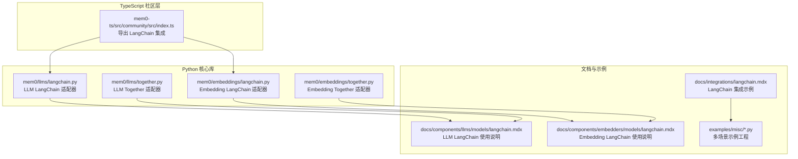
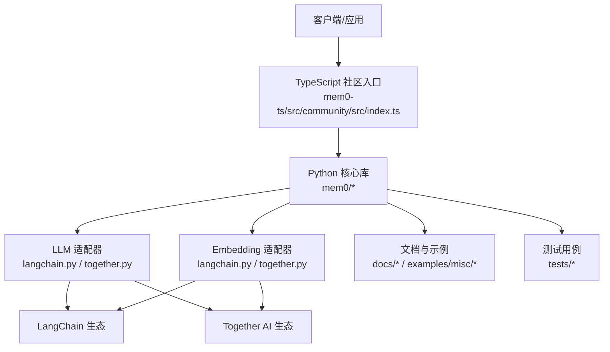
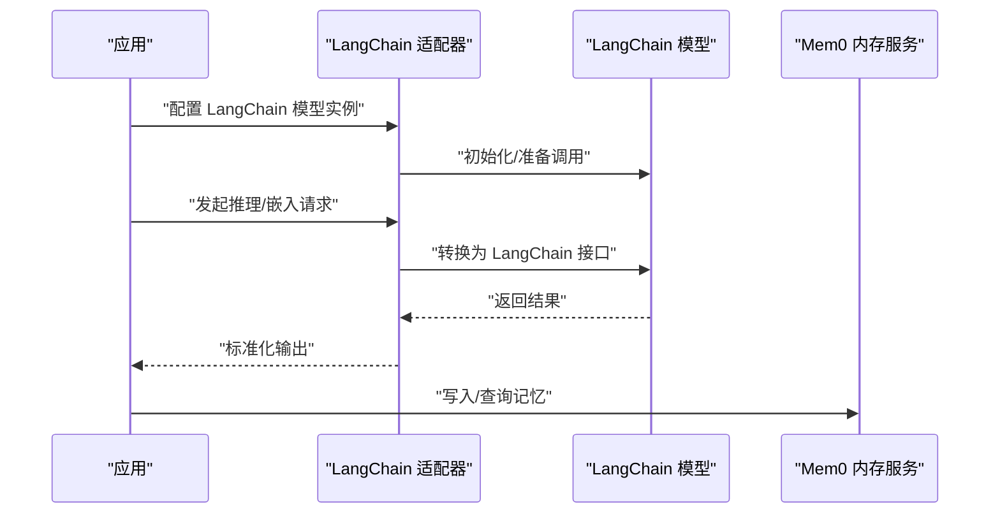
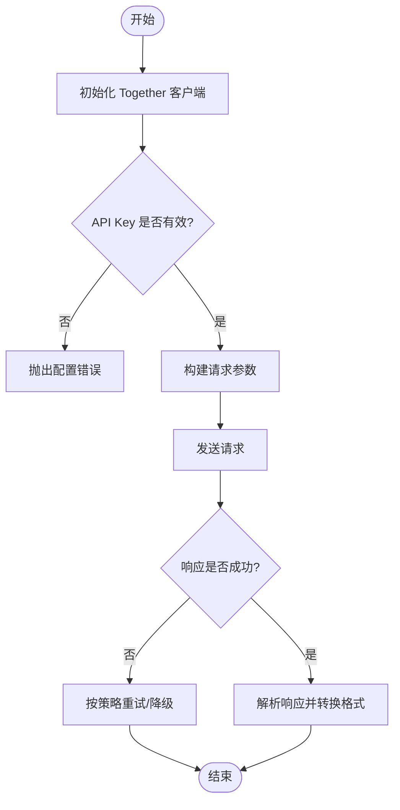
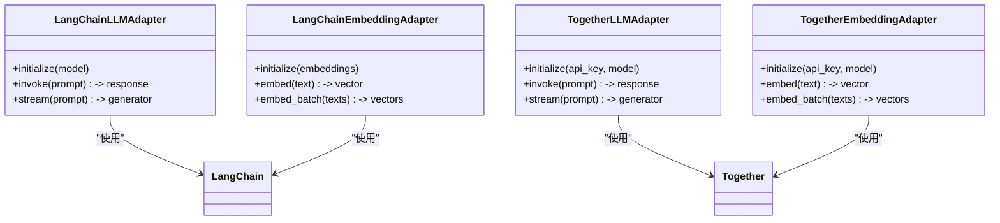
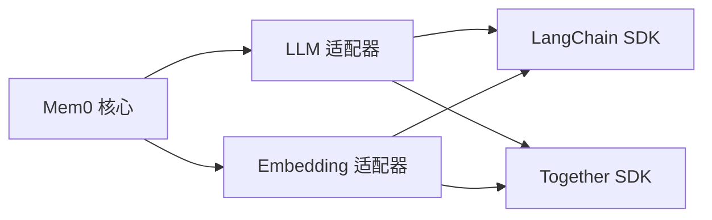

# 社区集成模型

<cite>
**本文引用的文件**
- [mem0-ts/src/community/src/index.ts](file://mem0-ts/src/community/src/index.ts)
- [docs/components/llms/models/langchain.mdx](file://docs/components/llms/models/langchain.mdx)
- [docs/integrations/langchain.mdx](file://docs/integrations/langchain.mdx)
- [docs/components/embedders/models/langchain.mdx](file://docs/components/embedders/models/langchain.mdx)
- [mem0/llms/langchain.py](file://mem0/llms/langchain.py)
- [mem0/embeddings/langchain.py](file://mem0/embeddings/langchain.py)
- [mem0/llms/together.py](file://mem0/llms/together.py)
- [mem0/embeddings/together.py](file://mem0/embeddings/together.py)
- [tests/llms/test_langchain.py](file://tests/llms/test_langchain.py)
- [tests/embeddings/test_langchain_embeddings.py](file://tests/embeddings/test_langchain_embeddings.py)
- [tests/llms/test_together.py](file://tests/llms/test_together.py)
- [tests/embeddings/test_together_embeddings.py](file://tests/embeddings/test_together_embeddings.py)
- [examples/misc/personal_assistant_agno.py](file://examples/misc/personal_assistant_agno.py)
- [examples/misc/fitness_checker.py](file://examples/misc/fitness_checker.py)
- [examples/misc/healthcare_assistant_google_adk.py](file://examples/misc/healthcare_assistant_google_adk.py)
- [examples/misc/movie_recommendation_grok3.py](file://examples/misc/movie_recommendation_grok3.py)
- [examples/misc/personalized_search.py](file://examples/misc/personalized_search.py)
- [examples/misc/strands_agent_aws_elasticache_neptune.py](file://examples/misc/strands_agent_aws_elasticache_neptune.py)
- [examples/misc/study_buddy.py](file://examples/misc/study_buddy.py)
- [examples/misc/vllm_example.py](file://examples/misc/vllm_example.py)
- [examples/misc/voice_assistant_elevenlabs.py](file://examples/misc/voice_assistant_elevenlabs.py)
- [README.md](file://README.md)
</cite>

## 目录
1. [简介](#简介)
2. [项目结构](#项目结构)
3. [核心组件](#核心组件)
4. [架构概览](#架构概览)
5. [详细组件分析](#详细组件分析)
6. [依赖关系分析](#依赖关系分析)
7. [性能考量](#性能考量)
8. [故障排除指南](#故障排除指南)
9. [结论](#结论)
10. [附录](#附录)

## 简介
本文件系统化梳理 Mem0 的社区集成模型能力，重点覆盖以下方面：
- LangChain 集成：作为 LLM 和嵌入模型提供商的统一接入层
- Together AI 等社区驱动模型：通过适配器实现对多厂商模型的支持
- 第三方集成的优势与限制：在可移植性、生态丰富度与稳定性之间的权衡
- 社区生态系统使用指南与最佳实践：从选择到贡献的全生命周期
- 开源模型选择、贡献与维护建议：面向实际工程落地的策略
- 社区支持、更新频率与兼容性考虑：保障长期可用性的关键因素

## 项目结构
围绕社区集成模型，代码库在多个层面提供了支持：
- TypeScript 社区入口导出 LangChain 集成模块，便于前端或跨语言场景复用
- Python 核心库在 LLM 与嵌入模块中分别提供 LangChain 适配器与 Together AI 适配器
- 文档层提供 LangChain 使用说明、示例与最佳实践
- 测试用例覆盖 LangChain 与 Together 的典型场景
- 示例工程展示多种实际应用（如健身助手、语音助手等）

**图表来源**
- [mem0-ts/src/community/src/index.ts:1-1](file://mem0-ts/src/community/src/index.ts#L1-L1)
- [mem0/llms/langchain.py](file://mem0/llms/langchain.py)
- [mem0/embeddings/langchain.py](file://mem0/embeddings/langchain.py)
- [mem0/llms/together.py](file://mem0/llms/together.py)
- [mem0/embeddings/together.py](file://mem0/embeddings/together.py)
- [docs/components/llms/models/langchain.mdx:1-37](file://docs/components/llms/models/langchain.mdx#L1-L37)
- [docs/integrations/langchain.mdx:1-40](file://docs/integrations/langchain.mdx#L1-L40)
- [docs/components/embedders/models/langchain.mdx:1-35](file://docs/components/embedders/models/langchain.mdx#L1-L35)
- [examples/misc/personal_assistant_agno.py](file://examples/misc/personal_assistant_agno.py)

**章节来源**
- [mem0-ts/src/community/src/index.ts:1-1](file://mem0-ts/src/community/src/index.ts#L1-L1)
- [docs/components/llms/models/langchain.mdx:1-37](file://docs/components/llms/models/langchain.mdx#L1-L37)
- [docs/integrations/langchain.mdx:1-40](file://docs/integrations/langchain.mdx#L1-L40)
- [docs/components/embedders/models/langchain.mdx:1-35](file://docs/components/embedders/models/langchain.mdx#L1-L35)

## 核心组件
- LangChain 适配器（LLM 与 Embeddings）
  - 提供统一接口以接入 LangChain 支持的多种聊天模型与嵌入模型
  - 在配置中传入已初始化的 LangChain 模型实例，即可无缝融入 Mem0 的内存与检索流程
- Together AI 适配器（LLM 与 Embeddings）
  - 通过适配器封装 Together 的 API 调用细节，实现与官方 SDK 的解耦
  - 支持在本地或云端部署的社区模型，满足多样化的推理与嵌入需求
- TypeScript 社区入口
  - 导出 LangChain 集成模块，便于在前端或跨语言环境中快速复用

**章节来源**
- [mem0/llms/langchain.py](file://mem0/llms/langchain.py)
- [mem0/embeddings/langchain.py](file://mem0/embeddings/langchain.py)
- [mem0/llms/together.py](file://mem0/llms/together.py)
- [mem0/embeddings/together.py](file://mem0/embeddings/together.py)
- [mem0-ts/src/community/src/index.ts:1-1](file://mem0-ts/src/community/src/index.ts#L1-L1)

## 架构概览
下图展示了 Mem0 在社区集成模型方面的整体架构：TS 层负责导出与桥接，Python 核心库提供适配器，文档与测试确保可用性与一致性，示例工程验证端到端效果。

**图表来源**
- [mem0-ts/src/community/src/index.ts:1-1](file://mem0-ts/src/community/src/index.ts#L1-L1)
- [mem0/llms/langchain.py](file://mem0/llms/langchain.py)
- [mem0/embeddings/langchain.py](file://mem0/embeddings/langchain.py)
- [mem0/llms/together.py](file://mem0/llms/together.py)
- [mem0/embeddings/together.py](file://mem0/embeddings/together.py)
- [docs/components/llms/models/langchain.mdx:1-37](file://docs/components/llms/models/langchain.mdx#L1-L37)
- [docs/integrations/langchain.mdx:1-40](file://docs/integrations/langchain.mdx#L1-L40)
- [docs/components/embedders/models/langchain.mdx:1-35](file://docs/components/embedders/models/langchain.mdx#L1-L35)
- [tests/llms/test_langchain.py](file://tests/llms/test_langchain.py)
- [tests/embeddings/test_langchain_embeddings.py](file://tests/embeddings/test_langchain_embeddings.py)
- [tests/llms/test_together.py](file://tests/llms/test_together.py)
- [tests/embeddings/test_together_embeddings.py](file://tests/embeddings/test_together_embeddings.py)

## 详细组件分析

### LangChain 集成分析
- 设计模式与职责
  - LLM 与 Embedding 适配器均采用“包装器”模式：接收 LangChain 已初始化的模型实例，将其行为标准化为 Mem0 的统一接口
  - 配置层不关心底层具体实现，仅需传入模型实例与必要参数
- 数据流与处理逻辑
  - 初始化阶段：用户传入 LangChain 模型实例与环境变量
  - 运行阶段：适配器将请求转换为 LangChain 接口所需格式，调用后返回结果
- 错误处理与边界条件
  - 适配器需捕获并转换底层异常，保证上层调用的一致性
  - 对空输入、无效参数进行前置校验，避免传播至 LangChain
- 性能影响
  - 适配器引入少量序列化/反序列化开销；通常可忽略
  - 与 LangChain 的连接池、缓存策略协同，避免重复初始化带来的额外成本

**图表来源**
- [mem0/llms/langchain.py](file://mem0/llms/langchain.py)
- [mem0/embeddings/langchain.py](file://mem0/embeddings/langchain.py)

**章节来源**
- [mem0/llms/langchain.py](file://mem0/llms/langchain.py)
- [mem0/embeddings/langchain.py](file://mem0/embeddings/langchain.py)
- [docs/components/llms/models/langchain.mdx:1-37](file://docs/components/llms/models/langchain.mdx#L1-L37)
- [docs/components/embedders/models/langchain.mdx:1-35](file://docs/components/embedders/models/langchain.mdx#L1-L35)
- [docs/integrations/langchain.mdx:1-40](file://docs/integrations/langchain.mdx#L1-L40)

### Together AI 集成分析
- 设计模式与职责
  - 适配器封装 Together API 的认证、请求与响应处理，屏蔽版本差异与参数变化
  - 支持 LLM 与 Embedding 双通道，满足不同任务场景
- 数据流与处理逻辑
  - 认证阶段：读取 API Key 并进行有效性检查
  - 请求阶段：将 Mem0 输入映射为 Together API 所需格式，设置超时与重试策略
  - 响应阶段：解析结果并转换为统一输出格式
- 错误处理与边界条件
  - 处理网络错误、API 限流、无效 Key 等常见问题
  - 对空响应与异常状态码进行降级处理
- 性能影响
  - 合理设置并发与重试，避免对下游造成压力
  - 结合本地缓存与批处理，提升吞吐量

**图表来源**
- [mem0/llms/together.py](file://mem0/llms/together.py)
- [mem0/embeddings/together.py](file://mem0/embeddings/together.py)

**章节来源**
- [mem0/llms/together.py](file://mem0/llms/together.py)
- [mem0/embeddings/together.py](file://mem0/embeddings/together.py)
- [tests/llms/test_together.py](file://tests/llms/test_together.py)
- [tests/embeddings/test_together_embeddings.py](file://tests/embeddings/test_together_embeddings.py)

### 类关系与依赖

**图表来源**
- [mem0/llms/langchain.py](file://mem0/llms/langchain.py)
- [mem0/embeddings/langchain.py](file://mem0/embeddings/langchain.py)
- [mem0/llms/together.py](file://mem0/llms/together.py)
- [mem0/embeddings/together.py](file://mem0/embeddings/together.py)

**章节来源**
- [mem0/llms/langchain.py](file://mem0/llms/langchain.py)
- [mem0/embeddings/langchain.py](file://mem0/embeddings/langchain.py)
- [mem0/llms/together.py](file://mem0/llms/together.py)
- [mem0/embeddings/together.py](file://mem0/embeddings/together.py)

## 依赖关系分析
- 组件内聚与耦合
  - 适配器内部高度内聚，仅依赖 LangChain 或 Together 的最小接口
  - 与 Mem0 主体通过统一配置与调用协议耦合，降低迁移成本
- 直接与间接依赖
  - 直接依赖：LangChain SDK、Together SDK、Python 标准库
  - 间接依赖：环境变量、网络连通性、第三方服务 SLA
- 循环依赖与风险
  - 当前设计无循环依赖；风险点在于外部 SDK 版本升级导致的接口变更
- 外部依赖与集成点
  - LangChain：多厂商模型生态，接口相对稳定
  - Together：社区模型生态，需关注上游 API 变更与速率限制

**图表来源**
- [mem0/llms/langchain.py](file://mem0/llms/langchain.py)
- [mem0/embeddings/langchain.py](file://mem0/embeddings/langchain.py)
- [mem0/llms/together.py](file://mem0/llms/together.py)
- [mem0/embeddings/together.py](file://mem0/embeddings/together.py)

**章节来源**
- [mem0/llms/langchain.py](file://mem0/llms/langchain.py)
- [mem0/embeddings/langchain.py](file://mem0/embeddings/langchain.py)
- [mem0/llms/together.py](file://mem0/llms/together.py)
- [mem0/embeddings/together.py](file://mem0/embeddings/together.py)

## 性能考量
- 适配器开销
  - 序列化/反序列化与参数映射开销极低，通常可忽略
- 并发与缓存
  - 利用 LangChain 的连接池与 Together 的批量接口，减少握手成本
  - 对高频查询结果进行本地缓存，降低重复调用
- 超时与重试
  - 设置合理的超时阈值与指数退避重试，平衡成功率与延迟
- 模型选择
  - LLM 与 Embedding 分离配置，针对不同任务选择最优模型组合

## 故障排除指南
- 常见问题与定位
  - API Key 未配置或过期：检查环境变量与密钥有效期
  - 网络不可达：确认代理与防火墙设置，测试连通性
  - 参数不匹配：核对模型名称、维度、温度等参数
  - 适配器异常：查看底层 SDK 抛出的错误信息并转换为统一错误码
- 单元测试参考
  - LLM 与 Embedding 的 LangChain 适配器均有对应测试用例，可作为行为基线
  - Together 适配器测试覆盖了典型调用路径与错误分支
- 建议排查步骤
  1) 确认配置项完整且类型正确
  2) 尝试最小化复现（直连 LangChain/Together）
  3) 查看日志与指标（耗时、错误率、重试次数）
  4) 回滚最近变更，定位引入问题的版本

**章节来源**
- [tests/llms/test_langchain.py](file://tests/llms/test_langchain.py)
- [tests/embeddings/test_langchain_embeddings.py](file://tests/embeddings/test_langchain_embeddings.py)
- [tests/llms/test_together.py](file://tests/llms/test_together.py)
- [tests/embeddings/test_together_embeddings.py](file://tests/embeddings/test_together_embeddings.py)

## 结论
- LangChain 与 Together AI 为 Mem0 提供了强大的社区集成能力：前者覆盖广泛的厂商模型生态，后者聚焦社区驱动的多样化模型
- 通过适配器模式，Mem0 实现了对多生态的统一接入，降低了迁移与维护成本
- 在工程实践中，应结合业务场景选择合适的模型与适配器，并建立完善的监控与回滚机制

## 附录

### 社区生态系统使用指南与最佳实践
- 选择策略
  - 优先评估模型质量、推理速度与成本
  - 关注社区活跃度与文档完善程度
- 配置与部署
  - 明确区分开发/生产环境的凭据与参数
  - 使用环境变量与配置文件分离敏感信息
- 监控与告警
  - 建立关键指标（延迟、错误率、吞吐）的可视化
  - 对上游限流与异常进行分级告警
- 兼容性与升级
  - 对外部 SDK 进行版本锁定与灰度发布
  - 保持适配器接口稳定，逐步替换底层实现

### 开源模型的选择、贡献与维护建议
- 选择开源模型时，建议关注：
  - 许可证与商业使用条款
  - 社区治理与更新频率
  - 性能基准与资源消耗
- 贡献与维护：
  - 通过 PR 提交修复与优化，遵循既有风格与测试规范
  - 为新增适配器补充单元测试与集成示例
  - 在文档中记录关键参数与注意事项

### 社区支持、更新频率与兼容性考虑
- 社区支持：优先选择有活跃维护与清晰 Issue/PR 流程的项目
- 更新频率：关注主要版本与重大变更，制定升级计划
- 兼容性：在适配器层抽象差异，尽量避免直接依赖特定版本的内部 API

**章节来源**
- [README.md](file://README.md)
- [docs/components/llms/models/langchain.mdx:1-37](file://docs/components/llms/models/langchain.mdx#L1-L37)
- [docs/integrations/langchain.mdx:1-40](file://docs/integrations/langchain.mdx#L1-L40)
- [docs/components/embedders/models/langchain.mdx:1-35](file://docs/components/embedders/models/langchain.mdx#L1-L35)