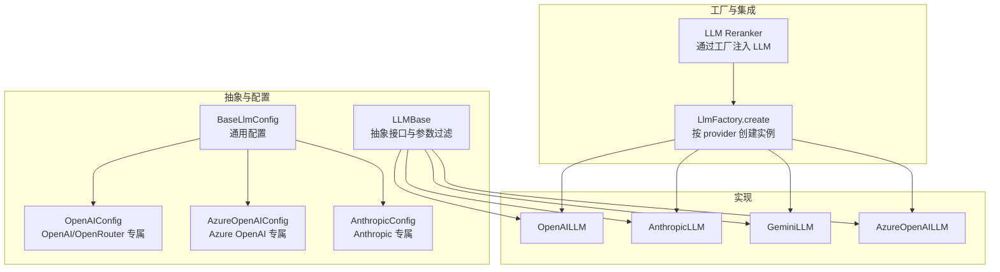
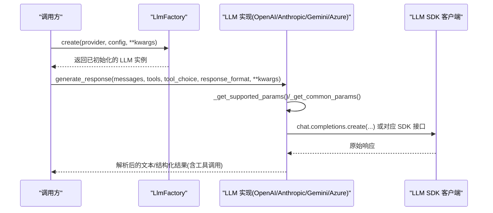
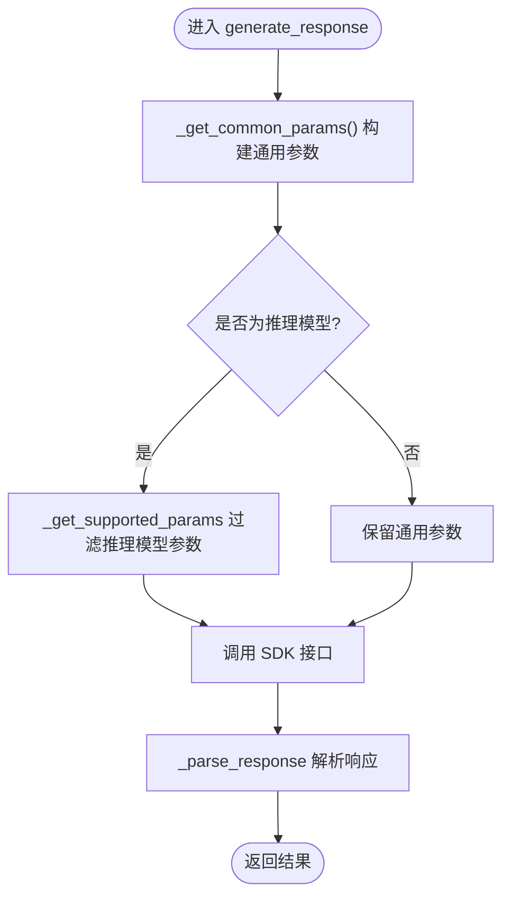
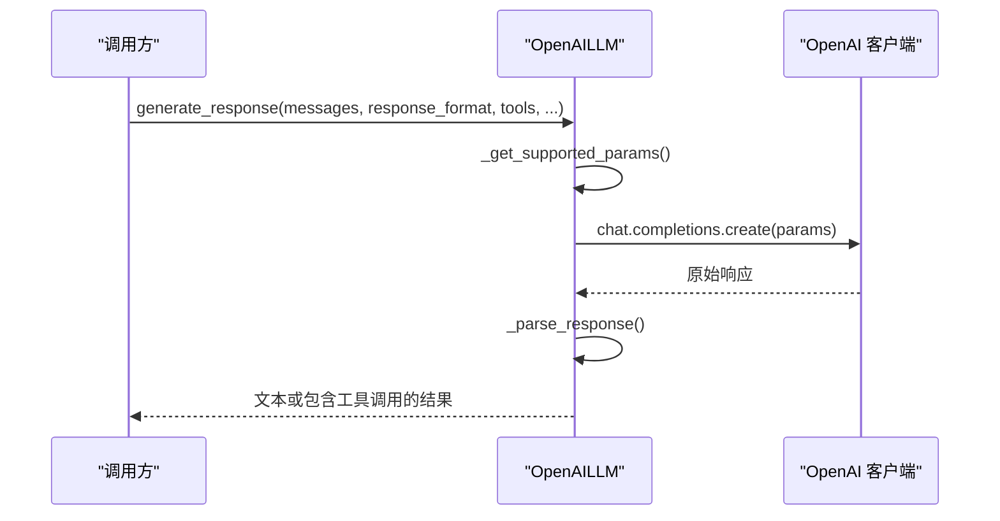
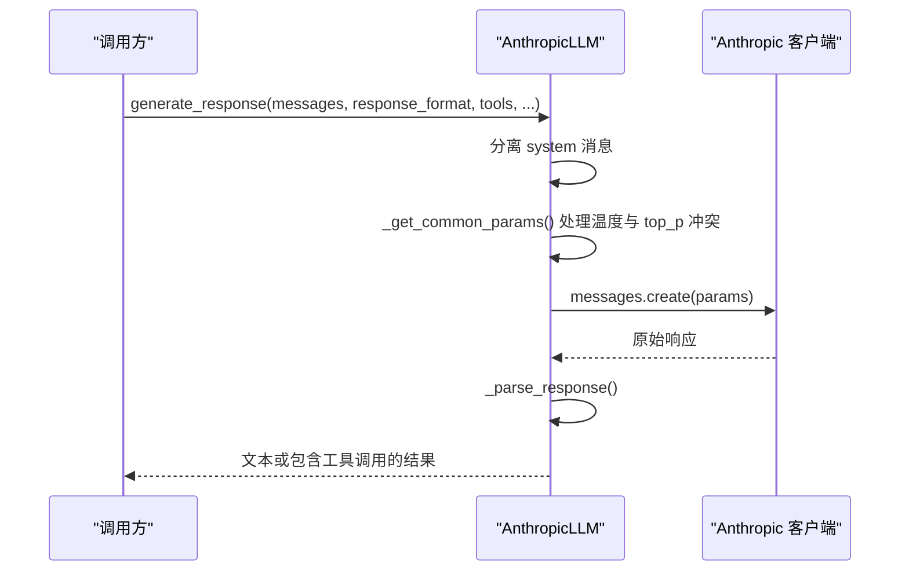
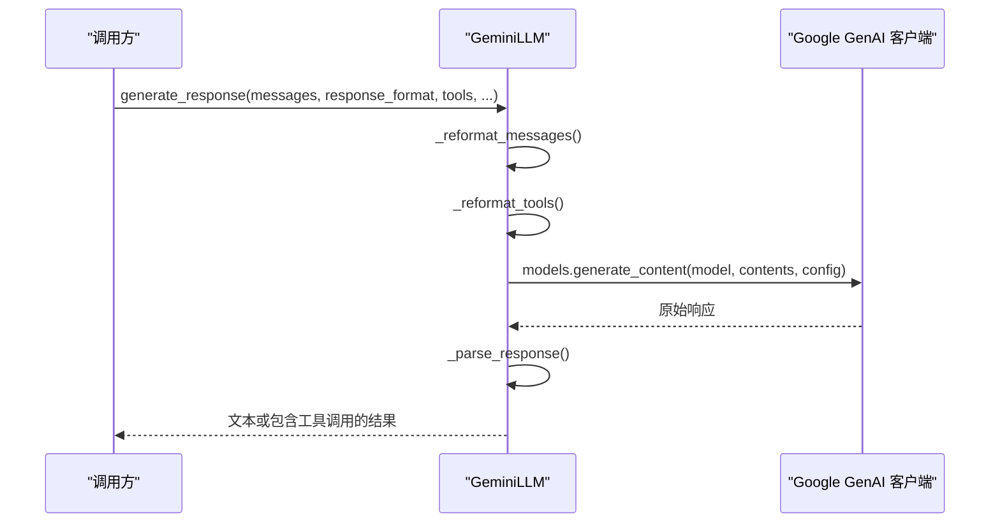
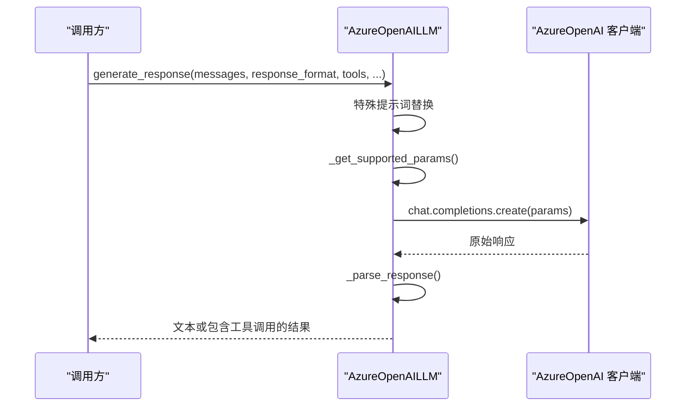
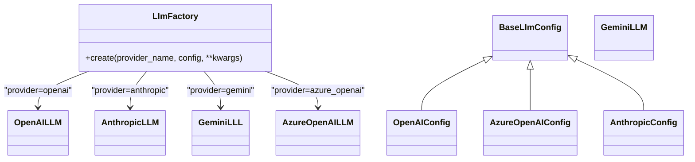
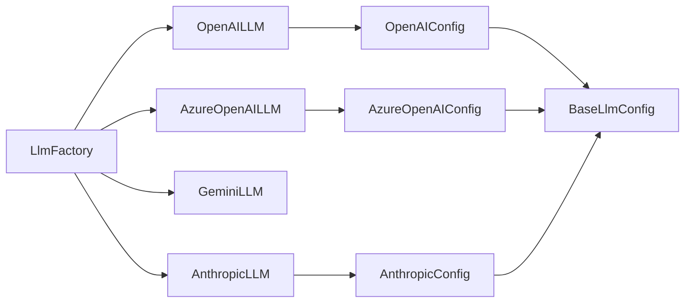

# 语言模型组件

<cite>
**本文引用的文件**
- [mem0/llms/base.py](file://mem0/llms/base.py)
- [mem0/llms/configs.py](file://mem0/llms/configs.py)
- [mem0/configs/llms/base.py](file://mem0/configs/llms/base.py)
- [mem0/configs/llms/openai.py](file://mem0/configs/llms/openai.py)
- [mem0/configs/llms/azure.py](file://mem0/configs/llms/azure.py)
- [mem0/configs/llms/anthropic.py](file://mem0/configs/llms/anthropic.py)
- [mem0/llms/openai.py](file://mem0/llms/openai.py)
- [mem0/llms/anthropic.py](file://mem0/llms/anthropic.py)
- [mem0/llms/gemini.py](file://mem0/llms/gemini.py)
- [mem0/llms/azure_openai.py](file://mem0/llms/azure_openai.py)
- [mem0/utils/factory.py](file://mem0/utils/factory.py)
- [mem0/reranker/llm_reranker.py](file://mem0/reranker/llm_reranker.py)
- [server/errors.py](file://server/errors.py)
</cite>

## 目录
1. [引言](#引言)
2. [项目结构](#项目结构)
3. [核心组件](#核心组件)
4. [架构总览](#架构总览)
5. [详细组件分析](#详细组件分析)
6. [依赖关系分析](#依赖关系分析)
7. [性能考量](#性能考量)
8. [故障排查指南](#故障排查指南)
9. [结论](#结论)
10. [附录](#附录)

## 引言
本文件系统性梳理语言模型（LLM）组件的设计与实现，覆盖抽象接口、多提供商适配、参数兼容与差异、结构化输出、工具调用、批量与错误处理最佳实践，以及模型切换、负载均衡与故障转移策略建议，并给出性能监控与成本优化思路。目标是帮助开发者在不深入每个SDK细节的前提下，快速正确地集成与运维多提供商 LLM 能力。

## 项目结构
LLM 组件采用“抽象基类 + 多提供商实现 + 配置体系 + 工厂模式”的分层设计：
- 抽象层：统一的 LLM 抽象接口，定义通用行为与参数过滤逻辑
- 配置层：以 BaseLlmConfig 为基类，各提供商扩展专属配置项
- 实现层：各提供商具体实现，负责消息格式转换、参数映射与调用
- 工厂层：根据 provider 名称与配置动态创建实例
- 上游集成：如重排器等模块通过工厂注入 LLM

图表来源
- [mem0/llms/base.py:7-176](file://mem0/llms/base.py#L7-L176)
- [mem0/configs/llms/base.py:7-78](file://mem0/configs/llms/base.py#L7-L78)
- [mem0/configs/llms/openai.py:6-93](file://mem0/configs/llms/openai.py#L6-L93)
- [mem0/configs/llms/azure.py:7-67](file://mem0/configs/llms/azure.py#L7-L67)
- [mem0/configs/llms/anthropic.py:6-57](file://mem0/configs/llms/anthropic.py#L6-L57)
- [mem0/utils/factory.py:59-113](file://mem0/utils/factory.py#L59-L113)
- [mem0/reranker/llm_reranker.py:34-59](file://mem0/reranker/llm_reranker.py#L34-L59)

章节来源
- [mem0/llms/base.py:7-176](file://mem0/llms/base.py#L7-L176)
- [mem0/configs/llms/base.py:7-78](file://mem0/configs/llms/base.py#L7-L78)
- [mem0/utils/factory.py:59-113](file://mem0/utils/factory.py#L59-L113)

## 核心组件
- LLM 抽象接口（LLMBase）
  - 统一初始化与配置校验，支持字典或配置对象传入
  - 提供推理模型识别与参数过滤：针对 o1/o3 与 gpt-5 系列自动剔除不兼容参数
  - 统一生成响应参数构建：根据模型类型选择 max_tokens 或 max_completion_tokens
  - 定义抽象方法 generate_response，由子类实现
- 配置体系（BaseLlmConfig 与提供商专属配置）
  - 通用参数：模型名、温度、最大生成长度、采样策略、视觉能力、代理、推理努力级别等
  - OpenAI/OpenRouter 专属：可选 base_url、models 列表、路由、站点信息、存储开关、回调
  - Azure OpenAI 专属：封装 AzureConfig 并支持默认凭据与部署名
  - Anthropic 专属：避免与温度同时发送 top_p 的兼容处理
- 工厂（LlmFactory）
  - 按 provider 名称映射到具体实现类与配置类
  - 支持传入空配置、字典配置或通用 BaseLlmConfig，自动转换为提供商专属配置
  - 返回已初始化的 LLM 实例

章节来源
- [mem0/llms/base.py:13-176](file://mem0/llms/base.py#L13-L176)
- [mem0/configs/llms/base.py:16-78](file://mem0/configs/llms/base.py#L16-L78)
- [mem0/configs/llms/openai.py:12-93](file://mem0/configs/llms/openai.py#L12-L93)
- [mem0/configs/llms/azure.py:13-67](file://mem0/configs/llms/azure.py#L13-L67)
- [mem0/configs/llms/anthropic.py:12-57](file://mem0/configs/llms/anthropic.py#L12-L57)
- [mem0/utils/factory.py:59-113](file://mem0/utils/factory.py#L59-L113)

## 架构总览
下图展示从工厂创建到具体提供商调用的关键流程，以及参数过滤与消息格式转换的节点。

图表来源
- [mem0/utils/factory.py:59-113](file://mem0/utils/factory.py#L59-L113)
- [mem0/llms/base.py:101-176](file://mem0/llms/base.py#L101-L176)
- [mem0/llms/openai.py:85-151](file://mem0/llms/openai.py#L85-L151)
- [mem0/llms/anthropic.py:68-126](file://mem0/llms/anthropic.py#L68-L126)
- [mem0/llms/gemini.py:137-208](file://mem0/llms/gemini.py#L137-L208)
- [mem0/llms/azure_openai.py:102-146](file://mem0/llms/azure_openai.py#L102-L146)

## 详细组件分析

### 抽象接口与参数兼容性（LLMBase）
- 推理模型识别：对 o1/o3 与 gpt-5 系列进行名称匹配与显式标记优先策略
- 参数过滤：
  - 推理模型仅保留 messages、response_format、tools、tool_choice 等字段
  - 其他模型保留通用参数（temperature/top_p/max_tokens 等）
- 模型令牌上限字段选择：gpt-5 系列使用 max_completion_tokens，其他使用 max_tokens
- 通用参数构建：合并用户 kwargs，自动注入模型与消息

图表来源
- [mem0/llms/base.py:43-176](file://mem0/llms/base.py#L43-L176)

章节来源
- [mem0/llms/base.py:43-176](file://mem0/llms/base.py#L43-L176)

### OpenAI 适配（OpenAILLM）
- 初始化：支持 OpenAI 与 OpenRouter；OpenRouter 时可设置 models 与路由，附加站点头
- 参数映射：根据 is_reasoning_model 与模型类型决定参数集合；支持 response_format 与工具调用
- 响应解析：当存在工具调用时提取函数名与 JSON 参数；否则直接返回内容
- 回调：可选响应回调用于监控

图表来源
- [mem0/llms/openai.py:85-151](file://mem0/llms/openai.py#L85-L151)

章节来源
- [mem0/llms/openai.py:14-151](file://mem0/llms/openai.py#L14-L151)
- [mem0/configs/llms/openai.py:6-93](file://mem0/configs/llms/openai.py#L6-L93)

### Anthropic 适配（AnthropicLLM）
- 初始化：从环境变量加载 API Key；若同时设置 temperature 与 top_p，则仅保留 temperature
- 消息预处理：分离 system 消息，其余作为普通消息列表
- 参数映射：根据配置构造请求参数；工具调用时使用 tool_choice 对象
- 响应解析：遍历内容块，提取文本与工具调用

图表来源
- [mem0/llms/anthropic.py:68-126](file://mem0/llms/anthropic.py#L68-L126)

章节来源
- [mem0/llms/anthropic.py:14-126](file://mem0/llms/anthropic.py#L14-L126)
- [mem0/configs/llms/anthropic.py:6-57](file://mem0/configs/llms/anthropic.py#L6-L57)

### Google Gemini 适配（GeminiLLM）
- 初始化：从环境变量加载 API Key
- 消息重格式化：将消息转为 Content 结构，支持 system_instruction
- 工具重格式化：清理 additionalProperties 后转为 FunctionDeclaration 列表
- 参数映射：根据配置构造 GenerateContentConfig；JSON 输出时设置 response_mime_type 与 response_schema
- 响应解析：安全提取候选内容中的文本与函数调用

图表来源
- [mem0/llms/gemini.py:137-208](file://mem0/llms/gemini.py#L137-L208)

章节来源
- [mem0/llms/gemini.py:14-208](file://mem0/llms/gemini.py#L14-L208)

### Azure OpenAI 适配（AzureOpenAILLM）
- 初始化：支持显式 API Key 与默认凭据；从环境变量读取 endpoint、deployment、api_version
- 特殊处理：将 assistant 替换为 ai 以满足特定部署要求
- 参数映射：与 OpenAI 类似，支持 response_format 与工具调用
- 响应解析：与 OpenAI 相同

图表来源
- [mem0/llms/azure_openai.py:102-146](file://mem0/llms/azure_openai.py#L102-L146)

章节来源
- [mem0/llms/azure_openai.py:16-146](file://mem0/llms/azure_openai.py#L16-L146)
- [mem0/configs/llms/azure.py:7-67](file://mem0/configs/llms/azure.py#L7-L67)

### 工厂与配置转换（LlmFactory）
- 映射：provider 名称到具体实现类与配置类
- 转换：支持传入 None、字典或通用 BaseLlmConfig，自动合并 kwargs 并转换为提供商专属配置
- 返回：返回已初始化的 LLM 实例

图表来源
- [mem0/utils/factory.py:59-113](file://mem0/utils/factory.py#L59-L113)
- [mem0/configs/llms/base.py:7-78](file://mem0/configs/llms/base.py#L7-L78)
- [mem0/configs/llms/openai.py:6-93](file://mem0/configs/llms/openai.py#L6-L93)
- [mem0/configs/llms/azure.py:7-67](file://mem0/configs/llms/azure.py#L7-L67)
- [mem0/configs/llms/anthropic.py:6-57](file://mem0/configs/llms/anthropic.py#L6-L57)

章节来源
- [mem0/utils/factory.py:59-113](file://mem0/utils/factory.py#L59-L113)
- [mem0/configs/llms/base.py:7-78](file://mem0/configs/llms/base.py#L7-L78)
- [mem0/configs/llms/openai.py:6-93](file://mem0/configs/llms/openai.py#L6-L93)
- [mem0/configs/llms/azure.py:7-67](file://mem0/configs/llms/azure.py#L7-L67)
- [mem0/configs/llms/anthropic.py:6-57](file://mem0/configs/llms/anthropic.py#L6-L57)

## 依赖关系分析
- 组件耦合
  - LLMBase 与各提供商实现：强内聚、低耦合，通过抽象方法约束
  - 配置类与实现类：通过工厂解耦，便于扩展新提供商
  - 工厂与实现：通过字符串映射连接，新增提供商只需更新映射与配置
- 外部依赖
  - OpenAI/Anthropic/Google GenAI/Azure OpenAI SDK
  - httpx 用于代理配置
- 潜在循环依赖
  - 当前结构无循环导入风险

图表来源
- [mem0/utils/factory.py:59-113](file://mem0/utils/factory.py#L59-L113)
- [mem0/configs/llms/base.py:7-78](file://mem0/configs/llms/base.py#L7-L78)
- [mem0/configs/llms/openai.py:6-93](file://mem0/configs/llms/openai.py#L6-L93)
- [mem0/configs/llms/azure.py:7-67](file://mem0/configs/llms/azure.py#L7-L67)
- [mem0/configs/llms/anthropic.py:6-57](file://mem0/configs/llms/anthropic.py#L6-L57)

章节来源
- [mem0/utils/factory.py:59-113](file://mem0/utils/factory.py#L59-L113)
- [mem0/configs/llms/base.py:7-78](file://mem0/configs/llms/base.py#L7-L78)

## 性能考量
- 参数选择与模型适配
  - 推理模型（o1/o3/gpt-5）自动过滤不兼容参数，避免无效调用
  - gpt-5 系列使用 max_completion_tokens，减少参数歧义
- 采样策略
  - 温度与 top_p 的合理搭配：Anthropic 明确禁止同时发送两者，需按提供商规则选择其一
- 代理与网络
  - 通过 httpx 代理提升跨地域访问稳定性
- 成本优化
  - 控制 max_tokens 与 temperature，降低生成长度与多样性带来的成本上升
  - 使用结构化输出（JSON Schema）减少后处理开销
- 批量与并发
  - 将批量请求拆分为独立调用，结合外部队列与限流策略，避免单点过载
- 监控与可观测性
  - 通过 OpenAI 的 response_callback 或自定义中间件记录耗时、Token 使用与错误码

## 故障排查指南
- 认证失败
  - 现象：401/403
  - 排查：确认 API Key 正确、作用域与权限
- 速率限制
  - 现象：429
  - 排查：降低并发、增加退避重试、使用排队与熔断
- 超时
  - 现象：TimeoutError 或超时
  - 排查：检查网络、代理、上游服务健康状态
- 服务器错误
  - 现象：5xx
  - 排查：上游不可用或不稳定，启用降级与故障转移
- 请求格式错误
  - 现象：400/422
  - 排查：核对消息格式、工具定义、参数键名与值类型
- 数据库/向量存储异常
  - 现象：相关模块报错
  - 排查：检查连接串、索引状态与资源配额

章节来源
- [server/errors.py:33-51](file://server/errors.py#L33-L51)

## 结论
该 LLM 组件通过抽象接口、统一配置与工厂模式，实现了对多家提供商的一致接入与差异化适配。借助参数过滤、消息重格式化与工具调用解析，既保证了易用性，也兼顾了性能与成本控制。建议在生产环境中配合限流、重试、监控与日志，形成完整的可观测与弹性保障体系。

## 附录
- 最佳实践清单
  - 使用工厂创建实例，避免直接实例化具体提供商类
  - 在配置中明确 max_tokens 与采样参数，必要时按模型族自动调整
  - 对工具调用使用 JSON Schema，确保结构化输出一致性
  - 为不同提供商设置独立的重试与超时策略
  - 通过回调或中间件记录关键指标，持续优化成本与延迟
- 模型切换与故障转移建议
  - 多路并行：同时向多个提供商发起请求，取最先完成且质量达标的结果
  - 主备切换：按成功率与延迟动态选择主备提供商
  - 降级策略：在上游不可用时回退到本地轻量模型或缓存