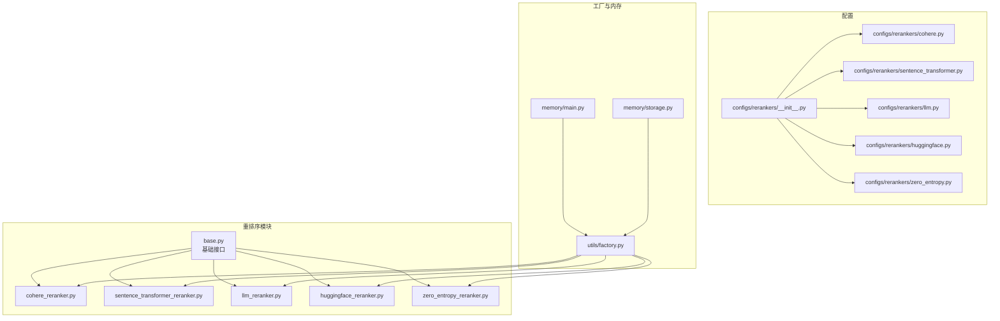
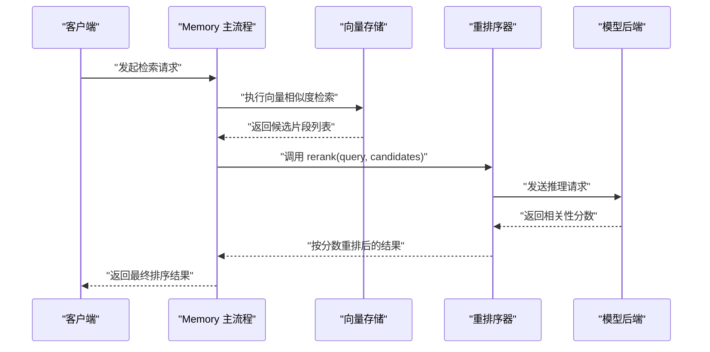
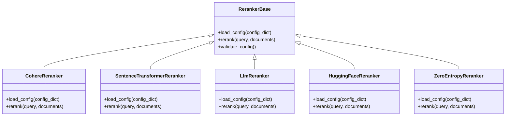
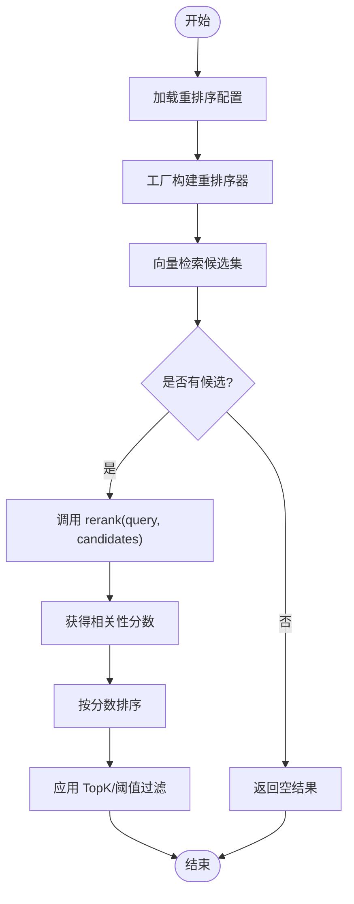
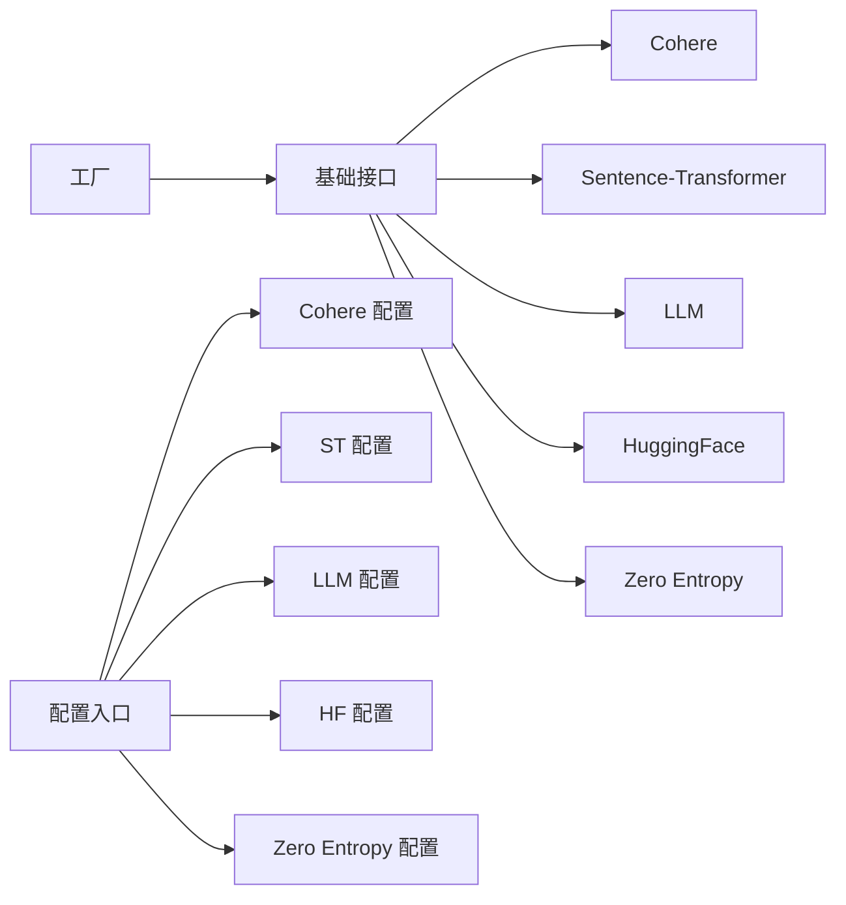

# 重排序组件

<cite>
**本文引用的文件**
- [mem0/reranker/base.py](file://mem0/reranker/base.py)
- [mem0/reranker/cohere_reranker.py](file://mem0/reranker/cohere_reranker.py)
- [mem0/reranker/sentence_transformer_reranker.py](file://mem0/reranker/sentence_transformer_reranker.py)
- [mem0/reranker/llm_reranker.py](file://mem0/reranker/llm_reranker.py)
- [mem0/reranker/huggingface_reranker.py](file://mem0/reranker/huggingface_reranker.py)
- [mem0/reranker/zero_entropy_reranker.py](file://mem0/reranker/zero_entropy_reranker.py)
- [mem0/configs/rerankers/__init__.py](file://mem0/configs/rerankers/__init__.py)
- [mem0/configs/rerankers/cohere.py](file://mem0/configs/rerankers/cohere.py)
- [mem0/configs/rerankers/sentence_transformer.py](file://mem0/configs/rerankers/sentence_transformer.py)
- [mem0/configs/rerankers/llm.py](file://mem0/configs/rerankers/llm.py)
- [mem0/configs/rerankers/huggingface.py](file://mem0/configs/rerankers/huggingface.py)
- [mem0/configs/rerankers/zero_entropy.py](file://mem0/configs/rerankers/zero_entropy.py)
- [mem0/utils/factory.py](file://mem0/utils/factory.py)
- [mem0/memory/main.py](file://mem0/memory/main.py)
- [mem0/memory/storage.py](file://mem0/memory/storage.py)
- [tests/rerankers/test_llm_reranker_config.py](file://tests/rerankers/test_llm_reranker_config.py)
- [tests/rerankers/test_llm_reranker_nested_config.py](file://tests/rerankers/test_llm_reranker_nested_config.py)
- [tests/rerankers/test_llm_reranker_rerank.py](file://tests/rerankers/test_llm_reranker_rerank.py)
- [tests/rerankers/test_reranker_fallback_topk.py](file://tests/rerankers/test_reranker_fallback_topk.py)
- [docs/components/rerankers/overview.mdx](file://docs/components/rerankers/overview.mdx)
- [docs/components/rerankers/config.mdx](file://docs/components/rerankers/config.mdx)
- [docs/components/rerankers/custom-prompts.mdx](file://docs/components/rerankers/custom-prompts.mdx)
- [docs/components/rerankers/optimization.mdx](file://docs/components/rerankers/optimization.mdx)
- [docs/open-source/features/reranking.mdx](file://docs/open-source/features/reranking.mdx)
- [docs/open-source/features/reranker-search.mdx](file://docs/open-source/features/reranker-search.mdx)
</cite>

## 目录
1. [简介](#简介)
2. [项目结构](#项目结构)
3. [核心组件](#核心组件)
4. [架构总览](#架构总览)
5. [详细组件分析](#详细组件分析)
6. [依赖关系分析](#依赖关系分析)
7. [性能考虑](#性能考虑)
8. [故障排查指南](#故障排查指南)
9. [结论](#结论)
10. [附录](#附录)

## 简介
本文件系统化梳理重排序（Reranking）组件的设计与实现，覆盖其在信息检索中的作用、工作原理、支持的模型类型与配置方式、算法优缺点与适用场景、查询优化与相关性评分、性能调优与成本控制、以及效果评估与 A/B 测试方法。重排序作为检索流程中的二次精排阶段，通过更精细的语义匹配对初步检索结果进行再排序，显著提升最终返回的相关性质量。

## 项目结构
重排序组件位于 Python 包 mem0 的 reranker 子模块中，并配套有配置类、工厂构造器与测试用例；同时在文档目录 docs/components/rerankers 下提供了概览、配置、自定义提示词与优化建议等官方文档。

**图表来源**
- [mem0/reranker/base.py](file://mem0/reranker/base.py)
- [mem0/reranker/cohere_reranker.py](file://mem0/reranker/cohere_reranker.py)
- [mem0/reranker/sentence_transformer_reranker.py](file://mem0/reranker/sentence_transformer_reranker.py)
- [mem0/reranker/llm_reranker.py](file://mem0/reranker/llm_reranker.py)
- [mem0/reranker/huggingface_reranker.py](file://mem0/reranker/huggingface_reranker.py)
- [mem0/reranker/zero_entropy_reranker.py](file://mem0/reranker/zero_entropy_reranker.py)
- [mem0/configs/rerankers/__init__.py](file://mem0/configs/rerankers/__init__.py)
- [mem0/configs/rerankers/cohere.py](file://mem0/configs/rerankers/cohere.py)
- [mem0/configs/rerankers/sentence_transformer.py](file://mem0/configs/rerankers/sentence_transformer.py)
- [mem0/configs/rerankers/llm.py](file://mem0/configs/rerankers/llm.py)
- [mem0/configs/rerankers/huggingface.py](file://mem0/configs/rerankers/huggingface.py)
- [mem0/configs/rerankers/zero_entropy.py](file://mem0/configs/rerankers/zero_entropy.py)
- [mem0/utils/factory.py](file://mem0/utils/factory.py)
- [mem0/memory/main.py](file://mem0/memory/main.py)
- [mem0/memory/storage.py](file://mem0/memory/storage.py)

**章节来源**
- [mem0/reranker/base.py](file://mem0/reranker/base.py)
- [mem0/reranker/cohere_reranker.py](file://mem0/reranker/cohere_reranker.py)
- [mem0/reranker/sentence_transformer_reranker.py](file://mem0/reranker/sentence_transformer_reranker.py)
- [mem0/reranker/llm_reranker.py](file://mem0/reranker/llm_reranker.py)
- [mem0/reranker/huggingface_reranker.py](file://mem0/reranker/huggingface_reranker.py)
- [mem0/reranker/zero_entropy_reranker.py](file://mem0/reranker/zero_entropy_reranker.py)
- [mem0/configs/rerankers/__init__.py](file://mem0/configs/rerankers/__init__.py)
- [mem0/configs/rerankers/cohere.py](file://mem0/configs/rerankers/cohere.py)
- [mem0/configs/rerankers/sentence_transformer.py](file://mem0/configs/rerankers/sentence_transformer.py)
- [mem0/configs/rerankers/llm.py](file://mem0/configs/rerankers/llm.py)
- [mem0/configs/rerankers/huggingface.py](file://mem0/configs/rerankers/huggingface.py)
- [mem0/configs/rerankers/zero_entropy.py](file://mem0/configs/rerankers/zero_entropy.py)
- [mem0/utils/factory.py](file://mem0/utils/factory.py)
- [mem0/memory/main.py](file://mem0/memory/main.py)
- [mem0/memory/storage.py](file://mem0/memory/storage.py)

## 核心组件
- 基础接口：定义统一的重排序器协议，包含初始化、配置加载、rerank 方法签名与错误处理约定，确保各具体实现遵循一致的调用契约。
- 具体实现：
  - Cohere 重排序器：基于 Cohere API 的语义重排序能力，适合通用场景与多语言文本。
  - Sentence Transformer 重排序器：本地或私有部署的嵌入式重排序方案，延迟低、可控性强。
  - LLM 重排序器：利用大语言模型进行细粒度相关性判断，灵活性高但成本较高。
  - HuggingFace 重排序器：基于 HuggingFace 推理服务或本地模型，适配开源生态。
  - Zero Entropy 重排序器：基于熵值的无监督重排序策略，适用于无标注数据或快速原型。
- 配置体系：每个实现均配有对应的配置类，集中管理模型参数、认证信息、超参与运行时选项。
- 工厂模式：通过工厂根据配置动态实例化对应重排序器，便于扩展与替换。
- 内存集成：在记忆体检索主流程中接入重排序器，完成“检索→重排序”的完整链路。

**章节来源**
- [mem0/reranker/base.py](file://mem0/reranker/base.py)
- [mem0/reranker/cohere_reranker.py](file://mem0/reranker/cohere_reranker.py)
- [mem0/reranker/sentence_transformer_reranker.py](file://mem0/reranker/sentence_transformer_reranker.py)
- [mem0/reranker/llm_reranker.py](file://mem0/reranker/llm_reranker.py)
- [mem0/reranker/huggingface_reranker.py](file://mem0/reranker/huggingface_reranker.py)
- [mem0/reranker/zero_entropy_reranker.py](file://mem0/reranker/zero_entropy_reranker.py)
- [mem0/configs/rerankers/cohere.py](file://mem0/configs/rerankers/cohere.py)
- [mem0/configs/rerankers/sentence_transformer.py](file://mem0/configs/rerankers/sentence_transformer.py)
- [mem0/configs/rerankers/llm.py](file://mem0/configs/rerankers/llm.py)
- [mem0/configs/rerankers/huggingface.py](file://mem0/configs/rerankers/huggingface.py)
- [mem0/configs/rerankers/zero_entropy.py](file://mem0/configs/rerankers/zero_entropy.py)
- [mem0/utils/factory.py](file://mem0/utils/factory.py)
- [mem0/memory/main.py](file://mem0/memory/main.py)

## 架构总览
重排序在检索流程中的位置与交互如下：

**图表来源**
- [mem0/memory/main.py](file://mem0/memory/main.py)
- [mem0/memory/storage.py](file://mem0/memory/storage.py)
- [mem0/reranker/base.py](file://mem0/reranker/base.py)
- [mem0/reranker/cohere_reranker.py](file://mem0/reranker/cohere_reranker.py)
- [mem0/reranker/sentence_transformer_reranker.py](file://mem0/reranker/sentence_transformer_reranker.py)
- [mem0/reranker/llm_reranker.py](file://mem0/reranker/llm_reranker.py)
- [mem0/reranker/huggingface_reranker.py](file://mem0/reranker/huggingface_reranker.py)
- [mem0/reranker/zero_entropy_reranker.py](file://mem0/reranker/zero_entropy_reranker.py)

## 详细组件分析

### 基础接口与工厂
- 基础接口职责：定义统一的初始化、配置加载与 rerank 签名，保证实现的一致性与可替换性。
- 工厂模式：依据配置选择具体实现，支持扩展新模型类型而无需修改上层调用逻辑。

**图表来源**
- [mem0/reranker/base.py](file://mem0/reranker/base.py)
- [mem0/reranker/cohere_reranker.py](file://mem0/reranker/cohere_reranker.py)
- [mem0/reranker/sentence_transformer_reranker.py](file://mem0/reranker/sentence_transformer_reranker.py)
- [mem0/reranker/llm_reranker.py](file://mem0/reranker/llm_reranker.py)
- [mem0/reranker/huggingface_reranker.py](file://mem0/reranker/huggingface_reranker.py)
- [mem0/reranker/zero_entropy_reranker.py](file://mem0/reranker/zero_entropy_reranker.py)

**章节来源**
- [mem0/reranker/base.py](file://mem0/reranker/base.py)
- [mem0/utils/factory.py](file://mem0/utils/factory.py)

### Cohere 重排序器
- 适用场景：多语言文本、通用领域、需要稳定相关性打分。
- 配置要点：API 密钥、模型名称、最大返回条数、是否启用精排等。
- 优点：跨语言能力强、稳定性好、易于集成。
- 缺点：依赖外部 API，存在网络与成本开销。
- 使用建议：结合 TopK 与阈值过滤，避免过长的候选列表导致延迟上升。

**章节来源**
- [mem0/reranker/cohere_reranker.py](file://mem0/reranker/cohere_reranker.py)
- [mem0/configs/rerankers/cohere.py](file://mem0/configs/rerankers/cohere.py)

### Sentence Transformer 重排序器
- 适用场景：内网/私有部署、低延迟要求、对隐私敏感的场景。
- 配置要点：模型路径/名称、设备选择（CPU/GPU）、批处理大小、最大序列长度。
- 优点：本地化部署、可控性强、延迟低。
- 缺点：模型质量与训练数据相关，泛化能力可能不及云端模型。
- 使用建议：针对业务域微调模型，或选择经过领域适配的预训练模型。

**章节来源**
- [mem0/reranker/sentence_transformer_reranker.py](file://mem0/reranker/sentence_transformer_reranker.py)
- [mem0/configs/rerankers/sentence_transformer.py](file://mem0/configs/rerankers/sentence_transformer.py)

### LLM 重排序器
- 适用场景：复杂语义理解、长上下文、强定制需求。
- 配置要点：LLM 提供商、模型版本、提示词模板、温度、最大生成长度、是否流式。
- 优点：灵活、可定制、对复杂查询鲁棒性强。
- 缺点：成本高、延迟高、对小模型不友好。
- 使用建议：使用轻量级模型或压缩模型；结合缓存与降采样策略。

**章节来源**
- [mem0/reranker/llm_reranker.py](file://mem0/reranker/llm_reranker.py)
- [mem0/configs/rerankers/llm.py](file://mem0/configs/rerankers/llm.py)

### HuggingFace 重排序器
- 适用场景：开源生态、快速验证与低成本实验。
- 配置要点：模型 ID、推理服务地址、认证令牌、批处理与并发。
- 优点：生态丰富、部署灵活。
- 缺点：性能与稳定性依赖具体模型与服务端配置。
- 使用建议：优先选择经过评测的高质量模型；合理设置批大小与并发度。

**章节来源**
- [mem0/reranker/huggingface_reranker.py](file://mem0/reranker/huggingface_reranker.py)
- [mem0/configs/rerankers/huggingface.py](file://mem0/configs/rerankers/huggingface.py)

### Zero Entropy 重排序器
- 适用场景：无标注数据、快速原型、探索性实验。
- 配置要点：熵计算参数、阈值、TopK 截断策略。
- 优点：无需标注、实现简单。
- 缺点：准确性依赖数据分布与参数设置。
- 使用建议：与人工标注样本对比，逐步校准参数。

**章节来源**
- [mem0/reranker/zero_entropy_reranker.py](file://mem0/reranker/zero_entropy_reranker.py)
- [mem0/configs/rerankers/zero_entropy.py](file://mem0/configs/rerankers/zero_entropy.py)

### 检索→重排序工作流

**图表来源**
- [mem0/memory/main.py](file://mem0/memory/main.py)
- [mem0/memory/storage.py](file://mem0/memory/storage.py)
- [mem0/utils/factory.py](file://mem0/utils/factory.py)
- [mem0/reranker/base.py](file://mem0/reranker/base.py)

## 依赖关系分析
- 组件耦合：重排序器依赖基础接口与配置类；工厂负责解耦上层调用与具体实现。
- 外部依赖：Cohere 与 HuggingFace 重排序器分别依赖第三方推理服务；Sentence Transformer 与 Zero Entropy 为本地实现。
- 可能的循环依赖：当前结构清晰，未发现循环导入；新增实现需遵循“配置→工厂→实现”的单向依赖。

**图表来源**
- [mem0/utils/factory.py](file://mem0/utils/factory.py)
- [mem0/reranker/base.py](file://mem0/reranker/base.py)
- [mem0/configs/rerankers/__init__.py](file://mem0/configs/rerankers/__init__.py)
- [mem0/configs/rerankers/cohere.py](file://mem0/configs/rerankers/cohere.py)
- [mem0/configs/rerankers/sentence_transformer.py](file://mem0/configs/rerankers/sentence_transformer.py)
- [mem0/configs/rerankers/llm.py](file://mem0/configs/rerankers/llm.py)
- [mem0/configs/rerankers/huggingface.py](file://mem0/configs/rerankers/huggingface.py)
- [mem0/configs/rerankers/zero_entropy.py](file://mem0/configs/rerankers/zero_entropy.py)

**章节来源**
- [mem0/utils/factory.py](file://mem0/utils/factory.py)
- [mem0/configs/rerankers/__init__.py](file://mem0/configs/rerankers/__init__.py)

## 性能考虑
- 查询优化
  - 降低候选规模：在向量检索阶段采用更严格的相似度阈值或提前截断，减少重排序输入规模。
  - 批处理：对候选分组批处理，提升吞吐；注意控制批次大小以平衡延迟与资源占用。
- 相关性评分
  - 归一化：对不同模型输出分数进行归一化或标准化，确保跨模型一致性。
  - 融合策略：多模型打分融合（如加权平均、学习权重），提升稳健性。
- 结果排序
  - TopK 截断：在重排序后再次截断，控制输出规模。
  - 阈值过滤：移除低于阈值的结果，提高最终命中质量。
- 缓存策略
  - 查询缓存：对相同查询与候选组合进行缓存，命中则直接返回重排序结果。
  - 片段缓存：对重复出现的候选片段建立缓存，减少重复推理。
- 成本控制
  - 模型选择：优先使用本地或低成本模型；对高频场景采用轻量化模型。
  - 并发与限流：限制并发请求数与速率，避免第三方服务限流或费用激增。
  - A/B 测试：对不同模型与参数进行对照实验，选择性价比最优方案。

**章节来源**
- [docs/components/rerankers/optimization.mdx](file://docs/components/rerankers/optimization.mdx)
- [tests/rerankers/test_reranker_fallback_topk.py](file://tests/rerankers/test_reranker_fallback_topk.py)

## 故障排查指南
- 配置问题
  - 检查配置项是否齐全（如 API Key、模型名称、设备/URL 等）。
  - 对比配置示例，确认字段命名与默认值。
- 运行时异常
  - 观察重排序器是否抛出明确的错误信息（如认证失败、模型不可用、输入格式错误）。
  - 在工厂构建阶段增加日志与回退策略（例如从 LLM 切换到 Sentence Transformer）。
- 性能异常
  - 若延迟升高，检查候选规模、批大小与并发设置；必要时启用缓存。
  - 若准确率下降，调整阈值、TopK 或尝试融合策略。
- 测试验证
  - 使用单元测试验证配置加载与 rerank 行为，确保边界条件被覆盖。

**章节来源**
- [tests/rerankers/test_llm_reranker_config.py](file://tests/rerankers/test_llm_reranker_config.py)
- [tests/rerankers/test_llm_reranker_nested_config.py](file://tests/rerankers/test_llm_reranker_nested_config.py)
- [tests/rerankers/test_llm_reranker_rerank.py](file://tests/rerankers/test_llm_reranker_rerank.py)

## 结论
重排序组件通过在检索后引入更精细的语义匹配，有效提升了最终结果的相关性与用户体验。不同模型各有侧重：Cohere 适合通用与多语言场景；Sentence Transformer 适合低延迟与私有化部署；LLM 适合复杂语义与强定制；HuggingFace 适合开源生态与快速实验；Zero Entropy 适合无标注与探索性场景。结合查询优化、相关性评分、缓存与成本控制策略，可在性能与效果之间取得良好平衡。

## 附录
- 官方文档参考
  - 重排序概览与特性说明
  - 重排序配置与最佳实践
  - 自定义提示词与参数调优
  - 性能优化与成本控制
  - 开源功能：重排序与检索增强

**章节来源**
- [docs/components/rerankers/overview.mdx](file://docs/components/rerankers/overview.mdx)
- [docs/components/rerankers/config.mdx](file://docs/components/rerankers/config.mdx)
- [docs/components/rerankers/custom-prompts.mdx](file://docs/components/rerankers/custom-prompts.mdx)
- [docs/components/rerankers/optimization.mdx](file://docs/components/rerankers/optimization.mdx)
- [docs/open-source/features/reranking.mdx](file://docs/open-source/features/reranking.mdx)
- [docs/open-source/features/reranker-search.mdx](file://docs/open-source/features/reranker-search.mdx)