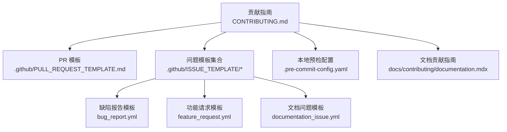
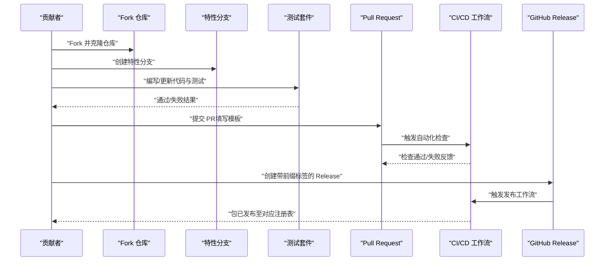
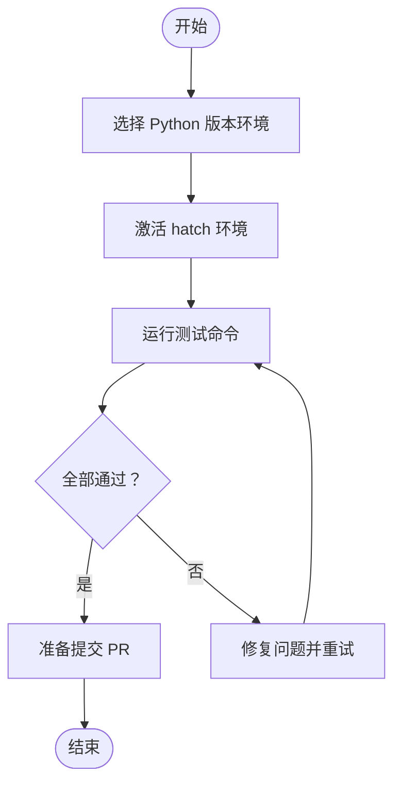
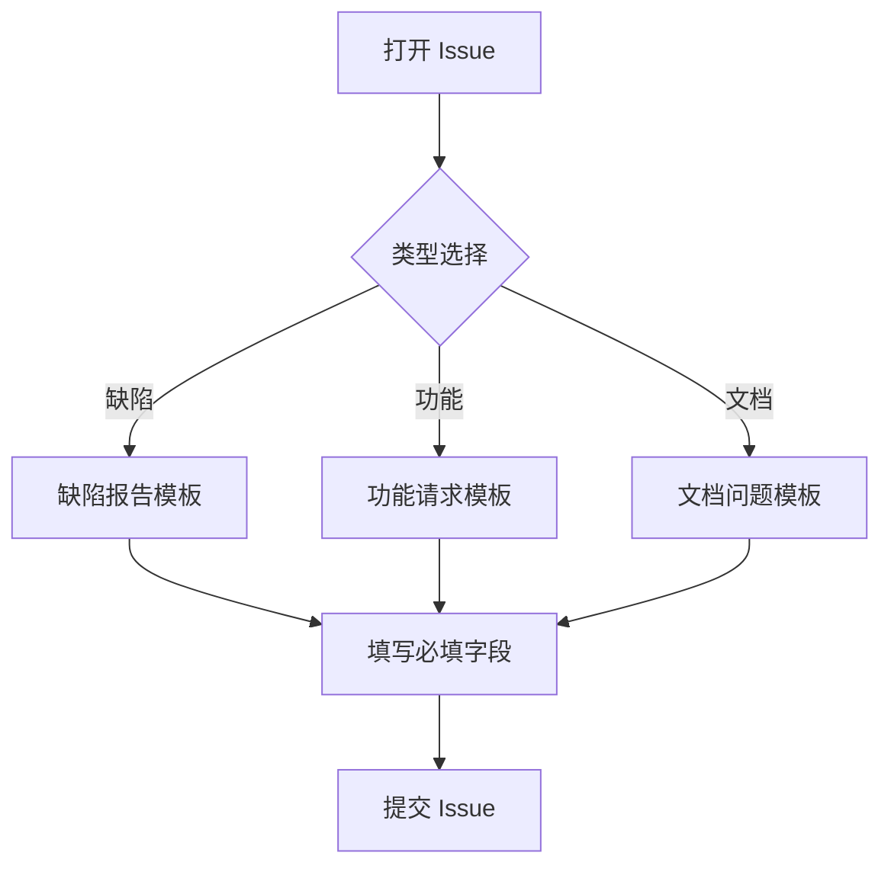
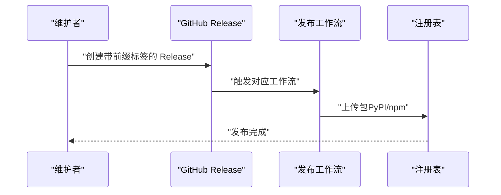
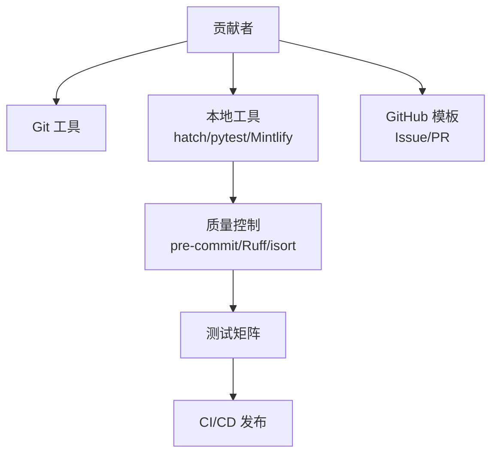

# 贡献指南

<cite>
**本文引用的文件**
- [CONTRIBUTING.md](file://CONTRIBUTING.md)
- [.pre-commit-config.yaml](file://.pre-commit-config.yaml)
- [.github/PULL_REQUEST_TEMPLATE.md](file://.github/PULL_REQUEST_TEMPLATE.md)
- [.github/ISSUE_TEMPLATE/bug_report.yml](file://.github/ISSUE_TEMPLATE/bug_report.yml)
- [.github/ISSUE_TEMPLATE/feature_request.yml](file://.github/ISSUE_TEMPLATE/feature_request.yml)
- [.github/ISSUE_TEMPLATE/documentation_issue.yml](file://.github/ISSUE_TEMPLATE/documentation_issue.yml)
- [docs/contributing/documentation.mdx](file://docs/contributing/documentation.mdx)
</cite>

## 目录
1. 引言
2. 项目结构
3. 核心组件
4. 架构总览
5. 详细组件分析
6. 依赖分析
7. 性能考虑
8. 故障排查指南
9. 结论
10. 附录

## 引言
本指南面向希望参与 Mem0 项目开发与改进的贡献者，覆盖从 Fork 仓库到提交 Pull Request 的完整流程；涵盖开发环境搭建、代码规范、测试要求；提供 Issue 报告标准格式与功能请求模板；说明文档贡献、翻译与社区支持方式；解释治理结构、决策流程与发布周期；并为新贡献者提供入门指导与常见问题解答。

## 项目结构
- 贡献相关的核心入口与模板位于根目录与 .github 目录：
  - 根贡献指南：CONTRIBUTING.md
  - 提交请求模板：.github/PULL_REQUEST_TEMPLATE.md
  - 问题模板：.github/ISSUE_TEMPLATE 下的 bug_report.yml、feature_request.yml、documentation_issue.yml
  - 文档贡献指南：docs/contributing/documentation.mdx
  - 本地预检工具配置：.pre-commit-config.yaml

**图表来源**
- [CONTRIBUTING.md:1-92](file://CONTRIBUTING.md#L1-L92)
- [.github/PULL_REQUEST_TEMPLATE.md:1-39](file://.github/PULL_REQUEST_TEMPLATE.md#L1-L39)
- [.github/ISSUE_TEMPLATE/bug_report.yml:1-56](file://.github/ISSUE_TEMPLATE/bug_report.yml#L1-L56)
- [.github/ISSUE_TEMPLATE/feature_request.yml:1-42](file://.github/ISSUE_TEMPLATE/feature_request.yml#L1-L42)
- [.github/ISSUE_TEMPLATE/documentation_issue.yml:1-24](file://.github/ISSUE_TEMPLATE/documentation_issue.yml#L1-L24)
- [docs/contributing/documentation.mdx:1-57](file://docs/contributing/documentation.mdx#L1-L57)
- [.pre-commit-config.yaml:1-17](file://.pre-commit-config.yaml#L1-L17)

**章节来源**
- [CONTRIBUTING.md:1-92](file://CONTRIBUTING.md#L1-L92)
- [.github/PULL_REQUEST_TEMPLATE.md:1-39](file://.github/PULL_REQUEST_TEMPLATE.md#L1-L39)
- [.github/ISSUE_TEMPLATE/bug_report.yml:1-56](file://.github/ISSUE_TEMPLATE/bug_report.yml#L1-L56)
- [.github/ISSUE_TEMPLATE/feature_request.yml:1-42](file://.github/ISSUE_TEMPLATE/feature_request.yml#L1-L42)
- [.github/ISSUE_TEMPLATE/documentation_issue.yml:1-24](file://.github/ISSUE_TEMPLATE/documentation_issue.yml#L1-L24)
- [docs/contributing/documentation.mdx:1-57](file://docs/contributing/documentation.mdx#L1-L57)
- [.pre-commit-config.yaml:1-17](file://.pre-commit-config.yaml#L1-L17)

## 核心组件
- 提交贡献流程（Fork → 分支 → 提交 → 测试 → PR）
- 开发环境与工具链（hatch、pytest、pre-commit）
- 代码质量与风格（Ruff、isort）
- 测试策略（单元/集成/手动）
- 发布与自动化（GitHub Releases、OIDC 认证）

**章节来源**
- [CONTRIBUTING.md:5-16](file://CONTRIBUTING.md#L5-L16)
- [CONTRIBUTING.md:19-33](file://CONTRIBUTING.md#L19-L33)
- [CONTRIBUTING.md:35-41](file://CONTRIBUTING.md#L35-L41)
- [CONTRIBUTING.md:43-61](file://CONTRIBUTING.md#L43-L61)
- [CONTRIBUTING.md:65-92](file://CONTRIBUTING.md#L65-L92)
- [.pre-commit-config.yaml:1-17](file://.pre-commit-config.yaml#L1-L17)

## 架构总览
下图展示了贡献者在本地进行开发、测试与提交的整体流程，以及与仓库维护与发布的交互关系。

**图表来源**
- [CONTRIBUTING.md:5-16](file://CONTRIBUTING.md#L5-L16)
- [CONTRIBUTING.md:65-92](file://CONTRIBUTING.md#L65-L92)
- [.github/PULL_REQUEST_TEMPLATE.md:1-39](file://.github/PULL_REQUEST_TEMPLATE.md#L1-L39)

## 详细组件分析

### 代码贡献流程
- 步骤
  - Fork 仓库并克隆到本地
  - 基于主干创建特性分支（建议以 feature/* 命名）
  - 修改代码后补充或更新测试
  - 补充文档/示例与必要的 docstring
  - 在本地确保所有测试通过
  - 提交 PR，并按模板填写描述、类型、变更范围、测试覆盖与清单
- 关键要点
  - 所有修改需配套测试
  - 遵循项目风格与规范
  - 使用 PR 模板中的清单项自检

**章节来源**
- [CONTRIBUTING.md:5-16](file://CONTRIBUTING.md#L5-L16)
- [.github/PULL_REQUEST_TEMPLATE.md:1-39](file://.github/PULL_REQUEST_TEMPLATE.md#L1-L39)

### 开发环境与工具链
- 环境管理
  - 使用 hatch 管理多 Python 版本环境（3.9/3.10/3.11/3.12）
  - 激活目标环境后运行测试命令
- 测试执行
  - 支持默认版本与指定版本的测试矩阵
  - 在 hatch 环境中直接运行测试
- 本地预检
  - 安装并启用 pre-commit
  - 自动化执行 Ruff 修复与 isort 排序

**图表来源**
- [CONTRIBUTING.md:19-33](file://CONTRIBUTING.md#L19-L33)
- [CONTRIBUTING.md:43-59](file://CONTRIBUTING.md#L43-L59)
- [.pre-commit-config.yaml:1-17](file://.pre-commit-config.yaml#L1-L17)

**章节来源**
- [CONTRIBUTING.md:19-33](file://CONTRIBUTING.md#L19-L33)
- [CONTRIBUTING.md:35-41](file://CONTRIBUTING.md#L35-L41)
- [CONTRIBUTING.md:43-59](file://CONTRIBUTING.md#L43-L59)
- [.pre-commit-config.yaml:1-17](file://.pre-commit-config.yaml#L1-L17)

### 代码规范与风格
- 本地钩子
  - Ruff：自动检查并修复 Python 代码风格问题
  - isort：按配置对导入排序
- 建议实践
  - 在提交前运行 pre-commit，确保一致的风格
  - 遵循项目现有模块组织与命名约定

**章节来源**
- [.pre-commit-config.yaml:1-17](file://.pre-commit-config.yaml#L1-L17)

### 测试要求
- 覆盖范围
  - 单元测试：针对函数/类的最小可测单元
  - 集成测试：跨模块协作场景
  - 手动测试：必要时进行端到端验证
- 质量门禁
  - 所有受支持的 Python 版本均需通过测试
  - PR 中需勾选测试覆盖选项并提供测试证据或 CI 链接

**章节来源**
- [CONTRIBUTING.md:43-61](file://CONTRIBUTING.md#L43-L61)
- [.github/PULL_REQUEST_TEMPLATE.md:23-31](file://.github/PULL_REQUEST_TEMPLATE.md#L23-L31)

### Issue 报告与功能请求模板
- 缺陷报告（Bug Report）
  - 必填字段：受影响组件、复现步骤、期望行为、实际行为、环境信息
  - 建议包含最小可复现实例与错误堆栈
- 功能请求（Feature Request）
  - 必填字段：受影响组件、使用场景、期望方案、替代方案
  - 可附 API 示例或伪代码
- 文档问题（Documentation Issue）
  - 必填字段：文档页面链接、问题描述、改进建议

**图表来源**
- [.github/ISSUE_TEMPLATE/bug_report.yml:1-56](file://.github/ISSUE_TEMPLATE/bug_report.yml#L1-L56)
- [.github/ISSUE_TEMPLATE/feature_request.yml:1-42](file://.github/ISSUE_TEMPLATE/feature_request.yml#L1-L42)
- [.github/ISSUE_TEMPLATE/documentation_issue.yml:1-24](file://.github/ISSUE_TEMPLATE/documentation_issue.yml#L1-L24)

**章节来源**
- [.github/ISSUE_TEMPLATE/bug_report.yml:1-56](file://.github/ISSUE_TEMPLATE/bug_report.yml#L1-L56)
- [.github/ISSUE_TEMPLATE/feature_request.yml:1-42](file://.github/ISSUE_TEMPLATE/feature_request.yml#L1-L42)
- [.github/ISSUE_TEMPLATE/documentation_issue.yml:1-24](file://.github/ISSUE_TEMPLATE/documentation_issue.yml#L1-L24)

### 文档贡献与本地预览
- 前置条件
  - 安装 Node.js（推荐 23.6.0+）
- 设置与启动
  - 全局安装 Mintlify
  - 在 docs/ 目录下运行开发服务器，默认端口 3000
  - 如需更换端口，使用 --port 参数
- 贡献流程
  - 修改文档内容并预览
  - 提交 PR 并在评论中说明改动点

**章节来源**
- [docs/contributing/documentation.mdx:1-57](file://docs/contributing/documentation.mdx#L1-L57)

### 发布与自动化
- 触发条件
  - 创建带前缀标签的 GitHub Release
- 包与前缀映射
  - Python SDK（PyPI）：v*
  - Python CLI（PyPI）：cli-v*
  - TypeScript SDK（npm）：ts-v*
  - Node CLI（npm）：cli-node-v*
  - Vercel AI Provider（npm）：vercel-ai-v*
  - OpenClaw 集成（npm）：openclaw-v*
- 发布细节
  - PyPI 使用 OIDC 受信任发布
  - npm 使用 OIDC 受信任发布（无需令牌）
  - 所有工作流需要写入 ID 令牌权限
  - 新 npm 包首次发布需手动，后续版本由 OIDC 自动处理

**图表来源**
- [CONTRIBUTING.md:65-92](file://CONTRIBUTING.md#L65-L92)

**章节来源**
- [CONTRIBUTING.md:65-92](file://CONTRIBUTING.md#L65-L92)

## 依赖分析
- 贡献流程依赖
  - Git 工作流（Fork/分支/PR）
  - 本地工具（hatch、pytest、pre-commit、Mintlify）
  - GitHub 模板（Issue/PR 模板）
- 质量保障依赖
  - pre-commit 钩子（Ruff、isort）
  - 测试矩阵（多 Python 版本）
  - CI/CD（发布工作流）

**图表来源**
- [CONTRIBUTING.md:19-33](file://CONTRIBUTING.md#L19-L33)
- [CONTRIBUTING.md:35-41](file://CONTRIBUTING.md#L35-L41)
- [CONTRIBUTING.md:43-59](file://CONTRIBUTING.md#L43-L59)
- [docs/contributing/documentation.mdx:15-41](file://docs/contributing/documentation.mdx#L15-L41)
- [.pre-commit-config.yaml:1-17](file://.pre-commit-config.yaml#L1-L17)

**章节来源**
- [CONTRIBUTING.md:19-33](file://CONTRIBUTING.md#L19-L33)
- [CONTRIBUTING.md:35-41](file://CONTRIBUTING.md#L35-L41)
- [CONTRIBUTING.md:43-59](file://CONTRIBUTING.md#L43-L59)
- [docs/contributing/documentation.mdx:15-41](file://docs/contributing/documentation.mdx#L15-L41)
- [.pre-commit-config.yaml:1-17](file://.pre-commit-config.yaml#L1-L17)

## 性能考虑
- 本地性能
  - 使用 hatch 为不同 Python 版本隔离环境，避免依赖冲突
  - 在本地启用 pre-commit，减少 CI 失败与重试成本
- 测试效率
  - 利用测试矩阵并行验证多版本兼容性
  - 将耗时测试拆分为单元与集成层级，缩短反馈周期
- 发布效率
  - 通过 OIDC 自动化发布，减少人工干预与出错概率

## 故障排查指南
- 提交前检查清单
  - 是否已在特性分支上进行修改
  - 是否补充了测试并确保通过
  - 是否按模板填写 PR 描述与清单
  - 是否安装并运行了 pre-commit
- 常见问题
  - 测试未通过：确认是否覆盖所有受支持的 Python 版本；查看 CI 日志定位失败用例
  - 风格不一致：运行 pre-commit 钩子自动修复
  - 发布失败：核对标签前缀与对应包名是否匹配；检查工作流权限设置

**章节来源**
- [CONTRIBUTING.md:5-16](file://CONTRIBUTING.md#L5-L16)
- [CONTRIBUTING.md:35-41](file://CONTRIBUTING.md#L35-L41)
- [CONTRIBUTING.md:43-61](file://CONTRIBUTING.md#L43-L61)
- [CONTRIBUTING.md:65-92](file://CONTRIBUTING.md#L65-L92)

## 结论
通过遵循本指南，贡献者可以高效地参与 Mem0 的开发与改进。请始终以 Issue/PR 模板为依据，确保代码质量与文档一致性，并利用自动化工具与工作流提升协作效率。我们期待您的贡献！

## 附录
- 新贡献者入门建议
  - 先阅读贡献指南与文档贡献指南
  - 从文档或小缺陷入手，逐步熟悉流程
  - 在讨论区或 Issue 中寻求帮助与反馈
- 社区支持渠道
  - 通过 GitHub Issues/PR 参与讨论
  - 关注发布日志与变更说明，及时升级