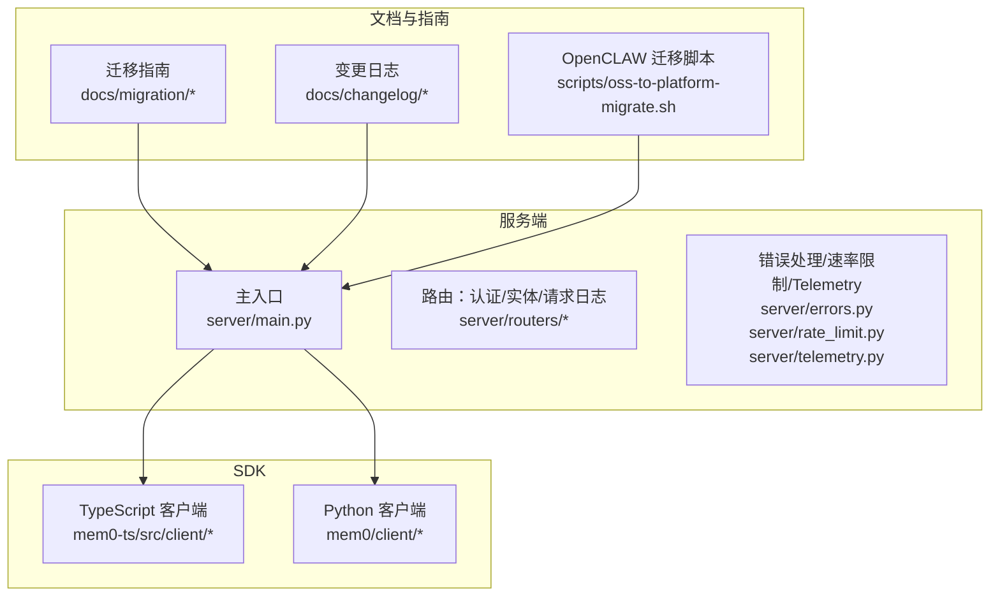
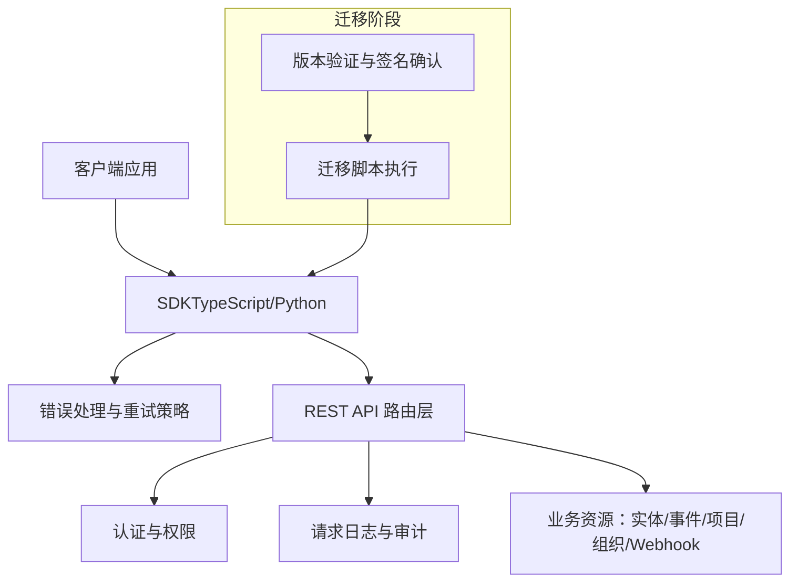
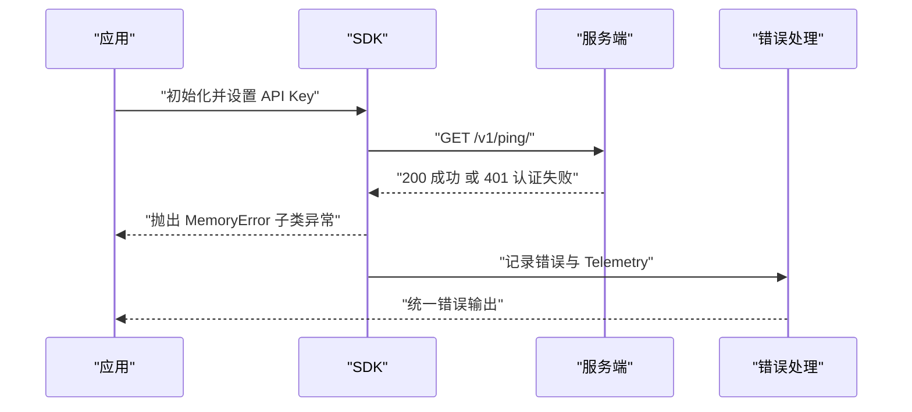
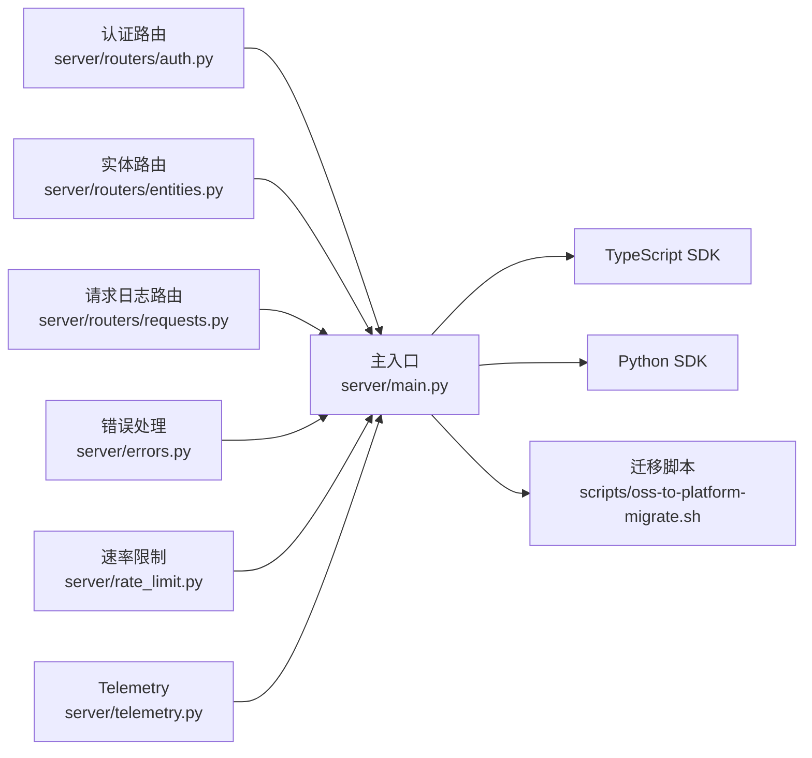

# API 变更迁移

<cite>
**本文引用的文件**
- [CLI 规格](file://cli/CLI_SPECIFICATION.md)
- [OpenCLAW 迁移脚本](file://scripts/oss-to-platform-migrate.sh)
- [TypeScript 初始化集成测试](file://mem0-ts/src/client/tests/integration/initialization.test.ts)
- [OpenAI 兼容性特性](file://docs/open-source/features/openai_compatibility.mdx)
- [REST API 特性](file://docs/open-source/features/rest-api.mdx)
- [API 变更迁移指南](file://docs/migration/api-changes.mdx)
- [OSS 到平台迁移指南](file://docs/migration/oss-to-platform.mdx)
- [OSS v2 到 v3 迁移指南](file://docs/migration/oss-v2-to-v3.mdx)
- [平台 v2 到 v3 迁移指南](file://docs/migration/platform-v2-to-v3.mdx)
- [服务器 PGVector 升级迁移](file://docs/migration/server-pgvector-upgrade.mdx)
- [SDK 变更亮点](file://docs/changelog/sdk.mdx)
- [高亮变更日志](file://docs/changelog/highlights.mdx)
- [导出记忆食谱](file://docs/cookbooks/essentials/exporting-memories.mdx)
- [类型定义](file://mem0-ts/src/common/types.ts)
- [内存客户端（TypeScript）](file://mem0-ts/src/client/memory.ts)
- [实体客户端（TypeScript）](file://mem0-ts/src/client/entity.ts)
- [事件客户端（TypeScript）](file://mem0-ts/src/client/event.ts)
- [项目客户端（TypeScript）](file://mem0-ts/src/client/project.ts)
- [组织客户端（TypeScript）](file://mem0-ts/src/client/organization.ts)
- [Webhook 客户端（TypeScript）](file://mem0-ts/src/client/webhook.ts)
- [Python 客户端主模块](file://mem0/client/main.py)
- [Python 项目客户端](file://mem0/client/project.py)
- [Python 类型定义](file://mem0/client/types.py)
- [Python 工具与实用函数](file://mem0/client/utils.py)
- [服务端主入口](file://server/main.py)
- [服务端路由：认证](file://server/routers/auth.py)
- [服务端路由：实体](file://server/routers/entities.py)
- [服务端路由：请求日志](file://server/routers/requests.py)
- [服务端错误处理](file://server/errors.py)
- [服务端模式与架构](file://server/models.py)
- [服务端架构与状态](file://server/server_state.py)
- [服务端速率限制](file://server/rate_limit.py)
- [服务端 Telemetry](file://server/telemetry.py)
- [服务端数据库初始化脚本](file://server/init-db.sh)
- [服务端 Alembic 迁移](file://server/alembic/env.py)
- [服务端 Alembic 迁移版本](file://server/alembic/versions/)
- [服务端 Docker 配置](file://server/docker-compose.yaml)
- [服务端仪表盘 Dockerfile](file://server/Dockerfile)
- [服务端仪表盘开发 Dockerfile](file://server/dev.Dockerfile)
- [服务端仪表盘应用](file://server/dashboard/app/)
- [服务端仪表盘组件](file://server/dashboard/components/)
- [服务端仪表盘存储](file://server/dashboard/store/)
- [服务端仪表盘样式](file://server/dashboard/styles/)
- [服务端仪表盘入口](file://server/dashboard/entrypoint.sh)
- [服务端仪表盘环境配置](file://server/dashboard/next.config.mjs)
- [服务端仪表盘 Tailwind 配置](file://server/dashboard/tailwind.config.ts)
- [服务端仪表盘 TS 配置](file://server/dashboard/tsconfig.json)
- [服务端仪表盘包管理](file://server/dashboard/package.json)
- [服务端仪表盘 PNPM 工作区](file://server/dashboard/pnpm-workspace.yaml)
- [服务端仪表盘 PostCSS 配置](file://server/dashboard/postcss.config.js)
- [服务端仪表盘 Docker 忽略](file://server/dashboard/.dockerignore)
- [服务端仪表盘组件清单](file://server/dashboard/components.json)
- [服务端仪表盘入口点](file://server/dashboard/entrypoint.sh)
- [服务端仪表盘 Next 环境变量](file://server/dashboard/next-env.d.ts)
- [服务端仪表盘构建配置](file://server/dashboard/next.config.dev.mjs)
- [服务端仪表盘包管理](file://server/dashboard/package.json)
- [服务端仪表盘 PNPM 锁定](file://server/dashboard/pnpm-lock.yaml)
- [服务端仪表盘 PNPM 工作区](file://server/dashboard/pnpm-workspace.yaml)
- [服务端仪表盘 PostCSS 配置](file://server/dashboard/postcss.config.js)
- [服务端仪表版 Tailwind 配置](file://server/dashboard/tailwind.config.ts)
- [服务端仪表版 TS 配置](file://server/dashboard/tsconfig.json)
- [服务端仪表版 Docker 忽略](file://server/dashboard/.dockerignore)
- [服务端仪表版组件清单](file://server/dashboard/components.json)
- [服务端仪表版入口点](file://server/dashboard/entrypoint.sh)
- [服务端仪表版 Next 环境变量](file://server/dashboard/next-env.d.ts)
- [服务端仪表版构建配置](file://server/dashboard/next.config.dev.mjs)
- [服务端仪表版包管理](file://server/dashboard/package.json)
- [服务端仪表版 PNPM 锁定](file://server/dashboard/pnpm-lock.yaml)
- [服务端仪表版 PNPM 工作区](file://server/dashboard/pnpm-workspace.yaml)
- [服务端仪表版 PostCSS 配置](file://server/dashboard/postcss.config.js)
- [服务端仪表版 Tailwind 配置](file://server/dashboard/tailwind.config.ts)
- [服务端仪表版 TS 配置](file://server/dashboard/tsconfig.json)
- [服务端仪表版 Docker 忽略](file://server/dashboard/.dockerignore)
- [服务端仪表版组件清单](file://server/dashboard/components.json)
- [服务端仪表版入口点](file://server/dashboard/entrypoint.sh)
- [服务端仪表版 Next 环境变量](file://server/dashboard/next-env.d.ts)
- [服务端仪表版构建配置](file://server/dashboard/next.config.dev.mjs)
- [服务端仪表版包管理](file://server/dashboard/package.json)
- [服务端仪表版 PNPM 锁定](file://server/dashboard/pnpm-lock.yaml)
- [服务端仪表版 PNPM 工作区](file://server/dashboard/pnpm-workspace.yaml)
- [服务端仪表版 PostCSS 配置](file://server/dashboard/postcss.config.js)
- [服务端仪表版 Tailwind 配置](file://server/dashboard/tailwind.config.ts)
- [服务端仪表版 TS 配置](file://server/dashboard/tsconfig.json)
- [服务端仪表版 Docker 忽略](file://server/dashboard/.dockerignore)
- [服务端仪表版组件清单](file://server/dashboard/components.json)
- [服务端仪表版入口点](file://server/dashboard/entrypoint.sh)
- [服务端仪表版 Next 环境变量](file://server/dashboard/next-env.d.ts)
- [服务端仪表版构建配置](file://server/dashboard/next.config.dev.mjs)
- [服务端仪表版包管理](file://server/dashboard/package.json)
- [服务端仪表版 PNPM 锁定](file://server/dashboard/pnpm-lock.yaml)
- [服务端仪表版 PNPM 工作区](file://server/dashboard/pnpm-workspace.yaml)
- [服务端仪表版 PostCSS 配置](file://server/dashboard/postcss.config.js)
- [服务端仪表版 Tailwind 配置](file://server/dashboard/tailwind.config.ts)
- [服务端仪表版 TS 配置](file://server/dashboard/tsconfig.json)
- [服务端仪表版 Docker 忽略](file://server/dashboard/.dockerignore)
- [服务端仪表版组件清单](file://server/dashboard/components.json)
- [服务端仪表版入口点](file://server/dashboard/entrypoint.sh)
- [服务端仪表版 Next 环境变量](file://server/dashboard/next-env.d.ts)
- [服务端仪表版构建配置](file://server/dashboard/next.config.dev.mjs)
- [服务端仪表版包管理](file://server/dashboard/package.json)
- [服务端仪表版 PNPM 锁定](file://server/dashboard/pnpm-lock.yaml)
- [服务端仪表版 PNPM 工作区](file://server/dashboard/pnpm-workspace.yaml)
- [服务端仪表版 PostCSS 配置](file://server/dashboard/postcss.config.js)
- [服务端仪表版 Tailwind 配置](file://server/dashboard/tailwind.config.ts)
- [服务端仪表版 TS 配置](file://server/dashboard/tsconfig.json)
- [服务端仪表版 Docker 忽略](file://server/dashboard/.dockerignore)
- [服务端仪表版组件清单](file://server/dashboard/components.json)
- [服务端仪表版入口点](file://server/dashboard/entrypoint.sh)
- [服务端仪表版 Next 环境变量](file://server/dashboard/next-env.d.ts)
- [服务端仪表版构建配置](file://server/dashboard/next.config.dev.mjs)
- [服务端仪表版包管理](file://server/dashboard/package.json)
- [服务端仪表版 PNPM 锁定](file://server/dashboard/pnpm-lock.yaml)
- [服务端仪表版 PNPM 工作区](file://server/dashboard/pnpm-workspace.yaml)
- [服务端仪表版 PostCSS 配置](file://server/dashboard/postcss.config.js)
- [服务端仪表版 Tailwind 配置](file://server/dashboard/tailwind.config.ts)
- [服务端仪表版 TS 配置](file://server/dashboard/tsconfig.json)
- [服务端仪表版 Docker 忽略](file://server/dashboard/.dockerignore)
- [服务端仪表版组件清单](file://server/dashboard/components.json)
- [服务端仪表版入口点](file://server/dashboard/entrypoint.sh)
- [服务端仪表版 Next 环境变量](file://server/dashboard/next-env.d.ts)
- [服务端仪表版构建配置](file://server/dashboard/next.config.dev.mjs)
- [服务端仪表版包管理](file://server/dashboard/package.json)
- [服务端仪表版 PNPM 锁定](file://server/dashboard/pnpm-lock.yaml)
- [服务端仪表版 PNPM 工作区](file://server/dashboard/pnpm-workspace.yaml)
- [服务端仪表版 PostCSS 配置](file://server/dashboard/postcss.config.js)
- [服务端仪表版 Tailwind 配置](file://server/dashboard/tailwind.config.ts)
- [服务端仪表版 TS 配置](file://server/dashboard/tsconfig.json)
- [服务端仪表版 Docker 忽略](file://server/dashboard/.dockerignore)
- [服务端仪表版组件清单](file://server/dashboard/components.json)
- [服务端仪表版入口点](file://server/dashboard/entrypoint.sh)
- [服务端仪表版 Next 环境变量](file://server/dashboard/next-env.d.ts)
- [服务端仪表版构建配置](file://server/dashboard/next.config.dev.mjs)
- [服务端仪表版包管理](file://server/dashboard/package.json)
- [服务端仪表版 PNPM 锁定](file://server/dashboard......)
</cite>

## 目录
1. 引言
2. 项目结构
3. 核心组件
4. 架构总览
5. 详细组件分析
6. 依赖关系分析
7. 性能考量
8. 故障排查指南
9. 结论
10. 附录

## 引言
本指南面向需要从旧版 Mem0 平台或 OSS 版本迁移到新版平台或 SDK 的用户，系统梳理 API 的演进历程、重大变更点、端点映射、请求/响应格式变化、错误码与错误处理机制，并提供客户端 SDK 的适配步骤与向后兼容策略。文档同时给出迁移路径与工具，帮助在最小中断的前提下完成升级。

## 项目结构
Mem0 仓库包含多语言 SDK、服务端、仪表盘、迁移脚本与大量文档。与 API 迁移直接相关的部分包括：
- 文档与迁移指南：docs/migration、docs/changelog、docs/open-source/features
- CLI 规格与迁移脚本：cli/CLI_SPECIFICATION.md、scripts/oss-to-platform-migrate.sh
- 服务端与路由：server/main.py、server/routers/*
- Python SDK：mem0/client/*
- TypeScript SDK：mem0-ts/src/client/*

**图表来源**
- [服务端主入口](file://server/main.py)
- [服务端路由：认证](file://server/routers/auth.py)
- [服务端路由：实体](file://server/routers/entities.py)
- [服务端路由：请求日志](file://server/routers/requests.py)
- [OpenCLAW 迁移脚本](file://scripts/oss-to-platform-migrate.sh)
- [API 变更迁移指南](file://docs/migration/api-changes.mdx)
- [SDK 变更亮点](file://docs/changelog/sdk.mdx)

**章节来源**
- [服务端主入口](file://server/main.py)
- [OpenCLAW 迁移脚本](file://scripts/oss-to-platform-migrate.sh)
- [API 变更迁移指南](file://docs/migration/api-changes.mdx)
- [SDK 变更亮点](file://docs/changelog/sdk.mdx)

## 核心组件
- 服务端 API：提供认证、API Key 管理、请求日志、实体与事件等 REST 接口；支持 JWT 认证与速率限制。
- CLI 规格：定义了当前版本的端点路径、方法与参数，是对接新 API 的权威参考。
- 迁移脚本：自动化验证 API Key、Ping 检测与账户邮箱校验，辅助 OSS 到平台迁移。
- SDK：TypeScript 与 Python 提供统一的客户端封装，包含错误类型与初始化流程。

**章节来源**
- [REST API 特性](file://docs/open-source/features/rest-api.mdx)
- [CLI 规格](file://cli/CLI_SPECIFICATION.md)
- [OpenCLAW 迁移脚本](file://scripts/oss-to-platform-migrate.sh)
- [TypeScript 初始化集成测试](file://mem0-ts/src/client/tests/integration/initialization.test.ts)

## 架构总览
下图展示了客户端、SDK 与服务端之间的交互关系，以及迁移阶段的关键节点。

**图表来源**
- [服务端主入口](file://server/main.py)
- [服务端路由：认证](file://server/routers/auth.py)
- [服务端路由：请求日志](file://server/routers/requests.py)
- [OpenCLAW 迁移脚本](file://scripts/oss-to-platform-migrate.sh)
- [TypeScript 初始化集成测试](file://mem0-ts/src/client/tests/integration/initialization.test.ts)

## 详细组件分析

### 1) API 端点映射与变更
- 当前端点参考以 CLI 规格为准，包含 v1 与 v2 的路径差异，以及分页参数等细节。
- 迁移指南中记录了 OSS → 平台、OSS v2→v3、平台 v2→v3 的重大变更与注意事项。
- 变更日志中提及了搜索默认值、废弃参数、图内存移除等破坏性改动。

建议迁移步骤：
- 使用 CLI 规格核对当前 SDK/客户端使用的端点与路径。
- 对照迁移指南逐项检查是否涉及废弃或重命名的接口。
- 在灰度环境中先进行端点替换与参数调整，再全量切换。

**章节来源**
- [CLI 规格](file://cli/CLI_SPECIFICATION.md)
- [API 变更迁移指南](file://docs/migration/api-changes.mdx)
- [OSS v2 到 v3 迁移指南](file://docs/migration/oss-v2-to-v3.mdx)
- [平台 v2 到 v3 迁移指南](file://docs/migration/platform-v2-to-v3.mdx)
- [高亮变更日志](file://docs/changelog/highlights.mdx)

### 2) 请求/响应格式与参数调整
- 分页参数：列表类接口支持 page/page_size 查询参数。
- 身份认证：支持 JWT 与 API Key（Token 方案），需在 Authorization 头中携带。
- 请求日志：提供最近调用日志查询接口，便于审计与排障。
- OpenAI 兼容性：在兼容层中对参数与返回格式做了适配，便于从 OpenAI 生态迁移。

迁移要点：
- 统一鉴权头格式，确保 Authorization 值为 Token <API_KEY>。
- 对于列表接口，按 page/page_size 参数进行分页迭代。
- 若使用 OpenAI 兼容层，请对照兼容文档中的参数映射。

**章节来源**
- [REST API 特性](file://docs/open-source/features/rest-api.mdx)
- [OpenAI 兼容性特性](file://docs/open-source/features/openai_compatibility.mdx)
- [CLI 规格](file://cli/CLI_SPECIFICATION.md)

### 3) 错误码与错误处理机制
- SDK 层：所有异常应为 MemoryError 子类，便于统一捕获与处理。
- 服务端：错误处理集中于 server/errors.py，结合速率限制与 Telemetry 支持可观测性。
- 迁移脚本：对 401 等状态码进行明确区分，提示无效或过期的 API Key。

最佳实践：
- 在 SDK 初始化时进行 ping 校验，尽早暴露认证问题。
- 对网络异常与 4xx/5xx 做幂等重试与退避策略。
- 使用请求日志接口定位问题，保留必要的上下文信息。

**图表来源**
- [OpenCLAW 迁移脚本](file://scripts/oss-to-platform-migrate.sh)
- [TypeScript 初始化集成测试](file://mem0-ts/src/client/tests/integration/initialization.test.ts)
- [服务端错误处理](file://server/errors.py)
- [服务端 Telemetry](file://server/telemetry.py)

**章节来源**
- [TypeScript 初始化集成测试](file://mem0-ts/src/client/tests/integration/initialization.test.ts)
- [OpenCLAW 迁移脚本](file://scripts/oss-to-platform-migrate.sh)
- [服务端错误处理](file://server/errors.py)
- [服务端 Telemetry](file://server/telemetry.py)

### 4) 客户端 SDK 更新与适配
- TypeScript SDK：通过 src/client/* 下的模块化客户端封装资源操作，统一错误类型与初始化流程。
- Python SDK：通过 mem0/client/* 提供内存、项目、实体、事件等资源的高层封装。
- 迁移技能文档强调“先验证真实签名，再映射”，避免因版本漂移导致的不一致。

适配步骤：
- 使用官方工具或源码 inspect 获取已安装 SDK 的实际签名与默认值。
- 对比 OSS 与平台侧的导出差异，修正参数命名与默认行为。
- 在本地与 CI 中运行端到端测试，覆盖新增/废弃/重命名的接口。

**章节来源**
- [类型定义](file://mem0-ts/src/common/types.ts)
- [内存客户端（TypeScript）](file://mem0-ts/src/client/memory.ts)
- [实体客户端（TypeScript）](file://mem0-ts/src/client/entity.ts)
- [事件客户端（TypeScript）](file://mem0-ts/src/client/event.ts)
- [项目客户端（TypeScript）](file://mem0-ts/src/client/project.ts)
- [组织客户端（TypeScript）](file://mem0-ts/src/client/organization.ts)
- [Webhook 客户端（TypeScript）](file://mem0-ts/src/client/webhook.ts)
- [Python 客户端主模块](file://mem0/client/main.py)
- [Python 项目客户端](file://mem0/client/project.py)
- [Python 类型定义](file://mem0/client/types.py)
- [Python 工具与实用函数](file://mem0/client/utils.py)
- [skills/mem0-oss-to-platform/SKILL.md](file://skills/mem0-oss-to-platform/SKILL.md)

### 5) 向后兼容性与数据可移植性
- 导出记忆：提供结构化导出能力，便于合规与迁移场景的数据提取。
- 迁移脚本：自动检测 API Key、Ping 校验与账户邮箱规范化，降低迁移风险。
- 变更日志：记录破坏性变更与修复，指导回滚与补丁策略。

建议：
- 在迁移前导出全部记忆与元数据，形成离线备份。
- 使用迁移脚本进行预检，确保 API Key 有效且账户状态正常。
- 对关键接口进行灰度发布，逐步替换端点与参数。

**章节来源**
- [导出记忆食谱](file://docs/cookbooks/essentials/exporting-memories.mdx)
- [OpenCLAW 迁移脚本](file://scripts/oss-to-platform-migrate.sh)
- [SDK 变更亮点](file://docs/changelog/sdk.mdx)

## 依赖关系分析
下图展示服务端路由与核心模块之间的依赖关系，以及迁移脚本与 SDK 的交互。

**图表来源**
- [服务端主入口](file://server/main.py)
- [服务端路由：认证](file://server/routers/auth.py)
- [服务端路由：实体](file://server/routers/entities.py)
- [服务端路由：请求日志](file://server/routers/requests.py)
- [服务端错误处理](file://server/errors.py)
- [服务端速率限制](file://server/rate_limit.py)
- [服务端 Telemetry](file://server/telemetry.py)
- [OpenCLAW 迁移脚本](file://scripts/oss-to-platform-migrate.sh)

**章节来源**
- [服务端主入口](file://server/main.py)
- [服务端路由：认证](file://server/routers/auth.py)
- [服务端路由：实体](file://server/routers/entities.py)
- [服务端路由：请求日志](file://server/routers/requests.py)
- [服务端错误处理](file://server/errors.py)
- [服务端速率限制](file://server/rate_limit.py)
- [服务端 Telemetry](file://server/telemetry.py)
- [OpenCLAW 迁移脚本](file://scripts/oss-to-platform-migrate.sh)

## 性能考量
- 速率限制：服务端实现速率限制，建议客户端在高频调用场景中增加指数退避与队列控制。
- 请求日志：合理使用请求日志接口进行性能观测与瓶颈定位。
- Telemetry：开启 Telemetry 有助于识别慢调用与异常峰值。

[本节为通用建议，无需特定文件引用]

## 故障排查指南
常见问题与处理：
- 认证失败（401）：检查 API Key 是否正确、是否过期；使用迁移脚本的 ping 校验快速定位。
- 端点路径不匹配：对照 CLI 规格，确认 v1/v2 路径差异与参数位置。
- SDK 初始化异常：确保在 SDK 初始化阶段进行 ping 校验，捕获 MemoryError 子类异常。
- 请求日志缺失：确认路由权限与日志级别配置，必要时联系管理员查看服务端日志。

**章节来源**
- [OpenCLAW 迁移脚本](file://scripts/oss-to-platform-migrate.sh)
- [TypeScript 初始化集成测试](file://mem0-ts/src/client/tests/integration/initialization.test.ts)
- [服务端错误处理](file://server/errors.py)
- [服务端 Telemetry](file://server/telemetry.py)

## 结论
API 变更迁移需要以“先验证、后映射、再灰度”的策略推进。借助 CLI 规格、迁移脚本与 SDK 的统一错误模型，可以在保障稳定性的同时高效完成升级。建议在迁移前后做好数据导出与回滚预案，确保业务连续性。

[本节为总结，无需特定文件引用]

## 附录

### A. 端点与参数速查（基于 CLI 规格）
- 内存相关：新增、搜索、获取、列表、更新、删除、批量删除、历史、反馈、导出创建/获取
- 实体相关：列表、删除
- 事件相关：列表、获取
- 基础设施：Ping（健康检查）

注意：具体路径与参数请以 CLI 规格为准，避免与旧文档或第三方示例混淆。

**章节来源**
- [CLI 规格](file://cli/CLI_SPECIFICATION.md)

### B. 迁移路径与工具
- 使用迁移脚本进行 API Key 校验与账户邮箱规范化。
- 在灰度环境中替换端点与参数，逐步扩大范围。
- 对照迁移指南与变更日志，处理破坏性变更与修复。

**章节来源**
- [OpenCLAW 迁移脚本](file://scripts/oss-to-platform-migrate.sh)
- [OSS 到平台迁移指南](file://docs/migration/oss-to-platform.mdx)
- [OSS v2 到 v3 迁移指南](file://docs/migration/oss-v2-to-v3.mdx)
- [平台 v2 到 v3 迁移指南](file://docs/migration/platform-v2-to-v3.mdx)
- [SDK 变更亮点](file://docs/changelog/sdk.mdx)