# OSS 版本到平台版本迁移

<cite>
**本文档引用的文件**
- [oss-to-platform-migrate.sh](file://scripts/oss-to-platform-migrate.sh)
- [oss-to-platform.mdx](file://docs/migration/oss-to-platform.mdx)
- [main.py](file://mem0/client/main.py)
- [main.py](file://server/main.py)
- [main.py](file://openmemory/api/main.py)
- [export_openmemory.sh](file://openmemory/backup-scripts/export_openmemory.sh)
- [pyproject.toml](file://pyproject.toml)
- [package.json](file://mem0-ts/package.json)
- [pyproject.toml](file://cli/python/pyproject.toml)
- [platform-vs-oss.mdx](file://docs/platform/platform-vs-oss.mdx)
- [test_oss_to_platform_migrate.py](file://tests/test_oss_to_platform_migrate.py)
</cite>

## 目录
1. [简介](#简介)
2. [项目结构](#项目结构)
3. [核心组件](#核心组件)
4. [架构概览](#架构概览)
5. [详细组件分析](#详细组件分析)
6. [依赖关系分析](#依赖关系分析)
7. [性能考虑](#性能考虑)
8. [故障排除指南](#故障排除指南)
9. [结论](#结论)
10. [附录](#附录)

## 简介

本文档提供了从 Mem0 开源版本（OSS）迁移到 Mem0 平台版本的完整指南。Mem0 是一个为 AI 代理提供长期记忆的系统，支持托管基础设施和高级功能。

### 平台版本与开源版本的主要区别

| 方面 | 平台版本 | 开源版本 |
|------|----------|----------|
| **部署模式** | 托管服务，无需基础设施管理 | 自托管，需要管理向量数据库和 LLM 提供商 |
| **启动时间** | 5 分钟内可用 | 需要 15-30 分钟进行配置 |
| **维护** | 完全由 Mem0 管理 | 需要自行维护 |
| **扩展性** | 自动扩展，高可用性内置 | 需要手动设置 |
| **高级功能** | Webhooks、内存导出、自定义分类等 | 基础功能 |
| **成本结构** | 按使用付费 | 需要支付基础设施费用 |

## 项目结构

Mem0 项目采用模块化设计，包含多个关键组件：

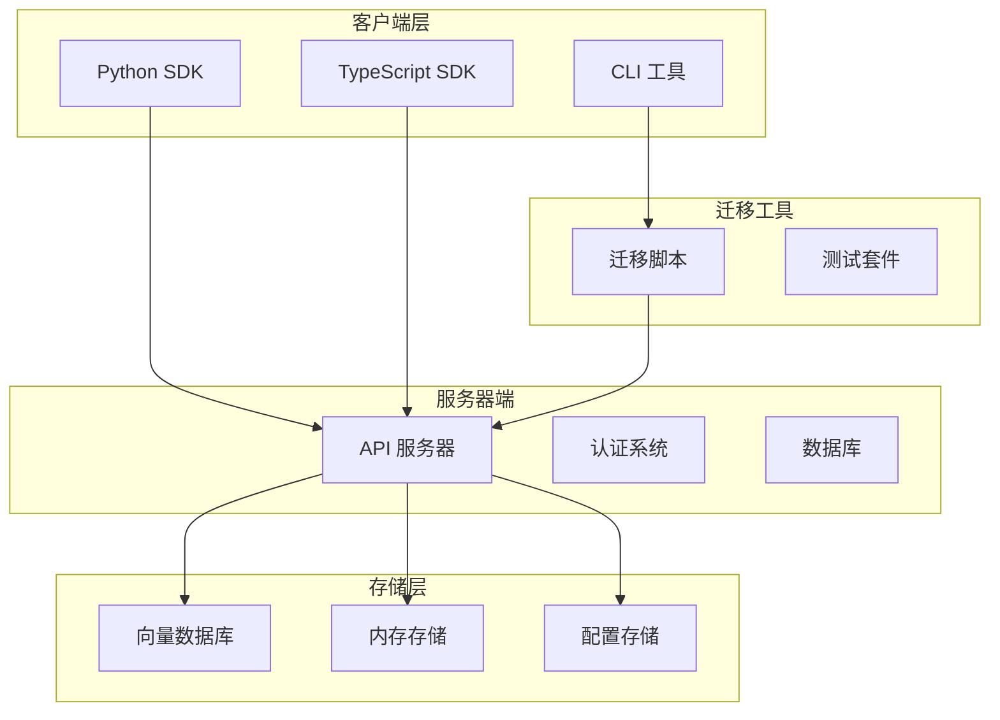

**图表来源**
- [main.py:71-148](file://mem0/client/main.py#L71-L148)
- [main.py:144-171](file://server/main.py#L144-L171)
- [oss-to-platform-migrate.sh:9-33](file://scripts/oss-to-platform-migrate.sh#L9-L33)

**章节来源**
- [pyproject.toml:1-160](file://pyproject.toml#L1-L160)
- [package.json:1-162](file://mem0-ts/package.json#L1-L162)
- [pyproject.toml:1-78](file://cli/python/pyproject.toml#L1-L78)

## 核心组件

### 迁移脚本组件

迁移脚本是整个迁移过程的核心，提供了完整的自动化迁移流程：

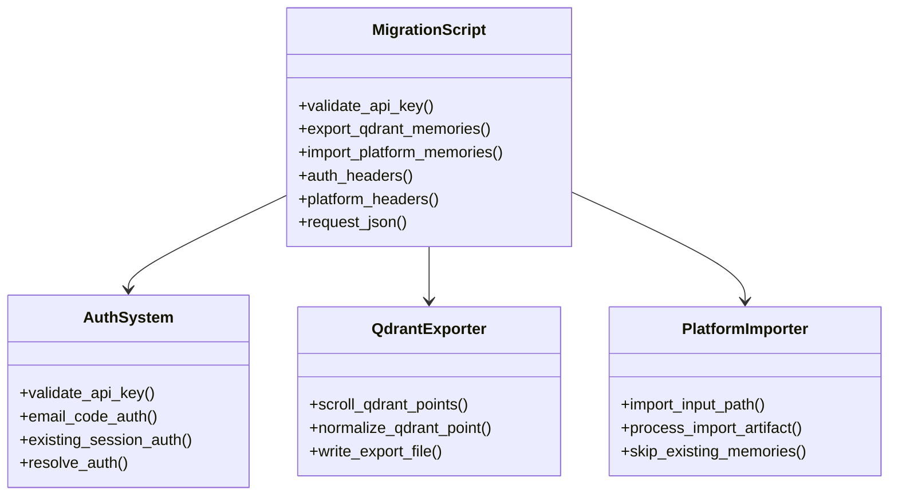

**图表来源**
- [oss-to-platform-migrate.sh:39-525](file://scripts/oss-to-platform-migrate.sh#L39-L525)

### 客户端组件

平台版本使用 MemoryClient 替代本地 Memory 类：

```mermaid
classDiagram
class MemoryClient {
+api_key : string
+host : string
+client : httpx.Client
+user_id : string
+add()
+search()
+get_all()
+delete()
+delete_all()
}
class PlatformAPI {
+/v3/memories/add/
+/v3/memories/search/
+/v3/memories/
+/v1/memories/{id}/
}
MemoryClient --> PlatformAPI : "调用"
```

**图表来源**
- [main.py:71-148](file://mem0/client/main.py#L71-L148)
- [main.py:172-432](file://mem0/client/main.py#L172-L432)

**章节来源**
- [main.py:1-800](file://mem0/client/main.py#L1-L800)
- [oss-to-platform-migrate.sh:1-800](file://scripts/oss-to-platform-migrate.sh#L1-L800)

## 架构概览

### 迁移架构流程

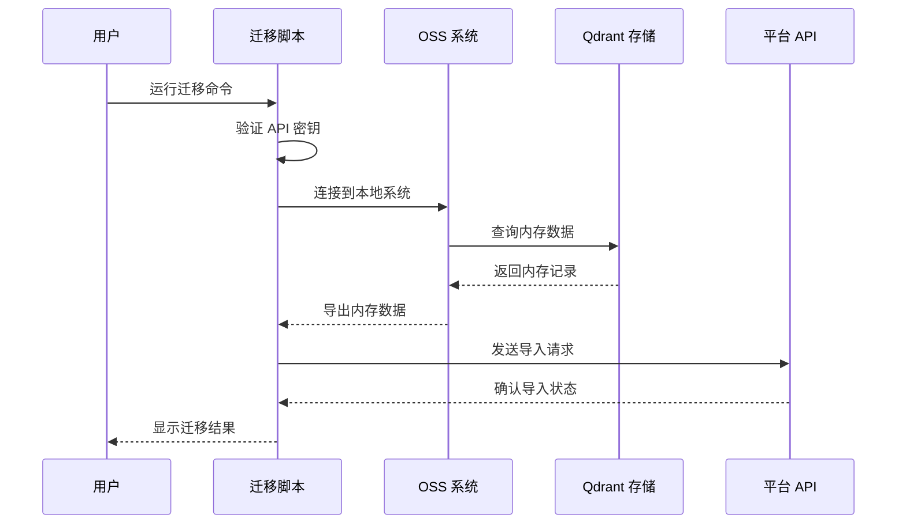

**图表来源**
- [oss-to-platform-migrate.sh:527-800](file://scripts/oss-to-platform-migrate.sh#L527-L800)
- [test_oss_to_platform_migrate.py:17-186](file://tests/test_oss_to_platform_migrate.py#L17-L186)

### 数据流架构

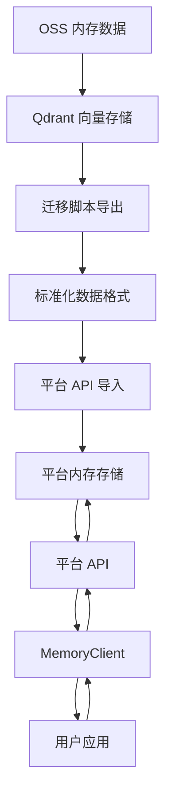

**图表来源**
- [oss-to-platform-migrate.sh:694-778](file://scripts/oss-to-platform-migrate.sh#L694-L778)
- [main.py:172-333](file://mem0/client/main.py#L172-L333)

## 详细组件分析

### 迁移脚本实现

迁移脚本提供了完整的自动化迁移流程，支持多种操作模式：

#### 认证系统

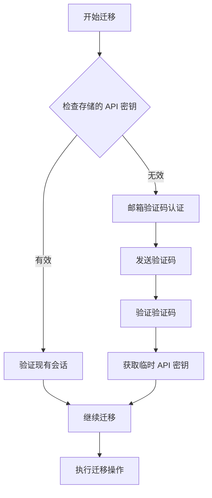

**图表来源**
- [oss-to-platform-migrate.sh:512-525](file://scripts/oss-to-platform-migrate.sh#L512-L525)
- [oss-to-platform-migrate.sh:482-510](file://scripts/oss-to-platform-migrate.sh#L482-L510)

#### 数据导出流程

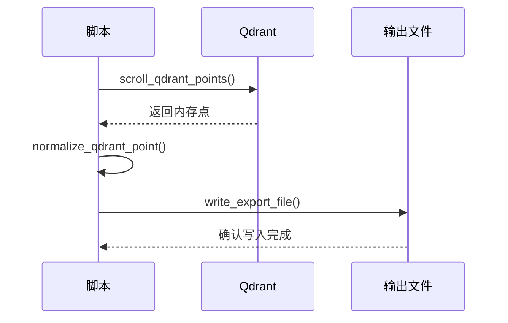

**图表来源**
- [oss-to-platform-migrate.sh:651-778](file://scripts/oss-to-platform-migrate.sh#L651-L778)

**章节来源**
- [oss-to-platform-migrate.sh:1-800](file://scripts/oss-to-platform-migrate.sh#L1-L800)

### 平台 API 客户端

平台版本使用 MemoryClient 提供统一的 API 接口：

#### 初始化流程

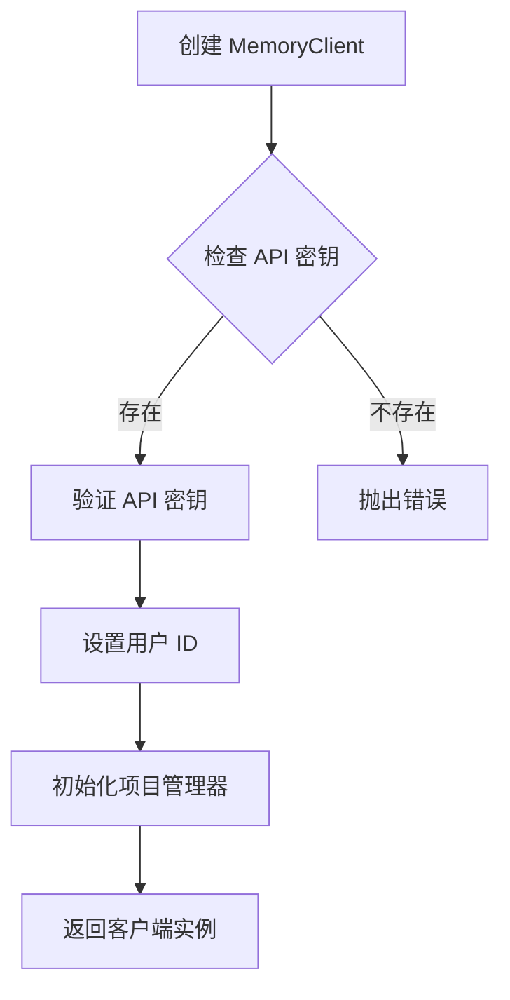

**图表来源**
- [main.py:84-148](file://mem0/client/main.py#L84-L148)

#### 方法调用流程

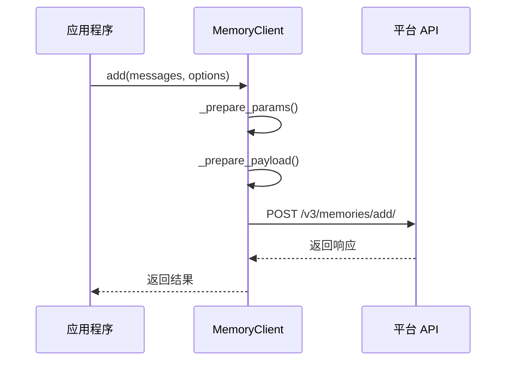

**图表来源**
- [main.py:172-211](file://mem0/client/main.py#L172-L211)

**章节来源**
- [main.py:1-800](file://mem0/client/main.py#L1-L800)

### OpenMemory 备份系统

OpenMemory 提供了独立的数据备份和导出功能：

#### 备份流程

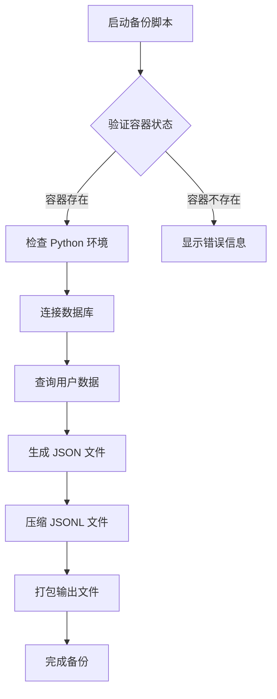

**图表来源**
- [export_openmemory.sh:51-61](file://openmemory/backup-scripts/export_openmemory.sh#L51-L61)
- [export_openmemory.sh:155-337](file://openmemory/backup-scripts/export_openmemory.sh#L155-L337)

**章节来源**
- [export_openmemory.sh:1-393](file://openmemory/backup-scripts/export_openmemory.sh#L1-L393)

## 依赖关系分析

### Python 依赖关系

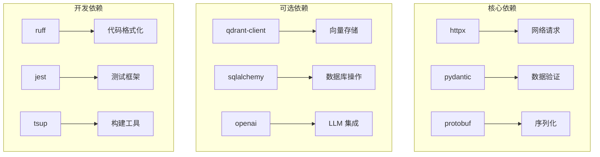

**图表来源**
- [pyproject.toml:16-74](file://pyproject.toml#L16-L74)
- [package.json:102-128](file://mem0-ts/package.json#L102-L128)

### TypeScript 依赖关系

```mermaid
graph LR
A[axios] --> B[HTTP 客户端]
C[uuid] --> D[ID 生成]
E[zod] --> F[数据验证]
G[@mem0/community] --> H[社区功能]
I[openai] --> J[LLM 集成]
K[tsup] --> L[构建工具]
```

**图表来源**
- [package.json:102-128](file://mem0-ts/package.json#L102-L128)

**章节来源**
- [pyproject.toml:1-160](file://pyproject.toml#L1-L160)
- [package.json:1-162](file://mem0-ts/package.json#L1-L162)
- [pyproject.toml:1-78](file://cli/python/pyproject.toml#L1-L78)

## 性能考虑

### 迁移性能优化

1. **批量处理**: 迁移脚本支持分页处理大量内存数据
2. **并发控制**: 平台 API 支持批量导入操作
3. **缓存策略**: 客户端实现了智能缓存机制
4. **连接池**: 使用 httpx 的连接池优化网络请求

### 平台 vs OSS 性能对比

| 维度 | 平台版本 | 开源版本 |
|------|----------|----------|
| **延迟** | 低延迟，CDN 加速 | 取决于本地基础设施 |
| **吞吐量** | 自动扩展 | 固定容量 |
| **可用性** | 99.9% SLA | 需要自行保证 |
| **成本** | 按需付费 | 固定基础设施成本 |

## 故障排除指南

### 常见问题及解决方案

#### 认证问题

**问题**: API 密钥验证失败
**解决方案**: 
1. 检查 MEM0_API_KEY 环境变量
2. 确认 API 密钥未过期
3. 验证账户状态

**章节来源**
- [oss-to-platform-migrate.sh:355-372](file://scripts/oss-to-platform-migrate.sh#L355-L372)

#### 网络连接问题

**问题**: 迁移过程中断开连接
**解决方案**:
1. 检查网络连接稳定性
2. 配置代理设置
3. 增加超时时间

#### 数据完整性问题

**问题**: 迁移后数据不完整
**解决方案**:
1. 检查导出文件完整性
2. 验证平台导入状态
3. 重新运行迁移脚本

### 测试验证

迁移脚本包含完整的测试套件，验证各种场景：

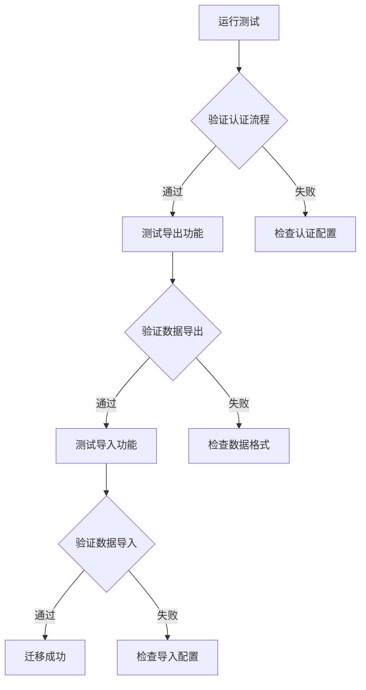

**图表来源**
- [test_oss_to_platform_migrate.py:378-402](file://tests/test_oss_to_platform_migrate.py#L378-L402)

**章节来源**
- [test_oss_to_platform_migrate.py:1-839](file://tests/test_oss_to_platform_migrate.py#L1-L839)

## 结论

从 OSS 迁移到平台版本是一个相对简单的自动化过程，主要涉及以下关键步骤：

1. **准备工作**: 获取 API 密钥，备份现有数据
2. **执行迁移**: 运行迁移脚本，验证数据完整性
3. **更新代码**: 切换到 MemoryClient，更新 API 调用
4. **验证测试**: 确认功能正常，监控性能指标

平台版本提供了更好的可扩展性、维护性和功能丰富性，特别适合生产环境使用。对于需要完全控制数据和基础设施的企业，开源版本仍然是很好的选择。

## 附录

### 迁移前准备工作清单

- [ ] 创建 Mem0 平台账户
- [ ] 生成 API 密钥
- [ ] 备份现有 OSS 数据
- [ ] 准备目标环境
- [ ] 验证网络连接

### 迁移后验证清单

- [ ] 验证 API 密钥有效性
- [ ] 测试基本内存操作
- [ ] 验证搜索功能
- [ ] 检查权限设置
- [ ] 监控系统性能

### 相关资源链接

- [平台快速开始](file://docs/platform/quickstart.mdx)
- [平台 vs 开源对比](file://docs/platform/platform-vs-oss.mdx)
- [迁移文档](file://docs/migration/oss-to-platform.mdx)