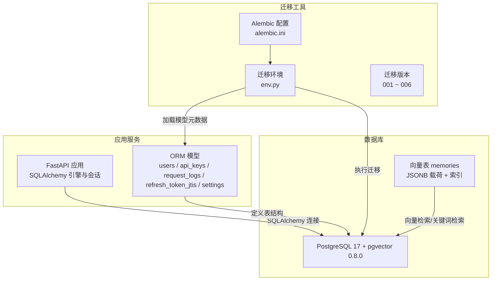
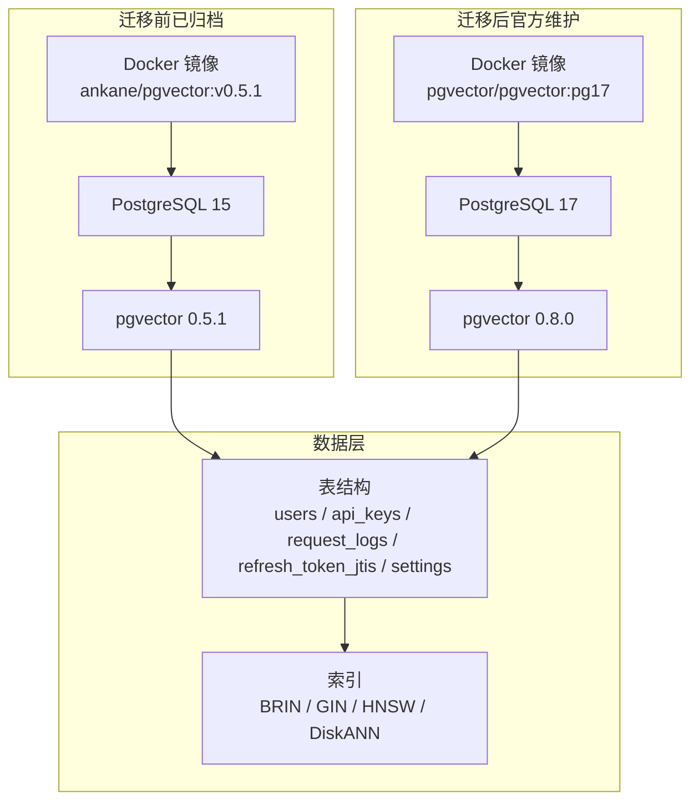
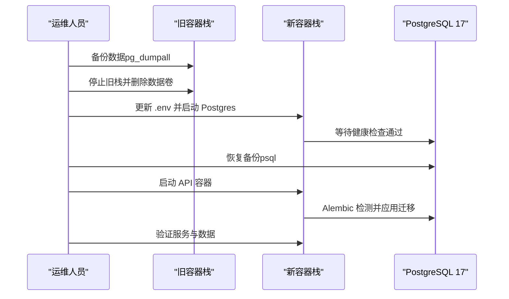
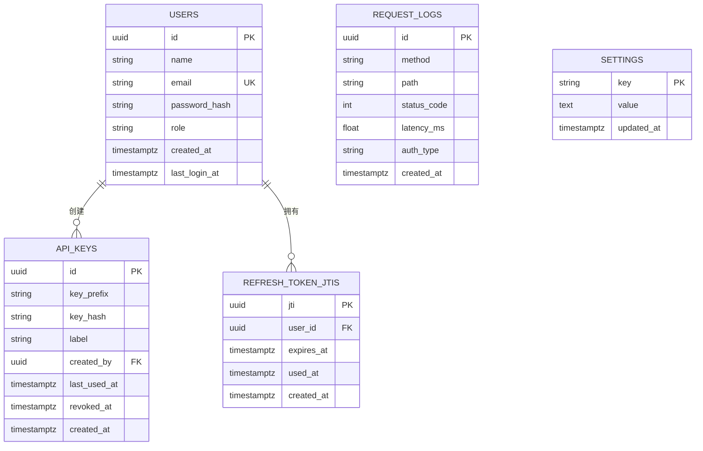
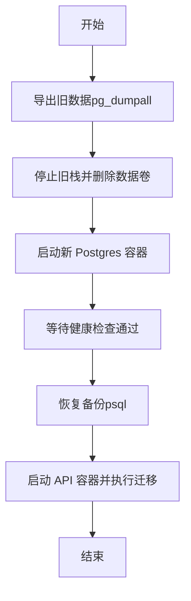
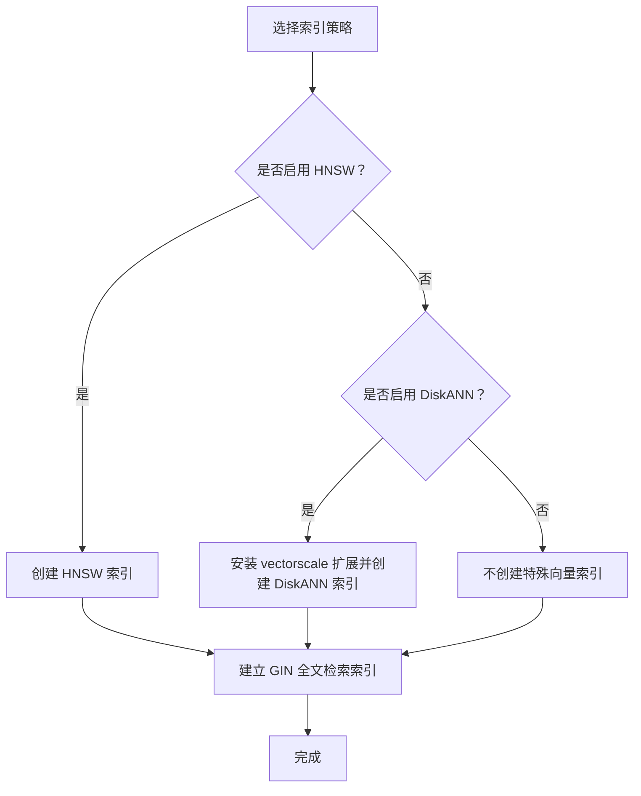
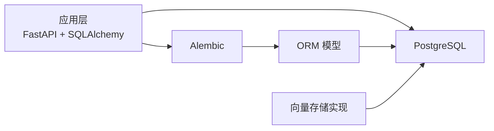

# 数据库迁移

<cite>
**本文引用的文件**
- [docs/migration/server-pgvector-upgrade.mdx](file://docs/migration/server-pgvector-upgrade.mdx)
- [mem0/vector_stores/pgvector.py](file://mem0/vector_stores/pgvector.py)
- [server/db.py](file://server/db.py)
- [server/models.py](file://server/models.py)
- [server/alembic.ini](file://server/alembic.ini)
- [server/alembic/env.py](file://server/alembic/env.py)
- [server/alembic/versions/001_create_users_and_api_keys.py](file://server/alembic/versions/001_create_users_and_api_keys.py)
- [server/alembic/versions/006_request_logs_brin.py](file://server/alembic/versions/006_request_logs_brin.py)
</cite>

## 目录
1. [简介](#简介)
2. [项目结构](#项目结构)
3. [核心组件](#核心组件)
4. [架构总览](#架构总览)
5. [详细组件分析](#详细组件分析)
6. [依赖关系分析](#依赖关系分析)
7. [性能考量](#性能考量)
8. [故障排查指南](#故障排查指南)
9. [结论](#结论)
10. [附录](#附录)

## 简介
本指南聚焦于 PostgreSQL + pgvector 的数据库升级迁移，面向使用自托管 Mem0 Server 的用户。内容涵盖：
- 从非官方维护的旧镜像迁移到官方 pgvector 镜像（PostgreSQL 由 15 升级至 17）
- 数据库架构与数据模型演进要点
- 升级步骤、注意事项与回滚策略
- 数据导出、转换与导入流程
- 索引重建与性能优化方法
- 数据一致性保障与版本检查、兼容性验证

## 项目结构
本次迁移涉及以下关键位置：
- 文档：迁移指南位于 docs/migration/server-pgvector-upgrade.mdx
- 应用侧数据库连接与 ORM 模型：server/db.py、server/models.py
- 迁移工具与配置：server/alembic.ini、server/alembic/env.py、server/alembic/versions/*
- 向量存储实现：mem0/vector_stores/pgvector.py（用于理解向量表结构、索引类型）

图表来源
- [server/db.py:1-32](file://server/db.py#L1-L32)
- [server/models.py:1-75](file://server/models.py#L1-L75)
- [server/alembic.ini:1-38](file://server/alembic.ini#L1-L38)
- [server/alembic/env.py:1-45](file://server/alembic/env.py#L1-L45)
- [server/alembic/versions/001_create_users_and_api_keys.py:1-50](file://server/alembic/versions/001_create_users_and_api_keys.py#L1-L50)
- [server/alembic/versions/006_request_logs_brin.py:1-27](file://server/alembic/versions/006_request_logs_brin.py#L1-L27)
- [mem0/vector_stores/pgvector.py:258-306](file://mem0/vector_stores/pgvector.py#L258-L306)

章节来源
- [server/db.py:1-32](file://server/db.py#L1-L32)
- [server/models.py:1-75](file://server/models.py#L1-L75)
- [server/alembic.ini:1-38](file://server/alembic.ini#L1-L38)
- [server/alembic/env.py:1-45](file://server/alembic/env.py#L1-L45)
- [server/alembic/versions/001_create_users_and_api_keys.py:1-50](file://server/alembic/versions/001_create_users_and_api_keys.py#L1-L50)
- [server/alembic/versions/006_request_logs_brin.py:1-27](file://server/alembic/versions/006_request_logs_brin.py#L1-L27)
- [mem0/vector_stores/pgvector.py:258-306](file://mem0/vector_stores/pgvector.py#L258-L306)

## 核心组件
- 数据库连接与会话
  - 使用 SQLAlchemy 构建连接字符串，支持通过环境变量覆盖默认值；启用 pool_pre_ping 提升连接稳定性。
- ORM 模型
  - 定义用户、API 密钥、请求日志、刷新令牌 JTI、系统设置等表结构及索引。
- 迁移工具
  - Alembic 配置与运行时环境，动态注入数据库 URL，按版本顺序执行迁移。
- 向量存储实现
  - 基于 PostgreSQL + pgvector 扩展，提供向量表创建、索引（DiskANN/HNSW）、全文检索索引、插入、查询、更新、删除、重置等能力。

章节来源
- [server/db.py:1-32](file://server/db.py#L1-L32)
- [server/models.py:1-75](file://server/models.py#L1-L75)
- [server/alembic.ini:1-38](file://server/alembic.ini#L1-L38)
- [server/alembic/env.py:1-45](file://server/alembic/env.py#L1-L45)
- [mem0/vector_stores/pgvector.py:142-560](file://mem0/vector_stores/pgvector.py#L142-L560)

## 架构总览
下图展示迁移前后架构差异与升级路径：

图表来源
- [docs/migration/server-pgvector-upgrade.mdx:10-17](file://docs/migration/server-pgvector-upgrade.mdx#L10-L17)
- [server/alembic/versions/001_create_users_and_api_keys.py:1-50](file://server/alembic/versions/001_create_users_and_api_keys.py#L1-L50)
- [server/alembic/versions/006_request_logs_brin.py:1-27](file://server/alembic/versions/006_request_logs_brin.py#L1-L27)
- [mem0/vector_stores/pgvector.py:258-306](file://mem0/vector_stores/pgvector.py#L258-L306)

## 详细组件分析

### 组件一：PostgreSQL + pgvector 升级迁移流程
- 升级背景
  - 从非官方维护的 ankane/pgvector 镜像迁移到官方 pgvector/pgvector:pg17，PostgreSQL 由 15 升级到 17，pgvector 由 0.5.1 升级到 0.8.0。
- 升级步骤
  1) 备份数据：在旧容器中导出全量数据。
  2) 停止旧栈并清理数据卷。
  3) 更新 .env，显式配置数据库凭据。
  4) 先启动仅 Postgres 容器，等待健康检查通过。
  5) 将备份数据恢复到新容器。
  6) 启动 API 容器，Alembic 自动检测并应用新增迁移。
  7) 验证服务健康与数据可用性。
- 回滚策略
  - 将镜像标签改回旧版本，销毁新卷，重新启动旧镜像并恢复备份。

图表来源
- [docs/migration/server-pgvector-upgrade.mdx:41-136](file://docs/migration/server-pgvector-upgrade.mdx#L41-L136)

章节来源
- [docs/migration/server-pgvector-upgrade.mdx:10-17](file://docs/migration/server-pgvector-upgrade.mdx#L10-L17)
- [docs/migration/server-pgvector-upgrade.mdx:41-136](file://docs/migration/server-pgvector-upgrade.mdx#L41-L136)

### 组件二：数据库架构与数据模型演进
- 用户与密钥表
  - users 表包含唯一邮箱索引；api_keys 表外键关联 users，并记录创建时间、最后使用时间、撤销时间等。
- 请求日志表
  - request_logs 表采用 BRIN 索引替代 B-tree 索引以提升写入吞吐与存储效率。
- 刷新令牌 JTI 表
  - 存储刷新令牌的 JTI 及过期、使用状态。
- 设置表
  - 键值对设置，带更新时间戳。
- 向量表（memories）
  - 由向量存储实现创建，包含 UUID 主键、向量列、JSONB 载荷；可选创建 HNSW 或 DiskANN 索引；同时建立文本字段的 GIN 全文检索索引。

图表来源
- [server/models.py:18-75](file://server/models.py#L18-L75)
- [server/alembic/versions/001_create_users_and_api_keys.py:20-49](file://server/alembic/versions/001_create_users_and_api_keys.py#L20-L49)
- [server/alembic/versions/006_request_logs_brin.py:19-26](file://server/alembic/versions/006_request_logs_brin.py#L19-L26)

章节来源
- [server/models.py:18-75](file://server/models.py#L18-L75)
- [server/alembic/versions/001_create_users_and_api_keys.py:1-50](file://server/alembic/versions/001_create_users_and_api_keys.py#L1-L50)
- [server/alembic/versions/006_request_logs_brin.py:1-27](file://server/alembic/versions/006_request_logs_brin.py#L1-L27)
- [mem0/vector_stores/pgvector.py:258-306](file://mem0/vector_stores/pgvector.py#L258-L306)

### 组件三：数据迁移流程（导出/转换/导入）
- 导出
  - 在旧容器中使用 pg_dumpall 导出所有数据库对象与数据。
- 转换
  - 本仓库未提供专用转换脚本；如需跨版本或跨部署迁移，建议在恢复前评估数据格式与索引兼容性。
- 导入
  - 在新容器启动并健康后，使用 psql 将备份文件恢复到新数据库。

图表来源
- [docs/migration/server-pgvector-upgrade.mdx:45-125](file://docs/migration/server-pgvector-upgrade.mdx#L45-L125)

章节来源
- [docs/migration/server-pgvector-upgrade.mdx:45-125](file://docs/migration/server-pgvector-upgrade.mdx#L45-L125)

### 组件四：索引重建与性能优化
- 索引类型
  - 向量检索：支持 HNSW（cosine 距离）与 DiskANN（当满足条件时）。
  - 全文检索：对 lemmatized 文本字段建立 GIN 索引。
  - 写多读少场景：request_logs 表使用 BRIN 索引以降低写放大。
- 重建策略
  - 当需要切换索引类型或调整参数时，可通过重置集合（删除并重建表）实现。
  - 对现有数据可考虑在线重建索引（视规模与业务窗口而定）。

图表来源
- [mem0/vector_stores/pgvector.py:274-305](file://mem0/vector_stores/pgvector.py#L274-L305)
- [server/alembic/versions/006_request_logs_brin.py:19-26](file://server/alembic/versions/006_request_logs_brin.py#L19-L26)

章节来源
- [mem0/vector_stores/pgvector.py:258-306](file://mem0/vector_stores/pgvector.py#L258-L306)
- [server/alembic/versions/006_request_logs_brin.py:1-27](file://server/alembic/versions/006_request_logs_brin.py#L1-L27)

### 组件五：数据一致性保障与回滚策略
- 一致性保障
  - 升级前必须先备份；恢复必须在启动 API 容器之前完成，避免 Alembic 创建空表导致冲突。
  - 使用健康检查确保数据库可用后再进行恢复与后续步骤。
- 回滚策略
  - 将镜像标签回退到旧版本，销毁新卷，重启旧镜像并恢复备份。

章节来源
- [docs/migration/server-pgvector-upgrade.mdx:104-153](file://docs/migration/server-pgvector-upgrade.mdx#L104-L153)

### 组件六：版本检查与兼容性验证
- 版本对照
  - 旧镜像：ankane/pgvector:v0.5.1（PostgreSQL 15，pgvector 0.5.1）
  - 新镜像：pgvector/pgvector:pg17（PostgreSQL 17，pgvector 0.8.0）
- 兼容性验证
  - 升级前确认 .env 中设置了 POSTGRES_PASSWORD；升级后验证服务健康与数据访问接口可用。

章节来源
- [docs/migration/server-pgvector-upgrade.mdx:10-17](file://docs/migration/server-pgvector-upgrade.mdx#L10-L17)
- [docs/migration/server-pgvector-upgrade.mdx:127-136](file://docs/migration/server-pgvector-upgrade.mdx#L127-L136)

## 依赖关系分析
- 应用层依赖
  - FastAPI 通过 SQLAlchemy 连接数据库；ORM 模型定义表结构；Alembic 负责迁移管理。
- 迁移工具链
  - alembic.ini 提供基础配置；env.py 动态注入数据库 URL 并加载模型元数据；versions 下的脚本按序执行。
- 向量存储依赖
  - 依赖 PostgreSQL + pgvector 扩展；根据配置选择 HNSW 或 DiskANN 索引。

图表来源
- [server/db.py:1-32](file://server/db.py#L1-L32)
- [server/models.py:1-75](file://server/models.py#L1-L75)
- [server/alembic/env.py:1-45](file://server/alembic/env.py#L1-L45)
- [mem0/vector_stores/pgvector.py:142-560](file://mem0/vector_stores/pgvector.py#L142-L560)

章节来源
- [server/db.py:1-32](file://server/db.py#L1-L32)
- [server/models.py:1-75](file://server/models.py#L1-L75)
- [server/alembic/env.py:1-45](file://server/alembic/env.py#L1-L45)
- [mem0/vector_stores/pgvector.py:142-560](file://mem0/vector_stores/pgvector.py#L142-L560)

## 性能考量
- 写入吞吐
  - request_logs 表采用 BRIN 索引，适合高写入场景，降低索引维护成本。
- 向量检索
  - HNSW 与 DiskANN 可显著提升大规模向量相似度检索性能；需结合维度与数据规模评估。
- 连接池与并发
  - 向量存储实现支持 psycopg3/psycopg2 连接池，合理设置最小/最大连接数以平衡资源占用与响应延迟。

章节来源
- [server/alembic/versions/006_request_logs_brin.py:19-26](file://server/alembic/versions/006_request_logs_brin.py#L19-L26)
- [mem0/vector_stores/pgvector.py:179-211](file://mem0/vector_stores/pgvector.py#L179-L211)

## 故障排查指南
- 升级后无法启动
  - 检查 .env 是否正确设置 POSTGRES_PASSWORD；确认数据库 URL 与凭据无误。
- 恢复失败或重复键错误
  - 确保在启动 API 容器前完成数据恢复；避免 Alembic 先创建空表。
- 健康检查失败
  - 使用内置健康检查命令确认数据库就绪后再进行恢复与迁移。
- 索引异常
  - 若启用 DiskANN，请确认已安装 vectorscale 扩展；否则回退到 HNSW 或关闭特殊索引。

章节来源
- [docs/migration/server-pgvector-upgrade.mdx:71-125](file://docs/migration/server-pgvector-upgrade.mdx#L71-L125)
- [mem0/vector_stores/pgvector.py:274-305](file://mem0/vector_stores/pgvector.py#L274-L305)

## 结论
本次迁移将数据库升级至官方维护的 pgvector:pg17 镜像，带来更稳定的补丁支持与更强的向量检索能力。遵循“先备份、再恢复、后迁移”的流程，配合健康检查与索引策略优化，可在保障数据一致性的前提下顺利完成升级。

## 附录
- 关键文件清单
  - 迁移指南：docs/migration/server-pgvector-upgrade.mdx
  - 数据库连接：server/db.py
  - ORM 模型：server/models.py
  - 迁移配置：server/alembic.ini、server/alembic/env.py
  - 迁移版本：server/alembic/versions/001_create_users_and_api_keys.py、server/alembic/versions/006_request_logs_brin.py
  - 向量存储实现：mem0/vector_stores/pgvector.py