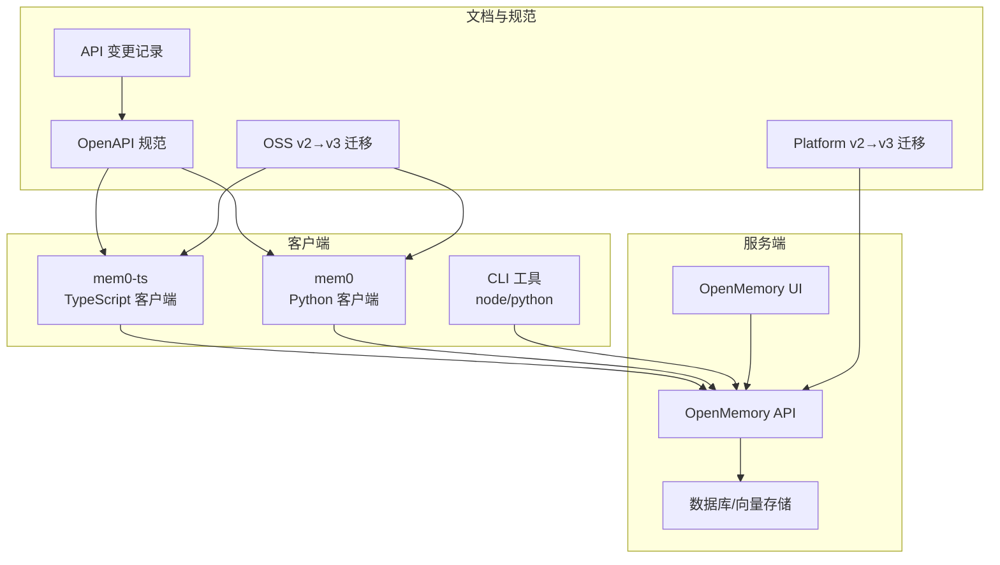
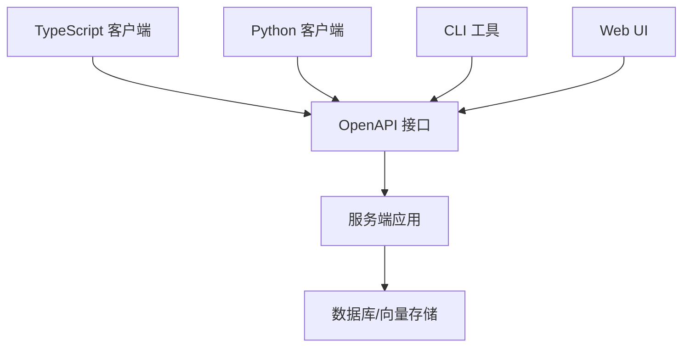
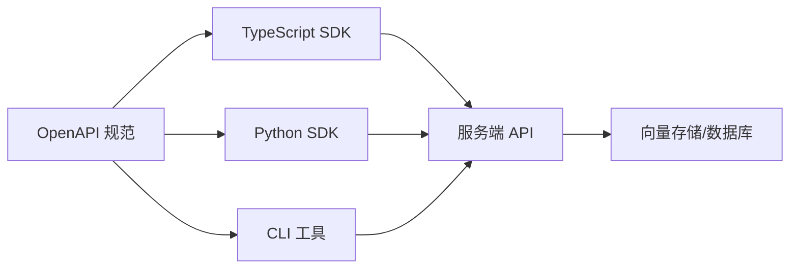

# 版本升级迁移

<cite>
**本文引用的文件**
- [oss-v2-to-v3.mdx](file://docs/migration/oss-v2-to-v3.mdx)
- [platform-v2-to-v3.mdx](file://docs/migration/platform-v2-to-v3.mdx)
- [api-changes.mdx](file://docs/migration/api-changes.mdx)
- [openapi.json](file://docs/openapi.json)
- [mem0_ts_package.json](file://mem0-ts/package.json)
- [mem0_py_init.py](file://mem0/client/main.py)
- [mem0_py_project.py](file://mem0/client/project.py)
- [mem0_py_types.py](file://mem0/client/types.py)
- [mem0_py_utils.py](file://mem0/client/utils.py)
- [mem0_py_base.py](file://mem0/memory/base.py)
- [mem0_py_main.py](file://mem0/memory/main.py)
- [mem0_py_storage.py](file://mem0/memory/storage.py)
- [mem0_py_setup.py](file://mem0/memory/setup.py)
- [mem0_py_configs_base.py](file://mem0/configs/base.py)
- [mem0_py_enums.py](file://mem0/configs/enums.py)
- [mem0_py_prompts.py](file://mem0/configs/prompts.py)
- [mem0_py_exceptions.py](file://mem0/exceptions.py)
- [server_main.py](file://server/main.py)
- [server_models.py](file://server/models.py)
- [server_schemas.py](file://server/schemas.py)
- [server_db.py](file://server/db.py)
- [server_errors.py](file://server/errors.py)
- [cli_node_version.ts](file://cli/node/src/version.ts)
- [cli_python_version.py](file://cli/python/src/mem0_cli/telemetry.py)
- [cli_node_package.json](file://cli/node/package.json)
- [cli_python_pyproject.toml](file://cli/python/pyproject.toml)
- [openmemory_api_main.py](file://openmemory/api/main.py)
- [openmemory_api_requirements.txt](file://openmemory/api/requirements.txt)
- [openmemory_ui_next.config.mjs](file://openmemory/ui/next.config.mjs)
- [openmemory_ui_tailwind.config.ts](file://openmemory/ui/tailwind.config.ts)
- [openmemory_ui_package.json](file://openmemory/ui/package.json)
- [openmemory_ui_tsconfig.json](file://openmemory/ui/tsconfig.json)
- [openmemory_ui_entrypoint.sh](file://openmemory/ui/entrypoint.sh)
- [openmemory_ui_dockerfile](file://openmemory/ui/Dockerfile)
- [openmemory_api_dockerfile](file://openmemory/api/Dockerfile)
- [openmemory_api_compose_pgvector.yml](file://openmemory/compose/pgvector.yml)
- [openmemory_api_compose_chroma.yml](file://openmemory/compose/chroma.yml)
- [openmemory_api_compose_elasticsearch.yml](file://openmemory/compose/elasticsearch.yml)
- [openmemory_api_compose_faiss.yml](file://openmemory/compose/faiss.yml)
- [openmemory_api_compose_milvus.yml](file://openmemory/compose/milvus.yml)
- [openmemory_api_compose_opensearch.yml](file://openmemory/compose/opensearch.yml)
- [openmemory_api_compose_qdrant.yml](file://openmemory/compose/qdrant.yml)
- [openmemory_api_compose_redis.yml](file://openmemory/compose/redis.yml)
- [openmemory_api_compose_weaviate.yml](file://openmemory/compose/weaviate.yml)
- [openmemory_api_compose_neptune.yml](file://openmemory/compose/neptune_analytics.yml)
- [openmemory_api_compose_s3_vectors.yml](file://openmemory/compose/s3_vectors.yml)
- [openmemory_api_compose_valkey.yml](file://openmemory/compose/valkey.yml)
- [openmemory_api_compose_turbopuffer.yml](file://openmemory/compose/turbopuffer.yml)
- [openmemory_api_compose_supabase.yml](file://openmemory/compose/supabase.yml)
- [openmemory_api_compose_azure_ai_search.yml](file://openmemory/compose/azure_ai_search.yml)
- [openmemory_api_compose_azure_mysql.yml](file://openmemory/compose/azure_mysql.yml)
- [openmemory_api_compose_databricks.yml](file://openmemory/compose/databricks.yml)
- [openmemory_api_compose_baidu.yml](file://openmemory/compose/baidu.yml)
- [openmemory_api_compose_cassandra.yml](file://openmemory/compose/cassandra.yml)
- [openmemory_api_compose_mongodb.yml](file://openmemory/compose/mongodb.yml)
- [openmemory_api_compose_pinecone.yml](file://openmemory/compose/pinecone.yml)
- [openmemory_api_compose_vertex_ai_vector_search.yml](file://openmemory/compose/vertex_ai_vector_search.yml)
- [openmemory_api_compose_upstash_vector.yml](file://openmemory/compose/upstash_vector.yml)
- [openmemory_api_compose_s3_vectors.yml](file://openmemory/compose/s3_vectors.yml)
- [openmemory_api_compose_valkey.yml](file://openmemory/compose/valkey.yml)
- [openmemory_api_compose_turbopuffer.yml](file://openmemory/compose/turbopuffer.yml)
- [openmemory_api_compose_supabase.yml](file://openmemory/compose/supabase.yml)
- [openmemory_api_compose_azure_ai_search.yml](file://openmemory/compose/azure_ai_search.yml)
- [openmemory_api_compose_azure_mysql.yml](file://openmemory/compose/azure_mysql.yml)
- [openmemory_api_compose_databricks.yml](file://openmemory/compose/databricks.yml)
- [openmemory_api_compose_baidu.yml](file://openmemory/compose/baidu.yml)
- [openmemory_api_compose_cassandra.yml](file://openmemory/compose/cassandra.yml)
- [openmemory_api_compose_mongodb.yml](file://openmemory/compose/mongodb.yml)
- [openmemory_api_compose_pinecone.yml](file://openmemory/compose/pinecone.yml)
- [openmemory_api_compose_vertex_ai_vector_search.yml](file://openmemory/compose/vertex_ai_vector_search.yml)
- [openmemory_api_compose_upstash_vector.yml](file://openmemory/compose/upstash_vector.yml)
</cite>

## 目录
1. [引言](#引言)
2. [项目结构](#项目结构)
3. [核心组件](#核心组件)
4. [架构总览](#架构总览)
5. [详细组件分析](#详细组件分析)
6. [依赖关系分析](#依赖关系分析)
7. [性能考量](#性能考量)
8. [故障排查指南](#故障排查指南)
9. [结论](#结论)
10. [附录](#附录)

## 引言
本指南面向从 Mem0 v2 升级到 v3 的用户与平台运营者，系统梳理版本变更、API 端点变化、数据模型调整、配置参数更新、客户端 SDK 升级与代码适配、废弃功能替代方案、以及升级前后验证方法。文档基于仓库内官方迁移文档与源码实现进行归纳总结，并提供可视化图示帮助理解。

## 项目结构
Mem0 仓库包含多语言客户端（Python 与 TypeScript）、服务端（OpenMemory 平台与独立 API）、CLI 工具、向量数据库适配层、嵌入与 LLM 抽象层等模块。v3 迁移涉及 OpenSource 与 Platform 两条路线，API 变更以 OpenAPI 规范为准，同时配套 CLI 与 SDK 的版本与依赖更新。

图表来源
- [openapi.json](file://docs/openapi.json)
- [oss-v2-to-v3.mdx](file://docs/migration/oss-v2-to-v3.mdx)
- [platform-v2-to-v3.mdx](file://docs/migration/platform-v2-to-v3.mdx)
- [api-changes.mdx](file://docs/migration/api-changes.mdx)

章节来源
- [oss-v2-to-v3.mdx](file://docs/migration/oss-v2-to-v3.mdx)
- [platform-v2-to-v3.mdx](file://docs/migration/platform-v2-to-v3.mdx)
- [api-changes.mdx](file://docs/migration/api-changes.mdx)
- [openapi.json](file://docs/openapi.json)

## 核心组件
- 客户端 SDK：TypeScript 与 Python 两套实现，提供统一的内存管理接口（增删改查、搜索、导出、反馈等）。
- 服务端平台：OpenMemory 提供 Web 界面与 API，支持组织/项目/实体维度的权限与隔离。
- 向量存储适配：覆盖主流向量数据库（pgvector、chroma、milvus、qdrant、weaviate 等），通过统一抽象层接入。
- 配置与枚举：集中定义嵌入、LLM、重排序器、向量存储等配置项与默认值。
- 错误与异常：统一异常类型与错误响应格式，便于客户端捕获与处理。
- CLI：提供初始化、插件同步、遥测上报等功能，辅助部署与运维。

章节来源
- [mem0_ts_package.json](file://mem0-ts/package.json)
- [mem0_py_init.py](file://mem0/client/main.py)
- [mem0_py_project.py](file://mem0/client/project.py)
- [mem0_py_types.py](file://mem0/client/types.py)
- [mem0_py_utils.py](file://mem0/client/utils.py)
- [mem0_py_base.py](file://mem0/memory/base.py)
- [mem0_py_main.py](file://mem0/memory/main.py)
- [mem0_py_storage.py](file://mem0/memory/storage.py)
- [mem0_py_setup.py](file://mem0/memory/setup.py)
- [mem0_py_configs_base.py](file://mem0/configs/base.py)
- [mem0_py_enums.py](file://mem0/configs/enums.py)
- [mem0_py_prompts.py](file://mem0/configs/prompts.py)
- [mem0_py_exceptions.py](file://mem0/exceptions.py)
- [cli_node_version.ts](file://cli/node/src/version.ts)
- [cli_python_version.py](file://cli/python/src/mem0_cli/telemetry.py)

## 架构总览
v3 在 v2 基础上强化了平台化能力（组织/项目/实体隔离）、统一 OpenAPI 规范、增强客户端 SDK 的一致性与可扩展性，并对部分内部数据模型与配置项进行了优化与规范化。

图表来源
- [openapi.json](file://docs/openapi.json)
- [server_main.py](file://server/main.py)
- [openmemory_api_main.py](file://openmemory/api/main.py)
- [openmemory_ui_next.config.mjs](file://openmemory/ui/next.config.mjs)

## 详细组件分析

### 1) API 端点变更与兼容性
- 变更依据：以 OpenAPI 规范与官方迁移文档为权威来源，涵盖新增/删除/重命名的端点、请求/响应体字段变化、鉴权方式调整等。
- 兼容策略：建议在升级前先对照 OpenAPI 文档完成接口映射与参数校验；对于删除或重命名的端点，提供迁移脚本或自动转换工具。
- 版本标识：OpenAPI 中包含版本信息，便于客户端和服务端共同遵循。

章节来源
- [api-changes.mdx](file://docs/migration/api-changes.mdx)
- [openapi.json](file://docs/openapi.json)

### 2) 数据模型调整
- 模型演进：v3 对实体、项目、组织、内存条目等核心模型进行了字段规范化与约束增强，提升跨环境一致性。
- 迁移要点：旧模型字段若被移除或重命名，需在升级前执行数据清洗与映射；对时间戳、元数据、标签等字段进行兼容处理。
- 向量存储：不同后端的索引字段与查询语法可能有差异，需按后端适配层进行调整。

章节来源
- [oss-v2-to-v3.mdx](file://docs/migration/oss-v2-to-v3.mdx)
- [platform-v2-to-v3.mdx](file://docs/migration/platform-v2-to-v3.mdx)

### 3) 配置参数与默认值
- 统一配置：v3 将嵌入、LLM、重排序器、向量存储等配置项收敛到统一的配置基类与枚举体系，减少歧义。
- 默认行为：部分默认参数在 v3 中发生调整，如相似度阈值、分页大小、缓存策略等，升级时应核对业务期望。
- 环境变量：保持与 v2 类似的环境变量命名风格，但具体键名与取值范围可能有差异，需逐项比对。

章节来源
- [mem0_py_configs_base.py](file://mem0/configs/base.py)
- [mem0_py_enums.py](file://mem0/configs/enums.py)
- [mem0_py_prompts.py](file://mem0/configs/prompts.py)

### 4) 客户端 SDK 升级与代码适配
- TypeScript 客户端：更新包版本与导入路径，确保与新 OpenAPI 一致；对过时方法进行替换或迁移。
- Python 客户端：更新依赖版本，修正构造函数与方法签名；对返回值结构进行兼容处理。
- 通用适配：统一错误处理、超时与重试策略；增加必要的参数校验与日志输出。

章节来源
- [mem0_ts_package.json](file://mem0-ts/package.json)
- [mem0_py_init.py](file://mem0/client/main.py)
- [mem0_py_project.py](file://mem0/client/project.py)
- [mem0_py_types.py](file://mem0/client/types.py)
- [mem0_py_utils.py](file://mem0/client/utils.py)

### 5) 废弃功能与替代方案
- 废弃端点/方法：根据 API 变更文档列出已废弃的功能，提供等价替代接口或流程。
- 功能迁移：对历史数据与调用链路进行平滑过渡，避免业务中断。
- 最佳实践：优先采用标准化接口与统一配置，减少定制化逻辑带来的升级成本。

章节来源
- [api-changes.mdx](file://docs/migration/api-changes.mdx)
- [oss-v2-to-v3.mdx](file://docs/migration/oss-v2-to-v3.mdx)

### 6) 服务端与平台组件
- OpenMemory API：提供完整的平台能力，包括组织/项目/实体隔离、成员管理、Webhook、导出/导入等。
- OpenMemory UI：提供可视化管理界面，与 API 保持版本对齐。
- 数据库与向量存储：通过 compose 文件与配置模板快速部署多种后端，升级时需关注迁移脚本与兼容性。

章节来源
- [openmemory_api_main.py](file://openmemory/api/main.py)
- [openmemory_ui_next.config.mjs](file://openmemory/ui/next.config.mjs)
- [openmemory_ui_tailwind.config.ts](file://openmemory/ui/tailwind.config.ts)
- [openmemory_ui_package.json](file://openmemory/ui/package.json)
- [openmemory_ui_tsconfig.json](file://openmemory/ui/tsconfig.json)
- [openmemory_ui_entrypoint.sh](file://openmemory/ui/entrypoint.sh)
- [openmemory_api_dockerfile](file://openmemory/api/Dockerfile)
- [openmemory_ui_dockerfile](file://openmemory/ui/Dockerfile)
- [openmemory_api_compose_pgvector.yml](file://openmemory/compose/pgvector.yml)
- [openmemory_api_compose_chroma.yml](file://openmemory/compose/chroma.yml)
- [openmemory_api_compose_elasticsearch.yml](file://openmemory/compose/elasticsearch.yml)
- [openmemory_api_compose_faiss.yml](file://openmemory/compose/faiss.yml)
- [openmemory_api_compose_milvus.yml](file://openmemory/compose/milvus.yml)
- [openmemory_api_compose_opensearch.yml](file://openmemory/compose/opensearch.yml)
- [openmemory_api_compose_qdrant.yml](file://openmemory/compose/qdrant.yml)
- [openmemory_api_compose_redis.yml](file://openmemory/compose/redis.yml)
- [openmemory_api_compose_weaviate.yml](file://openmemory/compose/weaviate.yml)
- [openmemory_api_compose_neptune.yml](file://openmemory/compose/neptune_analytics.yml)
- [openmemory_api_compose_s3_vectors.yml](file://openmemory/compose/s3_vectors.yml)
- [openmemory_api_compose_valkey.yml](file://openmemory/compose/valkey.yml)
- [openmemory_api_compose_turbopuffer.yml](file://openmemory/compose/turbopuffer.yml)
- [openmemory_api_compose_supabase.yml](file://openmemory/compose/supabase.yml)
- [openmemory_api_compose_azure_ai_search.yml](file://openmemory/compose/azure_ai_search.yml)
- [openmemory_api_compose_azure_mysql.yml](file://openmemory/compose/azure_mysql.yml)
- [openmemory_api_compose_databricks.yml](file://openmemory/compose/databricks.yml)
- [openmemory_api_compose_baidu.yml](file://openmemory/compose/baidu.yml)
- [openmemory_api_compose_cassandra.yml](file://openmemory/compose/cassandra.yml)
- [openmemory_api_compose_mongodb.yml](file://openmemory/compose/mongodb.yml)
- [openmemory_api_compose_pinecone.yml](file://openmemory/compose/pinecone.yml)
- [openmemory_api_compose_vertex_ai_vector_search.yml](file://openmemory/compose/vertex_ai_vector_search.yml)
- [openmemory_api_compose_upstash_vector.yml](file://openmemory/compose/upstash_vector.yml)

### 7) CLI 工具与遥测
- 版本管理：CLI 工具包含版本号与遥测上报逻辑，升级时需同步更新 CLI 依赖与遥测配置。
- 插件与同步：CLI 支持插件同步与设置加载，升级后需重新同步以保证与新版本兼容。

章节来源
- [cli_node_version.ts](file://cli/node/src/version.ts)
- [cli_python_version.py](file://cli/python/src/mem0_cli/telemetry.py)
- [cli_node_package.json](file://cli/node/package.json)
- [cli_python_pyproject.toml](file://cli/python/pyproject.toml)

## 依赖关系分析
v3 版本在客户端与服务端之间通过 OpenAPI 规范建立契约，向量存储适配层通过统一接口对接多种后端，CLI 与 SDK 作为外部集成入口，形成清晰的分层依赖。

图表来源
- [openapi.json](file://docs/openapi.json)
- [mem0_ts_package.json](file://mem0-ts/package.json)
- [mem0_py_init.py](file://mem0/client/main.py)
- [cli_node_version.ts](file://cli/node/src/version.ts)
- [openmemory_api_main.py](file://openmemory/api/main.py)

## 性能考量
- 查询性能：v3 对检索流程与缓存策略进行了优化，建议结合业务场景调整相似度阈值与分页参数。
- 存储成本：不同向量存储后端的成本与性能差异较大，需根据数据规模与查询频次选择合适后端。
- 并发与限流：服务端具备限流与错误处理机制，客户端应合理设置并发与重试策略，避免触发限流。

## 故障排查指南
- 错误类型：统一异常类型与错误响应格式，便于定位问题根因。
- 日志与遥测：启用详细日志与遥测上报，收集请求耗时、错误码分布等指标。
- 回滚策略：保留旧版本配置与数据备份，在升级失败时快速回滚。

章节来源
- [mem0_py_exceptions.py](file://mem0/exceptions.py)
- [server_errors.py](file://server/errors.py)

## 结论
v3 版本在 API 规范化、平台能力增强、SDK 一致性与向量存储适配方面实现了显著改进。按照本指南的迁移步骤与最佳实践，可以有效降低升级风险并提升系统稳定性与可维护性。

## 附录

### A. 升级前环境检查清单
- 备份数据与配置：导出当前内存数据、用户配置与向量索引。
- 对照 OpenAPI：逐项核对 v2 与 v3 的接口差异与字段变化。
- 测试环境验证：在隔离环境中先行升级，验证核心功能与性能。
- 团队培训：更新开发与运维手册，确保团队掌握新接口与配置。

章节来源
- [openapi.json](file://docs/openapi.json)
- [oss-v2-to-v3.mdx](file://docs/migration/oss-v2-to-v3.mdx)
- [platform-v2-to-v3.mdx](file://docs/migration/platform-v2-to-v3.mdx)

### B. 升级后验证方法
- 接口回归测试：使用 OpenAPI 文档中的示例请求进行端到端验证。
- 数据一致性检查：对比升级前后数据完整性与检索结果。
- 性能基准测试：在生产流量下进行压力测试，评估性能变化。
- 用户验收测试：邀请关键用户参与验收，收集反馈并修复问题。

章节来源
- [api-changes.mdx](file://docs/migration/api-changes.mdx)
- [openapi.json](file://docs/openapi.json)