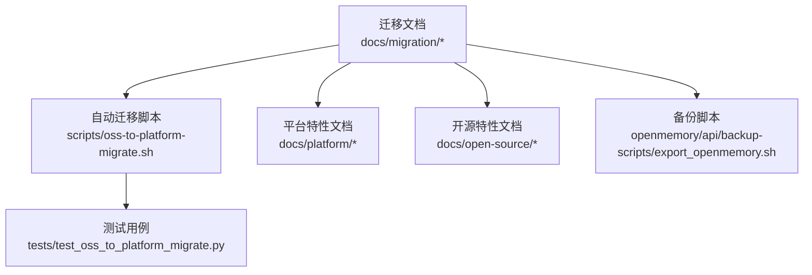
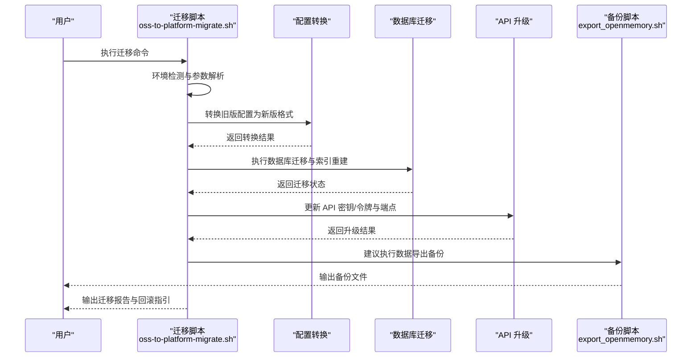
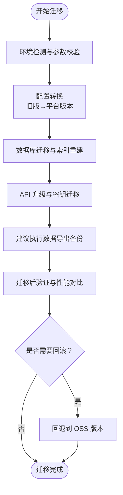
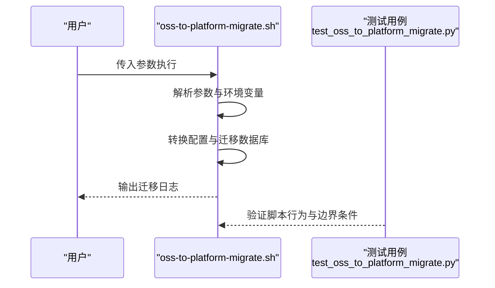
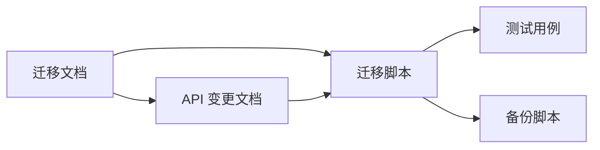

# 迁移指南

<cite>
**本文引用的文件**
- [oss-to-platform.mdx](file://docs/migration/oss-to-platform.mdx)
- [oss-to-platform-migrate.sh](file://scripts/oss-to-platform-migrate.sh)
- [test_oss_to_platform_migrate.py](file://tests/test_oss_to_platform_migrate.py)
- [openmemory.sh](file://openmemory/api/backup-scripts/export_openmemory.sh)
- [platform-v2-to-v3.mdx](file://docs/migration/platform-v2-to-v3.mdx)
- [oss-v2-to-v3.mdx](file://docs/migration/oss-v2-to-v3.mdx)
- [server-pgvector-upgrade.mdx](file://docs/migration/server-pgvector-upgrade.mdx)
- [api-changes.mdx](file://docs/migration/api-changes.mdx)
- [migration_guide_template.mdx](file://docs/templates/migration_guide_template.mdx)
</cite>

## 目录
1. [简介](#简介)
2. [项目结构](#项目结构)
3. [核心组件](#核心组件)
4. [架构总览](#架构总览)
5. [详细组件分析](#详细组件分析)
6. [依赖分析](#依赖分析)
7. [性能考虑](#性能考虑)
8. [故障排除指南](#故障排除指南)
9. [结论](#结论)
10. [附录](#附录)

## 简介
本指南面向从旧版本或不同平台迁移到 Mem0 最新版本的用户，重点覆盖从开源（OSS）版本到平台版本的迁移流程，包括数据迁移、配置转换与 API 升级。文档解释版本间变化与兼容性问题，提供自动迁移脚本使用方法与手动迁移步骤，并包含数据完整性检查、回滚策略、风险评估、新旧功能对应关系与替代方案，以及迁移后的验证方法与性能对比建议。

## 项目结构
与迁移相关的文档与脚本主要分布在以下位置：
- 文档：docs/migration 下包含多版本迁移与 API 变更说明
- 自动化脚本：scripts/oss-to-platform-migrate.sh 提供一键迁移能力
- 测试：tests/test_oss_to_platform_migrate.py 验证迁移脚本行为
- 备份工具：openmemory/api/backup-scripts/export_openmemory.sh 提供数据导出备份
- 平台/开源差异：docs/platform 与 docs/open-source 提供平台与开源特性对比

**图表来源**
- [oss-to-platform.mdx](file://docs/migration/oss-to-platform.mdx)
- [oss-to-platform-migrate.sh](file://scripts/oss-to-platform-migrate.sh)
- [test_oss_to_platform_migrate.py](file://tests/test_oss_to_platform_migrate.py)
- [export_openmemory.sh](file://openmemory/api/backup-scripts/export_openmemory.sh)

**章节来源**
- [oss-to-platform.mdx](file://docs/migration/oss-to-platform.mdx)
- [oss-to-platform-migrate.sh](file://scripts/oss-to-platform-migrate.sh)
- [test_oss_to_platform_migrate.py](file://tests/test_oss_to_platform_migrate.py)
- [export_openmemory.sh](file://openmemory/api/backup-scripts/export_openmemory.sh)

## 核心组件
- 迁移文档：提供 OSS 到平台版本的迁移路径、变更点与注意事项
- 自动迁移脚本：封装数据库迁移、配置转换、API 密钥与令牌处理等流程
- 测试用例：验证迁移脚本在不同场景下的正确性
- 备份脚本：提供数据导出与备份能力，支持回滚与恢复
- 版本升级文档：平台 v2→v3、OSS v2→v3、服务端 pgvector 升级等

**章节来源**
- [oss-to-platform.mdx](file://docs/migration/oss-to-platform.mdx)
- [oss-to-platform-migrate.sh](file://scripts/oss-to-platform-migrate.sh)
- [test_oss_to_platform_migrate.py](file://tests/test_oss_to_platform_migrate.py)
- [platform-v2-to-v3.mdx](file://docs/migration/platform-v2-to-v3.mdx)
- [oss-v2-to-v3.mdx](file://docs/migration/oss-v2-to-v3.mdx)
- [server-pgvector-upgrade.mdx](file://docs/migration/server-pgvector-upgrade.mdx)

## 架构总览
下图展示从 OSS 到平台版本迁移的整体流程：用户执行自动迁移脚本，脚本完成环境检测、配置转换、数据库迁移与 API 升级，最后输出迁移报告与回滚提示；同时可结合备份脚本进行数据保护。

**图表来源**
- [oss-to-platform.migrate.sh](file://scripts/oss-to-platform-migrate.sh)
- [export_openmemory.sh](file://openmemory/api/backup-scripts/export_openmemory.sh)

## 详细组件分析

### 组件 A：OSS 到平台版本迁移
- 迁移目标：将 OSS 版本的部署与数据迁移到平台版本，统一管理 API、组织与项目维度
- 关键流程：
  - 环境准备：检查依赖、确认数据库类型与版本
  - 配置转换：将旧版配置映射到平台版本的组织/项目/密钥模型
  - 数据迁移：执行数据库迁移脚本，同步用户、记忆体与元数据
  - API 升级：更新客户端与集成 SDK 的认证方式与端点
  - 回滚策略：保留旧版备份，必要时可回退至 OSS 版本
- 新旧功能对应关系：
  - 用户与实体：从全局用户模型迁移到组织/项目维度
  - 记忆体检索：平台版本提供更丰富的过滤、重排序与时间戳支持
  - Webhook：平台版本提供更完善的事件驱动机制
- 兼容性注意：
  - 某些开源特性在平台版本中以不同接口或权限模型实现
  - API 路径与鉴权方式发生变化，需同步更新客户端

**图表来源**
- [oss-to-platform.mdx](file://docs/migration/oss-to-platform.mdx)
- [oss-to-platform-migrate.sh](file://scripts/oss-to-platform-migrate.sh)
- [export_openmemory.sh](file://openmemory/api/backup-scripts/export_openmemory.sh)

**章节来源**
- [oss-to-platform.mdx](file://docs/migration/oss-to-platform.mdx)
- [oss-to-platform-migrate.sh](file://scripts/oss-to-platform-migrate.sh)

### 组件 B：自动迁移脚本使用
- 脚本定位：scripts/oss-to-platform-migrate.sh
- 主要能力：
  - 参数解析与环境检测
  - 配置文件转换与写入
  - 数据库迁移与索引重建
  - API 密钥与令牌更新
  - 输出迁移日志与回滚建议
- 使用建议：
  - 在生产环境前先在预生产环境演练
  - 结合备份脚本生成完整备份
  - 查看测试用例了解边界条件与错误处理

**图表来源**
- [oss-to-platform-migrate.sh](file://scripts/oss-to-platform-migrate.sh)
- [test_oss_to_platform_migrate.py](file://tests/test_oss_to_platform_migrate.py)

**章节来源**
- [oss-to-platform-migrate.sh](file://scripts/oss-to-platform-migrate.sh)
- [test_oss_to_platform_migrate.py](file://tests/test_oss_to_platform_migrate.py)

### 组件 C：平台版本升级（v2→v3）
- 升级范围：平台版本内部从 v2 升级到 v3
- 变更要点：
  - API 结构优化与字段调整
  - 权限与组织模型增强
  - 性能与稳定性改进
- 迁移建议：
  - 先在非生产环境验证 API 变更
  - 对客户端进行兼容性适配
  - 关注废弃字段与新增字段的处理

**章节来源**
- [platform-v2-to-v3.mdx](file://docs/migration/platform-v2-to-v3.mdx)

### 组件 D：OSS 版本升级（v2→v3）
- 升级范围：开源版本内部从 v2 升级到 v3
- 变更要点：
  - 内部架构与依赖更新
  - 向后兼容性与破坏性变更说明
- 迁移建议：
  - 逐版本升级，避免跨大版本跳跃
  - 验证向量库与嵌入模型配置

**章节来源**
- [oss-v2-to-v3.mdx](file://docs/migration/oss-v2-to-v3.mdx)

### 组件 E：服务端 pgvector 升级
- 升级范围：服务端数据库从旧版 pgvector 升级到新版本
- 变更要点：
  - 扩展与索引重建要求
  - 兼容性与性能影响
- 迁移建议：
  - 在维护窗口执行升级
  - 升级前后进行基准测试

**章节来源**
- [server-pgvector-upgrade.mdx](file://docs/migration/server-pgvector-upgrade.mdx)

### 组件 F：API 变更与兼容性
- 变更范围：平台版本与开源版本之间的 API 差异
- 变更要点：
  - 认证方式与鉴权模型变化
  - 请求/响应字段调整
  - 新增功能与废弃功能对照
- 迁移建议：
  - 对比 API 变更文档，逐项适配
  - 编写自动化测试覆盖关键接口

**章节来源**
- [api-changes.mdx](file://docs/migration/api-changes.mdx)

## 依赖分析
- 文档与脚本耦合：迁移文档指导脚本编写，脚本实现文档中的流程
- 测试与脚本耦合：测试用例覆盖脚本的关键分支与边界条件
- 备份与迁移耦合：迁移前建议执行备份，失败时用于回滚

**图表来源**
- [oss-to-platform.mdx](file://docs/migration/oss-to-platform.mdx)
- [oss-to-platform-migrate.sh](file://scripts/oss-to-platform-migrate.sh)
- [test_oss_to_platform_migrate.py](file://tests/test_oss_to_platform_migrate.py)
- [export_openmemory.sh](file://openmemory/api/backup-scripts/export_openmemory.sh)
- [api-changes.mdx](file://docs/migration/api-changes.mdx)

**章节来源**
- [oss-to-platform.mdx](file://docs/migration/oss-to-platform.mdx)
- [oss-to-platform-migrate.sh](file://scripts/oss-to-platform-migrate.sh)
- [test_oss_to_platform_migrate.py](file://tests/test_oss_to_platform_migrate.py)
- [export_openmemory.sh](file://openmemory/api/backup-scripts/export_openmemory.sh)
- [api-changes.mdx](file://docs/migration/api-changes.mdx)

## 性能考虑
- 迁移窗口规划：在低峰期执行数据库迁移与索引重建，减少对业务的影响
- 基准测试：迁移前后对检索延迟、吞吐量与资源占用进行对比
- 分批迁移：对大规模数据采用分批导入与增量同步策略
- 监控告警：迁移期间开启关键指标监控，异常时快速回滚

## 故障排除指南
- 常见问题与处理：
  - 配置转换失败：检查旧版配置格式与必填字段，参考迁移文档的映射规则
  - 数据库迁移中断：查看迁移日志，修复约束后再继续；必要时回滚到备份
  - API 升级不生效：核对鉴权头与端点，确保客户端已适配新 API
- 回滚策略：
  - 使用备份脚本恢复数据
  - 回退到迁移前的 OSS 版本镜像
  - 逐步撤销最近的配置与数据库变更
- 风险评估：
  - 数据一致性：迁移前后进行抽样校验
  - 业务连续性：制定最小停机窗口与快速回切预案
  - 客户端兼容性：提前在测试环境验证所有集成点

**章节来源**
- [oss-to-platform.mdx](file://docs/migration/oss-to-platform.mdx)
- [oss-to-platform-migrate.sh](file://scripts/oss-to-platform-migrate.sh)
- [export_openmemory.sh](file://openmemory/api/backup-scripts/export_openmemory.sh)

## 结论
通过本迁移指南，用户可以系统地完成从 OSS 到平台版本的迁移，涵盖配置转换、数据迁移、API 升级与回滚策略。建议在非生产环境先行演练，结合备份与测试用例保障迁移质量，并在迁移完成后进行性能与功能验证。

## 附录
- 迁移模板：docs/templates/migration_guide_template.mdx 提供标准化迁移文档结构
- 相关文档：docs/platform 与 docs/open-source 提供平台与开源特性对比，便于理解新旧差异

**章节来源**
- [migration_guide_template.mdx](file://docs/templates/migration_guide_template.mdx)
- [oss-to-platform.mdx](file://docs/migration/oss-to-platform.mdx)